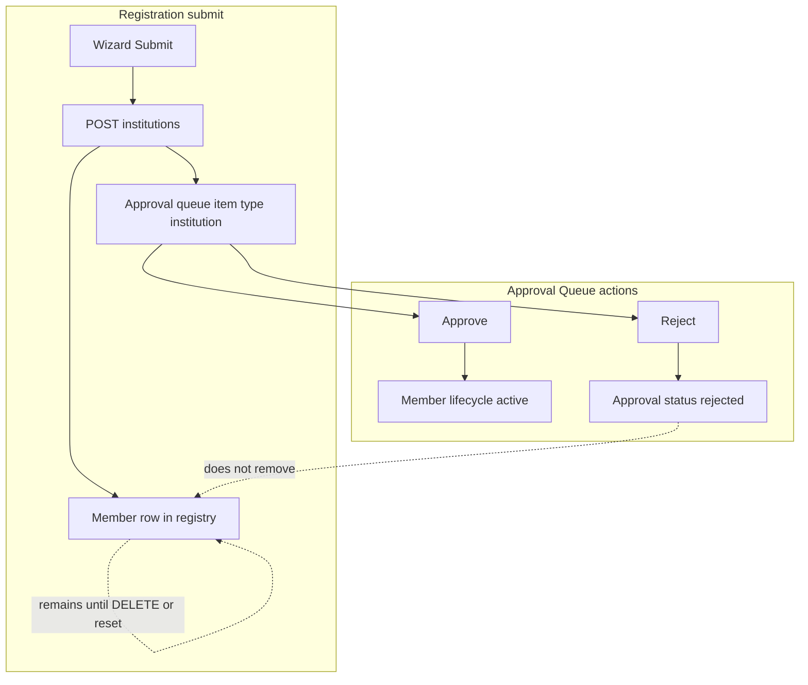
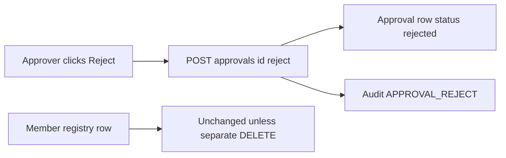
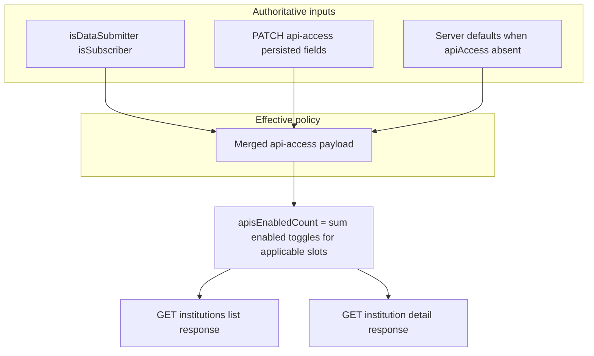
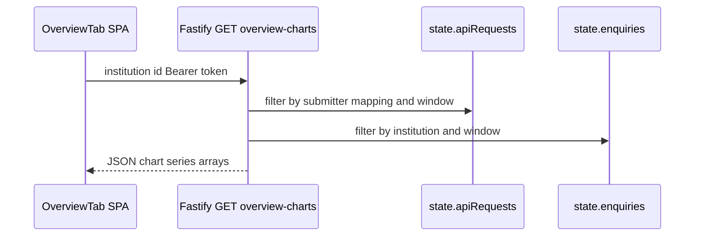

# Business Requirements Document (BRD)
# Hybrid Credit Bureau (HCB) Admin Portal

**Document Type:** Business Requirements Document (BRD)
**Classification:** Internal – Board & Audit Ready
**Version:** 2.16
**Status:** Updated – **v2.16** records **registration number** as **system-assigned** on **POST /institutions** when omitted (read-only wizard field; **Spring** generator). **v2.15** records **Register member** as a **Member Management** sidebar sub-item (`/institutions/register`); the Member Institutions list no longer shows a duplicate register CTA in the header. **Roles & Permissions** remains **section-scoped** for **Member Management** (`members` in `nav-config`). **v2.14** records **Spring list API hardening**: JDBC for **consortiums**, **products**, **reports**, **SLA configs**, **alert rules**, **users**, and **audit logs** aligned to **`create_tables.sql`**; **`AuthUserPrincipal`** in controllers; **TDL-018**, **API-UI-Parity-Matrix** v1.7, **SPA-Service-Contract-Drift**, **Canonical-Backend**, **Testing-Plan** v3.0.6, **`RouteParitySqliteIntegrationTest`** extension. **v2.13** records **institution display convention** (**legal name** before **trading name**); **API-UI-Parity-Matrix** v1.6, **TDL-017**. **v2.12** records **Spring–SPA HTTP parity** for **overview charts**, **drift alerts**, **member sub-resources**, **API keys POST**, **user deactivate**; **TDL-016**. **v2.11**–**v2.4** as in the document control table.
**Last Updated:** 2026-04-02
**Author:** Enterprise Business Analysis
**Stakeholder Approval:** [To be completed]

---

## Document Control

| Version | Date       | Author/Role        | Description of Changes                                                                 | Approved By |
|---------|------------|--------------------|----------------------------------------------------------------------------------------|-------------|
| 2.16    | 2026-04-02 | Product / Engineering | **Member registration — registration number:** Operator does not type bureau **registration number**; API assigns when omitted. Wizard field read-only; **Spring** **`InstitutionRegistrationNumberGenerator`**. | —           |
| 2.15    | 2026-04-02 | Product / Engineering | **Navigation — Register member:** Sidebar **Member Management** includes **Register member** (`/institutions/register`) between Member Institutions and Consortiums; list page header no longer duplicates the action. **`nav-config`** updated for catalogue alignment; RBAC matrix unchanged (section-level **members**). | —           |
| 2.14    | 2026-03-31 | Product / Engineering | **Spring list APIs + auth principal:** JDBC alignment for high-traffic **GET** routes (consortiums, products, reports, SLA configs, alert rules, users, audit logs) to canonical SQLite DDL; flat audit/user JSON for SPA contract; **`AuthUserPrincipal`** on controllers. **Technical-Decision-Log** TDL-018; **SPA-Service-Contract-Drift**, **Canonical-Backend**, **Spring-SPA-Route-Inventory**, **Developer-Handbook**, **Testing-Plan**; **API-UI-Parity-Matrix** v1.7. | —           |
| 2.13    | 2026-03-31 | Product / Engineering | **Institution labels:** Single-string member labels in the portal and dashboard command-center APIs prefer **legal name** over **trading name** (SPA `institutionDisplayLabel`, Spring `DashboardController` SQL, Fastify registration copy). **API-UI-Parity-Matrix** v1.6; **Technical-Decision-Log** TDL-017; **Canonical-Backend** dashboard note. | —           |
| 2.12    | 2026-03-31 | Product / Engineering | **Spring route parity (product contract):** **`GET …/institutions/:id/overview-charts`** and **`GET …/data-ingestion/drift-alerts`** on Spring; member **consortium / products / billing / api-access / consent** sub-APIs; **`POST /api/v1/api-keys`**; **`POST /api/v1/users/:id/deactivate`**. Doc updates: **Spring-SPA-Route-Inventory**, **SPA-Service-Contract-Drift**, **API-UI-Parity-Matrix** v1.5, **Canonical-Backend**, **Testing-Plan**, **Technical-Decision-Log** TDL-016. | —           |
| 2.11    | 2026-03-31 | Product / Engineering | **Docs — Spring-first local dev:** **Developer Handbook** v2.0 and **README** §11 describe **Spring 8090** as default; **Canonical-Backend** / **Testing-Plan** cover **dashboard command-center** SQLite JDBC fixes + **`DashboardCommandCenterSqliteIntegrationTest`**; JDBC **`UserDetails`** login note. **API-UI-Parity-Matrix** appendix: Spring authoritative for default SPA. | —           |
| 1.0     | 2026-03-18 | Business Analyst   | Initial BRD                                                                            | —           |
| 2.0     | 2026-03-25 | Business Analyst   | Added Data Products module, Consortium Management, Enquiry Simulation, Institution Detail extensions (Consortium Memberships tab, Product Subscriptions tab); enhanced exception scenarios with sample data; typography and UI consistency standards documented. | —           |
| 2.1     | 2026-03-27 | Enterprise Business Analysis | Added enterprise use cases (multi-country, multi-bureau, alternate data monetization); upgraded performance targets to production-grade (99.9% uptime, 5M API calls/day); enhanced security requirements (RBAC, ABAC, PII, consent enforcement, JWT best practices, API key lifecycle); added missing feature modules roadmap (CBS Integration, Live Enquiry, Scheduled Reporting, Multi-Bureau Comparison, Consumer Portal); aligned mock data architecture to JSON-only layer. | —           |
| 2.2     | 2026-03-27 | Product / Engineering | **Platform feature enhancements (admin UX):** Renamed **Institution Management** to **Member Management** in navigation and key screens; data products tied to **Schema Mapper source types** with raw vs derived packet configuration and **Latest/Trended** enquiry mode; governance dashboard prioritizes period selection and **validation by member institution**; removed override/auto-accept trend from mock scope; validation rules reference **source types** from the schema registry; data quality monitoring adds **filters and institution comparison**; monitoring adds **calendar date range** and **role-appropriate institution filters**; user admin **drops institution** from list/invite; **Roles & Permissions** modeled as **navigation section × CRUD/export** matrix; member **billing CSV** by month/year; member **reports** aligned to central reporting catalogue; shared **institution filter** component for monitoring/governance. | —           |
| 2.3     | 2026-03-28 | Product / Engineering | **Documentation & data alignment:** **Data Quality Monitoring** — `driftAlerts` mock records in `data-governance.json` refreshed to **March 2026** ISO timestamps and **source names aligned to Schema Mapper registry** so default date range (start of current month → today) and **Source type** filter return non-empty results; drift alert schema documented (id, type, source, message, timestamp, severity). **Data Products (product form)** — packets grouped by **category**; each group shows **distinct Schema Mapper source types** once (sorted labels); packet rows emphasize **packet label + description** with per-packet **Configure** (Raw vs Derived field selection) and **Enquiry settings** (scope, **Latest vs Trended**). **Navigation** — sidebar copy finalized: **Member Management** with sub-items **Member Institutions** (`/institutions`) and **Consortiums**; legacy `/institutions/data-submitters` and `/institutions/subscribers` redirect to unified list. | —           |
| 2.10    | 2026-03-31 | Product / Engineering | **Schema Mapper — LLM Field Intelligence:** Operators **edit PII** (**Yes/No**) per source field in the mapping review grid; the portal persists **`containsPii`** on each **`fieldMappings`** row via **`PATCH /api/v1/schema-mapper/mappings/:id`** (dev API stores the full array). Supports compliance review workflows (see **Governance** copy on later wizard steps). Technical: [Canonical-Backend.md](./technical/Canonical-Backend.md), [API-UI-Parity-Matrix.md](./technical/API-UI-Parity-Matrix.md). | —           |
| 2.9     | 2026-03-31 | Product / Engineering | **Schema Mapper — Step 1 UX:** **Source Ingestion** and **Source Definition** screens **no longer display** the raw **`GET /api/v1/schema-mapper/wizard-metadata`** string as footnote text under **Source Type**; operators still receive lists from that configuration endpoint (or equivalent mock fallback) without API-path clutter. | —           |
| 2.8     | 2026-03-31 | Product / Engineering | **Data Products — packet row & modal:** **One** **Configure** button per **source-type** row (not per catalogue packet). Rows show **source-type label** only—**no** secondary packet-name lines under the row. **`PacketConfigModal`** opens with the **catalogue-ordered packet id list** for that row; when **multiple** packets share the type, a **Packet** control in the modal switches the active catalogue entry; **Save configuration** updates **`packetConfigs`** for **every** packet in the group. **Register member — Step 3 Review:** field value text uses **`text-body`** consistently (implementation avoids merging **`text-body`** with colour utilities via **`cn`/`tailwind-merge`**, which previously dropped the size token). Technical: [Canonical-Backend.md](./technical/Canonical-Backend.md), [API-UI-Parity-Matrix.md](./technical/API-UI-Parity-Matrix.md). | —           |
| 2.7     | 2026-03-31 | Product / Engineering | **Validation Rules** + **Schema Mapper wizard Step 1:** members from **`GET /api/v1/institutions?role=dataSubmitter`**; rule fields from **`source-type-fields`**; wizard **Source Type** / **Data Category** from **`GET /api/v1/schema-mapper/wizard-metadata`** (**`wizardSourceTypeOptions`** / **`wizardDataCategoryOptions`** in **`schema-mapper.json`**). Dev seed **`parsedFields`** per type (`bank` / `gst` / `custom` / telecom / utility). **Data Products — packet UI & PacketConfigModal:** Rows use **source-type label** only (no “Source types:” prefix); **no catalogue descriptions** on the card. **Configure:** **Raw** = **source-type-fields** ∪ catalogue paths; **Sources** = **`GET /api/v1/schema-mapper/schemas?sourceType=`**; **sr-only** dialog title; **Derived** field names from each catalogue row’s **`derivedFields`** ( **`GET /api/v1/products/packet-catalog`** / seed JSON). Technical: [Canonical-Backend.md](./technical/Canonical-Backend.md), [API-UI-Parity-Matrix.md](./technical/API-UI-Parity-Matrix.md), [Testing-Plan.md](./technical/Testing-Plan.md). | —           |
| 2.6     | 2026-03-31 | Product / Engineering | **Data Quality Monitoring — API-backed drift alerts:** Drift list and drift KPI counts load from **`GET /api/v1/data-ingestion/drift-alerts`** (JWT). **Spring (v2.12+):** **`ingestion_drift_alerts`** + **`DataIngestionController`**. **Fastify:** in-memory store seeded from **`data-governance.json`** and appended on ingest / mapping. Filters (**date range**, **source type**) are applied server-side. SPA mock fallback remains for offline demos when enabled. Technical: [Canonical-Backend.md](./technical/Canonical-Backend.md). | —           |
| 2.5     | 2026-03-29 | Product / Engineering | **Schema Mapper Agent (dev API):** Documents implemented **Fastify** routes under **`/api/v1/schema-mapper`** for schema ingest, asynchronous AI/heuristic mapping jobs, human-editable mappings, validation rules, and **submission to the existing approval queue** as **`type: schema_mapping`** with **`metadata.mappingId`**. Super Admin **approve / reject / request changes** transitions mapping lifecycle states (**active** / **rejected** / **needs_review**) with audit alignment. **Optional OpenAI** use is environment-gated; **human-in-the-loop** remains mandatory before production activation. Technical detail: [Canonical-Backend.md](./technical/Canonical-Backend.md), [AI-Governance-Framework.md](./technical/AI-Governance-Framework.md). | —           |
| 2.4     | 2026-03-29 | Product / Engineering | **Member registry & governance truth:** Documents **implemented** behaviour for **(1)** separation of **durable member rows** vs **approval queue items** — rejecting an institution approval **does not** remove the member from the registry (explicit DELETE or in-memory reset only). **(2)** **APIs enabled** column and overview KPIs: value is **derived** from **API & Access** toggles (Data Submission + Enquiry) and shown as **`enabledCount / slotCount`** (up to two slots for dual-role members), not a legacy fixed “/3” denominator. **(3)** **Overview tab** trend charts: fed by **`GET /api/v1/institutions/:id/overview-charts`** — **member-scoped**, **rolling 30 days**, aligned with Monitoring filters; **empty** series when no traffic / no API-key mapping. **(4)** **FR-API1** gap: current portal surfaces **one** consolidated Data Submission API card plus Enquiry (not three separate Bulk/SFTP cards). **(5)** **Spring Boot** alternate backend: `overview-charts` route **not** implemented — documented in technical drift matrix. BRD §3.4 adds diagrams; §6.14 adds formal FR-* v2.4 rows; §8.1/8.2 data rules extended. | —           |

**Distribution List:** Product Owner, Engineering Lead, Compliance Officer, Risk Manager, QA Lead, Project Sponsor.

**References:**
- HCB Product Vision Document
- Data Governance Policy (internal)
- Regulatory requirements (CBK, SASRA, data protection)
- UI Design Guidelines (`DESIGN_GUIDELINES.md`)

---

## 1. Executive Summary

The **Hybrid Credit Bureau (HCB) Admin Portal** is an enterprise web application that enables centralized administration of a hybrid credit bureau ecosystem. The portal supports two primary institution participation types — **Data Submission Institutions** (supplying credit data) and **Subscriber Institutions** (consuming credit and alternate data) — with institutions able to hold one or both roles.

The system provides institution onboarding and configuration governance, API and access management, consent and billing configuration for subscribers, data governance (schema mapping, validation rules, match review, data quality monitoring), monitoring and reporting, consortium management for multi-institution data sharing agreements, a data products catalogue with pricing and lifecycle management, an enquiry simulation tool for testing product responses before going live, and full auditability of all actions.

Version 2.0 of this BRD documents the newly released capabilities as of 25 March 2026: **Data Products module** (product configurator + enquiry simulation), **Consortium Management** (list, detail, wizard), and **Institution Detail extensions** (Consortium Memberships tab, Product Subscriptions tab). These capabilities enable HCB to offer a structured product marketplace where institutions can subscribe to configured data products backed by packet-level data from the bureau and consortiums.

**Version 2.3 (28 March 2026)** adds business-readable detail for **mock-data alignment** and **operator UX**: drift alerts in Data Quality Monitoring use **current-period** timestamps and **registry-aligned** source names so demos show real list content; the **Data Products** create/edit experience documents **distinct source types per category**, per-packet configuration, and **enquiry** settings; **Member Management** routes and sidebar labels are consolidated per §3.3.

**Version 2.4 (29 March 2026)** aligns the BRD with **live Fastify dev API** behaviour for **member lifecycle**, **approval rejection**, **API enablement metrics**, and **overview analytics** so operators, auditors, and engineering do not assume behaviours that the code does not implement (e.g. auto-deletion on reject, static chart templates per member, or a fixed “three APIs” denominator). Full narrative, acceptance notes, and diagrams are in **§3.4**; formal requirement rows in **§6.14**.

**Version 2.5 (29 March 2026)** records the **Schema Mapper Agent** as an implemented **dev API** capability: ingest and version alternate submitter schemas, run **governed** mapping jobs (heuristic baseline, optional LLM assist), edit mappings and validation rules, and route **activation** through the **same Super Admin approval queue** used for institutions and products, preserving **auditability** and **segregation of duties**.

**Version 2.10 (31 March 2026)** adds **editable PII classification** in **Schema Mapper** **LLM Field Intelligence**: each row’s **PII** column is a **Yes/No** control, and the choice is stored with the mapping as **`containsPii`** so governance and compliance reviewers can rely on operator-attested flags before approval.

**Version 2.9 (31 March 2026)** streamlines **Schema Mapper** wizard Step 1 copy: **Source Type** options remain **tenant-backed** via **`wizard-metadata`**, but the UI **does not** surface the REST URL as inline helper text (reduces noise for bureau operators).

**Version 2.8 (31 March 2026)** tightens **Data Products** operator UX: **one** **Configure** action per **source-type** packet row (combined field-count badge), **`PacketConfigModal`** scoped to the **packet id group** with an in-modal **Packet** switcher when several catalogue entries share a **Schema Mapper** type, and **Save** persisting **`packetConfigs`** for the whole group. **Register member** Step 3 review aligns read-only value typography with the summary block (**`text-body`**) without **Tailwind** merge edge cases.

---

## 2. Business Context and Objectives

### 2.1 Business Context

- **Industry:** Fintech / Credit Bureau / Financial Data Services
- **Domain:** Central admin platform for a hybrid credit bureau that aggregates data from multiple institutions and provides credit and alternate data services to subscribers.
- **Problem Statement:** Regulated institutions (banks, NBFIs, credit unions) need a single, secure, auditable portal to onboard, configure, and operate as either data submitters or data subscribers (or both), while the bureau operator needs governance, monitoring, and compliance controls. Subscriber institutions need a product catalogue to discover, subscribe to, and test data products. Bureau operators need consortium governance to manage multi-institution data sharing agreements.
- **Strategic Alignment:** The portal is the primary control plane for HCB operations, supporting regulatory compliance, SLA management, revenue (billing) for subscriber usage, and consortium data governance.

### 2.2 Business Objectives

| ID   | Objective                                                                                       | Success Measure / KPI                                       |
|------|-------------------------------------------------------------------------------------------------|-------------------------------------------------------------|
| BO-1 | Enable dual-role institution lifecycle (Data Submitter and/or Subscriber)                       | % of institutions onboarded with correct role(s)            |
| BO-2 | Centralize configuration and API access management per institution                              | Reduction in manual config errors; audit coverage           |
| BO-3 | Support consent and billing configuration for subscriber institutions                           | Consent policy adherence; billing dispute rate              |
| BO-4 | Provide data governance (mapping, validation, match review, quality)                            | Mapping approval cycle time; data quality score             |
| BO-5 | Deliver operational visibility (monitoring, reports, audit trail)                               | Time to detect incidents; audit log completeness            |
| BO-6 | Ensure auditability and compliance readiness                                                    | Audit findings; regulatory exam readiness                   |
| BO-7 | Provide a configurable data products catalogue with pricing and lifecycle management            | Products published; subscriber adoption rate                |
| BO-8 | Enable consortium governance for multi-institution data sharing                                 | Active consortiums; records shared per consortium           |
| BO-9  | Provide pre-production enquiry simulation for subscriber testing                                | Reduction in go-live issues; simulation usage rate          |
| BO-10 | Enable multi-country deployment with configurable regulatory profiles                          | Countries deployed; regulatory variance handled per-country |
| BO-11 | Support multi-bureau integration (CRIF, Experian, TransUnion, local bureaux)                   | Bureau sources integrated; response latency per provider    |
| BO-12 | Monetize alternate data streams (telecom, utility, GST, bank statements) as standalone products | Alternate data revenue; data source activation rate         |
| BO-13 | Achieve production-grade availability and throughput (99.9% uptime, 5M API calls/day)          | Monthly uptime SLA; peak API throughput achieved            |

---

## 3. Scope

### 3.1 In Scope

| Area                                    | Description |
|-----------------------------------------|-------------|
| **Authentication**                      | Login (email/password); session handling; protected routes; logout. |
| **Dashboard**                           | Executive KPIs (API volume, error rate, SLA health, data quality); API usage trend; success vs failure; mapping accuracy; match confidence; SLA latency; rejection/override; recent activity; top institutions. |
| **Member Management** (formerly Institution Management) | List (all / Data Submitters / Subscribers); filters (status, search); registration wizard (corporate details, participation type, compliance documents, review); member detail with role-based tabs; overview and tabs enhanced per v2.2 (stats sections, billing CSV period, reports from reporting catalogue, monitoring date range). |
| **Institution Detail – Common**         | Overview (corporate details, compliance docs, role-based KPIs; **trend charts** from **per-member** `overview-charts` API, **30d**); API & Access (**Data Submission** + **Enquiry** cards per role, keys, rate limits, IP whitelist — see **§3.4.5** / **§6.14**); Consortium Memberships tab (NEW); Product Subscriptions tab (NEW); Monitoring; Reports; Audit Trail; Users. |
| **Institution Detail – Subscriber-only**| Alternate Data (source cards, enable, rate, consent, usage); Consent Configuration (policy, expiry, scope, capture mode, failure metrics); Billing (model, pricing table, usage charts, export reports). |
| **Data Governance**                     | Dashboard; Schema Mapper / Auto-Mapping Review; Validation Rules; Match Review; Data Quality Monitoring; Governance Audit Logs. |
| **Consortium Management (NEW)**         | Consortium list (search, filter, status badges); Consortium detail (Overview, Members, Data Contribution tabs); Consortium creation/edit wizard (Basic info, Members, Policy, Review steps). |
| **Data Products (NEW)**                 | Product Configurator list (search, filter by status); Product detail (info, included packets, pricing, usage metrics); Product create/edit form; Enquiry Simulation tool. |
| **Enquiry Simulation (NEW)**            | Form-based request builder; live Request JSON preview; Run action with 600ms simulation delay; Response JSON viewer with bureau/banking/consortium packet breakdown. |
| **Navigation & UX**                     | Sidebar (Dashboard, **Member Management** with sub-nav: Member Institutions, **Register member**, Consortiums; Data Products; Agents; Data Governance; Monitoring; Reporting; Audit Logs; Approval Queue; User Management); responsive layout; consistent compact typography. |
| **Audit & Compliance**                  | Institution-level audit trail; governance audit logs; immutable event records. |

### 3.2 Out of Scope (Explicit Exclusions)

| Item | Rationale |
|------|-----------|
| Real-time backend APIs and persistence | BRD covers portal capabilities; backend implementation is a separate deliverable. |
| Production SSO/LDAP/MFA integration | Login is in scope; enterprise IdP integration is a future phase. |
| Full Monitoring/Reporting/Audit Logs/User Management backend | Partial UI exists; full backend and feature parity are out of scope for this BRD phase. |
| CBS Integration module | Referenced in navigation; detailed requirements are out of scope. |
| Mobile native applications | Web-only; responsive web is in scope. |
| Consumer-facing credit report or dispute portal | Admin portal only. |
| Automated credit scoring or decision engines | Not part of admin portal. |
| Live bureau API calls from Enquiry Simulation | Simulation uses mock payloads only in V1. |

**Clarification (as of 2026-Q1, this repository):** Local development targets **Spring Boot** (`backend/`, port **8090**) with **JWT auth** and **SQLite** (dev) / **PostgreSQL** (prod). A **legacy Fastify** stack (`server/`, port **8091**, in-memory) remains for comparison. Production bureau hardening (SSO, scale-out, full regulatory scope) is still a **separate delivery** per the rows above. See [Canonical-Backend.md](technical/Canonical-Backend.md).

### 3.3 Release v2.3 — Platform, Mock Data, and UX Detail (2026-03-28)

This subsection records **implemented** behaviour and **fixture alignment** so business readers, auditors, and engineering share one definition of what the SPA demonstrates today.

#### Data Quality Monitoring — Schema & mapping drift alerts

| Topic | Detail |
|-------|--------|
| **Business intent** | Surface time-bound alerts when ingest schemas or field mappings diverge from approved definitions, so governance can act before downstream quality degrades. |
| **User-facing filters** | **Date from / Date to** (defaults: first day of current calendar month → today); **Submitter institution** (all submitters from master list); **Compare to** (optional second institution for trend overlay); **Source type** (from Schema Mapper registry, or All). |
| **API & seed contract** | **`GET /api/v1/data-ingestion/drift-alerts`** (JWT): **Spring** serves **`alerts`** from **`ingestion_drift_alerts`** (`seed_data.sql`, aligned with **`data-governance.json`** `driftAlerts`). **Legacy Fastify** uses in-memory **`state.ingestionDriftAlerts`**. **New alerts** may be appended when **`POST /api/v1/schema-mapper/ingest`** succeeds and when **mapping jobs** complete (behaviour may differ slightly per stack — see **Canonical-Backend**). Each item: `id`, `type` (`schema` \| `mapping`), `source`, `message`, `timestamp`, `severity`. Query params **`dateFrom`**, **`dateTo`**, **`sourceType`** mirror the page filters. |
| **v2.3 data refresh** | Historical fixtures used **2025-02** timestamps; the page filters by the **selected calendar range**, so alerts fell outside the default window and the card showed an empty state. **v2.3** replaces the set with **eight** alerts dated **March 2026**, with `source` values chosen to match registry names (e.g. telecom, bank, utility, GST, MFI) so **Source type** filtering remains meaningful. |
| **Acceptance (demo)** | With the dev API running and default dates in March 2026, the drift list is **non-empty**; narrowing **Source type** shows a subset whose `source` matches names under that type in the live Schema Mapper registry. **Offline:** when mock fallback is enabled, the SPA may still filter the JSON seed client-side. |

#### Data Products — Create / Edit product form

| Topic | Detail |
|-------|--------|
| **Business intent** | Let operators compose a sellable product from internal catalogue packets, control which fields are exposed (raw ingest vs derived), and define enquiry behaviour for subscribers. |
| **Packet catalogue linkage** | **`GET /api/v1/products/packet-catalog`** serves **`productCatalogPacketOptions`** from **`data-products.json`**, aligned with Schema Mapper **`sourceType`**; each row includes **`derivedFields`** for the Configure modal. Spring **`backend/`** mirrors the route from **`catalog/product-packet-catalog.json`** (keep in sync with the SPA JSON). The form **excludes** **`custom`** source types and **Synthetic / Test** from the main list, **dedupes** by **category + sourceType** (one checkbox row per distinct type). The primary line on each row is the **human-readable Schema Mapper source-type label** only (e.g. Bank, Telecom). |
| **Packet rows** | **Catalogue descriptions** are not shown on the card. **No** secondary lines listing individual packet titles under the source-type label. **One** **Configure** control per row opens configuration for **all** selected packets in that source-type group. **Packet order** UI is removed; persisted **`packetIds`** are ordered in catalogue order. |
| **Configure modal** | **`PacketConfigModal`** receives the **packet id list** and resolved **`catalogOptions`** (API catalogue or static seed). **Raw** fields: **`GET /api/v1/schema-mapper/schemas/source-type-fields?sourceType=`** merged with packet-only paths from the catalogue (shared **sourceType** within the row). **Sources:** **`GET /api/v1/schema-mapper/schemas?sourceType=`** (registry names, links to Auto Mapping Review). **Derived** checklist = the active packet’s **`derivedFields`** from the catalogue; when the row has **multiple** packets, a **Packet** switcher (catalogue labels) selects which packet is active. **Save configuration** writes **`packetConfigs`** for **each** packet in the group. |
| **Enquiry configuration** | Product-level **enquiry settings** include **data coverage scope** (e.g. SELF, NETWORK, CONSORTIUM, VERTICAL) and **Latest vs Trended** mode so the mock product preview JSON reflects subscriber-facing behaviour. |
| **Persistence (canonical Spring API)** | With `npm run spring:start` (port **8090**) and the SPA calling the API, **Save product** issues `POST /api/v1/products` / `PATCH /api/v1/products/:id` with `packetIds`, `packetConfigs`, and `enquiryConfig`. New products default to **`approval_pending`**, which **enqueues** a **`product`** row on `GET /api/v1/approvals` (`metadata.productId`). State is **durable** in SQLite/Postgres. Legacy Fastify behaviour was in-memory only. |

#### Consortium Management — Create / edit wizard (Fastify dev API)

| Topic | Detail |
|-------|--------|
| **Persistence** | **Create consortium** uses `POST /api/v1/consortiums` with `members`, `dataPolicy`, and `status: approval_pending` (also the server default when `status` is omitted). The API stores the consortium, applies members, and **enqueues** a **`consortium`** approval (`metadata.consortiumId`). **Approve** sets consortium **`active`**; **reject** / **request changes** set **`pending`** (listed as “Draft” in the UI until activated). In-memory only unless using Spring with a separate implementation. |

#### Member registration — Register member wizard (Fastify dev API)

| Topic | Detail |
|-------|--------|
| **Configuration (geography)** | **`GET /api/v1/institutions/form-metadata?geography=<id>`** returns **`registerForm`** so Step 1 (entity, regulatory, contact, participation, consortium) is defined per **operating geography / tenant** — field list, validation constraints, enum options, and single vs multi-select. Dev seeds this from **`src/data/institution-register-form.json`**. **`POST /api/v1/institutions?geography=<id>`** validates against the same configuration. |
| **Persistence** | `POST /api/v1/institutions` creates the member with **`pending`** lifecycle status (when the wizard sends it), stores compliance docs via follow-up `POST …/documents`, and **enqueues** an **`institution`** approval item (`metadata.institutionId`). |
| **List visibility** | The member list calls the API with a **large page size** (200) so the new **pending** row is not missing from the first page. After submit, the SPA returns to **`/institutions`** and refreshes **institutions** + **approvals** caches. |
| **Approval** | **Approve** in the queue sets the member to **`active`** and invalidates the institution list so status badges update. |
| **Review step (Step 3) typography** | Read-only field values use the same compact **body** scale as the participation/consortium summary. Implementation detail: avoid composing **`text-body`** with dynamic colour classes through **`tailwind-merge`** (e.g. **`cn("text-body", condition ? "text-foreground" : "text-muted-foreground")`**) because the merge library can drop the custom **`text-body`** token; use a single **`className`** string or **`clsx`** without merge for that element. |

#### Member Management — Routes

| Route | Behaviour |
|-------|-----------|
| `/institutions` | Primary **Member Institutions** list (all participation types; title reflects unified registry). |
| `/institutions/data-submitters`, `/institutions/subscribers` | **Redirect** to `/institutions` (unified list; role-specific URLs retained for bookmarks). |

### 3.4 Release v2.4 — Member registry, approval semantics, API metrics, and overview analytics (2026-03-29)

This subsection is the **authoritative business description** of behaviours implemented in the **in-repo Fastify dev API** (`server/src/index.ts`) and the **React SPA** when `VITE_USE_MOCK_FALLBACK=false` and the API is reachable. It supersedes informal assumptions that members “disappear” when an approver rejects a queue item, or that list KPIs are copied from static JSON per member.

#### 3.4.1 Two parallel artefacts: member row vs approval item

When an operator completes **Register New Institution**, the system performs **two** persistent actions (conceptually):

1. **Member registry row** — A record is created in the **institutions** store immediately (lifecycle status typically **`pending`** unless the wizard sends another value). The row is visible on **Member Institutions** (`GET /api/v1/institutions` with a large page size so new rows are not clipped).
2. **Approval queue item** — A **`type: institution`** item is enqueued (`metadata.institutionId` points at the new row). Approvers act on **this** item in **Approval Queue**.

These artefacts have **independent lifecycles** after creation: updating the approval record does **not** imply the registry row was removed.

#### 3.4.2 Rejecting an institution approval does **not** delete the member

**Business rule (as implemented):** **`POST /api/v1/approvals/:id/reject`** marks the **approval** as rejected and records the reason. For **institution** approvals, the handler **does not** soft-delete the member, change `isDeleted`, or roll back the registry row.

**Removal paths** (dev API today):

| Path | Effect |
|------|--------|
| **`DELETE /api/v1/institutions/:id`** | Soft-delete (`isDeleted = true`); member hidden from list/detail. |
| **API process restart** | In-memory state reloaded from seed JSON — **runtime-created** members are **gone** (demo reset). |

**Operational implication:** If policy requires that a **rejected registration must not appear** in the member directory, product must either (a) implement **reject → soft-delete** (or **reject → hidden draft**) in the API, or (b) train operators to **DELETE** the member after rejection. The BRD now records the **as-is** contract to avoid false expectations.

#### 3.4.3 “APIs enabled” metric — derived from API & Access, not static seed

The **Member Institutions** table column **APIs enabled** and the **Overview** KPI strip must reflect **actual** toggle state on **API & Access** (Data Submission API and Enquiry API), not a stale integer from initial JSON seed or from POST defaults alone.

**Slot model (current portal):**

- **+1 slot** if `isDataSubmitter` — controls **Data Submission API** (`enabled` flag, rate limit, IP whitelist).
- **+1 slot** if `isSubscriber` — controls **Enquiry API**.

**Displayed value:** `apisEnabledCount / slotCount` (e.g. `2/2` when both roles and both toggles on). If the member has **neither** role (edge case), the UI shows **—** (no slots). This replaces a legacy **“/3”** presentation that implied three independent integrations without matching the current tab UI.

**Cache consistency:** After **PATCH …/api-access**, the SPA invalidates **institution detail**, **API access**, and the **institutions list** query so the table column updates without a full reload.

#### 3.4.4 Overview tab — member-scoped analytics (30 days)

**Overview** trend charts (submission volume, success vs rejected, rejection reasons, processing time; enquiry volume, success vs failed, response time) are loaded from **`GET /api/v1/institutions/:id/overview-charts`**.

**Aggregation rules (Fastify):**

- **Window:** rolling **30 calendar days** ending “now” (server clock).
- **Submission series:** same **institution scoping** as Monitoring → Data Submission API (`api_key` → `dataSubmitterIdByApiKey` → member id). Members **without** mapped keys show **empty** volume / pie / bar / line series (and **empty-state** copy where charts would mis-render).
- **Enquiry series:** same filtering as Monitoring enquiries (`institution_id` or institution **name** match).

**Spring Boot note:** **`GET /api/v1/institutions/:id/overview-charts`** is **implemented** on Spring (**`InstitutionController`**, JDBC aggregates, last 30 days). The sequence diagram above describes the **legacy Fastify** data path; the **JSON response shape** is the same contract the SPA consumes. See `docs/technical/Spring-SPA-Route-Inventory.md`.

#### 3.4.5 API & Access tab — scope vs legacy BRD §6.8 FR-API1

**Legacy FR-API1** required **three** submitter cards: Submission, Bulk, SFTP. **Current product** consolidates submission integration into **one** “Data Submission API” card (toggle, rate limit, IP whitelist) plus **Enquiry API** for subscribers. Bulk and SFTP may remain **future** cards or be represented elsewhere (e.g. batch monitoring). **§6.14** records this as an explicit **superseding** requirement so QA and auditors trace the delta.

#### 3.4.6 Member list route filter (FR-I4 clarification)

The **canonical** list is **`/institutions`** (all members). Legacy routes **`/institutions/data-submitters`** and **`/institutions/subscribers`** **redirect** to the unified list; they **do not** guarantee a server-side-only subset in the current build. Role-specific **filtering** is a **Should** enhancement (client or query params), not a **Must** tied to URL alone.

---

## 4. Stakeholders

| Role | Description | Interests / Concerns |
|------|-------------|----------------------|
| **Product Owner** | Owns backlog and priorities | Scope clarity; acceptance criteria; release readiness. |
| **HCB Operations** | Day-to-day use of portal | Institution onboarding; API/config; incident visibility; consortium management. |
| **Compliance / Legal** | Regulatory and policy adherence | Consent, data handling, audit trail, document retention, consortium agreements. |
| **Risk Manager** | Operational and reputational risk | Access control; audit; exception handling; data sharing policy enforcement. |
| **Engineering / DevOps** | Build and operate system | Clear, testable requirements; NFRs; integrations; mock data layer. |
| **Data Governance Team** | Schema, validation, match, quality | Mapping workflow; validation rules; quality metrics; packet-level data definitions. |
| **Institution Users** | (Future) Institution-level users | Product subscription visibility; consortium membership status; enquiry simulation access. |
| **Regulators (e.g. CBK)** | Oversight | Auditability; compliance evidence; data sharing governance. |

---

## 5. Current State vs. Future State

### 5.1 Current State (As-Is) — Version 2.4 (repository prototype)

- **Authentication:** JWT login against **Spring Boot** (port **8090**); RBAC claims in token; session via access + refresh rotation (see technical docs).
- **Member Management:** Unified list at `/institutions` (legacy role-specific routes **redirect**); multi-step registration **persists** member row **immediately** and enqueues **institution** approval; **reject** approval does **not** delete the member (§3.4).
- **Overview:** Role-based KPIs; corporate details; compliance documents; **trend charts** fed by **per-member** `overview-charts` API (**30d**, empty when no traffic) — not a shared static template per member.
- **API & Access:** **One** Data Submission card + **one** Enquiry card (role-dependent); API keys table; rate limit edit; **APIs enabled** on list/overview **derived** from toggles (**count/slots**, §3.4).
- **Alternate Data / Consent / Billing:** Subscriber-only tabs with config and edit/save patterns.
- **Data Governance:** Full section with dashboard, schema mapper, validation rules, match review, data quality monitoring, governance audit logs.
- **Consortium Management (NEW):** List of consortiums (search + status; no type/purpose/governance fields); detail pages with Overview/Members/Data Contribution tabs; creation/edit wizard with 4 steps (basic info = name + description only).
- **Data Products (NEW):** Product configurator list; product detail pages; product create/edit forms; products linked to data packets with pricing.
- **Enquiry Simulation (NEW):** Desktop two-column layout (Inputs + Request JSON preview side by side); Run button with spinner; Response JSON viewer; packet-level breakdown.
- **Monitoring / Reporting / Audit Logs / User Management:** Placeholder or partial pages.
- **Data:** Mock data (institutions, consortiums, products, governance, audit); no persistent backend.
- **Typography:** Compact design system — 10px body text, 12px section headings, 19px page titles; explicit pixel values on all Tailwind utility classes to ensure consistency across browsers.

### 5.2 Future State (To-Be)

- **Authentication:** Enterprise IdP (SSO), role-based access control (RBAC), optional MFA.
- **Institution Management:** Same dual-role model with full lifecycle (approval workflows, status transitions, document verification workflow).
- **Institution Detail:** All tabs backed by real APIs; real-time KPIs and charts.
- **Data Governance:** End-to-end workflow with approval, versioning, and rollback; integration with ingestion pipeline.
- **Consortium Management:** Live member onboarding; data contribution tracking; real-time policy enforcement.
- **Data Products:** Live product publishing; subscriber-facing product catalogue; real billing per product hit.
- **Enquiry Simulation:** Live bureau API calls; real credit data (with consent); audit trail per simulation run.
- **Monitoring / Reporting / Audit Logs:** Full backend; alerting; scheduled reports; export to SIEM.
- **User Management:** Bureau-level and institution-level users; role assignment; MFA enforcement.
- **Integrations:** CBS, core bureau engine, billing engine, document vault, identity provider.
- **Compliance:** Full audit log retention; regulatory report generation; consent and data protection by design.

---

## 6. Functional Requirements

### 6.1 Authentication and Session

| ID     | Requirement | Priority | Testable Acceptance Criteria |
|--------|-------------|----------|------------------------------|
| FR-A1  | The system shall provide a login page with email and password fields and a submit action. | Must | User can enter email and password and submit; invalid credentials are rejected; valid credentials grant access. |
| FR-A2  | The system shall restrict access to all routes except `/login` for unauthenticated users and redirect them to `/login`. | Must | Unauthenticated access to any protected route results in redirect to `/login`. |
| FR-A3  | The system shall persist session state for the duration of the browser session (or until logout). | Must | After login, user remains authenticated across page navigation; refresh keeps session. |
| FR-A4  | The system shall provide a logout mechanism that clears session and redirects to login. | Must | Logout clears user state and redirects to `/login`. |
| FR-A5  | The system shall display a consistent header and sidebar when the user is authenticated. | Should | Header and sidebar are visible on all protected pages. |

### 6.2 Dashboard

| ID     | Requirement | Priority | Testable Acceptance Criteria |
|--------|-------------|----------|------------------------------|
| FR-D1  | The system shall display a Dashboard (home) with a page title and short description. | Must | Title "Hybrid Credit Bureau" and description are visible. |
| FR-D2  | The system shall display KPI cards for API Volume (24h), Error Rate, SLA Health, and Data Quality Score with values and trend indicators. | Must | Four KPI cards present; each shows value and trend. |
| FR-D3  | The system shall display an API Usage Trend chart (30 days) with volume and error rate. | Must | Chart renders with axes, legend, and tooltip on hover. |
| FR-D4  | The system shall display Success vs Failure distribution as a donut/pie chart. | Must | Chart renders; segments match defined metrics. |
| FR-D5  | The system shall display additional charts (mapping accuracy, match confidence, SLA latency, rejection/override, recent activity, top institutions). | Should | Each chart/section is present and readable. |

### 6.3 Member Management – List and Navigation

| ID     | Requirement | Priority | Testable Acceptance Criteria |
|--------|-------------|----------|------------------------------|
| FR-I1  | The system shall provide a top-level navigation item **"Member Management"** linking to the **Member Institutions** list. | Must | Clicking navigates to `/institutions`. |
| FR-I2  | Under Member Management, sub-navigation shall provide **"Member Institutions"** and **"Consortiums"** links. | Must | Sub-items link to `/institutions` and `/consortiums`; active state is correct. |
| FR-I3  | The institution list shall display: Institution Name, Type, Status, APIs Enabled, SLA Health, Last Updated. **Institution Name** in list and other **single-label** surfaces reflects the **legal entity name** (`name`); optional **trading name** remains a separate field where collected. | Must | All columns present; legal-first labelling consistent with **API-UI-Parity-Matrix** *Institution display labels*. |
| FR-I4  | The list shall filter by role (Data Submitters or Subscribers) based on route. | Must | Each list shows only institutions with the correct participation flag. |
| FR-I5  | The system shall support search and status filter on the institution list. | Should | Filters update results in real time. |
| FR-I6  | A "Register Institution" action shall navigate to the registration wizard. | Must | Navigates to `/institutions/register`. |
| FR-I7  | Clicking a list row shall navigate to the institution detail page. | Must | Opens `/institutions/:id`. |

### 6.4 Institution Registration Wizard

| ID     | Requirement | Priority | Testable Acceptance Criteria |
|--------|-------------|----------|------------------------------|
| FR-R1  | The wizard shall have three steps: Corporate Details, Compliance Documents, Review & Submit. | Must | Three steps visible; user can move Next/Previous. |
| FR-R2  | Step 1 shall collect: Legal Name, Trading Name, Registration Number, Institution Type, Jurisdiction, License Number, Contact Email, Contact Phone. When **Subscriber** is selected, Step 1 may also show an **optional** consortium **dropdown** (multi-select) listing **active** consortiums (API-driven), **after** Participation Type; selections are submitted only for subscribers and persist as pending consortium memberships. Unchecking Subscriber clears consortium selections. | Must | All required fields present; validation applies. |
| FR-R3  | Step 1 shall include Participation Type checkboxes; at least one must be selected. | Must | Validation fails if none selected. |
| FR-R4  | Step 2 shall display dynamic compliance documents based on participation type. | Must | Document list updates dynamically. |
| FR-R5  | File upload shall accept PDF, JPG, PNG up to 10MB per file. | Must | Oversized or wrong-type files are rejected with a message. |
| FR-R6  | Step 3 shall show a review summary including Participation Summary. | Must | Review shows correct participation and entered data. |
| FR-R7  | The system shall support "Save Draft" and "Submit" on the final step. | Must | Draft saves without validation; Submit validates. |
| FR-R8  | The system shall validate required fields and participation type before submit. | Must | Submit with invalid/missing data shows error and does not complete. |

### 6.5 Institution Detail – General

| ID      | Requirement | Priority | Testable Acceptance Criteria |
|---------|-------------|----------|------------------------------|
| FR-ID1  | The institution detail header shall show name, type, status, and role badges. | Must | Header shows correct data. |
| FR-ID2  | A back action shall return to the member institution list. | Must | Back navigates to `/institutions`. |
| FR-ID3  | Tabs shall render dynamically based on role: common tabs always present; subscriber-only tabs only when isSubscriber. | Must | Non-subscriber does not see Alternate Data, Consent, Billing. |
| FR-ID4  | All tabs shall be visible in the tab bar with scroll on small screens. | Must | No overflow dropdown. |
| FR-ID5  | Two new tabs shall always be present: Consortium Memberships and Product Subscriptions. | Must | Both tabs render for all institution types. |

### 6.6 Institution Detail – Consortium Memberships Tab (NEW)

| ID       | Requirement | Priority | Testable Acceptance Criteria |
|----------|-------------|----------|------------------------------|
| FR-CM1   | The Consortium Memberships tab shall display all consortiums the institution belongs to as a data card list. | Must | Cards render; each shows consortium name, role, joined date, and status. |
| FR-CM2   | Each membership card shall show the institution's role within the consortium (e.g. Sponsor, Observer, Participant). | Must | Role is shown on every card. |
| FR-CM3   | Each membership card shall show membership status (Active / Pending / Suspended) with a color-coded badge. | Must | Badge color matches status. |
| FR-CM4   | When the institution has no consortium memberships, the tab shall display a meaningful empty state. | Must | "No consortium memberships found" message or equivalent is shown. |

### 6.7 Institution Detail – Product Subscriptions Tab (NEW)

| ID       | Requirement | Priority | Testable Acceptance Criteria |
|----------|-------------|----------|------------------------------|
| FR-PS1   | The Product Subscriptions tab shall list all data products the institution is subscribed to. | Must | Products list renders; each row shows product name, pricing model, status, and subscribed date. |
| FR-PS2   | Each product row shall show the subscription status (Active / Inactive / Trial). | Must | Status badge present. |
| FR-PS3   | When there are no subscriptions, the tab shall show a meaningful empty state. | Must | "No product subscriptions yet" message or equivalent. |

### 6.8 Institution Detail – Other Tabs

| ID      | Requirement | Priority | Testable Acceptance Criteria |
|---------|-------------|----------|------------------------------|
| FR-OV1  | Overview shall display a horizontal KPI strip at the top. | Must | KPIs shown in grid above content. |
| FR-OV2  | Data Submitter KPIs: Records Submitted Today, File Success Rate, Rejection Rate, Active Submission APIs, Last File Upload. | Must | All five present. |
| FR-OV3  | Subscriber KPIs: Total Enquiries Today, P95 Latency, Available Credits, Active APIs, Alternate Data Usage Today. | Must | Cards present when isSubscriber. |
| FR-OV5  | Overview shall display Corporate Details. | Must | Section present. |
| FR-OV6  | Overview shall display Compliance Documents with name, status, and View action. | Must | List of docs with status. |
| FR-API1 | API & Access: Data Submitter shows Submission API, Bulk API, SFTP Access. | Must | Three cards with all specified controls. |
| FR-API2 | API & Access: Subscriber shows Enquiry API card. | Must | Card with specified fields. |

### 6.9 Data Governance

| ID     | Requirement | Priority | Testable Acceptance Criteria |
|--------|-------------|----------|------------------------------|
| FR-G1  | Data Governance sub-nav: Dashboard, Schema Mapper, Validation Rules, Match Review, Data Quality Monitoring, Governance Audit Logs. | Must | All sub-routes accessible. |
| FR-G2  | Dashboard shall show governance KPIs and charts. | Should | KPIs and charts present. |
| FR-G3  | Schema Mapper shall support AI-assisted field-level mapping workflow with 7 steps. | Should | Wizard and workflow available. |
| FR-G4  | Validation Rules shall allow creation and management of rules. | Should | Rules list and actions work. **Create rule (dev):** member scope uses **data submitter** institutions from the institutions API; rule field paths for the selected **Schema Mapper source type** come from **`GET …/schema-mapper/schemas/source-type-fields`** (see technical docs). |
| FR-G7  | Governance Audit Logs shall support filters and detail view. | Should | Filters and table work. |
| FR-G8  | **Schema & mapping drift alerts** (Data Quality Monitoring) shall load from the **Data Ingestion** API store (seeded from governance JSON, appended on ingest/mapping completion in dev); each alert shall include type, source, message, timestamp, and severity; **source** shall be filterable by **Schema Mapper source type** via server-side query. | Should | With the dev API up and default date range covering seed timestamps, the drift list is **non-empty**; empty state only when no alert matches filters. Mock fallback may apply when explicitly enabled and the API is unreachable. |

### 6.10 Consortium Management (NEW)

| ID      | Requirement | Priority | Testable Acceptance Criteria |
|---------|-------------|----------|------------------------------|
| FR-CO1  | The system shall provide a "Consortiums" navigation item in the sidebar. | Must | Clicking navigates to `/consortiums`. |
| FR-CO2  | The consortium list shall display: Name, Type (Open/Closed), Status (Active/Inactive), Members Count, Data Volume, Last Updated. | Must | All columns/fields present on list cards and/or table. |
| FR-CO3  | The consortium list shall support search by name and filter by status. | Must | Filters update results in real time. |
| FR-CO4  | A "Create consortium" action shall navigate to the consortium creation wizard. | Must | Navigates to `/consortiums/create`. |
| FR-CO5  | Clicking a consortium shall open the consortium detail page. | Must | Opens `/consortiums/:id`. |
| FR-CO6  | The consortium detail page shall have three tabs: Overview, Members, Data Contribution. | Must | All three tabs render with appropriate content. |
| FR-CO7  | The Overview tab shall show: Details card (Purpose, Governance, Status), Scale KPI card (member count, data volume), Description card, and Data Policy card. | Must | All four cards present. |
| FR-CO8  | The Members tab shall show a table (desktop) or card list (mobile) of member institutions with: Institution Name and Joined Date. | Must | Both views render correctly. |
| FR-CO9  | The Data Contribution tab shall show: Total Records Shared KPI card, Last Updated card, Data Types (badge list). | Must | All three cards present. |
| FR-CO10 | The consortium wizard shall have 4 steps: Basic Info, Members, Policy, Review. | Must | Four steps visible; user can navigate Next/Previous. |
| FR-CO11 | Basic Info step shall collect: Name (required), Type (Closed/Open, required), Purpose (required), Governance Model (required), Description (optional). | Must | All fields present; validation applies. |
| FR-CO12 | An "Edit" button on the consortium detail page shall navigate to the edit wizard pre-populated with existing data. | Must | Edit wizard loads with existing consortium values. |

### 6.11 Data Products (NEW)

| ID      | Requirement | Priority | Testable Acceptance Criteria |
|---------|-------------|----------|------------------------------|
| FR-DP1  | The system shall provide a "Data Products" section in the sidebar with sub-items: Product Configurator and Enquiry Simulation. | Must | Both sub-items link to their respective routes. |
| FR-DP2  | The Product Configurator list shall display all products with: Product Name, Packets (count or list), Pricing Model, Status (Active/Draft). | Must | All columns present. |
| FR-DP3  | The product list shall support search by product name and filter by status. | Must | Filters update results in real time. |
| FR-DP4  | A "Create product" button shall navigate to the product creation form. | Must | Navigates to `/data-products/products/create`. |
| FR-DP5  | An "Enquiry simulation" button on the product list shall navigate to the simulation tool. | Must | Navigates to `/data-products/enquiry-simulation`. |
| FR-DP6  | Clicking a product row shall open the product detail page. | Must | Opens `/data-products/products/:id`. |
| FR-DP7  | The product detail page shall show: Product Info card (description, Product ID), Included Packets (badge list), Pricing card (model, price), Usage Metrics (Hits, Active Subscribers, Error Rate). | Must | All sections present. |
| FR-DP8  | The product create/edit form shall collect: Name, Description, Data Packets (multi-select), Pricing Model (Per Hit / Subscription), Price. | Must | All fields present; validation applies. |
| FR-DP9  | Saving a product in create mode shall add it to the product list; in edit mode shall update the existing product. | Must | List reflects changes after save. |
| FR-DP10 | The product create/edit form shall group **data packets by category**; for each category, display **distinct source types** (from Schema Mapper) as a single line, not repeated per packet row. | Should | Source-type lines are deduplicated and sorted; the visible row label is the **source-type name** only (no redundant “Source types:” prefix). |
| FR-DP11 | **Configure** shall allow selection of **Raw** (from Schema Mapper **source-type-fields** API, merged with catalogue paths) and **Derived** fields (catalogue **`derivedFields`** per packet, served via **`GET /api/v1/products/packet-catalog`** or equivalent seed) for **each catalogue packet** in the product; **Enquiry settings** shall support **Latest vs Trended** (and scope) per product. The form may use **one** entry point per **source-type** row; the modal shall still support **per-packet** raw/derived state (e.g. **Packet** switcher when several catalogue entries share a type). | Should | **`packetConfigs`** and **`enquiryConfig`** persist on save; multi-packet rows do not require multiple **Configure** buttons on the card. |

### 6.12 Enquiry Simulation (NEW)

| ID      | Requirement | Priority | Testable Acceptance Criteria |
|---------|-------------|----------|------------------------------|
| FR-ES1  | The Enquiry Simulation page shall display a two-column layout on desktop: Inputs card (left) and Request JSON preview card (right). | Must | Both cards visible side-by-side at lg breakpoint. |
| FR-ES2  | The Inputs card shall contain: Product (select), Customer Name, Customer Reference, Mobile, Include Consortium Data (toggle). | Must | All fields present and interactive. |
| FR-ES3  | The Request JSON card shall display a live-updating formatted JSON preview of the request payload as the user edits the inputs. | Must | JSON updates in real time on every input change. |
| FR-ES4  | A "Run" button shall be displayed below the two-column section. | Must | Button is visible and accessible. |
| FR-ES5  | Clicking "Run" shall trigger a 600ms simulated processing delay with a spinner indicator on the button. | Must | Spinner shows during delay; button is disabled during processing. |
| FR-ES6  | After Run completes, a Response JSON card shall appear below with the full mock response payload. | Must | Response section renders only after Run is clicked; uses fade-in animation. |
| FR-ES7  | The Response JSON shall be grouped by packet type: Bureau, Banking, Consortium. Each packet section shall display formatted JSON in a scrollable area. | Must | Sections appear for each packet type present in the product; empty types are hidden. |
| FR-ES8  | Any change to an input field after Run has been clicked shall clear the response (requiring the user to click Run again). | Must | Response disappears when an input is changed. |
| FR-ES9  | When "Include Consortium Data" is off, consortium packet payloads shall be stubbed with `{ omitted: true, reason: "consortium_flag_disabled" }` in the response. | Must | Consortium payload shows stub when toggle is off. |
| FR-ES10 | The Enquiry Simulation page breadcrumb shall read: Dashboard → Data Products → Enquiry simulation. | Must | Breadcrumb matches specification. |

### 6.14 Member registry, API metrics, and overview analytics (Release v2.4)

These requirements **refine or supersede** earlier rows where the narrative conflicted with the implemented Fastify + SPA contract (see **§3.4** for diagrams and operational detail).

| ID        | Requirement | Priority | Testable Acceptance Criteria |
|-----------|-------------|----------|------------------------------|
| FR-MR1    | The system shall treat **member registry rows** and **approval queue items** as **separate** persisted artefacts after registration: rejecting an **institution** approval shall **not** remove the member row unless a **separate delete** (or product-specific policy) is applied. | Must | After reject, `GET /api/v1/institutions` still returns the member until `DELETE …/institutions/:id` or in-memory reset. |
| FR-MR2    | The **APIs enabled** figure shown on the member list and Overview KPI strip shall be **consistent** with **API & Access** toggles: count **enabled** integrations among **Data Submission** (if `isDataSubmitter`) and **Enquiry** (if `isSubscriber`); display as **`count/slots`** where `slots` = number of applicable role-based slots (0–2). | Must | Toggling API & Access updates the figure after save; list refetches without full page reload. |
| FR-MR3    | **Overview** trend charts shall load from **`GET /api/v1/institutions/:id/overview-charts`** and reflect **only** that member’s traffic in the **last 30 days** (submission requests keyed via submitter mapping; enquiries keyed via institution id/name). | Must | New member with no mapped keys shows **empty** or zero series; seeded mapped member shows non-empty aggregates when seed data overlaps the window. |
| FR-MR4    | When pie or donut charts have **no** qualifying data, the UI shall show a **plain-language empty state** instead of a broken chart. | Should | Copy explains “no submission/enquiry outcomes in the last 30 days” as applicable. |
| FR-API1A | **Supersedes FR-API1 for current build:** **API & Access** shall present **one** **Data Submission API** card (toggle, rate limit, IP whitelist) for submitters and **one** **Enquiry API** card for subscribers (plus keys table and environment tabs). Separate **Bulk** and **SFTP** cards are **out of scope** for this release unless reintroduced by product. | Must | Submitter sees submission card; subscriber sees enquiry card; dual-role sees both. |
| FR-I4A    | **Clarifies FR-I4:** The **canonical** member list is **`/institutions`** (unified). Legacy role URLs may **redirect** to the unified list; **URL alone** does not guarantee server-enforced role-only lists. | Should | Documented behaviour matches navigation and redirects. |

### 6.13 Global Navigation and UX

| ID     | Requirement | Priority | Testable Acceptance Criteria |
|--------|-------------|----------|------------------------------|
| FR-N1  | The sidebar shall include: Dashboard, **Member Management** (sub-items: Member Institutions, Consortiums), Data Products (with sub-items), Agents, Data Governance, Monitoring, Reporting, Audit Logs, Approval Queue, User Management. | Must | All items and sub-items link correctly. |
| FR-N2  | The system shall use a consistent compact typography scale: 10px body/captions, 12px section headings, 19px page titles, explicit pixel values. | Must | No custom token that browser may override; explicit `text-[10px]`, `text-[12px]` etc. used throughout. |
| FR-N3  | The system shall use DashboardLayout for all authenticated pages. | Must | Header, sidebar, and main content area consistent across all pages. |
| FR-N4  | The system shall be responsive; no horizontal scroll on mobile for main content. | Should | No overflow on standard viewports. |
| FR-N5  | All buttons globally shall use a compact 32px height (`h-8`), 10px font size, and consistent padding. | Must | Button height and font size consistent across all sections. |
| FR-N6  | All badges globally shall use explicit `text-[10px] leading-[14px]` to avoid browser-default font-size overrides. | Must | Badges render at 10px consistently. |

---

## 7. Non-Functional Requirements

| ID     | Category        | Requirement | Acceptance Criteria |
|--------|-----------------|-------------|---------------------|
| NFR-1  | Performance     | Page load (initial) shall complete within 3 seconds. | Measured with Lighthouse / WebPageTest. |
| NFR-2  | Performance     | SPA navigation shall feel instant (< 300 ms). | No full-page reload for in-app routes. |
| NFR-3  | Availability    | Production target: 99.9% uptime (≤8.7 hours downtime/year). | Monthly uptime report; runbook and SLA document required. |
| NFR-4  | Throughput      | Backend API layer shall sustain 5 million API calls/day (≈58 calls/second average; 200+ calls/second peak). | Load test with k6 or Locust at 2× peak load. |
| NFR-5  | Latency         | P95 API response time ≤ 200 ms for enquiry calls; ≤ 500 ms for batch status. | Measured at API gateway; P95 latency tracked per endpoint. |
| NFR-6  | Security        | All authenticated routes require a valid JWT/session; expired tokens must be rejected. | Unauthenticated access denied; expired token returns 401. |
| NFR-7  | Security        | Sensitive data (API keys, PII, government IDs) shall not appear in client logs, error messages, or non-encrypted channels. | Log review and masking audit; OWASP Top 10 review. |
| NFR-8  | Security        | RBAC enforced at API gateway level; no frontend-only authorization. | Role-restricted API calls return 403 for unauthorized roles. |
| NFR-9  | Security        | API keys rotated on schedule; compromised keys revocable in < 30 seconds. | Key rotation test; revocation propagation time measured. |
| NFR-10 | Security        | JWT tokens: RS256 algorithm, 15-minute access token, 7-day refresh token, audience/issuer validation. | Token inspection and expiry test. |
| NFR-11 | PII Protection  | All PII fields (NIN, MSISDN, DOB) encrypted at rest (AES-256) and masked in API responses to non-privileged roles. | Encryption at rest confirmed; API response audit. |
| NFR-12 | Consent         | Every subscriber enquiry must carry a valid, non-expired consent record; system shall reject enquiries without consent. | Consent-expired test case returns 403; audit trail entry created. |
| NFR-13 | Usability       | WCAG 2.1 Level AA where applicable. | Accessibility audit or checklist. |
| NFR-14 | Maintainability | All mock/fixture data stored in `src/data/*.json` only; no hardcoded values in components or TypeScript files. | Code audit; grep for inline arrays in `.tsx` files returns zero results. |
| NFR-15 | Maintainability | Code follows project structure; key flows covered by unit and integration tests. | Test coverage ≥ 70% for critical paths. |
| NFR-16 | Browser support | Chrome, Edge, Firefox, Safari (current versions). | Cross-browser test matrix. |
| NFR-17 | Typography      | All text rendered at intended size regardless of browser or OS default font settings. | Visual QA across browsers confirms 10px body text. |
| NFR-18 | Scalability     | System horizontally scalable; no single-instance bottlenecks in API or data layer. | Auto-scaling test; load balanced across ≥ 2 instances. |
| NFR-19 | Observability   | All API calls emit structured logs (request ID, institution ID, latency, status code); distributed tracing enabled. | Log sampling confirms structured output; trace IDs propagated. |
| NFR-20 | DR              | RTO ≤ 30 minutes; RPO ≤ 5 minutes for production data. | DR drill conducted quarterly. |

---

## 8. Data Requirements

### 8.1 Entity Summary

| Entity | Key Attributes | Owner / Source |
|--------|----------------|----------------|
| Institution | id, name, tradingName, type, status, **apisEnabledCount** (derived for API responses from **API & Access** + roles), slaHealth, lastUpdated, registrationNumber, jurisdiction, licenseType, licenseNumber, contactEmail, contactPhone, onboardedDate, dataQuality, matchAccuracy, complianceDocs, isDataSubmitter, isSubscriber, billingModel, creditBalance, optional persisted **apiAccess** object (Fastify) | HCB Admin / Backend |
| Consortium | id, name, status (Active/Inactive), description, membersCount, dataVolume, dataPolicy, createdAt | HCB Admin / Backend |
| ConsortiumMember (consortium roster) | institutionId, institutionName, joinedAt (or joinedDate in fixtures) | HCB Admin / Backend |
| ConsortiumContributionSummary | consortiumId, totalRecordsShared, lastUpdated, dataTypes[] | HCB Admin / Backend |
| DataProduct | id, name, description, packetIds[], pricingModel (perHit/subscription), price, status (**approval_pending** \| active \| draft), lastUpdated | HCB Admin / Backend |
| DataPacket | id, name, description, category (bureau/banking/consortium) | HCB Admin / Data Governance |
| User (session) | email (and derived identity) | Auth / IdP |
| Compliance Document | name, status (verified/pending), file reference | Institution onboarding |
| API Key | key (masked), created, status | API & Access |
| Audit Event | id, timestamp, user, action, category, details | Audit service |
| **Drift alert** (schema/mapping) | id, type, source, message, timestamp, severity | Data Governance mock (`data-governance.json`) |
| Governance entities | Mappings, Validation Rules, Match results, Quality metrics, Governance audit entries | Data Governance / Backend |
| **DataPolicy** | id, institutionId, productId, fields[] (fieldName, isMasked, isUnmasked, unmaskType, optional partialConfig), updatedBy, updatedAt | Data Governance / Backend |

### 8.2 Data Rules

- **Drift alerts (mock):** `timestamp` ISO 8601; must fall within operator-selected or default **date range** for the alert list to display the record; `source` should align with Schema Mapper **source names** for **source type** filtering.
- **Data Policy (product-level):** Policies apply per **institutionId + productId** and only target **masked fields**. Each field can remain masked or be allowed to be unmasked. The portal configures a consortium-level **Unmask policy** (**Full** or **Partial**) and applies it to the product’s allowed fields. Partial unmasking uses predefined templates only (PAN last-4, Phone last-2, Email domain masked, Name first character visible). Every update must write a **governance audit log** entry (`actionType=DATA_POLICY_UPDATED`, `entityType=GOVERNANCE`, `entityId=<productId>`), and must not include sensitive values beyond field names/config types.
- **Institution status:** active | pending | suspended | draft.
- **APIs enabled (v2.4):** List and detail responses expose **`apisEnabledCount`** computed from **effective** API & Access policy (defaults apply when nothing stored yet). **UI denominator** = count of role-based slots (submission and/or enquiry), not a fixed “out of 3” unless product reintroduces a third managed integration.
- **Approval reject vs registry (v2.4):** Rejecting an **institution** approval does **not** remove the member row; operators use **DELETE** (soft-delete) or accept dev **in-memory reset** for demos.
- **Participation:** At least one of isDataSubmitter or isSubscriber must be true for a registered institution.
- **Billing model:** prepaid | postpaid | hybrid; creditBalance applicable for prepaid/hybrid.
- **Consortium status (API):** **approval_pending** (awaiting Approval Queue) \| **active** (approved, live) \| **pending** (rejected or changes requested — UI often “Draft”). Narrative “Inactive” = not **active** for sharing. **Type / purpose / governance model** are not modelled on the consortium API or UI in the current portal.
- **Consortium roster (current portal):** Wizard and consortium **Members** tab list institutions only (**joined** date); no Contributor/Consumer or Sponsor/Participant field in the Fastify contract. Institution **Consortium Memberships** tab still uses **`memberRole`** on **`GET …/institution-consortium-memberships`** (separate from the consortium roster).
- **Data product status:** **approval_pending** (submitted, awaiting Approval Queue) \| **active** (approved, available to subscribers) \| **draft** (not published, or sent back from approval).
- **Pricing model:** perHit (credit consumed per API call) | subscription (monthly fixed fee).
- **Product packets:** A product must include at least one data packet. A packet belongs to one category: bureau, banking, or consortium.
- **Audit events:** Immutable; timestamp, user, action, category, and details required.
- **Compliance documents:** Required set depends on participation type.

### 8.3 Sample Data — Consortiums

| Field | Sample Value |
|-------|-------------|
| id | CST_001 |
| name | SME Lending Consortium |
| status | Active |
| membersCount | 12 |
| dataVolume | 1.2M records |
| description | A closed consortium of 12 SME-focused lenders sharing credit exposure data. |
| dataPolicy.dataVisibility | full (`full` \| `masked_pii` \| `derived` in API) |

| Field | Sample Value |
|-------|-------------|
| id | CST_002 |
| name | Agricultural Finance Network |
| status | Inactive |
| membersCount | 5 |
| dataVolume | 340K records |

### 8.4 Sample Data — Data Products

| Field | Sample Value |
|-------|-------------|
| id | PRD_001 |
| name | SME Credit Decision Pack |
| description | Core SME decisioning with bureau and consortium exposure. |
| packetIds | [PKT_BUREAU_SCORE, PKT_CONSORTIUM_EXPOSURE] |
| pricingModel | subscription |
| price | 4500 |
| status | active |
| lastUpdated | 2026-03-20T15:30:00Z |

| Field | Sample Value |
|-------|-------------|
| id | PRD_002 |
| name | Retail Micro-Loan Profiler |
| description | Lightweight profiler for micro-loan decisioning. |
| packetIds | [PKT_BUREAU_SCORE, PKT_BANKING_SUMMARY] |
| pricingModel | perHit |
| price | 12 |
| status | active |

### 8.5 Data Retention (Target — to be confirmed with Legal/Compliance)

- Audit logs: minimum 7 years or per regulation.
- Institution and configuration data: for lifecycle of institution plus retention period.
- Consortium agreements and policy history: for lifecycle of consortium plus retention period.
- Draft registration data: configurable (e.g. 30 days if stored server-side).
- Enquiry simulation runs: not persisted (ephemeral, no audit trail required in V1).

---

## 9. Integrations

| Integration Point | Direction | Purpose | In-Scope (BRD) |
|-------------------|-----------|---------|----------------|
| Identity / SSO | Inbound | Authentication, user identity | Future phase |
| Institution / Config API | Outbound | CRUD institutions, config | Assumed for future state |
| Billing / Usage API | Outbound | Credit balance, usage, pricing | Assumed for subscriber billing |
| Document Vault | Outbound | Store/retrieve compliance documents | Assumed for onboarding |
| Audit / Logging | Outbound | Write audit events | Assumed for audit trail |
| Data Governance backend | Outbound | Mapping, rules, match, quality | Assumed for governance module |
| Consortium Data API | Outbound | Real-time consortium data sharing counts | Future phase |
| Bureau Enquiry API (CRIF) | Outbound | Live enquiry calls from Enquiry Simulation | Future phase (mock-only in V1) |
| CBS | Outbound | Core banking (if applicable) | Out of scope for this BRD |

---

## 10. User Roles and Permissions

### 10.1 Current (Portal)

| Role | Description | Capabilities (Current) |
|------|-------------|------------------------|
| Authenticated User | Any logged-in user | Full access to all in-scope portal features (no fine-grained RBAC in V1). |

### 10.2 Target (Future)

| Role | Description | Expected Capabilities |
|------|-------------|----------------------|
| Bureau Admin | HCB operator | Full access; institution CRUD; config; governance; consortium mgmt; product catalogue; audit. |
| Operations User | Day-to-day operations | Institution view/edit; API/config; monitoring; reports; enquiry simulation. |
| Compliance User | Compliance and audit | Read-heavy; audit logs; document verification; consortium policy review. |
| Read Only | View-only | Dashboard; institution list/detail read-only; product list read-only. |
| Institution User | (Future) Institution-scoped | Limited to own institution; consortium memberships; product subscriptions. |

---

## 11. Workflows

### 11.1 Institution Registration (Happy Path)

1. User navigates to Member Management → Register Institution.
2. Step 1: Enter corporate details; select at least one participation type.
3. Validation passes; user proceeds to Step 2.
4. Step 2: Dynamic document list shown; user uploads each document.
5. User proceeds to Step 3.
6. Step 3: Review summary shown; user submits.
7. System validates; submission succeeds; user redirected to list.

### 11.2 Consortium Creation (Happy Path)

1. User navigates to Consortiums → Create consortium.
2. Step 1 (Basic Info): Enter Name and optional Description.
3. Validation passes; user proceeds to Step 2 (Members).
4. Step 2: User adds at least one member institution.
5. Step 3 (Policy): Configure **data visibility** (`dataVisibility` only).
6. Step 4 (Review): Summary shown; user submits.
7. System validates; consortium created with status Active; user redirected to consortium list.

### 11.3 Product Creation (Happy Path)

1. User navigates to Data Products → Product Configurator → Create product.
2. Enter Name (required), Description (optional), select Data Packets (at least one), select Pricing Model, enter Price.
3. System validates; product saved as draft or active.
4. Product appears on list; detail page is accessible.

### 11.4 Enquiry Simulation Run

1. User navigates to Data Products → Enquiry Simulation.
2. Left column: Select Product from dropdown; fill Customer Name, Customer Reference, Mobile; set Include Consortium Data toggle.
3. Right column shows live Request JSON preview updating with each field change.
4. User clicks "Run".
5. Button shows spinner; 600ms delay simulates API processing.
6. Response section fades in below, showing full Response JSON card and per-packet breakdown (Bureau, Banking, Consortium sections).
7. If user edits any input field, response is cleared; user must click Run again.

### 11.5 View Consortium Detail

1. User opens consortium from list.
2. System loads consortium by id; builds tab bar (Overview, Members, Data Contribution).
3. Overview shows Details, Scale, Description, Data Policy cards.
4. Members tab shows institution membership table (desktop) or cards (mobile).
5. Data Contribution tab shows records shared, last updated, data types.
6. Edit button navigates to edit wizard pre-populated with existing data.

### 11.6 Edit Consent Configuration

1. User on Consent Configuration tab clicks Edit.
2. Controls become enabled; Save and Cancel appear.
3. User changes policy/expiry/scope/capture mode.
4. Save → persisted; view mode restored. Cancel → discarded; view mode restored.

---

## 12. Exception and Negative Scenarios

### 12.1 Authentication

| Scenario | Expected Behavior | Sample Error | Acceptance |
|----------|-------------------|--------------|------------|
| Login with invalid credentials | Error message; no session; user stays on login. | Toast: "Invalid email or password. Please try again." | Message shown; no redirect. |
| Login with empty email | Inline validation. | "Email is required" below the email field. | Submit blocked. |
| Login with invalid email format | Inline validation. | "Enter a valid email address" below the email field. | Submit blocked. |
| Login with empty password | Inline validation. | "Password is required" below the password field. | Submit blocked. |
| Session expired | Redirect to `/login`. | Toast: "Your session has expired. Please log in again." | Redirect to `/login`. |
| Direct URL access without login | Redirect to `/login`. | No content of protected page shown. | Redirect occurs. |

### 12.2 Institution Registration

| Scenario | Expected Behavior | Sample Error | Acceptance |
|----------|-------------------|--------------|------------|
| No participation type selected | Validation error; cannot proceed to Step 2. | "At least one participation type must be selected." | Error shown; Next disabled or blocked. |
| Invalid email format | Inline field validation. | "Enter a valid email address" on Contact Email field. | Inline error. |
| Required field empty (e.g. Legal Name) | Inline validation on submit or on blur. | "Legal name is required." | Cannot proceed. |
| File over 10MB limit | File rejected; error shown. | "File size must be under 10MB. Selected file is 14.3MB." | File not added. |
| Wrong file type (e.g. .exe) | File rejected. | "Unsupported file type. Please upload PDF, JPG, or PNG." | File not added. |
| Submit with missing documents | Validation error listing missing docs. | "Please upload all required documents: Data Sharing Agreement is missing." | Submit blocked. |
| Draft load fails (corrupt storage) | Graceful degradation; no crash. | "Unable to restore your previous draft. Please start again." (non-blocking) | App remains usable. |

### 12.3 Consortium Management

| Scenario | Expected Behavior | Sample Error | Acceptance |
|----------|-------------------|--------------|------------|
| Consortium not found (invalid URL id) | Not-found message; back to list button. | "Consortium not found." with a "Back to Consortiums" link. | No blank page. |
| Create consortium with empty Name | Validation error; cannot proceed to Step 2. | "Consortium name is required." | Error shown; blocked. |
| Edit consortium fails to save | Error message; user stays in edit mode. | "Failed to save changes. Please try again." | No data loss; retry possible. |
| Consortium with zero members | Valid state; Members tab shows empty state. | "No members have been added to this consortium yet." | Empty state shown; no error. |
| Members tab: empty list | Meaningful empty state. | "No members found for this consortium." | Empty state message. |

### 12.4 Data Products

| Scenario | Expected Behavior | Sample Error | Acceptance |
|----------|-------------------|--------------|------------|
| Product not found (invalid URL id) | Not-found message; back to products. | "Product not found." with "Back to products" link. | No blank page. |
| Create product with empty Name | Validation error; cannot save. | "Product name is required." | Submit blocked. |
| Create product with no packets selected | Validation error. | "Please select at least one data packet." | Submit blocked. |
| Create product with invalid price (negative) | Validation error. | "Price must be a positive number." | Submit blocked. |
| Product list empty (no products match filter) | Meaningful empty state. | "No products found. Try adjusting your filters or create a new product." | Empty state with CTA. |
| Edit product fails to save | Error message; user in edit mode. | "Failed to update product. Please try again." | Retry possible. |

### 12.5 Enquiry Simulation

| Scenario | Expected Behavior | Sample Error/Behavior | Acceptance |
|----------|-------------------|-----------------------|------------|
| Run with no product selected (empty catalogue) | Run button is disabled. | Button shows disabled state; tooltip: "No products available." | Cannot run. |
| Run clicked; all input fields empty (customer name etc.) | Allowed (fields have defaults); simulation runs with empty string values. | Response JSON shows `"fullName": ""` in customer object. | Simulation still runs. |
| Include Consortium toggle off | Consortium packet stubbed in response. | `"Consortium Exposure": { "omitted": true, "reason": "consortium_flag_disabled" }` | Stub visible in response. |
| Input field edited after Run completes | Response is cleared; user must re-run. | Response section disappears; Run button re-enables. | Response cleared. |
| Response JSON contains a large payload (deep nested) | ScrollArea allows scrolling within the pre block. | No horizontal overflow outside the card. | Scrollable correctly. |
| Product has no matching bureau packets | Bureau section hidden from response. | Only sections with items are rendered. | No empty section header. |

### 12.6 Institution Detail Extensions

| Scenario | Expected Behavior | Sample Error | Acceptance |
|----------|-------------------|--------------|------------|
| Institution has no consortium memberships | Consortium Memberships tab shows empty state. | "This institution is not a member of any consortium." | Empty state shown. |
| Institution has no product subscriptions | Product Subscriptions tab shows empty state. | "This institution has no active product subscriptions." | Empty state shown. |

### 12.7 General Application

| Scenario | Expected Behavior | Sample Error | Acceptance |
|----------|-------------------|--------------|------------|
| Network offline | Graceful degradation; connection message shown. | Persistent banner: "You're offline. Check your connection." | No hard crash. |
| 404 (unknown route) | NotFound page rendered. | "Page not found. The URL you entered does not exist." with home link. | No blank page. |
| Browser back/forward | SPA state and URL remain in sync. | No broken back button behavior. | Navigation intact. |
| Configuration save fails (Consent / Billing) | Error message; user remains in edit mode. | "Failed to save. Please try again or cancel." | Data not lost; retry available. |
| Cancel after config edit | Changes discarded; view mode restored with original values. | No persisted partial data. | Original data shown. |

### 12.8 Data Governance

| Scenario | Expected Behavior | Sample Error | Acceptance |
|----------|-------------------|--------------|------------|
| Mapping submit with validation errors | Errors shown; submit blocked. | "Field 'account_id' could not be mapped. Please review and correct." | User can correct and resubmit. |
| Approval rejection | Status updated; reason visible in detail view. | "METRO v4.2 mapping rejected. Reason: Unmapped required fields exceed 15%." | Audit log entry created. |
| Schema not found | Not-found state shown. | "Schema mapping not found." | No blank page. |

---

## 13. Compliance Considerations

| Area | Requirement | Notes |
|------|-------------|-------|
| **Data protection** | Personal data (contact email, phone, user names) processed only for stated purposes. | Align with data protection law (e.g. Kenya DPA). |
| **Consent** | Subscriber consent policy, expiry, scope, and capture mode configurable and auditable. | Supports consent governance. |
| **Consortium agreements** | Data sharing within a consortium must be governed by a documented policy with configurable parameters. | Policy stored and auditable. |
| **Enquiry simulation** | Simulation uses only mock/synthetic data; no real PII shall be used as customer input in V1. | Real data usage deferred to V2 with consent enforcement. |
| **Audit trail** | All material actions (config, API keys, consent, billing, governance, product publish) logged with who, what, when. | Regulatory and internal audit. |
| **Document retention** | Compliance documents and audit logs retained per policy and regulation. | Legal/compliance to define retention. |
| **Financial regulation** | Institution onboarding and licensing info support regulatory reporting. | Ensure data points support CBK/SASRA reporting. |
| **Access control** | Role-based access (future) to limit access to sensitive functions. | RBAC and MFA in future phase. |

---

## 14. Risks, Assumptions, and Dependencies

### 14.1 Risks

| ID  | Risk | Impact | Likelihood | Mitigation |
|-----|------|--------|------------|------------|
| R1  | Backend APIs delayed or incomplete | Portal cannot persist or load real data. | Medium | Mock data and clear API contracts; phased integration. |
| R2  | Scope creep (CBS, full Monitoring) | Timeline and quality impact. | Medium | Strict scope (in/out); change control. |
| R3  | Regulatory change affecting consent or data handling | Rework of consent/billing or data flows. | Low | Design for configurable policy; compliance review. |
| R4  | Single role (no RBAC) increases misuse risk | Unauthorized access to sensitive actions. | Medium | Introduce RBAC and MFA in next phase. |
| R5  | Audit log not persisted or tampered | Compliance and forensics impact. | High | Backend audit service with integrity controls. |
| R6  | Consortium policy not enforced at API level | Data shared outside agreed scope. | Medium | Policy enforcement in backend; configuration validated on save. |
| R7  | Enquiry simulation used with real customer data | Privacy violation in V1. | Low | UI guidance and documentation that simulation is mock-only; enforce mock data in V1. |

### 14.2 Assumptions

| ID  | Assumption |
|-----|------------|
| A1  | Business accepts current scope (no SSO, no full Monitoring/Reporting/User Management backend in V1). |
| A2  | Institution and configuration data will be provided by backend APIs in a later phase. |
| A3  | Mock data is sufficient for UAT and demos until APIs are available. |
| A4  | Primary users are bureau operators (admin); institution-level users are a later phase. |
| A5  | Billing and consent configurations are stored and enforced by backend services. |
| A6  | Consortium membership and product subscription data will be managed via API in V2. |
| A7  | Enquiry simulation in V1 uses only synthetic/mock payloads; no live bureau API calls. |
| A8  | Theme (CRIF blue, Inter), layout (DashboardLayout), and compact typography scale (10px body) remain as specified. |

### 14.3 Dependencies

| ID  | Dependency | Owner |
|-----|------------|-------|
| D1  | Backend institution and config API | Backend team |
| D2  | Audit/logging backend | Backend / DevOps |
| D3  | Identity provider (for future SSO/RBAC) | Security / IT |
| D4  | Data governance backend (mapping, rules, quality) | Data / Backend |
| D5  | Hosting and environment (staging, production) | DevOps |
| D6  | Product and compliance sign-off on scope, consent, and billing behavior | Product / Compliance |
| D7  | Consortium management API (member CRUD, contribution data) | Backend team |
| D8  | Data Products API (product CRUD, packet definitions, pricing) | Backend team |
| D9  | Bureau Enquiry API (CRIF) for live simulation in V2 | Integration / CRIF |

---

## 15. Acceptance Criteria (Summary)

- **Authentication:** Login, logout, session, and protected route behavior per FR-A1–FR-A5.
- **Dashboard:** KPIs and charts per FR-D1–FR-D5.
- **Member list and nav:** Member Institutions at `/institutions`; Consortiums; registration and navigation per FR-I1–FR-I7.
- **Registration wizard:** Three steps; participation type and dynamic documents per FR-R1–FR-R8.
- **Institution detail:** Dynamic tabs, order, and content per FR-ID1–FR-ID5; Consortium Memberships and Product Subscriptions tabs per FR-CM1–FR-CM4 and FR-PS1–FR-PS3.
- **Consortium Management:** List, detail (3 tabs), and wizard per FR-CO1–FR-CO12.
- **Data Products:** List, detail, create/edit form per FR-DP1–FR-DP11.
- **Enquiry Simulation:** Two-column layout, live request JSON, Run action, response viewer per FR-ES1–FR-ES10.
- **Data Governance:** Sub-nav and sub-pages per FR-G1–FR-G8 (including drift alerts per §3.3).
- **Global:** Sidebar, theme, layout, typography, responsiveness per FR-N1–FR-N6.
- **Exceptions:** All negative scenarios in Section 12 handled as specified, including sample data validation errors.
- **NFRs:** Performance, security, usability, and browser support per Section 7.
- **Compliance:** Audit trail, consent, consortium policy, and data handling aligned with Section 13.

---

## 16. Enterprise Use Cases

### 16.1 Multi-Country Deployment

HCB is designed for deployment across multiple East African jurisdictions (Kenya, Uganda, Tanzania, Rwanda, Ethiopia). Each country deployment requires:

| Requirement | Detail |
|-------------|--------|
| Regulatory profile | Per-country consent rules, data retention periods, mandatory reporting fields (CBK/BOT/BOU/BNR formats) |
| Jurisdiction tagging | Every institution, consent record, and API key tagged with an ISO 3166-1 jurisdiction code |
| Currency handling | Billing module supports multi-currency (KES, UGX, TZS, RWF); all pricing stored in base currency with conversion |
| Language | Portal V1 is English-only; V2 targets Kiswahili and French localisation for East and Central Africa |
| Data residency | Country-specific deployments must ensure data residency within national borders; cross-border transfers require explicit consent and regulatory approval |
| Regulatory report generation | Automated generation of CBK/BOT/BOU-specific credit bureau reports at configurable intervals |

**Deployment model:** Each country runs an independent HCB instance sharing a common codebase but with country-specific configuration packs (regulatory profiles, SLA thresholds, data product catalogue, consent templates).

### 16.2 Multi-Bureau Integration

V1 uses CRIF as the sole bureau engine. V2 extends to a multi-bureau federation model:

| Bureau | Region | Integration Type | Use Case |
|--------|--------|------------------|----------|
| CRIF | Pan-Africa | Primary (V1) | Credit scoring, identity resolution |
| Experian | Global | Secondary comparison | Score comparison; subscriber choice |
| TransUnion | East Africa | Competitive | Portfolio risk overlay |
| CRB Africa (Metropol, CreditInfo) | Kenya/East Africa | Local | Local score cross-reference |
| Custom local bureaux | Per-country | Adapter pattern | Regulatory compliance in-country |

**Architecture requirement:** A Bureau Adapter Layer (Strategy pattern) abstracts bureau-specific API formats. The portal's Enquiry Simulation tool must support multi-bureau response rendering, showing per-bureau score packets side by side.

### 16.3 Alternate Data Monetization

HCB supports a structured alternate data monetization model. Data sourced from non-traditional signals is packaged into sellable data products:

| Alternate Data Type | Source | Data Packet Category | Monetization Model |
|---------------------|--------|---------------------|--------------------|
| Bank Statements | Open banking APIs / upload | `PKT_BANKING_SUMMARY` | Per-hit (KES 8–25) |
| Telecom Data | MNO APIs (Safaricom, Airtel, MTN) | `PKT_TELECOM_BEHAVIOUR` | Per-hit (KES 5–15) |
| Utility Payments | KPLC, ZESCO, UMEME | `PKT_UTILITY_SCORE` | Per-hit (KES 3–10) |
| GST / Tax Filing | KRA, URA API | `PKT_TAX_COMPLIANCE` | Per-hit (KES 10–30) |
| E-commerce Behaviour | Jumia, Kilimall partner feeds | `PKT_ECOMMERCE_SCORE` | Subscription |
| Payroll & Employment | NHIF, NSSF, employer APIs | `PKT_EMPLOYMENT_SCORE` | Per-hit (KES 12–20) |

**Business model:** Bureau operators configure which alternate data packets are included in each data product. Pricing per hit is set at the product level. Usage is tracked per subscriber institution for billing reconciliation. Consent must be obtained from the data subject for each alternate data category used.

---

## 17. Missing Feature Modules (Roadmap)

The following modules are identified as missing from V1/V2 and are required for production-grade enterprise operation. These should be prioritized for V3 and beyond:

### 17.1 CBS Integration Module

| Attribute | Detail |
|-----------|--------|
| **Purpose** | Direct integration with Core Banking Systems (T24, Flexcube, Mambu, Finacle) for real-time data submission and batch file exchange |
| **Key features** | Middleware adapter configuration per CBS type; bi-directional sync; batch file format mapping (ISO 20022, proprietary); reconciliation dashboard |
| **Priority** | P1 — required for real-time data submitters |
| **Dependencies** | Institution API, Batch Monitoring module, Schema Mapper |

### 17.2 Live Enquiry API (Production Simulation)

| Attribute | Detail |
|-----------|--------|
| **Purpose** | Upgrade Enquiry Simulation from mock-only to live bureau API calls with real consent enforcement |
| **Key features** | Consent pre-check before API call; PII masking in response preview; per-simulation audit log entry; rate-limiting per operator |
| **Priority** | P1 — required for subscriber go-live testing |
| **Dependencies** | Bureau Adapter Layer, Consent Engine, Audit Service |

### 17.3 Scheduled and Automated Reporting

| Attribute | Detail |
|-----------|--------|
| **Purpose** | Enable recurring report generation on configurable schedules (daily, weekly, monthly) with email/SFTP delivery |
| **Key features** | Report scheduler UI; delivery configuration (email, SFTP, S3); retry on failure; delivery receipt tracking; report archive |
| **Priority** | P1 — required for regulatory reporting obligations |
| **Dependencies** | Reporting backend, Email Service, Document Storage |

### 17.4 Multi-Bureau Comparison View

| Attribute | Detail |
|-----------|--------|
| **Purpose** | Side-by-side comparison of credit scores and data packets from multiple bureau sources for the same subject |
| **Key features** | Bureau selector in Enquiry Simulation; split-view response rendering; score variance indicator; recommendation engine |
| **Priority** | P2 — competitive differentiator |
| **Dependencies** | Bureau Adapter Layer, Data Products module |

### 17.5 Consumer Data Portal (Subject Access)

| Attribute | Detail |
|-----------|--------|
| **Purpose** | Allow credit data subjects (individuals and businesses) to view, dispute, and consent to their bureau data |
| **Key features** | Subject authentication (OTP or IdP); data subject rights management (DSAR); dispute workflow with institution notification; consent history; credit score overview |
| **Priority** | P2 — regulatory requirement in Kenya DPA 2019 and GDPR-equivalent frameworks |
| **Dependencies** | Consent Engine, Audit Service, Notification Service, Identity Provider |

### 17.6 Advanced RBAC and ABAC Engine

| Attribute | Detail |
|-----------|--------|
| **Purpose** | Replace the current all-or-nothing auth with fine-grained Role-Based and Attribute-Based Access Control |
| **Key features** | Per-institution role scoping; policy-based access rules (e.g. "Analyst at FNB Kenya can view enquiry logs for FNB Kenya only"); MFA enforcement per role; JIT access for elevated permissions; access review workflows |
| **Priority** | P0 — security-critical; required before production launch |
| **Dependencies** | Identity Provider (SSO/OIDC), API Gateway |

### 17.7 Data Lineage and Impact Analysis

| Attribute | Detail |
|-----------|--------|
| **Purpose** | Track the full lifecycle of a data field from ingestion source to bureau output, with impact analysis for schema changes |
| **Key features** | Visual lineage graph; field-level dependency mapping; "what-if" impact analysis for schema version changes; integration with Schema Mapper and Data Governance modules |
| **Priority** | P2 — governance and compliance enhancement |
| **Dependencies** | Data Governance backend, Schema Mapper, Metadata Store |

---

## 18. Approval and Sign-Off

| Role | Name | Signature | Date |
|------|------|-----------|------|
| Product Owner | | | |
| Engineering Lead | | | |
| Compliance Officer | | | |
| Project Sponsor | | | |

---

## SECTION B — BUSINESS DATA GOVERNANCE REQUIREMENTS (v3.0 Addition)

**Version:** 3.0 | **Date:** 2026-03-28 | **Mandatory for all system implementations**

---

### B.1 Business-Level Normalization Principles

The HCB platform is built on the principle that **each fact about a business entity is recorded once, in one place, by one authoritative system**. Duplication of business facts is a compliance risk, a data quality risk, and a regulatory reporting risk.

**Business Rationale:**
- Regulatory reporting requires a single authoritative source for institution status, consumer data, and transaction records
- Data protection laws (GDPR, PDPA, DPDP Act) require clear ownership and accountability for personal data
- Credit bureau accuracy standards require that no conflicting attribute values exist across system modules
- Audit trails must uniquely identify the source of truth for every business decision

---

### B.2 Attribute Ownership for Business Stakeholders

| Business Concept | Technical Owner | Business Owner |
|-----------------|-----------------|----------------|
| Institution identity and status | `institutions` table | Bureau Operations |
| User identity and access | `users` + `user_role_assignments` | Security & Compliance |
| Credit profile accuracy | `credit_profiles` (batch-computed) | Credit Risk |
| Consent records | `enquiries.consent_reference` | Compliance Officer |
| API usage and billing | `api_requests` (append-only) | Finance |
| Schema governance versions | `mapping_versions` | Data Governance Team |
| SLA threshold configuration | `sla_configs` | Platform Operations |
| Approval workflow decisions | `approval_queue` + `audit_logs` | Bureau Admin |

---

### B.3 Data Consistency Guarantees for Business Operations

1. **Institution status is always authoritative in `institutions` table.** Any other system displaying institution status must derive it via API.
2. **User roles are always resolved via `user_role_assignments`.** No cached role lists are considered authoritative.
3. **All approval decisions are immutable** once written to `approval_queue` with a `reviewed_at` timestamp.
4. **Audit logs are legally admissible records** — they are append-only and never modified after creation.
5. **Soft deletes preserve business history** — no entity is permanently erased; deleted entities remain in the database with `is_deleted=1` for compliance and audit purposes.

---

### B.4 Action-Driven API Business Policy

Every business action performed by a bureau operator must:
1. Be initiated through a secure API endpoint
2. Result in a database state change in the owner table
3. Generate a corresponding audit log entry
4. Be protected by appropriate role-based access control

**Business actions requiring API enforcement:**
- Institution onboarding, suspension, reactivation
- User creation, role assignment, suspension
- Schema mapping approval or rejection
- Product creation and approval
- Consortium creation and governance
- Report generation and delivery
- Alert rule configuration
- SLA threshold updates

---

### B.5 Regulatory and Compliance Alignment

| Requirement | Implementation |
|-------------|---------------|
| Data Subject Rights (DPDP/GDPR) | Consumer PII encrypted at rest; hash-only matching; deletion via soft-delete + PII erasure API |
| Audit Trail (Basel, SOX) | Immutable `audit_logs` with 7-year retention (2,555 days) |
| Data Minimization | PII never stored in logs; only `user_id` FK in audit records |
| Access Control | Role-based deny-by-default; institution-scoped roles for data isolation |
| Consent Enforcement | `enquiries.consent_reference` mandatory for hard pulls |
| Breach Notification | `sla_breaches` + `alert_incidents` enable automated breach detection |

---

### B.6 Quality assurance — automated tests and UI–API parity

1. **Regression safety:** The SPA must ship with automated tests for shared calculation utilities, critical React surfaces, and HTTP integration against the documented admin API contract.
2. **No false success:** Operator actions that imply persistence (membership changes, subscription changes, user lifecycle, batch controls, alert rules) must either call a mutating API or be explicitly labelled as non-persistent in the UI.
3. **Traceability:** A maintained **API ↔ UI parity matrix** links screens to routes and persistence semantics (see `docs/technical/API-UI-Parity-Matrix.md`).
4. **Production path:** In-memory or demo-only backends are acceptable for prototyping only; production requires durable storage and the hardening items in `docs/technical/Production-Backend-Roadmap.md`.

#### B.6.1 Operational detail (2026-03-29) — “no guesswork”

| Artifact | Purpose |
|----------|---------|
| `docs/technical/Developer-Handbook.md` | Step-by-step clone → install → run → test → troubleshoot; env vars; seeded accounts; **8091 vs 8080**; honesty about prototype limits |
| `docs/technical/API-UI-Parity-Matrix.md` | Screen/action ↔ HTTP ↔ in-memory persistence; appendix lists Fastify routes for audit |
| `docs/technical/Testing-Plan.md` | Strategy; **implemented** Vitest inventory vs aspirational Spring/JUnit tables |
| `backend` `HcbPlatformApplicationTest` | Spring MockMvc integration smoke (growing); legacy Fastify `server/src/api.integration.test.ts` removed |
| `vitest.config.ts` | Two projects: **client** (jsdom) + **server** (node); `npm run test` runs both |

**CI / local gate:** `npm run test` must pass before a change-set is treated as regression-safe for this repository. **Build gate:** `npm run build` validates the production SPA bundle.

**Stakeholder messaging:** When the BRD speaks of “the platform,” distinguish **prototype** (this repo: Fastify + JSON seed + in-memory mutations) from **target production** (durable DB, full RBAC matrix, observability) per `Production-Backend-Roadmap.md`.

---

*End of BRD v3.0 (2026-03-28; addendum 2026-03-29 — B.6 / B.6.1)*
