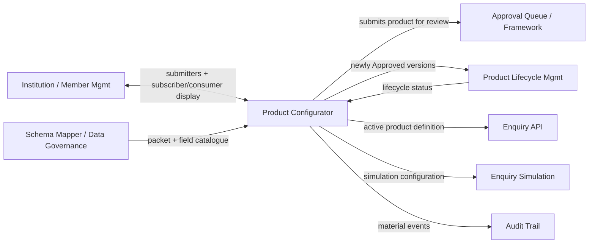
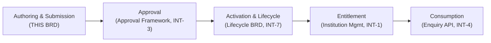

# Business Requirements Document — Product Configurator

**Parent Product:** Hybrid Credit Bureau (HCB) Admin Portal
**Parent Module:** Data Products
**Sub-Module:** Product Configurator (`/data-products/products`)
**Document Type:** Business Requirements Document (BRD)
**Version:** 1.4
**Status:** Draft for review
**Classification:** Internal – Confidential

> This BRD documents **business functionality only**. It intentionally excludes technical implementation, APIs, data schemas, UI construction, and architecture. Where behaviour is owned by other modules, this document **references** them (see [Section 4](#4-module-context--interactions)) rather than restating their requirements.

### Change Log
| Version | Date | Summary |
|---------|------|---------|
| 1.0 | 2026-08-05 | Initial BRD for the Product Configurator sub-module. |
| 1.1 | 2026-08-05 | Added optional **SAP item code** and **Release note** metadata (Release note replaces the earlier "Legal conditions" free-text); renamed the **Lineage** view to **Traceability**; simplified the Overview; added **Run test** (in-context enquiry simulation) for Active/Deprecated products; expanded [Section 9](#9-business-validations) into field-level business validation rules. |
| 1.2 | 2026-08-05 | Made product **business metadata backend-configurable** (PC-BR-205); **delegated approval** policy/routing/quorum/separation-of-duties to the application's approval framework (INT-3); added **packet point-in-time snapshot binding** (PC-BR-206 / ASM-7) and the **non-empty contract** rule (PC-VAL-11a); enumerated version **compare dimensions**; added an **OBJ→CAP→FR/BR→AC traceability matrix**. |
| 1.3 | 2026-08-05 | **Major rescope.** Removed **CAP-6 Lifecycle Management** as owned content (→ OOS-8; owned by the **Product Lifecycle Management BRD**; INT-7) and **CAP-7 Subscriber Entitlement** as owned content (→ OOS-7; owned by **Institution / Member Management**; INT-1 now two-way). Lifecycle **status** and **subscriber/consumer counts** remain as **read-only inbound displays**. Added **§6.1 end-to-end flow narrative** with explicit handoff markers; added the **Customer Profile system block** (PC-FR-206a); kept **abandon Draft** (PC-FR-211) and **withdraw Pending submission** (PC-FR-405) as owned exits. Transferred all lifecycle and entitlement requirements to their owning BRDs in **[Section 17](#17-transferred-requirements-raised-against-owning-brds)** so none are lost. |
| 1.4 | 2026-08-10 | **Authoring / enquiry model expansion.** Five-step authoring wizard; **Sensitivity** becomes a **calculated / display-only** field (not captured in the form); Business unit and Segment become **controlled catalogues**; independent **Allow soft enquiry** / **Allow hard enquiry** with per-impact **store footprint** and **footprint visibility** (network vs vertical participants); **Trended** and **Retro** retrieval ceilings; live preview **LATEST / TRENDED / RETRO** with Retro `enquiryDate` and `retrievalAnchor = AS_OF <enquiryDate>`; catalogue cards show tags (max 3) and date-only Updated; fingerprint and compare dimensions extended. Added detailed §7.2.1 narrative for AI implementers. |

---

## 1. Purpose

### 1.1 Business Purpose
The **Product Configurator** is the authoring and governance-submission workspace where Bureau staff **define, version, and submit for approval** the **Data Products** — the monetisable units that determine *what* credit data is exposed and *how* it may be consumed. It is the control point that ensures every product is deliberately **composed and reviewed** before it is handed off to the approval framework and downstream lifecycle/entitlement systems.

> **Ownership boundary (v1.3):** Product **lifecycle execution** (activation, deprecation, deactivation, archival) is owned by the **Product Lifecycle Management BRD** (see OOS-8, INT-7). **Subscriber entitlement** (access requests, subscriptions) is owned by **Institution / Member Management** (see OOS-7, INT-1). This document **reads lifecycle status and subscriber/consumer counts as inbound data** for display and gating only.

### 1.2 Business Value
- **BV-1** — Standardised, reviewable product definitions ensure consistent credit-data delivery to member institutions.
- **BV-2** — Version governance allows the catalogue to evolve without disrupting institutions already consuming an earlier definition.
- **BV-3** — Mandatory approval gating prevents untested or non-compliant definitions from going live.
- **BV-4** — Duplicate-definition detection protects catalogue integrity and pricing/monetisation logic.
- **BV-5** — Transparent traceability and **read-only** subscriber visibility support regulatory accountability and audit readiness.

### 1.3 Objectives
| ID | Objective | Success Signal |
|----|-----------|----------------|
| OBJ-1 | Enable self-service product authoring for Bureau product owners | Products can be created and submitted without engineering involvement |
| OBJ-2 | Enforce governance before go-live | No product reaches Active without a recorded approval decision |
| OBJ-3 | Support controlled evolution | New versions supersede old ones through managed versioning (lifecycle execution owned by the Lifecycle BRD) |
| OBJ-4 | Provide product transparency & traceability | Submitters → packets → product → consumers and the audit trail are viewable |

> **OBJ-2 shared ownership:** Because approval mechanics are delegated to the application's approval framework (see [INT-3](#4-module-context--interactions), [PC-FR-403](#74-governance-submission-cap-4)), this document cannot *independently* guarantee "no product reaches Active without a recorded approval." **OBJ-2 is jointly satisfied by the Product Configurator, the Approval Queue module, and the Lifecycle BRD** (which owns activation), and the traceability in [Section 15](#15-acceptance-criteria) holds on that basis.

---

## 2. Scope

### 2.1 In Scope (business functionality)
- Browsing the product catalogue as a governed list (one entry per product, showing its most relevant version).
- Authoring a product definition via a **five-step wizard**: identity & metadata, composed data packets & Customer Profile, **retrieval** (coverage scope, trended, retro), **enquiry impact** (soft/hard with per-impact footprint policy), and review — plus a live request/response preview.
- Version management: creating successor versions of an existing product and comparing versions.
- Governance submission: submitting a definition into the application's approval framework and recording the resulting decision as a business outcome (approval mechanics owned by the framework — see [INT-3](#4-module-context--interactions)).
- Owned draft/submission exits: **abandoning a Draft** and **withdrawing a Pending submission**.
- Product transparency: viewing the data contract, traceability (submitters → packets → product → consumers), **read-only** subscriber list/counts, version history, and audit trail.
- Consuming **lifecycle status** as read-only input for catalogue display, representative-version resolution, edit gating, and Run-test gating.
- Pre-go-live enquiry validation: an in-context **Run test** simulation from the catalogue, plus the standalone enquiry simulation entry point (configuration handoff — see [Section 4](#4-module-context--interactions)).

### 2.2 Out of Scope
- **OOS-1** — Pricing/rate calculation and invoice generation (monetisation engine).
- **OOS-2** — Runtime enquiry execution and scoring (owned by the Enquiry API module).
- **OOS-3** — Institution onboarding and member registry management (owned by Member Management).
- **OOS-4** — Packet/source schema authoring and field discovery (owned by Schema Mapper / Data Governance).
- **OOS-5** — Bureau-wide approval administration beyond product-scoped submission (owned by the Approval Queue module).
- **OOS-6** — Delegation of approval authority (parked; see [Section 13](#13-open-questions--ambiguities)).
- **OOS-7** — **Subscriber entitlement, access requests, and subscription lifecycle** (owned by Institution / Member Management; see INT-1 and [Section 17](#17-transferred-requirements-raised-against-owning-brds)).
- **OOS-8** — **Product lifecycle transitions, wind-down, emergency deactivation, and archival** (owned by the existing **Product Lifecycle Management BRD**; see INT-7, [Section 16](#16-related-documentation), and [Section 17](#17-transferred-requirements-raised-against-owning-brds)).

---

## 3. Personas & Roles

Reuses the portal RBAC model. Product Configurator recognises the following business roles:

| Persona | Portal Role (reference) | Responsibility in this sub-module |
|---------|--------------------------|-----------------------------------|
| Product Owner ("Local CPO") | Bureau Admin | Creates, edits, submits, and versions product definitions |
| Approver (Product Head / Governance) | Bureau Admin / Governance | Reviews submissions and records approve/reject decisions (via the approval framework) |
| Data Analyst | Analyst | Reads product definitions, traceability, and audit; no authoring rights |
| Subscriber Institution | Member (API consumer) | Displayed here as a **consumer/subscriber** (read-only); entitlement is owned by Institution / Member Management |

> **Role model:** Product Owner and Approver are **distinct roles enforced by the application's role model / approval framework**, not a single portal role. The "Portal Role (reference)" column indicates broad portal grouping only; separation of duties between submitter and approver is owned by the framework (see [INT-3](#4-module-context--interactions), [PC-FR-403](#74-governance-submission-cap-4)).
>
> Detailed permission matrix in [Section 10](#10-permissions).

---

## 4. Module Context & Interactions

The Product Configurator does not operate in isolation. It **depends on** and **feeds** the following parent/sibling modules. Requirements owned by those modules are not restated here.



| ID | Interacting Module | Direction | Business Interaction |
|----|--------------------|-----------|----------------------|
| INT-1 | Institution / Member Management | **Two-way (display)** | Supplies institutions that appear as **data submitters** (traceability) **and** the **subscriber/consumer** information shown read-only in the catalogue count, Subscribers tab, and traceability consumers. Entitlement is owned there (OOS-7). |
| INT-2 | Schema Mapper / Data Governance | Inbound | Supplies the **data packets** and their fields from which a product is composed. |
| INT-3 | Approval Queue / approval framework | Outbound | Receives product submissions for maker-checker governance review; decisions flow back as recorded outcomes. Owns policy, routing, quorum, and separation-of-duties. |
| INT-4 | Enquiry API | Outbound | Consumes **Active** product definitions to serve live credit enquiries. |
| INT-5 | Enquiry Simulation | Outbound | Receives a product configuration for pre-go-live validation. |
| INT-6 | Audit Trail | Outbound | Receives every material action (creation, submission, decision outcome, draft/submission exit) for accountability. |
| INT-7 | Product Lifecycle Management | **Two-way** | **Inbound:** version **lifecycle status** (read-only). **Outbound:** newly **Approved versions** eligible for activation. Lifecycle execution is owned there (OOS-8). |

---

## 5. Terminology (Reused)

| Term | Business Meaning |
|------|------------------|
| Product | A governed, monetisable data definition identified by a stable product code, expressed through one or more versions. |
| Version | A specific, immutable-once-published definition of a product. |
| Data Packet | A reusable bundle of related credit-data fields sourced from submitting institutions (owned by Data Governance). |
| Field Contract | The concrete set of fields a product exposes, derived from selected packets minus disabled fields, plus the implicit Customer Profile block. |
| Customer Profile Block | An implicit, non-removable system block always included in a product's contract; its exposed fields are configurable and it participates in the definition fingerprint (PC-FR-206a). |
| Data Submitter | A member institution that contributes data into a packet used by the product. |
| Consumer / Subscriber | A member institution entitled to consume the product; shown read-only here (entitlement owned by Institution / Member Management). |
| Enquiry Impact | Independent product-level permissions to allow **Soft** and/or **Hard** enquiry. Soft and Hard are **not mutually exclusive** — a product may allow one, both, or (invalid) neither. |
| Soft enquiry | An allowed enquiry mode that typically does not elevate credit-decision severity; may still optionally **store a footprint** if configured. |
| Hard enquiry | An allowed enquiry mode for formal pulls; may optionally **store a footprint** if configured. |
| Enquiry Footprint | A persisted record that an enquiry occurred against a subject. Configured **per impact type** (soft and hard each have their own store/visibility settings). |
| Footprint Visibility | Who may see a stored enquiry footprint: **All network participants** or **Vertical participants**. Distinct from Coverage Scope. No per-vertical sub-select in the default configuration. |
| Coverage Scope | Breadth of **data queried**: **Self**, **Network**, **Consortium**, or **Vertical**. Answers “whose data is pulled,” not “who sees the footprint.” |
| Trended Data / Trended Retrieval | Request-time time-series history for eligible attributes, bounded by a product-level **maximum history ceiling** (months). |
| Retro Retrieval | Request-time **point-in-time** snapshot as of a caller-supplied **enquiry date**, bounded by a separate product-level maximum history ceiling (months). |
| Retrieval Anchor | Business label on a served product item describing how data was anchored: `CURRENT` (latest), `PERIOD_WINDOW` (trended), or `AS_OF <enquiryDate>` (retro). |
| Enquiry Date | Calendar date supplied on a Retro request; must fall within the product’s retro history ceiling relative to the enquiry moment. |
| Definition Fingerprint | A business signature of a product's exposed definition (contract + coverage + soft/hard impact options + trended + retro), used to detect duplicate products. |
| Approval Framework | The application's standard maker-checker workflow that owns approval policy, routing, quorum, and separation-of-duties enforcement (see INT-3). |
| Lifecycle Status | The version state (Draft → Pending Approval → Approved → Active → Deprecated → Inactive → Archived) — **owned by the Lifecycle BRD**, consumed here read-only. |
| Release Note | A free-text summary of what changed in a given product version (replaces the earlier "Legal conditions" field). |
| SAP Item Code | Optional external material/item code used as a billing reference for the product. |
| Sensitivity | Low / Medium / High classification used as an **approval-routing input**. **Calculated / system-derived** — shown on product detail; **not** captured as an editable authoring field. |
| Business Unit | Controlled catalogue value describing the owning commercial unit (e.g. Commercial Lending, Consumer Digital). |
| Segment | Controlled catalogue value describing the target customer segment (e.g. SME, BNPL retail). |
| Run Test | An in-context, non-production enquiry simulation launched from a product card to validate a live/deprecated definition. |
| Traceability | The end-to-end view of data submitters → packets → product version → consumers (formerly "Lineage"). |
| Live Preview | Authoring-time business preview of representative enquiry **request** and **response** JSON, driven by the draft definition and Preview-as mode. |

---

## 6. Business Capabilities Overview

| ID | Capability | Summary |
|----|-----------|---------|
| CAP-1 | Product Catalogue | Browse and locate products; each product surfaces its most relevant version. |
| CAP-2 | Product Authoring | Define product identity, catalogue metadata (excl. editable sensitivity), packets, field contract (incl. Customer Profile), **retrieval** (coverage, trended, retro), **enquiry impact** (soft/hard + per-impact footprint), via a five-step wizard with live preview. |
| CAP-3 | Versioning | Create successor versions and compare definitions across versions. |
| CAP-4 | Governance Submission | Submit a definition into the application's approval framework (maker-checker). |
| CAP-5 | Approval Decisioning | Record Approve/Reject outcomes with accountability (mechanics framework-owned). |
| ~~CAP-6~~ | ~~Lifecycle Management~~ | **Moved out of scope (OOS-8)** — owned by the Product Lifecycle Management BRD (INT-7). Status consumed read-only here. |
| ~~CAP-7~~ | ~~Subscriber Entitlement~~ | **Moved out of scope (OOS-7)** — owned by Institution / Member Management (INT-1). Subscriber/consumer data shown read-only here. |
| CAP-8 | Transparency & Traceability | View data contract, traceability, read-only subscribers, version history, and audit. |
| CAP-9 | Pre-Go-Live Validation | Run an in-context test simulation and hand off a configuration for enquiry simulation. |

### 6.1 End-to-End Flow (with handoff markers)



1. **Authoring & submission (this BRD).** A Product Owner composes a product through the five-step wizard (basics → packets → retrieval → enquiry impact → review), validates Soft/Hard + ceilings, previews LATEST/TRENDED/RETRO as applicable, and submits. Owned exits: abandon Draft, withdraw Pending submission. **→ handoff to approval.**
2. **Approval (approval framework, INT-3).** Maker-checker workflow records an Approve/Reject outcome; this BRD reflects the outcome only. **→ handoff to lifecycle.**
3. **Activation & lifecycle (Lifecycle BRD, INT-7).** Approved versions become eligible for activation; activation, deprecation, deactivation, and archival are executed and governed there. This BRD **reads** the resulting status. **→ handoff to entitlement.**
4. **Entitlement (Institution / Member Management, INT-1).** Institutions request and hold subscriptions to Active products; this BRD **displays** subscriber/consumer counts read-only. **→ handoff to consumption.**
5. **Consumption (Enquiry API, INT-4).** Entitled institutions consume Active products at runtime (out of scope here, OOS-2).

---

## 7. Detailed Business Requirements

Requirement IDs use the prefix **PC-FR** (functional) and **PC-BR** (business rule).

### 7.1 Product Catalogue (CAP-1)

| ID | Requirement |
|----|-------------|
| PC-FR-101 | The catalogue shall present one entry per product, identified by its product code and name. |
| PC-FR-102 | Each catalogue entry shall surface a single **representative version** and its lifecycle status (read-only, INT-7), the **product-total subscriber count** (across all versions, read-only from INT-1), the **last-updated date (date only, no time)**, and up to **three tags** from the representative version (additional tags exist on the definition but are truncated on the card). Per-version subscriber counts appear in the version history (PC-FR-303). |
| PC-FR-103 | Users shall be able to search the catalogue by product name, product code, and description. |
| PC-FR-104 | Users shall be able to filter the catalogue by saved business views: **All**, **Active**, **Pending my approval**, **Deprecated with consumers**, and **Drafts**. These views read inbound lifecycle status and subscriber data (INT-1, INT-7). |
| PC-FR-105 | A product carrying an unresolved policy warning (e.g. a retired dependent packet, PC-BR-206) shall be visibly flagged in the catalogue. |
| PC-FR-106 | Selecting a catalogue entry shall open that product's detail view at its representative version. |

**Business rules**
- **PC-BR-101** — The representative version shall be resolved by business priority using inbound lifecycle status: latest **Active**, else latest **Deprecated**, else latest **Pending Approval**, else latest **Draft**.

### 7.2 Product Authoring (CAP-2)

| ID | Requirement |
|----|-------------|
| PC-FR-201 | A Product Owner shall be able to create a new product by providing a product name and description. |
| PC-FR-202 | The system shall assign each new product a unique product code automatically; the code is not user-editable. |
| PC-FR-203 | The Product Owner shall capture the **configured business metadata fields** for the product (see PC-BR-205), which **by default include**: **business unit** (controlled catalogue), **target segment** (controlled catalogue), optional **SAP item code**, **release note**, **tags**, and **effective start date**. Optional fields, when omitted, display as an em dash. **Sensitivity is not authored here** (see PC-FR-203a / PC-BR-208). |
| PC-FR-203a | The product's **sensitivity** (Low / Medium / High) is a **calculated / system-derived** value displayed on the product detail (and available to the approval framework as a **routing input**). It is **not** an editable field on the create/edit wizard. How sensitivity influences routing/quorum is decided by the approval framework (see INT-3, PC-FR-403). |
| PC-FR-203b | **Business unit** and **Segment** shall be selected from governed catalogue lists. Default Business unit catalogue: Commercial Lending, Retail Lending, Consumer Digital, Consumer Risk, Merchant Onboarding, Inclusive Finance, Product Management. Default Segment catalogue: SME, Thin-file retail, BNPL retail, Retail / Checkout, Merchants / Sellers, Trade / KYB, Salaried / SHG, Gig workers, Corporate, General. Existing non-catalogue values remain selectable when editing legacy drafts so data is not lost. |
| PC-FR-204 | The Product Owner shall compose the product by selecting one or more data packets from the governed packet catalogue. |
| PC-FR-205 | The Product Owner shall configure, per packet, which fields are exposed, and may disable individual selected fields so they are retained in the selection but excluded from what the product delivers. |
| PC-FR-206 | The product's **field contract** shall be derived automatically from selected packet fields minus disabled fields, plus any selected derived fields, plus the Customer Profile block (PC-FR-206a). |
| PC-FR-206a | Every product shall include an implicit **Customer Profile system block** that is **non-removable**. Its exposed fields are **configurable** (fields may be included/excluded), it always contributes to the **field contract**, and it **participates in the definition fingerprint** (PC-BR-402). |
| PC-FR-207 | On the **Retrieval** step, the Product Owner shall configure **Coverage Scope**: Self / Network / Consortium / Vertical. Helper copy must make clear this answers “whose data is queried,” not footprint visibility. |
| PC-FR-207a | On the **Enquiry impact** step, the Product Owner shall independently toggle **Allow soft enquiry** and **Allow hard enquiry**. Soft and Hard are **not mutually exclusive**. At least one must be enabled before save/submit (PC-VAL-35). Switching Soft/Hard must **not** clear the other mode’s footprint settings. |
| PC-FR-207b | For **each enabled** impact type (Soft and/or Hard), the Product Owner shall configure **Store enquiry footprint** (on/off). When store is off for that impact type, no footprint is written for enquiries of that type. When store is on, the Product Owner shall choose **Footprint visibility**: **All network participants** or **Vertical participants** (two options only; no nested vertical picker in the default configuration). |
| PC-FR-208 | On the **Retrieval** step, the Product Owner shall be able to enable **Allow trended retrieval** and/or **Allow retro retrieval**, each with its own **maximum history depth (months)** when enabled. Defaults when first enabled: 6 months; hard upper bound default **≤ 60 months** (PC-VAL-10 / PC-VAL-10a). |
| PC-FR-208a | **Trended** means the caller may request a **time-series window** (period history) up to the trended ceiling. **Retro** means the caller may request a **point-in-time snapshot** as of an **enquiry date** within the retro ceiling. Both may be enabled on the same product. |
| PC-FR-209 | The Product Owner shall be able to save an in-progress definition as a **Draft** without submitting it. |
| PC-FR-210 | A **live preview** shall reflect the product definition as the Product Owner configures it, with Request and Response panes. Preview-as controls appear when trended and/or retro is enabled: **LATEST**, **TRENDED** (only if trended enabled), **RETRO** (only if retro enabled). Unavailable modes fall back to LATEST. |
| PC-FR-210a | **TRENDED** preview exposes a window (months) capped by the trended ceiling. **RETRO** preview exposes an **Enquiry date** control; the request includes top-level `enquiryDate`, and each served product item’s `retrievalAnchor` is the string `AS_OF <enquiryDate>` (e.g. `AS_OF 2025-06-15`). LATEST uses `retrievalAnchor = CURRENT`; TRENDED uses `PERIOD_WINDOW`. |
| PC-FR-210b | Live preview request/response shall use a rich business envelope (subject, application, consent/member references, `enquiryType`, products[]). Preview shows **one product** — the draft under edit. `enquiryType` follows the preferred enabled impact (Hard if Hard is allowed, else Soft). `footprintCreated` is true when the selected impact type has store-footprint enabled. |
| PC-FR-211 | A Product Owner shall be able to **abandon/delete a Draft** version; the deletion is recorded in the audit trail (see INT-6). |
| PC-FR-212 | Authoring shall proceed through a **five-step wizard** with ordered steps: (1) Basics & metadata, (2) Data packets, (3) Retrieval, (4) Enquiry impact, (5) Review. Users may navigate back to completed steps; forward navigation enforces step validations. |

**Business rules**
- **PC-BR-201** — Product name must be unique across the catalogue (case- and separator-insensitive). A collision with a different product code shall block save/submit.
- **PC-BR-202** — A product definition must include at least one data packet before it can be submitted for approval.
- **PC-BR-203** — When Trended retrieval is disabled, no trended history ceiling applies; when enabled, a positive integer ceiling within the retention bound applies (see PC-VAL-10).
- **PC-BR-203a** — When Retro retrieval is disabled, no retro history ceiling applies; when enabled, a positive integer ceiling within the retention bound applies (see PC-VAL-10a). Enquiry dates outside the ceiling relative to the enquiry moment are invalid at runtime (Enquiry API / INT-4); authoring preview should keep the demo enquiry date within the ceiling.
- **PC-BR-204** — A published (non-Draft) version is immutable; changing its definition requires creating a new version (see CAP-3).
- **PC-BR-205** — The set of business metadata fields captured during product configuration is **backend-configurable**: fields may be added, removed, marked mandatory/optional, or re-labelled **without a change to this BRD**. The fields listed in PC-FR-203 represent the **default configuration**; per-field validations (required/optional, format) derive from that configuration. Catalogue lists for Business unit / Segment are likewise configurable.
- **PC-BR-206** — A **published version binds to a point-in-time snapshot** of its packets' field definitions. Subsequent packet/field changes in Data Governance affect only **new Drafts**, preserving the immutability of published versions (PC-BR-204). Retirement of a packet with dependent products raises an **unresolved policy warning** on the catalogue (PC-FR-105).
- **PC-BR-207** — **Effective dates:** a version's **effective-end is its supersession date** (when a later version of the same product becomes Active). Activation before effective-start is enforced by the Lifecycle BRD (this document captures the effective-start value).
- **PC-BR-208** — **Sensitivity is calculated**, not authored. Until the calculation rules are specified (see OQ-11), the system may persist a provisional default (e.g. Medium) for routing display, but the authoring wizard must **not** present an editable Sensitivity control.
- **PC-BR-209** — Footprint visibility is configured **per impact type**. Soft’s footprint settings do not apply to Hard enquiries and vice versa. Coverage Scope remains a single product-level setting shared by all enquiry modes.
- **PC-BR-210** — Definition fingerprint components for duplicate detection include: exposed field contract (incl. Customer Profile), coverage scope, **soft impact option** (enabled + storeFootprint + visibility), **hard impact option** (same), **trended** (enabled + months), and **retro** (enabled + months). See PC-BR-402.
- **PC-BR-211** — **Legacy migration:** older definitions that stored a single `impactType` (SOFT|HARD) plus flat `storeFootprint` / `footprintVisibility` shall be normalised on read into the soft/hard option shape: the legacy impact type becomes the enabled option carrying the footprint fields; the other option is Off. If both soft and hard would be Off after normalisation, Soft defaults to On with no footprint (safe authoring default).

#### 7.2.1 Authoring wizard narrative (for implementers / AI agents)

This subsection restates the create/edit journey in sequential business terms so another agent can rebuild behaviour without reading UI code.


**Step 1 — Basics & metadata**
- Capture: Product name (required, uniqueness rules), Description, optional SAP item code, Business unit (dropdown), Segment (dropdown), Release note, Tags (comma-separated), Effective start (date).
- Do **not** capture Sensitivity on this step (display-only on detail).
- Blocking name validation runs before Next / Save (PC-VAL-01–05).

**Step 2 — Data packets**
- Select ≥1 packet from the governed catalogue; configure exposed / disabled / derived fields per packet.
- Configure Customer Profile included fields (system block always present).
- Live preview continues to reflect contract composition.

**Step 3 — Retrieval**
- Coverage Scope: Self | Network | Consortium | Vertical (product-level).
- Allow trended retrieval (switch) → if on, Maximum history depth (months, 1–60).
- Allow retro retrieval (switch) → if on, Maximum history depth (months, 1–60).
- Impact Soft/Hard is **not** on this step.

**Step 4 — Enquiry impact**
- Allow soft enquiry (switch). If on:
  - Store enquiry footprint (switch). If on → Footprint visibility: All network participants | Vertical participants.
- Allow hard enquiry (switch). If on: same nested footprint flow.
- Soft and Hard may both be on. Disabling an impact clears only that impact’s enabled flag (store/visibility reset when disabled).
- At least one of Soft or Hard must be enabled to save/submit (PC-VAL-35).

**Step 5 — Review**
- Read-only summary of basics, packets, coverage, trended, retro, soft/hard + footprint settings.
- Save draft / create product from this step (and save-and-submit when editing an existing draft).

**Live preview (persistent beside/below wizard)**
- Tabs: Request | Response.
- When trended and/or retro enabled, show Preview as: LATEST | TRENDED | RETRO (disabled buttons for modes not allowed).
- TRENDED → window months control; RETRO → enquiry date control.
- Request overlays: product id/version, dataScope, window (trended), enquiryDate (retro only), enquiryType from preferred impact, rich subject/application fixtures.
- Response overlays: enquiryType, footprintCreated from that impact’s store-footprint flag, products[0].dataScope, products[0].retrievalAnchor (`CURRENT` | `PERIOD_WINDOW` | `AS_OF <date>`), customerProfile, composed packet data, optional enquiryFootprint stub when footprintCreated.

**Detail / Approval / Compare surfaces**
- Product detail and approval review display Soft and Hard as separate summary lines (e.g. “On · footprint · All network participants” / “Off”).
- Version compare includes soft option, hard option, trended, and retro deltas in addition to prior dimensions.

### 7.3 Versioning (CAP-3)

| ID | Requirement |
|----|-------------|
| PC-FR-301 | A user shall be able to create a new version of an existing product; the new version starts as a Draft that inherits the source definition. |
| PC-FR-302 | The system shall number versions sequentially per product code. |
| PC-FR-303 | A user shall be able to view the version history of a product, showing each version's status (read-only, INT-7), effective dates, per-version subscriber count, and approval outcome. |
| PC-FR-304 | A user shall be able to compare two versions of the same product across the following **compare dimensions**: exposed field contract (incl. Customer Profile block); coverage scope; **soft impact option** (enabled / storeFootprint / footprintVisibility); **hard impact option** (same); **trended** (enabled / maxHistoryMonths); **retro** (enabled / maxHistoryMonths) — i.e. the definition-fingerprint components — **plus** business metadata (business unit, segment, **sensitivity as display-only delta if persisted**, SAP item code, release note, tags, effective start). |

**Business rules**
- **PC-BR-301** — Only one Draft version may exist per product at a time; a new version cannot be created while a Draft is open.
- **PC-BR-302** — The concurrent-active ceiling (default 2, hard cap 3) is **enforced by the Lifecycle BRD** on activation; this document surfaces the resulting status only (see [Section 17](#17-transferred-requirements-raised-against-owning-brds)).

### 7.4 Governance Submission (CAP-4)

| ID | Requirement |
|----|-------------|
| PC-FR-401 | A Product Owner shall submit a Draft for approval, providing a business justification. On submission the definition enters the application's approval framework as a business outcome (submit → Pending). |
| PC-FR-402 | On submission, the version shall move to **Pending Approval** and be enqueued for review (see INT-3). |
| PC-FR-403 | Approval of product submissions shall follow the **application's standard approval framework and maker-checker workflow**; **policy types, routing, quorum behaviour, and separation-of-duties enforcement are owned by that framework** (see INT-3). This document specifies only the business outcomes (submit → Pending → Approved/Rejected with recorded accountability), not the approval mechanics. |
| PC-FR-404 | Where a submission would create a **duplicate product definition**, the submission shall be handled per PC-BR-402 (same-product match warns; cross-product match is blocked unless a governance exception with justification is requested). |
| PC-FR-405 | A submitter shall be able to **withdraw a Pending submission**, returning the version to **Draft** for revision (recorded in the audit trail). |

**Business rules**
- **PC-BR-401** — Only a **Draft** version may be submitted for approval.
- **PC-BR-402** — Duplicate-definition detection is based on the **definition fingerprint**, which shall incorporate at minimum: exposed field contract (selected − disabled fields + derived fields + Customer Profile included fields); **coverage scope**; **soft** impact option (`enabled`, `storeFootprint`, `footprintVisibility`); **hard** impact option (same triad); **trended** (`enabled`, `maxHistoryMonths` when enabled else treated as off/0); **retro** (`enabled`, `maxHistoryMonths` when enabled else treated as off/0). Business metadata (name, unit, segment, SAP, tags, release note, sensitivity) is **not** part of the fingerprint. **Duplicate scope:** a fingerprint match against **another version of the same product** raises a non-blocking **warning** ("identical to vN"); a match against a **different product** (Approved/Active/Deprecated) is **blocked unless a governance exception** is requested with justification.
- **PC-BR-403** — Name uniqueness (PC-BR-201) is re-validated at submission time.

### 7.5 Approval Decisioning (CAP-5)

| ID | Requirement |
|----|-------------|
| PC-FR-501 | An Approver shall be able to view pending product submissions relevant to them and open a submission for review. |
| PC-FR-502 | An Approver shall record a decision of **Approve** or **Reject** with an accountable comment. |
| PC-FR-503 | Approving a submission shall move the version to **Approved**; the version then becomes **eligible for activation by the Lifecycle BRD** (INT-7). |
| PC-FR-504 | Rejecting a submission shall return the version to **Draft** so it can be revised and resubmitted. |
| PC-FR-505 | The system shall preserve a record of each decision (actor, role, comment, timestamp) against the submission. |

> FR-501–505 describe **business outcomes only**; the approval framework owns **how** (routing, quorum, ordering, separation-of-duties enforcement) — see PC-FR-403.

**Business rules**
- **PC-BR-501** — **Separation of duties** (submitter cannot approve their own submission) is **enforced by the approval framework** (see PC-FR-403, INT-3); this document asserts it as a required outcome, not an in-module control.
- **PC-BR-502** — A **Reject** decision requires an accountable comment (recorded outcome).
- **PC-BR-503** — A decision may only be recorded on a submission that is still **Pending**.

### 7.6 Lifecycle Status (reference — owned by the Lifecycle BRD)

> **Lifecycle states and transitions are defined and governed by the [Product Lifecycle Management BRD](#16-related-documentation) (OOS-8, INT-7); this document treats lifecycle status as a read-only input.**

Reference state list (for context only): **Draft → Pending Approval → Approved → Active → Deprecated → Inactive → Archived**.

The configurator **reads** lifecycle status to drive: representative-version resolution (PC-BR-101), catalogue views (PC-FR-104), Run-test gating (PC-FR-904), edit gating (PC-VAL-34), and the single-open-Draft rule (PC-BR-301). It does **not** execute lifecycle transitions. Requirements previously owned here (activation, deprecation, emergency deactivation, disposal, notifications, ceiling) are transferred in [Section 17](#17-transferred-requirements-raised-against-owning-brds).

### 7.7 Subscriber & Consumer Display (read-only — owned by Institution / Member Management)

> **Access requests, subscriptions, and their lifecycle are owned by Institution / Member Management (OOS-7, INT-1); this document only displays inbound subscriber/consumer data.**

| ID | Requirement |
|----|-------------|
| PC-FR-701 | The product detail shall display a **read-only Subscribers list** sourced from Institution / Member Management (INT-1), showing institution, pinned version, subscription status, and request date. |
| PC-FR-702 | Traceability **consumers** and the catalogue/version **subscriber counts** shall be **read-only views** of the same inbound data; no entitlement action is initiated from this module. |

**Business rules**
- **PC-BR-701** — The "**Deprecated with consumers**" catalogue view is a **display over inbound data** (INT-1 + INT-7) and remains available. Entitlement semantics (pinned-version fallback, exits, expiry) are owned by Institution / Member Management (see [Section 17](#17-transferred-requirements-raised-against-owning-brds)).

### 7.8 Transparency & Traceability (CAP-8)

| ID | Requirement |
|----|-------------|
| PC-FR-801 | The product detail shall present an **Overview** of business metadata (business unit, segment, SAP item code, **sensitivity (calculated / display-only)**, effective start, published date, environment), the version **release note**, and a clear summary of **retrieval** (coverage, trended, retro) and **enquiry impact** (soft and hard lines with footprint settings). |
| PC-FR-802 | The product detail shall present the **Data Contract** — the fields the product exposes (incl. the Customer Profile block), with type, PII indication, and attribute mode (Snapshot/Trended). |
| PC-FR-803 | The product detail shall present **Traceability** showing the flow: data submitters → data packets → this product version → consumers (consumers shown read-only, INT-1). |
| PC-FR-804 | From traceability, a user shall be able to inspect the field list contributed by any individual packet. |
| PC-FR-805 | The product detail shall present **Subscribers** (read-only, PC-FR-701) and **Version history**. |
| PC-FR-806 | An **Audit trail** of all material actions on the product shall be viewable. |
| PC-FR-807 | The product detail navigation shall be presented as tabs: Overview, Data Contract, Traceability, Subscribers (read-only), Versions, and **Audit** (aligns with PC-FR-806 and AC-07). |

**Business rules**
- **PC-BR-801** — Traceability data submitters are resolved to named member institutions (INT-1); where a packet has no named submitter, its source label is shown. **Consumers are a read-only view** of the product's subscribing institutions (INT-1).
- **PC-BR-802** — A field is marked **PII** and its attribute **mode** based on governed field semantics.
- **PC-BR-803** — The Overview does not expose data-acquisition type, data-availability type, or access-restrictions fields. **Product legal and usage terms are owned by the Data Governance / Legal function** (not authored here); the version **release note** carries only change-summary text. If no such owner is confirmed, the legal-terms field must be reinstated (see [OQ-03](#13-open-questions--ambiguities)).

### 7.9 Pre-Go-Live Validation (CAP-9)

| ID | Requirement |
|----|-------------|
| PC-FR-901 | A user shall be able to initiate an **Enquiry Simulation** for a product configuration to validate behaviour before go-live. |
| PC-FR-902 | Simulation configuration shall identify the requesting institution, the target product, and consumer/enquiry parameters. |
| PC-FR-903 | A user shall be able to launch a **Run test** in-context from a product card to simulate an enquiry against that product's representative version. |
| PC-FR-904 | **Run test** shall be available **only** for products whose representative version is **Active** or **Deprecated** (read from inbound lifecycle status); it shall not be offered for Draft, Pending Approval, Approved, Inactive, or Archived. |
| PC-FR-905 | **Run test** shall capture minimal consumer inputs — name, phone number, ID type, ID value, and address — and present the simulated response on a separate result step, with a way to return to the inputs. |

**Business rules**
- **PC-BR-901** — Simulation and Run test must not create a real enquiry footprint against a consumer (see [Section 4](#4-module-context--interactions), INT-5; production execution owned by Enquiry Simulation / Enquiry API).
- **PC-BR-902** — Run test uses the product's own composed packets to shape the simulated response; the product is fixed (not selectable) within the test.
- **PC-BR-903** — **Run test inputs are not persisted beyond the session and are never written to the audit trail**; use of **synthetic data** is recommended.

---

## 8. User Actions Summary

| ID | Actor | Action | Precondition | Business Outcome |
|----|-------|--------|--------------|------------------|
| UA-01 | Product Owner | Create draft product | — | New Draft with unique code; five-step wizard completed or saved mid-flow |
| UA-02 | Product Owner | Edit draft | Version is Draft | Updated Draft definition (retrieval + enquiry impact included) |
| UA-03 | Product Owner | Submit for approval | Draft, ≥1 packet, non-empty contract, unique name, ≥1 of Soft/Hard enabled, no unresolved cross-product duplicate | Version → Pending Approval (into framework) |
| UA-04 | Approver | Approve submission | Pending, not self-submitted (framework) | Version → Approved (eligible for activation, INT-7) |
| UA-05 | Approver | Reject submission | Pending, comment provided (framework) | Version → Draft |
| UA-06 | Product Owner | Create new version | No open Draft for product | New Draft version |
| UA-07 | Product Owner | Compare versions | ≥2 versions | Definition differences shown |
| UA-08 | Bureau users (per §10) | Run test | Representative version is Active or Deprecated | Simulated enquiry response shown (no footprint) |
| UA-09 | Product Owner | Abandon / delete draft | Version is Draft | Draft removed (audited) |
| UA-10 | Product Owner | Withdraw submission | Version is Pending | Version → Draft (audited) |

> Lifecycle actions (activate/deprecate/deactivate/archive/dispose) and entitlement actions (request/approve/withdraw/revoke access) are **owned elsewhere** — see [Section 17](#17-transferred-requirements-raised-against-owning-brds).

---

## 9. Business Validations

Business validations are grouped by the action/form they govern. **Surfacing** indicates how the rule is communicated at a business level: *Inline* = shown next to the field as the user types; *Blocking* = prevents the action and shows a message; *Gating* = the control is hidden/disabled until preconditions are met.

> **Configurable fields:** validations for the business metadata captured in §9.1 (which fields are present, whether each is mandatory/optional, and their format) **derive from the backend field configuration** (PC-BR-205). The rules below describe the **default configuration**; they are not a fixed contract.

### 9.1 Product identity & authoring (Create / Edit draft)

| ID | Field / Rule | Requirement | Surfacing |
|----|--------------|-------------|-----------|
| PC-VAL-01 | Product name — required | Name must not be empty | Blocking |
| PC-VAL-02 | Product name — length | Name must be **5–80 characters** | Blocking |
| PC-VAL-03 | Product name — whitespace | No leading or trailing whitespace | Blocking |
| PC-VAL-04 | Product name — reserved suffix | Name must not end with a placeholder word (e.g. "new", "final", "copy") | Blocking |
| PC-VAL-05 | Product name — uniqueness | Name must be unique across the catalogue (case- and separator-insensitive); a conflict links to the existing product | Inline + Blocking |
| PC-VAL-06 | SAP item code | Optional; trimmed on save. Format (default): alphanumeric with dash/underscore separators, ≤ 40 characters | Inline (optional) |
| PC-VAL-07 | Release note | Optional free text | Inline (optional) |
| PC-VAL-08 | Sensitivity | **Not editable** on create/edit. Displayed on detail as Low / Medium / High when calculated/persisted for routing (PC-FR-203a, PC-BR-208). Authoring must not require or validate a user-entered sensitivity value. | Display-only |
| PC-VAL-08a | Business unit | Selected from the Business unit catalogue (PC-FR-203b). Legacy non-catalogue values remain selectable when editing existing drafts. | Inline |
| PC-VAL-08b | Segment | Selected from the Segment catalogue (PC-FR-203b). Legacy non-catalogue values remain selectable when editing existing drafts. | Inline |
| PC-VAL-09 | Tags | Comma-separated; blank entries ignored; **max 10 tags, each ≤ 30 characters**. Catalogue cards show at most **three** tags (PC-FR-102); truncation is display-only and does not delete tags. | Inline |

### 9.1a Retrieval & enquiry impact

| ID | Field / Rule | Requirement | Surfacing |
|----|--------------|-------------|-----------|
| PC-VAL-10 | Trended history ceiling | Required and positive **only when** Allow trended retrieval is enabled; integer; must not exceed the retention bound (**default ≤ 60 months**). When trended is disabled, ceiling is ignored / treated as 0. Default when first enabled: **6 months**. | Blocking |
| PC-VAL-10a | Retro history ceiling | Required and positive **only when** Allow retro retrieval is enabled; integer; must not exceed the retention bound (**default ≤ 60 months**). When retro is disabled, ceiling is ignored / treated as 0. Default when first enabled: **6 months**. | Blocking |
| PC-VAL-35 | Soft or Hard required | At least one of **Allow soft enquiry** or **Allow hard enquiry** must be enabled before Save draft / Create / Submit | Blocking |
| PC-VAL-36 | Soft footprint visibility | When Soft is enabled **and** Store enquiry footprint is on for Soft, Footprint visibility must be **NETWORK** (All network participants) or **VERTICAL** (Vertical participants) | Blocking |
| PC-VAL-37 | Hard footprint visibility | When Hard is enabled **and** Store enquiry footprint is on for Hard, Footprint visibility must be NETWORK or VERTICAL | Blocking |
| PC-VAL-38 | Soft/Hard independence | Enabling or disabling Soft must not clear Hard’s footprint settings, and vice versa | Business rule |
| PC-VAL-39 | Coverage vs footprint | Coverage Scope and Footprint Visibility are independent; changing one must not auto-change the other | Business rule |
| PC-VAL-40 | Preview mode availability | TRENDED preview control is offered only when trended is enabled; RETRO only when retro is enabled; otherwise Preview as falls back to LATEST | Gating |
| PC-VAL-41 | Retro enquiry date (preview) | When Preview as = RETRO, an enquiry date is required for the preview overlay; demo/default dates should lie within the retro ceiling | Inline (preview) |

### 9.2 Packet composition

| ID | Field / Rule | Requirement | Surfacing |
|----|--------------|-------------|-----------|
| PC-VAL-11 | At least one packet | A product must include ≥1 data packet before submission | Blocking |
| PC-VAL-11a | Non-empty contract | The derived field contract must contain **at least one exposed field at submission**; a product whose selected packets are fully disabled (and Customer Profile fields all excluded) cannot be submitted | Blocking |
| PC-VAL-12 | Disabled fields | A disabled field remains selected but is excluded from the delivered contract and fingerprint | Inline |

### 9.3 Governance submission

| ID | Field / Rule | Requirement | Surfacing |
|----|--------------|-------------|-----------|
| PC-VAL-13 | Only Draft submittable | Only a Draft version can be submitted for approval | Gating |
| PC-VAL-14 | Business justification | Required (non-empty) to submit | Blocking |
| PC-VAL-16 | Name re-check | Name uniqueness re-validated at submission | Blocking |
| PC-VAL-17 | Duplicate definition | Per PC-BR-402: same-product fingerprint match warns; cross-product match is blocked unless **Request exception** is set (exception justification captured for approvers) | Inline + Blocking |

> Approval **policy selection, routing, and quorum** are owned by the approval framework (PC-FR-403) and are not validated here.

### 9.4 Approval decisioning

| ID | Field / Rule | Requirement | Surfacing |
|----|--------------|-------------|-----------|
| PC-VAL-18 | Separation of duties | Enforced by the approval framework (see PC-FR-403 / PC-BR-501) — pointer only, not an in-module control | Framework-owned |
| PC-VAL-19 | Reject comment | A comment is required to reject (optional on approve) | Blocking (Reject disabled until provided) |
| PC-VAL-20 | Pending only | A decision can only be recorded while the submission is Pending | Gating |

### 9.5 Run test

| ID | Field / Rule | Requirement | Surfacing |
|----|--------------|-------------|-----------|
| PC-VAL-30 | Availability | Run test is only offered when the representative version is Active or Deprecated | Gating |
| PC-VAL-31 | Inputs | Name, phone number, ID type, ID value, and address are captured; the test runs against the fixed product | Inline |
| PC-VAL-32 | No footprint & no persistence | Executing a test produces a simulated response only, never records a real enquiry, and **inputs are not persisted beyond the session nor written to audit; synthetic data is recommended** (PC-BR-903) | Business rule |

### 9.6 Cross-cutting state guards

| ID | Field / Rule | Requirement | Surfacing |
|----|--------------|-------------|-----------|
| PC-VAL-33 | Single open Draft | Only one open Draft may exist per product; a new version cannot be created while a Draft is open | Blocking |
| PC-VAL-34 | Edit scope | Only a Draft is editable; published versions (per inbound lifecycle status) are read-only (new version required to change) | Gating |

> Lifecycle-transition validations (wind-down window, emergency dual-control, activation ceiling) and access-request validations (required fields, billing reference, usage period) are **owned by the Lifecycle BRD and Institution / Member Management** respectively — see [Section 17](#17-transferred-requirements-raised-against-owning-brds).

---

## 10. Permissions

| Capability | Product Owner | Approver | Data Analyst | Subscriber Institution |
|------------|:-------------:|:--------:|:------------:|:----------------------:|
| Browse catalogue & detail | Yes | Yes | Yes | View own entitlements¹ |
| Create / edit / abandon draft | Yes | — | — | — |
| Submit / withdraw submission | Yes | — | — | — |
| Approve / reject submission (framework) | — | Yes | — | — |
| Create new version / compare | Yes | Yes (view) | View | — |
| View traceability, contract, audit | Yes | Yes | Yes | Limited¹ |
| Run test (Active/Deprecated) | Yes | Yes | Yes | — |

¹ **Limited / own entitlements** = a Subscriber Institution sees **only its own entitlement records** (sourced read-only from Institution / Member Management), not other institutions' subscriptions, the full audit trail, or internal governance detail.

**Business rules**
- **PC-BR-1001** — Authoring actions are restricted to Product Owners; decisioning is restricted to Approvers. **Product Owner and Approver are distinct roles in the application's role model** (see [Section 3](#3-personas--roles)), not a single portal role.
- **PC-BR-1002** — Separation of duties (submitter ≠ approver) is **enforced by the approval framework** (PC-FR-403) and overrides role permission: even a permitted Approver cannot decide on their own submission.

---

## 11. Dependencies

| ID | Dependency | Nature | Impact if Unavailable |
|----|-----------|--------|-----------------------|
| DEP-1 | Institution / Member Management | Data (two-way display) | No submitters to attribute in traceability and no subscriber/consumer counts to display (INT-1). |
| DEP-2 | Packet & field catalogue (Data Governance) | Data | Products cannot be composed. Published versions bind to a **point-in-time snapshot** of packet fields (PC-BR-206 / ASM-7); packet retirement raises a policy warning (PC-FR-105). |
| DEP-3 | Approval Queue / approval framework | Process | Submissions cannot be governed (owns PC-FR-403). |
| DEP-4 | Enquiry API module | Downstream | Active products cannot be consumed at runtime. |
| DEP-5 | Enquiry Simulation | Downstream | Pre-go-live validation unavailable. |
| DEP-6 | Audit Trail | Cross-cutting | Loss of accountability record. |
| DEP-7 | Product Lifecycle Management | Process (inbound status) | No lifecycle status to display or gate on; Approved versions cannot progress to Active (INT-7). |

---

## 12. Edge Cases

| ID | Scenario | Expected Business Behaviour |
|----|----------|-----------------------------|
| EDGE-1 | Two **different** products would expose an identical definition | Second submission blocked unless a governance exception is requested with justification (PC-BR-402). |
| EDGE-2 | A **same-product** later version matches an earlier version's fingerprint | Non-blocking warning ("identical to vN"); submission proceeds (PC-BR-402). |
| EDGE-3 | Approver attempts to approve own submission | Blocked by the approval framework as a separation-of-duties violation (PC-BR-501). |
| EDGE-4 | Attempt to create a new version while a Draft exists | Blocked; the existing Draft must be resolved first (PC-BR-301). |
| EDGE-5 | Rejected submission is revised | Version returns to Draft and may be resubmitted as a new approval cycle (UA-05 → UA-03). |
| EDGE-6 | Product's packets are fully disabled at submission | Blocked — the derived contract is empty (PC-VAL-11a). |
| EDGE-7 | Packet contributes no fields to the contract | Packet still appears in traceability; its field inspection shows an empty contract for that packet. |
| EDGE-8 | Packet retired mid-Draft (after selection, before submission) | Draft flags the retired packet; the Product Owner must remove/replace it. Published versions are unaffected (PC-BR-206). |
| EDGE-9 | Run test opened for a non-Active/Deprecated product | Not possible — the Run test action is not offered for those statuses (PC-FR-904). |
| EDGE-10 | Deprecated product used in Run test | Permitted; Run test remains available so validators can compare behaviour during wind-down. |
| EDGE-11 | Approver departs with items still Pending | Reassignment/escalation is **owned by the approval framework** (PC-FR-403); the Product Configurator surfaces the still-Pending state only. |
| EDGE-12 | Inbound lifecycle status changes (e.g. version deactivated in the Lifecycle BRD) | The catalogue, gating, and displays update to reflect the new read-only status (INT-7). |
| EDGE-13 | Product Owner enables Soft with footprint, then enables Hard | Soft’s footprint settings remain unchanged; Hard starts with its own defaults (typically store off until configured). |
| EDGE-14 | Product Owner disables Soft while Hard remains on | Soft becomes Off; Hard footprint settings persist. Save/submit remains allowed (PC-VAL-35 satisfied by Hard). |
| EDGE-15 | Both Soft and Hard disabled | Save/submit blocked (PC-VAL-35). |
| EDGE-16 | Store footprint on with no visibility selected | Blocked until NETWORK or VERTICAL is chosen (PC-VAL-36/37). |
| EDGE-17 | Trended and Retro both enabled | Valid. Live preview offers LATEST, TRENDED, and RETRO. Fingerprint includes both ceilings. |
| EDGE-18 | Retro enabled; caller supplies enquiryDate older than the retro ceiling | Runtime rejection owned by Enquiry API (INT-4). Authoring preview should keep demo dates within ceiling (PC-BR-203a). |
| EDGE-19 | Legacy draft with single impactType SOFT/HARD + flat footprint | On load, migrate to soft/hard impact options: the legacy impact becomes the enabled mode with the legacy footprint settings; the other mode is Off (PC-BR-211). |
| EDGE-20 | Catalogue card has more than three tags | Card shows the first three only; full tag list remains on detail / authoring. |

---

## 13. Open Questions & Ambiguities

**Resolved / delegated in v1.2–v1.3**
- Quorum / sequential / SoD enforcement — **framework-owned** (PC-FR-403).
- Fate of Active subscriptions on deactivation — **transferred to the Lifecycle + Institution Management BRDs** (see [Section 17](#17-transferred-requirements-raised-against-owning-brds)).
- Effective-date enforcement — **effective-end = supersession date; activation-before-start enforced by the Lifecycle BRD** (PC-BR-207).
- Lifecycle transitions and subscriber entitlement — **descoped** to their owning BRDs (OOS-8, OOS-7).

**Still open (owned by this BRD or requiring coordination)**

| ID | Question / Gap | Why It Matters |
|----|----------------|----------------|
| OQ-01 | Is there a business SLA/auto-expiry on Pending submissions? (coordinate with the approval framework) | Prevents stale governance items. |
| OQ-02 | Should **simulation (Run test / Enquiry Simulation) be a mandatory gate before activation**? (coordinate with the Lifecycle BRD) | Data-quality gating before go-live (PC-FR-901/903/904). |
| OQ-03 | Who **owns product legal/usage terms** now that the display field is removed (PC-BR-803)? If unowned, the field must be reinstated. | Compliance/contractual clarity. |
| OQ-04 | Delegation of approval authority is parked — required for launch, or fully absorbed by the approval framework? | Coverage during approver absence (see OOS-6). |
| OQ-11 | What are the **calculation rules for Sensitivity** (Low/Medium/High)? Inputs may include packet PII density, hard footprint, coverage scope, etc. Until defined, systems may persist a provisional default for routing display but must not expose an editable Sensitivity field (PC-BR-208). | Approval routing accuracy. |
| OQ-12 | Should **footprint retention period**, **subject notice**, **purpose codes**, or a **consent gate** be configured on the product, or remain owned by Enquiry API / Legal? Currently **deferred** (not in authoring). | Compliance completeness. |
| OQ-13 | Should callers choose Soft vs Hard at request time from the product allow-list, or is enquiry type fixed by the consuming application entitlement? Preferred preview uses Hard-if-allowed-else-Soft only for authoring demos. | Runtime contract clarity (INT-4). |
| OQ-14 | Is **Vertical participants** footprint visibility sufficient without a nested multi-vertical picker? Default configuration has **no** per-vertical sub-select. | Network visibility granularity. |

> Entitlement-owned questions (who raises an access request; usage-period auto-expiry) are transferred to Institution / Member Management — see [Section 17](#17-transferred-requirements-raised-against-owning-brds).

**Explicitly deferred (not in Product Configurator authoring v1.4)**
- Footprint retention TTL / purge policy
- Subject notice / adverse-action copy
- Purpose codes and consent-gate configuration
- Multi-vertical footprint sub-select
- Request-time Soft/Hard chooser beyond the product allow-list (runtime concern)
- Real backend Enquiry API wire-up (demo uses fixtures)

---

## 14. Assumptions

- **ASM-1** — Member institutions (both submitters and subscribers) are already registered and governed by Member Management before appearing here.
- **ASM-2** — The packet/field catalogue is authored and kept current by Data Governance; the Product Configurator consumes it as-is.
- **ASM-3** — Approval routing, notification delivery, and queue administration are provided by the Approval Queue framework and platform notification services.
- **ASM-4** — Product code generation is system-owned and guaranteed unique.
- **ASM-5** — A single Bureau tenant context applies; multi-bureau segregation is out of scope for this document.
- **ASM-6** — Audit capture is reliable and append-only for every material action.
- **ASM-7** — A published version **binds to a point-in-time snapshot** of its packets' field definitions; subsequent packet changes in Data Governance affect only new Drafts, and retirement of a packet with dependent products raises a policy warning (see PC-BR-206).
- **ASM-8** — Lifecycle status and subscriber/consumer data are provided reliably by the Lifecycle BRD (INT-7) and Institution / Member Management (INT-1) for read-only display and gating.
- **ASM-9** — Default new-draft enquiry impact is Soft enabled with no footprint and Hard disabled; Coverage Scope defaults to Self; Trended and Retro default off until enabled.
- **ASM-10** — Authoring live preview uses rich fixture envelopes (not live Enquiry API calls); production request/response contracts are owned by INT-4.

---

## 15. Acceptance Criteria

The sub-module is accepted when the following business outcomes hold:

| ID | Acceptance Criterion | Key Rule IDs |
|----|----------------------|--------------|
| AC-01 | A Product Owner can create, save, edit, and abandon a Draft product via the **five-step wizard** with unique name, catalogue Business unit/Segment, ≥1 packet, non-empty contract, implicit Customer Profile, coverage scope, independent Soft/Hard (with per-impact footprint), optional Trended and Retro ceilings, and **without** an editable Sensitivity field. | PC-FR-201–212, PC-FR-206a, PC-BR-205/208, PC-VAL-01–13, PC-VAL-35–39 |
| AC-02 | Submitting a valid Draft moves it to Pending Approval and into the approval framework; an invalid Draft is blocked with a clear reason (name, empty contract, Soft/Hard both off, or cross-product duplicate); a Pending submission can be withdrawn back to Draft. | PC-FR-401–405, PC-VAL-11a, PC-VAL-13–17, PC-VAL-35 |
| AC-03 | Approval mechanics (policy, routing, quorum, separation of duties) are owned by the approval framework; the module records the resulting Approve (→ Approved, activation-eligible) / Reject (→ Draft, with comment) outcome auditably. | PC-FR-403, PC-FR-501–505, PC-BR-501–503 |
| AC-04 | Cross-product duplicate definitions are prevented unless an explicit governance exception is provided; same-product matches warn only. Fingerprint includes soft, hard, trended, and retro components. | PC-BR-402, PC-FR-404, PC-VAL-17 |
| AC-05 | A user can create a new version and compare two versions across the defined compare dimensions (incl. soft/hard/trended/retro); the single-open-Draft rule is enforced. | PC-FR-301–304, PC-BR-301, PC-VAL-33 |
| AC-06 | **Lifecycle status is consumed read-only**: representative-version resolution, catalogue views, Run-test gating, and edit gating all reflect inbound status; no lifecycle transition is executed here. | PC-BR-101, PC-FR-104/904, PC-VAL-34, INT-7 |
| AC-07 | Product detail exposes Overview (incl. optional SAP item code, release note, calculated sensitivity, retrieval + enquiry impact summaries), Data Contract (incl. Customer Profile block), Traceability, **read-only** Subscribers, Version history, and Audit. | PC-FR-801–807, PC-BR-801–803 |
| AC-08 | Subscriber count and traceability consumers are **read-only views** of Institution / Member Management data; no entitlement action is initiated here. Catalogue cards show date-only Updated and up to three tags. | PC-FR-102/701/702/805, PC-BR-701/801, INT-1 |
| AC-09 | A product configuration can be handed off to Enquiry Simulation, and a Run test can be launched in-context, without creating a real consumer enquiry footprint. | PC-FR-901–905, PC-BR-901–903 |
| AC-10 | Run test is offered only for Active/Deprecated products, captures minimal consumer inputs, returns a simulated response on a separate result step, and never persists inputs or writes them to audit. | PC-FR-903–905, PC-BR-903, PC-VAL-30–32 |
| AC-11 | Every material owned action (create, submit, decision outcome, abandon Draft, withdraw submission) is written to the audit trail with actor, action, timestamp, and justification where applicable. | INT-6, PC-FR-211/405 |
| AC-12 | All business validations in [Section 9](#9-business-validations) are enforced with clear, business-level messaging at the point of action. | PC-VAL (Section 9) |
| AC-13 | Published versions are immutable against upstream packet changes (snapshot binding), and retirement of a dependent packet raises a policy warning. | PC-BR-206, ASM-7, PC-FR-105 |
| AC-14 | Live preview shows Request/Response for the draft; Preview as LATEST / TRENDED / RETRO respects enabled retrieval modes; Retro overlays include `enquiryDate` and `retrievalAnchor = AS_OF <enquiryDate>`; `enquiryType` and `footprintCreated` follow preferred Soft/Hard rules. | PC-FR-210–210b, PC-VAL-40–41 |

### 15.1 Traceability Matrix (OBJ → CAP → FR/BR → AC)

| Objective | Capability | Key Requirements | Acceptance |
|-----------|-----------|------------------|------------|
| OBJ-1 — Self-service authoring | CAP-2, CAP-3 | PC-FR-201–212, PC-FR-206a, PC-FR-301–304, PC-BR-205/208–211 | AC-01, AC-05, AC-14 |
| OBJ-2 — Governance before go-live *(jointly with Approval Queue INT-3 & Lifecycle BRD INT-7)* | CAP-4, CAP-5 | PC-FR-401–405, PC-FR-403, PC-FR-501–505 | AC-02, AC-03, AC-04 |
| OBJ-3 — Controlled evolution *(lifecycle execution owned by Lifecycle BRD)* | CAP-3 (+ INT-7) | PC-FR-301–304, PC-BR-101, PC-VAL-34 | AC-05, AC-06 |
| OBJ-4 — Transparency & traceability | CAP-8 | PC-FR-801–807, PC-BR-801–803 | AC-07, AC-08, AC-11 |
| *(cross-cutting)* Pre-go-live validation | CAP-9 | PC-FR-901–905, PC-BR-901–903 | AC-09, AC-10 |
| *(cross-cutting)* Integrity & validations | all | PC-VAL (Section 9), PC-BR-206/402 | AC-12, AC-13 |

> **OBJ-2 is jointly owned:** the "recorded approval before Active" guarantee holds only when combined with the Approval Queue framework (INT-3, PC-FR-403) and the Lifecycle BRD (INT-7, which owns activation).

---

## 16. Related Documentation

- **Product Lifecycle Management BRD** — owner of product lifecycle transitions, wind-down, emergency deactivation, archival, and the concurrent-active ceiling (OOS-8, INT-7, DEP-7). *(Confirm exact document name/version reference.)*
- [EPIC-02 — Institution / Member Management](./User%20stories/EPIC-02-Institution-Member-Management.md) — owner of submitters, subscribers, and entitlement lifecycle (OOS-7, INT-1, DEP-1).
- [EPIC-04 — Data Products, Packet Configurator & Enquiry Simulation](./User%20stories/EPIC-04-Data-Products-Packet-Configurator-Enquiry-Simulation.md) — parent epic.
- [EPIC-08 — Approval Queue Workflow](./User%20stories/EPIC-08-Approval-Queue-Workflow.md) — approval framework owner (INT-3).
- [EPIC-16 — Enquiry API](./User%20stories/EPIC-16-Enquiry-API.md) — runtime consumption of Active products (INT-4).
- [EPIC-06 — Data Governance](./User%20stories/EPIC-06-Data-Governance.md) / [EPIC-05 — Schema Mapper Agent](./User%20stories/EPIC-05-Schema-Mapper-Agent.md) — packet/field catalogue (INT-2).
- [PRD/BRD — HCB Admin Portal](./PRD-BRD-HCB-Admin-Portal.md) — portal-level requirements and personas.

---

## 17. Transferred Requirements (raised against owning BRDs)

The following requirements were previously drafted here and are **transferred** to their owning documents during the v1.3 rescope. They are recorded here so none are lost; the owning BRD is responsible for their final specification.

### 17.1 To the Product Lifecycle Management BRD (OOS-8, INT-7)

| Ref | Transferred Requirement |
|-----|-------------------------|
| TR-L1 | **Emergency deactivation** of an Active version must follow the application framework's **maker-checker** workflow for destructive actions — **not** a single-actor checkbox. |
| TR-L2 | **Reactivation of an emergency-deactivated** version must route through the **approval framework**, not a solo lifecycle action. |
| TR-L3 | **Fate of consumers when a version deactivates:** Active subscriptions move to a **Suspended** state with consumer notice — **no silent lapse** (coordinate with Institution / Member Management, TR-I2). |
| TR-L4 | **Approved-never-activated disposal path** (Approved → Archived) with business justification, providing a governed exit for approved-but-abandoned definitions. |
| TR-L5 | **Concurrent-active ceiling** restated as **default 2, configurable hard cap 3**, enforced on activation. |
| TR-L6 | **Lifecycle notification matrix** (event → audience → content essentials): Activate, Deprecate (with wind-down window + migration guidance), Deactivate/Emergency deactivate, Reactivate — to subscribed institutions and internal capabilities. |
| TR-L7 | **Wind-down window** validation: whole number ≥ 1 day on deprecate; and **activation-before-effective-start** blocked (aligns with PC-BR-207). |

### 17.2 To the Institution / Member Management BRD (OOS-7, INT-1)

| Ref | Transferred Requirement |
|-----|-------------------------|
| TR-I1 | **Subscription exit states**: withdraw a Pending access request; **revoke** an Active subscription with justification and consumer notification; and **usage-period expiry** semantics (define auto-expiry vs. reference-only for the usage-period field). |
| TR-I2 | **Pinned-version optionality + fallback ladder**: an access request pins to the requested version, else the current Active version, else the product's most relevant version. |
| TR-I3 | **Entitlement-gates-consumption** rule (fail-safe/masking when entitlement is absent or suspended) — specify jointly with the Enquiry API (INT-4). |
| TR-I4 | **Who may raise an access request** on behalf of an institution (Bureau staff vs. institution self-service). |
| TR-I5 | Access-request **field validations** (requesting institution, business domain, consuming application, purpose, billing reference) and **separation-of-duties** on access approvals (framework-enforced). |

---

## Appendix A — Authoring configuration model (for implementers / AI agents)

> This appendix restates the **logical business shape** of a product definition as authored in CAP-2. It is intentionally detailed so another agent can rebuild behaviour without reverse-engineering UI code. It is **not** an API or database schema contract; field names are canonical business identifiers used consistently in this BRD and the demo portal.

### A.1 Product version (authored fields)

| Field | Required | Notes |
|-------|----------|-------|
| productCode | System | Auto-assigned; immutable; not on wizard |
| name | Yes | PC-VAL-01–05 |
| description | Optional | Free text |
| businessUnit | Yes (default config) | Catalogue (PC-FR-203b) |
| targetSegment | Yes (default config) | Catalogue (PC-FR-203b) |
| sapItemCode | Optional | PC-VAL-06 |
| releaseNote | Optional | PC-VAL-07 |
| tags | Optional | List; max 10 × 30 chars; cards show ≤3 |
| effectiveStart | Optional | Date |
| sensitivity | System | Calculated; display on detail; **not** on wizard |
| packetIds + packetConfigs | Yes (≥1 packet) | selectedFields, disabledFields, selectedDerivedFields |
| profileBlock.includedFields | Yes (may be empty list → blocked by PC-VAL-11a if whole contract empty) | Customer Profile |
| enquiryConfig.scope | Yes | SELF \| NETWORK \| CONSORTIUM \| VERTICAL |
| enquiryConfig.soft | Yes | See A.2 |
| enquiryConfig.hard | Yes | See A.2 |
| trendedConfig | Yes | See A.3 |
| retroConfig | Yes | See A.3 |

### A.2 Enquiry impact option (per Soft and per Hard)

```
EnquiryImpactOption {
  enabled: boolean
  storeFootprint: boolean          // only meaningful when enabled
  footprintVisibility: NETWORK | VERTICAL | null
    // null when !enabled OR !storeFootprint
    // NETWORK = "All network participants"
    // VERTICAL = "Vertical participants" (no nested vertical picker)
}
```

**Rules**
- Soft and Hard are independent; both may be `enabled: true`.
- At least one of soft.enabled / hard.enabled must be true to save/submit (PC-VAL-35).
- When `enabled` becomes false → treat as Off (`storeFootprint=false`, `footprintVisibility=null`).
- When `enabled` and `storeFootprint` → `footprintVisibility` required (NETWORK|VERTICAL).
- Preferred preview `enquiryType`: HARD if hard.enabled else SOFT.
- Preview `footprintCreated`: true iff the preferred impact option has `storeFootprint`.

**Display labels (detail / approval / review)**
- Off → `"Soft: Off"` / `"Hard: Off"`
- On, no store → `"Soft: On · no footprint"`
- On, store NETWORK → `"Soft: On · footprint · All network participants"`
- On, store VERTICAL → `"Soft: On · footprint · Vertical participants"`

### A.3 Retrieval ceilings (Trended and Retro)

```
TrendedConfig { enabled: boolean, maxHistoryMonths: number }
RetroConfig   { enabled: boolean, maxHistoryMonths: number }
```

**Rules**
- When `enabled=false` → `maxHistoryMonths` treated as 0 for fingerprint/validation.
- When first enabled → default months = **6**; clamp to **1..60**.
- Trended and Retro are independent; both may be enabled.
- Trended = time-series **period window** at request time.
- Retro = **point-in-time** as of request `enquiryDate` within ceiling.

### A.4 Live preview modes

| Preview as | Available when | Request overlays | Response `retrievalAnchor` |
|------------|----------------|------------------|----------------------------|
| LATEST | Always | dataScope=LATEST; no window; no enquiryDate | `CURRENT` |
| TRENDED | trendedConfig.enabled | dataScope=TRENDED; window months ≤ trended ceiling | `PERIOD_WINDOW` |
| RETRO | retroConfig.enabled | dataScope=RETRO; top-level `enquiryDate` (YYYY-MM-DD) | `AS_OF <enquiryDate>` e.g. `AS_OF 2025-06-15` |

Shared overlays: subject/application/consent fixtures; `enquiryType` from preferred Soft/Hard; products[] length 1 = draft under edit; `footprintCreated` from that impact’s store flag; optional `enquiryFootprint` stub when footprintCreated.

### A.5 Definition fingerprint (logical components)

Include, in a stable ordered form:
1. Per packet (sorted packet ids): selected fields minus disabled + derived fields
2. Customer Profile included fields (as part of contract / profile contribution)
3. `scope`
4. soft triad: enabled / storeFootprint / footprintVisibility
5. hard triad: same
6. trended: enabled + months (0 if off)
7. retro: enabled + months (0 if off)

Exclude: name, description, businessUnit, segment, SAP, tags, releaseNote, sensitivity, effective dates, subscriber counts.

### A.6 Wizard step map

| Step | Captures | Blocking to leave/save |
|------|----------|------------------------|
| 1 Basics & metadata | name, description, SAP, BU, segment, release note, tags, effective start | Name rules PC-VAL-01–05 |
| 2 Data packets | packets, fields, derived, Customer Profile | ≥1 packet before submit (may warn earlier) |
| 3 Retrieval | scope, trended, retro | PC-VAL-10 / 10a when enabled |
| 4 Enquiry impact | soft option, hard option | PC-VAL-35–37 |
| 5 Review | read-only summary; Save / Create / Submit | All prior + PC-VAL-11 / 11a on submit |

### A.7 Surfaces that must stay consistent

| Surface | Must show |
|---------|-----------|
| Catalogue card | Code, name, representative status, subscriber total, **date-only** Updated, **≤3 tags** (no enquiry-count badge required) |
| Authoring live preview | Request + Response; Preview as when applicable |
| Product detail Overview | Metadata + sensitivity display + Soft/Hard lines + trended/retro |
| Approval review | Same enquiry/retrieval summary as detail |
| Version compare | Soft, Hard, Trended, Retro deltas + contract + metadata |

### A.8 Distinctions agents must not conflate

| Concept | Answers | Does **not** answer |
|---------|---------|---------------------|
| Coverage Scope | Whose data is queried | Who sees the footprint |
| Footprint Visibility | Who may see a stored enquiry record | How wide the data pull is |
| Soft vs Hard | Allowed enquiry severity / purpose modes | Whether history is trended |
| Trended | Time-series window allowed | Point-in-time as-of |
| Retro | Point-in-time as-of enquiryDate | Rolling period series |
| Sensitivity | Routing classification (calculated) | Authoring dropdown |
