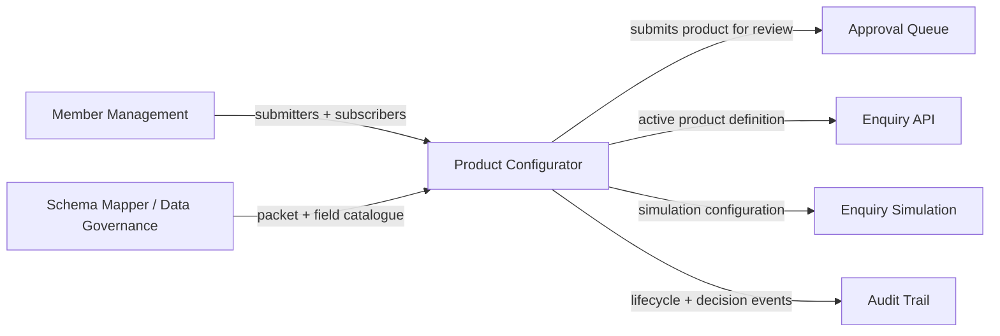
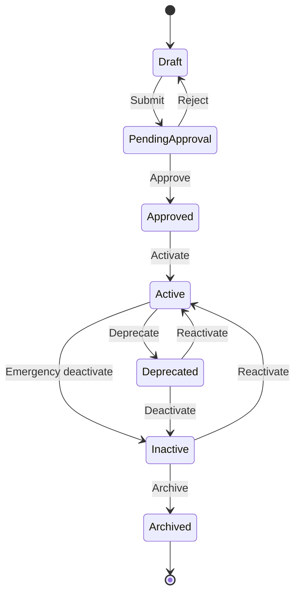

# Business Requirements Document — Product Configurator

**Parent Product:** Hybrid Credit Bureau (HCB) Admin Portal
**Parent Module:** Data Products
**Sub-Module:** Product Configurator (`/data-products/products`)
**Document Type:** Business Requirements Document (BRD)
**Version:** 1.1
**Status:** Draft for review
**Classification:** Internal – Confidential

> This BRD documents **business functionality only**. It intentionally excludes technical implementation, APIs, data schemas, UI construction, and architecture. Where behaviour is owned by other modules, this document **references** them (see [Section 4](#4-module-context--interactions)) rather than restating their requirements.

### Change Log
| Version | Date | Summary |
|---------|------|---------|
| 1.0 | 2026-08-05 | Initial BRD for the Product Configurator sub-module. |
| 1.1 | 2026-08-05 | Added optional **SAP item code** and **Release note** metadata (Release note replaces the earlier "Legal conditions" free-text); renamed the **Lineage** view to **Traceability**; simplified the Overview (removed Data acquisition type / Data availability type / Access restrictions display fields); added **Run test** (in-context enquiry simulation) from the catalogue for Active/Deprecated products; expanded [Section 9 Validations](#9-validations) into detailed, field-level UI validation rules. |

---

## 1. Purpose

### 1.1 Business Purpose
The **Product Configurator** is the authoring and governance workspace where Bureau staff define, version, approve, and manage the lifecycle of **Data Products** — the monetisable units that determine *what* credit data is exposed, *how* it may be consumed, and *by whom*. It is the control point that ensures every product placed in front of subscribing institutions has been deliberately composed, reviewed, and governed before it becomes consumable.

### 1.2 Business Value
- **BV-1** — Standardised, reviewable product definitions ensure consistent credit-data delivery to member institutions.
- **BV-2** — Version governance allows the catalogue to evolve without disrupting institutions already consuming an earlier definition.
- **BV-3** — Mandatory approval gating prevents untested or non-compliant definitions from going live.
- **BV-4** — Duplicate-definition detection protects catalogue integrity and pricing/monetisation logic.
- **BV-5** — Transparent traceability and subscriber visibility support regulatory accountability and audit readiness.

### 1.3 Objectives
| ID | Objective | Success Signal |
|----|-----------|----------------|
| OBJ-1 | Enable self-service product authoring for Bureau product owners | Products can be created and submitted without engineering involvement |
| OBJ-2 | Enforce governance before go-live | No product reaches Active without a recorded approval decision |
| OBJ-3 | Support controlled evolution | New versions can supersede old ones with managed subscriber wind-down |
| OBJ-4 | Provide entitlement control | Institution access to a product is explicit, requested, and approved |

---

## 2. Scope

### 2.1 In Scope (business functionality)
- Browsing the product catalogue as a governed list (one entry per product, showing its most relevant version).
- Authoring a product definition: identity, business metadata, composed data packets, field contract, enquiry behaviour, and trended-data behaviour.
- Version management: creating successor versions of an existing product and comparing versions.
- Governance workflow: submitting a definition for approval, and recording approval or rejection decisions under an approval policy.
- Lifecycle management: activating, deprecating (with wind-down), deactivating, emergency deactivating, and archiving product versions.
- Subscriber entitlement: institutions requesting access to a product and those requests being approved or rejected.
- Product transparency: viewing the data contract, traceability (data submitters → packets → product → consumers), subscribers, version history, and audit trail.
- Pre-go-live enquiry validation: an in-context **Run test** simulation from the catalogue, plus the standalone enquiry simulation entry point (configuration handoff — see [Section 4](#4-module-context--interactions)).

### 2.2 Out of Scope
- **OOS-1** — Pricing/rate calculation and invoice generation (monetisation engine).
- **OOS-2** — Runtime enquiry execution and scoring (owned by the Enquiry API module).
- **OOS-3** — Institution onboarding and member registry management (owned by Member Management).
- **OOS-4** — Packet/source schema authoring and field discovery (owned by Schema Mapper / Data Governance).
- **OOS-5** — Bureau-wide approval administration beyond product-scoped decisions (owned by the Approval Queue module).
- **OOS-6** — Delegation of approval authority (parked; see [Section 13](#13-open-questions--ambiguities), OQ-07).

---

## 3. Personas & Roles

Reuses the portal RBAC model. Product Configurator recognises the following business roles:

| Persona | Portal Role (reference) | Responsibility in this sub-module |
|---------|--------------------------|-----------------------------------|
| Product Owner ("Local CPO") | Bureau Admin | Creates, edits, and submits product definitions; initiates lifecycle changes |
| Approver (Product Head / Governance) | Bureau Admin / Governance | Reviews submissions and records approve/reject decisions |
| Data Analyst | Analyst | Reads product definitions, lineage, and audit; no authoring rights |
| Subscriber Institution | Member (API consumer) | Consumes active products via Enquiry API; represented here as the requester/holder of access entitlements |

> Detailed permission matrix in [Section 10](#10-permissions).

---

## 4. Module Context & Interactions

The Product Configurator does not operate in isolation. It **depends on** and **feeds** the following parent/sibling modules. Requirements owned by those modules are not restated here.

| ID | Interacting Module | Direction | Business Interaction |
|----|--------------------|-----------|----------------------|
| INT-1 | Member Management | Inbound | Supplies the institutions that appear as **data submitters** (lineage) and **subscribers/consumers** (entitlements). |
| INT-2 | Schema Mapper / Data Governance | Inbound | Supplies the **data packets** and their fields from which a product is composed. |
| INT-3 | Approval Queue | Outbound | Receives product submissions and access-request submissions for governance review; decisions flow back to update product/entitlement status. |
| INT-4 | Enquiry API | Outbound | Consumes **Active** product definitions to serve live credit enquiries. |
| INT-5 | Enquiry Simulation | Outbound | Receives a product configuration for pre-go-live validation. |
| INT-6 | Audit Trail | Outbound | Receives every material action (creation, submission, decision, lifecycle change, access decision, notification) for accountability. |

---

## 5. Terminology (Reused)

| Term | Business Meaning |
|------|------------------|
| Product | A governed, monetisable data definition identified by a stable product code, expressed through one or more versions. |
| Version | A specific, immutable-once-published definition of a product. |
| Data Packet | A reusable bundle of related credit-data fields sourced from submitting institutions (owned by Data Governance). |
| Field Contract | The concrete set of fields a product exposes, derived from its selected packets minus any disabled fields. |
| Data Submitter | A member institution that contributes data into a packet used by the product. |
| Consumer / Subscriber | A member institution entitled to consume the product. |
| Enquiry Impact | Whether an enquiry against the product is a **Soft** (no consumer footprint) or **Hard** pull. |
| Coverage Scope | Breadth of data the product draws on: **Self**, **Network**, **Consortium**, or **Vertical**. |
| Trended Data | Historical time-series exposure, bounded by a maximum history ceiling. |
| Definition Fingerprint | A business signature of a product's exposed definition, used to detect duplicate products. |
| Approval Policy | The rule set (single / quorum / sequential) that governs how a submission is approved. |
| Wind-down Window | The notice period during which a deprecated version's existing consumers are expected to migrate. |
| Release Note | A free-text summary of what changed in a given product version (replaces the earlier "Legal conditions" field). |
| SAP Item Code | Optional external material/item code used as a billing reference for the product. |
| Run Test | An in-context, non-production enquiry simulation launched from a product card to validate a live/deprecated definition. |
| Traceability | The end-to-end view of data submitters → packets → product version → consumers (formerly "Lineage"). |

---

## 6. Business Capabilities Overview

| ID | Capability | Summary |
|----|-----------|---------|
| CAP-1 | Product Catalogue | Browse and locate products; each product surfaces its most relevant version. |
| CAP-2 | Product Authoring | Define product identity, metadata, packets, field contract, and enquiry behaviour. |
| CAP-3 | Versioning | Create successor versions and compare definitions across versions. |
| CAP-4 | Governance Submission | Submit a definition for approval under a chosen policy. |
| CAP-5 | Approval Decisioning | Approve or reject submissions with mandatory accountability. |
| CAP-6 | Lifecycle Management | Move versions through the governed lifecycle states. |
| CAP-7 | Subscriber Entitlement | Request, approve, or reject institution access to a product. |
| CAP-8 | Transparency & Traceability | View data contract, traceability, subscribers, version history, and audit. |
| CAP-9 | Pre-Go-Live Validation | Run an in-context test simulation and hand off a configuration for enquiry simulation. |

---

## 7. Detailed Business Requirements

Requirement IDs use the prefix **PC-FR** (functional) and **PC-BR** (business rule).

### 7.1 Product Catalogue (CAP-1)

| ID | Requirement |
|----|-------------|
| PC-FR-101 | The catalogue shall present one entry per product, identified by its product code and name. |
| PC-FR-102 | Each catalogue entry shall surface a single **representative version** and its lifecycle status, the count of subscribers, and the last-updated date. |
| PC-FR-103 | Users shall be able to search the catalogue by product name, product code, and description. |
| PC-FR-104 | Users shall be able to filter the catalogue by saved business views: **All**, **Active**, **Pending my approval**, **Deprecated with consumers**, and **Drafts**. |
| PC-FR-105 | A product carrying an unresolved policy warning shall be visibly flagged in the catalogue. |
| PC-FR-106 | Selecting a catalogue entry shall open that product's detail view at its representative version. |

**Business rules**
- **PC-BR-101** — The representative version shall be resolved by business priority: latest **Active**, else latest **Deprecated**, else latest **Pending Approval**, else latest **Draft**.

### 7.2 Product Authoring (CAP-2)

| ID | Requirement |
|----|-------------|
| PC-FR-201 | A Product Owner shall be able to create a new product by providing a product name and description. |
| PC-FR-202 | The system shall assign each new product a unique product code automatically; the code is not user-editable. |
| PC-FR-203 | The Product Owner shall provide business metadata: business unit, target segment, optional **SAP item code**, sensitivity (Low/Medium/High), **release note**, tags, and effective start date. The SAP item code and release note are optional; when omitted they display as an em dash. |
| PC-FR-203a | When sensitivity is set to **High**, the product shall be indicated as routed to the governance quorum approval policy. |
| PC-FR-204 | The Product Owner shall compose the product by selecting one or more data packets from the governed packet catalogue. |
| PC-FR-205 | The Product Owner shall configure, per packet, which fields are exposed, and may disable individual selected fields so they are retained in the selection but excluded from what the product delivers. |
| PC-FR-206 | The product's **field contract** shall be derived automatically from selected packet fields minus disabled fields, plus any selected derived fields. |
| PC-FR-207 | The Product Owner shall configure enquiry behaviour: **Enquiry Impact** (Soft/Hard) and **Coverage Scope** (Self/Network/Consortium/Vertical). |
| PC-FR-208 | The Product Owner shall be able to enable **Trended Data** and set a maximum history ceiling (in months). |
| PC-FR-209 | The Product Owner shall be able to save an in-progress definition as a **Draft** without submitting it. |
| PC-FR-210 | A live preview shall reflect the product definition (request/response shape at a business level) as the Product Owner configures it. |

**Business rules**
- **PC-BR-201** — Product name must be unique across the catalogue (case- and separator-insensitive). A collision with a different product code shall block save/submit.
- **PC-BR-202** — A product definition must include at least one data packet before it can be submitted for approval.
- **PC-BR-203** — When Trended Data is disabled, no history ceiling applies; when enabled, a positive ceiling is required.
- **PC-BR-204** — A published (non-Draft) version is immutable; changing its definition requires creating a new version (see CAP-3).

### 7.3 Versioning (CAP-3)

| ID | Requirement |
|----|-------------|
| PC-FR-301 | A user shall be able to create a new version of an existing product; the new version starts as a Draft that inherits the source definition. |
| PC-FR-302 | The system shall number versions sequentially per product code. |
| PC-FR-303 | A user shall be able to view the version history of a product, showing each version's status, effective dates, and approval outcome. |
| PC-FR-304 | A user shall be able to compare two versions of the same product to understand definition differences. |

**Business rules**
- **PC-BR-301** — Only one Draft version may exist per product at a time; a new version cannot be created while a Draft is open.
- **PC-BR-302** — A product may have at most **three** concurrently Active versions; attempting to activate beyond this ceiling shall be blocked. Existing consumers remain on their adopted version.

### 7.4 Governance Submission (CAP-4)

| ID | Requirement |
|----|-------------|
| PC-FR-401 | A Product Owner shall submit a Draft for approval, providing a business justification and selecting an applicable approval policy. |
| PC-FR-402 | On submission, the version shall move to **Pending Approval** and be enqueued for review (see INT-3). |
| PC-FR-403 | Available approval policies shall include **Single approver**, **Governance quorum (2-of-3)**, and **Sequential (Product Head then Governance)**, each with a stated trigger. |
| PC-FR-404 | Where a submission would create a **duplicate product definition** (matching an already Approved/Active/Deprecated product elsewhere), the submission shall be blocked unless the submitter explicitly requests a governance exception with justification. |

**Business rules**
- **PC-BR-401** — Only a **Draft** version may be submitted for approval.
- **PC-BR-402** — Duplicate-definition detection is based on the **definition fingerprint** (exposed field contract + coverage scope + enquiry impact + trended configuration).
- **PC-BR-403** — Name uniqueness (PC-BR-201) is re-validated at submission time.

### 7.5 Approval Decisioning (CAP-5)

| ID | Requirement |
|----|-------------|
| PC-FR-501 | An Approver shall be able to view pending product submissions relevant to them and open a submission for review. |
| PC-FR-502 | An Approver shall record a decision of **Approve** or **Reject** with an accountable comment. |
| PC-FR-503 | Approving a submission shall move the version to **Approved** (a subsequent activation step is required to make it live — see CAP-6). |
| PC-FR-504 | Rejecting a submission shall return the version to **Draft** so it can be revised and resubmitted. |
| PC-FR-505 | The system shall preserve a record of each decision (actor, role, comment, timestamp) against the submission. |

**Business rules**
- **PC-BR-501** — **Separation of duties:** the person who submitted a version cannot approve that same submission.
- **PC-BR-502** — A **Reject** decision requires a comment.
- **PC-BR-503** — A decision may only be recorded on a submission that is still **Pending**.

### 7.6 Lifecycle Management (CAP-6)

Governed lifecycle states: **Draft → Pending Approval → Approved → Active → Deprecated → Inactive → Archived**.

| ID | Requirement |
|----|-------------|
| PC-FR-601 | An authorised user shall activate an **Approved**, **Deprecated**, or **Inactive** version to make it Active. |
| PC-FR-602 | An authorised user shall deprecate an **Active** version, specifying a wind-down window (in days) during which existing consumers are expected to migrate. |
| PC-FR-603 | An authorised user shall deactivate a **Deprecated** version, or perform an **emergency deactivation** of an **Active** version. |
| PC-FR-604 | An authorised user shall archive an **Inactive** version; archiving is terminal. |
| PC-FR-605 | Every lifecycle change shall require a business justification. |
| PC-FR-606 | Deprecation, (re)activation, and deactivation shall generate a consumer notification to subscribed institutions and internal capabilities. |

**Business rules**
- **PC-BR-601** — Only transitions permitted by the governed state matrix are allowed; any other transition is rejected.
- **PC-BR-602** — Moving an **Active** version directly to **Inactive** is only permitted as an explicit **emergency deactivation**.
- **PC-BR-603** — A deprecation wind-down window must be a whole number of at least one day.
- **PC-BR-604** — Concurrent-active ceiling of three (PC-BR-302) is enforced on activation.
- **PC-BR-605** — Deactivating or archiving a version releases its consumer count (entitlements are no longer counted against it).
- **PC-BR-606** — **Archived** is a terminal state with no onward transitions.

### 7.7 Subscriber Entitlement (CAP-7)

| ID | Requirement |
|----|-------------|
| PC-FR-701 | An access request shall be raised on behalf of a member institution, capturing: institution, target product, pinned version (optional), business domain, consuming application, billing reference, usage period (months), and purpose. |
| PC-FR-702 | A submitted access request shall create a **Pending** subscription and enter the approval workflow (see INT-3). |
| PC-FR-703 | Approving an access request shall set the subscription to **Active** and increment the product's consumer count. |
| PC-FR-704 | Rejecting an access request shall set the subscription to **Rejected**. |
| PC-FR-705 | Subscribers of a product shall be viewable, showing institution, pinned version, subscription status, and request date. |

**Business rules**
- **PC-BR-701** — An access request pins to the requested version, else the current Active version, else the product's most relevant version.
- **PC-BR-702** — Access-request approvals follow the same **separation-of-duties** principle as product approvals (PC-BR-501).

### 7.8 Transparency & Traceability (CAP-8)

| ID | Requirement |
|----|-------------|
| PC-FR-801 | The product detail shall present an **Overview** of business metadata (business unit, segment, SAP item code, sensitivity, effective start, published date, environment) and the version **release note**. |
| PC-FR-802 | The product detail shall present the **Data Contract** — the fields the product exposes, with type, PII indication, and attribute mode (Snapshot/Trended). |
| PC-FR-803 | The product detail shall present **Traceability** showing the flow: data submitters → data packets → this product version → consumers. |
| PC-FR-804 | From traceability, a user shall be able to inspect the field list contributed by any individual packet. |
| PC-FR-805 | The product detail shall present **Subscribers** and **Version history**. |
| PC-FR-806 | An **Audit trail** of all material actions on the product shall be viewable. |
| PC-FR-807 | The product detail navigation shall be presented as tabs: Overview, Data Contract, Traceability, Subscribers, Versions. |

**Business rules**
- **PC-BR-801** — Traceability data submitters are resolved to named member institutions (INT-1); where a packet has no named submitter, its source label is shown. Consumers are the product's subscribing institutions.
- **PC-BR-802** — A field is marked **PII** and its attribute **mode** based on governed field semantics.
- **PC-BR-803** — The Overview no longer exposes data-acquisition type, data-availability type, or access-restrictions display fields (removed in v1.1); any such governance text is carried in the release note / legal terms owned elsewhere.

### 7.9 Pre-Go-Live Validation (CAP-9)

| ID | Requirement |
|----|-------------|
| PC-FR-901 | A user shall be able to initiate an **Enquiry Simulation** for a product configuration to validate behaviour before go-live. |
| PC-FR-902 | Simulation configuration shall identify the requesting institution, the target product, and consumer/enquiry parameters. |
| PC-FR-903 | A user shall be able to launch a **Run test** in-context from a product card to simulate an enquiry against that product's representative version. |
| PC-FR-904 | **Run test** shall be available **only** for products whose representative version is **Active** or **Deprecated**; it shall not be offered for Draft, Pending Approval, Approved, Inactive, or Archived. |
| PC-FR-905 | **Run test** shall capture minimal consumer inputs — name, phone number, ID type, ID value, and address — and present the simulated response on a separate result step, with a way to return to the inputs. |

**Business rules**
- **PC-BR-901** — Simulation and Run test must not create a real enquiry footprint against a consumer (see [Section 4](#4-module-context--interactions), INT-5; production execution owned by Enquiry Simulation / Enquiry API).
- **PC-BR-902** — Run test uses the product's own composed packets to shape the simulated response; the product is fixed (not selectable) within the test.

---

## 8. User Actions Summary

| ID | Actor | Action | Precondition | Business Outcome |
|----|-------|--------|--------------|------------------|
| UA-01 | Product Owner | Create draft product | — | New Draft with unique code |
| UA-02 | Product Owner | Edit draft | Version is Draft | Updated Draft definition |
| UA-03 | Product Owner | Submit for approval | Draft, ≥1 packet, unique name, no unresolved duplicate | Version → Pending Approval |
| UA-04 | Approver | Approve submission | Pending, not self-submitted | Version → Approved |
| UA-05 | Approver | Reject submission | Pending, comment provided | Version → Draft |
| UA-06 | Authorised user | Activate | Approved / Deprecated / Inactive, ceiling not exceeded | Version → Active + notification |
| UA-07 | Authorised user | Deprecate | Active, valid wind-down window | Version → Deprecated + notification |
| UA-08 | Authorised user | Deactivate | Deprecated | Version → Inactive + notification |
| UA-09 | Authorised user | Emergency deactivate | Active | Version → Inactive + notification |
| UA-10 | Authorised user | Archive | Inactive | Version → Archived (terminal) |
| UA-11 | Product Owner | Create new version | No open Draft for product | New Draft version |
| UA-12 | Product Owner | Compare versions | ≥2 versions | Definition differences shown |
| UA-13 | On behalf of institution | Request access | Product exists | Pending subscription |
| UA-14 | Approver | Approve/Reject access | Access request Pending, not self-submitted | Subscription Active / Rejected |
| UA-15 | Any user | Run test | Representative version is Active or Deprecated | Simulated enquiry response shown (no footprint) |

---

## 9. Validations

Validations are grouped by the business action/form they govern. **Surfacing** indicates how the rule is communicated at a business level: *Inline* = shown next to the field as the user types; *Blocking* = prevents the action and shows a message; *Gating* = the control is hidden/disabled until preconditions are met.

### 9.1 Product identity & authoring (Create / Edit draft)

| ID | Field / Rule | Requirement | Surfacing |
|----|--------------|-------------|-----------|
| PC-VAL-01 | Product name — required | Name must not be empty | Blocking |
| PC-VAL-02 | Product name — length | Name must be **5–80 characters** | Blocking |
| PC-VAL-03 | Product name — whitespace | No leading or trailing whitespace | Blocking |
| PC-VAL-04 | Product name — reserved suffix | Name must not end with a placeholder word (e.g. "new", "final", "copy") | Blocking |
| PC-VAL-05 | Product name — uniqueness | Name must be unique across the catalogue (case- and separator-insensitive); a conflict links to the existing product | Inline + Blocking |
| PC-VAL-06 | SAP item code | Optional; trimmed of surrounding whitespace on save | Inline (optional) |
| PC-VAL-07 | Release note | Optional free text | Inline (optional) |
| PC-VAL-08 | Sensitivity | One of Low / Medium / High; High signals quorum governance routing | Inline |
| PC-VAL-09 | Tags | Comma-separated; blank entries are ignored | Inline |
| PC-VAL-10 | Trended history ceiling | Required and positive **only when** Trended Data is enabled | Blocking |

### 9.2 Packet composition

| ID | Field / Rule | Requirement | Surfacing |
|----|--------------|-------------|-----------|
| PC-VAL-11 | At least one packet | A product must include ≥1 data packet before submission | Blocking |
| PC-VAL-12 | Disabled fields | A disabled field remains selected but is excluded from the delivered contract and fingerprint | Inline |

### 9.3 Governance submission

| ID | Field / Rule | Requirement | Surfacing |
|----|--------------|-------------|-----------|
| PC-VAL-13 | Only Draft submittable | Only a Draft version can be submitted for approval | Gating |
| PC-VAL-14 | Business justification | Required (non-empty) to submit | Blocking |
| PC-VAL-15 | Approval policy | A policy must be selected (defaults to Single approver) | Inline |
| PC-VAL-16 | Name re-check | Name uniqueness re-validated at submission | Blocking |
| PC-VAL-17 | Duplicate definition | If the definition fingerprint matches an existing Approved/Active/Deprecated product, submission is blocked unless **Request exception** is set; exception justification is captured for approvers | Inline + Blocking |

### 9.4 Approval decisioning

| ID | Field / Rule | Requirement | Surfacing |
|----|--------------|-------------|-----------|
| PC-VAL-18 | Separation of duties | The submitter cannot approve/reject their own submission | Gating + Blocking |
| PC-VAL-19 | Reject comment | A comment is required to reject (optional on approve) | Blocking (Reject disabled until provided) |
| PC-VAL-20 | Pending only | A decision can only be recorded while the submission is Pending | Gating |

### 9.5 Lifecycle transitions

| ID | Field / Rule | Requirement | Surfacing |
|----|--------------|-------------|-----------|
| PC-VAL-21 | Justification | Every lifecycle change requires a non-empty justification | Blocking |
| PC-VAL-22 | Permitted transition | Only transitions allowed by the state matrix are accepted | Gating + Blocking |
| PC-VAL-23 | Wind-down window | On deprecate, the window must be a whole number ≥ 1 day | Inline + Blocking |
| PC-VAL-24 | Emergency dual-control | Active → Inactive requires the emergency confirmation to be checked | Blocking |
| PC-VAL-25 | Concurrent-active ceiling | Activation blocked when 3 versions of the product are already Active | Blocking |

### 9.6 Subscriber access request

| ID | Field / Rule | Requirement | Surfacing |
|----|--------------|-------------|-----------|
| PC-VAL-26 | Required fields | Requesting institution, business domain, consuming application, purpose, and pinned version are all required | Gating (submit disabled) |
| PC-VAL-27 | Billing reference | Required (non-empty after trim) | Gating |
| PC-VAL-28 | Usage period | Numeric months; defaults to 12 when not provided | Inline |
| PC-VAL-29 | Access separation of duties | The access-request approver cannot be the requester | Gating + Blocking |

### 9.7 Run test

| ID | Field / Rule | Requirement | Surfacing |
|----|--------------|-------------|-----------|
| PC-VAL-30 | Availability | Run test is only offered when the representative version is Active or Deprecated | Gating |
| PC-VAL-31 | Inputs | Name, phone number, ID type, ID value, and address are captured; the test runs against the fixed product | Inline |
| PC-VAL-32 | No footprint | Executing a test produces a simulated response only and never records a real enquiry | Business rule |

### 9.8 Cross-cutting state guards

| ID | Field / Rule | Requirement | Surfacing |
|----|--------------|-------------|-----------|
| PC-VAL-33 | Single open Draft | Only one open Draft may exist per product; a new version cannot be created while a Draft is open | Blocking |
| PC-VAL-34 | Edit scope | Only a Draft is editable; published versions are read-only (new version required to change) | Gating |

---

## 10. Permissions

| Capability | Product Owner | Approver | Data Analyst | Subscriber Institution |
|------------|:-------------:|:--------:|:------------:|:----------------------:|
| Browse catalogue & detail | Yes | Yes | Yes | View own entitlements |
| Create / edit draft | Yes | — | — | — |
| Submit for approval | Yes | — | — | — |
| Approve / reject submission | — | Yes | — | — |
| Activate / deprecate / deactivate / archive | Yes | — | — | — |
| Create new version / compare | Yes | Yes (view) | View | — |
| Raise access request | Yes | — | — | Yes (as beneficiary) |
| Approve / reject access request | — | Yes | — | — |
| View traceability, contract, audit | Yes | Yes | Yes | Limited |
| Run test (Active/Deprecated) | Yes | Yes | Yes | — |

**Business rules**
- **PC-BR-1001** — Authoring and lifecycle actions are restricted to Product Owners; decisioning is restricted to Approvers.
- **PC-BR-1002** — Separation of duties overrides role permission: even a permitted Approver cannot decide on their own submission.

---

## 11. Dependencies

| ID | Dependency | Nature | Impact if Unavailable |
|----|-----------|--------|-----------------------|
| DEP-1 | Member Management registry | Data | No submitters/consumers to attribute in lineage or entitlements |
| DEP-2 | Packet & field catalogue (Data Governance) | Data | Products cannot be composed |
| DEP-3 | Approval Queue module | Process | Submissions and access requests cannot be governed |
| DEP-4 | Enquiry API module | Downstream | Active products cannot be consumed at runtime |
| DEP-5 | Enquiry Simulation | Downstream | Pre-go-live validation unavailable |
| DEP-6 | Audit Trail | Cross-cutting | Loss of accountability record |

---

## 12. Edge Cases

| ID | Scenario | Expected Business Behaviour |
|----|----------|-----------------------------|
| EDGE-1 | Two products would expose an identical definition | Second submission blocked unless a governance exception is requested with justification (PC-BR-402). |
| EDGE-2 | Approver attempts to approve own submission | Blocked as separation-of-duties violation (PC-BR-501). |
| EDGE-3 | Attempt to create a new version while a Draft exists | Blocked; the existing Draft must be resolved first (PC-BR-301). |
| EDGE-4 | Activation attempted with three versions already Active | Blocked by concurrent-active ceiling (PC-BR-302). |
| EDGE-5 | Deprecation submitted without a valid wind-down window | Blocked (PC-VAL-23); consumers must receive a valid migration period. |
| EDGE-6 | Active version needs urgent withdrawal | Handled via emergency deactivation, not standard deactivation (PC-BR-602). |
| EDGE-7 | Deprecated version still has consuming institutions | Product remains flagged (e.g. "Deprecated with consumers") until consumers migrate; version may be reactivated or deactivated. |
| EDGE-8 | Access request references a version that is not Active | Request pins by fallback priority (PC-BR-701). |
| EDGE-9 | Rejected submission is revised | Version returns to Draft and may be resubmitted as a new approval cycle (UA-05 → UA-03). |
| EDGE-10 | Archived version selected | No lifecycle actions available; read-only (PC-BR-606). |
| EDGE-11 | Product has no subscribers yet | Subscribers and consumer count show empty/zero without error. |
| EDGE-12 | Packet contributes no fields to the contract | Packet still appears in traceability; its field inspection shows an empty contract for that packet. |
| EDGE-13 | Run test opened for a non-Active/Deprecated product | Not possible — the Run test action is not offered for those statuses (PC-FR-904). |
| EDGE-14 | Deprecated product used in Run test | Permitted; Run test remains available so consumers/validators can compare behaviour during wind-down. |

---

## 13. Open Questions & Ambiguities

| ID | Question / Gap | Why It Matters |
|----|----------------|----------------|
| OQ-01 | Are quorum and sequential approval policies fully enforced (multi-approver counting / ordered stages), or currently treated as single-decision? | Affects governance strength for high-sensitivity products (PC-FR-403). |
| OQ-02 | Should the **Approved** state auto-activate, or always require a separate activation action? | Impacts go-live speed vs. control (PC-FR-503 vs PC-FR-601). |
| OQ-03 | Is there a business SLA/auto-expiry on Pending submissions and Pending access requests? | Prevents stale governance items. |
| OQ-04 | What happens to Active subscriptions when the pinned version is deactivated or archived — forced migration, lapse, or notice only? | Consumer continuity and contractual clarity. |
| OQ-05 | Who is authorised to raise an access request on behalf of an institution (Bureau staff vs. institution self-service)? | Entitlement ownership (PC-FR-701). |
| OQ-06 | Is enquiry simulation **mandatory** before activation, as targeted by the parent epic KPI? (In-context Run test now exists for Active/Deprecated but is not a pre-activation gate.) | Data-quality gating before go-live (PC-FR-901, PC-FR-903). |
| OQ-10 | Should Run test be extended to a **pre-activation** step (e.g. on Approved versions) rather than only post-go-live? | Earlier validation could reduce go-live defects (PC-FR-904). |
| OQ-07 | Delegation of approval authority is currently parked — is it required for launch? | Coverage during approver absence. |
| OQ-08 | Are effective start/end dates business-enforced against activation (e.g. cannot activate before effective start)? | Time-bound availability. |
| OQ-09 | Should usage period on a subscription drive automatic expiry of entitlement? | Recurring entitlement governance (PC-FR-701). |

---

## 14. Assumptions

- **ASM-1** — Member institutions (both submitters and subscribers) are already registered and governed by Member Management before appearing here.
- **ASM-2** — The packet/field catalogue is authored and kept current by Data Governance; the Product Configurator consumes it as-is.
- **ASM-3** — Approval routing, notification delivery, and queue administration are provided by the Approval Queue and platform notification services.
- **ASM-4** — Product code generation is system-owned and guaranteed unique.
- **ASM-5** — A single Bureau tenant context applies; multi-bureau segregation is out of scope for this document.
- **ASM-6** — Audit capture is reliable and append-only for every material action.

---

## 15. Acceptance Criteria

The sub-module is accepted when the following business outcomes hold:

| ID | Acceptance Criterion |
|----|----------------------|
| AC-01 | A Product Owner can create, save, and edit a Draft product with unique name, ≥1 packet, metadata, enquiry behaviour, and optional trended configuration. |
| AC-02 | Submitting a valid Draft moves it to Pending Approval and places it in the governance queue; an invalid Draft is blocked with a clear reason (name, packet, or duplicate-definition). |
| AC-03 | An Approver (other than the submitter) can approve (→ Approved) or reject (→ Draft, with comment); decisions are recorded and auditable. |
| AC-04 | A version can traverse only the permitted lifecycle states; deprecation enforces a valid wind-down window; emergency deactivation is required to withdraw an Active version; archived is terminal. |
| AC-05 | The concurrent-active ceiling (max 3) and the single-open-Draft rule are enforced. |
| AC-06 | Duplicate product definitions are prevented unless an explicit governance exception is provided. |
| AC-07 | Access requests create Pending subscriptions; approval activates and counts the consumer, rejection marks it Rejected; separation of duties is enforced. |
| AC-08 | Lifecycle, deprecation, and (re)activation actions notify subscribed institutions and internal capabilities. |
| AC-09 | Product detail exposes Overview (incl. optional SAP item code and release note), Data Contract, Traceability (submitters → packets → product → consumers with per-packet field inspection), Subscribers, Version history, and Audit trail. |
| AC-10 | A product configuration can be handed off to Enquiry Simulation, and a Run test can be launched in-context, without creating a real consumer enquiry footprint. |
| AC-11 | Every material action is written to the audit trail with actor, action, timestamp, and justification where applicable. |
| AC-12 | Run test is offered only for Active/Deprecated products, captures minimal consumer inputs, and returns a simulated response on a separate result step. |
| AC-13 | All UI validations in [Section 9](#9-validations) are enforced with clear, business-level messaging at the point of action. |

---

## 16. Related Documentation

- [EPIC-04 — Data Products, Packet Configurator & Enquiry Simulation](./User%20stories/EPIC-04-Data-Products-Packet-Configurator-Enquiry-Simulation.md) — parent epic.
- [EPIC-08 — Approval Queue Workflow](./User%20stories/EPIC-08-Approval-Queue-Workflow.md) — governance workflow owner (INT-3).
- [EPIC-02 — Institution / Member Management](./User%20stories/EPIC-02-Institution-Member-Management.md) — submitters and subscribers (INT-1).
- [EPIC-16 — Enquiry API](./User%20stories/EPIC-16-Enquiry-API.md) — runtime consumption of Active products (INT-4).
- [EPIC-06 — Data Governance](./User%20stories/EPIC-06-Data-Governance.md) / [EPIC-05 — Schema Mapper Agent](./User%20stories/EPIC-05-Schema-Mapper-Agent.md) — packet/field catalogue (INT-2).
- [PRD/BRD — HCB Admin Portal](./PRD-BRD-HCB-Admin-Portal.md) — portal-level requirements and personas.
