# Functional Business Requirements Document — Data Quality Monitoring (DQI)

| Field | Value |
|---|---|
| **Product** | Hybrid Credit Bureau (HCB) Admin Portal |
| **Module** | Data Governance — Data Quality Monitoring |
| **Route** | `/data-governance/data-quality-monitoring` |
| **Document type** | Functional BRD (as implemented) |
| **Version** | 1.0 |
| **Status** | Draft for review |
| **Classification** | Internal – Confidential |
| **Primary users** | Bureau data operations; Super Admin / Bureau Admin. Member-institution users see a scoped variant when `institutionId` is present on the session. |

> This BRD documents **current implemented behaviour** of the Data Quality Monitoring UI (Overview, Members, Issues, Submissions, Member detail, Reports drawer). Numbers on screen are produced by a **deterministic client-side mock** (`src/data/dq-monitoring-mock.ts`). Screenshots live in `docs/dqi-monitoring/` and are embedded below. As-of date in the mock is **19 August 2026**.

---

## 1. Document Control

| Item | Detail |
|---|---|
| Author | Senior Business Analyst / Product Manager |
| Date | 19 August 2026 |
| Reviewers | Bureau Ops lead, Platform Product Owner, QA lead `[TBC – needs stakeholder input]` |
| Source of truth | Implemented UI under `src/pages/data-governance/dq-monitoring/` plus mock engine `src/data/dq-monitoring-mock.ts` |

### Change log

| Version | Date | Author | Summary |
|---|---|---|---|
| 1.0 | 2026-08-19 | BA/PM | Initial functional BRD covering all DQI Monitoring tabs, member drill-down, reports drawer, field dictionary, and calculation rules, with embedded screenshots. |

---

## 2. Executive Summary

### 2.1 Business problem

Member institutions submit credit and related data through **batch files** and the **Data Submission API**. Bureau operations need one place to answer: *What is portfolio quality? Which members dropped? Which rules are hurting the most records? Which submissions failed validation?* Without a DQI centre, reject rates, duplicate collapse, and threshold pauses are discovered late.

### 2.2 Proposed solution (as implemented)

The **Data Quality Monitoring** module presents:

1. **Overview** — period/member/profile filters; six KPI tiles with range badges; Top quality issues table.
2. **Members** — searchable, watchlist-aware table of member × profile rows with aggregated DQI, grade, delta, last assessment.
3. **Issues** — catalogue of rule failures with expand-in-place member list and masked sample record IDs.
4. **Submissions** — Batches table and API daily assessments table, each with a per-row DQI report download.
5. **Member detail** — scorecard header plus Trend / Dimensions / Issues / Submissions / Events.
6. **Reports drawer** — generate/download extracts (opened via `?reports=1`; job list is in-session only).

### 2.3 Expected business value

- **BV-001** — Ops can judge portfolio intake quality (volume, accept, reject, duplicates, rule-failure mix) in one screen.
- **BV-002** — Issue catalogue plus member expand lets ops isolate a rule code and the institutions driving it.
- **BV-003** — Member list and scorecard isolate deteriorating institutions (DQI, grade, delta).
- **BV-004** — Submission rows connect a batch/API day to DQI grade and a downloadable extract; batch rows can jump to File Monitoring from member detail.

### 2.4 Success metrics (KPI badges on Overview)

| ID | Metric on screen | Definition (this module) | Badge “acceptable” if |
|---|---|---|---|
| KPI-001 | Accepted | `acceptedPct` for the filtered window | ≥ 95% |
| KPI-002 | Rejected | `100 − acceptedPct` | ≤ 5% |
| KPI-003 | % of duplicate records | `duplicatesCollapsed ÷ recordsEvaluated × 100` | ≤ 1% |
| KPI-004 | % of warning rules failed | count of WARNING issues ÷ count of issues in filter × 100 | ≤ 1% |
| KPI-005 | % of Info rules failed | count of INFO issues ÷ count of issues in filter × 100 | ≤ 5% |

If the value misses “acceptable” but is still inside the watch band, the same badge copy **Needs attention** is used as for “out of range” (the UI does not print a separate “watch” label). See §6.3.

---

## 3. Scope

### 3.1 In scope

- Page chrome: title **Data Quality Monitoring**; subtitle; freshness line; tabs **Overview**, **Members**, **Issues**, **Submissions**.
- Shared filters: Period (24h / 7d / 30d / 90d / Custom + From/To), Member multi-select, Profile.
- Overview KPIs and Top quality issues.
- Members toolbar (search, All / Watchlist, Export), pagination, row → member detail.
- Issues table, expand row, View rule → Master Schema.
- Submissions Batches / API daily assessments, DQI report CSV download.
- Member detail tabs Trend, Dimensions, Issues, Submissions, Events; watchlist; scorecard CSV.
- Reports drawer (report types, Generate job lifecycle, Download with 100k-row cap notice).
- Member-scoped banner when the logged-in user has an institution.

### 3.2 Out of scope (not on the live screens, though some exist only in mock types)

- Channel segmented control (All / Batch / API) — **typed and parsed from URL `channel=` but not shown on the filter bar**.
- Compare-vs-prior toggle — **defaults on (`compare !== "0"`) but no control**.
- Source type, Severity, Grade filters — **parsed from URL, not on the filter bar**.
- Portfolio DQI headline tile, grade distribution, movers lists, threshold-events queue, portfolio P90/median/P10 trend chart — **present in mock data, not rendered on Overview**.
- Reports **button** in page chrome — drawer opens when `reports=1` is on the query string.
- Live Spring/Fastify DQI API — this module is mock-driven.

### 3.3 Assumptions

- As-of date for generated data is **2026-08-19**.
- Universe size is **1,214 members**.
- Identifiers are masked in the UI (record IDs like `4001-R0000015`); field **values** are never shown.
- Batch IDs follow `BATCH-{MEMBERID}-{YYYYMMDD}-{seq4}`.

---

## 4. Users and access

| Persona | Access |
|---|---|
| Super Admin / Bureau Admin (e.g. `admin@hcb.com`) | Full portfolio: all 1,214 members, all tabs. |
| User with `institutionId` on session | Same routes; a banner states the view is **member-scoped** and that portfolio figures are **anonymised percentiles**. Filter/member lists are **not** further restricted in the current mock (the banner is informational). |

Nav path: **Data Governance → Data Quality Monitoring**. Command palette entry: “Data Quality Monitoring”.

---

## 5. Information architecture

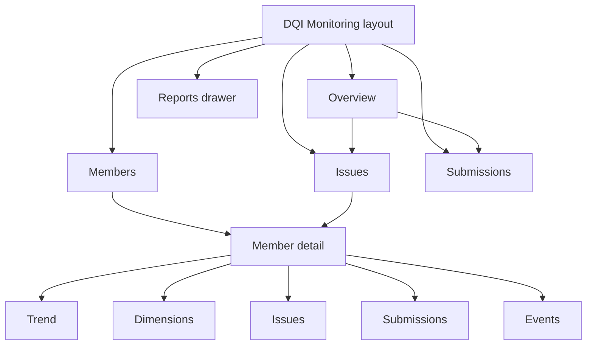

| Route | Screen |
|---|---|
| `/data-governance/data-quality-monitoring` | Overview |
| `…/members` | Members |
| `…/members/:memberId` | Member detail (tabs hidden from module nav) |
| `…/issues` | Issues (`?issue=CODE` expands a row; `?severity=` is applied if present) |
| `…/submissions` | Submissions |
| `?reports=1` | Opens Reports drawer on any of the above |

Filters are stored in the **URL** so they survive tab switches (`period`, `from`, `to`, `members`, `profile`, plus unused `channel`, `compare`, `sourceType`, `severity`, `grade`).

---

## 6. Cross-cutting: chrome, freshness, filters, grades, DQI

### 6.1 Page chrome (all tabs)

| Field / control | Description |
|---|---|
| Title | **Data Quality Monitoring** |
| Subtitle | Quality of submitted data across members and channels — DQI, issues, movers and threshold events. |
| Freshness | `Updated 19 Aug 2026, 09:42 IST · batch: event-driven · API: 60-second aggregates` (constant `DQ_REFRESH_LABEL`) |
| Tabs | Overview (exact path match), Members, Issues, Submissions. Tabs are **hidden** on member detail. Query string is preserved when switching tabs. |
| First-load | ~320 ms skeleton (KPI tiles + table) once per SPA session. |

### 6.2 Shared filter bar

Shown on Overview, Members, Issues, Submissions. **Not** shown on member detail.

| Field | Type | Default | Behaviour |
|---|---|---|---|
| Period | Chip: 24h, 7d, 30d, 90d, Custom | **30d** | Sets `from`/`to` relative to as-of **2026-08-19**. 24h → `from = to = 2026-08-19`. 7d → from 12 Aug. 30d → from 20 Jul. 90d → from 21 May. |
| From / To | Date pickers | Shown only if Period = Custom | Inclusive ISO dates. |
| Member | Searchable multi-select | All 1,214 members | Search by name or ID; first 50 matches listed. Selecting none = all. “Clear members” appears when any are selected. |
| Profile | Single select | All profiles | LOV: Loans master v3.2, Customer demographics v2.1, Collateral v1.4, Repayment schedule v2.0, Member master v1.9, Guarantor v1.1, KYC v2.3. |

**Period date math**

```
to   = 2026-08-19
from = to − N days   where N = 0 (24h), 7, 30, or 90
```

### 6.3 DQI, dimensions, grade

**Canonical DQI (member scorecard / design contract)**

\[
\text{DQI} = 0.40 \times \text{Validity} + 0.35 \times \text{Completeness} + 0.25 \times \text{Duplicates \& Integrity}
\]

Worked example — First National Bank (FNB):

\[
0.40\times 95 + 0.35\times 96 + 0.25\times 97 = 38 + 33.6 + 24.25 = 95.85 \rightarrow 95.8
\]

For generated (unnamed) members, Validity and Completeness are jittered around DQI; Dup & Integrity is **backed out** so the weighted identity holds:

\[
\text{DupIntegrity} = \frac{\text{DQI} - 0.40\cdot\text{Validity} - 0.35\cdot\text{Completeness}}{0.25}
\]

clamped to \[40, 100\] and rounded to 1 decimal.

**Grade from DQI** (`gradeFromDqi`)

| Grade | DQI range | Pill colour (UI) |
|---|---|---|
| A | ≥ 90 | Green |
| B | 80–89.9 | Primary blue |
| C | 70–79.9 | Amber |
| D | 60–69.9 | Orange |
| F | < 60 | Red |

Platform target used in mock constants: **DQI 85**. Portfolio median reference on member trend: **86.9**.

**Delta display (`DqDelta`)**

- Positive: `▲x.x` in green (improvement) unless `invert` (issues) then green means decrease.
- Negative: `▼x.x` in red unless inverted.
- Zero: em dash.

**Overview range badges**

| Status internal | Label shown | Colour |
|---|---|---|
| acceptable | acceptable | Green |
| watch | Needs attention | Amber |
| out | Needs attention | Red |

Accepted uses **higher-is-better** (good ≥ 95, watch ≥ 90). Rejected, duplicates, warning %, info % use **lower-is-better**:

| Metric | acceptable if | watch if (else out) |
|---|---|---|
| Rejected % | ≤ 5 | ≤ 10 |
| Duplicate % | ≤ 1 | ≤ 3 |
| Warning rules % | ≤ 1 | ≤ 1 (so any value > 1 is out) |
| Info rules % | ≤ 5 | ≤ 5 (so any value > 5 is out) |

### 6.4 Default vs filtered headlines

If filters are the **defaults** (30d, all channels, no members, all source/profile/severity/grade), Overview KPIs use the canned portfolio object:

| KPI field | Default value |
|---|---|
| recordsEvaluated | 54,200,000 |
| acceptedPct | 95.1 |
| duplicatesCollapsed | 412,000 |
| rejected (count, unused on tile) | 2,660,000 |

If **any** of those defaults change (including Period = Custom even when dates equal 30d), KPIs are **recomputed**:

\[
\text{DQI}_{port} = \frac{\sum_m \text{DQI}_m \times \text{records}_m}{\sum_m \text{records}_m}
\]

\[
\text{volumeScale} = \text{channelScale} \times \text{periodScale}
\]

| Filter | Scale |
|---|---|
| channel all / (UI default) | 1.00 |
| channel batch (URL only) | 0.62 |
| channel api (URL only) | 0.38 |
| period 30d or custom | 1.00 |
| period 7d | 0.25 |
| period 24h | 0.035 |
| period 90d | 2.80 |

\[
\text{recordsEvaluated} = \mathrm{round}\Bigl(\bigl(\sum_m \text{records}_m\bigr) \times \text{volumeScale}\Bigr)
\]

\[
\text{rejectedShare} = \frac{\sum_m \text{records}_m \times \text{rejectedPct}_m / 100}{\sum_m \text{records}_m}
\]

\[
\text{rejected} = \mathrm{round}(\text{recordsEvaluated} \times \text{rejectedShare})
\]

\[
\text{acceptedPct} = \bigl(1 - \text{rejected}/\text{recordsEvaluated}\bigr) \times 100
\]

\[
\text{warned} = \mathrm{round}(\text{rejected} \times 0.79)
\]

\[
\text{duplicatesCollapsed} = \min\bigl(\text{recordsEvaluated},\; \mathrm{round}(412{,}000 \times \text{volumeScale} \times \tfrac{\lvert subset\rvert}{1214})\bigr)
\]

Empty subset → zeros and grade F; Overview shows empty state “No assessments for the current filters”.

---

## 7. Screens — fields, behaviour, screenshots

### 7.1 Overview

**Purpose.** Portfolio pulse for the selected period / members / profile: volume, accept/reject mix, duplicate and rule-class mix, plus the ranked issue list.

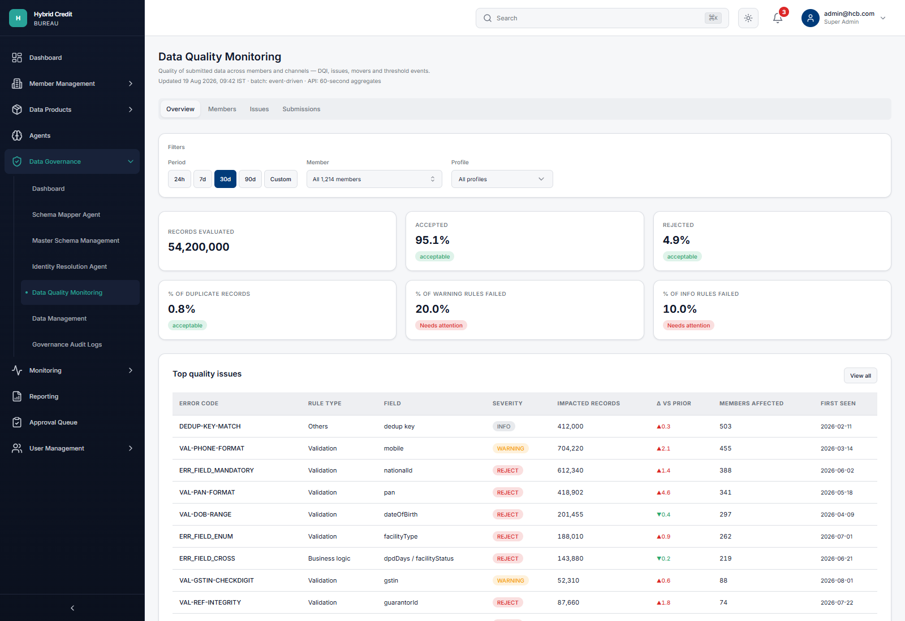

#### 7.1.1 KPI tiles (clickable)

Layout: 3×2 grid.

| Tile label | Value formula | Default (30d, all) | Click destination |
|---|---|---|---|
| Records evaluated | `formatInt(recordsEvaluated)` | 54,200,000 | Submissions |
| Accepted | `acceptedPct` to 1 decimal + `%` | 95.1% · acceptable | Submissions |
| Rejected | `(100 − acceptedPct)` to 1 decimal + `%` | 4.9% · acceptable | Issues |
| % of duplicate records | `duplicatesCollapsed / recordsEvaluated × 100` | 0.8% · acceptable | Issues |
| % of warning rules failed | WARNING issues / all issues in filter × 100 | 2/10 = **20.0%** · Needs attention | Issues `?severity=WARNING` |
| % of Info rules failed | INFO issues / all issues in filter × 100 | 1/10 = **10.0%** · Needs attention | Issues `?severity=INFO` |

Note: Rejected on this tile is a **complement of acceptance**, not `2.66M / 54.2M`. Warning/Info percentages are **share of rule catalogue rows**, not share of records.

#### 7.1.2 Top quality issues

| Column | Source | Notes |
|---|---|---|
| Error code | `code` | Row click → Issues with `?issue={code}` |
| Rule type | `ruleType` | Validation / Transformation / Business logic / Others |
| Field | `field` | Logical field path; no PII values |
| Severity | `severity` | REJECT / WARNING / INFO pills |
| Impacted records | `records` | Integer, en-US grouping |
| Δ vs prior | `deltaPct` | Percentage-point change vs prior window; inverted colour |
| Members affected | `membersAffected` | Distinct members hitting the rule |
| First seen | `firstSeen` | ISO date |

Default sort: **members affected descending**. Button **View all** → Issues tab.

Systemic flag (`membersAffected ≥ 25`) is stored but **not shown** as a chip on Overview.

---

### 7.2 Overview — custom period (filter behaviour)

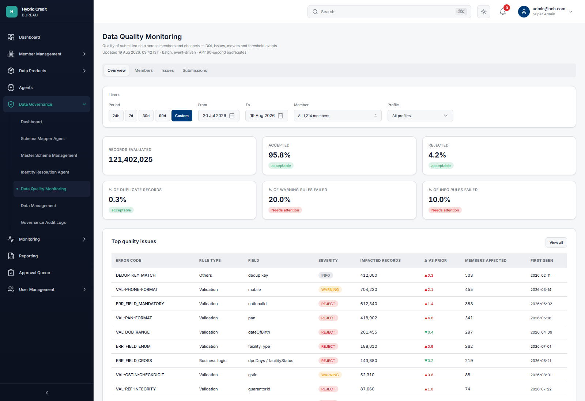

Selecting **Custom** reveals **From** and **To**. Example in the screenshot: 20 Jul 2026–19 Aug 2026 (same span as 30d) but because filters are no longer “default 30d”, headlines switch to the **weighted recompute**. Records evaluated therefore jumps to the sum of per-member `recordsEvaluated` (here **121,402,025**) rather than the canned **54.2M**. Accepted/rejected/duplicate % follow the subset formulas in §6.4. Issue rows themselves are **not** period-sliced in the mock (catalogue is static).

---

### 7.3 Members

**Purpose.** Rank and find institutions; explode one row per profile; open the scorecard.

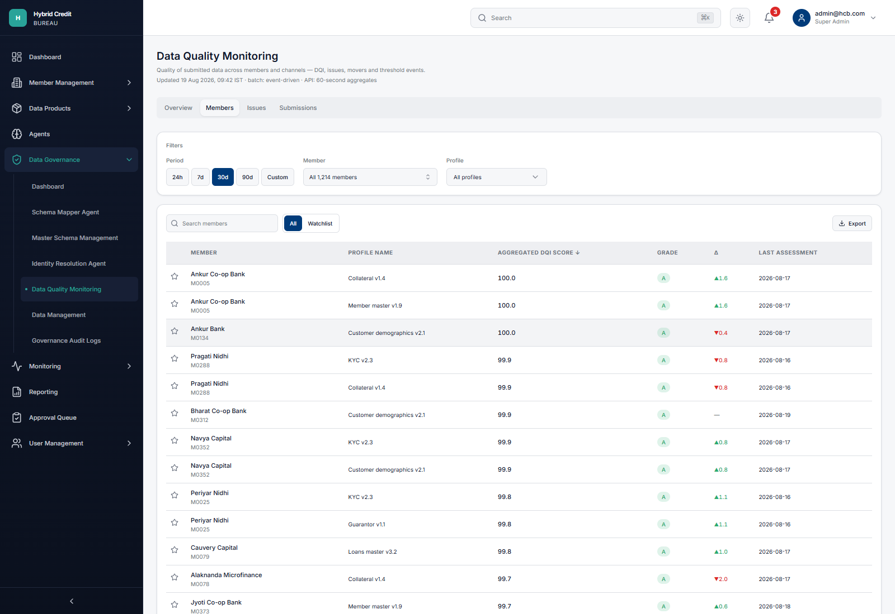

#### 7.3.1 Toolbar

| Control | Behaviour |
|---|---|
| Search members | Case-insensitive match on member **name** or **id**. Resets to page 1. |
| All | All members passing global filters. |
| Watchlist | Only members whose id is in the in-memory watchlist. Seed: APX, KUB, PKL, ORC, NLN, NXD, SPA, SGL, GND, CUF, PNN, FNB. Star on a row toggles membership (does not persist after reload). |
| Export | CSV of the **current page** (not full result set): ID, Member, Profile, DQI, Grade. Toast: “Export started.” |

#### 7.3.2 Row grain and columns

A member with *n* profiles becomes **n table rows** (same DQI/grade/delta/last assessment on each). Key is `{memberId}-{profileName}`.

| Column | Field | Calculation / rule |
|---|---|---|
| ★ | watchlist | Filled star if id ∈ watchlist |
| Member | `name` + `id` | Click row (not star) → `/members/{id}` |
| Profile name | exploded `profiles[]` | “—” if none |
| Aggregated DQI score | `dqi` | 1 decimal; **default sort desc** |
| Grade | `gradeFromDqi(dqi)` unless generated member forced to a grade bucket | Pill A–F |
| Δ | `dqi − dqiPrev` | `dqiPrev = dqi − seedDelta` |
| Last assessment | `lastAssessment` | ISO date, 0–3 days before as-of |

Sortable headers: Member, Aggregated DQI score, Last assessment. Page size **50**. Footer: `Showing {from}–{to} of {total}` with Previous / Next.

**Attention score (not displayed, used only to flag `isMyMember` for 86 members):**

\[
\text{attention} = (100 - \text{DQI})\times 0.55 + \text{rejectedPct}\times 0.7 + \text{breaches}\times 8
\]

**Rejected % on the member record (not a column):**

\[
\text{rejectedPct} = \mathrm{clamp}\bigl((100-\text{DQI})\times 0.22 + U[0,1.4],\; 0.2,\; 28\bigr)
\]

**Grade census (generated members fill remaining slots):** A 421 · B 498 · C 201 · D 68 · F 26.

---

### 7.4 Issues

**Purpose.** Rule-level triage across the bureau.

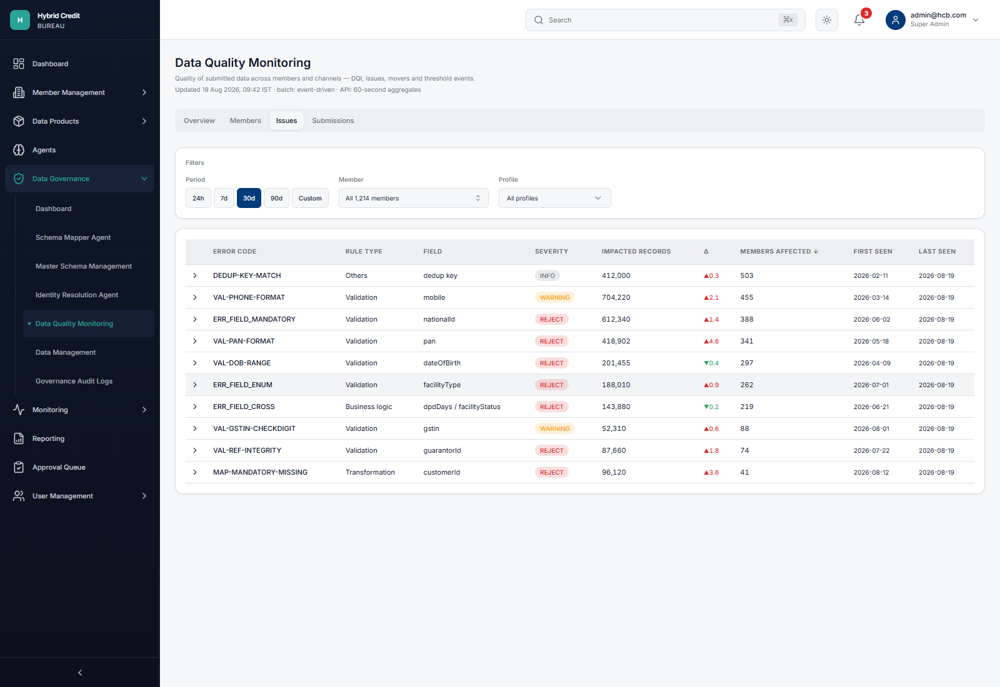

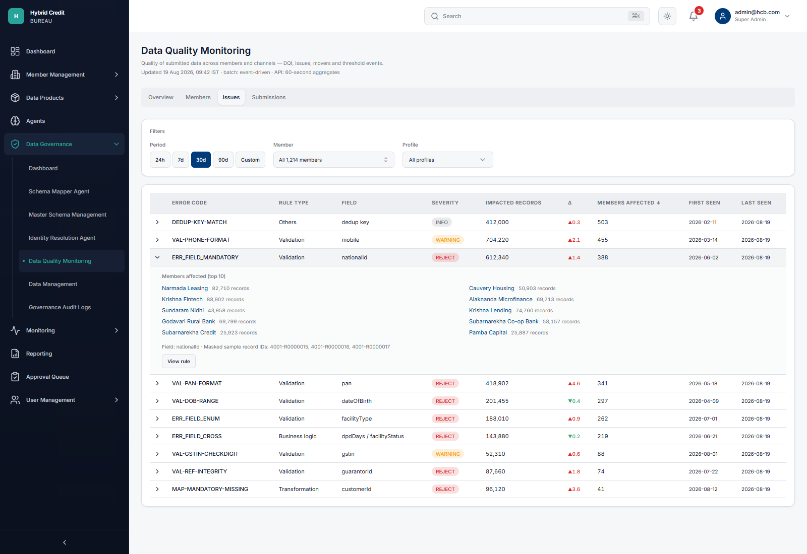

#### 7.4.1 Table columns

| Column | Field | Notes |
|---|---|---|
| Expand | chevron | Toggles `?issue={code}` |
| Error code | `code` | See catalogue §8 |
| Rule type | `ruleType` | |
| Field | `field` | |
| Severity | `severity` | Filterable via URL `severity=` (not on bar) |
| Impacted records | `records` | Sortable |
| Δ | `deltaPct` | Inverted colours |
| Members affected | `membersAffected` | **Default sort desc**; sortable |
| First seen / Last seen | dates | Last seen defaults to as-of |

`systemic=1` on the URL would hide non-systemic rows; **no chip** is rendered on the bar.

#### 7.4.2 Expanded panel

| Element | Rule |
|---|---|
| Members affected (top 10) | Links to member detail; record counts are a synthetic share of the issue’s records |
| Field + Masked sample record IDs | Format `{fileId}-R{padded}` e.g. `4001-R0000015` |
| View rule | Navigates to `/data-governance/master-schema` (not a specific rule id) |

---

### 7.5 Submissions — Batches

**Purpose.** One row per completed batch in the filter window.

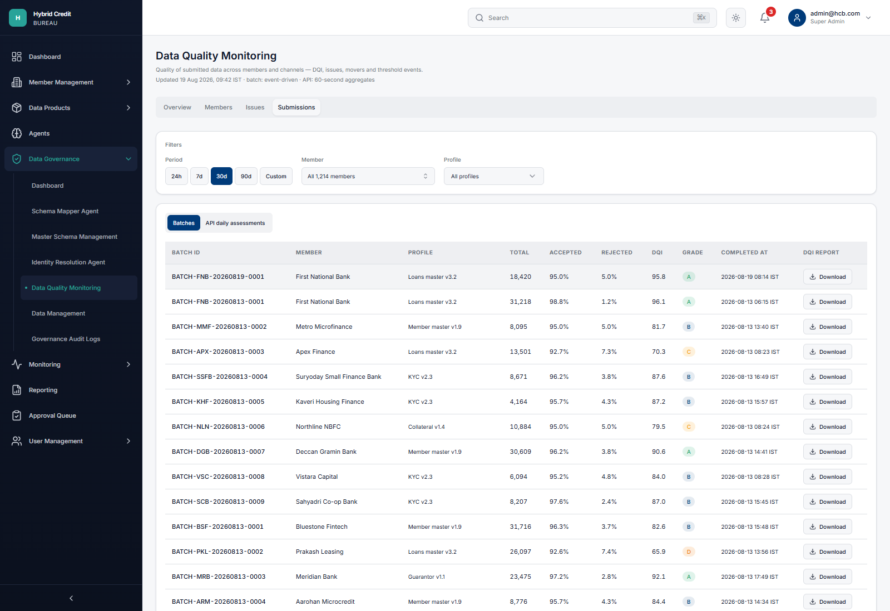

| Column | Field | Display rule |
|---|---|---|
| Batch ID | `batchId` | `BATCH-{id}-{yyyymmdd}-{seq}` |
| Member | `memberName` | |
| Profile | `profile` | |
| Total | `evaluated` | Integer |
| Accepted | `accepted / evaluated × 100` | 1 decimal **percent** (not a count) |
| Rejected | `rejected / evaluated × 100` | 1 decimal percent; `accepted + rejected = evaluated` (warned/info are extra flags, not a third outcome bucket on this row) |
| DQI | `dqi` | 1 decimal; batch DQI = member DQI ± U[-1.2, 1.2] clamped |
| Grade | from batch DQI | |
| Completed at | `completedAt` | `{date} HH:mm IST` |
| DQI report | Download | CSV of that one batch; toast “DQI report downloaded.” |

Filters applied: member ids, source type (URL), profile, grade (URL), `completedAt` date between `from` and `to`. Page size 50.

**Batch identity example (FNB, as-of day):**

`BATCH-FNB-20260819-0001` — 18,420 evaluated / 17,490 accepted / 930 rejected / DQI 95.8 / grade A.

First-breach stage is generated when batch DQI &lt; 85 (`S33 Validation (DQI)` / `S31 Data Model Mapping` / `S35 De-duplication`) but **is not a column** on this table.

---

### 7.6 Submissions — API daily assessments

**Purpose.** One row per member × source type × day (mock: members with batchShare &lt; 70%, sampled).

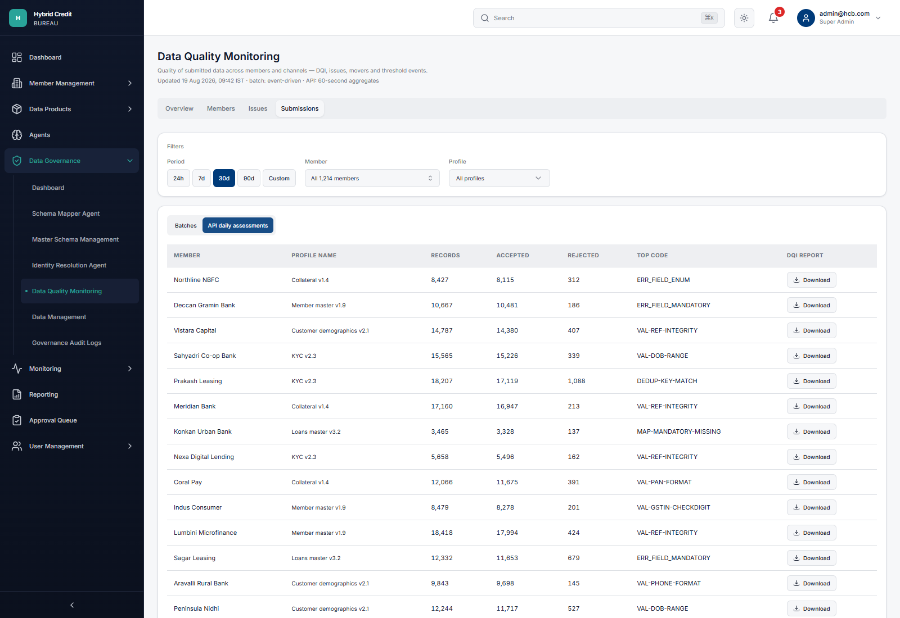

| Column | Field | Display rule |
|---|---|---|
| Member | `memberName` | |
| Profile name | `profile` | |
| Records | `records` | |
| Accepted | `accepted` | **Count**, not percent |
| Rejected | `rejected` | Count; `acceptedPct = 100 − rejectedPct` stored separately |
| Top code | `topCode` | Random catalogue code for the day |
| DQI report | Download | CSV including assessment id `SUB-{id}-{yyyymmdd}-{seq6}` |

Grain in the type system also has `date`, `dqi`, `grade`, sparkline — **not shown** on this table.

---

### 7.7 Member detail — header (all inner tabs)

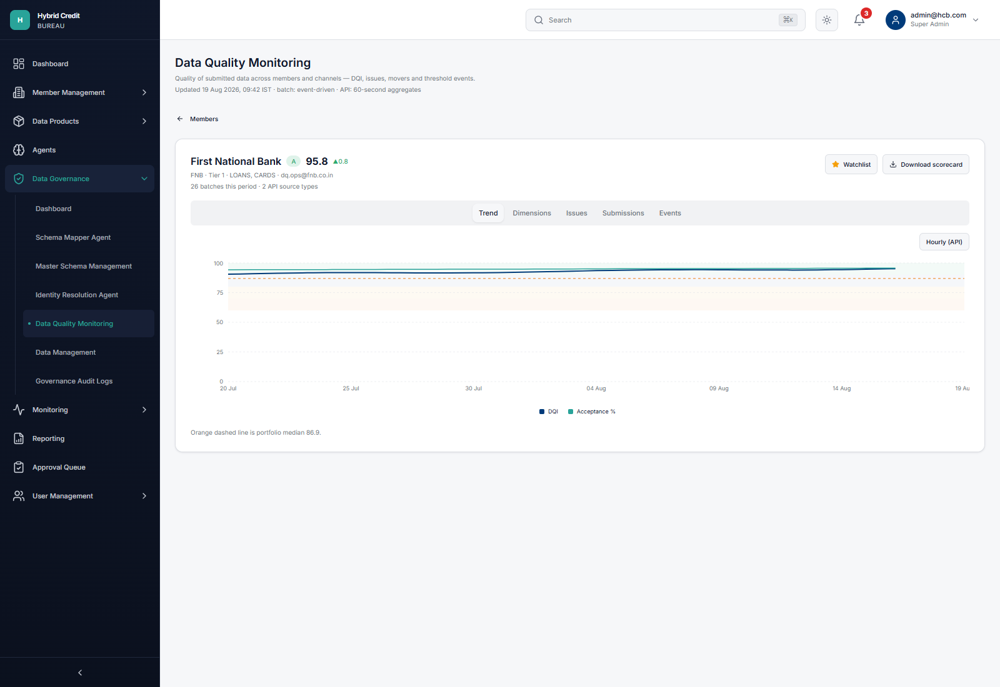

| Element | Source |
|---|---|
| Back | Members list |
| Name | `member.name` |
| Grade pill + DQI | `grade`, `dqi` 1 decimal |
| Δ | `dqi − dqiPrev` (FNB forced to 95.8 vs 95.0 → ▲0.8) |
| Identity line | `{id} · {tier} · {sourceTypes} · {contact}` where contact is `dq.ops@{id}.co.in` |
| Volume line | `{batchCount} batches this period · {apiSourceTypeCount} API source types` (FNB: 26 and 2) |
| Watchlist | Toggles star in shared set |
| Download scorecard | CSV: ID, Member, DQI, Grade, Validity, Completeness, Dup & Integrity |

Inner tabs: **Trend**, **Dimensions**, **Issues**, **Submissions**, **Events**.

---

### 7.8 Member detail — Trend

| Control / mark | Meaning |
|---|---|
| Hourly (API) | Toggle only changes X-axis tick interval (`interval={0}` vs `4`); **does not swap in hourly series** |
| Line DQI | Daily member DQI |
| Line Acceptance % | Daily accepted % |
| Orange dashed line | Portfolio median **86.9** |
| Band shading | A 90–100, B 80–90, C 70–80, D 60–70 |

**FNB series:** DQI interpolates 90.5 → 95.8 over 30 days with a mild sine wobble; acceptance 94.2% → ~95.8%. Other members: DQI = member DQI + noise ±0.7, weekend freeze for batch-heavy members (`batchSharePct > 80` on Sat/Sun).

---

### 7.9 Member detail — Dimensions

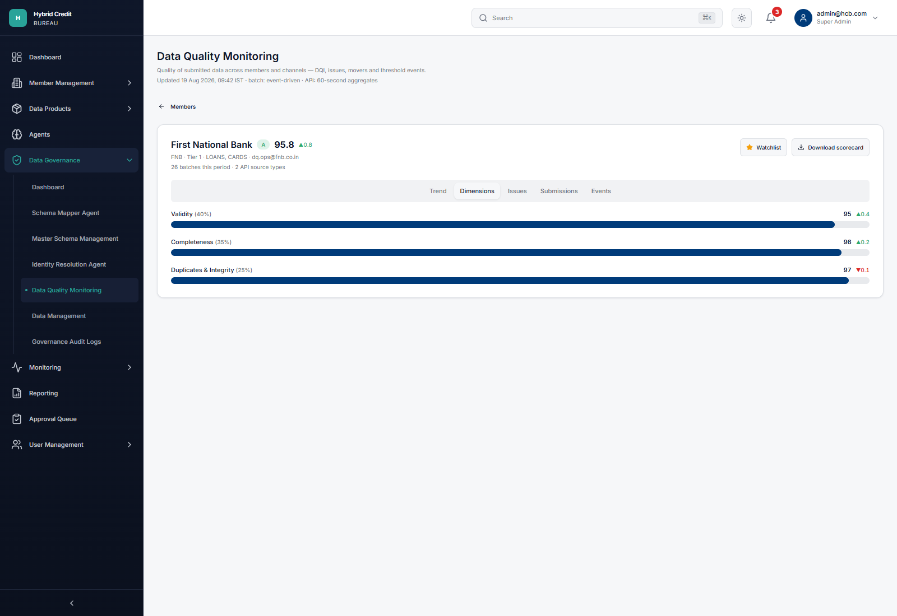

| Dimension | Weight | Value | Δ on screen |
|---|---|---|---|
| Validity | 40% | `validity` | `value − (value − 0.4)` → **▲0.4** (synthetic prior) |
| Completeness | 35% | `completeness` | prior = value − 0.2 → **▲0.2** |
| Duplicates & Integrity | 25% | `dupIntegrity` | prior = value + 0.1 → **▼0.1** |

Bar width = dimension score as % of 100.

---

### 7.10 Member detail — Issues

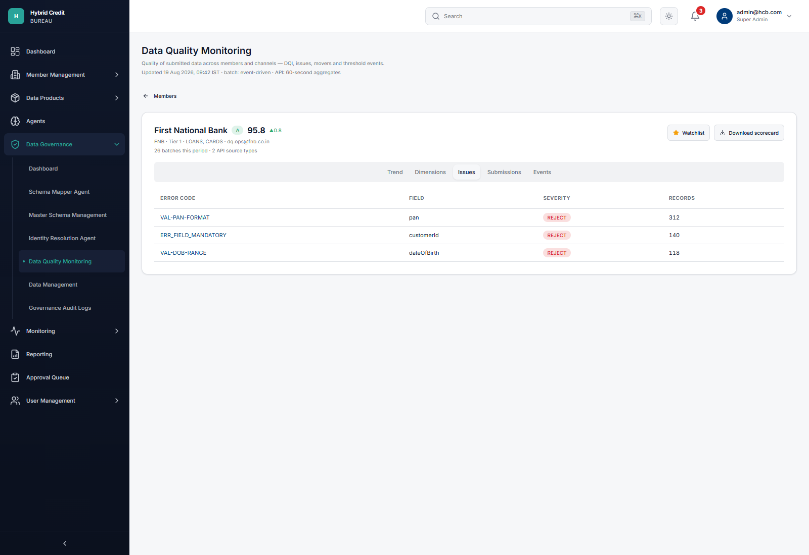

FNB uses a **fixed three-row list** (not the bureau catalogue counts):

| Error code | Field | Severity | Records |
|---|---|---|---|
| VAL-PAN-FORMAT | pan | REJECT | 312 |
| ERR_FIELD_MANDATORY | customerId | REJECT | 140 |
| VAL-DOB-RANGE | dateOfBirth | REJECT | 118 |

Code links to Issues `?issue=`. Other members: first four catalogue rules with records `round(40 + U×400)`.

---

### 7.11 Member detail — Submissions

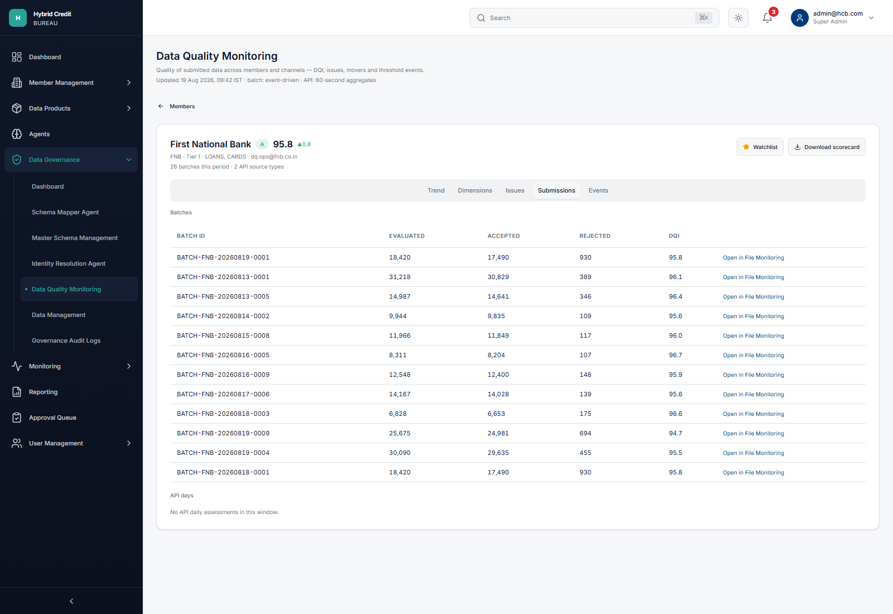

**Batches table** (max 12 rows): Batch ID, Evaluated, Accepted, Rejected (**counts**), DQI, **Open in File Monitoring** → `/monitoring/data-submission-batch?batchId=`.

**API days:** list `{date} · {sourceType} · {records} records · {acceptedPct}% accepted` (max 8). Empty copy: “No API daily assessments in this window.”

---

### 7.12 Member detail — Events

FNB has **no** threshold events:

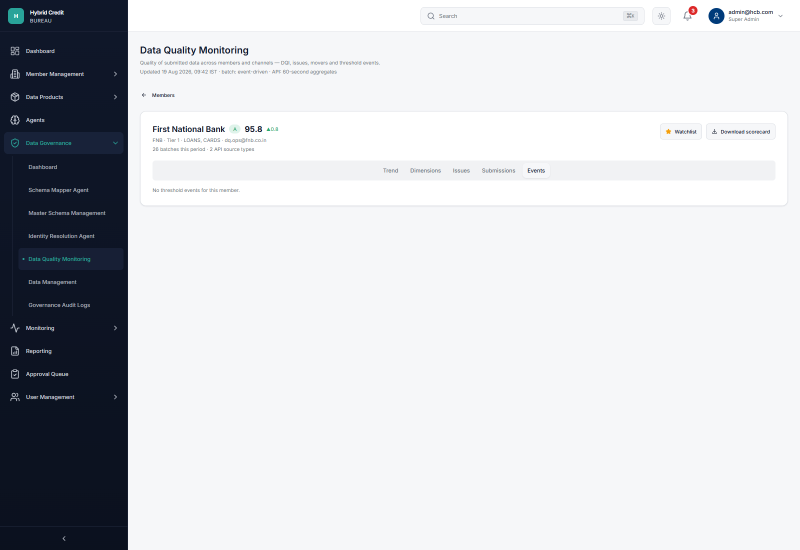

Apex Finance (mover / watchlist seed) shows queue rows:

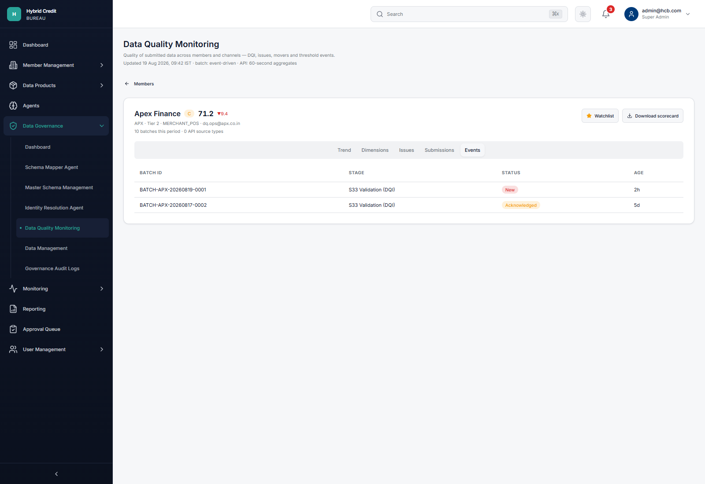

| Column | Field |
|---|---|
| Batch ID | `batchId` |
| Stage | `stageLabel` (e.g. S33 Validation (DQI)) |
| Status | New / Acknowledged / Linked to RCA / Closed |
| Age | relative age string (`2h`, `5d`, …) |

**Threshold logic encoded in sample rows (not computed live):** pause when observed failure % exceeds configured % (typically 50% at S33; 20% volume guard at S35). Pause types: `AUTO_VALIDATION` / `PAUSE-VAL-THRESHOLD`, `AUTO_SLA` / `PAUSE-TIME-THRESHOLD`, `MANUAL` / `SUS-DATA-QUALITY`.

Pipeline stages (reference):

| ID | Label |
|---|---|
| S11 | File Transfer & Pre-Checks |
| S12 | Batch Creation |
| S21 | Profile Identification |
| S31 | Data Model Mapping |
| S32 | Normalisation & Transformation |
| S33 | Validation (DQI) |
| S34 | Business Logic |
| S35 | De-duplication |
| S41 | Identity Resolution |
| S51 | Data Load |
| S52 | Post-Load Reconciliation |

---

### 7.13 Reports drawer

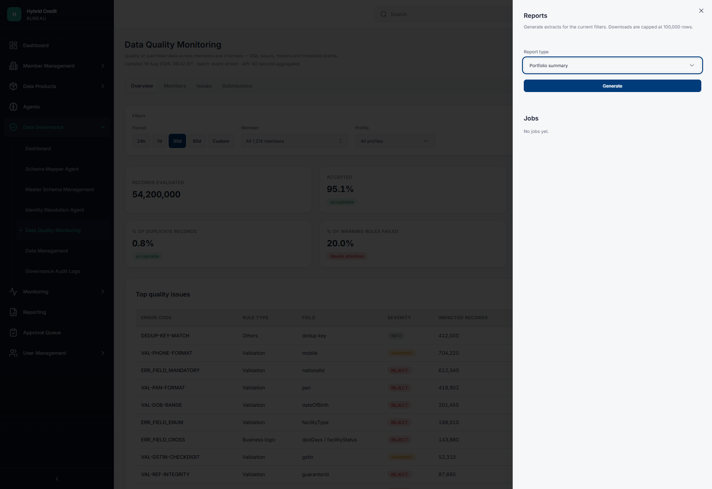

| Field | Behaviour |
|---|---|
| Open | Query `reports=1` (no Reports button on the page header in the current build) |
| Copy | Generate extracts for the current filters. Downloads are capped at 100,000 rows. |
| Report type | Member scorecard · Portfolio summary · Issue extract · Submission extract · Movers report |
| Member | Shown only for Member scorecard; named members only |
| Generate | Job id `JOB-{last6 of Date.now}`; status Queued → Running (~400 ms) → Ready (~1400 ms); `rowCount` set to 100,000 |
| Jobs | Session memory only |
| Download (Ready) | CSV by type (see below); toast “Download started (100k-row cap).” |

| Type | CSV contents |
|---|---|
| issue_extract | Full issue catalogue |
| movers_report | Five drops + five rises |
| submission_extract | First 500 batches |
| member_scorecard / portfolio_summary | Single member row (selected or first) with DQI dimensions |

---

## 8. Issue / rule catalogue (30d mock)

Systemic if **members affected ≥ 25**. Δ is a **percentage-point** change vs prior (`deltaPct`), not a count delta.

| Code | Rule type | Field | Severity | Impacted records | % of rejects (`rejectSharePct`) | Δ | Members | First seen |
|---|---|---|---|---|---|---|---|---|
| ERR_FIELD_MANDATORY | Validation | nationalId | REJECT | 612,340 | 23.1 | +1.4 | 388 | 2026-06-02 |
| VAL-PAN-FORMAT | Validation | pan | REJECT | 418,902 | 15.8 | +4.6 | 341 | 2026-05-18 |
| MAP-MANDATORY-MISSING | Transformation | customerId | REJECT | 96,120 | 3.6 | +3.6 | 41 | 2026-08-12 |
| VAL-DOB-RANGE | Validation | dateOfBirth | REJECT | 201,455 | 7.6 | −0.4 | 297 | 2026-04-09 |
| ERR_FIELD_ENUM | Validation | facilityType | REJECT | 188,010 | 7.1 | +0.9 | 262 | 2026-07-01 |
| ERR_FIELD_CROSS | Business logic | dpdDays / facilityStatus | REJECT | 143,880 | 5.4 | −0.2 | 219 | 2026-06-21 |
| VAL-PHONE-FORMAT | Validation | mobile | WARNING | 704,220 | 0 | +2.1 | 455 | 2026-03-14 |
| VAL-REF-INTEGRITY | Validation | guarantorId | REJECT | 87,660 | 3.3 | +1.8 | 74 | 2026-07-22 |
| DEDUP-KEY-MATCH | Others | dedup key | INFO | 412,000 | 0 | +0.3 | 503 | 2026-02-11 |
| VAL-GSTIN-CHECKDIGIT | Validation | gstin | WARNING | 52,310 | 0 | +0.6 | 88 | 2026-08-01 |

**Severity business meaning (this module)**

| Severity | Typical effect |
|---|---|
| REJECT | Record fails validation; counts toward rejected % / reject share |
| WARNING | Field-level warning (e.g. format); does not add to reject share in the catalogue |
| INFO | Informational (e.g. duplicates collapsed); Overview duplicate KPI uses the DEDUP volume 412,000 |

---

## 9. Identifier and LOV reference

| Kind | Pattern / values |
|---|---|
| Member id (named) | FNB, APX, KUB, … |
| Member id (generated) | `M0001` … |
| Batch | `BATCH-FNB-20260819-0001` |
| API submission | `SUB-{ID}-{YYYYMMDD}-{6 digit}` |
| Record (masked) | `4001-R0000015` |
| Source types | BANK_STATEMENT, INVESTMENT, MOBILE_MONEY, REMITTANCE, ECOMMERCE, MERCHANT_POS, TRADE_CREDIT, AGRICULTURAL, RENTAL, SUBSCRIPTION, TELECOM, UTILITY, INSURANCE, EMPLOYMENT, GST, LOANS, CARDS, MICROFINANCE, LEASING, HOUSING_FINANCE, BNPL, FRAUD_SIGNALS |
| Tiers | Tier 1 if DQI ≥ 90 (unless seeded); Tier 2 if ≥ 75; else Tier 3 |

**Named DQI movers (30d vs prior)** — not on Overview UI but used by Reports → Movers:

| Direction | Member | DQI | Δ | Cause |
|---|---|---|---|---|
| Drop | Apex Finance | 71.2 | −9.4 | VAL-PAN-FORMAT |
| Drop | Konkan Urban Bank | 78.0 | −6.1 | MAP-MANDATORY-MISSING |
| Drop | Orion Credit | 82.5 | −5.3 | ERR_FIELD_MANDATORY |
| Drop | Prakash Leasing | 66.8 | −4.9 | VAL-REF-INTEGRITY |
| Drop | Nexa Digital Lending | 84.1 | −3.7 | ERR_FIELD_ENUM |
| Rise | Metro Microfinance | 81.6 | +5.2 | VAL-PHONE-FORMAT |
| Rise | Shakti Women's MFI | 88.9 | +4.1 | ERR_FIELD_MANDATORY |
| Rise | Deccan Gramin Bank | 90.3 | +3.8 | VAL-DOB-RANGE |
| Rise | Trident Consumer Finance | 86.0 | +2.9 | ERR_FIELD_ENUM |
| Rise | Godavari Rural Bank | 92.7 | +2.2 | VAL-PAN-FORMAT |

---

## 10. Non-functional and UX states

| State | Behaviour |
|---|---|
| Loading | Skeleton KPIs (6) / table rows ~320 ms first visit |
| Empty filters | Dashed card: “No assessments for the current filters” |
| Unknown member id | “Member not found.” |
| Privacy | No raw PAN/mobile/nationalId **values**; codes and masked record ids only |
| Persistence | Filters in URL; watchlist and report jobs in React state (lost on full reload) |
| Pagination | 50 rows (members and submissions) |

---

## 11. Traceability — screenshot index

| File | Screen |
|---|---|
| `docs/dqi-monitoring/01-overview.png` | Overview (default 30d) |
| `docs/dqi-monitoring/14-filters-custom-period.png` | Overview custom period + recomputed KPIs |
| `docs/dqi-monitoring/02-members.png` | Members |
| `docs/dqi-monitoring/03-issues.png` | Issues |
| `docs/dqi-monitoring/04-issues-expanded.png` | Issues expanded |
| `docs/dqi-monitoring/05-submissions-batches.png` | Submissions / Batches |
| `docs/dqi-monitoring/06-submissions-api.png` | Submissions / API daily assessments |
| `docs/dqi-monitoring/07-member-trend.png` | FNB Trend |
| `docs/dqi-monitoring/08-member-dimensions.png` | FNB Dimensions |
| `docs/dqi-monitoring/09-member-issues.png` | FNB Issues |
| `docs/dqi-monitoring/10-member-submissions.png` | FNB Submissions |
| `docs/dqi-monitoring/11-member-events.png` | FNB Events (empty) |
| `docs/dqi-monitoring/13-member-events-apex.png` | APX Events (populated) |
| `docs/dqi-monitoring/12-reports-drawer.png` | Reports drawer |

---

## 12. Open discrepancies (implementation vs original design prompt)

These are recorded so stakeholders can decide whether they are defects or accepted scope cuts.

| Topic | Design prompt | Implemented |
|---|---|---|
| Overview KPIs | 8 tiles including Portfolio DQI 87.4 grade B, rejected **count**, warned count, duplicates **count**, threshold events 17/63, systemic 3 | 6 tiles; DQI/events/systemic omitted; rejected as **%**; duplicates as **%**; warning/info as **% of rules** |
| Overview visuals | Grade distribution, movers, events queue, portfolio trend | Not rendered |
| Filter bar | Channel, source type, severity, grade, compare toggle | Period, member, profile only |
| Members columns | Channel mix, validity, completeness, dup, rejected %, breaches, attention | Name, profile, DQI, grade, Δ, last assessment |
| Reports | Header **Reports** button | Drawer via `?reports=1` only |
| Hourly (API) | Hourly series | Axis ticks only |
| Issue % of rejects | Column on Overview/Issues | Stored as `rejectSharePct`, not shown |

---

## 13. Acceptance criteria (as-built)

1. Super Admin can open `/data-governance/data-quality-monitoring` and see Overview KPIs for default 30d matching §6.4 canned values.
2. Changing Period, Member, or Profile updates the URL and (when leaving pure defaults) recomputes headline KPIs.
3. Overview issue row navigates to Issues with the row expanded.
4. Members search, watchlist, sort, page size 50, and row click to `…/members/{id}` work.
5. Issues expand shows top members and masked ids; View rule opens Master Schema.
6. Submissions switches Batches ↔ API daily assessments; Download produces a CSV and success toast.
7. FNB detail shows DQI 95.8 grade A, three dimensions summing to DQI under the 40/35/25 weights, three issue codes, batches with File Monitoring links, empty events.
8. A member with events (e.g. APX) lists batch, stage, status, age.
9. `?reports=1` opens the Reports drawer; Generate moves a job Queued → Running → Ready; Download respects the stated 100k-row cap in copy.

---

*End of DQI_Monitoring functional BRD v1.0.*
