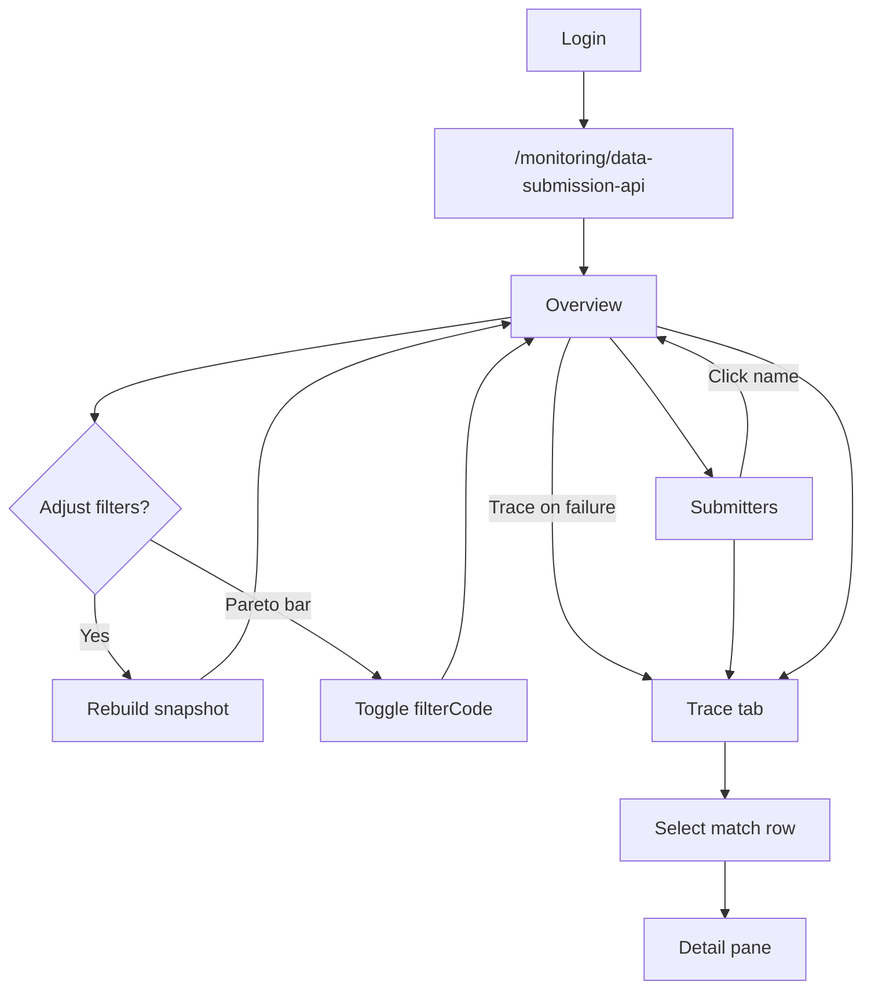
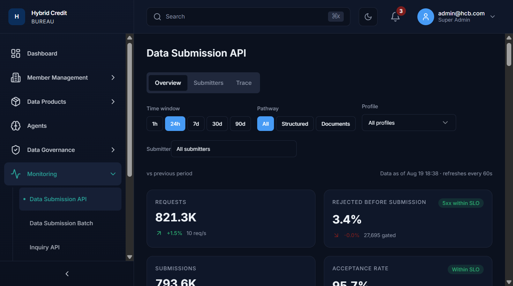
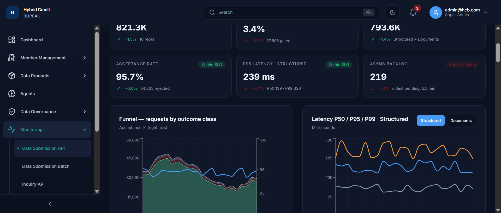
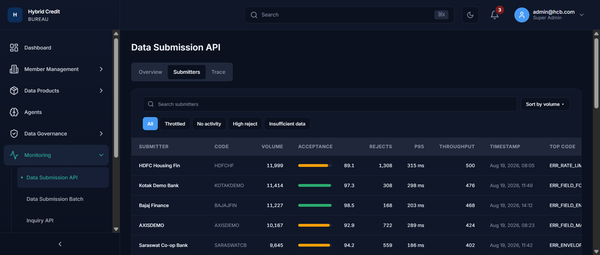
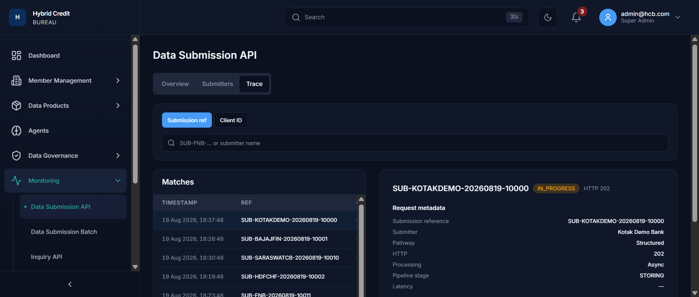
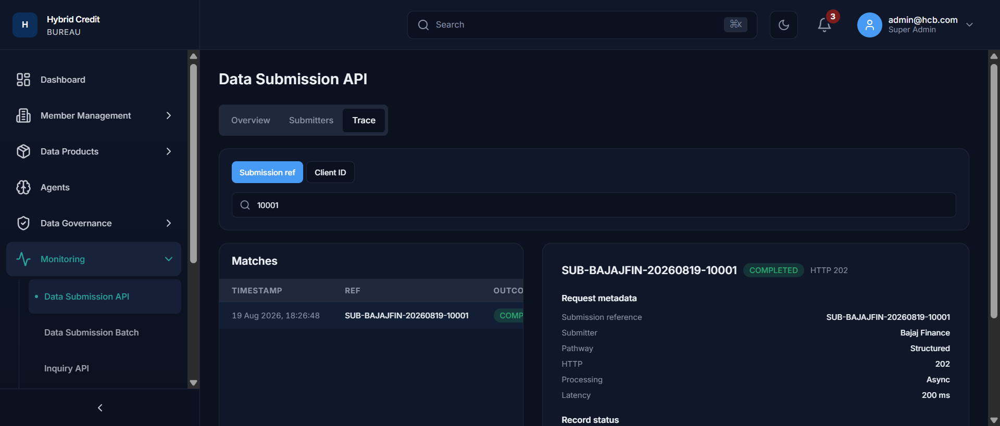
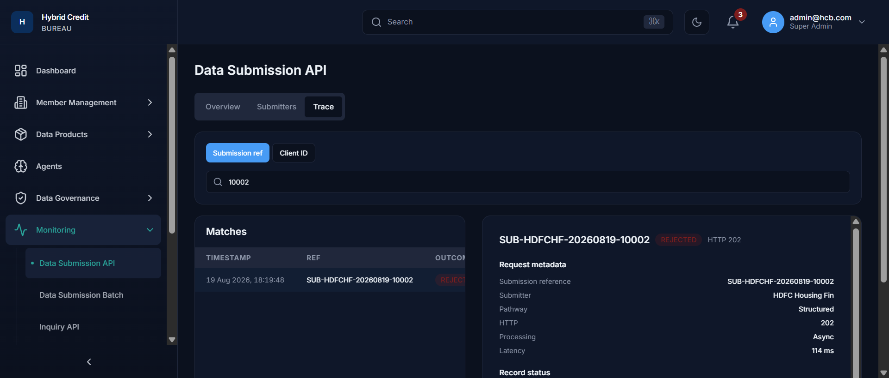
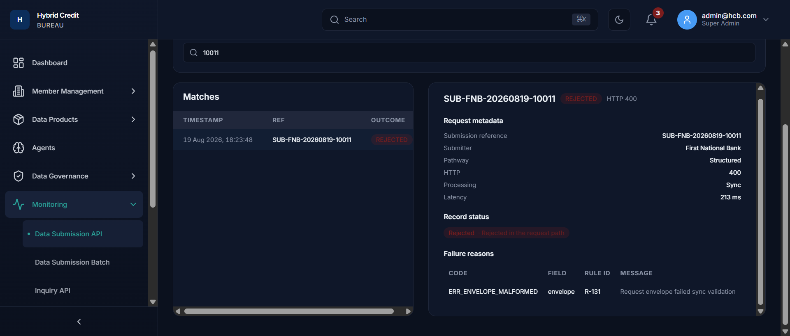
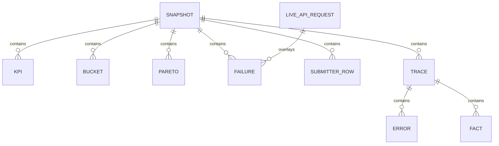

# Functional Business Requirements Document — Data Submission API Monitoring

| Field | Value |
|---|---|
| **Product** | Hybrid Credit Bureau (HCB) Admin Portal |
| **Module** | Monitoring — Data Submission API (DSAPI) |
| **Route** | `/monitoring/data-submission-api` |
| **Document type** | Functional BRD (as implemented) |
| **Version** | 1.1 |
| **Status** | Draft for review |
| **Classification** | Internal – Confidential |
| **Primary users** | Bureau operations / monitoring analysts; Super Admin / Bureau Admin |

> This BRD documents **current implemented behaviour** of the DSAPI monitoring UI (Overview, Submitters, Trace). It does not prescribe a future ingestion API. Screenshots live in `docs/dsapi-brd/` and are embedded in §7.

---

## 1. Document Control

| Item | Detail |
|---|---|
| Author | Senior Business Analyst / Product Manager |
| Date | 19 August 2026 |
| Reviewers | Bureau Ops lead, Platform Product Owner, QA lead `[TBC – needs stakeholder input]` |
| Source of truth | Implemented UI under `src/pages/monitoring/dsapi/` plus live overlay via `GET /api/v1/monitoring/*` |

### Change log

| Version | Date | Author | Summary |
|---|---|---|---|
| 1.0 | 2026-08-19 | BA/PM | Initial functional BRD for DSAPI monitoring (all three tabs), including graph behaviour and filter cascade. |
| 1.1 | 2026-08-19 | BA/PM | Embedded UI screenshots (Overview, Submitters, Trace sync/async outcomes). |

---

## 2. Executive Summary

### 2.1 Business problem

Member institutions submit credit data through the Data Submission API at high volume. Bureau operations staff need a single place to answer: *Is intake healthy? Who is failing? Why? Can we find this specific submission?* Without scoped monitoring, SLA breaches, throttling, and validation failures are discovered late.

### 2.2 Proposed solution (as implemented)

The **Data Submission API** monitoring page presents:

1. **Overview** — period-scoped KPIs, outcome funnel, latency, document backlog, rejection Pareto, and a recent-failures list with jump-to-trace.
2. **Submitters** — ranked member list with volume, acceptance, rejects, P95, throughput, last seen, and top error code; quick filters and lock-to-overview.
3. **Trace** — lookup of a submission by reference (or Client ID mode) with match list and a detail pane covering metadata, record status, and failure reasons.

Most Overview/Submitters/Trace numbers are produced by a **deterministic client-side scale mock** (`buildDsapiSnapshot`). A **live overlay** may replace the Overview “Recent failures” table when `GET /v1/monitoring/api-requests` returns failed/rejected/rate-limited rows. KPI API errors show a banner but do **not** drive the six KPI cards.

### 2.3 Expected business value

- **BV-001** — Ops can judge intake health (volume, acceptance, latency, async backlog) in one screen.
- **BV-002** — Rejection Pareto plus failure list lets ops isolate a validation/auth/rate-limit code quickly.
- **BV-003** — Submitter ranking isolates noisy or silent members.
- **BV-004** — Trace lets ops open a single `SUB-…` reference and see outcome, HTTP, processing mode (Sync/Async), and field-level failure reasons.

### 2.4 Success metrics (KPIs)

| ID | Metric | Definition (this module) | Target (as coded on KPI badges) |
|---|---|---|---|
| KPI-001 | Acceptance rate | Accepted ÷ (accepted + rejected submissions) in the selected window | ≥ 95% → badge “Within SLO”; else “Breaching” |
| KPI-002 | P95 latency (Structured) | Average of bucket P95 values in the window | ≤ 300 ms → “Within SLO” |
| KPI-003 | Async backlog age | Oldest pending age (minutes) on the **latest** time bucket | ≤ 5 min → “Age within SLO” |
| KPI-004 | Pre-submission reject share | Pre-rejects ÷ requests | < 4% → badge labelled “5xx within SLO” `[DISCREPANCY: badge copy says 5xx; value is pre-reject %]` |
| KPI-005 | Time to find a submission | Analyst opens Trace and locates a `SUB-` ref | `[TBC – needs stakeholder input]` |

---

## 3. Scope

### 3.1 In scope

- Page chrome: title **Data Submission API**; tabs **Overview**, **Submitters**, **Trace**.
- Overview filters: Time window, Pathway, Profile, Submitter.
- Overview KPIs, four charts, Pareto code filter, Recent failures (last 50), Trace action.
- Submitters search, volume sort, quick chips, pagination (25), lock submitter → Overview.
- Trace search modes, Matches table, detail pane (metadata, record status, failure reasons).
- Cross-tab state: window/pathway/profile/submitter/Pareto code live in page memory; Trace jump from a failure row.
- Auth: authenticated portal user required; monitoring GET APIs role-gated on the backend.
- Live overlay of recent failures from monitoring API requests (when failed rows exist).

### 3.2 Out of scope

- Member-facing Data Submission API (ingest, mapping, persist) — this module is **ops monitoring only**.
- Data Submission **Batch** (`/monitoring/data-submission-batch`).
- Inquiry API, SLA Configuration, Alert Engine pages.
- Export/download, scheduled reports, email/Slack from this page.
- URL-persisted filters or deep links to a tab (`?tab=trace`).
- Heatmap and pipeline **stages** arrays that exist in mock types but are **not rendered**.
- Editing submissions, replaying requests, or changing rate limits from this UI.

### 3.3 Dependencies

| ID | Dependency | How this module uses it |
|---|---|---|
| DEP-001 | Portal authentication (`ProtectedRoute`) | Unauthenticated users are redirected to `/login`. |
| DEP-002 | Dashboard layout (sidebar, header) | Standard app shell; Monitoring → Data Submission API. |
| DEP-003 | `GET /api/v1/monitoring/kpis` | Error banner only if the query fails; success payload is **not** bound to DSAPI KPI cards. |
| DEP-004 | `GET /api/v1/monitoring/api-requests` | Optional overlay for Overview recent failures. |
| DEP-005 | Client mock snapshot | Default source for KPIs, charts, submitters, traces, Pareto, failures. |

---

## 4. Stakeholders & User Roles

| Role | Description | Permissions (as implemented) | Key goals on this module |
|---|---|---|---|
| Super Admin | Platform operator (`admin@hcb.com` in local) | UI: any authenticated user can open the route. API: `GET /api/v1/monitoring/**` allowed | Full visibility, incident leadership |
| Bureau Admin | Bureau operations manager | Same UI; API allowed | Health of intake, member follow-up |
| Analyst (monitoring) | Bureau ops / monitoring analyst | Same UI; API allowed | Diagnose rejects, trace a ref, rank submitters |
| Viewer | Read-only catalogue role | UI: still reachable if logged in. **API:** `@PreAuthorize` lists `VIEWER` on the controller; Spring `SecurityConfig` matcher for `GET /api/v1/monitoring/**` lists only Super Admin, Bureau Admin, Analyst `[DISCREPANCY]` | View dashboards if the UI loads without those APIs |
| Member institution / API_USER | External submitter | **No** dedicated access to this admin page | Out of scope |

The UI does **not** hide tabs by role. Any logged-in portal user who can navigate to `/monitoring/data-submission-api` sees the same screens.

---

## 5. Business Process Flow

### 5.1 As-is vs to-be

| | As-is (without this page) | To-be (this module) |
|---|---|---|
| Detect volume/SLO issues | Ad-hoc logs or other monitoring pages | Overview KPIs + funnel + latency + backlog |
| Find noisy members | Manual | Submitters ranking + chips |
| Investigate one call | Ticket + log search | Trace by `SUB-` ref; jump from Recent failures |

### 5.2 To-be process (steps)

1. Analyst authenticates and opens **Monitoring → Data Submission API** (or Command Palette “Data Submission API Monitoring”).
2. Page lands on **Overview** with defaults: window **24h**, pathway **All**, profile **All profiles**, submitter **All submitters**.
3. Analyst adjusts filters; KPIs and charts **recompute immediately** from the mock snapshot (and live failure overlay refetches with a date range derived from the window).
4. Optional: click a Pareto bar to lock a rejection **code**; failures and submitter list narrow (see §8).
5. Analyst opens **Submitters** to rank members, apply chips, or click a name to **lock that submitter and return to Overview**.
6. Analyst opens **Trace** (or clicks **Trace** on a failure row) to inspect Sync/Async outcomes.
7. Exit: navigate away; **filter state is discarded** (not in the URL).

### 5.3 Flowchart



### 5.4 Entry, exit, hand-offs

| Type | Path |
|---|---|
| Entry | Sidebar Monitoring → Data Submission API; `/monitoring` redirects to this page; Command Palette; Dashboard KPI tile href `/monitoring/data-submission-api` |
| Exit | Other monitoring children; any other portal route; logout |
| Hand-off in | Failure **Trace** button → Trace tab with search seeded to that ref |
| Hand-off out | None (no “open ticket” or “open institution” control on these tabs) |

---

## 6. User Stories & Acceptance Criteria

### US-001 — View intake health

**As a** monitoring analyst, **I want** Overview KPIs and charts for a chosen window, **so that** I can tell whether DSAPI intake is within SLO.

```gherkin
Feature: Overview health
  Scenario: Happy path defaults
    Given I am authenticated
    When I open /monitoring/data-submission-api
    Then I see title "Data Submission API"
    And the Overview tab is active
    And six KPI cards render with values
    And Funnel, Latency, Async pipeline, and Pareto charts render

  Scenario: KPI API failure does not blank the mock dashboard
    Given GET /v1/monitoring/kpis fails
    When the page loads
    Then an ApiErrorCard is shown with Try again
    And KPI cards and charts still render from the client snapshot
```

### US-002 — Scope the dashboard with filters

**As a** monitoring analyst, **I want** time, pathway, profile, and submitter filters, **so that** numbers match the slice I am investigating.

```gherkin
  Scenario: Window change
    Given Overview is showing 24h
    When I click 7d
    Then KPIs and charts update
    And the selected window control is 7d

  Scenario: 90d all-submitters warning
    Given window is 90d and submitter is All submitters
    Then I see "Large result set — ranking and traces stay capped…"

  Scenario: Submitter lock
    Given I open the Submitter popover
    When I choose "Kotak Demo Bank"
    Then the trigger shows that name and member code
    And snapshot scale is reduced to that submitter
```

### US-003 — Drill rejection reasons

**As a** monitoring analyst, **I want** to click a Pareto reason, **so that** failures and submitters focus on that code.

```gherkin
  Scenario: Apply and clear
    When I click bar ERR_FIELD_MANDATORY
    Then filterCode is that code
    And a Clear ERR_FIELD_MANDATORY control appears
    When I click the same bar again or Clear
    Then the code filter is removed
```

### US-004 — Rank submitters

**As a** monitoring analyst, **I want** a searchable, filterable submitter table, **so that** I can find throttled, silent, or high-reject members.

```gherkin
  Scenario: Empty search
    When search and chips yield no rows
    Then I see "No results for the selected filters"

  Scenario: Lock from table
    When I click a submitter name
    Then Overview opens with that submitter selected
```

### US-005 — Trace a submission

**As a** monitoring analyst, **I want** to search a submission reference and see outcome plus failure reasons, **so that** I can explain a member ticket.

```gherkin
  Scenario: Default matches
    Given Trace query is empty
    Then Matches shows up to 9 curated rows
    And the first row is selected

  Scenario: Jump from failure
    When I click Trace on a Recent failures row
    Then the Trace tab opens
    And the search box and selected ref equal that row's Ref

  Scenario: No matches
    When I type a string that matches no ref/name/id
    Then I see "No matches — check the reference format"
    And the detail pane says "Search a submission reference to open the trace."
```

### US-006 — Unauthenticated access

```gherkin
  Scenario: Session missing
    Given I am not logged in
    When I request /monitoring/data-submission-api
    Then I am redirected to /login
```

---

## 7. Screen-by-Screen Functional Specification

Shared shell (all tabs): `DashboardLayout` with `id="main-content"`. Sidebar Monitoring is active. Header: search (⌘K), theme, notifications, user menu. This page **does not** use the generic `MonitoringFilterBar` (date range / entity) used on other monitoring children.

**FR-001** The page shall render heading **Data Submission API** (not “Overview” in the H1). Tab labels provide the view name.

---

### 7.1 Overview

#### 7.1.1 Screen overview

| Item | Value |
|---|---|
| Name | Data Submission API — Overview |
| Route | `/monitoring/data-submission-api` (tab state in memory, not URL) |
| Access | Authenticated portal users |
| Reach | Default tab; return from Submitters lock; sidebar / command palette |
| Purpose | Period health: volume, gating, acceptance, latency, document queue, top reject codes, recent failures |





#### 7.1.2 Screenshot walkthrough

**Title & tabs.** H1 then tabs Overview | Submitters | Trace.

**Filter row (left → right).**

- **Time window** — exclusive toggle buttons `1h`, `24h`, `7d`, `30d`, `90d`. Selects how much history is aggregated and the **grain** of chart X axes (see §7.1.6).
- **Pathway** — `All`, `Structured`, `Documents`. Restricts the mock to structured JSON intake vs document/async pathway (see BR-003).
- **Profile** — select: All profiles, Consumer Credit, Commercial, Telco, Retail, Gold, Microfinance. Scales volume to a product-segment mix (see BR-004).
- **Submitter** — outline button opening a popover: search name or member code (300 ms debounce, max 40 hits), **All submitters**, or a named member (`name` + `code`). Locks the dashboard to one institution (see BR-005).

**Meta row.** Left: “vs previous period” (explains KPI deltas). Right: “Data as of {asOf} · refreshes every 60s”. `[DISCREPANCY: asOf updates only when the snapshot is rebuilt (filter change / remount). There is no 60-second timer on the mock.]`

**90d notice.** If window = 90d **and** submitter = all, caption: ranking and traces stay capped; narrow range or add a submitter.

**KPI grid (2×3 / 3 columns).** Six cards: Requests; Rejected before submission; Submissions; Acceptance rate; P95 latency · Structured; Async backlog. Each: label, optional SLO badge, big value, up/down arrow + delta %, subtitle.

**Charts (2×2 then stacked).** Funnel; Latency (Structured/Documents toggle); Async pipeline — Documents; Rejection reasons — Pareto.

**Recent failures.** Table of up to 50 rows + Trace.

If `useMonitoringKpis` is in error, **ApiErrorCard** appears **above** the H1.

#### 7.1.3 Field-level data dictionary

| # | Field Label (as on UI) | Field Description / Business Meaning | Control Type | Data Type & Format | Source | Mandatory? | Default | Validation | Allowed values | Editable by | Dependent on / Triggers | Error message |
|---|---|---|---|---|---|---|---|---|---|---|---|---|
| 1 | Data Submission API | Page title | Heading | String | Static | — | — | — | — | — | — | — |
| 2 | Overview / Submitters / Trace | View switcher | Tabs | Enum | UI state `tab` | Yes | overview | — | overview, submitters, trace | Analyst | Changes visible panel | — |
| 3 | Time window | Lookback for mock aggregates and live failure dateFrom/dateTo | Button group | Enum | `chrome.window` | Yes | 24h | — | 1h, 24h, 7d, 30d, 90d | Analyst | Rebuilds snapshot; live API date range | — |
| 4 | Pathway | Structured vs Documents mix | Button group | Enum | `chrome.pathway` | Yes | all | — | all, structured, documents | Analyst | Scale 100% / 92% / 8%; failure pathway column | — |
| 5 | Profile | Credit product segment mix | Select | Enum | `chrome.profile` | Yes | all | — | all + 6 profiles | Analyst | Scale weights BR-004 | — |
| 6 | Submitter | Institution scope | Popover + search | String id | `chrome.submitterId` | Yes | all | Search name/code | all or `sub-n` | Analyst | Scale BR-005; live `institutionId` query (see IF-002) | No submitters match — search runs on name and member code |
| 7 | Search name or member code | Narrows catalog in popover | Text | String | Local `q` | No | empty | Debounce 300 ms | — | Analyst | Hits capped at 40 | — |
| 8 | vs previous period | Explains delta on cards | Caption | — | Static | — | — | — | — | — | — | — |
| 9 | Data as of … | Snapshot clock | Caption | `DD MMM HH:mm` | Mock `asOf` | — | now | — | — | — | Filter change | — |
| 10 | Requests | Count of API hits in window (incl. pre-rejects) | KPI | Compact number | Sum of bucket `requests` | — | — | — | — | Read-only | Filters | — |
| 11 | (Requests) delta | Vs previous period (synthetic) | Text + arrow | Signed % | Mock | — | — | — | Green if ≥ 0 | Read-only | — | — |
| 12 | (Requests) sub | Throughput | Text | Compact + “req/s” | reqT / (hours×3600) | — | — | — | — | Read-only | — | — |
| 13 | Rejected before submission | Share gated before a submission is counted | KPI | `n.n%` | preT/reqT | — | — | SLO badge | 5xx within SLO / 5xx breaching | Read-only | Filters | — |
| 14 | (Pre-reject) sub | Count gated | Text | Compact + “gated” | preT | — | — | — | — | Read-only | — | — |
| 15 | Submissions | Accepted + rejected (excludes pre-reject) | KPI | Compact | subT | — | — | No SLO badge | — | Read-only | — | — |
| 16 | Submissions sub | Mix label | Text | Static | “Structured + Documents” | — | — | — | Not pathway-sensitive `[DISCREPANCY]` | Read-only | — | — |
| 17 | Acceptance rate | Quality of counted submissions | KPI | `n.n%` | accT/subT | — | — | ≥95% ok | Within SLO / Breaching | Read-only | — | — |
| 18 | Acceptance sub | Reject count | Text | Compact + “rejected” | rejT | — | — | — | — | Read-only | — | — |
| 19 | P95 latency · Structured | Structured pathway latency SLO | KPI | `n ms` | Avg bucket p95 | — | — | ≤300 ms | Within SLO / Breaching | Read-only | Window/filters; **not** Documents toggle | — |
| 20 | P95 sub | P50 · P99 | Text | ms | Avg p50/p99 | — | — | — | — | Read-only | — | — |
| 21 | Async backlog | Queue depth now (last bucket) | KPI | Compact | last.queue | — | — | Age ≤5 min | Age within SLO / Age breaching | Read-only | — | — |
| 22 | Backlog sub | Oldest pending | Text | `oldest pending: n min` | last.ageMin | — | — | — | — | Read-only | — | — |
| 23 | Funnel — requests by outcome class | Time series of outcomes + acceptance % | Chart | See §7.1.6 | buckets | — | — | — | — | Read-only | Filters | Tooltip via ChartTooltip |
| 24 | Latency P50/P95/P99 | Latency over time | Chart + toggle | ms or minutes | p50/p95/p99 or d50/d95/d99 | — | Structured | — | Structured, Documents | Analyst (toggle only) | Does not change chrome.pathway | — |
| 25 | Async pipeline — Documents | Queue depth vs oldest age | Chart | count / minutes | queue, ageMin | — | — | — | — | Read-only | Filters | — |
| 26 | Rejection reasons — Pareto | Count by error code | Horizontal bar chart | Count | pareto | — | — | Clickable | PARETO_CODES | Analyst | Sets `filterCode` | — |
| 27 | Clear {code} | Removes Pareto filter | Button | — | — | — | hidden | — | — | Analyst | Shown when filterCode set | — |
| 28 | Recent failures (last 50) | Latest rejects for triage | Table | — | Mock failures **or** live overlay | — | — | — | — | Read-only | Filters; overlay may ignore some filters `[DISCREPANCY]` | No failures in scope |
| 29 | Timestamp | When the failed call occurred | Cell | `D MMM YYYY, HH:mm:ss` | Failure row | — | — | — | — | Read-only | — | — |
| 30 | Submitter | Member display name | Cell | String | — | — | — | — | — | Read-only | — | — |
| 31 | Pathway | Structured or Documents | Cell | Enum | — | — | — | — | Structured, Documents | Read-only | Pathway filter | — |
| 32 | Ref | Submission / request id | Cell | `SUB-{CODE}-{YYYYMMDD}-{n}` | — | — | — | — | — | Read-only | Trace uses this string | — |
| 33 | Code | Business error code | Cell | String | — | — | — | — | See glossary | Read-only | Pareto filter | — |
| 34 | Latency | Call duration | Cell | `n ms` | — | — | — | — | — | Read-only | — | — |
| 35 | Trace | Open this ref on Trace tab | Button | — | — | — | — | — | — | Analyst | Sets trace query + tab=trace | — |
| 36 | ApiErrorCard | KPI fetch failed | Banner | — | kpisQuery.error | — | hidden | — | Session expired / Access denied / … | Analyst Retry | refetch kpis | See §7.1.5 |

Hidden/system: `filterCode`, `latView`, snapshot `heatmap` (not shown), live `page=0 size=50`.

#### 7.1.4 Actions & behaviours

| Action | Pre-condition | On click | Post-condition | Confirm / toast |
|---|---|---|---|---|
| Change window/pathway/profile/submitter | Overview (filters only on this tab) | `onChromeChange` | New snapshot; live requests refetch | None |
| Toggle Structured/Documents on latency | Overview | `latView` only | Latency chart series/units change; **funnel/KPIs unchanged** | None |
| Click Pareto bar | Chart rendered | Toggle `filterCode` | Pareto, failures, submitters, traces rebuilt | None |
| Clear {code} | filterCode set | `filterCode=null` | Filter off | None |
| Trace | ≥1 failure row | `goTrace(ref)` | Trace tab; query=ref | None |
| Try again on KPI error | kpisQuery.isError | refetch | Banner may clear | None |

Filters are **not** shown on Submitters/Trace. Changing them requires returning to Overview. Values **persist in memory** while the user stays on the page, so Submitters/Trace still consume the last Overview filter set via the shared snapshot.

#### 7.1.5 Screen states & exception handling

| State | Trigger | UI behaviour | User options | Logging / alerting |
|---|---|---|---|---|
| Initial load / loading | Mount | Mock snapshot is **synchronous** — no Overview skeleton. KPI/live queries may be in flight without a spinner on cards | — | — |
| Data loaded successfully | Snapshot built; APIs optional | Normal Overview | — | — |
| Empty / no data | Failures length 0 | “No failures in scope” | Change filters / clear code | — |
| Partial data | Optional SLO `na` | No badge on Requests/Submissions | — | — |
| API error (4xx) on KPIs | 401/403/404 | ApiErrorCard: Session expired / Access denied / Not found | Retry; 401 may be handled globally by refresh | Client ApiError |
| API error (5xx) / down | KPI 5xx or network | Server error / Connection error + Try again | Retry | — |
| Network timeout | Fetch fail | Connection error | Retry | — |
| Session expired | 401 after refresh fail | Card and/or redirect to login `[TBC exact order vs api-client]` | Re-login | — |
| Submit in progress | N/A — no forms | — | — | — |
| Submit success | N/A | — | — | — |
| Validation failure | N/A | — | — | — |
| Concurrent edit | N/A read-only | — | — | — |
| Large dataset | 90d + all submitters | Caption warning; traces/ranking capped in mock | Narrow filters | — |
| Browser back / refresh | History | Tab and filters **reset** to defaults (not in URL) | Re-apply filters | — |
| Live overlay | Failed rows in api-requests | Replaces mock failure table (max 50) | — | — |
| Live overlay empty fails | 200 with no fail rows | Mock failures remain | — | — |

#### 7.1.6 Graph behaviour (functional)

All four charts read the same **time buckets** produced for the current filters. Changing window/pathway/profile/submitter/Pareto code **rebuilds buckets** (deterministic RNG seed from those filters). Hover shows the standard chart tooltip (series name + value). There is no brush, zoom, or click-through on Funnel/Latency/Backlog.

**Time axis (all time-series charts)**

| Window | Bucket count | Label grain | Business meaning |
|---|---|---|---|
| 1h | 12 | `HH:mm` | ~5-minute buckets |
| 24h | 24 | `HH:mm` | Hourly |
| 7d | 7 | `D Mon` | Daily |
| 30d | 30 | `D Mon` | Daily |
| 90d | 45 | `D Mon` | ~2-day buckets labelled with the bucket timestamp’s date |

**FR-010 Funnel — requests by outcome class**

- **Left axis:** stacked **areas** — Accepted, Rejected, Pre-reject (counts per bucket). Pre-reject = gated before a submission is counted; Rejected = failed after counting as a submission; Accepted = stored/OK submissions.
- **Right axis:** **line** Acceptance % (`accepted / (accepted+rejected)` in that bucket). Axis domain is fixed **90–100**, so values below 90 still plot but sit on the floor visually.
- **Subtitle:** “Acceptance % (right axis)”.
- **Not clickable.** Filter changes redraw the whole series.

**FR-011 Latency P50 / P95 / P99**

- Toggle **Structured** (default): three lines `p50`, `p95`, `p99` in **milliseconds**.
- Toggle **Documents**: three lines `d50`, `d95`, `d99` in **minutes** (subtitle switches to “Minutes”). Document values are larger when Pathway = Documents (`docsBoost`).
- This toggle is **display-only**. It does **not** set Pathway. Ops can view document latency while Pathway is still All/Structured.
- KPI card “P95 latency · Structured” **always** uses structured P95, even if the chart shows Documents.

**FR-012 Async pipeline — Documents**

- Left axis: **Queue depth** (`queue`) — how many document jobs waiting in the latest interpretation of each bucket.
- Right axis: **Oldest pending (min)** (`ageMin`).
- Shown even when Pathway = Structured; series still exist on every snapshot (documents are a small share when Pathway = All). Functional intent: watch async backlog independently of the structured latency chart.
- KPI “Async backlog” uses **only the last bucket’s** queue and age (point-in-time), not an average of the line.

**FR-013 Rejection reasons — Pareto**

- Horizontal bars: **count** per error code (Y = code, X = count). Caption: “% of rejected submissions · click a bar to filter failures and submitters”.
- Click a bar: if that code is not selected, **apply** `filterCode`; if it is already selected, **clear**.
- When a code is applied, other bars’ counts are visually reduced (~15% of original in the mock) so the selected reason dominates; failures must match that code (mock path). Submitters tab keeps rows whose **top code** equals the filter (plus the chip to clear).
- Click does **not** change time/pathway/profile/submitter.

---

### 7.2 Submitters

#### 7.2.1 Screen overview

| Item | Value |
|---|---|
| Name | Data Submission API — Submitters |
| Route | Same URL, tab `submitters` |
| Access | Same |
| Reach | Submitters tab |
| Purpose | Rank ~520 members; find throttled, inactive, high-reject, or thin-data submitters; lock one into Overview |



#### 7.2.2 Walkthrough

Toolbar: search “Search submitters”; **Sort by volume ▾/▴**. Chips: All, Throttled, No activity, High reject, Insufficient data. Optional code chip `{filterCode} ✕` if Pareto filter is on. Table columns: Submitter (link), Code, Volume, Acceptance (bar + %), Rejects, P95, Throughput, Timestamp, Top code. Footer: “Showing x–y of n” and Previous / page / Next. Page size **25**.

#### 7.2.3 Field-level data dictionary

| # | Field Label | Business meaning | Control | Type | Source | Mandatory | Default | Validation | Values | Editable by | Triggers | Error |
|---|---|---|---|---|---|---|---|---|---|---|---|---|
| 1 | Search submitters | Find member by name or code | Text + icon | String | Local `q` | No | empty | Contains, case-insensitive | — | Analyst | Resets page to 1 | — |
| 2 | Sort by volume | Rank by request volume | Button | -1 / 1 | `sortDir` | — | -1 (high→low) | — | ▾ ▴ | Analyst | Re-sort | — |
| 3 | All | No quick filter | Chip | Enum | `quick` | — | all | — | — | Analyst | Page 1 | — |
| 4 | Throttled | Members flagged throttled | Chip | — | `r.throttled` | — | — | idx % 29 === 3 in mock | — | Analyst | — | — |
| 5 | No activity | Inactive members | Chip | — | `r.inactive` | — | — | idx % 41 === 0 && idx > 20 | — | Analyst | — | — |
| 6 | High reject | Reject count > 50 | Chip | — | `r.rejects > 50` | — | — | — | — | Analyst | — | — |
| 7 | Insufficient data | Too little volume to trust acceptance | Chip | — | `r.insufficient` | — | — | volume < 80 or inactive | — | Analyst | — | — |
| 8 | {code} ✕ | Pareto code still applied | Chip | — | `filterCode` | — | — | `topCode === filterCode` | — | Analyst | `onClearCode` | — |
| 9 | Submitter | Display name; lock filter | Button-link | String | `r.name` | — | — | — | — | Analyst | Sets submitterId, tab overview | — |
| 10 | Code | Member code | Cell | String | `r.code` | — | — | — | e.g. KOTAKDEMO | Read-only | — | — |
| 11 | Volume | Requests in window (scaled) | Cell | Compact | `r.volume` | — | 0 if inactive | — | — | Read-only | Overview filters | — |
| 12 | Acceptance | Accept %; colour bar | Bar + number | 1 decimal | `r.acceptance` | — | — | >95 green, >85 amber, else red | “Insufficient data” if insufficient | Read-only | — | — |
| 13 | Rejects | Rejected submissions | Cell | Compact | `r.rejects` | — | 0 inactive | — | — | Read-only | — | — |
| 14 | P95 | Structured-style P95 | Cell | `n ms` or — | `r.p95` | — | — | — if insufficient | — | Read-only | — | — |
| 15 | Throughput | Volume / window hours | Cell | Compact | `r.throughput` | — | 0 inactive | — | — | Read-only | — | — |
| 16 | Timestamp | Last seen | Cell | `Mon D, YYYY, HH:mm` (en-US, 24h) | `r.lastSeen` | — | — | Inactive: 6–14 days ago | — | Read-only | — | — |
| 17 | Top code | Dominant reject code | Cell | String | `r.topCode` | — | — if inactive | — | PARETO_CODES | Read-only | Pareto filter | — |
| 18 | Previous / Next | Page | Buttons | Int | `page` | — | 1 | Disabled at ends | — | Analyst | — | — |
| 19 | Showing x–y of n | Result count | Caption | — | filtered.length | — | — | “0 submitters” if empty | — | — | — | No results for the selected filters |

#### 7.2.4 Actions

| Action | Behaviour |
|---|---|
| Type search | Filter name/code; page 1 |
| Sort | Toggle volume descending/ascending |
| Chips | Mutually exclusive quick filter; page 1 |
| Clear code chip | Clears global `filterCode` (also clears Overview Pareto) |
| Click name | `submitterId = r.id`, navigate to Overview |
| Pagination | 25 rows; `safePage` clamped if filter shrinks the list |

#### 7.2.5 Screen states

| State | UI |
|---|---|
| Loading | Instant from snapshot; no spinner |
| Success | Table + pager |
| Empty | Single row message |
| Partial | Insufficient data / — for P95; inactive top code — |
| API 4xx/5xx | Submitters do not call their own API; KPI banner may still show from parent |
| Large dataset | 520 rows, 25 per page |
| Refresh | Loses search/chips/page (component remount if leaving the route) |

---

### 7.3 Trace

#### 7.3.1 Screen overview

| Item | Value |
|---|---|
| Name | Data Submission API — Trace |
| Route | Same URL, tab `trace` |
| Purpose | Find a submission and read outcome, HTTP, processing mode, pipeline stage (async in-flight), and field-level errors |

Verified on the running app (19 Aug 2026): empty search shows nine curated matches; first row **IN_PROGRESS** / HTTP 202 / Processing **Async** / stage **STORING**.



#### 7.3.2 Walkthrough

**Search card:** toggles **Submission ref** (default) vs **Client ID**; search field; if Client ID, extra **Time window** `1h` / `6h` / `24h` and caption “Client-ID search requires a time window of 24 h or less.”

**Split view (~5:7):** left **Matches** (Timestamp, Ref, Outcome badges); right detail or empty prompt.

**Detail:** ref heading, outcome badge, `HTTP {n}`; **Request metadata** definition list; **Record status** badge (`Accepted` / `Rejected` / `Processing` · note); **Failure reasons** table or empty copy.

#### 7.3.3 Field-level data dictionary

| # | Field Label | Business meaning | Control | Type | Source | Default | Validation | Values | Editable by | Triggers | Error |
|---|---|---|---|---|---|---|---|---|---|---|---|
| 1 | Submission ref | Search by ref / name | Toggle | Enum | `mode` | ref | — | ref, client | Analyst | Placeholder text | — |
| 2 | Client ID | Alternate search mode | Toggle | Enum | `mode` | — | — | — | Analyst | Shows 1h/6h/24h | — |
| 3 | Search | Filter matches | Text | String | `query` | empty or jump ref | Trim, case-insensitive | Matches `ref`, `submitter`, `submitterId` | Analyst | Empty → first 9 traces | — |
| 4 | Time window (client) | Intended client-id lookback | Buttons | 1h, 6h, 24h | `clientWin` | 24h | Copy says ≤24h | — | Analyst | **Does not filter traces** `[DISCREPANCY]` | — |
| 5 | Matches Timestamp | Received time | Cell | `D MMM YYYY, HH:mm:ss` | `t.received` | — | — | — | Select row | — | — |
| 6 | Ref | Submission reference | Cell | `SUB-{CODE}-{YYYYMMDD}-{nnnnn}` | `t.ref` | — | — | — | Select row | — | — |
| 7 | Outcome | Lifecycle | Badge | Enum | `t.status` | — | Colour | COMPLETED green, IN_PROGRESS amber, else red (REJECTED) | — | — | — |
| 8 | HTTP | Ingress status | Text | Int | `t.http` | — | — | 202 async; 200 sync OK; 400 sync reject; overlay 401/429 | Read-only | — | — |
| 9 | Submission reference | Same as ref | dl | String | facts | — | — | — | — | — | — |
| 10 | Submitter | Member name | dl | String | facts | — | — | — | — | — | — |
| 11 | Pathway | Structured / Documents | dl | String | facts | Structured on demos | — | — | — | Overview pathway | — |
| 12 | HTTP | Repeated | dl | String | facts | — | — | — | — | — | — |
| 13 | Processing | Sync vs Async | dl | Sync \| Async | facts | — | — | See §7.3.6 | — | — | — |
| 14 | Pipeline stage | Async progress | dl | String | facts | hidden unless IN_PROGRESS | — | e.g. STORING | — | — | — |
| 15 | Latency | Duration | dl | `n ms` or — | facts | — if in progress | — | — | — | — | — |
| 16 | Record status | Business disposition | Badge | Accepted / Rejected / Processing | `disp` + `dispNote` | — | — | See §7.3.6 | — | — | — |
| 17 | Failure reasons Code/Field/Rule ID/Message | Why rejected | Table | — | `errors[]` | — | — | Empty copy differs for IN_PROGRESS vs completed | — | — | — |

`stages[]` is populated on overlay-style extra traces in the mock **but not rendered**.

#### 7.3.4 Actions

| Action | Behaviour |
|---|---|
| Switch Submission ref / Client ID | Changes placeholder; Client ID reveals window chips. **Search logic is the same** (ref, submitter name, submitter id). There is **no Client ID field** on trace records `[DISCREPANCY vs control label]`. |
| Type query | Filter full `traces` array; if empty query, show `traces.slice(0, 9)` |
| Click match row | `selectedRef = t.ref`; detail updates |
| Jump from Overview Trace | Sets query and selectedRef then clears parent `traceQuery` |
| Client window chips | Visual selection only |

#### 7.3.5 Screen states

| State | UI |
|---|---|
| Initial | Empty query, 9 matches, first row selected (IN_PROGRESS demo) |
| Success | Detail for selected ref |
| No matches | “No matches — check the reference format”; empty detail prompt |
| IN_PROGRESS errors | “No failure reasons yet — request is still processing.” |
| COMPLETED/REJECTED no errors | “No failure reasons on this record.” |
| KPI API error | Banner still from parent |
| Refresh | Trace tab resets to Overview default; jump query lost |
| Pagination | None; empty search caps at 9; typed search can return more extra traces |

#### 7.3.6 Trace outcomes (sync / async) — as implemented

Curated demos (empty Matches list), in order:

| # | Example ref pattern | Outcome | Processing | HTTP | Record status | Failure reasons | Notes | Screenshot |
|---|---|---|---|---|---|---|---|---|
| 1 | `SUB-KOTAKDEMO-…-10000` | IN_PROGRESS | Async | 202 | Processing · Async pipeline in progress | Empty (processing copy) | Pipeline stage STORING; Latency — | [03](./dsapi-brd/03-trace-async-in-progress.png) |
| 2 | `SUB-BAJAJFIN-…-10001` | COMPLETED | Async | 202 | Accepted · Record stored | None | Latency ~200 ms | [04](./dsapi-brd/04-trace-async-completed.png) |
| 3 | `SUB-SARASWATCB-…-10010` | COMPLETED | Sync | 200 | Accepted · Record stored | None | Accepted on the request path | [05](./dsapi-brd/05-trace-sync-completed.png) |
| 4 | `SUB-HDFCHF-…-10002` | REJECTED | Async | 202 | Rejected · Async validation failed | ERR_FIELD_MANDATORY / account.accountNumber / R-* / Required field is missing | HTTP 202: accepted for async processing then failed | [06](./dsapi-brd/06-trace-async-rejected.png) |
| 5 | `SUB-FNB-…-10011` | REJECTED | Sync | 400 | Rejected · Rejected in the request path | ERR_ENVELOPE_MALFORMED / envelope / Request envelope failed sync validation | Sync reject | [07](./dsapi-brd/07-trace-sync-rejected.png) / [07b](./dsapi-brd/07b-trace-sync-rejected-failure-reasons.png) |
| 6 | `SUB-CAPECO-…-10003` | COMPLETED | Async | 202 | Accepted · Record stored | None | Second async success |
| 7 | (generated code) | COMPLETED | Sync | 200 | Accepted · Record stored | None | Second sync success |
| 8 | `SUB-SPANDANA-…-10004` | REJECTED | Async | 202 | Rejected · Async validation failed | ERR_FIELD_ENUM / facility.facilityType | Async enum fail |
| 9 | (generated code) | REJECTED | Sync | 400 | Rejected · Rejected in the request path | ERR_TOKEN_EXPIRED / envelope | Sync auth fail |








**Functional distinction ops must use:**

- **Sync + HTTP 200 + COMPLETED:** request finished in the call; record stored.
- **Sync + HTTP 400 + REJECTED:** rejected **in the request path** (envelope/token/validation before async work).
- **Async + HTTP 202 + IN_PROGRESS:** accepted; still in pipeline (stage shown; no failures yet).
- **Async + HTTP 202 + COMPLETED:** accepted earlier; later stored.
- **Async + HTTP 202 + REJECTED:** accepted for processing; **async validation failed** (field/rule shown).

Additional traces (from mock failures) are mostly labelled **Sync**, with HTTP 400/401/429, and may appear when the user types a search that matches those refs. Overlay live rows use `requestId` as ref and map rate-limit-ish status to HTTP 429.

---

### 7.4 Filter cascade (all tabs)

**FR-020** Overview chrome filters (`window`, `pathway`, `profile`, `submitterId`) plus Pareto `filterCode` shall drive **one** `buildDsapiSnapshot` used by Overview, Submitters, and Trace.

| Filter | Overview KPIs/charts | Recent failures (mock) | Recent failures (live overlay) | Submitters | Trace list |
|---|---|---|---|---|---|
| Time window | Recalculate hours, buckets, totals | Failures drawn from last min(window, 24h) random times | `dateFrom`/`dateTo` as **calendar dates** from now minus window hours `[DISCREPANCY: 1h still today’s date, not last 60 minutes]` | Volume/throughput use window hours | Demo traces rebuilt (times offset from now); extra traces from failures |
| Pathway | Volume scale 1 / 0.92 / 0.08; doc latency boost | Pathway column forced or 8% documents if All | **Not sent** to API | Indirect via subT | Demo pathway stays Structured; extras use failure pathway |
| Profile | Volume weights | Indirect | **Not sent** | Indirect | Demo profiles rotate; not filtered out of Matches |
| Submitter | Volume scale for one member | Failures only that member | Query `institutionId` **sent by UI**; **backend handler has no `institutionId` param** `[DISCREPANCY]` | Other members’ volume shrunk (×0.15) not removed | Demos built from locked catalog `[locked]` only |
| Pareto code | Seed + pareto visual; KPI totals still full reject mix | Mock rows skipped unless code matches | Overlay **does not** apply `filterCode` `[DISCREPANCY]` | Rows with `topCode === code` | Snapshot regenerated (seed) |
| Submitters search/chips | No | No | No | Local only | No |
| Trace search / client window | No | No | No | No | Client-side on `traces`; client window unused |
| Latency Structured/Documents | Chart only | No | No | No | No |

**FR-021** Live overlay: if `api-requests` content has any row whose `status` contains `fail`, `reject`, or `rate`, Overview failures become those rows (up to 50). Pathway is inferred from endpoint containing `bulk` → Documents else Structured. Code defaults to `ERR_VALIDATION_FAILED`. This **replaces** the mock failure table entirely when the overlay is non-null.

---

## 8. Business Rules & Calculations

**BR-001 Time window → hours and buckets**  
Inputs: `window`. Logic: §7.1.6 table. Output: `hours`, `bucketCount`, `grain`. Enforced: client mock. Example: 24h → 24 hourly buckets, ~1M requests/day baseline.

**BR-002 Request volume**  
`totalReq = (1_000_000 / 24) * hours * pathwayScale * profileScale * submitterScale`. Each bucket: `requests = max(40, round(totalReq/bucketCount * wave * noise))`. Wave = sine; noise = seeded RNG.

**BR-003 Pathway scale**  
All = 1; Structured = 0.92; Documents = 0.08. Document latency fields ×8 when pathway is documents.

**BR-004 Profile scale** (when not all)  
Consumer Credit 0.38, Commercial 0.18, Telco 0.12, Retail 0.14, Gold 0.08, Microfinance 0.10.

**BR-005 Submitter scale**  
All = 1. Anchors `sub-1`…`sub-8`: `0.012 + (8-idx)*0.004`. Others: `0.0012 + (idx%17)*0.00008`.

**BR-006 Outcome split per bucket**  
`preReject ≈ requests * (2.8%–4.0%)`; `submissions = requests - preReject`; `rejected ≈ submissions * (3.8%–5.0%)`; `accepted = submissions - rejected`; `acceptancePct = 100 * accepted / submissions`.

**BR-007 KPI rollups**  
Requests = Σ requests; gated % = 100*ΣpreReject/Σrequests; Submissions = Σaccepted+Σrejected; Acceptance = 100*Σaccepted/submissions; P95 = mean bucket p95; Backlog = last bucket queue; oldest = last ageMin. Deltas vs synthetic previous period (not stored history).

**BR-008 SLO badges**  
Acceptance ≥ 95% ok else breach. P95 ≤ 300 ms ok. Age ≤ 5 min ok. Pre-reject % < 4% → “5xx within SLO” else “5xx breaching”. Requests/Submissions: `slo=na` (no badge). Arrow colour: Requests/Submissions/Acceptance green when delta ≥ 0; P95 green when latency delta **negative** (improvement); Pre-reject and Backlog arrows are **always** styled negative (`deltaPositive: false`).

**BR-009 Compact numbers**  
≥ 1,000,000 → `n.nnM` or `n.nM` if ≥10M; ≥ 100,000 → `n.nK`; else locale integer. Non-finite → —.

**BR-010 Pareto weights**  
Fixed shares of rejT: 31%, 22%, 14%, 11%, 8%, 6%, 5%, 3% on the eight codes. With `filterCode`, non-selected counts ×0.15.

**BR-011 Failure list (mock)**  
Up to 50 rows; skip if filterCode set and code differs; timestamps uniform in last min(hours,24) hours.

**BR-012 Submitter flags**  
Inactive / throttled / insufficient as §7.2.3. Acceptance bar colours: >95 success, >85 warning, else destructive.

**BR-013 Trace default list**  
Empty query ⇒ first 9 traces (curated mix). Non-empty ⇒ filter ref/name/id contains query.

**BR-014 Live failure overlay mapping**  
status contains fail|reject|rate; http 429 if status contains “rate” else 400; code = errorCode or ERR_VALIDATION_FAILED; latency = responseTimeMs; time = formatDateTimeFromIso(timestamp).

**BR-015 Catalog size**  
520 submitters (8 named anchors + generated names). Search cap 40 in submitter popover.

---

## 9. Data Requirements

### 9.1 Logical entities (UI)



### 9.2 Attributes

| Entity | Attributes | PII | Retention |
|---|---|---|---|
| Snapshot | asOf, submitterCount, filters | None | Session / remount |
| Bucket | label, ts, requests, accepted, rejected, preReject, acceptancePct, p50/p95/p99, d50/d95/d99, queue, ageMin | None | Derived |
| Failure | time, submitter, pathway, ref, http, code, latencyMs | Institution name | Mock / last API page |
| Submitter row | name, code, volume, acceptance, rejects, p95, throughput, lastSeen, topCode, flags | Institution name | Derived |
| Trace | ref, status, http, facts, disp, errors | Institution name | Derived |
| api_requests (DB, overlay) | requestId, apiKey, endpoint, status, responseTimeMs, records, errorCode, occurred_at | API key prefix | `[TBC platform retention]` |

Masking: none on this UI. `apiKey` may appear as submitter fallback on overlay if `institutionId` missing.

Migration: none for this UI module.

---

## 10. Interface / Integration Requirements

### IF-001 GET `/api/v1/monitoring/kpis`

| Item | As implemented |
|---|---|
| Purpose | Portal-wide monitoring KPIs (24h `api_requests`) |
| UI use | **Error display only** on DSAPI page |
| Auth | JWT; `@PreAuthorize` SUPER_ADMIN, BUREAU_ADMIN, ANALYST, VIEWER vs matcher without VIEWER `[DISCREPANCY]` |
| Timeout | Client default; proxy 60s |
| Retry | Manual Try again; query refetchInterval 30s when successful |
| UI on error | ApiErrorCard |
| SLA | `[TBC]` |

Payload keys (not bound to DSAPI cards): totalCallsToday, successRatePercent, p95LatencyMs, avgProcessingTimeMs, rejectionRatePercent, activeApiKeys.

### IF-002 GET `/api/v1/monitoring/api-requests`

| Item | As implemented |
|---|---|
| Purpose | Paged request log |
| UI params | dateFrom, dateTo, institutionId, page=0, size=50 |
| Backend params | status, dateFrom, dateTo, page, size — **no institutionId** |
| Auth | Same as IF-001 |
| Success | If any fail/reject/rate row, overlay failures |
| Mock fallback | If `VITE_USE_MOCK_FALLBACK` is not `"false"` and network/5xx, client uses static `apiSubmissionRequests` |
| Charts endpoint | **Not called** by this page |

### IF-003 Client snapshot

No HTTP. `buildDsapiSnapshot` on filter change. `staleTime`/`refetchInterval` on live hooks: 15s / 30s.

Error codes on UI cards: Session expired; Access denied; Not found; Server error; Request failed; Connection error.

---

## 11. Non-Functional Requirements

| ID | Area | Requirement (measurable where coded) |
|---|---|---|
| NFR-001 | Performance | Mock snapshot is sync; submitter popover caps 40 rows; Trace empty-search caps 9; failures cap 50; submitters page 25 |
| NFR-002 | Availability | Page usable if KPI API is down (banner + mock). Overlay optional |
| NFR-003 | Security | Must be authenticated. Monitoring GET restricted to bureau roles (see §10). No CSRF body (GET). |
| NFR-004 | Audit | This page does **not** write audit logs for filter/trace actions |
| NFR-005 | Accessibility | Tabs, labels, chart `aria-label`s; Trace match rows are clickable `<tr>` without button role `[TBC WCAG]` |
| NFR-006 | Browsers | Portal standard; layout uses `laptop:` breakpoints |
| NFR-007 | Localization | Chart/submitter timestamps mix `en` and `en-US` formats `[DISCREPANCY]` |
| NFR-008 | Monitoring | Copy claims 60s refresh; not implemented for mock |
| NFR-009 | Compliance | Display of member names; no national ID on this screen |

---

## 12. Reporting & Audit

| Action | Logged in this module? |
|---|---|
| Open page / change tab / change filters | No |
| Trace lookup | No |
| Export | **None** |

Ops must use platform audit/monitoring APIs elsewhere. `[TBC – needs stakeholder input]` if filter access must be auditable.

---

## 13. Assumptions, Constraints & Risks

### Assumptions

| ID | Assumption |
|---|---|
| A-001 | Local/demo data from `buildDsapiSnapshot` is acceptable for UAT of layout and workflows |
| A-002 | Primary users are bureau ops/analysts and admins, not members |
| A-003 | “Client ID” will later mean a consumer/client identifier; today it is a label only |

### Constraints

| ID | Constraint |
|---|---|
| C-001 | Filters not in the URL |
| C-002 | No role-based field hiding in the UI |
| C-003 | Overview filters not duplicated on other tabs |

### Risks

| ID | Risk | Impact | Mitigation (current) |
|---|---|---|---|
| R-001 | Ops treat mock KPIs as production telemetry | Wrong incident calls | Banner only on KPI API fail; overlay only on failures |
| R-002 | 60s refresh copy vs static mock | Stale “as of” | `[TBC]` implement poll or change copy |
| R-003 | Client ID / institutionId / VIEWER mismatches | Failed investigations | Documented as discrepancies |
| R-004 | Overlay hides mock failures and ignores Pareto code | Confusion when live fails exist | `[TBC]` |

---

## 14. Open Questions

| # | Question | Owner | Impact if unanswered | Status |
|---|---|---|---|---|
| Q-001 | When should live KPI/chart APIs replace the mock snapshot? | Product | Ops may not trust numbers | Open |
| Q-002 | Should Trace Client ID search a real client identifier and honour 1h/6h/24h? | Product | Control is misleading | Open |
| Q-003 | Should VIEWER see this page and/or monitoring APIs? | Security | 403 vs empty overlay | Open |
| Q-004 | Should institutionId be implemented on api-requests? | Backend | Submitter lock won’t affect live failures | Open |
| Q-005 | Audit requirement for trace lookups? | Compliance | Gap vs regulated ops | Open |
| Q-006 | Deep link `?ref=` / `?tab=`? | Product | Refresh loses context | Open |

---

## 15. Glossary

| Term | Meaning |
|---|---|
| DSAPI | Data Submission API monitoring module in the admin portal |
| Submitter | Member institution sending credit data |
| Pathway Structured | JSON/record intake (majority of mock volume) |
| Pathway Documents | Document/async pipeline (queue, age in minutes) |
| Pre-reject | Request gated before it counts as a submission |
| Submission | Request that passed pre-reject (accepted or rejected) |
| Acceptance rate | Accepted ÷ submissions (not ÷ requests) |
| Sync | Finished on the HTTP request (200/400 in demos) |
| Async | Accepted with 202; later COMPLETED / REJECTED / IN_PROGRESS |
| SUB- ref | `SUB-{memberCode}-{YYYYMMDD}-{numeric}` |
| P50/P95/P99 | Latency percentiles |
| Pareto code | Ranked rejection reason |
| SLO | Badge thresholds in BR-008 |
| ERR_FIELD_MANDATORY | Required field missing |
| ERR_FIELD_FORMAT | Format invalid |
| ERR_FIELD_ENUM | Value not in allowed list |
| ERR_RATE_LIMIT_EXCEEDED | Throttled |
| ERR_DUPLICATE_SUBMISSION | Duplicate |
| ERR_MAPPING_NOT_FOUND | Schema mapping missing |
| ERR_ENVELOPE_MALFORMED | Envelope failed sync validation |
| ERR_TOKEN_EXPIRED | Token expired before accept |
| ERR_VALIDATION_FAILED | Overlay default code |

---

## 16. Traceability Matrix

| Req ID | User story | Screen / field | AC | Test case |
|---|---|---|---|---|
| FR-001 | US-001 | H1 title | Title visible | TC-001 `[placeholder]` |
| FR-010–013 | US-001, US-002 | Charts | Series + Pareto click | TC-010 |
| FR-020–021 | US-002, US-003 | Filter cascade | Snapshot + overlay rules | TC-020 |
| BR-001–015 | US-001–004 | KPIs, tables | Formula / flags | TC-030 |
| US-005 | US-005 | Trace §7.3.6 | Sync/async outcomes | TC-040 |
| US-006 | US-006 | ProtectedRoute | Redirect login | TC-050 |
| IF-001–002 | US-001 | Banner / overlay | 4xx/5xx/fallback | TC-060 |
| NFR-004 | — | Audit | No write | TC-070 |
| EX-001 | US-003 | Pareto + overlay | Overlay ignores code | TC-080 |

---

## Appendix A — Screenshot index

Captured from `/monitoring/data-submission-api` on 19 August 2026. Files are under `docs/dsapi-brd/`.

| File | Screen | Section |
|---|---|---|
| `01-overview.png` | Overview — filters and KPI cards | §7.1 |
| `08-overview-charts.png` | Overview — funnel and latency charts | §7.1.6 |
| `02-submitters.png` | Submitters ranking table | §7.2 |
| `03-trace-async-in-progress.png` | Trace — Async IN_PROGRESS (HTTP 202, STORING) | §7.3.6 |
| `04-trace-async-completed.png` | Trace — Async COMPLETED (HTTP 202) | §7.3.6 |
| `05-trace-sync-completed.png` | Trace — Sync COMPLETED (HTTP 200) | §7.3.6 |
| `06-trace-async-rejected.png` | Trace — Async REJECTED (HTTP 202) | §7.3.6 |
| `07-trace-sync-rejected.png` | Trace — Sync REJECTED (HTTP 400) | §7.3.6 |
| `07b-trace-sync-rejected-failure-reasons.png` | Trace — Sync REJECTED failure-reason table | §7.3.6 |

---

## Appendix B — Implementation map (for developers/QA)

| Area | Files |
|---|---|
| Page | `src/pages/monitoring/MonitoringDataSubmissionApiPage.tsx`, `dsapi/DsapiMonitoringPage.tsx` |
| Filters / title | `dsapi/DsapiChrome.tsx` |
| Overview | `dsapi/DsapiOverview.tsx` |
| Submitters | `dsapi/DsapiSubmitters.tsx` |
| Trace | `dsapi/DsapiTrace.tsx` |
| Snapshot | `dsapi/dsapiScaleMock.ts` |
| Live hooks | `src/hooks/api/useMonitoring.ts`, `src/services/monitoring.service.ts` |
| Backend | `MonitoringController.java`, `SecurityConfig.java` |
| Route | `src/App.tsx` `/monitoring/data-submission-api` |
