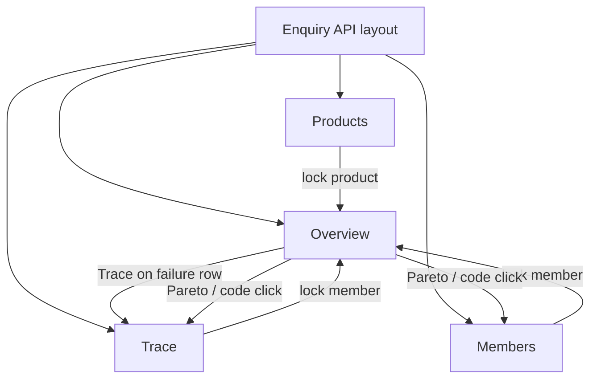
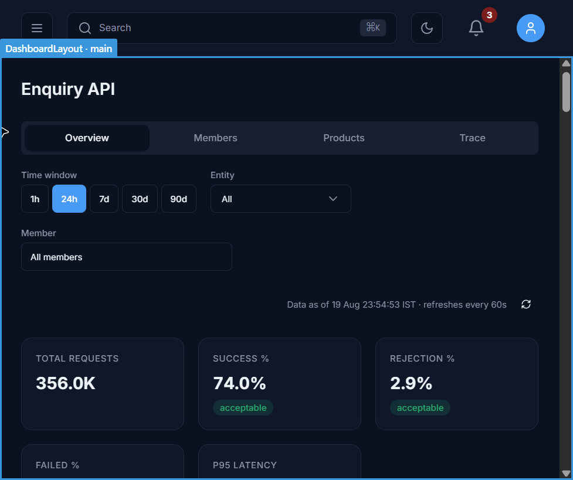
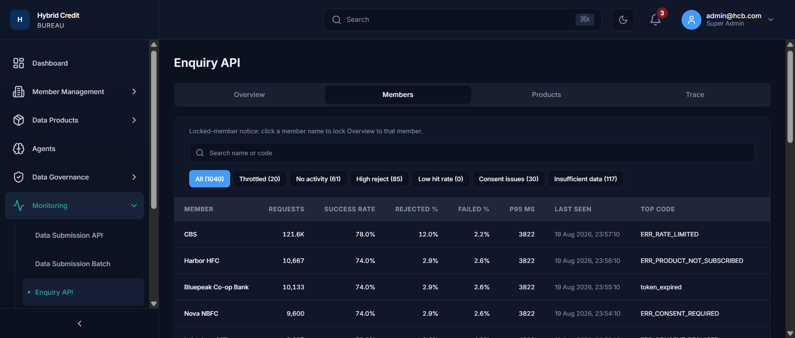
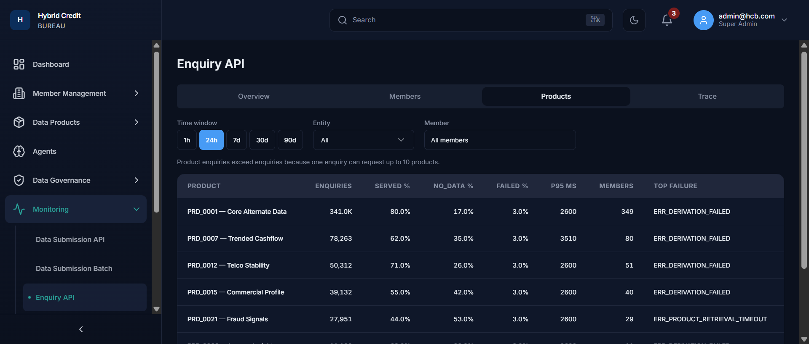
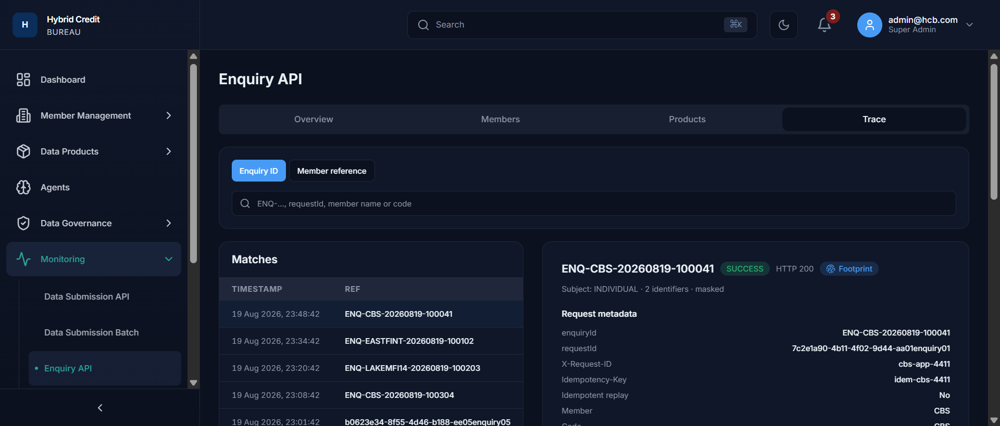

# Functional Business Requirements Document — Enquiry API Monitoring

| Field | Value |
|---|---|
| **Product** | Hybrid Credit Bureau (HCB) Admin Portal |
| **Module** | Monitoring — Enquiry API |
| **Route** | `/monitoring/inquiry-api` |
| **Nav / command palette** | **Enquiry API** / “Enquiry API Monitoring” |
| **Document type** | Functional BRD (as implemented) |
| **Version** | 1.0 |
| **Status** | Draft for review |
| **Classification** | Internal – Confidential |
| **Primary users** | Bureau operations / monitoring analysts; Super Admin / Bureau Admin |

> This BRD documents **current implemented behaviour** of the Enquiry API monitoring UI (Overview, Members, Products, Trace). Numbers on screen are produced by a **deterministic client-side scale mock** (`src/pages/monitoring/enquiry/enquiryScaleMock.ts`). Screenshots live in `docs/enquiry-monitoring/` and are embedded below. Live Enquiry APIs are **not** overlaid (sparse backend rows would be drowned by the scale mock). As-of timestamps use the **browser local clock** with an **IST** caption.

---

## 1. Document Control

| Item | Detail |
|---|---|
| Author | Senior Business Analyst / Product Manager |
| Date | 19 August 2026 |
| Reviewers | Bureau Ops lead, Platform Product Owner, QA lead `[TBC – needs stakeholder input]` |
| Source of truth | Implemented UI under `src/pages/monitoring/enquiry/` plus mock engine `enquiryScaleMock.ts` |

### Change log

| Version | Date | Author | Summary |
|---|---|---|---|
| 1.0 | 2026-08-19 | BA/PM | Initial functional BRD covering chrome, filters, outcome taxonomy, all four tabs, field dictionary, and calculation rules, with embedded screenshots. |

---

## 2. Executive Summary

### 2.1 Business problem

Subscriber institutions call the **Enquiry API** to retrieve product-scoped alternate data for a consumer (or organisation / joint subject). Bureau operations need one place to answer: *What is request volume? How many calls are gated vs executed? What is hit rate? Who is throttled or silent? Why did this specific enquiry fail?* Without an enquiry centre, entitlement denials, consent gaps, timeouts, and SLA breaches are discovered late.

### 2.2 Proposed solution (as implemented)

The **Enquiry API** monitoring module presents:

1. **Overview** — time/entity/member filters; five KPI tiles with range badges; funnel of outcome classes; end-to-end latency percentiles; product mix stacked bars; rejection Pareto; recent failures (last 50) with jump-to-trace.
2. **Members** — searchable ranking of 1,040 members with volume, success rate, reject/fail %, P95, last seen, top error code, and operational chips (throttled, no activity, high reject, …).
3. **Products** — catalogue rows of product-enquiry volume, SERVED / NO_DATA / FAILED mix, retrieval P95, members using, top failure code.
4. **Trace** — lookup by enquiry id / request id / member reference, match list, and a detail pane (metadata, stage latency, products requested, failure reasons).

### 2.3 Expected business value

- **BV-001** — Ops can judge enquiry health (volume, success/hit rate, gate rate, post-gate failure, P95 vs 5,000 ms SLO) in one screen.
- **BV-002** — Pareto plus failure list isolates a validation, entitlement, consent, rate-limit, or retrieval code quickly.
- **BV-003** — Member ranking isolates noisy, throttled, silent, or high-reject institutions; name click **locks Overview** to that member.
- **BV-004** — Trace opens a single `ENQ-…` or `requestId` and shows outcome, HTTP, HARD footprint, product-level SERVED/NO_DATA/FAILED, and field-level reasons.

### 2.4 Success metrics (KPI badges on Overview)

| ID | Metric on screen | Definition (this module) | Badge “acceptable” if |
|---|---|---|---|
| KPI-001 | Total requests | Count of **all** inbound calls in the window (gated + platform error + executed) | No badge (`slo = na`) |
| KPI-002 | Success % | `SUCCESS ÷ executed enquiries` | ≥ 70% (`hitRateSlo`) |
| KPI-003 | Rejection % | `gated ÷ requests` | ≤ 5% |
| KPI-004 | Failed % | `FAILED ÷ executed enquiries` | ≤ 3% |
| KPI-005 | P95 latency | Arithmetic **mean** of per-bucket P95 (ms) | ≤ 5,000 ms (`latencySloMs`) |

If the value misses “acceptable” but is still inside the watch band, the same badge copy **Needs attention** is used as for “out of range” (the UI does not print a separate “watch” label). See §6.4.

**Worked example — default 24h, all entities, all members (live UI 19 Aug 2026):**

| Tile | Value | Badge |
|---|---|---|
| Total requests | **356.0K** | — |
| Success % | **74.0%** | acceptable |
| Rejection % | **2.9%** | acceptable |
| Failed % | **2.1%** | acceptable |
| P95 latency | **3889 ms** | acceptable |

---

## 3. Scope

### 3.1 In scope

- Page chrome: title **Enquiry API**; tabs **Overview**, **Members**, **Products**, **Trace**.
- Shared filters on Overview and Products: Time window (1h / 24h / 7d / 30d / 90d), Entity, Member.
- Overview KPIs, four charts, Pareto `code` filter, Recent failures, Trace action.
- Members search, quick chips, pagination (25), lock member → Overview.
- Products table; product name click locks Overview to that product.
- Trace search modes, Matches table, detail pane (metadata, latency breakdown, products, failure reasons).
- Cross-tab state in the **URL**: `window`, `entity`, `member`, `product`, `tab`, `code`, `ref`.
- Demo error chrome via `?simulate=panelError|accessDenied|stale`.

### 3.2 Out of scope (typed in the mock / URL, not shown on the filter bar)

- **Enquiry type** filter (`type=HARD|SOFT|all`) — parsed from URL, **no control**.
- **Anchor** filter (`anchor=CURRENT|AS_OF|all`) — parsed from URL, **no control**. Retro / HARD still appear as **trace badges** and member `hardPct` / `retroPct` fields (those two member fields are **not columns**).
- Product version split, sparkline, trended share — **computed on product rows, not rendered**.
- Live Spring overlay of KPI or trace APIs.
- The older **Enquiry Detail Drawer** (`EnquiryDetailDrawer`) used by other monitoring lists is **not** this module.

### 3.3 Assumptions

- Scale constants: **9.6 million requests / 30-day month**, **1,040 members**, CBS is **38%** of volume.
- Identifiers and consent refs are **masked** in traces (`CNS-****-4411`; subject “masked”).
- Enquiry IDs follow `ENQ-{MEMBERCODE}-{YYYYMMDD}-{seq6}`.
- One enquiry may request **up to 10 products**; mock uses a mean of **1.62 product enquiries per executed enquiry**.

---

## 4. Users and access

| Persona | Access |
|---|---|
| Super Admin / Bureau Admin (e.g. `admin@hcb.com`) | Full portfolio: all 1,040 members, all tabs. |
| Any authenticated portal user who can open Monitoring | Same UI in the current build (no extra member-scope banner on this page). |
| `?simulate=accessDenied` | 403 **Access denied** card; no snapshot. |

Nav path: **Monitoring → Enquiry API**. Command palette: “Enquiry API Monitoring”.

---

## 5. Information architecture



| Route | Screen |
|---|---|
| `/monitoring/inquiry-api` | Overview (`tab` omitted) |
| `…?tab=members` | Members |
| `…?tab=products` | Products |
| `…?tab=trace` | Trace |
| `…?code=ERR_VALIDATION` | Filters failures / member top-code / traces; **does not** change KPI tiles |
| `…?ref=ENQ-…` or Trace from a row | Prefills Trace search and selects that enquiry |
| `…?simulate=stale` | Warning: “Monitoring data is delayed (last update 12 min ago)” |
| `…?simulate=panelError` | 503 panel error card |
| `…?window=24h` | Default; omitted from URL when 24h |

---

## 6. Cross-cutting: chrome, freshness, filters, outcome taxonomy, formulas

### 6.1 Page chrome (all tabs)

| Field / control | Description |
|---|---|
| Title | **Enquiry API** (nav label is the same; there is no subtitle line). |
| Tabs | Overview, Members, Products, Trace. Query string is preserved when switching tabs. |
| First-load | ~180 ms skeleton (title, filter bar, six KPI placeholders, chart block) once per visit. |
| Refresh | Interval **60 s**. Advances **Data as of** by 60 s × tick; **jitters only the latest time bucket** (±2%); **KPI totals stay on the base snapshot** so cards do not flicker. Manual refresh icon on Overview. |

**Freshness line (Overview only)**

`Data as of {D Mon HH:mm:ss} IST · refreshes every 60s`

Example: `Data as of 19 Aug 23:54:53 IST · refreshes every 60s`.

Format (`formatAsOf`): day + short month + `HH:mm:ss` + literal `IST` (no IANA conversion; local timezone clock).

### 6.2 Shared filter bar (Overview + Products)

Shown on Overview and Products. **Not** shown on Members or Trace (Members inherits the snapshot already scoped by URL filters; Trace searches the in-memory trace set).

| Field | Type | Default | Behaviour |
|---|---|---|---|
| Time window | Chips: 1h, 24h, 7d, 30d, 90d | **24h** | Sets lookback hours and chart grain. See §6.5. |
| Entity | Single select | All | All / Individual / Organization / Joint. Scales volume and hit rate. |
| Member | Searchable popover | All members | Search name or member code; ≤40 hits; “Server-style search across 1040 members”. Selecting one **locks** Overview (banner + Clear). |

**URL keys**

| Key | Values | Default (omitted) |
|---|---|---|
| `window` | `1h` `24h` `7d` `30d` `90d` | `24h` |
| `entity` | `INDIVIDUAL` `ORGANIZATION` `JOINT` `all` | `all` |
| `member` | `mem-cbs`, `mem-{n}`, `all` | `all` |
| `product` | `PRD_0001` … `all` | `all` |
| `type` | `HARD` `SOFT` `all` | `all` (no UI) |
| `anchor` | `CURRENT` `AS_OF` `all` | `all` (no UI) |
| `tab` | `overview` `members` `products` `trace` | overview |
| `code` | Pareto / failure code | none |
| `ref` | Trace jump key | none |

### 6.3 Outcome taxonomy (canonical)

Every inbound HTTP call is a **request**. After the gate, remaining calls are **executed enquiries**. Each executed enquiry has **one or more product enquiries**.

```
requests
  ├─ gated            (rejected before execution)
  ├─ platformError    (5xx / service_unavailable before or instead of a completed enquiry)
  └─ executed enquiries = success + noData + failed
        └─ product enquiries  (mean 1.62 per enquiry)
              ├─ SERVED
              ├─ NO_DATA
              └─ FAILED
```

**Identity (counts, after rounding per bucket)**

\[
\text{requests} = \text{gated} + \text{platformError} + \text{success} + \text{noData} + \text{failed}
\]

\[
\text{enquiries} = \text{success} + \text{noData} + \text{failed} = \text{requests} - \text{gated} - \text{platformError}
\]

| Outcome class | HTTP (typical) | Business meaning |
|---|---|---|
| **GATED** | 400 / 403 / 409 / 429 | Auth, validation, entitlement, consent, rate limit, duplicate, retro/HARD rule, window ceiling. **No** `enquiryId`. |
| **ERROR** | 503 | Platform / e2e timeout (`service_unavailable`). Counted in `platformError` on the funnel, **not** in Rejection %. |
| **SUCCESS** | 200 | At least **one** requested product is **SERVED**. Other products on the same enquiry may be NO_DATA or FAILED. |
| **NO_DATA** | 200 | Enquiry executed; **no** product SERVED; products returned NO_DATA. Normal miss, not a platform incident. |
| **FAILED** | 200 | Enquiry executed; product retrieval or derivation failed (`ERR_PRODUCT_RETRIEVAL_TIMEOUT`, `ERR_DERIVATION_FAILED`, `ERR_PRODUCT_UNSERVABLE`). HARD FAILED still **creates a footprint**. |

**HARD vs SOFT vs retro (anchor)**

| Concept | Rule in this module |
|---|---|
| HARD share (unfiltered) | 63% of executed (`hardShare`) |
| SOFT share | 37% |
| Retro `AS_OF` share | 6% of executed, and **only on SOFT** (HARD + AS_OF is gated: `ERR_RETRO_REQUIRES_SOFT`) |
| Footprint | Created when HARD enquiry is **accepted into execution** and completes as SUCCESS or FAILED (not GATED / ERROR) |

### 6.4 Range badges

Same component as DQI (`DqKpiRangeTag`).

| Internal `slo` | Label shown | Colour |
|---|---|---|
| `ok` | acceptable | Green |
| `watch` | Needs attention | Amber |
| `breach` | Needs attention | Red |
| `na` | (no badge) | — |

| Metric | acceptable (`ok`) | watch else breach |
|---|---|---|
| Success % | ≥ 70 | ≥ 60 |
| Rejection % | ≤ 5 | ≤ 8 |
| Failed % | ≤ 3 | ≤ 5 |
| P95 latency | ≤ 5,000 ms | ≤ 6,500 ms (1.3 × SLO) |

### 6.5 Time window → buckets

| Window | Lookback hours | Bucket count | Grain | X-axis label |
|---|---|---|---|---|
| 1h | 1 | 12 | 5 min | `HH:mm` |
| 24h | 24 | 24 | hour | `HH:mm` |
| 7d | 168 | 7 | day | `{D} {Mon}` |
| 30d | 720 | 30 | day | `{D} {Mon}` |
| 90d | 2,160 | 45 | 2 day | `{D} {Mon}` |

On **90d + All members**, Members ranking is **capped at 400 rows** and Overview shows: “Large result set — member ranking and trace matches are capped; narrow the range or select a member.”

**Bucket width**

\[
\Delta t = \frac{\text{hours} \times 3{,}600{,}000\ \text{ms}}{\text{bucketCount}}
\]

### 6.6 Volume generation (mock engine)

**Hourly baseline**

\[
\lambda = \frac{9{,}600{,}000}{30 \times 24} = 13{,}333.\overline{3}\ \text{requests/hour}
\]

**Filter scale** (multiplicative)

\[
\text{scale} = s_{\text{type}} \times s_{\text{anchor}} \times s_{\text{entity}} \times s_{\text{product}} \times s_{\text{member}}
\]

| Factor | Formula |
|---|---|
| \(s_{\text{type}}\) | HARD → 0.63; SOFT → 0.37; all → 1 |
| \(s_{\text{anchor}}\) | all → 1; CURRENT → \(1 - 0.06\); AS_OF → \(0.06 / s_{\text{type}}\) (0 if type is HARD) |
| \(s_{\text{entity}}\) | INDIVIDUAL 0.88; ORGANIZATION 0.09; JOINT 0.03; all → 1 |
| \(s_{\text{product}}\) | product `popularity` if locked, else 1 |
| \(s_{\text{member}}\) | member share if locked (0 if silent), else 1 |

**Expected requests in the window**

\[
\mathbb{E}[\text{requests}] = \lambda \times \text{hours} \times \text{scale}
\]

**Waveform per bucket** (then uniform jitter \(U \in [0.92, 1.08]\))

- Intra-day grain (1h, 24h): \(\text{diurnal}(h) \times \text{weekday}\)
  - hours 11–14 → 2.4; 02–05 → 0.35; 08–18 → 1.35; else 0.70
  - Sat/Sun → 0.55 else 1.00
- Day / 2-day grain (7d, 30d, 90d): \(\text{weekday} \times \text{monthEnd}\)
  - last 3 calendar days of month → 1.25 else 1.00

\[
\text{requests}_b = \mathrm{round}\Bigl(\frac{\mathbb{E}[\text{requests}]}{\text{bucketCount}} \times \text{wave}_b \times U_b\Bigr)
\]

**Default 24h sanity check:** \(\mathbb{E} \approx 13{,}333 \times 24 = 320{,}000\). After diurnal/weekend/jitter the live screen showed **356.0K** (plausible band; tests require 80k–1.2M).

### 6.7 Per-bucket outcome split

Constants: `gateRate = 0.029`, `platformErrorRate = 0.0018`.

\[
\text{gated}_b = \mathrm{round}(\text{requests}_b \times 0.029)
\]

\[
\text{platformError}_b = \mathrm{round}(\text{requests}_b \times 0.0018)
\]

\[
\text{executed}_b = \max(0,\ \text{requests}_b - \text{gated}_b - \text{platformError}_b)
\]

**Hit / miss / fail shares of executed**

Let \(h\) = entity/product hit rate:

| Entity filter | \(h\) |
|---|---|
| all | 0.74 (`successShare`) |
| INDIVIDUAL | 0.76 |
| JOINT | 0.71 |
| ORGANIZATION | 0.58 |
| Product locked | that product’s `servedRate` |
| Member locked to CBS | \(\min(0.92,\ \max(0.40,\ h \times 1.05))\) |

\[
\text{successShare} = \mathrm{clamp}(h,\ 0.40,\ 0.92)
\]

\[
\text{noDataShare} = \max\bigl(0.04,\ (1 - \text{successShare}) \times 0.92\bigr)
\]

\[
\text{failedShare} = \max\bigl(0.005,\ 1 - \text{successShare} - \text{noDataShare}\bigr)
\]

**Unfiltered worked example**

\[
\text{successShare} = 0.74
\]

\[
\text{noDataShare} = \max(0.04,\ 0.26 \times 0.92) = 0.2392
\]

\[
\text{failedShare} = \max(0.005,\ 1 - 0.74 - 0.2392) = 0.0208
\]

\[
\begin{aligned}
\text{success}_b &= \mathrm{round}(\text{executed}_b \times \text{successShare}) \\
\text{failed}_b &= \mathrm{round}(\text{executed}_b \times \text{failedShare}) \\
\text{noData}_b &= \max(0,\ \text{executed}_b - \text{success}_b - \text{failed}_b)
\end{aligned}
\]

**HARD / SOFT / retro counts on the bucket** (chart data; not KPI tiles)

\[
\text{hard}_b = \mathrm{round}(\text{executed}_b \times \text{hardShare}_{\text{eff}})
\]

\[
\text{soft}_b = \max(0,\ \text{executed}_b - \text{hard}_b)
\]

\[
\text{retro}_b = \mathrm{round}(\text{executed}_b \times \text{retroShare}_{\text{eff}})
\]

If type = HARD → `hardShare_eff = 1`, `retroShare_eff = 0`. If type = SOFT → `hardShare_eff = 0`. If anchor = CURRENT → retro 0. If anchor = AS_OF → retro 1 and hard 0.

**Bucket hit rate (tooltip on funnel series)**

\[
\text{hitRatePct}_b = \begin{cases}
0 & \text{enquiries}_b = 0 \\
\mathrm{round}_1\bigl(\text{success}_b / \text{enquiries}_b \times 100\bigr) & \text{otherwise}
\end{cases}
\]

**Latency series (not true sample percentiles)**

With jitter \(p \in [0.96, 1.04]\):

\[
\begin{aligned}
\text{p50}_b &= \mathrm{round}(1400 \times p) \\
\text{p95}_b &= \mathrm{round}(3900 \times p) \\
\text{p99}_b &= \mathrm{round}(5600 \times p) \\
\text{r50}_b &= \mathrm{round}(2600 \times 0.55 \times p) \\
\text{r95}_b &= \mathrm{round}(2600 \times p) \\
\text{r99}_b &= \mathrm{round}(2600 \times 1.55 \times p)
\end{aligned}
\]

Retrieval series `r50/r95/r99` are **generated but not plotted** on Overview (only e2e P50/P95/P99).

**Peak RPS (generated, not plotted)**

\[
\text{peakRps}_b = \text{requests}_b \big/ (\Delta t / 1000) \times 1.8
\]

### 6.8 Window totals and KPI formulas

Sum buckets: \(R, G, E_{\text{plat}}, S, N, F\).

\[
\text{enquiries} = S + N + F
\]

\[
\text{productEnquiries} = \mathrm{round}(\text{enquiries} \times 1.62)
\]

| KPI | Formula | Display |
|---|---|---|
| Total requests | \(R\) | `formatCompact(R)` |
| Success % | \(S / \text{enquiries} \times 100\) | 1 decimal + `%` |
| Rejection % | \(G / R \times 100\) | 1 decimal + `%` |
| Failed % | \(F / \text{enquiries} \times 100\) | 1 decimal + `%` |
| P95 latency | \(\mathrm{round}(\text{mean}_b(\text{p95}_b))\) | `{n} ms` |

**Display compact numbers (`formatCompact`)**

| Range | Rule | Example |
|---|---|---|
| \(\lvert n\rvert \ge 1{,}000{,}000\) | M, 2 dp if value &lt; 10 else 1 dp | `1.02M` |
| \(\lvert n\rvert \ge 100{,}000\) | K, 1 dp | `356.0K`, `121.6K` |
| else | `Math.round` + `en-US` grouping | `10,667` |

**Tooltips (verbatim business definitions on the tiles)**

| Tile | Tooltip |
|---|---|
| Total requests | Every call received, including gated calls, platform errors, and executed enquiries. |
| Success % | SUCCESS ÷ executed enquiries. SUCCESS means at least one product was SERVED. |
| Rejection % | Share of requests rejected before execution (auth, entitlement, validation, consent, rate limit, or duplicate). |
| Failed % | FAILED ÷ executed enquiries. Product retrieval or derivation failed after the request passed the gate. |
| P95 latency | End-to-end P95 for executed traffic versus the 5 000 ms SLO. |

**Important:** Success % and Failed % use **executed enquiries** as denominator, **not** total requests. Rejection % uses **requests** and **excludes** platform errors. Platform errors appear on the funnel as a thin stacked series.

**Worked identity check (illustrative, using 356.0K requests, 2.9% reject, 74.0% success, 2.1% failed)**

\[
G \approx 0.029 \times 356{,}000 = 10{,}324
\]

\[
E_{\text{plat}} \approx 0.0018 \times 356{,}000 = 641
\]

\[
\text{enquiries} \approx 356{,}000 - 10{,}324 - 641 = 345{,}035
\]

\[
S \approx 0.740 \times 345{,}035 = 255{,}326 \quad F \approx 0.021 \times 345{,}035 = 7{,}246
\]

\[
N = 345{,}035 - 255{,}326 - 7{,}246 = 82{,}463 \quad (\approx 23.9\%\ \text{NO_DATA})
\]

NO_DATA has **no KPI tile**; it is visible on the funnel and on Products.

Empty scope (`R = 0`): dashed copy **“No traffic in the selected scope”** (e.g. silent member lock).

### 6.9 Member volume share (Members tab + member lock)

Catalog: 1,040 rows; index 0 is **CBS** (`id = mem-cbs`, `code = CBS`).

**Silent members:** `idx > 0` and `idx % round(1 / 0.06) = idx % 17 = 0` → share 0 (~6% of book; UI chip **No activity (61)**).

\[
\text{share}(\text{idx}) =
\begin{cases}
0 & \text{silent} \\
0.38 & \text{idx}=0\ (\text{CBS}) \\
0.35 \times (21-\text{idx}) / 210 & 1 \le \text{idx} \le 20 \\
0.27 / n_{\text{activeTail}} & \text{active long tail} \\
0 & \text{remaining silent tail}
\end{cases}
\]

where \(n_{\text{activeTail}} = \mathrm{round}((1040-21)\times(1-0.06))\).

Unfiltered member requests (not locked):

\[
\text{req}_m = \mathrm{round}\bigl(\lambda \times \text{hours} \times \text{share}_m \times s_{\text{type}} \times s_{\text{entity}} \times s_{\text{product}}\bigr)
\]

If Overview is locked to one member, that row’s `requests` equals window `totalReq`; all other rows are 0.

**CBS check (24h):** \(0.38 \times 13{,}333 \times 24 \approx 121{,}600\) → screen **121.6K**.

---

## 7. Screens — fields, behaviour, screenshots

### 7.1 Overview

**Purpose.** Portfolio pulse for the selected window / entity / member: volume, gate rate, hit rate, post-gate failure, latency vs 5 s SLO, product mix, rejection codes, last 50 failures.



#### 7.1.1 Filter + freshness fields

| Field | Description |
|---|---|
| Time window | See §6.2 / §6.5. Default 24h highlighted. |
| Entity | All / Individual / Organization / Joint. |
| Member | All members, or `{name} · {code}`. |
| Member-lock banner | “Overview is locked to member {name}.” + **Clear member lock**. |
| Data as of | §6.1. |
| Refresh | Ghost icon; same jitter path as the 60 s timer. |

#### 7.1.2 KPI tiles

Layout: CSS grid **3 columns** (five tiles: 3 on the first row, 2 on the second).

| Tile label | Value | Default 24h (19 Aug 2026) | Badge |
|---|---|---|---|
| TOTAL REQUESTS | `formatCompact(R)` | 356.0K | none |
| SUCCESS % | `formatPct1(S/enquiries×100)` | 74.0% | acceptable |
| REJECTION % | `formatPct1(G/R×100)` | 2.9% | acceptable |
| FAILED % | `formatPct1(F/enquiries×100)` | 2.1% | acceptable |
| P95 LATENCY | `{mean p95} ms` | 3889 ms | acceptable |

Tiles are **not clickable** (unlike DQI Overview). Hover shows the tooltip in §6.8.

#### 7.1.3 Funnel — requests by outcome class

Stacked **area** chart, one point per bucket.

| Series (`dataKey`) | Colour role | Count source |
|---|---|---|
| success | chart-2 | `success_b` |
| noData | chart-3 | `noData_b` |
| failed | destructive | `failed_b` |
| gated | muted | `gated_b` |
| platformError | destructive (higher opacity) | `platformError_b` |

Y-axis uses `formatCompact`. X-axis is bucket `label`.

#### 7.1.4 End to End Latency P50/P95/P99

Line chart, milliseconds. Red **dashed reference** at **5,000 ms**.

| Series | Source |
|---|---|
| P50 | `p50_b` |
| P95 | `p95_b` |
| P99 | `p99_b` |

Caption: “Milliseconds”.

#### 7.1.5 Product mix & outcome

Stacked **bar** chart of **product enquiries** (not API requests).

| Bar segment | Meaning |
|---|---|
| served | Product enquiry returned data |
| noData | Product enquiry found no subject data |
| failed | Product enquiry retrieval/derivation failed |

**Row construction (top 8 products by popularity; remainder rolled to Other)**

\[
n_p = \mathrm{round}(\text{productEnquiries} \times \text{popularity}_p)
\]

\[
\text{served}_p = \mathrm{round}(n_p \times \text{servedRate}_p),\quad
\text{failed}_p = \mathrm{round}(n_p \times 0.03),\quad
\text{noData}_p = n_p - \text{served}_p - \text{failed}_p
\]

X-axis shows `productId` (`PRD_0001` …). Tooltip shows `{id} — {name}`. Click a segment (not Other) **toggles** `product=` on the URL and rescopes Overview. Clicking Other is ignored.

**Other** (if any leftover popularity): served 60% / noData 35% / failed remainder.

#### 7.1.6 Rejection reasons — Pareto

Horizontal bars. Universe:

\[
\text{paretoTotal} = G + F
\]

(gated **plus** FAILED — not platform errors, not NO_DATA).

First **eight** gate codes by configured weight; remainder → **Other**.

\[
\text{count}_c = \mathrm{round}(\text{paretoTotal} \times w_c),\quad
\text{pct}_c = \text{count}_c / \text{paretoTotal} \times 100\ \text{(1 dp)}
\]

Click a bar (not Other) sets `code=`; KPI cards **do not** change. Copy on screen: “Gated and FAILED codes · click a bar to filter failures, members, and traces (not KPI cards)”.

Weights and codes: §8.

#### 7.1.7 Recent failures (last 50)

| Column | Field | Rule |
|---|---|---|
| Timestamp | `time` | `formatDateTime` → `{D} {Mon} {YYYY}, HH:mm:ss` |
| Member | `member` | Institution name |
| Entity | `entity` | Hidden below laptop breakpoint |
| Type | `type` | HARD / SOFT |
| Ref | `ref` | Truncated to 18 chars + ellipsis if longer; click **copies** full ref |
| Outcome | `outcome` | GATED / FAILED / ERROR badge |
| Code | `code` | Click toggles Pareto `code` filter |
| Latency | `latencyMs` | `{n} ms` |
| Trace | action | Sets `tab=trace&ref=` |

**Row generation:** 50 synthetic rows in a window of `min(hours, 24)` hours. Outcome cycle `GATED, GATED, GATED, FAILED, ERROR`.

**HTTP assignment**

| Condition | HTTP |
|---|---|
| ERROR | 503 |
| FAILED | 200 |
| `ERR_RATE_LIMITED` | 429 |
| `ERR_DUPLICATE_ENQUIRY` | 409 |
| `ERR_PRODUCT_NOT_SUBSCRIBED` | 403 |
| other GATED | 400 |

**Latency assignment**

| Outcome | Latency |
|---|---|
| ERROR | 5000 + U[0, 800] ms |
| FAILED | 3200 + U[0, 900] ms |
| GATED | 20 + U[0, 80] ms |

FAILED refs use `ENQ-{code}-{ymd}-{seq}`; GATED/ERROR refs are UUIDs.

Empty after `code` filter: “No failures in scope”.

---

### 7.2 Members

**Purpose.** Rank institutions; isolate throttled / silent / high-reject / consent / thin-traffic members; lock Overview.



#### 7.2.1 Toolbar

| Control | Behaviour |
|---|---|
| Helper | “Locked-member notice: click a member name to lock Overview to that member.” |
| Search | Case-insensitive name or code; resets page to 1. |
| Chips | Counted on the **source** list (capped 400 when 90d + all members). |

| Chip | Predicate | Count on default 24h All |
|---|---|---|
| All | — | 1040 |
| Throttled | `throttled` | 20 |
| No activity | `silent` | 61 |
| High reject | `highReject` | 85 |
| Low hit rate | `lowHit` | 0 |
| Consent issues | `consentIssues` | 30 |
| Insufficient data | `insufficient` | 117 |

If Pareto `code` is set, an extra chip `{code} ✕` filters `topCode === code`.

Default sort: **requests descending**. Page size **25**. Footer: `Showing {from}–{to} of {n}` + Previous / Next.

Empty: “No members match the selected filters”.

#### 7.2.2 Columns

| Column | Field | Calculation / display |
|---|---|---|
| Member | `name` | Click → `member={id}&tab=overview` |
| Requests | `requests` | `formatCompact`; see §6.9 |
| Success rate | `hitRate` | \(S_m / \text{enq}_m \times 100\) (1 dp). If `insufficient` → literal **Insufficient data** |
| Rejected % | `rejectedPct` | \(\text{gated}_m / \text{req}_m \times 100\) |
| Failed % | `failedPct` | \(F_m / \text{enq}_m \times 100\) |
| P95 ms | `p95` | `—` if silent or insufficient; else \(\mathrm{round}(3900 \times (1.08\ \text{if MFI else } 0.98))\) |
| Last seen | `lastSeen` | Active: now − `(idx % 50)` minutes. Silent: now − `(1 + idx % 14)` **days** |
| Top code | `topCode` | See below |

**Per-member funnel (not all shown as columns)**

\[
\text{gated}_m = \mathrm{round}(\text{req}_m \times g_m),\quad
g_m = \begin{cases} 0.12 & \text{idx} \bmod 11 = 0 \\ 0.029 & \text{otherwise} \end{cases}
\]

CBS is idx 0 → **12.0% rejected** on screen (high-reject chip also true because \(0.12 > 0.10\) and req ≥ 80).

\[
\text{plat}_m = \mathrm{round}(\text{req}_m \times 0.0018)
\]

\[
\text{enq}_m = \max(0,\ \text{req}_m - \text{gated}_m - \text{plat}_m)
\]

**Member hit rate \(h_m\)** (success share of executed)

| Member | \(h_m\) |
|---|---|
| CBS | 0.78 → **78.0%** |
| name contains `MFI` | 0.58 |
| name contains `Fintech` | 0.65 |
| else | 0.74 |

\[
S_m = \mathrm{round}(\text{enq}_m \times h_m),\quad
N_m = \mathrm{round}(\text{enq}_m \times (1-h_m) \times 0.9),\quad
F_m = \max(0,\ \text{enq}_m - S_m - N_m)
\]

\[
\text{hitRate} = S_m / \text{enq}_m \times 100 \quad (1\ \text{dp})
\]

\[
\text{productEnquiries}_m = \mathrm{round}(\text{enq}_m \times 1.62)
\]

\[
\text{throughput}_m = \mathrm{round}(\text{req}_m / \max(1,\text{hours}))
\]

(`throughput`, `hardPct`, `retroPct`, `noDataPct` are **stored, not shown**.)

**Flags**

| Flag | Formula |
|---|---|
| `insufficient` | `req < 80` |
| `highReject` | `gated/req > 0.1` **and** `req ≥ 80` |
| `lowHit` | `h_m < 0.5` **and** `enq ≥ 80` (none of the canned \(h_m\) are below 0.5 → chip **0**) |
| `throttled` | not silent and `idx % 50 = 0` (~2%) |
| `consentIssues` | not silent and `idx % 33 = 3` (~3%) |

**Top code priority**

1. Silent → `—`
2. Throttled → `ERR_RATE_LIMITED`
3. Consent issues → `ERR_CONSENT_REQUIRED`
4. Else if entitlement share of gated > 40% → `ERR_PRODUCT_NOT_SUBSCRIBED`
5. Else rotate `GATE_CODES[idx % length]`

CBS is idx 0 and throttled (`0 % 50 = 0`) → **ERR_RATE_LIMITED** even though reject % is driven by the 12% gate bump.

---

### 7.3 Products

**Purpose.** See which data products are requested, how often they serve vs miss vs fail, and retrieval P95.



Helper: “Product enquiries exceed enquiries because one enquiry can request up to 10 products.”

Same Time window / Entity / Member filters as Overview.

| Column | Field | Formula / notes |
|---|---|---|
| Product | `productId — name` | Click → `product={id}&tab=overview` |
| Enquiries | `productEnquiries` | \(\mathrm{round}(\text{window productEnquiries} \times \text{popularity})\) or full window PE if product locked |
| Served % | `servedPct` | \(\text{servedRate} \times 100\) (1 dp) |
| NO_DATA % | `noDataPct` | \((n - n\cdot\text{servedRate} - n\cdot 0.03)/n \times 100\) |
| Failed % | `failedPct` | always **3.0%** in the mock (`0.03`) |
| P95 ms | `p95Retrieval` | `2600` except **Trended Cashflow (PRD_0007) = 3510** (\(2600 \times 1.35\)) |
| Members | `membersUsing` | \(\max(1,\ \mathrm{round}(1040 \times \text{popularity} \times 0.55))\) |
| Top failure | `topFailure` | `servedRate < 0.5` → `ERR_PRODUCT_RETRIEVAL_TIMEOUT` else `ERR_DERIVATION_FAILED` |

**Identity on a product row**

\[
\text{servedPct} + \text{noDataPct} + \text{failedPct} = 100\%
\]

(rounding to 1 dp may show 80.0 / 17.0 / 3.0 as on PRD_0001).

**Default 24h examples (from UI)**

| Product | Enquiries | Served | NO_DATA | Failed | P95 | Members | Top failure |
|---|---|---|---|---|---|---|---|
| PRD_0001 Core Alternate Data | 341.0K | 80.0% | 17.0% | 3.0% | 2600 | 349 | ERR_DERIVATION_FAILED |
| PRD_0021 Fraud Signals | 27,951 | 44.0% | 53.0% | 3.0% | 2600 | 29 | ERR_PRODUCT_RETRIEVAL_TIMEOUT |

Empty: “No traffic in the selected scope”.

**Not shown but generated:** versions 2.0 Active / 1.0 Deprecated split; 8-bucket spark; `trendedShare`; `retroShare`.

---

### 7.4 Trace

**Purpose.** Find one enquiry (or a member correlation id) and inspect metadata, stage timings, product outcomes, and failure reasons.



#### 7.4.1 Search chrome

| Control | Behaviour |
|---|---|
| Enquiry ID mode (default) | Substring match on `enquiryId`, `requestId`, `xRequestId`, `idempotencyKey`, `applicationRef`, member name, member code (`traceSearchKey`). Cap **200** hits; if query empty, first **25** traces. |
| Member reference mode | Exact match (case-insensitive) on `X-Request-ID` **or** `Idempotency-Key` **or** `applicationRef`. Cap 200. |
| Member-ref extra chips | 1h / 6h / 24h — **UI only**; copy says “Member-reference search is limited to the last 24 hours.” The mock **does not** time-slice on these chips. |
| Prefill | `ref` query or Overview Trace button. |

Pareto `code`: if query empty, traces whose errors include that code (fallback: non-SUCCESS).

Empty matches: “No matches — check the reference format”.

#### 7.4.2 Matches table

| Column | Source |
|---|---|
| Timestamp | `received` |
| Ref | `enquiryId` if present, else `requestId` |
| Member | `member` |
| Status | SUCCESS / NO_DATA / FAILED / GATED / ERROR |

Row click selects detail. Default selection: first curated row **ENQ-CBS-20260819-100041** (SUCCESS, HTTP 200, Footprint).

#### 7.4.3 Detail header

| Element | Rule |
|---|---|
| Title | `enquiryId` or `requestId` |
| Status badge | Colours: SUCCESS green; NO_DATA amber; FAILED red; GATED muted; ERROR darker red |
| HTTP | `HTTP {code}` |
| Footprint badge | Shown if `footprintCreated` |
| Retro badge | Shown if `anchor === AS_OF` |
| Subject line | e.g. `Subject: INDIVIDUAL · 2 identifiers · masked` |

#### 7.4.4 Request metadata (every field)

| Label | Field | Meaning / derivation |
|---|---|---|
| enquiryId | `enquiryId` | Bureau enquiry id. **— (gated / error)** when null |
| requestId | `requestId` | Internal UUID of this HTTP call |
| X-Request-ID | `xRequestId` | Member correlation header |
| Idempotency-Key | `idempotencyKey` | Duplicate-prevention key |
| Idempotent replay | `idempotentReplay` | Yes if `ERR_DUPLICATE_ENQUIRY` (or curated duplicate row) |
| Member | `member` | Click locks Overview to `memberId` |
| Code | `code` | Member short code (e.g. CBS) |
| Entity type | `entityType` | INDIVIDUAL / ORGANIZATION / JOINT |
| Enquiry type | `enquiryType` | HARD / SOFT / — |
| Purpose | `purpose` | e.g. `new_credit`, `portfolio_review`, `kyc`, `collections`, `account_monitoring` |
| Anchor | `anchor` (+ `enquiryDate`) | CURRENT, or `AS_OF · {YYYY-MM-DD}` |
| Consent reference | `consentRef` | Always masked `CNS-****-4411` in the mock |
| Application ref | `applicationRef` | Member application id |
| Received at | `received` | `formatDateTime` |
| Responded at | `responded` | Received + e2e latency (curated) |
| End-to-end latency | `latencyMs` | Sum of stages (see below) |
| Footprint created | `footprintCreated` + `footprintId` | `Yes · FP-…` or `No` |

**Enquiry id pattern**

\[
\texttt{ENQ-\{MEMBERCODE\}-\{YYYYMMDD\}-\{seq6\}}
\]

Example: `ENQ-CBS-20260819-100041`.

#### 7.4.5 Latency breakdown

Five stages. For executed curated traces with e2e \(L\):

\[
\begin{aligned}
\text{Gateway/auth} &= \mathrm{round}(0.06 L) \\
\text{Validation} &= \mathrm{round}(0.10 L) \\
\text{Identity resolution} &= \mathrm{round}(0.18 L) \\
\text{Product retrieval} &= \mathrm{round}(0.52 L) \\
\text{Response assembly} &= L - \text{(sum of the four)}
\end{aligned}
\]

Bar segment width = `ms / sum(stages)`.

Gated traces use **fixed small** stage times (identity + retrieval = 0). ERROR uses a long retrieval (e.g. 4,800 ms of 5,240 ms).

Helper on products: “Enquiry is SUCCESS when any product is SERVED.”

#### 7.4.6 Products requested

Empty copy if gated/error: “No product-level records — this request was gated or failed before execution.”

| Column | Field | Meaning |
|---|---|---|
| # | `n` | Order in the request (1…10) |
| Product | `productId — name` | Catalogue |
| Version | `version` | e.g. 2.0 / 1.1 / 1.0 |
| dataScope | `dataScope` | `SNAPSHOT` or `TRENDED · 12m` |
| Outcome | `outcome` | SERVED / NO_DATA / FAILED |
| Packets | `packets` | `{returned}/{configured}` e.g. `5/5`, `0/2` |
| Retrieval ms | `retrievalMs` | Per-product retrieval time |
| Reason | `reason` | Failure code or — |
| enquiryItemId | `enquiryItemId` | `{enquiryId}-{nn}` |

**CBS SUCCESS example (curated, −8 min from as-of)**

| # | Product | Scope | Outcome | Packets | ms |
|---|---|---|---|---|---|
| 1 | PRD_0001 Core Alternate Data | SNAPSHOT | SERVED | 5/5 | 920 |
| 2 | PRD_0007 Trended Cashflow | TRENDED · 12m | SERVED | 3/3 | 1180 |
| 3 | PRD_0012 Telco Stability | SNAPSHOT | NO_DATA | 0/2 | 640 |

E2E **1850 ms**; footprint **FP-CBS-100041**; HARD; purpose `new_credit`.

#### 7.4.7 Failure reasons

| Column | Field |
|---|---|
| Code | `errors[].code` |
| Field | JSON path e.g. `products[0].productId`, `enquiryPurpose` |
| Rule / Validation | e.g. `ENTITLEMENT`, `VAL_REQUIRED_FIELD_MISSING`, `NFR-PER-01` |
| Message | Human text |

SUCCESS with no errors: “No failure reasons on this enquiry.”  
NO_DATA extra line: “NO_DATA is a normal outcome — the subject has no data for the requested products.”

**Curated scenario catalogue (12 traces)**

| # | Status | HTTP | What it demonstrates |
|---|---|---|---|
| 1 | SUCCESS | 200 | HARD CBS, mixed SERVED + NO_DATA, footprint |
| 2 | SUCCESS | 200 | SOFT + AS_OF (retro) trended products, no footprint |
| 3 | NO_DATA | 200 | All products NO_DATA |
| 4 | FAILED | 200 | HARD timeouts, footprint **still created**, `ERR_PRODUCT_RETRIEVAL_TIMEOUT` |
| 5 | GATED | 403 | `ERR_PRODUCT_NOT_SUBSCRIBED` |
| 6 | GATED | 400 | Validation: missing identifier + invalid purpose |
| 7 | GATED | 400 | `ERR_RETRO_REQUIRES_SOFT` |
| 8 | GATED | 429 | `ERR_RATE_LIMITED` |
| 9 | GATED | 409 | `ERR_DUPLICATE_ENQUIRY`, idempotent replay Yes |
| 10 | ERROR | 503 | Org subject, 5,240 ms, SLA message |
| 11 | SUCCESS | 200 | JOINT, 4 products, footprint |
| 12 | SUCCESS | 200 | ORGANIZATION, Commercial Profile SERVED |

Plus 24 extra traces projected from the Recent failures sample.

---

## 8. Product catalogue and error-code dictionary

### 8.1 Products (`ENQUIRY_PRODUCTS`)

Popularity sums to 1.00. `servedRate` is the SERVED share of **product enquiries**.

| ID | Name | Popularity | Served rate |
|---|---|---|---|
| PRD_0001 | Core Alternate Data | 0.61 | 0.80 |
| PRD_0007 | Trended Cashflow | 0.14 | 0.62 |
| PRD_0012 | Telco Stability | 0.09 | 0.71 |
| PRD_0015 | Commercial Profile | 0.07 | 0.55 |
| PRD_0021 | Fraud Signals | 0.05 | 0.44 |
| PRD_0003 | Income Insights | 0.02 | 0.68 |
| PRD_0009 | Bureau Overlay | 0.012 | 0.73 |
| PRD_0018 | Utility Tenure | 0.008 | 0.60 |

### 8.2 Gate codes (Pareto weights)

Used for Pareto (first 8 + Other) and weighted picks on GATED failure rows.

| Code | Weight | Typical HTTP | Meaning |
|---|---|---|---|
| ERR_VALIDATION | 0.34 | 400 | Schema / required field / enum |
| ERR_PRODUCT_NOT_SUBSCRIBED | 0.18 | 403 | No active product subscription |
| token_expired | 0.12 | 400 | Auth token expired |
| ERR_RATE_LIMITED | 0.10 | 429 | Member exceeded enquiry rate limit |
| ERR_CONSENT_REQUIRED | 0.07 | 403 | Consent required but missing |
| ERR_DUPLICATE_ENQUIRY | 0.06 | 409 | Idempotent replay |
| ERR_ENQUIRY_DATE_EXCEEDS_CEILING | 0.04 | 400 | AS_OF date too far back |
| ERR_PRODUCTS_LIMIT | 0.03 | 400 | More than allowed products on one enquiry |
| invalid_client | 0.03 | 400 | Client credentials |
| ERR_CONSENT_INVALID | 0.015 | 403 | Consent invalid / expired |
| ERR_WINDOW_EXCEEDS_CEILING | 0.015 | 400 | Trended window too long |

First eight weights sum to **0.94**; Pareto **Other** absorbs the rest of \(G+F\) (including FAIL codes that are not in this table).

### 8.3 Post-gate FAIL codes

Cycled on FAILED failure rows: `ERR_PRODUCT_RETRIEVAL_TIMEOUT`, `ERR_DERIVATION_FAILED`, `ERR_PRODUCT_UNSERVABLE`.

### 8.4 Other codes seen on Trace

| Code | Rule | When |
|---|---|---|
| ERR_RETRO_REQUIRES_SOFT | BR-RETRO | AS_OF with HARD |
| service_unavailable | SLA | Platform ERROR / 503 |
| VAL_REQUIRED_FIELD_MISSING | validation | Missing identifier |
| VAL_ENUM_INVALID | validation | Bad `enquiryPurpose` |
| NFR-PER-01 | performance | Per-product retrieval timeout |
| IDEMPOTENCY | idempotency | Duplicate key |
| RATE_LIMIT | rate limit | 429 |
| ENTITLEMENT | entitlement | Unsubscribed product |

---

## 9. Identifier and LOV reference

| Kind | Pattern / values |
|---|---|
| Member id | `mem-cbs`, `mem-1` … `mem-1039` |
| Member code | `CBS` or generated 6–10 char code |
| Enquiry | `ENQ-CBS-20260819-100041` |
| Enquiry item | `{enquiryId}-01` |
| Request UUID | `xxxxxxxx-xxxx-4xxx-axxx-xxxxxxxxxxxx` (mock) |
| Consent | `CNS-****-4411` |
| Footprint | `FP-CBS-100041` |
| Entity | INDIVIDUAL, ORGANIZATION, JOINT |
| Type | HARD, SOFT |
| Anchor | CURRENT, AS_OF |
| Product outcome | SERVED, NO_DATA, FAILED |
| Enquiry status | SUCCESS, NO_DATA, FAILED, GATED, ERROR |

**Scale constants (reference)**

| Constant | Value |
|---|---|
| Monthly requests | 9,600,000 |
| Members | 1,040 |
| CBS share | 38% |
| Next 20 members | 35% |
| Gate rate | 2.9% |
| Platform error rate | 0.18% (SLO 0.5%, not a KPI tile) |
| Success / NO_DATA / fail (portfolio) | 74% / 24% / 2% of executed |
| Product enquiries per enquiry | 1.62 |
| P50 / P95 / P99 e2e | 1,400 / 3,900 / 5,600 ms |
| Retrieval P95 | 2,600 ms |
| Latency SLO | 5,000 ms |
| Hit-rate SLO | 70% |
| Silent / throttled / consent / entitlement shares | 6% / 2% / 3% / 4% |

---

## 10. Non-functional and UX states

| State | Behaviour |
|---|---|
| Loading | Skeleton ~180 ms |
| Empty filters / silent lock | “No traffic in the selected scope” |
| Access denied demo | 403 card |
| Panel error demo | 503 card + Retry |
| Stale demo | Amber banner, 12 min delay copy |
| Privacy | Subject identifiers masked; consent ref masked |
| Persistence | Filters in URL; search boxes in React state |
| Pagination | 25 members per page |
| Refresh | 60 s; latest bucket ±2%; KPIs stable |
| Clipboard | Failure **Ref** click copies the full id |

---

## 11. Traceability — screenshot index

| File | Screen |
|---|---|
| `docs/enquiry-monitoring/01-overview.png` | Overview (default 24h) — filters + KPI tiles |
| `docs/enquiry-monitoring/02-members.png` | Members All (1,040) |
| `docs/enquiry-monitoring/03-products.png` | Products 24h |
| `docs/enquiry-monitoring/04-trace.png` | Trace — CBS SUCCESS `ENQ-CBS-20260819-100041` |

---

## 12. Open discrepancies (implementation vs ops expectation)

| Topic | Likely ops expectation | Implemented |
|---|---|---|
| Success % | SUCCESS ÷ **requests** | SUCCESS ÷ **executed enquiries** (gated excluded from denominator) |
| Failed % | FAILED ÷ **requests** | FAILED ÷ **executed** |
| P95 KPI | True 95th percentile of request latencies | **Mean of bucket P95** (each bucket P95 is a jittered constant, not a sample quantile) |
| Rejection Pareto | Mix of all error codes including 5xx | `gated + FAILED` only; 5xx mostly absent; FAIL codes collapse into **Other** |
| Type / Anchor filters | Visible chips (HARD/SOFT, Current/Retro) | URL-only |
| Member-ref 1h/6h/24h | Slice traces | Chips do not filter time |
| Product versions / spark | Shown | Computed, hidden |
| Live API | Overlay like DSAPI recent failures | **None** |
| CBS top code vs reject % | Top code explains 12% reject | CBS is also **throttled**, so top code is `ERR_RATE_LIMITED` while reject % uses the 12% gate bump |

---

## 13. Acceptance criteria (as-built)

1. Super Admin can open `/monitoring/inquiry-api` and see Overview KPIs for default 24h in the same order: Total requests, Success %, Rejection %, Failed %, P95 latency.
2. Changing Time window, Entity, or Member updates the URL and recomputes the snapshot (same filters → same KPIs for a frozen `nowMs`).
3. Success % tooltip states SUCCESS ÷ executed and “at least one product SERVED”.
4. Pareto click sets `code` and filters Recent failures, Members (by top code), and Trace; KPI tiles stay unchanged.
5. Failure **Trace** opens Trace with that ref selected.
6. Members search, chips, page size 25, and name click lock Overview (`member=`).
7. Products row click locks Overview to that `product=`.
8. Trace Enquiry ID search finds `ENQ-CBS-…`; detail shows metadata, five stages, product table, footprint on HARD SUCCESS/FAILED.
9. Gated traces show `enquiryId` as “— (gated / error)” and empty product table.
10. `?simulate=accessDenied|panelError|stale` shows the documented chrome.

---

*End of Enquiry API Monitoring functional BRD v1.0.*
