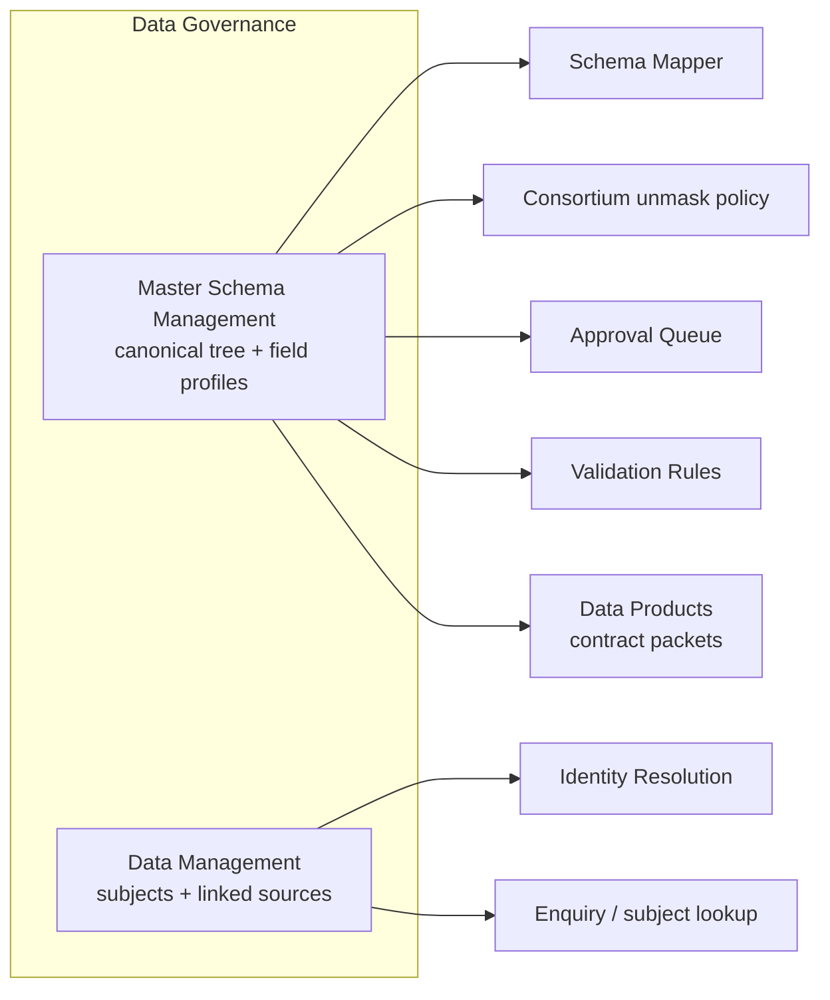
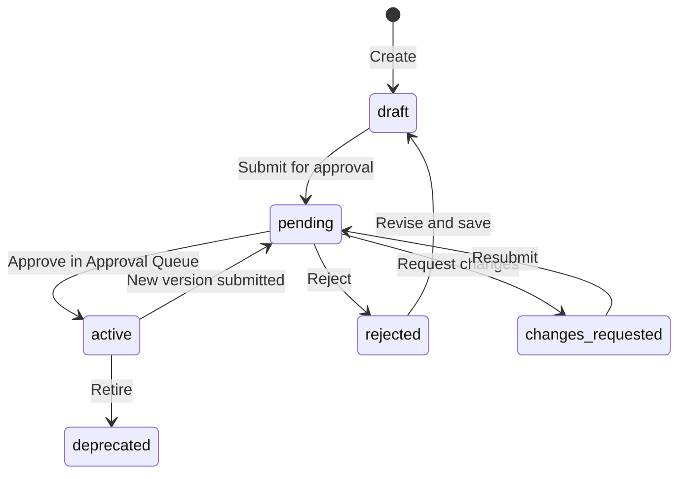

# HCB Admin Portal — Master Data Management UI & Features

**Audience:** Product, UX, QA, and engineering  
**Scope:** The Master Data Management (MDM) surfaces in the HCB Admin Portal as implemented today  
**Related epics:** [EPIC-06 Data Governance](./User%20stories/EPIC-06-Data-Governance.md), [EPIC-05 Schema Mapper Agent](./User%20stories/EPIC-05-Schema-Mapper-Agent.md), [EPIC-08 Approval Queue](./User%20stories/EPIC-08-Approval-Queue-Workflow.md), [EPIC-03 Consortium Management](./User%20stories/EPIC-03-Consortium-Management.md)  
**Primary code:** `src/pages/data-governance/master-schema/*`, `src/pages/data-governance/data-management/*`

---

## 1. What MDM is in this product

Master Data Management in the HCB Admin Portal is the governed definition of **what a credit subject is** and **how its data is structured**. Operators do not maintain a single spreadsheet of golden records. They maintain two complementary workspaces under **Data Governance**:

| Workspace | Nav label | What it governs | Analogy |
|---|---|---|---|
| **Canonical model** | Master Schema Management | The tree-shaped dictionary of source types, packets, fields, validations, PII flags, and mappings | The bureau’s data dictionary and schema steward desk |
| **Subject records** | Data Management | Individual / company subjects and the data sources linked to them | The operational golden-record desk for a single subject |

Together they answer: *what fields exist, how they are validated and masked, which sources populate them, and which subject they belong to.*

Downstream modules consume this model rather than inventing their own:

- **Schema Mapper Agent** maps member payloads onto master paths.
- **Data Products** compose enquiry contracts from a canonical attribute dictionary (seeded separately for the configurator UI; see §8).
- **Consortium data policy** builds unmask allow-lists from active master schemas.
- **Approval Queue** reviews master-schema submissions as type `schema_master`.
- **Validation Rules** and ingestion pipelines constrain incoming data against canonical fields.



---

## 2. Navigation, routes, and modes

**Sidebar:** Data Governance →

| Item | Path | Purpose |
|---|---|---|
| Master Schema Management | `/data-governance/master-schema` | Registry of enterprise master schemas |
| Data Management | `/data-governance/data-management` | Subject search and source linking |

Master Schema Management has three editor modes on one page (`MasterModelEditorPage`):

| Mode | Route | Heading | Persistence |
|---|---|---|---|
| Create | `/data-governance/master-schema/new` | Create Master Data Model | **Create** writes a new schema, then opens view |
| View | `/data-governance/master-schema/:id` | Schema name | Read-only tree and tabs; **Edit** and **Submit for approval** |
| Edit | `/data-governance/master-schema/:id/edit` | Schema name | **Save** writes a new immutable version, then returns to view |

Breadcrumb: `Data Governance` → `Master Schema Management` → `Create schema` | schema name | `Edit: {name}`.

---

## 3. Master Schema Management — registry

**Page:** `MasterSchemaRegistryPage`  
**Purpose:** Central list of enterprise master schemas across source types.

### 3.1 Header and primary action

- Title: **Master Schema Management**
- Subtitle: *Central registry for enterprise master schemas across source types*
- Primary button: **Create New Schema** → `/data-governance/master-schema/new`

### 3.2 KPI cards

| KPI | Meaning |
|---|---|
| Total Schemas | Count matching the current search/status filter (paged total) |
| Active Schemas | Status `active` |
| Pending Approval | Status `pending` |

### 3.3 Filters

- Search: *Search schema name…* (resets to page 1)
- Status select: All statuses, Draft, Pending, Active, Deprecated, Rejected, Changes Requested
- Page size: 10 rows; pagination when `totalPages > 1`

### 3.4 Table

| Column | Content |
|---|---|
| Source Type Name | Display name + muted `ID: {id}` |
| Version | e.g. `v1.0` |
| Number of Fields | Leaf-field count (derived from the tree when a tree exists) |
| Status | Colour badge — see §5 |
| Last Updated | `en-IN` date (`dd MMM yyyy`); hidden below `md` |
| Actions | **View** (detail) · **Edit** (editor) |

Empty state: *No schemas match the current filters.*  
Loading: skeleton KPI cards + skeleton table. API failure: retryable error card. The list can run without the backend (mock fallback from `src/data/master-schemas.json`).

---

## 4. Master Data Model editor

This is the MDM authoring surface. One page powers create, view, and edit.

### 4.1 Page chrome

**Left:** back arrow to the registry, title, and (when not creating) `ID: {schemaId}`.

**Right actions:**

| Action | When shown | Behaviour |
|---|---|---|
| **Create** / **Save** | Create and edit | Disabled while blocking validation errors exist, or while the mutation is pending |
| **Edit** | View only | Navigates to `/:id/edit` |
| **Submit for approval** | View and edit (existing schema) | Disabled while already `pending`. Enqueues an Approval Queue item of type `schema_master` and sets status to `pending` |

A **workflow banner** maps schema status to Draft / Under Review / Approved / Rolled Back (see §5).

If the tree has blocking errors, a destructive alert lists up to six issues (`{path} — {message}`) plus a remainder count. Save stays blocked until they are gone.

### 4.2 Tabs

| Tab | Role |
|---|---|
| **Tree** (default) | Two-pane tree + node profile editor |
| **Overview** | Schema metadata and governance summary |
| **JSON View** | Live JSON of `{ name, sourceType, description, tree }` |
| **Version History** | Immutable versions with diffs summarized as text |
| **Impact Analysis** | Linked APIs, products, institutions |
| **Approvals** | Timeline derived from version history |

### 4.3 Tree tab layout

**Desktop (`lg+`):** resizable split.

```
┌──────────────────────────┬─────────────────────────────────────────────┐
│ TREE                     │ NODE CONFIG                                 │
│ Add root  + Object/Array │ Field profile  OR  Container — OBJECT/ARRAY │
│ / Field                  │                                             │
│                          │ PK / SK / names / data type / paths         │
│  ▾ BasicInformation  OBJ │ Intelligence, validations, transforms       │
│     CompanyName  STRING  │                                             │
│     PAN  STRING          │ [Save profile]                              │
│  ▾ Accounts  ARRAY       │                                             │
│     [*]  OBJECT          │                                             │
└──────────────────────────┴─────────────────────────────────────────────┘
```

**Below `lg`:** tree stacked above the profile panel.

Empty tree: dashed card *No nodes yet* with **+ Object / + Array / + Field**.

Selecting nothing in the right pane: *Select a node from the tree to view or edit its profile.*

### 4.4 Tree interactions (`EditableSchemaTreeView`)

Each row shows a type icon, name, and data-type badge.

| Node type | Icon colour | Meaning |
|---|---|---|
| OBJECT | Folder (info) | Nested record / section |
| ARRAY | List (warning) | Repeating collection; only child must be `[*]` |
| FIELD | Braces or hash | Scalar leaf (STRING, NUMBER, BOOLEAN, DATE) |

**Add root:** dropdown — Object, Array, Field.

**Hover actions on a node:**

- **+** on OBJECT: add Field, Object, or Array
- ARRAY: add-child is disabled; copy says *ARRAY children are managed via [*]*
- Pencil: inline rename (Enter commits, Escape / blur cancel). The `[*]` item marker cannot be renamed.
- Trash: confirm dialog. Containers warn that descendants and attached field profiles are removed.

Clicking a row selects it and toggles expand when it has children. Selection highlights with a primary ring.

Rename rewrites `destinationMapping` and all descendant paths, and rewrites FieldPath / SourcePath / TargetPath / cross-field paths on attached profiles so the tree stays consistent.

**Array rule:** creating an ARRAY auto-inserts a locked `[*]` OBJECT child whose path is `{arrayPath}[*]`. Operators add fields under `[*]`, not beside it.

### 4.5 Field profile editor (FIELD nodes)

The right pane is a form. **Save profile** writes the node in memory; the page-level **Create / Save** persists the whole tree.

#### Field profile (identity and mapping)

| Control | Required | Notes |
|---|---|---|
| PK | | Partition key, monospace |
| SK | | Sort key, default `FIELD#{name}` |
| Field name | Yes | Becomes the node name on save |
| Display name | Yes | Human label |
| Section | Yes | Logical grouping (e.g. `BasicInformation`) |
| Data type | Yes | STRING · NUMBER · BOOLEAN · DATE · OBJECT · ARRAY |
| Field path | Yes | Dot path; **path picker** (leaves only) |
| Source format | | File-format axis: JSON, XML, CSV, YAML, NDJSON, TSV, TXT, PARQUET, AVRO, ORC, XLSX, XLS, PDF, PROTOBUF, MSGPACK |
| Source path | Yes | Path picker |
| Target path | Yes | Path picker (canonical destination) |

The node code badge (e.g. `BASICINFORMATION_COMPANYNAME`) sits in the card header.

**Path picker** (`TreePathPickerDialog`): searchable union of the canonical master-record tree (`src/data/master-record-model.json`) plus every registered master-schema tree. Fuzzy match on key and full path. Operators can paste a known path. Leaf-only mode is used for Field path.

#### Field intelligence

| Control | Purpose |
|---|---|
| **IsPII** | Marks the field as personal data. Flattened legacy consumers treat PII as `masking: partial`. |
| Description | Steward definition shown during mapping and review |
| Similar fields | Chip list of aliases (e.g. `LegalName`, `RegisteredName`) used as mapping hints |

#### Validation rules

Add/remove rows:

| Column | Values |
|---|---|
| Rule | NOT_EMPTY · MAX_LENGTH · MIN_LENGTH · REGEX · UNIQUE |
| Severity | Error · Warning · Info |
| Value | Required for MAX_LENGTH / MIN_LENGTH |
| Pattern | Required for REGEX |
| Message | Operator-facing text |

A rule with `NOT_EMPTY` + severity Error is how the model derives **required** for legacy `fields[]`.

#### Business validations (multi-select)

- MANDATORY_CHECK
- FORMAT_CHECK
- DOMAIN_CHECK
- RANGE_CHECK

#### Business transformations (multi-select)

- ALL_CAPS
- ALL_LOWERCASE
- TRIM
- REPLACE
- CONCATENATE

#### Cross-field validations

Each row: **Field path** (catalog picker) + **Rule** + **Severity**.

| Rule | Meaning |
|---|---|
| EQUALS / NOT_EQUALS | Value comparison |
| GREATER_THAN / LESS_THAN / GREATER_OR_EQUAL / LESS_OR_EQUAL | Ordered comparison |
| REQUIRED_IF / FORBIDDEN_IF | Conditional presence |
| SAME_AS / DIFFERENT_FROM | Identity vs another path |

#### Value mode

| Mode | Controls |
|---|---|
| DEFAULT | Optional default value |
| ENUM | Possible values chip list (required when ENUM is selected) |

### 4.6 Container editor (OBJECT / ARRAY)

| Control | Notes |
|---|---|
| Name | Disabled for `[*]` |
| Code | Monospace identifier |
| Node type | OBJECT or ARRAY (`[*]` locked) |
| Data type | OBJECT must stay OBJECT |
| Source mapping / Destination mapping | Path strings |

Copy: *Configure the container metadata. Children are managed in the tree.*  
For `[*]`: *Array item marker (locked). Edit children below.*

### 4.7 Overview tab

**Schema metadata** (left):

| Field | Create | Edit | View |
|---|---|---|---|
| Schema name | Editable | Editable | Disabled |
| Source type | Telecom · Utility · Bank · GST · Custom | Locked after create | Locked |
| Version | — | Read-only | Read-only |
| Description | Editable | Editable | Disabled |

**Governance summary** (right):

- **Nodes** — count of FIELD leaves
- **Versions** — number of stored versions
- Helper text: *Save creates a new immutable version. Submit for approval routes the change to the existing Approval Queue.*

### 4.8 JSON View

Pretty-printed snapshot of the in-memory model (name, source type, description, tree). Useful for stewards who want to inspect or copy the canonical tree without leaving the page.

### 4.9 Version History

Table: Version · Status · Created at · Created by · Change summary.

Save in mock/API mode increments the version (`v1.0` → `v1.1` …) and stores a field-level diff (added / removed / modified). Empty: *No prior versions.*

### 4.10 Impact Analysis

Three cards: **apis**, **products**, **institutions**. Each lists linked names, or *No linked {bucket}.* This is the blast-radius view before a steward submits a schema change.

### 4.11 Approvals tab

Timeline of synthetic events from version history (submit / approve / reject), attributed as role **Schema Steward**. Empty: *No approval events recorded.*

---

## 5. Schema lifecycle and statuses



| Schema status | Badge | Workflow banner |
|---|---|---|
| `draft` | Muted | Draft |
| `pending` | Warning | Under Review |
| `changes_requested` | Info | Under Review |
| `active` | Success | Approved |
| `rejected` | Destructive | Rolled Back |
| `deprecated` | Muted, reduced opacity | Draft |

**Approval Queue** (`/approval-queue`, tab **Master Schemas**): items of type `schema_master`. Detail panel includes **Open in Master Schema Management**, deep-linking to `/data-governance/master-schema/{schemaId}`.

Submit payload metadata includes `schemaId`, `version`, field `diff`, and a schema snapshot.

---

## 6. Structural and save-time validation

`validateTree()` walks the whole tree. **Error** severity blocks Create/Save. **Warning / Info** do not.

| Rule | Severity | Effect |
|---|---|---|
| Duplicate node id | Error | Blocks save |
| Duplicate sibling name (case-insensitive; `[*]` exempt) | Error | Blocks save |
| FIELD has children | Error | Blocks save |
| FIELD missing `fieldProfile` | Warning | Save allowed; steward should complete the profile |
| Field profile fails Zod (required paths, ENUM values, rule parameters) | Error | Blocks save |
| OBJECT `dataType` is not OBJECT | Error | Blocks save |
| ARRAY does not have exactly one child named `[*]` | Error | Blocks save |

When a master-path catalog is loaded, FieldPath / SourcePath / TargetPath / cross-field paths can be checked against known paths. During early edit the catalog may be empty; path checks are then skipped.

---

## 7. Data Management — subject workspace

**Page:** `/data-governance/data-management`  
**Purpose:** Look up a subject, maintain identity attributes, link/unlink data sources, and review a per-subject audit trail.

This is record-level MDM, not schema authoring. Search and detail are stacked vertically. The result list appears only after the operator clicks **Search**.

### 7.1 Access

Mutating roles: **Super Admin**, **Bureau Admin**, **Data Admin**, **Compliance Officer**.

Everyone else sees a warning banner and disabled Create / Edit / Link / Unlink / Delete controls.

### 7.2 Header

- Title: **Data Management**
- Subtitle: *Search a subject and manage their linked data sources, with audit-traced edits and link/unlink controls.*
- **New subject** (mutating roles)

### 7.3 Subject search

- Input: *Enter Subject ID*
- IDs must be 4–32 alphanumerics or a UUID
- Enter or **Search**
- Invalid format: inline error, Search disabled
- Not found: *No subject found for {id}* plus **Create new subject** (if permitted)

Each result row: name, status badge, email, linked-source count, last-updated date. Selecting a row opens the detail card.

### 7.4 Create subject

Required identity fields (starred in the form):

| Field | Notes |
|---|---|
| First name / Last name | Required |
| Date of birth | ISO `yyyy-MM-dd` |
| Gov ID type | PAN · Aadhaar · SSN · Passport · UUID · Custom |
| Gov ID number | Required |
| Email / Phone | Required |
| Address | Free-form |
| Status | ACTIVE · INACTIVE · PENDING |

Submit opens **Comment required** — every mutation needs a reason. On success the new subject is selected.

### 7.5 Subject detail

Header: full name, status badge, `{govIdType}: {govIdNumber}`, optimistic-lock version `vN`, **Delete**.

Tabs:

| Tab | Contents |
|---|---|
| **Subject info** | Read-only attributes or inline edit form. **Edit** / **Cancel edit**. Save again requires a change comment. Optimistic locking: PATCH with `expectedVersion`; mismatch is 409. |
| **Linked sources** | Filterable table + **Link** |
| **Audit history** | Timeline of CREATE / UPDATE / DELETE / LINK / UNLINK |

### 7.6 Linked sources

Source types: BankAccount · Government · Telecom · Financial · KYC · CRM.

Filters (persisted in `localStorage` key `hcb_dm_source_filters_v1`):

- Text search across name, provider, source id, type
- Type dropdown
- Sort: lastUpdated · name · type, asc/desc

Row actions: **View** (attribute drawer with sample HCB attributes; some fields marked editable in the demo) and **Unlink** (comment required).

**Link data sources** dialog: search available sources, multi-select checkboxes, mandatory comment, *Pick at least one source to link*.

### 7.7 Audit history

Newest first. Each entry: action badge, optional related source id, timestamp, actor, mandatory comment, and for UPDATE a field-level old → new list.

---

## 8. How MDM is consumed elsewhere

### 8.1 Schema Mapper Agent

`/data-governance/auto-mapping-review`

- Target of mapping is the HCB master schema / master path catalog.
- Wizard steps (when datasource onboarding is on, default): Datasource Details → Profile Generation → Profile Review. The same tree and `NodeProfileEditor` appear in Profile Review.
- **Create new canonical field** in LLM field intelligence, and **MasterFieldDrawer**, let a mapper propose an extension (name, data type, PII/risk class, nullable, required, derived, enum mappings). New fields still require governance approval.
- Feature flag `VITE_USE_DATASOURCE_ONBOARDING_FLOW=false` rolls back to the legacy 4-step wizard.

### 8.2 Consortium data policy

In the consortium wizard, operators pick a consortium-level **Unmask policy** (Full vs Partial). A table of **active** master schemas (source types) shows version, field count, and masked-field count. **Configure** opens a drawer of masked fields from that schema so Partial unmask can allow-list PAN / Phone / Email / Name templates per source type.

### 8.3 Data Products (attribute dictionary)

The Product Configurator contract UI currently reads a **demo attribute dictionary** (`src/data/attribute-dictionary.ts`, `DICTIONARY_VERSION = v12`). That file is explicitly *not* the dictionary-maintenance surface. Product authoring rules that the MDM model must eventually express:

- Packet = asset type (Bank account, Credit facility, Telco, GST, …)
- Events nest inside the parent packet
- Subject-as-reported is always included (per-provider array, not a merged golden profile)
- Sensitivity badges: Standard · PII · Sensitive-PII · special category
- Product sensitivity is derived from selected attributes
- Dictionary version binds to the product version (*Dictionary v12*)

See [HCB Product Configurator UI Change Prompt](./HCB_Product_Configurator_UI_Change_Prompt.md) for the contract-side screens.

### 8.4 Validation Rules and ingestion

Validation rules are defined against canonical fields. Batch and Data Submission API mapping stages resolve member fields to those canonical paths before quality checks run.

---

## 9. Canonical data shapes (steward vocabulary)

### 9.1 Master schema (registry record)

| Property | Meaning |
|---|---|
| `id` | Stable identifier |
| `name` | Display name (source-type oriented) |
| `sourceType` | Domain axis: `telecom` · `utility` · `bank` · `gst` · `custom` |
| `version` | Immutable version string |
| `status` | Lifecycle (§5) |
| `tree` | Canonical nested model (`TreePathNode[]`) |
| `fields` | Flattened leaves for legacy consumers |
| `rawJson` | JSON Schema-ish snapshot for the JSON tab / mock derivation |
| `versions` | History with per-field diffs |
| `impact` | Linked APIs, products, institutions |

When `tree` is present, `fields[]` and `fieldCount` are **derived from leaves**. PII on a leaf becomes `masking: partial`; `NOT_EMPTY` + Error becomes `required: true`.

Legacy schemas that only have `fields[]` are lifted into a flat FIELD tree so the editor still works.

### 9.2 Tree node

| Property | Meaning |
|---|---|
| `nodeType` | FIELD · OBJECT · ARRAY |
| `dataType` | STRING · NUMBER · BOOLEAN · DATE · OBJECT · ARRAY |
| `fullPath` / `destinationMapping` | Dot path, e.g. `BasicInformation.CompanyName` |
| `profile` | Steward metadata on FIELD nodes |

Example from the seeded master record model:

```
BasicInformation                    OBJECT
  CompanyName                       STRING   (display: Company Name)
  PAN                               STRING   PII, REGEX ^[A-Z]{5}[0-9]{4}[A-Z]$
  Email                             STRING   PII
Accounts                            ARRAY
  [*]                               OBJECT
    AccountNumber                   STRING
```

### 9.3 Subject (Data Management)

| Property | Meaning |
|---|---|
| `subjectId` | System UUID, read-only |
| Identity | Name, DOB, gov ID, email, phone, address |
| `status` | ACTIVE · INACTIVE · PENDING |
| `version` | Optimistic lock |
| Linked `DataSource` | `sourceId`, name, type, provider, details, status |

---

## 10. Operator journeys

### 10.1 Create and publish a master schema

1. Data Governance → Master Schema Management → **Create New Schema**.
2. Overview: name, source type, description.
3. Tree: **Add root** Object (e.g. `BasicInformation`), add Fields, complete each field profile (paths, PII, validations).
4. Resolve the red validation alert until **Create** enables.
5. Create lands on the view page at `v1.0` / Draft.
6. **Submit for approval**. Banner becomes Under Review; Approval Queue → Master Schemas shows the item.
7. Approver opens the schema, reviews Tree / Impact / Versions, approves.
8. Status becomes Active. Schema Mapper and consortium policy can consume it.

### 10.2 Change an active schema

1. Registry → **Edit**.
2. Rename, add, or delete nodes; save is blocked if the tree is invalid.
3. Save writes a new version and returns to view.
4. Submit for approval again. Impact Analysis shows products and APIs that will feel the change.

### 10.3 Look up and repair a subject

1. Data Management → enter Subject ID → Search.
2. Open the subject. Subject info for identity; Linked sources for Bank / KYC / Telecom rows.
3. **Link** missing sources or **Unlink** stale ones — both require a comment.
4. Audit history confirms who changed what and why.

---

## 11. Empty, error, and edge states

| Surface | State | UI |
|---|---|---|
| Registry | No rows | *No schemas match the current filters.* |
| Registry | Loading | Skeleton KPIs and table |
| Registry | API error | Retry card |
| Editor create | Empty tree | Dashed empty + Add Object/Array/Field |
| Editor | Blocking validation | Alert; Save disabled |
| Editor | No node selected | *Select a node from the tree…* |
| Editor | Missing field profile | Warning only |
| Data Management | Before search | *Search for a subject* empty state |
| Data Management | After search, no pick | *Select a subject* |
| Data Management | ID not found | Create-new CTA |
| Data Management | Subject deleted elsewhere | *Subject not found* |
| Data Management | Read-only role | Warning banner; mutations disabled |
| Versions / Approvals / Impact | Empty | Explicit “no prior / no linked / no events” copy |

---

## 12. Implementation notes (current build)

| Topic | Fact |
|---|---|
| Master Schema API | SPA calls `/v1/master-schemas`. Spring OpenAPI does not yet expose these paths. The UI is **mock-first**: 401/403/network errors hydrate from `src/data/master-schemas.json` when client mock fallback is on. |
| Large schemas | In mock mode the Fields inventory can be derived from `rawJson.definitions.*.properties` so Telco-scale schemas show a full set even if seed `fields[]` is short. |
| Data Management API | Mock store from `src/data/data-management.json`, persisted in `localStorage`. Intended contract: `/v1/data-management/*`. |
| Feature flag | `VITE_USE_DATASOURCE_ONBOARDING_FLOW` (default on) gates the tree-based Master Data Model editor and the 3-step datasource wizard. |
| Product dictionary | Configurator uses `attribute-dictionary.ts` (v12 demo). It is **not** yet the Master Schema Management persistence layer. |
| E2E | `e2e/datasource-onboarding.spec.ts` asserts the registry heading and that `/master-schema/new` shows **Create Master Data Model** with Tree / JSON View / Approvals tabs. |

---

## 13. Screen inventory (for design / QA)

| # | Screen | Route | Key components |
|---|---|---|---|
| 1 | Master schema registry | `/data-governance/master-schema` | KPIs, search, status filter, table, pagination |
| 2 | Create Master Data Model | `/data-governance/master-schema/new` | Tree + profile, Overview, JSON |
| 3 | View Master Data Model | `/data-governance/master-schema/:id` | All tabs, workflow banner, Edit, Submit |
| 4 | Edit Master Data Model | `/data-governance/master-schema/:id/edit` | Same as create, Save |
| 5 | Path picker dialog | Overlay | Catalog tree search + paste path |
| 6 | Delete node confirm | Overlay | Descendant warning |
| 7 | Approval Queue — Master Schemas | `/approval-queue` | Type `schema_master`, deep link |
| 8 | Data Management | `/data-governance/data-management` | Search, create, detail tabs |
| 9 | Change comment dialog | Overlay | Mandatory reason on every mutation |
| 10 | Link sources dialog | Overlay | Multi-select + comment |
| 11 | View source drawer | Overlay | Per-source attributes |
| 12 | Schema Mapper — new master field | Overlay | `MasterFieldDrawer` |
| 13 | Consortium unmask configure | Drawer | Active master schema fields |

---

## 14. Related documents

| Document | Why |
|---|---|
| [EPIC-06 Data Governance](./User%20stories/EPIC-06-Data-Governance.md) | User stories, including canonical field registry (GOV-US-005) |
| [EPIC-05 Schema Mapper Agent](./User%20stories/EPIC-05-Schema-Mapper-Agent.md) | Mapping onto the master schema |
| [HCB Product Configurator UI Change Prompt](./HCB_Product_Configurator_UI_Change_Prompt.md) | How products consume the canonical dictionary |
| [Developer Handbook](./technical/Developer-Handbook.md) | Mock-fallback behaviour for Master Schema pages |
| [Code–Docs Alignment Audit](./technical/Code-Docs-Alignment-Audit-2026-04-15.md) | Backend gap: master-schemas API not in OpenAPI/Spring |
