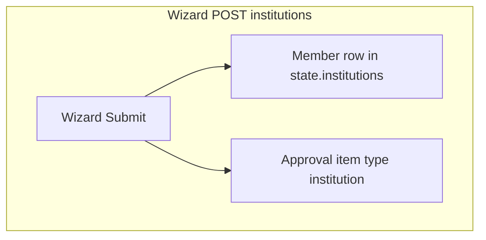
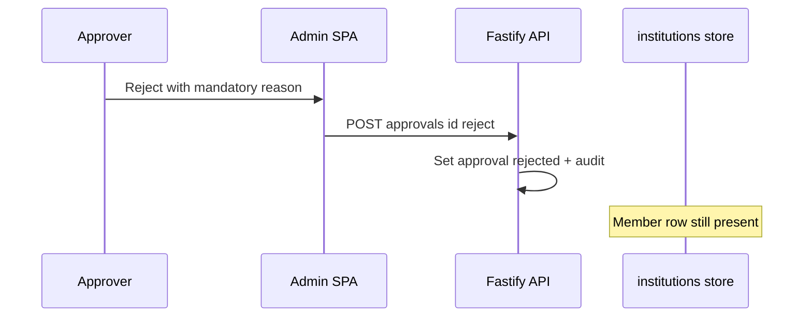
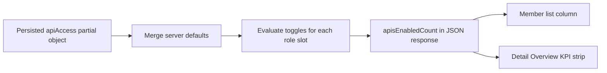
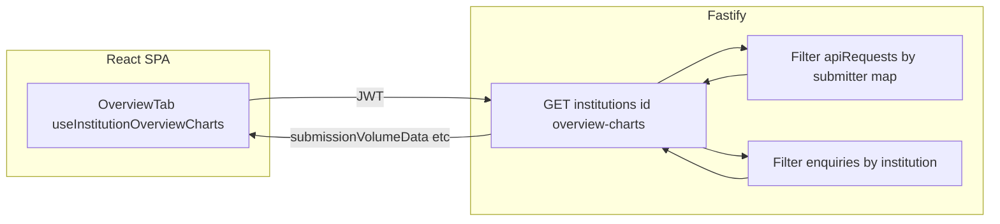
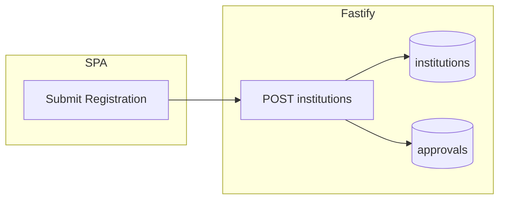
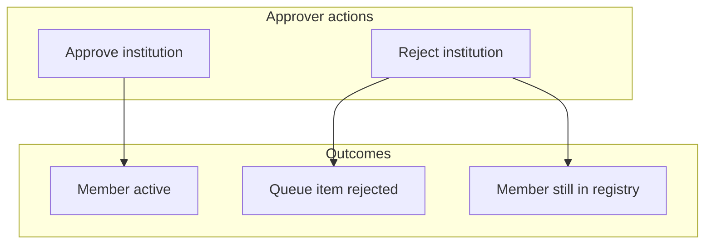

# Hybrid Credit Bureau (HCB) Admin Portal
## Complete Product Requirement Document (PRD) & Business Requirement Document (BRD)

**Document Version:** 2.16
**Date:** 2026-04-02
**Status:** Updated — **v2.16:** **Auto registration number** — Register wizard **Registration Number** is **read-only**; **`POST /api/v1/institutions`** may omit **`registrationNumber`**; **Spring** assigns **`{TypePrefix}-{NameSlug3}-{UTC-year}-{id}`** when blank (non-blank override allowed). **`InstitutionRegistrationNumberGenerator`**; integration tests. Docs: **EPIC-02**, **Register-Member-Form-Metadata-Source**, **API-UI-Parity-Matrix**, **Testing-Plan**, **AGENTS.md**. **v2.15:** **Register member navigation** — **Register member** (`/institutions/register`) is reached from **Member Management** sidebar sub-nav (with Member Institutions and Consortiums); removed duplicate primary CTA from the Member Institutions list header. **`nav-config`** / RBAC catalogue include the path; **Roles & Permissions** matrix stays **section-scoped** (`members`). **v2.14:** **Spring list API contract** — JDBC-backed **GET** routes for **consortiums**, **products**, **reports**, **SLA configs**, **alert rules**, **users**, and **audit logs** aligned to **`create_tables.sql`**; **`AuthUserPrincipal`** on controllers; flat audit/user JSON for the SPA. **TDL-018**; **API-UI-Parity-Matrix** v1.7; **SPA-Service-Contract-Drift**; **Canonical-Backend**; **Testing-Plan** v3.0.6; **`RouteParitySqliteIntegrationTest`** extended. **v2.13:** **Institution display labels** (legal before trading); **API-UI-Parity-Matrix** v1.6, **TDL-017**. **v2.12:** **Spring–SPA route parity** — overview charts, drift alerts, member sub-resources, **API keys POST**, **user deactivate**; **TDL-016**. **v2.11:** **Developer Handbook** / **README** Spring-first; dashboard SQLite JDBC. **v2.10:** Schema Mapper **PII** on mappings. Earlier: v2.9–v2.5 as below.
**Classification:** Internal – Confidential

> **Change Summary v2.16 (2026-04-02) — Registration number system-assigned:** **Member registration** wizard Step 1 shows **Registration Number** as **non-editable** (`readOnly` in **`institution-register-form.json`** SPA + Spring classpath; **`InstitutionRegisterFormService`** passes **`readOnly`** / **`description`**). **SPA** omits empty **`registrationNumber`** from create body. **Spring** **`InstitutionController.create`**: placeholder **`AUTO-{uuid}`** first insert, then final **`PREFIX-Slug3-YYYY-id`** from **`InstitutionRegistrationNumberGenerator`** before approval enqueue. **`InstitutionRegistrationNumberSqliteIntegrationTest`**, **`InstitutionRegistrationNumberGeneratorTest`**. See [Register-Member-Form-Metadata-Source.md](./technical/Register-Member-Form-Metadata-Source.md), [API-UI-Parity-Matrix.md](./technical/API-UI-Parity-Matrix.md).
>
> **Change Summary v2.15 (2026-04-02) — Register member in sidebar:** **Register member** opens from **AppSidebar** under **Member Management** (sub-item **`/institutions/register`**). The **Member Institutions** page (`/institutions`) retains search, filters, **Export CSV**, and row actions only—no **Register member** button in the header. **`src/lib/nav-config.ts`** lists **Register member** under the **Member Management** section items for sidebar and documentation parity; **`RolesPermissionsPage`** still grants **View / Create / Edit / Delete / Export** per **navigation section** (`members`), not per sub-route. **Command Palette** still offers **Register Institution** → **`/institutions/register`**.
>
> **Change Summary v2.14 (2026-03-31) — Spring JDBC list APIs + auth principal:** High-traffic **GET** endpoints on Spring use **JdbcTemplate** SQL matching **`backend/src/main/resources/db/create_tables.sql`** (avoids **`500` / `ERR_INTERNAL`** from invalid columns). **`GET /api/v1/users`** returns maps with **`roles[]`** from role assignments; **`GET /api/v1/audit-logs`** returns flat **`userId`/`userEmail`** and honours **`entityType`** (and related filters). **`@AuthenticationPrincipal AuthUserPrincipal`** replaces JPA **`User`** on controllers; **`AuditService`** accepts principals for audit rows. **`SecurityConfig`:** **`VIEWER`** cannot call **`/api/v1/audit-logs/**`**. Integration test **`coreSchemaAlignedGetRoutesOk`** uses **`@WithMockUser(roles = "ANALYST")`**. Docs: [Technical-Decision-Log.md](./technical/Technical-Decision-Log.md) TDL-018, [SPA-Service-Contract-Drift.md](./technical/SPA-Service-Contract-Drift.md), [Canonical-Backend.md](./technical/Canonical-Backend.md), [Testing-Plan.md](./technical/Testing-Plan.md).
>
> **Change Summary v2.13 (2026-03-31) — Institution labels (legal name first):** Member pickers (**`InstitutionFilterSelect`**), monitoring tables that resolve institution ids, schema-mapper Step 1 **source name**, dashboard command-center **`member`** / **`memberQualitySubmitters`**, and related API-backed strings use **legal `name`** before optional **`tradingName`** (`src/lib/institutions-display.ts` **`institutionDisplayLabel`**). Spring **`DashboardController`** uses `COALESCE(NULLIF(TRIM(i.name), ''), i.trading_name)` for JDBC label columns. Legacy Fastify **`POST /institutions`** stores **`tradingName`** only when supplied (no copy from legal). Docs: [API-UI-Parity-Matrix.md](./technical/API-UI-Parity-Matrix.md) § *Institution display labels*, [Technical-Decision-Log.md](./technical/Technical-Decision-Log.md) TDL-017.
>
> **Change Summary v2.11 (2026-03-31) — Documentation: Spring-first dev + dashboard SQLite:** **`docs/technical/Developer-Handbook.md` v2.0** — runbook for **Spring on 8090**, **`npm run spring:start`**, **`npm run spring:test`**, seeded accounts, curl examples, troubleshooting; **Fastify 8091** documented as legacy. **Spring** **`GET /api/v1/dashboard/command-center`** — JDBC SQL safe for SQLite (dynamic **`AND`** concatenation; no **`AS member`** alias). **`DashboardCommandCenterSqliteIntegrationTest`** in **`backend/`**. **Authentication** on Spring uses JDBC **`UserDetails`** for SQLite-compatible login (see [Canonical-Backend.md](./technical/Canonical-Backend.md)). **README** §11 testing aligned. [API-UI-Parity-Matrix.md](./technical/API-UI-Parity-Matrix.md) appendix footnote: Spring authoritative for default SPA.
>
> **Change Summary v2.10 (2026-03-31) — Schema Mapper PII on field mappings:** **LLM Field Intelligence** (`LLMFieldIntelligenceStep`) **PII** column uses a **Yes/No** select per row (replacing read-only text). **`llmRowsToFieldMappings`** / **`fieldMappingsToLlmRows`** (`src/lib/schema-mapper-api.ts`) map UI **`pii`** ↔ API **`containsPii`**. Fastify stores the flag on each **`fieldMappings`** entry; mapping jobs initialise **`containsPii: false`**; optional LLM merge **preserves** the heuristic row’s flag. See [Canonical-Backend.md](./technical/Canonical-Backend.md), [API-UI-Parity-Matrix.md](./technical/API-UI-Parity-Matrix.md).
>
> **Change Summary v2.9 (2026-03-31) — Schema Mapper Step 1 operator copy:** **Source Ingestion** (`SourceIngestionStep`) and **Source Definition** (`SourceDefinitionStep`) **removed** the inline microcopy that quoted **`GET /api/v1/schema-mapper/wizard-metadata`** under **Source Type**. **Source Type** and **Data Category** dropdowns **unchanged** functionally — still populated via **`useSchemaMapperWizardMetadata`** / **`fetchWizardMetadata`** with **`wizardMetadataFromSeed`** when the API is unavailable. Loading placeholder on the **Source Type** trigger and **error** copy when metadata fetch fails remain.
>
> **Change Summary v2.8 (2026-03-31) — Data Products packet row + modal; Register review typography:** **Product form — Data packets:** one **Configure** button per **source-type** row (badge = total selected raw+derived field count for all packets in that row). No secondary **packet title** lines under the row label. **`PacketConfigModal`** (`src/components/data-products/PacketConfigModal.tsx`) takes **`packetIds[]`** (catalogue order) and **`catalogOptions`** from the resolved **`packet-catalog`** response (or seed); when **length > 1**, a **Packet** switcher uses catalogue **labels**; **Save configuration** updates **`packetConfigs`** for **every** id in the group. **Derived** names come from each option’s **`derivedFields`**. **Register member — Step 3 Review** (`RegisterInstitution.tsx` **`Step3Review`**): value lines use **`text-body`** without losing the token to **`tailwind-merge`** (dynamic colours applied via template literal **`className`**, not **`cn("text-body", …)`**). See [Canonical-Backend.md](./technical/Canonical-Backend.md), [API-UI-Parity-Matrix.md](./technical/API-UI-Parity-Matrix.md).
>
> **Change Summary v2.7 (2026-03-31) — Validation Rules + Schema Mapper field discovery + Data Products configure modal:** On **`/data-governance/validation-rules`**, the **Create Rule** sheet loads **Applicable members** from **`GET /api/v1/institutions?role=dataSubmitter`** (paged list of data-submitting member institutions). **Schema Mapper source types** for the rule use **`GET /api/v1/schema-mapper/schemas/source-types`** when the API is available (fallback: distinct types from registry mock JSON). After the user picks a source type, **expression block field paths** load from **`GET /api/v1/schema-mapper/schemas/source-type-fields?sourceType=`** via **`fetchSourceTypeFields`** / **`useSourceTypeFields`**; client mock fallback uses **`src/lib/schema-mapper-source-fields.ts`** aligned with the server. **Schema Mapper wizard Step 1** (**Source Ingestion** / **Source Definition**) loads **Source Type** and **Data Category** from **`GET /api/v1/schema-mapper/wizard-metadata`** (`fetchWizardMetadata`, **`useSchemaMapperWizardMetadata`**); options are **`wizardSourceTypeOptions`** / **`wizardDataCategoryOptions`** in **`schema-mapper.json`** (mock fallback **`wizardMetadataFromSeed`**). **Data Products (`/data-products/products/create` & `…/edit`):** packet rows show the **source-type label** only (no “Source types:” prefix); **catalogue descriptions** are not shown on the card. **PacketConfigModal:** **Raw data** uses **`useSourceTypeFields`** (same **`source-type-fields`** endpoint) merged with packet-only paths from the catalogue; **Sources** uses **`useSchemaRegistryList`** with **`GET /api/v1/schema-mapper/schemas?sourceType=`**; dialog **title** is **sr-only** (“Configure packet fields”); **Derived** tab lists each packet’s **`derivedFields`** from **`GET /api/v1/products/packet-catalog`** (form passes **`catalogOptions`** into the modal; seed JSON is the same shape). **`useSchemaRegistryList`** supports **`enabled`** / **`allowMockFallback`**; **`fetchSchemaRegistryPage`** accepts optional **`allowMockFallback`**. **Dev seed:** `src/data/schema-mapper.json` defines **reference `parsedFields`** per type: **`telecomParsedFields`**, **`utilityParsedFields`**, **`bankParsedFields`**, **`gstParsedFields`**, **`customParsedFields`** (plus `*FieldStatistics`); Fastify **`createSchemaMapperSlice`** and **`POST …/ingest`** (empty body fields) use the same template map. **Automated tests:** `server/src/api.integration.test.ts` covers **`source-type-fields`** and **`wizard-metadata`**; **`src/lib/schema-mapper-source-fields.test.ts`** and **`schema-mapper-wizard-metadata.test.ts`** cover normalisation helpers. See [Canonical-Backend.md](./technical/Canonical-Backend.md), [API-UI-Parity-Matrix.md](./technical/API-UI-Parity-Matrix.md), [openapi-hcb-fastify-snapshot.yaml](./technical/openapi-hcb-fastify-snapshot.yaml).
>
> **Change Summary v2.6 (2026-03-31) — Data Quality Monitoring drift alerts (API-backed):** **Drift alerts** for `/data-governance/data-quality-monitoring` are served by **`GET /api/v1/data-ingestion/drift-alerts`** (JWT). **Spring** persists rows in **`ingestion_drift_alerts`** (`seed_data.sql`, aligned with **`data-governance.json`**). **Legacy Fastify** uses **`state.ingestionDriftAlerts`**. The **Data Ingestion / Schema Mapper** pipeline may append alerts on ingest and mapping completion (see Spring **`DataIngestionController`** / **`SchemaMapperController`**). Query params **`dateFrom`**, **`dateTo`**, **`sourceType`** mirror the page filters. The SPA uses **`data-ingestion.service.ts`** and **`useDriftAlerts`**; **`VITE_USE_MOCK_FALLBACK=true`** still allows client-side filtering of the JSON mock when the API is unreachable. **Schema Drift** / **Mapping Drift** KPI counts on that page derive from the filtered API response when data is loaded. See [Canonical-Backend.md](./technical/Canonical-Backend.md) (section *Data Ingestion Agent — drift alerts*).
>
> **Change Summary v2.0:** Added Module 10 (Consortium Management), Module 11 (Data Products), Module 12 (Enquiry Simulation), Institution Detail extensions (Consortium Memberships tab, Product Subscriptions tab). Updated routing table, project structure, exception scenarios (with sample data), data models, API specs, and QA test suites. Typography system documented: compact 10px/12px scale with explicit pixel values to prevent browser-default overrides.

> **Change Summary v2.1 (2026-03-27):** Upgraded performance targets to enterprise scale (99.9% uptime, 5M API calls/day, P95 ≤ 200ms latency). Enhanced security section (RBAC/ABAC, JWT best practices, PII encryption, consent enforcement at API level). Added enterprise use cases (multi-country, multi-bureau, alternate data monetization). Added missing feature modules roadmap (CBS Integration, Live Enquiry, Scheduled Reporting, Multi-Bureau Comparison, Consumer Portal, Advanced RBAC, Data Lineage). Aligned mock data architecture to JSON-only layer (no hardcoded values in components). Updated Business Goals with BO-10–BO-13.

> **Change Summary v2.2 (2026-03-27) — Platform feature enhancements:** **Data Products** — catalogue packets carry Schema Mapper `sourceType`; packet configuration separates Raw (schema-aligned) vs Derived placeholder fields; enquiry configuration supports **Latest vs Trended** data coverage. **Schema Mapper** — UI labels aligned to “Source Type” / “Data Category” in wizard and registry contexts. **Dashboard** — Agent Fleet card uses responsive height; Active Batch Pipeline navigates to batch monitoring with queued/processing status query. **Member Management** — navigation and copy use **Member Management** / **Members**; institution overview focuses on retained KPIs and segregated submission (API/batch) and enquiry stats; consortium roles support multi-select; billing export is **month/year CSV-only**; reports scheduling pulls **report types from the Reporting module** catalogue; monitoring tab adds **date range** (default current month). **Data Governance** — mapping trend period control moved page-top; validation chart reframed as **errors by member institution** (data key `institution`); override vs auto-accept trend removed; validation rule creation uses **Schema Mapper source types** and institution list from master data; data quality monitoring adds **date range, submitter institution, source type, and optional comparison** on the trend chart. **Monitoring** — **date range** plus **InstitutionFilter** (submitters vs subscribers) on Data Submission API and Inquiry API layouts; enquiry detail drawer shows active filter context. **User management** — users list and invite flow **remove institution** column/field; **Roles & Permissions** uses a **section × (View, Create, Edit, Delete, Export)** matrix derived from main navigation (`nav-config`). **Shared component** — `InstitutionFilter` / `InstitutionFilterSelect` reused across monitoring and governance.

> **Change Summary v2.3 (2026-03-28) — Documentation depth & mock alignment:**
>
> **A. Data Quality Monitoring (`/data-governance/data-quality-monitoring`)**  
> - **Drift alerts (API):** **`GET /api/v1/data-ingestion/drift-alerts`** returns **`alerts`**. **Spring:** **`ingestion_drift_alerts`** table + **`DataIngestionController`**. **Fastify:** **`state.ingestionDriftAlerts`** (seeded from **`driftAlerts`** in `src/data/data-governance.json`). New rows may be appended by the ingestion/mapping pipeline on each stack.  
> - **Query filters:** `dateFrom`, `dateTo`, `sourceType` — server-side, aligned with the page’s date range and **Source type** control (registry source names for that `sourceType`).  
> - **Registry alignment:** Seed alert `source` strings match **Schema Mapper**-style submitter/source names so filtering by **telecom**, **bank**, etc. remains predictable as the live registry grows.  
> - **Alert fields:** `id`, `type` (`schema` \| `mapping`), `source`, `message`, `timestamp`, `severity` (`low` \| `medium` \| `high`).  
> - **UI recap:** Date pickers; submitter institution; optional compare institution (trend series); source type; KPI strip (**Schema / Mapping drift** counts follow filtered alerts when API data is present); quality trend chart with threshold line; downloadable export control (mock metrics CSV).
>
> **B. Data Products — Product form (`/data-products/products/create`, `/data-products/products/:id/edit`)**  
> - **Category sections:** Packets listed under **category** headings (Bureau / Banking / Consortium per mock).  
> - **Source types line:** Per category, **one** row per **unique** Schema Mapper source type (sorted, human-readable labels from `SOURCE_TYPE_LABELS`); the row label is that **source-type name** only (no “Source types:” prefix).  
> - **Packet row:** Checkbox; **no** catalogue **description** on the card; **no** extra packet-title lines under the source-type label. **One** **Configure** per row opens `PacketConfigModal` for **all** selected packets in that source-type group (**Packet** switcher inside the modal when several catalogue entries share the type). **Raw** paths from **`GET …/schema-mapper/schemas/source-type-fields`** plus packet-only catalogue paths; **Sources** from **`GET …/schema-mapper/schemas?sourceType=`**; **Derived** from each packet’s **`derivedFields`** on **`GET …/products/packet-catalog`** (or static seed). **Save** writes **`packetConfigs`** for each packet in the group.  
> - **Enquiry settings card:** Scope selector (SELF, NETWORK, CONSORTIUM, VERTICAL) with tooltips; **Latest vs Trended** toggle; live **product preview JSON** block reflects selections.  
> - **Reorder:** Removed; **`packetIds`** order follows **catalogue** order.  
> - **Save:** Validates name and ≥1 packet; persists `packetIds`, `packetConfigs`, `enquiryConfig` via API (Fastify) or mock context when fallback applies.
>
> **C. Data Governance Dashboard (`/data-governance/dashboard`) — PRD correction**  
> - Charts match implementation: **Mapping Accuracy Trend** (30/60/90-day toggle at page top); **Validation Errors by Institution** (vertical bar, `institution` key); **Match Confidence Distribution**; **Data Quality Score Trend**; **Rejection Reasons Breakdown** (donut). The **Override vs Auto-Accept** stacked chart is **not** present in the current build (removed per v2.2).
>
> **D. Member Management routing**  
> - Canonical list: **`/institutions`** (“Member Institutions”). **`/institutions/data-submitters`** and **`/institutions/subscribers`** redirect to **`/institutions`**. Sidebar: **Member Management** ▶ Member Institutions, **Register member** (`/institutions/register`), Consortiums.
>
> **E. Data models (Section 15)**  
> - Added **DriftAlert** entity; extended **DataProduct** with optional `packetConfigs` and `enquiryConfig`; noted **ManagedUser** may omit institution in bureau-only mock.
>
> **Change Summary v2.5 (2026-03-29) — Schema Mapper Agent (Fastify + SPA)**  
> **Schema Mapper:** Canonical dev API **`/api/v1/schema-mapper`** (ingest, mapping jobs, PATCH mappings, validation rules CRUD, drift-scan stub, metrics). Async worker applies heuristics + optional OpenAI (`OPENAI_API_KEY`). Submit for approval enqueues **`schema_mapping`** with **`metadata.mappingId`**; approval actions update mapping lifecycle. SPA: **`schema-mapper.service.ts`**, **`useSchemaMapper`**, registry list + wizard wired when **`VITE_USE_MOCK_FALLBACK=false`**; Approval Queue deep link to Schema Mapper when **`mappingId`** present. See [Canonical-Backend.md](./technical/Canonical-Backend.md), [API-UI-Parity-Matrix.md](./technical/API-UI-Parity-Matrix.md).
>
> **Change Summary v2.4 (2026-03-29) — Member registry truth, API enablement, overview analytics, BRD parity**
>
> **F. Member row vs approval queue (governance semantics)**  
> - **POST `/api/v1/institutions`** persists a **member registry row** immediately **and** enqueues **`type: institution`** on the approval queue (`metadata.institutionId`).  
> - **POST `/api/v1/approvals/:id/reject`** updates the **approval** only for institutions — it **does not** soft-delete or remove the member. Removal requires **DELETE `/api/v1/institutions/:id`** or **API restart** (in-memory demo reset).  
> - **PRD §5.2** registration journey updated; **§6.14** Approval Queue extended; **mermaid** diagrams in **§3.2.1** (new subsection under BRD mirror below) and BRD **§3.4**.
>
> **G. APIs enabled column & Overview KPI (`apisEnabledCount`)**  
> - **Derived** on every institution list/detail response from **effective** `api-access` policy (server defaults merged with `PATCH …/api-access`).  
> - **Slots:** +1 if `isDataSubmitter` (Data Submission API toggle), +1 if `isSubscriber` (Enquiry API toggle). UI shows **`enabledCount/slotCount`** (e.g. `2/2`). Replaces legacy fixed **“/3”** copy.  
> - **React Query:** `PATCH api-access` invalidates institution **list** + **detail** + **api-access** queries.
>
> **H. Institution Overview — trend charts (`overview-charts`)**  
> - **GET `/api/v1/institutions/:id/overview-charts`** returns **member-scoped** series for a **rolling 30-day** window: submission metrics filtered like Monitoring Data Submission (`api_key` → `dataSubmitterIdByApiKey`); enquiry metrics filtered like Monitoring enquiries.  
> - **New members** with no key mapping / no traffic: **empty** arrays + **empty-state** messaging on pie charts.  
> - **Spring Boot `backend/`:** route **not** implemented — SPA 404 unless using Fastify or a future parity layer (**SPA-Service-Contract-Drift.md**).
>
> **I. API & Access tab — card model**  
> - **Implemented:** one **Data Submission API** card + one **Enquiry API** card (role-gated). **Legacy PRD/BRD** “Bulk + SFTP” as **separate** cards: **deferred**; tracked as superseded by **FR-API1A** in BRD **§6.14**.
>
> **J. API spec & data model (Sections 14–15)**  
> - Institution examples use **`apisEnabledCount`** and note derivation; **§15.2** Institution table extended.

---

## Table of Contents

1. [Executive Summary](#1-executive-summary)
2. [Business Requirements (BRD)](#2-business-requirements-brd)
3. [Product Requirements (PRD)](#3-product-requirements-prd)
4. [User Personas](#4-user-personas)
5. [User Journey / Workflow](#5-user-journey--workflow)
6. [Screen-Level Product Requirements](#6-screen-level-product-requirements)
7. [Graph / Chart Specifications](#7-graph--chart-specifications)
8. [Data Logic and Calculations](#8-data-logic-and-calculations)
9. [Color Tag Conditions](#9-color-tag-conditions)
10. [Filters and Search](#10-filters-and-search)
11. [Exception Handling / Edge Cases](#11-exception-handling--edge-cases)
12. [Performance Requirements](#12-performance-requirements)
13. [Technical Architecture](#13-technical-architecture)
14. [API Specification](#14-api-specification)
15. [Data Models](#15-data-models)
16. [Security and Access Control](#16-security-and-access-control)
17. [Analytics and Logging](#17-analytics-and-logging)
18. [QA Test Scenarios](#18-qa-test-scenarios)

---

## 1. Executive Summary

### 1.1 Purpose

The Hybrid Credit Bureau (HCB) Admin Portal is a centralized enterprise administration platform for managing a hybrid credit bureau ecosystem. It provides bureau operators, compliance officers, and analysts with a unified interface to manage institutions, govern data quality, monitor API performance, configure AI-powered agents, generate reports, and administer users.

### 1.2 Business Objective

- Establish a single-pane-of-glass for bureau operations management
- Reduce institution onboarding time from weeks to days
- Achieve ≥97% data mapping accuracy through AI-assisted schema governance
- Provide real-time operational visibility with SLA breach detection under 60 seconds
- Enable audit-ready compliance tracking across all platform actions

### 1.3 Key Problems Solved

| Problem | Solution |
|---------|----------|
| Manual institution onboarding with spreadsheets | 3-step registration wizard with validation |
| Inconsistent data formats from multiple submitters | AI-powered schema mapping with governance workflow |
| SLA breaches detected hours after occurrence | Real-time alert engine with auto-remediation |
| Fragmented credit analysis across tools | AI agent workspace with bureau enquiry integration |
| Audit trail gaps for regulatory compliance | Comprehensive governance audit logs with IP tracking |
| No centralized user access management | Role-based user management with MFA support |

### 1.4 Target Users / Personas

| Persona | Role | Primary Use |
|---------|------|-------------|
| Bureau Operator (Super Admin) | Full platform administration | Institution lifecycle, user management, system config |
| Bureau Admin | Institution & governance management | Onboarding, data governance, monitoring |
| Analyst | Read-only analytics & agent usage | Dashboards, AI agents, report generation |
| API User | Programmatic integration | API access, data submission |
| Viewer | Dashboard-only access | Executive overview |

### 1.5 Expected Business Impact

- **40% reduction** in institution onboarding cycle time
- **60% reduction** in manual data mapping effort
- **<5 minute** mean-time-to-detect for SLA breaches
- **100% audit coverage** for regulatory compliance
- **30% improvement** in analyst productivity via AI agents

---

## 2. Business Requirements (BRD)

### 2.1 Business Goals

| ID | Goal | Priority | Success Metric |
|----|------|----------|----------------|
| BG-01 | Manage dual-role institution lifecycle (Data Submitter / Subscriber) | P0 | 100% of institutions registered via portal |
| BG-02 | Centralized configuration for APIs, consent, and billing | P0 | Zero manual configuration outside portal |
| BG-03 | AI-assisted data governance with approval workflows | P0 | ≥97% auto-mapping accuracy |
| BG-04 | Real-time operational monitoring with alerting | P0 | <60s breach detection time |
| BG-05 | Compliance-ready audit logging | P0 | 100% action coverage |
| BG-06 | Role-based user management with MFA | P1 | Zero unauthorized access incidents |
| BG-07 | AI-powered credit analysis agents | P1 | 30% analyst productivity gain |
| BG-08 | Self-service reporting | P1 | 80% of reports generated without engineering |
| BG-09 | Multi-country deployment with per-country regulatory profiles | P1 | ≥ 2 country deployments live |
| BG-10 | Multi-bureau integration (CRIF + 1 secondary) | P1 | Secondary bureau failover in < 30s |
| BG-11 | Alternate data monetization (telecom, utility, bank statements) | P1 | ≥ 3 alternate data packet types live |
| BG-12 | Production-grade SLA: 99.9% uptime, 5M API calls/day | P0 | Monthly SLA report; load test validated |

### 2.2 Business Context

The HCB operates in the East African fintech ecosystem (Kenya, Uganda, Tanzania, Rwanda) as a hybrid credit bureau serving:
- **Data Submitters**: Institutions that submit credit data (loan accounts, repayment history)
- **Subscribers**: Institutions that consume credit reports for lending decisions
- **Dual-role Institutions**: Institutions that both submit and consume data

The platform integrates with CRIF as the primary bureau engine and supports alternate data sources (bank statements, GST, telecom, utility data).

### 2.3 Stakeholders

| Stakeholder | Role | Interest |
|-------------|------|----------|
| Product Owner | Strategic direction | Feature prioritization, roadmap |
| HCB Operations | Day-to-day management | Institution onboarding, monitoring |
| Compliance Team | Regulatory adherence | Audit logs, consent tracking, data protection |
| Risk Team | Credit risk management | Data quality, match accuracy |
| Engineering | Platform development | Technical architecture, API design |
| Data Governance Team | Data quality & mapping | Schema mapping, validation rules |
| Regulators (CBK, BOT, BOU, BNR) | Oversight | Compliance reporting, audit trails |

### 2.4 Key Success Metrics (KPIs)

| KPI | Target | Measurement |
|-----|--------|-------------|
| Institution Onboarding Accuracy | 100% first-time-right | No re-submissions required |
| Configuration Error Rate | <0.5% | Errors in API/consent/billing setup |
| Schema Mapping Cycle Time | <2 hours | From source ingestion to approved mapping |
| SLA Breach Detection Time | <60 seconds | Time from breach to alert |
| Audit Log Completeness | 100% | All user actions logged |
| Data Quality Score | ≥94% | Composite quality metric |
| API Success Rate | ≥98% | Successful API calls / total calls |
| Report Generation Time | <30 seconds | Queue-to-completion for standard reports |

### 2.5 Assumptions

1. V1 operates with a mock data layer; backend APIs will be implemented in V2
2. Bureau operators are the primary users with full platform access
3. V1: CRIF is the primary bureau integration. V2+: multi-bureau adapter layer supports CRIF, Experian, TransUnion, and local bureaux via pluggable Strategy pattern adapters
4. Institutions are pre-validated offline before portal registration
5. All users access the platform via modern browsers (Chrome, Firefox, Safari, Edge)
6. The platform operates in English only for V1

### 2.6 Dependencies

| Dependency | Type | Impact |
|------------|------|--------|
| Backend API Layer | Technical | Required for production data |
| Identity Provider (SSO) | Technical | Required for enterprise authentication |
| CRIF Bureau API | External | Required for bureau enquiries |
| Billing Engine | Technical | Required for credit consumption tracking |
| Email Service | Technical | Required for user invitations |
| Document Storage | Technical | Required for compliance document uploads |

### 2.7 Risks

| Risk | Likelihood | Impact | Mitigation |
|------|------------|--------|------------|
| No RBAC enforcement in V1 | High | Medium | All routes behind simple auth; RBAC planned for V2 |
| Backend API delays | Medium | High | Mock data layer enables frontend-first development |
| Scope creep in AI agents | Medium | Medium | Fixed agent configurations per release cycle |
| Audit log data integrity | Low | Critical | Immutable append-only log design |
| Multi-jurisdiction compliance | Medium | High | Configurable per-institution consent rules |

---

## 3. Product Requirements (PRD)

### 3.1 Feature Overview

### 3.1.1 Implementation status (this repository)

| Layer | Role | Notes |
|-------|------|--------|
| **SPA default API** | `backend/` Spring Boot on port **8090** | SQLite (dev) / PostgreSQL (prod); canonical contract for `src/services/*`. Vite proxies `/api` here by default. Remaining **contract drift** (closing over time) — see `docs/technical/SPA-Service-Contract-Drift.md`. |
| **Legacy dev API** | `server/` Fastify on port **8091** | In-memory only; comparison / Node unit tests — not the default product backend. |
| **Mock / JSON** | `src/data/*`, page-level imports | Governance, agents, and parts of data-products remain mock-first; core admin modules (institutions, monitoring, reporting, users, approvals, dashboard, consortiums, products) are API-backed when **Spring** runs (`npm run spring:start`) with **`VITE_USE_MOCK_FALLBACK=false`**. |

Canonical backend documentation: `docs/technical/Canonical-Backend.md`.  
UI ↔ API parity: `docs/technical/API-UI-Parity-Matrix.md` (**Spring** routes are authoritative for the default SPA; **Fastify** appendix for legacy comparison).  
Page-level `@/data` import audit: `docs/technical/Page-Data-Imports-Audit.md`.

### 3.1.2 Member lifecycle, API metrics, and overview analytics (v2.4)

This subsection is the **product-facing** companion to **BRD §3.4**. It is binding for **UX copy**, **QA expected results**, and **demo scripts** when the SPA uses the **live API** (default: **Spring** on **8090**; legacy **Fastify** on **8091** when explicitly proxied).

**Elaboration — why operators may see “rejected” in the queue but the member still in the list**

1. **Submit registration** calls **`POST /api/v1/institutions`**, which **always** inserts a **member row** (lifecycle from wizard, commonly `pending`) **and** prepends an **approval** item (`type: institution`, `metadata.institutionId`).
2. **Reject** calls **`POST /api/v1/approvals/:id/reject`**. For institutions, the server **only** flips the approval to `rejected` and stores the reason. **No** code path deletes or hides the registry row.
3. Therefore **“reject registration” ≠ “remove member.”** If policy requires hiding rejected applicants, the product backlog must add **reject → soft-delete**, **reject → `draft` hidden flag**, or operator **SOP: delete after reject**.

**Elaboration — APIs enabled column (`apisEnabledCount`)**

- The API **recomputes** `apisEnabledCount` when serializing each institution using **merged** API-access defaults + stored `PATCH` payload.
- **Slots** = `(isDataSubmitter ? 1 : 0) + (isSubscriber ? 1 : 0)`. UI displays **`count/slots`**.
- Changing toggles on **API & Access** triggers list invalidation so the **Member Institutions** table matches the tab without manual refresh.

**Elaboration — Overview trend charts**

- Data source: **`GET /api/v1/institutions/:id/overview-charts`**.
- **Scope:** last **30 days**; **per member**; aligned with Monitoring filters (submitter key mapping + enquiry institution match).
- **New members:** expect **empty** or zero series until real traffic and key mapping exist; pies use **empty-state** text instead of blank charts.

**Diagrams**

*Registration creates registry row + queue item*



*Reject approval — registry untouched*



*`apisEnabledCount` derivation (conceptual)*



*Overview charts request path*



**Spring Boot gap:** Member overview-charts **not** on `InstitutionController`; see `docs/technical/SPA-Service-Contract-Drift.md`.

#### Module 1: Authentication

| Attribute | Detail |
|-----------|--------|
| **Feature Name** | User Authentication |
| **Description** | Email/password login with SSO option, form validation, and session management |
| **Business Value** | Secure access control preventing unauthorized bureau data access |
| **User Benefit** | Single sign-on reduces friction; remember-me preserves sessions |

#### Module 2: Dashboard

| Attribute | Detail |
|-----------|--------|
| **Feature Name** | Executive Dashboard |
| **Description** | Real-time KPI cards (API Volume, Error Rate, SLA Health, Data Quality Score), 6 analytical charts, recent activity feed, and top institutions leaderboard |
| **Business Value** | Single view of bureau health enables proactive issue detection |
| **User Benefit** | Instant visibility into operational status without navigating multiple screens |

#### Module 3: Member Management (formerly Institution Management)

| Attribute | Detail |
|-----------|--------|
| **Feature Name** | Member / institution lifecycle |
| **Description** | **Member Institutions** registry at **`/institutions`** (unified list; legacy `/institutions/data-submitters` and `/institutions/subscribers` **redirect** here). **Member Management** sidebar group: **Member Institutions**, **Register member** (`/institutions/register`), **Consortiums**. Registration wizard: **Corporate Details** → optional **Compliance Documents** (driven by **`GET /api/v1/institutions/form-metadata`** `requiredComplianceDocuments`; omitted or **`null`** ⇒ two-step flow, **Review** immediately after details) → **Review**. On submit, **Fastify** **creates the member row immediately** and **enqueues** an **institution** approval (**reject does not delete** the row; see **§3.1.2** / BRD **§3.4**). **APIs enabled** column = **`apisEnabledCount/slots`** derived from **API & Access** toggles. **Overview** tab charts = **`GET …/overview-charts`** (member-scoped **30d**). Institution detail includes Consortium Memberships and Product Subscriptions tabs. |
| **Business Value** | Standardized onboarding and a single place to manage members and consortium entry points |
| **User Benefit** | Guided wizard; unified list and clear navigation labels |

#### Module 4: Data Governance

| Attribute | Detail |
|-----------|--------|
| **Feature Name** | Data Governance Suite |
| **Description** | 6 sub-modules: Dashboard (KPIs, trends), Schema Mapper Agent (8-step AI-assisted wizard), Validation Rules (rule builder with versioning), Identity Resolution Agent (match review with dual-approval), Data Quality Monitoring (anomaly detection, drift alerts), Governance Audit Logs |
| **Business Value** | Automated data quality management reduces manual effort by 60% |
| **User Benefit** | AI-suggested mappings with confidence scores; visual rule builder; clear approval workflows |

#### Module 5: Monitoring

| Attribute | Detail |
|-----------|--------|
| **Feature Name** | Operations Monitoring |
| **Description** | 5 sub-modules: Data Submission API (request logs, KPIs, charts), Data Submission Batch (batch jobs, processing timeline, failure analysis), Inquiry API (enquiry logs, product breakdown), SLA Configuration (threshold management), Alert Engine (rules, active alerts, breach history, auto-remediation) |
| **Business Value** | Real-time operational visibility enables sub-minute incident detection |
| **User Benefit** | Filterable request logs with drill-down; configurable SLA thresholds; automated alerting |

#### Module 6: AI Agents

| Attribute | Detail |
|-----------|--------|
| **Feature Name** | AI Agent Workspace |
| **Description** | 10 specialized agents (Banking, Bureau Operations, Real Estate, Insurance, Employment, Utilities, Automotive, B2B Trade, Loan Underwriter, Self), chat workspace with customer context panel, bureau enquiry integration, bank statement upload, sub-agent ecosystem |
| **Business Value** | AI-powered credit analysis accelerates lending decisions by 30% |
| **User Benefit** | Natural language interface for complex credit analysis; suggested actions; structured bureau reports |

#### Module 7: Reporting

| Attribute | Detail |
|-----------|--------|
| **Feature Name** | Report Management |
| **Description** | Report list with filtering (type, status, date range), new report request form (10 report types, date range, format selection), status tracking (Queued → Processing → Completed/Failed) |
| **Business Value** | Self-service reporting reduces dependency on engineering team |
| **User Benefit** | Simple form-based report generation; real-time status tracking |

#### Module 8: User Management

| Attribute | Detail |
|-----------|--------|
| **Feature Name** | User Administration |
| **Description** | 3 sub-modules: Users List (search, filter, invite, detail drawer with API key management), Roles & Permissions (5 roles, 9 permission categories, custom role creation), Activity Log (searchable audit trail with IP tracking) |
| **Business Value** | Granular access control meets regulatory requirements for data protection |
| **User Benefit** | Self-service user management; clear role visibility; complete activity history |

#### Module 10: Consortium Management (NEW — v2.0)

| Attribute | Detail |
|-----------|--------|
| **Feature Name** | Consortium Governance |
| **Description** | End-to-end management of multi-institution data sharing consortiums. Includes: consortium list (search + status filter, mobile cards + desktop table), consortium detail with 3 tabs (Overview, Members, Data Contribution), and a 4-step creation/edit wizard (Basic Info: name + optional description → Members → Policy → Review). **Type, purpose, and governance model** are not exposed in the API or UI. |
| **Business Value** | Enables bureau operators to manage governed data sharing agreements across multiple institutions within a structured, auditable framework. |
| **User Benefit** | Single view of all consortium memberships, data contributions, and sharing policies; guided wizard prevents incomplete setup. |
| **Route** | `/consortiums` (list), `/consortiums/:id` (detail), `/consortiums/create` (wizard), `/consortiums/:id/edit` (edit wizard) |

#### Module 11: Data Products (NEW — v2.0; enhanced v2.2–v2.3)

| Attribute | Detail |
|-----------|--------|
| **Feature Name** | Data Product Configurator |
| **Description** | Catalogue of configurable data products. **v2.2–v2.3:** Packets tie to Schema Mapper **`sourceType`**; form **groups by category** and **dedupes by source type**. **v2.8:** Rows show **source-type label** only (**no** catalogue descriptions or secondary packet lines on the card); **one Configure per row** opens **`PacketConfigModal`** for the **packet group** (in-modal **Packet** switcher when needed); **Save** updates **`packetConfigs`** for all packets in the group. **Derived** field names come from **`derivedFields`** on each **`GET /api/v1/products/packet-catalog`** option (Spring: classpath JSON in sync). **Enquiry settings:** scope and **Latest vs Trended**; **packetIds** order follows catalogue (reorder UI removed). Live preview JSON. Product list/detail; mock pricing in catalogue context. |
| **Business Value** | Sellable products align to governance taxonomy; operators can demo field-level and enquiry behaviour before APIs exist. |
| **User Benefit** | Less repetitive UI; clearer mapping from catalogue to subscriber enquiry. |
| **Route** | `/data-products/products` (list), `/data-products/products/:id` (detail), `/data-products/products/create` (create), `/data-products/products/:id/edit` (edit) |

#### Module 12: Enquiry Simulation (NEW — v2.0)

| Attribute | Detail |
|-----------|--------|
| **Feature Name** | Enquiry Simulation |
| **Description** | A mock-only pre-production testing tool allowing operators and analysts to simulate bureau enquiry API responses for any configured data product. Features a two-column desktop layout (Inputs card + Request JSON live preview), a "Run" button that triggers a 600ms simulated delay, and a response section showing full Response JSON plus packet-level breakdown by source type (Bureau, Banking, Consortium). Any input change clears the response, requiring a fresh Run. |
| **Business Value** | Reduces go-live issues by letting operators and institutions validate expected response shapes and packet payloads before integrating the live API. |
| **User Benefit** | No coding required to test product payloads; live Request JSON preview gives instant feedback on what the API call will look like. |
| **Route** | `/data-products/enquiry-simulation` |
| **Note** | V1 uses only mock/synthetic payloads. No real bureau API calls are made. No PII should be entered. V2 will support live calls with consent enforcement. |

#### Module 9: Approval Queue

| Attribute | Detail |
|-----------|--------|
| **Feature Name** | Super Admin Approval Queue |
| **Description** | Centralized approval workflow for institution registrations and schema mappings. Submissions enter a `pending` state and require explicit Approve, Reject (with mandatory reason), or Request Changes action from a Super Admin. Includes KPI cards (Pending, Approved This Month, Changes Requested, Total Items), tab-based filtering (All/Institutions/Schema Mappings), status filter, detail drawer with metadata display, and inline action buttons. Sidebar displays a badge count for pending items. |
| **Business Value** | Governance-grade approval workflow ensures no institution or schema goes live without explicit Super Admin sign-off |
| **User Benefit** | Single queue for all pending approvals; clear status tracking; mandatory reason for rejections ensures accountability |

---

## 4. User Personas

### 4.1 Super Admin (Bureau Operator)

| Attribute | Detail |
|-----------|--------|
| **Title** | Bureau Operations Manager |
| **Organization** | HCB Head Office |
| **Goals** | Full platform oversight, institution lifecycle management, user administration, SLA monitoring |
| **Pain Points** | Managing multiple institutions across jurisdictions; ensuring compliance across all data submitters; tracking API health across 8+ integrations simultaneously |
| **Usage Behaviour** | Daily login, 4-6 hours active use, monitors dashboard first, then alerts, reviews pending approvals |
| **Permissions** | All 9 permission categories enabled |

### 4.2 Bureau Admin

| Attribute | Detail |
|-----------|--------|
| **Title** | Institution Relationship Manager |
| **Organization** | HCB Regional Office |
| **Goals** | Institution onboarding, data governance management, monitoring, report generation |
| **Pain Points** | Slow onboarding process; inconsistent data formats from institutions; difficulty tracking mapping accuracy across sources |
| **Usage Behaviour** | Daily login, 3-4 hours active use, focuses on institution management and data governance |
| **Permissions** | 7 of 9 categories (excludes Manage Users, Access API) |

### 4.3 Analyst

| Attribute | Detail |
|-----------|--------|
| **Title** | Credit Risk Analyst |
| **Organization** | Partner Institution |
| **Goals** | Credit analysis via AI agents, dashboard monitoring, report generation |
| **Pain Points** | Scattered credit data across multiple systems; manual report compilation; slow bureau enquiry turnaround |
| **Usage Behaviour** | Daily login, 2-3 hours active use, primarily uses AI agents and reporting |
| **Permissions** | 5 of 9 categories (View Dashboard, Use Agents, Generate Reports, View Monitoring, View Audit Logs) |

### 4.4 API User

| Attribute | Detail |
|-----------|--------|
| **Title** | System Integration Account |
| **Organization** | Partner Institution IT |
| **Goals** | Programmatic data submission, API key management |
| **Pain Points** | API key rotation complexity; lack of visibility into submission status |
| **Usage Behaviour** | Automated access, rare manual login for key rotation |
| **Permissions** | 2 of 9 categories (Access API, View Audit Logs) |

### 4.5 Viewer

| Attribute | Detail |
|-----------|--------|
| **Title** | Executive / Board Member |
| **Organization** | HCB / Partner Institution |
| **Goals** | High-level operational overview |
| **Pain Points** | Information overload; need quick visual summary |
| **Usage Behaviour** | Weekly login, <30 minutes, dashboard only |
| **Permissions** | 1 of 9 categories (View Dashboard) |

---

## 5. User Journey / Workflow

### 5.1 Login Flow

```
Step 1: User navigates to /login
  → System renders login form (email, password, SSO button, trust indicators)
  
Step 2: User enters email and password
  → Frontend validates email format (regex) and password presence
  → Decision: Valid? → Proceed | Invalid? → Show inline error messages
  
Step 3: User clicks "Sign In"
  → AuthContext.login(email, password) sets user state
  → Navigate to "/" (Dashboard) with replace
  → ProtectedRoute allows access
  
Step 4 (Alternative): User clicks "Sign in with SSO"
  → Redirect to enterprise SSO provider (future implementation)
  
Step 5: Session active
  → All routes render inside ProtectedRoute
  → Logout clears user state, redirects to /login
```

### 5.2 Institution Registration Wizard

```
Step 1: User opens **Register member** from **Member Management** sidebar (or Command Palette → Register Institution)
  → Navigate to /institutions/register
  → System loads **`GET /api/v1/institutions/form-metadata?geography=<id>`** (SPA: **`VITE_INSTITUTION_REGISTER_GEOGRAPHY`**) and renders Step 1 from **`registerForm.sections`** (labels, control types, required rules, enums, single vs multi-select). Renders either a 2-step wizard (Details → Review) or a 3-step wizard (Details → Compliance Documents → Review) depending on **`requiredComplianceDocuments`** (**`null`** ⇒ skip the compliance step)

Step 2: Corporate Details (first step)
  → Field set is **geography configuration** (dev: **`src/data/institution-register-form.json`**); e.g. default geography may include Legal Name, Trading Name, **Registration Number** (read-only; assigned on submit — **v2.16**), Institution Type (select from resolved options), Jurisdiction (text or closed enum per geography), License Number, contact fields, participation checkboxes, optional consortium multi-select when Subscriber
  → Decision: At least one participation type selected when configured? → Proceed | Neither → Error
  → Frontend builds Zod from metadata; server **`POST /api/v1/institutions?geography=<id>`** validates the same rules
  → User clicks "Next"

Step 3: Compliance Documents (middle step — only when metadata defines a non-empty checklist)
  → System displays one upload control per configured row (**`documentName`** / **`label`**, optional **`requiredWhen`** for submitter vs subscriber)
  → User uploads each required file (types/size per row or defaults)
  → User clicks "Next"

Step 4: Review & Submit (final step)
  → System displays summary of all entered data
  → User reviews and clicks "Submit Registration"
  → When VITE_USE_MOCK_FALLBACK=false and Fastify API is up:
      POST /api/v1/institutions
        → Persists member row in in-memory registry (lifecycle from payload, typically "pending")
        → Enqueues approval queue item (type: institution, metadata.institutionId)
      → Toast: success per SPA copy
      → Navigate to /institutions; React Query refetches institutions + approvals (large page size)
  → Legacy / narrative "status draft only" is superseded for the dev API by the above (see §3.1.2).

Decision Points:
  - If Subscriber selected → Billing configuration becomes mandatory (future)
  - If Data Submitter selected → Default API-access policy applies server-side until PATCH …/api-access
```

**Diagram — post-submit artefacts (Fastify)**



### 5.3 Data Governance Schema Mapping Workflow

```
Step 1: User navigates to Data Governance → Schema Mapper Agent
  → System displays Schema Registry table (existing mappings)
  
Step 2: User clicks "New Mapping" or edits existing
  → System launches 7-step wizard:
    1. Source Ingestion (upload/paste source schema, auto-detect category)
    2. Multi-Schema Matching (find similar schemas across system)
    3. LLM Field Intelligence (AI analyzes each field: meaning, PII, canonical match)
    4. Validation Rule Preview (auto-generated validation rules)
    5. Semantic Insights (field clustering, deduplication)
    6. Storage & Visibility (lineage, storage config)
    7. Governance Actions (submit to approval queue, save draft, reject schema)

Step 3: AI processes source fields
  → For each field: confidence score, match type (exact/semantic/contextual/derived)
  → Decision: Confidence ≥90% → auto_accepted | 70-89% → needs_review | <70% → unmapped

Step 4: User reviews mappings
  → Accept, modify, or reject AI suggestions
  → Handle unmapped fields: map to existing, create new master field, or ignore

Step 5: Governance submission
  → Mapping submitted for dual-approval
  → First approver reviews → Second approver confirms
  → Status: draft → under_review → approved → active
```

### 5.4 Agent Chat Workflow

```
Step 1: User navigates to Agents → selects an agent (e.g., Banking & Financial Services)
  → System renders agent detail page with chat workspace and customer context panel

Step 2: User triggers Bureau Enquiry
  → Modal opens: Full Name, PAN, Mobile, DOB, Address, Consent checkbox
  → User fills form and clicks "Pull Bureau Report"
  → System generates mock customer profile and bureau analysis

Step 3: Agent responds with structured bureau report
  → Markdown-formatted analysis: Summary, Key Metrics table, Risk Assessment, Recommendation
  → Suggested actions: Upload Bank Statement, Fetch GST Data, Run Fraud Check, etc.

Step 4: User continues analysis
  → User can type follow-up questions or click suggested action buttons
  → Each action triggers the corresponding tool (modal or inline response)
```

### 5.5 Report Request Workflow

```
Step 1: User navigates to Reporting → clicks "New Report Request"
  → System renders report request form

Step 2: User fills form
  → Report Type (dropdown: 10 types), Date Range (from/to), Output Format, Institution, Product Type
  → User clicks "Submit Request"
  
Step 3: System queues report
  → Report added to store with status "Queued"
  → Report ID generated: HCB-REP-{YYYYMMDD}-{SEQ}
  → Toast: "Report request submitted"
  → Navigate to report list

Step 4: Status progression
  → Queued → Processing → Completed / Failed
  → User can view status on Report List page
```

### 5.6 User Invite Flow

```
Step 1: Admin navigates to User Management → Users → clicks "Invite User"
  → Modal opens with form

Step 2: Admin fills form
  → Full Name, Email, Role (dropdown: 5 roles), Institution (dropdown: 9 institutions)
  → Optional: "Send welcome email" checkbox (default: checked)

Step 3: Admin clicks "Send Invite"
  → Validation: all fields required
  → Toast: "Invitation sent to {email}"
  → Modal closes, form resets
  
Step 4: Invited user appears in Users List
  → Status: "Invited"
  → Last Active: "Never"
```

### 5.7 Consortium Creation Workflow (NEW — v2.0)

```
Step 1: User navigates to Consortiums → clicks "Create consortium"
  → Navigate to /consortiums/create
  → System renders 4-step wizard (Basic Info → Members → Policy → Review)

Step 2: Basic Info (Step 1/4)
  → User fills: Name (required), Type (Closed/Open dropdown, required),
    Purpose (required), Governance Model (required), Description (optional)
  → Frontend validates required fields
  → User clicks "Next"

Step 3: Members (Step 2/4)
  → User adds at least one member institution
  → User clicks "Next"

Step 4: Policy (Step 3/4)
  → User configures data sharing policy:
    - Share Loan Data: Yes/No
    - Share Repayment History: Yes/No
    - Allow Aggregation: Yes/No
    - Data Visibility: Full / Aggregated Only
  → User clicks "Next"

Step 5: Review (Step 4/4)
  → System displays full summary of all entered data
  → User clicks "Create consortium"
  → **Fastify dev API:** `POST /api/v1/consortiums` with `status: approval_pending`
  → Consortium saved; **approval queue** gains a **Consortiums**-tab item (`type=consortium`)
  → Toast: "Consortium created"
  → Navigate to `/consortiums/:id` (detail)

Edit Flow:
  → "Edit" button on consortium detail navigates to /consortiums/:id/edit
  → Wizard pre-populated with existing values
  → User modifies and saves
```

### 5.8 Data Product Creation Workflow (NEW — v2.0)

```
Step 1: User navigates to Data Products → Product Configurator → "Create product"
  → Navigate to /data-products/products/create
  → System renders product form

Step 2: User fills form
  → Product Name (required)
  → Description (optional)
  → Data Packets: multi-select from available packets (Bureau Score, Banking Summary,
    Consortium Exposure, etc.) — at least one required
  → Pricing Model: Per Hit | Subscription
  → Price: numeric value (e.g. 12 per hit, or 4500/month)

Step 3: User clicks "Save"
  → Validation runs: name and at least one packet required; price > 0
  → Product saved with status "active"
  → Toast: "Product created successfully"
  → Navigate to product list

Edit Flow:
  → "Edit" button on product detail navigates to /data-products/products/:id/edit
  → Form pre-populated with existing values
```

### 5.9 Enquiry Simulation Workflow (NEW — v2.0)

```
Step 1: User navigates to Data Products → Enquiry Simulation
  → Navigate to /data-products/enquiry-simulation
  → System renders page with:
    - Left card: Inputs (Product selector, Customer Name, Customer Reference, Mobile,
      Include Consortium Data toggle)
    - Right card: Request JSON (live preview, updates on every input change)

Step 2: User fills inputs
  → Selects a product (e.g. "SME Credit Decision Pack")
  → Enters Customer Name: "Jane Wanjiku"
  → Enters Customer Reference: "ID-884921"
  → Enters Mobile: "+254 712 000 000"
  → Sets Include Consortium Data: ON or OFF
  → Request JSON card updates in real time showing:
    {
      "productId": "PRD_001",
      "productName": "SME Credit Decision Pack",
      "customer": {
        "fullName": "Jane Wanjiku",
        "ref": "ID-884921",
        "mobile": "+254 712 000 000"
      },
      "includeConsortiumData": true
    }

Step 3: User clicks "Run"
  → Button shows spinner icon + "Running…" text; button disabled
  → 600ms simulated delay
  → Response section fades in below with:
    - Response JSON card (full mock response)
    - Bureau section with packet JSON (e.g. Bureau Score)
    - Banking section with packet JSON (e.g. Banking Summary)
    - Consortium section (if includeConsortiumData=true: real payload;
      if false: { "omitted": true, "reason": "consortium_flag_disabled" })

Step 4: User edits an input field
  → Response section immediately disappears
  → Run button re-enables
  → User must click Run again to see updated response

Decision Points:
  - No products in catalogue → Run button disabled, tooltip shown
  - Toggle off Consortium → consortium packets stubbed
  - Empty customer fields → simulation still runs (fields default to empty strings in payload)
```

### 5.7 Approval Queue Workflow

```
Step 1: An item enters the Approval Queue
  → From Schema Mapper: "Submit to Evolution Queue" in Governance Actions step
  → From Institution Registration: registration submitted for review
  → Item status: "pending"
  → Sidebar badge count increments

Step 2: Super Admin navigates to Approval Queue
  → System renders queue with KPI summary cards and tabbed table
  → Tabs: All | Institutions | Schema Mappings
  → Status filter: All, Pending, Approved, Rejected, Changes Requested

Step 3: Super Admin clicks "View" on a pending item
  → Detail drawer (Sheet) opens with:
    - Status badge + Type badge
    - Metadata key-value pairs (Registration No., Institution Type, Jurisdiction, etc.)
    - Submission info (submitted by, date)
    - Action buttons: Approve (green), Reject (red), Request Changes (outline)

Step 4a: Approve
  → Item status → "approved"
  → Toast: "{name} has been approved"
  → Drawer closes

Step 4b: Reject or Request Changes
  → Dialog opens requiring mandatory reason text
  → Reason submitted → status → "rejected" or "changes_requested"
  → Toast confirmation
  → Drawer closes

Step 5: Reviewed items remain in queue with updated status
  → Rejected items show rejection reason in detail view
  → Changes Requested items show requested changes
```

---

## 6. Screen-Level Product Requirements

### 6.1 Login Screen (`/login`)

**Purpose:** Authenticate users and establish session.

| Element | Type | Location | Description | Data Source | Behaviour | API Dependency |
|---------|------|----------|-------------|-------------|-----------|----------------|
| CRIF Logo | Image | Left panel, center | White logo on dark blue (#0B2E5B) background | Static asset `/crif-logo-white.png` | Decorative only | None |
| Credit Network Canvas | Canvas animation | Left panel, background | Animated network visualization | Component-generated | Subtle node/edge animation; respects reduced motion | None |
| Login Heading | H1 | Right panel, top | "Login" text | Static | N/A | None |
| Email Input | Text Input | Right panel | Email address with Mail icon prefix | User input | Validates on submit (regex), shows inline error | None |
| Password Input | Password Input | Right panel | Password with Lock icon prefix, Eye toggle | User input | Show/hide toggle; validates non-empty on submit | None |
| Remember Me | Checkbox | Right panel, below inputs | "Remember me" label | User preference | Toggles state (no backend persistence in V1) | None |
| Forgot Password | Link | Right panel, beside Remember Me | "Forgot password?" text | Static | No-op in V1 (href="#") | None |
| Sign In Button | Primary Button | Right panel | Full-width "Sign In" | N/A | Validates form → calls AuthContext.login → navigates to "/" | `POST /api/auth/login` (future) |
| SSO Divider | Divider | Right panel | "or" separator line | Static | N/A | None |
| SSO Button | Outline Button | Right panel | "Sign in with SSO" with Building2 icon | N/A | No-op in V1 | SSO Provider (future) |
| Trust Indicators | Icon + Text row | Right panel, bottom | "256-bit Encrypted", "Enterprise Security", "Role-Based Access" | Static | Decorative | None |

### 6.2 Dashboard (`/`)

**Purpose:** Executive overview of API performance, data quality, and SLA health.

#### KPI Cards (Row 1)

| Element | Type | Location | Description | Data Source | Behaviour |
|---------|------|----------|-------------|-------------|-----------|
| API Volume (24h) | Metric Card | Row 1, Col 1 | Value: "1,284,392", Change: "+12.3%" | `kpiStats[0]` | Green up arrow for positive trend |
| Error Rate | Metric Card | Row 1, Col 2 | Value: "0.23%", Change: "-0.05%" | `kpiStats[1]` | Red down arrow (decreasing error = positive) |
| SLA Health | Metric Card | Row 1, Col 3 | Value: "99.7%", Change: "+0.1%" | `kpiStats[2]` | Green up arrow |
| Data Quality Score | Metric Card | Row 1, Col 4 | Value: "94.2%", Change: "+1.8%" | `kpiStats[3]` | Green up arrow |

#### Charts (Rows 2-5)

| Element | Type | Location | Data Source |
|---------|------|----------|-------------|
| API Usage Trend (30 days) | Line Chart (dual axis) | Row 2, 8/12 cols | `apiUsageData` |
| Success vs Failure Rate | Donut Chart | Row 2, 4/12 cols | `successFailureData` |
| Mapping Accuracy Trend | Line Chart | Row 3, 6/12 cols | `mappingAccuracyData` |
| Match Confidence Distribution | Bar Chart | Row 3, 6/12 cols | `matchConfidenceData` |
| SLA Latency Trend (P95/P99) | Line Chart (dual line) | Row 4, full width | `slaLatencyData` |
| Rejection & Override Trends | Stacked Bar Chart | Row 5, full width | `rejectionOverrideData` |

#### Tables (Row 6)

| Element | Type | Location | Data Source |
|---------|------|----------|-------------|
| Recent Activity | Feed List | Row 6, 7/12 cols | `recentActivity` (5 items) |
| Top Institutions | Leaderboard | Row 6, 5/12 cols | `topInstitutions` (4 items) |

### 6.3 Member Institutions list (`/institutions`)

**Purpose:** Browse, search, and manage registered institutions (members).

| Element | Type | Location | Description | Data Source | Behaviour |
|---------|------|----------|-------------|-------------|-----------|
| Page Title | H1 | Top left | **"Member Institutions"** (unified list). If `roleFilter` is ever set: "Data Submission Institutions" or "Subscriber Institutions". | Route / prop | Default route **`/institutions`** shows unified title. |
| Register member entry | Sidebar sub-nav | **Member Management** ▶ **Register member** | Same label as wizard; path **`/institutions/register`** | N/A | **v2.15:** Not a button on this list page; use sidebar or Command Palette |
| Search Input | Text Input | Above table | Filter by institution name | User input | Real-time filtering of table rows |
| Status Filter | Select Dropdown | Above table | Filter by status (All, Active, Pending, Suspended, Draft) | Static options | Filters table rows |
| Institution Table | Data Table | Main content | Columns: Name, Type, Status, **APIs Enabled** (`apisEnabledCount` / role **slots** — e.g. `2/2`), SLA Health, Last Updated, Actions | `GET /api/v1/institutions` | Sortable columns; row click navigates to `/institutions/:id`; **v2.4:** count **derived** from API & Access toggles, not static seed |
| Actions Menu | Dropdown | Table row | View, Edit, Suspend options | N/A | View → navigate to detail; Edit → navigate to detail; Suspend → toast confirmation |

### 6.4 Institution Registration Wizard (`/institutions/register`)

**Purpose:** 3-step guided registration for new institutions.

#### Step 1: Corporate Details (backend-driven per geography)

Step 1 is **not** a fixed field matrix in production: the SPA renders **`registerForm.sections`** from **`GET /api/v1/institutions/form-metadata?geography=<id>`**, including **`inputType`** (text, email, tel, select, multiselect, checkbox), **`selectionMode`** where relevant, **`required`**, **`maxLength`**, **`options`** or resolved **`optionSource`** (`institutionTypes`, `activeConsortiums`), **`visibleWhen`** (e.g. consortium picker only when Subscriber), and section-level rules such as **`refineAtLeastOne`** for participation. **`geographyId`** / **`geographyDescription`** in the response identify the active configuration. **`POST /api/v1/institutions?geography=<id>`** applies the same validation server-side.

**Default dev geography (illustrative):** matches the former static table — entity, regulatory (jurisdiction as free text), contact, participation checkboxes, optional consortium multi-select after Subscriber — seeded from **`src/data/institution-register-form.json`** `geographies.default` plus **`institutions.json`** for types and compliance docs. **Sample `kenya` geography** in the same file uses a **closed-list** jurisdiction **select** instead of free text.

#### Step 2: Compliance Documents (optional — when `form-metadata.requiredComplianceDocuments` is non-null)

| Element | Type | Description |
|---------|------|-------------|
| Document Upload Area | File Upload | One control per metadata row; **`documentName`** must match **`POST …/documents`** |
| Document List | Table | Name, Status (Verified/Pending) — on member detail after registration |

#### Step 3: Review & Submit

| Element | Type | Description |
|---------|------|-------------|
| Summary Card | Read-only display | All fields from Steps 1-2 |
| Submit Button | Primary Button | Creates institution record |

### 6.5 Institution Detail (`/institutions/:id`)

**Purpose:** Comprehensive view of a single institution across 9 tabs.

| Tab | Route Segment | Key Elements |
|-----|---------------|--------------|
| Overview | Default | KPI strip (**APIs enabled** = `apisEnabledCount/slots` per **§3.1.2**); corporate details; compliance docs; **role-based charts** fed by **`GET /api/v1/institutions/:id/overview-charts`** (**30d**, member-scoped; **empty states** when no data); submission/enquiry sections gated by `isDataSubmitter` / `isSubscriber` |
| Alternate Data | Tab 2 | Alternate data source configuration (bank statements, GST, telecom, utility) with toggles |
| API & Access | Tab 3 | **v2.4:** **Data Submission API** card (toggle, rate limit, IP whitelist) when submitter; **Enquiry API** card when subscriber; API keys table; environment selector (Sandbox/UAT/Production). *Legacy three-card submitter model (Bulk, SFTP) not in current build — BRD **FR-API1A**.* |
| Consent Config | Tab 4 | Consent rules per product type with toggle switches and duration config |
| Billing | Tab 5 | Billing model selector (Prepaid/Postpaid/Hybrid), credit balance display, top-up history table, consumption summary, search and export |
| Monitoring | Tab 6 | Institution-specific API metrics and SLA health |
| Reports | Tab 7 | Institution-specific report generation |
| Audit Trail | Tab 8 | Institution-specific activity log with timeline view |
| Users | Tab 9 | Institution-scoped user list with role and status filters |

### 6.6 Data Governance Dashboard (`/data-governance/dashboard`)

**Purpose:** Aggregated data governance metrics and trends.

**Page chrome:** **Mapping trend period** control (**30d / 60d / 90d**) is at the **top-right** of the page (aligned with the title), not embedded inside the first chart card.

| Element | Type | Description | Data Source |
|---------|------|-------------|-------------|
| KPI row | 6 × KPI Card | Labels and values from mock (`governanceKpis`) | `governanceKpis` |
| Mapping Accuracy Trend | Line Chart | Accuracy % over selected **30/60/90** day dataset | `mappingAccuracyTrend30` / `60` / `90` |
| Validation Errors by Institution | Horizontal Bar Chart | **Failure count by submitting member institution** (vertical layout bar chart; `dataKey`: `institution`, `failures`) | `validationFailureBySource` |
| Match Confidence Distribution | Bar Chart | Histogram buckets | `matchConfidenceDistribution` |
| Data Quality Score Trend | Line Chart | Score over time | `dataQualityScoreTrend` |
| Rejection Reasons Breakdown | Pie / Donut Chart | Share of rejection reasons | `rejectionReasonsBreakdown` |

> **Note (v2.2 / PRD correction):** The **Override vs Auto-Accept** stacked chart is **not** implemented on this dashboard; validation emphasis moved to **errors by member institution**.

### 6.7 Schema Mapper Agent (`/data-governance/auto-mapping-review`)

**Purpose:** AI-assisted field-level schema mapping with governance workflow.

**Views:**
1. **Schema Registry** — Table of existing schema mappings with filters, create/edit/audit actions
2. **Wizard** — 7-step AI mapping flow (see Section 5.3)
3. **Version Diff Viewer** — Side-by-side diff of mapping versions

| Element | Type | Description |
|---------|------|-------------|
| Schema Registry Table | Data Table | Columns: Source Name, Source Type, Master Schema Version, Coverage %, Unmapped Fields, Rule Count, Status, Version, Created By, Actions |
| Registry Filters | Filter Bar | Source type, status, search |
| Schema Detail Dialog | Modal | Detailed view of a single registry entry |
| Wizard Container | Multi-step form | 7-step progressive wizard with step indicator |
| Step Indicator | Progress Bar | Visual step tracker with labels |
| Version Diff Viewer | Split Panel | Old vs New with change highlighting |

### 6.8 Monitoring - Data Submission API (`/monitoring/data-submission-api`)

**Purpose:** API request monitoring for data submission endpoints.

| Element | Type | Description | Data Source |
|---------|------|-------------|-------------|
| Total Calls Today | KPI Card | 28,492 | `apiSubmissionKpis.totalCallsToday` |
| Success Rate % | KPI Card | 98.2% | `apiSubmissionKpis.successRatePercent` |
| P95 Latency | KPI Card | 245ms | `apiSubmissionKpis.p95LatencyMs` |
| Avg Processing Time | KPI Card | 182ms | `apiSubmissionKpis.avgProcessingTimeMs` |
| Rejection Rate % | KPI Card | 1.8% | `apiSubmissionKpis.rejectionRatePercent` |
| Active API Keys | KPI Card | 12 | `apiSubmissionKpis.activeApiKeys` |
| API Call Volume (30 Days) | Line Chart | Daily volume trend | `apiCallVolume30Days` |
| Latency Trend | Line Chart (P95/P99) | Response time trend | `latencyTrendData` |
| Success vs Failure | Donut Chart | Ratio visualization | `successVsFailureData` |
| Top Rejection Reasons | Horizontal Bar | Reason → count | `topRejectionReasonsData` |
| Request Log Table | Data Table | Columns: Request ID, API Key, Endpoint, Status, Response Time, Records, Error Code, Timestamp | `apiSubmissionRequests` |
| Request Detail Drawer | Slide-out Panel | Full request details on row click | Selected request |

### 6.9 Monitoring - Alert Engine (`/monitoring/alert-engine`)

**Purpose:** Alert rules, active alerts, breach history, and auto-remediation.

| Element | Type | Description | Data Source |
|---------|------|-------------|-------------|
| Alert Rules Table | Data Table | Name, Domain, Condition, Severity, Status, Last Triggered | `alertRules` |
| Active Alerts Table | Data Table | Alert ID, Domain, Metric, Current Value, Threshold, Severity, Status | `activeAlerts` |
| Alerts Over Time | Line Chart | 14-day alert count trend | `alertsTriggeredOverTime` |
| Alerts by Domain | Bar Chart | Domain → count | `alertsByDomain` |
| Severity Distribution | Pie Chart | Critical/Warning/Info | `severityDistribution` |
| MTTR Trend | Line Chart | Mean time to resolve (minutes) | `mttrTrendData` |
| SLA Breach History | Data Table | SLA Type, Metric, Threshold, Breach Value, Duration, Status, Severity | `slaBreachHistory` |
| Auto-Remediation Settings | Toggle Panel | Per-domain remediation actions | `defaultRemediationSettings` |

### 6.10 Agents Landing (`/agents`)

**Purpose:** Browse and subscribe to AI agents.

| Element | Type | Description | Data Source |
|---------|------|-------------|-------------|
| Agent Cards | Card Grid | Icon, Name, Description, Tags, Status, Subscribe toggle | `mockAgents` (10 agents) |
| Recent Activity | Activity Feed | Recent agent interactions | `mockRecentActivity` |
| Search/Filter | Text Input + Tag Filter | Filter agents by name or tag | Client-side |

### 6.11 Agent Detail (`/agents/:agentId`)

**Purpose:** Interactive chat workspace with customer context.

| Element | Type | Description |
|---------|------|-------------|
| Chat Panel | Message List | Scrollable chat with user/agent messages |
| Message Input | Textarea + Send | User message composition |
| Suggested Prompts | Chip Row | Pre-defined prompt shortcuts |
| Customer Context Panel | Sidebar | Customer profile, scores, tradelines, documents |
| Bureau Enquiry Modal | Dialog | Form: Full Name, PAN, Mobile, DOB, Address, Consent |
| Bank Statement Upload Modal | Dialog | File upload for bank statement analysis |
| Tool Action Buttons | Button Row | Contextual actions after agent response |

### 6.12 Reporting (`/reporting`)

**Purpose:** Report generation and status tracking.

| Element | Type | Location | Description | Data Source |
|---------|------|----------|-------------|-------------|
| Report Table | Data Table | Main | Columns: Report ID, Type, Date Range, Created By, Status | `getReports()` |
| Status Filters | Select/Chips | Above table | Filter by status (All, Queued, Processing, Completed, Failed) | Static |
| Type Filter | Select | Above table | Filter by report type (10 types) | `getReportTypesForFilter()` |
| New Report Button | Primary Button | Top right | Navigates to `/reporting/new` | N/A |
| Delete Action | Icon Button | Table row | Removes report from list | `removeReport()` |

### 6.13 User Management - Users List (`/user-management/users`)

**Purpose:** Manage platform users.

| Element | Type | Description | Data Source |
|---------|------|-------------|-------------|
| Users Table | Data Table | Columns: Name, Email, Role, Institution, Status, MFA, Last Active | `mockUsers` |
| Search Input | Text Input | Filter by name or email | Client-side |
| Role Filter | Select | Filter by role (5 roles) | Static |
| Status Filter | Select | Filter by status (Active, Invited, Suspended, Deactivated) | Static |
| Invite User Button | Primary Button | Opens InviteUserModal | N/A |
| User Detail Drawer | Slide-out Panel | Full user profile, API keys, MFA status | Selected user |

### 6.14 Approval Queue (`/approval-queue`)

**Purpose:** Centralized governance approval for institution registrations and schema mappings.

**v2.4 — Institution rejection semantics (must be reflected in operator training & release notes):**

| Action | Effect on approval row | Effect on member registry row (Fastify) |
|--------|------------------------|----------------------------------------|
| **Approve** (`POST …/approvals/:id/approve`) | Status → approved | `institutionLifecycleStatus` → **active** |
| **Reject** (`POST …/approvals/:id/reject`) | Status → rejected; reason stored | **No automatic change**; member remains listed until **DELETE …/institutions/:id** or process restart |
| **Request changes** | Status → changes_requested | *No automatic registry delete* |



| Element | Type | Description | Data Source |
|---------|------|-------------|-------------|
| Page Title | H1 | "Approval Queue" | Static |
| KPI Cards (4) | Metric Cards | Pending Approval, Approved This Month, Changes Requested, Total Items | Computed from `approvalQueueItems` |
| Type Tabs | Tab Selector | All / Institutions / Schema Mappings | Client-side filter |
| Status Filter | Select | All Statuses, Pending, Approved, Rejected, Changes Requested | Client-side filter |
| Queue Table | Data Table | Columns: Type (icon), Name + Description, Submitted By, Date, Status, Actions (View) | `approvalQueueItems` (6 entries) |
| Detail Drawer | Sheet (slide-out) | Status/Type badges, metadata key-value pairs, submission info, action buttons | Selected item |
| Approve Button | Primary (success) | Approve pending item, updates status | Inline handler |
| Reject Button | Destructive | Opens dialog requiring mandatory reason | Dialog handler |
| Request Changes Button | Outline | Opens dialog requiring description of changes needed | Dialog handler |
| Reason Dialog | Dialog | Textarea for rejection reason or change request, Cancel/Submit buttons | Modal state |

**Approval Item Data Model** (`ApprovalItem` interface):

| Field | Type | Description |
|-------|------|-------------|
| `id` | string | Unique identifier (e.g., "apq-001") |
| `type` | `"institution" \| "schema_mapping"` | Item category |
| `name` | string | Display name |
| `description` | string | Summary description |
| `submittedBy` | string | Submitter name |
| `submittedAt` | string (ISO) | Submission timestamp |
| `status` | `"pending" \| "approved" \| "rejected" \| "changes_requested"` | Current status |
| `reviewedBy` | string (optional) | Reviewer name |
| `reviewedAt` | string (optional) | Review timestamp |
| `rejectionReason` | string (optional) | Reason for rejection or changes requested |
| `metadata` | Record<string, string> | Key-value metadata (varies by type) |

**Status Badge Styles:**

| Status | Color Classes |
|--------|--------------|
| Pending | `bg-warning/15 text-warning border-warning/20` |
| Approved | `bg-success/15 text-success border-success/20` |
| Rejected | `bg-destructive/15 text-destructive border-destructive/20` |
| Changes Requested | `bg-info/15 text-info border-info/20` |

**Mock Data (6 items):**

| ID | Type | Name | Status |
|----|------|------|--------|
| apq-001 | Institution | First National Bank Ltd. | Pending |
| apq-002 | Schema Mapping | METRO v4.2 → HCB Master Schema | Pending |
| apq-003 | Institution | MicroCredit Solutions | Pending |
| apq-004 | Schema Mapping | CRB Standard v2.0 → HCB Master Schema | Approved |
| apq-005 | Institution | QuickPay Digital | Rejected |
| apq-006 | Institution | Savannah Credit Union | Changes Requested |

### 6.15 Consortiums List (`/consortiums`) — NEW v2.0

**Purpose:** Browse, search, and manage all data sharing consortiums.

| Element | Type | Location | Description | Data Source | Behaviour |
|---------|------|----------|-------------|-------------|-----------|
| Page Title | H1 | Top left | "Consortiums" | Static | — |
| Description | Paragraph | Below title | "Manage multi-institution data sharing consortiums." | Static | — |
| Search Input | Text Input | Above filters | Filter by consortium name | User input | Real-time client-side filter |
| Status Filter | Select | Beside search | All / Active / Draft (non-active) | Static options | Filters by status |
| Create Button | Primary Button | Top right | "Create consortium" | N/A | Navigate to `/consortiums/create` |
| Desktop Table | Data Table | Main content (md+) | Columns: Name, Members, Status, Actions | API / seed | Row actions → detail / edit |
| Mobile Cards | Card List | Main content (sm) | Name, Status badge, Members, Data volume | API / seed | Card tap → detail |
| Status Badge | Badge | Table/Card | Active / Draft | `consortium.status` | Read-only |

**Mock Data (sample):**

| ID | Name | Status | Members | Data Volume |
|----|------|--------|---------|-------------|
| CONS_001 | SME Lending Consortium | Active | 12 | 4.2M records / mo |
| CONS_002 | Retail Credit Alliance | Active | 28 | 12.8M records / mo |
| CONS_003 | Trade Finance Network | Draft | 8 | 890K records / mo |

### 6.16 Consortium Detail (`/consortiums/:id`) — NEW v2.0

**Purpose:** Full profile of a consortium with member and contribution data.

| Element | Description |
|---------|-------------|
| Breadcrumb | Dashboard → Consortiums → {Consortium Name} |
| Back Button | Ghost icon button; navigates to `/consortiums` |
| Page Title | `consortium.name` (text-h2 font-semibold) |
| Status | Active / Draft from lifecycle |
| Edit Button | Outline size-sm; navigates to `/consortiums/:id/edit` |
| Tab Bar | Overview · Members · Data Contribution |

**Overview Tab:**

| Card | Fields | Sample Data |
|------|--------|-------------|
| Details | Status | Status: Active |
| Scale | Member count (h3 large number) + data volume | 12 members · 4.2M records / mo |
| Description | Full description text | "A closed consortium of 12 SME-focused lenders sharing credit exposure data." |
| Data Policy | Share Loan Data, Share Repayment History, Allow Aggregation, Data Visibility | All Yes · Full visibility |

**Members Tab (Desktop Table):**

| Column | Sample Data |
|--------|-------------|
| Institution | First National Bank |
| Role | Sponsor |
| Status | Active (success badge) |
| Joined | 2025-06-01 |

**Data Contribution Tab:**

| Card | Sample Data |
|------|-------------|
| Total Records Shared | 1,248,320 (h3 number) |
| Last Updated | 2026-03-20 |
| Data Types | Loan Accounts · Repayment History · Credit Exposure (badge list) |

### 6.17 Consortium Wizard (`/consortiums/create`, `/consortiums/:id/edit`) — NEW v2.0

**Purpose:** 4-step guided creation/editing of consortiums.

**API (Fastify dev, `VITE_USE_MOCK_FALLBACK=false`):** **Create** calls `POST /api/v1/consortiums` with members, `dataPolicy`, and `status: approval_pending`. **Edit** calls `PATCH /api/v1/consortiums/:id`. New consortia appear under **Approval Queue → Consortiums** until an approver sets them to **active**.

| Step | Name | Key Fields | Validation |
|------|------|-----------|------------|
| 1 | Basic Info | Name, optional Description | Name required |
| 2 | Members | Add **member** (subscriber institutions from **`GET /api/v1/institutions?role=subscriber&page=0&size=200`**, API-only — no mock); includes pure subscribers and dual-role (subscriber + data submission) | At least one member required |
| 3 | Policy | **Data visibility** (`dataVisibility`: full / masked_pii / derived) | Defaults to full |
| 4 | Review | Summary of all entries | Confirm + Submit |

**Desktop Layout (Basic Info step):** 2-column responsive grid (`grid-cols-1 md:grid-cols-2`). Description field spans full width (`md:col-span-2`).

### 6.18 Product List (`/data-products/products`) — NEW v2.0

**Purpose:** Browse, search, and manage all configured data products.

| Element | Type | Description | Behaviour |
|---------|------|-------------|-----------|
| Page Title | H1 | "Products" | — |
| Subtitle | Paragraph | "Configure catalogue products from internal data packets, pricing, and delivery order." | Static |
| Enquiry simulation Button | Outline Button | Top-right area | Navigate to `/data-products/enquiry-simulation` |
| Create product Button | Primary Button | Top-right area | Navigate to `/data-products/products/create` |
| Status Filter | Select | Above table | All statuses / Active / Draft |
| Desktop Table | Data Table | Main content | Columns: Product Name, Packets (count), Pricing Model, Status, Actions (View, Edit) |
| Mobile Cards | Card List | sm | Product name, status badge, pricing model, packet count |

**Mock Data:**

| ID | Product Name | Packets | Pricing | Status |
|----|-------------|---------|---------|--------|
| PRD_001 | SME Credit Decision Pack | Bureau Score · Consortium Exposure | Subscription · KES 4,500/mo | Active |
| PRD_002 | Retail Micro-Loan Profiler | Bureau Score · Banking Summary | Per Hit · KES 12/hit | Active |
| PRD_003 | Full Alternate Data Bundle | Bureau Score · Banking Summary · Consortium Exposure | Subscription · KES 9,200/mo | Draft |

### 6.19 Product Detail (`/data-products/products/:id`) — NEW v2.0

**Purpose:** Full detail view of a single data product.

| Section | Content |
|---------|---------|
| Header | Product name (h2), status badge, last updated timestamp, Edit button |
| Product Info card | Description paragraph + Product ID (both `text-[10px]`) |
| Included Packets card | `<Badge variant="secondary">` per packet name |
| Pricing card | 2-column grid: Model (e.g. "Subscription") + Price (e.g. "4,500 / mo (mock)") |
| Usage Metrics | 3-column KPI cards: Hits (30d), Active subscribers, Error rate — all with `text-h3` numbers |

### 6.20 Product Form (`/data-products/products/create`, `/data-products/products/:id/edit`) — NEW v2.0; **UX v2.3**; **packet row + modal v2.8**

**Purpose:** Create or edit a data product with catalogue alignment, field-level config, and enquiry behaviour.

#### Layout

| Section | Contents |
|---------|----------|
| **Basic info** | Product name (required), description (optional). |
| **Data packets** | Packets grouped by **category** from **`GET /api/v1/products/packet-catalog`** (same **`sourceType`** / **`category`** as Schema Mapper). **Custom** source types and **Synthetic / Test** category are **omitted** from the picker. Within each category, **one row per distinct Schema Mapper source type** (duplicate source types collapsed). Primary line: **human-readable source-type label** only (`text-[11px]` muted). **Catalogue descriptions** are not shown; **no** secondary lines listing packet titles under the label. |
| **Packet row** | Checkbox selects **all catalogue packets** in that source-type group. **One** **Configure** opens **`PacketConfigModal`** with **`packetIds`** and **`catalogOptions`** for that group in catalogue order (**Raw** = **`source-type-fields`** API ∪ packet-only paths; **Sources** = **`schemas?sourceType=`**; **Derived** = catalogue **`derivedFields`** **per packet** from **`packet-catalog`** or seed). If several packets share the type, the modal includes a **Packet** switcher (catalogue labels). **Save configuration** writes **`packetConfigs`** for **each** packet in the group. Badge shows **combined** selected field count when > 0. Products that still reference **legacy/custom** packets show an **orphan** subsection to remove them. |
| **Packet order** | **Removed** from the form; enquiry **`packetIds`** order follows **catalogue order** (stable sort). |
| **Enquiry settings** | **Data coverage scope** (select: SELF, NETWORK, CONSORTIUM, VERTICAL) with tooltips; **Latest vs Trended** control; optional fields per `EnquiryConfig` mock. |
| **Preview** | Read-only JSON preview (`buildProductPreviewJson`) updates with packets, configs, and enquiry config. |
| **Actions** | Cancel → list; Save → validates name + ≥1 packet; persists via mock context (`packetIds`, `packetConfigs`, `enquiryConfig`). |

#### Field validation (mock)

| Rule | Detail |
|------|--------|
| Product name | Required (trimmed non-empty). |
| Data packets | At least one packet selected. |
| Pricing | Mock save may use placeholder pricing in context (detail page may show separate pricing copy). |

### 6.21 Enquiry Simulation (`/data-products/enquiry-simulation`) — NEW v2.0

**Purpose:** Mock enquiry testing tool for data products.

**Layout:** Constrained `max-w-2xl` on mobile, `lg:max-w-5xl` on desktop with `grid-cols-1 lg:grid-cols-2` for the Inputs and Request JSON cards.

| Element | Type | Description |
|---------|------|-------------|
| Breadcrumb | Breadcrumb | Dashboard → Data Products → Enquiry simulation |
| Back Button | Ghost icon button | Navigate to `/data-products/products` |
| Page Title | H2 | "Enquiry simulation" |
| Inputs Card | Card (left column) | Product select, Customer Name, Customer Reference, Mobile, Include Consortium Data switch |
| Request JSON Card | Card (right column) | Live `<pre>` block inside `<ScrollArea>` updating on every input change; height 36 on mobile, fills column height on desktop |
| Run Button | Primary Button | Right-aligned; `Play` icon when idle; `Loader2 animate-spin` + "Running…" when active; disabled during run |
| Response JSON Card | Card (full width, below Run) | Appears after Run; full mock response in scrollable `<pre>`; fades in with `animate-fade-in` |
| Packet Section Cards | Per-type Cards | One card per section (Bureau, Banking, Consortium) when items > 0; each shows packet name + JSON in `<ScrollArea>` |

**Request JSON Live Preview (sample):**
```json
{
  "productId": "PRD_001",
  "productName": "SME Credit Decision Pack",
  "customer": {
    "fullName": "Jane Wanjiku",
    "ref": "ID-884921",
    "mobile": "+254 712 000 000"
  },
  "includeConsortiumData": true
}
```

**Response JSON (sample — after Run):**
```json
{
  "enquiryId": "ENQ-1711372800000",
  "productId": "PRD_001",
  "productName": "SME Credit Decision Pack",
  "customer": {
    "fullName": "Jane Wanjiku",
    "ref": "ID-884921",
    "mobile": "+254 712 000 000"
  },
  "includeConsortiumData": true,
  "generatedAt": "2026-03-25T10:00:00.000Z",
  "packets": {
    "Bureau Score": {
      "creditScore": 712,
      "scoreRange": "300-900",
      "riskGrade": "B",
      "totalAccounts": 4,
      "activeAccounts": 2,
      "overdueAccounts": 0,
      "totalOutstanding": 450000,
      "worstPaymentStatus": "Current"
    },
    "Consortium Exposure": {
      "totalExposure": 1200000,
      "memberExposures": 3,
      "highestSingleExposure": 600000,
      "consortiumRiskFlag": false
    }
  }
}
```

**Consortium packet stubbed (when toggle OFF):**
```json
"Consortium Exposure": {
  "omitted": true,
  "reason": "consortium_flag_disabled"
}
```

### 6.22 Data Quality Monitoring (`/data-governance/data-quality-monitoring`) — **detailed v2.3**

**Purpose:** Monitor composite quality metrics, trend vs threshold, optional institution comparison, and **schema & mapping drift alerts** filtered consistently with the rest of the page.

#### Filters (top of page)

| Control | Detail |
|---------|--------|
| **Date from / Date to** | ISO date strings; default **first day of current month** through **today** (`date-fns` + `yyyy-MM-dd`). Alerts must have `timestamp` within this inclusive range to appear. |
| **Source name** | `InstitutionFilterSelect` (**submitters**): **`GET /api/v1/institutions?page=0&size=300&role=dataSubmitter`** (`allowMockFallback: false`). Top option **All submitters**. KPI/trend may still use mock-backed nudges when a specific submitter is selected. |
| **Compare to** | Optional second submitter; when set, trend chart shows **primary** vs **comparison** series (`compareValue`). |
| **Source type** | Options = distinct `sourceType` values from `schemaRegistryEntries` plus **All**. Drift list keeps alerts whose `source` matches a name under the chosen type (substring match against registry names). |

#### Charts and KPIs

| Block | Detail |
|-------|--------|
| KPI strip | Cards from `dataQualityMetrics` (values may adjust slightly when institution ≠ All). |
| Quality trend | Line chart: `dataQualityTrendWithAnomaly`; optional second line for compare institution; horizontal **reference line** at threshold (94%). |
| Export | Button triggers mock export (toast / client-side pattern). |

#### Schema & mapping drift alerts (card)

| Aspect | Detail |
|--------|--------|
| **Data** | `driftAlerts` from `src/data/data-governance.json` (loaded via `data-governance-mock`). |
| **v2.3 mock refresh** | **Eight** alerts dated **March 2026**; `source` names align with registry (e.g. Jio Telecom, HDFC Bank, Tata Power Utility, GST Portal, Airtel, Mahanagar Gas, BSNL, Custom Micro-Finance). |
| **Row display** | Type badge (`schema` / `mapping`), severity badge, source name, message, formatted timestamp. |
| **Empty state** | Shown when no alert passes date + source-type filter (e.g. date range excludes all timestamps). |

### 6.15 App Sidebar

**Purpose:** Primary navigation.

| Element | Type | Description |
|---------|------|-------------|
| Logo | Image + Text | "H" logo mark + "Hybrid Credit Bureau" text |
| Dashboard | Nav Link | `/` |
| Member Management | Nav Group | Sub-items: **Member Institutions** (`/institutions`), **Register member** (`/institutions/register`), **Consortiums** (`/consortiums`) |
| Data Products | Nav Group | Sub-items: Product Configurator (`/data-products/products`), Enquiry simulation (`/data-products/enquiry-simulation`) |
| Agents | Nav Link | `/agents` |
| Data Governance | Nav Group | Sub-items: Dashboard, Schema Mapper Agent, Validation Rules, Identity Resolution Agent, Data Quality Monitoring, Governance Audit Logs |
| Monitoring | Nav Group | Sub-items: Data Submission API, Data Submission Batch, Inquiry API, SLA Configuration, Alert Engine |
| Reporting | Nav Link | `/reporting` |
| Audit Logs | Nav Link | `/audit-logs` |
| Approval Queue | Nav Link | `/approval-queue` (with pending count badge) |
| User Management | Nav Group | Sub-items: Users, Roles & Permissions, Activity Log |
| Collapse Toggle | Button | Bottom of sidebar, collapses to icon-only mode (w-16 vs w-64); collapsed shows tooltips on hover |

### 6.15 App Header

**Purpose:** Global utilities bar.

| Element | Type | Description |
|---------|------|-------------|
| Mobile Menu Toggle | Icon Button | Hamburger menu (mobile only, md:hidden) |
| Global Search | Text Input | "Search institutions, APIs, logs..." with ⌘K shortcut hint; opens Command Palette |
| Command Palette | Dialog | ⌘K / Ctrl+K shortcut; `cmdk`-based search across institutions, pages, and actions |
| Theme Toggle | Icon Button | Light/Dark/System theme switcher with dropdown |
| Notifications | Popover | Bell icon with unread badge; 6 notification items; "Mark all read" |
| User Profile | Dropdown Menu | Avatar + name + role; Settings link; Log Out (destructive) |

---

## 7. Graph / Chart Specifications

### 7.1 API Usage Trend (Dashboard)

| Attribute | Detail |
|-----------|--------|
| **Chart Type** | Dual-axis Line Chart |
| **Data Source** | `apiUsageData` (7 points, 30-day summary) |
| **X-Axis** | Day labels (D-29, D-24, ..., Today) |
| **Y-Axis Left** | API Volume (formatted as "920k", "1.28M") |
| **Y-Axis Right** | Error Rate % (formatted as "0.23%") |
| **Series** | Volume (primary color, solid line), Errors (danger color, solid line) |
| **Tooltip** | Shows day, volume, error rate |
| **Legend** | Bottom, horizontal: "API Volume", "Error Rate (%)" |
| **Filters** | None (static 30-day window) |
| **Drill-down** | None in V1 |

### 7.2 Success vs Failure Rate (Dashboard)

| Attribute | Detail |
|-----------|--------|
| **Chart Type** | Donut Chart (Pie with innerRadius=60, outerRadius=90) |
| **Data Source** | `successFailureData` [{name: "Success", value: 92}, {name: "Failure", value: 8}] |
| **Colors** | Success: `hsl(var(--success))`, Failure: `hsl(var(--danger))` |
| **Tooltip** | Shows percentage on hover |
| **Legend** | Bottom: "Success", "Failure" |
| **paddingAngle** | 4 (visual separation between segments) |

### 7.3 Mapping Accuracy Trend (Dashboard)

| Attribute | Detail |
|-----------|--------|
| **Chart Type** | Line Chart |
| **Data Source** | `mappingAccuracyData` (5 weekly points) |
| **X-Axis** | Week labels (W1-W5) |
| **Y-Axis** | Accuracy % (domain: 96-100, formatted as "97.4%") |
| **Series** | Single line, primary color, dot markers (r=3) |
| **Tooltip** | Week + accuracy value |

### 7.4 Match Confidence Distribution (Dashboard)

| Attribute | Detail |
|-----------|--------|
| **Chart Type** | Vertical Bar Chart |
| **Data Source** | `matchConfidenceData` (5 buckets) |
| **X-Axis** | Confidence buckets (0-40, 40-60, 60-75, 75-90, 90-100) |
| **Y-Axis** | Count of matches |
| **Bar Style** | Primary color, radius [4,4,0,0], barSize=24 |
| **Tooltip** | Bucket range + count |

### 7.5 SLA Latency Trend (Dashboard)

| Attribute | Detail |
|-----------|--------|
| **Chart Type** | Dual-line Line Chart |
| **Data Source** | `slaLatencyData` (7 daily points) |
| **X-Axis** | Day labels (D-6 to Today) |
| **Y-Axis** | Latency in ms (formatted as "232 ms") |
| **Series** | P95 (primary color), P99 (warning color) |
| **Tooltip** | Day + P95 + P99 values |

### 7.6 Rejection & Override Trends (Dashboard)

| Attribute | Detail |
|-----------|--------|
| **Chart Type** | Stacked Bar Chart |
| **Data Source** | `rejectionOverrideData` (5 weekly points) |
| **X-Axis** | Week labels (W1-W5) |
| **Y-Axis** | Count |
| **Series** | Rejected (danger color), Overridden (warning color), stacked |
| **Tooltip** | Week + rejected count + overridden count |

### 7.7 Monitoring - API Call Volume (30 Days)

| Attribute | Detail |
|-----------|--------|
| **Chart Type** | Line Chart |
| **Data Source** | `apiCallVolume30Days` (30 randomly generated points) |
| **X-Axis** | Day labels (D-29 to D-0) |
| **Y-Axis** | Volume (25K-40K range) |
| **Filters** | Institution filter, time range |

### 7.8 Monitoring - Latency Trend (P95/P99)

| Attribute | Detail |
|-----------|--------|
| **Chart Type** | Dual-line Line Chart |
| **Data Source** | `latencyTrendData` (30 randomly generated points) |
| **X-Axis** | Day labels |
| **Y-Axis** | Milliseconds |
| **Series** | P95 (primary), P99 (warning) |

### 7.9 Alert Engine - Alerts Triggered Over Time

| Attribute | Detail |
|-----------|--------|
| **Chart Type** | Line/Bar Chart |
| **Data Source** | `alertsTriggeredOverTime` (14 daily points) |
| **X-Axis** | Day labels (D-13 to D-0) |
| **Y-Axis** | Alert count |

### 7.10 Alert Engine - Severity Distribution

| Attribute | Detail |
|-----------|--------|
| **Chart Type** | Pie Chart |
| **Data Source** | `severityDistribution` [{Critical: 35}, {Warning: 52}, {Info: 13}] |
| **Colors** | Critical: danger, Warning: warning, Info: info |

### 7.11 Data Governance - Mapping Accuracy Trend

| Attribute | Detail |
|-----------|--------|
| **Chart Type** | Line Chart |
| **Data Source** | `mappingAccuracyTrend30/60/90` (switchable via toggle) |
| **X-Axis** | Period labels |
| **Y-Axis** | Accuracy % |
| **Filters** | Time range toggle: 30d / 60d / 90d |

### 7.12 Data Governance - Data Quality with Anomaly

| Attribute | Detail |
|-----------|--------|
| **Chart Type** | Line Chart with anomaly markers |
| **Data Source** | `dataQualityTrendWithAnomaly` (7 points, 1 anomaly) |
| **Anomaly Indicator** | Red dot or highlight on `isAnomaly: true` points |

---

## 8. Data Logic and Calculations

### 8.1 Error Rate

```
Error Rate (%) = (Failed API Calls / Total API Calls) × 100

Example:
  Total Calls = 1,284,392
  Failed Calls = 2,954
  Error Rate = (2,954 / 1,284,392) × 100 = 0.23%
```

### 8.2 SLA Health

```
SLA Health (%) = (Requests within SLA threshold / Total Requests) × 100

Example:
  Total Requests = 28,492
  Within SLA = 28,407
  SLA Health = (28,407 / 28,492) × 100 = 99.7%
```

### 8.3 Data Quality Score

```
Data Quality Score (%) = 100 - Σ(weighted penalties)

Penalties:
  Missing Field % (weight: 0.3) → 1.2% × 0.3 = 0.36
  Invalid Format % (weight: 0.3) → 2.1% × 0.3 = 0.63
  Duplicate Rate % (weight: 0.2) → 0.4% × 0.2 = 0.08
  Schema Drift Alerts (weight: 0.1) → normalized
  Mapping Drift Alerts (weight: 0.1) → normalized

Example:
  Score = 100 - (0.36 + 0.63 + 0.08 + drift_penalties) ≈ 94.2%
```

### 8.4 Success Rate

```
Success Rate (%) = (Successful Requests / Total Requests) × 100

Data Submission API Example:
  Success = 27,979
  Total = 28,492
  Success Rate = 98.2%

Enquiry API Example:
  Success = 3,731
  Total = 3,842
  Success Rate = 97.1%
```

### 8.5 Rejection Rate

```
Rejection Rate (%) = (Rejected Records / Total Records Submitted) × 100

Example:
  Rejected = 513
  Total = 28,492
  Rejection Rate = 1.8%
```

### 8.6 P95 / P99 Latency

```
P95 Latency = Value at the 95th percentile of response time distribution
P99 Latency = Value at the 99th percentile of response time distribution

Example:
  Sorted response times (ascending): [..., 245ms (P95), ..., 292ms (P99)]
```

### 8.7 Mapping Accuracy

```
Mapping Accuracy (%) = (Correctly Mapped Fields / Total Fields) × 100

Example:
  Correctly Mapped = 487
  Total = 500
  Mapping Accuracy = 97.4%
```

### 8.8 Batch Success Rate

```
Batch Success Rate (%) = (Successful Records / Total Records in Batch) × 100

Example (BATCH-20250919-0001):
  Success = 1,425
  Total = 1,500
  Success Rate = 95.0%
```

### 8.9 Credit Consumption

```
Credit Consumption = Total Enquiries (1 credit per enquiry)

Example:
  Total Enquiries Today = 3,842
  Credit Consumption = 3,842 credits
```

---

## 9. Color Tag Conditions

### 9.1 Institution Status

| Status | Color Token | CSS Classes | Condition |
|--------|-------------|-------------|-----------|
| Active | Success | `bg-success/15 text-success` | Institution fully onboarded and operational |
| Pending | Warning | `bg-warning/15 text-warning` | Registration submitted, awaiting approval |
| Suspended | Danger | `bg-danger-subtle text-danger` | Institution access temporarily revoked |
| Draft | Muted | `bg-muted text-muted-foreground` | Registration started but not submitted |

### 9.2 User Status

| Status | Color | Condition |
|--------|-------|-----------|
| Active | Green (success) | User has logged in and is operational |
| Invited | Blue (primary) | Invitation sent, user has not yet activated |
| Suspended | Red (danger) | Account suspended by admin |
| Deactivated | Gray (muted) | Account permanently disabled |

### 9.3 SLA Metrics

| Condition | Color | Threshold |
|-----------|-------|-----------|
| Within SLA | Green (success) | Metric meets or exceeds threshold |
| Breach | Red (danger) | Metric violates threshold |

### 9.4 Alert Severity

| Severity | Color | Usage |
|----------|-------|-------|
| Critical | Red (danger/destructive) | Immediate action required |
| Warning | Yellow/Orange (warning) | Attention needed |
| Info | Blue (info/primary) | Informational only |

### 9.5 Alert Status

| Status | Color | Description |
|--------|-------|-------------|
| Active | Red | Alert is currently firing |
| Acknowledged | Yellow | Alert has been seen but not resolved |
| Resolved | Green | Alert condition no longer active |

### 9.6 Report Status

| Status | Color | Description |
|--------|-------|-------------|
| Queued | Blue/Primary | Report is in queue waiting to be processed |
| Processing | Yellow/Warning | Report is being generated |
| Completed | Green/Success | Report is ready for download |
| Failed | Red/Destructive | Report generation failed |

### 9.7 API Request Status

| Status | Color | Description |
|--------|-------|-------------|
| Success | Green | Request processed successfully |
| Failed | Red | Request failed with error |
| Partial | Yellow | Partially processed |
| Rate Limited | Orange | Request throttled |

### 9.8 Batch Job Status

| Status | Color | Description |
|--------|-------|-------------|
| Completed | Green | All records processed |
| Processing | Blue | Currently processing |
| Failed | Red | Batch failed |
| Queued | Gray | Waiting in queue |

### 9.9 Mapping Workflow Status

| Status | Color | Description |
|--------|-------|-------------|
| Draft | Gray | Not yet submitted |
| Under Review | Yellow | Pending approval |
| Approved | Green | Approved and active |
| Rolled Back | Red | Reverted to previous version |

### 9.10 Match Confidence

| Range | Color | Description |
|-------|-------|-------------|
| 90-100% | Green | High confidence, auto-accept eligible |
| 75-89% | Yellow | Medium confidence, review recommended |
| 60-74% | Orange | Low-medium confidence, requires review |
| 0-59% | Red | Low confidence, likely mismatch |

### 9.11 Metric Thresholds (Dashboard)

| Metric | Green | Orange | Red |
|--------|-------|--------|-----|
| SLA Health | ≥99% | 95-99% | <95% |
| Error Rate | <0.5% | 0.5-2% | >2% |
| Data Quality | ≥94% | 90-94% | <90% |
| Mapping Accuracy | ≥97% | 94-97% | <94% |

### 9.12 Approval Queue Status

| Status | Color | Icon | Description |
|--------|-------|------|-------------|
| Pending | Warning (yellow) | Clock | Awaiting Super Admin review |
| Approved | Success (green) | CheckCircle2 | Approved by Super Admin |
| Rejected | Destructive (red) | XCircle | Rejected with mandatory reason |
| Changes Requested | Info (blue) | AlertTriangle | Sent back with change description |

### 9.13 Role Colors

| Role | HSL Color | Usage |
|------|-----------|-------|
| Super Admin | `hsl(0, 72%, 51%)` | Red — indicates highest privilege |
| Bureau Admin | `hsl(214, 78%, 20%)` | Dark Blue — management level |
| Analyst | `hsl(175, 60%, 40%)` | Teal — analytical role |
| Viewer | `hsl(220, 9%, 46%)` | Gray — limited access |
| API User | `hsl(38, 92%, 50%)` | Amber — programmatic access |

### 9.13 Activity Log Status

| Status | Color | Description |
|--------|-------|-------------|
| Success | Green | Action completed successfully |
| Failed | Red | Action failed (e.g., blocked login) |

### 9.14 Notification Categories

| Category | Icon Color | Description |
|----------|------------|-------------|
| SLA Breach Alert | Warning (yellow) | Latency or rate threshold exceeded |
| Schema Approved | Success (green) | Governance action completed |
| Failed Login | Destructive (red) | Security event |
| User Invited | Primary (blue) | Administrative action |
| Batch Complete | Success (green) | Processing milestone |
| Quality Drop | Warning (yellow) | Data quality degradation |

---

## 10. Filters and Search

### 10.1 Member Institutions list (`/institutions`)

| Filter | Type | Default | Options | Behaviour |
|--------|------|---------|---------|-----------|
| Search | Text Input | Empty | Free text | Filters by institution name (case-insensitive, client-side) |
| Status | Select | "All" | All, Active, Pending, Suspended, Draft | Filters table rows by status |
| **Legacy routes** | Redirect | — | `/institutions/data-submitters`, `/institutions/subscribers` | Both **redirect** to **`/institutions`** (unified list). Component still supports optional `roleFilter` prop for future use. |

### 10.2 Users List

| Filter | Type | Default | Options | Behaviour |
|--------|------|---------|---------|-----------|
| Search | Text Input | Empty | Free text | Filters by name or email |
| Role | Select | "All" | Super Admin, Bureau Admin, Analyst, Viewer, API User | Single-select |
| Status | Select | "All" | Active, Invited, Suspended, Deactivated | Single-select |
| ~~Institution~~ | — | — | — | **Removed (v2.2)** from list/invite mock UI; bureau-scoped users only. |

### 10.3 Activity Log

| Filter | Type | Default | Options | Behaviour |
|--------|------|---------|---------|-----------|
| Search | Text Input | Empty | Free text | Filters by user name, action, or details |
| Action Type | Select | "All" | Login, Role Change, Bureau Query, API Key Rotation, Report Generated, User Invited, User Suspended, Data Governance, Agent Usage | Single-select |
| Status | Select | "All" | Success, Failed | Single-select |
| Date Range | Date Picker | Last 30 days | Custom range | Filters by timestamp |

### 10.4 Report List

| Filter | Type | Default | Options | Behaviour |
|--------|------|---------|---------|-----------|
| Search | Text Input | Empty | Free text | Filters by Report ID |
| Report Type | Select | "All" | 10 report types (Credit Score Summary, Enquiry Volume, Submission Volume, etc.) | Single-select |
| Status | Select | "All" | Queued, Processing, Completed, Failed | Single-select |
| Date Range | Date Picker | All time | Custom range | Filters by creation date |

### 10.5 Monitoring (Data Submission API / Inquiry API)

| Filter | Type | Default | Options | Behaviour |
|--------|------|---------|---------|-----------|
| Source name | Select | All submitters / All subscribers | **`InstitutionFilterSelect`** — **`GET /api/v1/institutions?page=0&size=300`** with **`role=dataSubmitter`** (Data Submission API) or **`role=subscriber`** (Inquiry API), **`allowMockFallback: false`**. Top options: **All submitters** / **All subscribers**. **Live Request Monitoring** (`DataSubmissionApiSection`) uses the same control (not `institutions-mock`). |
| Time Range | Select | "Last 24h" | Last 1h, Last 24h, Last 7d, Last 30d | Filters request log and refreshes charts |
| Request ID | Text Input | Empty | Free text | Exact match on request/enquiry ID |

### 10.6 Data Governance Audit Logs

| Filter | Type | Default | Options | Behaviour |
|--------|------|---------|---------|-----------|
| Date from / Date to | Date picker | Empty | Custom | **`from` / `to`** on **`GET /api/v1/audit-logs`** |
| Action type | Select | All | Mapping/rule/merge/override/config action types | **`actionType`** query param |
| Source name | Select | All institutions | **`InstitutionFilterSelect`** **`mode="all"`** + **`GET /api/v1/audit-logs?institutionId=`** when a specific member is chosen (digit-normalized match on optional row **`institutionId`**; seed governance rows may tag member **1** / **2**) |

### 10.7 Schema Registry

| Filter | Type | Default | Options | Behaviour |
|--------|------|---------|---------|-----------|
| Source Type | Select | "All" | telecom, utility, bank, gst, custom | Single-select |
| Status | Select | "All" | draft, under_review, approved, active, archived | Single-select |
| Search | Text Input | Empty | Free text | Filters by source name |

### 10.8 Approval Queue

| Filter | Type | Default | Options | Behaviour |
|--------|------|---------|---------|-----------|
| Type Tab | Tab Selector | "All" | All, Institutions, Schema Mappings | Filters by item type |
| Status | Select | "All" | All, Pending, Approved, Rejected, Changes Requested | Single-select |

### 10.9 Global Header Search & Command Palette

| Attribute | Detail |
|-----------|--------|
| Type | Command Palette (⌘K / Ctrl+K shortcut) |
| Implementation | `cmdk` library-based palette with search across modules |
| Behaviour | Opens modal overlay; supports searching institutions, pages, actions |
| Scope | Institutions, pages, navigation commands |

### 10.10 Sorting Rules

| Table | Default Sort | Sortable Columns |
|-------|-------------|------------------|
| Institution List | Last Updated (desc) | Name, Type, Status, SLA Health, Last Updated |
| Users List | Last Active (desc) | Name, Role, Status, Last Active |
| Activity Log | Timestamp (desc) | Timestamp, Action, Status |
| Report List | Created Date (desc) | Report ID, Type, Status |
| Request Log | Timestamp (desc) | Request ID, Status, Response Time |
| Batch Jobs | Upload Time (desc) | Batch ID, Status, Success Rate |
| Approval Queue | Submitted Date (desc) | Name, Type, Status, Submitted By |

### 10.11 Data Quality Monitoring

| Filter | Type | Default | Options | Behaviour |
|--------|------|---------|---------|-----------|
| Date from / to | Date picker | Start of month → today | Custom | Filters **drift alert** rows by `timestamp` (inclusive day bounds) |
| Source name | Select | All submitters | **`InstitutionFilterSelect`** + **`role=dataSubmitter`** (**API-only**, **`allowMockFallback: false`**); KPI/trend may still use mock-backed adjustments when institution ≠ All |
| Compare to | Select | None | None + submitters | Optional second series on trend chart |
| Source type | Select | All | Distinct registry source types | Filters drift alerts by registry name ↔ type mapping |

---

## 11. Exception Handling / Edge Cases

### 11.1 Authentication Failures

| Scenario | System Behaviour |
|----------|-----------------|
| Empty email | Inline error: "Email is required" |
| Invalid email format | Inline error: "Enter a valid email address" |
| Empty password | Inline error: "Password is required" |
| Invalid credentials | Toast error: "Invalid email or password" (future API) |
| Session expired | Redirect to `/login` via ProtectedRoute |
| SSO failure | Toast error: "SSO authentication failed. Please try again." (future) |

### 11.2 Empty States

| Scenario | System Behaviour |
|----------|-----------------|
| No institutions match filter | Show empty state: "No institutions found" with clear filter option |
| No reports available | Show empty state: "No reports yet. Create your first report." |
| No users match search | Show empty state: "No users found matching your search" |
| No activity log entries | Show empty state: "No activity recorded yet" |
| Agent chat — no messages | Show suggested prompts as starting point |
| No notifications | Show "You're all caught up" in notification popover |

### 11.3 API Failures (Future - when backend is connected)

| Scenario | System Behaviour |
|----------|-----------------|
| API timeout (>10s) | Show error banner: "Request timed out. Please try again." + Retry button |
| API 500 error | Show error banner: "Something went wrong. Our team has been notified." + Retry button |
| API 401 error | Redirect to `/login` with toast: "Session expired. Please log in again." |
| API 403 error | Show inline error: "You don't have permission to perform this action" |
| API 404 error | Show 404 page for invalid institution ID, report ID, etc. |
| Network offline | Show persistent banner: "You're offline. Changes will sync when connected." |

### 11.4 Form Validation Edge Cases

| Scenario | System Behaviour |
|----------|-----------------|
| Institution registration — no participation type selected | Error: "At least one participation type must be selected" |
| Registration — email exceeds 255 chars | Validation error via Zod schema |
| Invite user — missing required field | Toast error: "Please fill all required fields" |
| Report request — date range end before start | Inline error: "End date must be after start date" |
| Bureau enquiry — PAN format invalid | Inline validation error |
| Bureau enquiry — consent not checked | Disable submit button |

### 11.5 Navigation Edge Cases

| Scenario | System Behaviour |
|----------|-----------------|
| Invalid institution ID in URL | Graceful fallback (undefined check) |
| Invalid agent ID in URL | Show "Agent not found" message |
| Direct URL access without auth | Redirect to `/login` |
| 404 route | Show NotFound page |
| Browser back after logout | ProtectedRoute redirects to `/login` |

### 11.6 File Upload Edge Cases

| Scenario | System Behaviour |
|----------|-----------------|
| File too large (>10MB) | Error: "File size exceeds 10MB limit" |
| Unsupported file format | Error: "Unsupported file type. Please upload CSV, JSON, or XML" |
| Upload interrupted | Show retry option |
| Bank statement — invalid format | Error: "Unable to parse bank statement. Please check the format." |

### 11.7 Concurrent Operations

| Scenario | System Behaviour |
|----------|-----------------|
| Two admins editing same institution | Last-write-wins in V1 (optimistic locking in V2) |
| Dual approval — both approve simultaneously | First approval recorded, second sees updated state |
| Report deleted while viewing | Graceful redirect to report list |

### 11.8 Consortium Management — Exception Scenarios (NEW — v2.0)

| Scenario | System Behaviour | Sample Error Message |
|----------|-----------------|----------------------|
| Consortium not found (invalid URL id, e.g. `/consortiums/CST_999`) | Not-found state rendered in page body; back link available. | "Consortium not found. The consortium you are looking for does not exist or may have been removed." |
| Create wizard Step 1 — Name field empty | Inline validation prevents advancing to Step 2. | "Consortium name is required." below the Name field |
| Create wizard Step 1 — Type not selected | Inline validation. | "Please select a consortium type." below the Type dropdown |
| Create wizard Step 2 — No members added | Blocking validation on Next. | Toast: "Add at least one member." |
| Edit consortium — save fails (network error) | Error toast; user stays in wizard with all entered data preserved. | "Failed to save consortium. Please check your connection and try again." |
| Consortium list — no results match search | Empty state; clear-search CTA. | "No consortiums match your search. Try adjusting your filters or clear the search." |
| Consortium list — no results match type/status filter | Empty state with filter-specific message. | "No Closed / Active consortiums found. Try changing the filter." |
| Members tab — institution has no consortium memberships | Tab renders with empty state (no error). | "This institution is not a member of any consortium." |
| Data Contribution tab — no data types configured | Badges section shows empty state. | "No data types have been configured for this consortium." |

### 11.9 Data Products — Exception Scenarios (NEW — v2.0)

| Scenario | System Behaviour | Sample Error Message |
|----------|-----------------|----------------------|
| Product not found (invalid URL id, e.g. `/data-products/products/PRD_999`) | Not-found state rendered; back link available. | "Product not found. The product you are looking for does not exist." |
| Create product — Name empty | Inline validation; Save blocked. | "Product name is required." |
| Create product — No packets selected | Inline validation; Save blocked. | "Please select at least one data packet." |
| Create product — Price is 0 or negative | Inline validation; Save blocked. | "Price must be greater than 0." |
| Create product — Price is non-numeric (e.g. "abc") | Inline validation; Save blocked. | "Please enter a valid price." |
| Edit product — save fails | Error toast; user remains on edit form. | "Failed to update product. Please try again." |
| Product list — no products match status filter | Empty state with CTA. | "No products match this status filter. Try changing the filter or create a new product." |
| Product list — empty catalogue (no products created) | Empty state with create CTA. | "No products configured yet. Create your first product to get started." |
| Product Subscriptions tab — institution has no subscriptions | Tab renders with empty state. | "This institution has no active product subscriptions." |

### 11.10 Enquiry Simulation — Exception Scenarios (NEW — v2.0)

| Scenario | System Behaviour | Sample Error / UI State |
|----------|-----------------|-------------------------|
| No products in catalogue | Product dropdown shows placeholder; Run button disabled. | Dropdown: "No products available" (disabled option); Run button has `disabled` prop; tooltip: "Create a product first to run a simulation." |
| Product selected but all customer fields empty | Simulation allowed; fields default to empty strings in payload. | `"fullName": ""` in Request JSON; response generated with empty customer data. |
| Include Consortium Data toggle turned OFF | Consortium packets stubbed in response. | `"Consortium Exposure": { "omitted": true, "reason": "consortium_flag_disabled" }` |
| Include Consortium Data toggle turned ON but product has no consortium packets | No consortium section rendered in response. | Only Bureau and Banking sections shown; no Consortium card. |
| User edits any input field after Run | Response section disappears immediately; Run button re-enabled. | Response cards are unmounted from DOM; Run button label reverts to "Run" with Play icon. |
| Run clicked while a run is in progress (button double-click) | Button disabled during processing; second click has no effect. | Button stays in "Running…" state; no duplicate execution. |
| Response JSON contains deeply nested payload (>300 lines) | ScrollArea allows vertical scrolling within the pre block; no overflow outside card. | Horizontal scroll only within `<pre>` if line length very long; card does not expand page width. |
| Product has only Bureau packets (no Banking, no Consortium) | Only Bureau section rendered in response. | Banking and Consortium cards are hidden (conditional render when `sections.items.length > 0`). |

### 11.11 Typography and UI — Exception Scenarios (NEW — v2.0)

| Scenario | System Behaviour | Notes |
|----------|-----------------|-------|
| Browser OS default font size set to 20px (large text accessibility setting) | All explicit `text-[10px]` and `text-[12px]` classes override browser default; UI renders at intended compact size. | Explicitly sized with arbitrary Tailwind values, not custom tokens that `tailwind-merge` may not resolve. |
| Custom Tailwind token (e.g. `text-caption`) not resolved by `tailwind-merge` | Fallback to browser default (typically 16px), causing oversized text. | Mitigated by replacing all custom tokens with explicit pixel values (`text-[10px]`) across `button.tsx`, `badge.tsx`, `card.tsx`, page components, and `typography.ts`. |
| Button height inconsistent across sections | `h-8` (32px) base height with `py-0` for strict vertical control prevents size variation. | All button variants use explicit px-level sizing. |
| Badge height too tall (e.g. 29px) | Fixed by using `text-[10px] leading-[14px]` and `px-2 py-0.5`. | Badges render at approximately 20px total height consistently. |

---

## 12. Performance Requirements

### 12.1 Page Load & Navigation

| Metric | Target | Notes |
|--------|--------|-------|
| Initial page load (cold) | <3 seconds | Includes JS bundle download + render |
| SPA navigation (warm) | <300ms | Route transitions within the app |
| Time to Interactive (TTI) | <4 seconds | User can interact with all elements |
| First Contentful Paint (FCP) | <1.5 seconds | First meaningful content visible |

### 12.2 Component Rendering

| Component | Target | Notes |
|-----------|--------|-------|
| Chart rendering | <500ms | Recharts initialization + data binding |
| Table rendering (≤50 rows) | <200ms | Without virtualization |
| Table rendering (>50 rows) | <500ms | With pagination (10 rows per page) |
| Modal/Drawer open | <100ms | Radix UI dialog animation |
| Sidebar collapse/expand | <300ms | CSS transition animation |

### 12.3 Data & Caching

| Requirement | Detail |
|-------------|--------|
| Mock data initialization | <50ms (in-memory JavaScript) |
| API response caching (future) | TanStack Query with 5-minute stale time |
| Theme switching | <100ms (CSS variable swap) |
| Search/filter operations | <100ms (client-side filtering) |

### 12.4 Scalability Expectations

| Dimension | V1 Target | V2 Target | V3 (Enterprise) |
|-----------|-----------|-----------|-----------------|
| Concurrent portal users | 50 | 500 | 5,000+ |
| Institutions | 8 (mock) | 1,000+ | 10,000+ (multi-country) |
| Users | 12 (mock) | 10,000+ | 100,000+ |
| API requests/day | N/A (mock) | 5M+ | 50M+ |
| Peak API throughput | N/A | 200 calls/sec | 2,000 calls/sec |
| Report generation | N/A (mock) | 100/hour | 1,000/hour (scheduled) |
| Data records (bureau) | N/A (mock) | 10M+ | 500M+ |
| Consortium data volume | N/A (mock) | 50M records/consortium | Unlimited with sharding |

### 12.5 Availability

| Metric | V1 Target | Production Target |
|--------|-----------|-------------------|
| Uptime | 99.5% | **99.9%** (≤ 8.7 hours downtime/year) |
| Planned maintenance window | <4 hours/month | <1 hour/month (rolling deploys) |
| Recovery Time Objective (RTO) | <30 minutes | **< 15 minutes** |
| Recovery Point Objective (RPO) | <5 minutes | **< 1 minute** (WAL streaming) |
| Mean Time To Recovery (MTTR) | Not defined | < 10 minutes |
| Chaos engineering | Not defined | Monthly game day; automated resilience testing |

### 12.6 API Latency Targets (Production)

| Endpoint Type | P50 | P95 | P99 |
|---------------|-----|-----|-----|
| Enquiry API (single subject) | < 80ms | < 200ms | < 500ms |
| Batch status check | < 100ms | < 300ms | < 800ms |
| Schema validation | < 150ms | < 400ms | < 1,000ms |
| Report generation (trigger) | < 200ms | < 500ms | < 1,500ms |
| Dashboard load (with real data) | < 300ms | < 800ms | < 2,000ms |

### 12.7 Caching Strategy (Production)

| Layer | Technology | TTL | Scope |
|-------|------------|-----|-------|
| CDN (static assets) | CloudFront / Fastly | 1 year (content-hashed) | JS/CSS bundles, fonts |
| API response cache | Redis Cluster | 30s – 5min (per endpoint) | Read-heavy dashboard KPIs, institution list |
| Browser cache (TanStack Query) | In-memory | 5 minutes stale time | All API responses |
| Database query cache | PgBouncer + PostgreSQL | Per query plan | Aggregation queries for charts |
| Session tokens | Redis | 15 min (access), 7 days (refresh) | Per authenticated user |

---

## 13. Technical Architecture

### 13.1 Frontend Stack

| Technology | Version | Purpose |
|------------|---------|---------|
| React | 18.3.1 | UI framework |
| TypeScript | 5.x | Type safety |
| Vite | 5.x | Build tool and dev server |
| Tailwind CSS | 3.x | Utility-first styling |
| tailwindcss-animate | 1.0.7 | Animation utilities |
| React Router | 6.30.1 | Client-side routing |
| TanStack Query | 5.83.0 | Server state management (future API caching) |

### 13.2 UI Component Libraries

| Library | Purpose |
|---------|---------|
| Radix UI | Headless accessible components (Dialog, Select, Popover, Tabs, etc.) |
| shadcn/ui | Pre-styled Radix-based component system |
| Recharts | 2.15.4 — Chart visualizations |
| Framer Motion | 12.34.1 — Animations (login, transitions) |
| Lucide React | 0.462.0 — Icon system |
| cmdk | 1.1.1 — Command palette (functional, ⌘K / Ctrl+K) |
| sonner | 1.7.4 — Toast notifications |

### 13.3 Form & Validation

| Library | Purpose |
|---------|---------|
| React Hook Form | 7.61.1 — Form state management |
| Zod | 3.25.76 — Schema validation |
| @hookform/resolvers | 3.10.0 — Zod-RHF integration |

### 13.4 State Management

| Layer | Technology | Scope |
|-------|-----------|-------|
| Auth State | React Context (`AuthContext`) | Global — user session |
| UI State | React `useState` | Component-local — sidebar collapse, modals, filters |
| Server State | TanStack Query (future) | API response caching |
| Theme State | next-themes | Global — light/dark/system |
| Mock Data | In-memory JS modules (`src/data/`) | Simulated backend |

### 13.5 Project Structure

```
src/
├── App.tsx                    # Route definitions, providers, lazy loading
├── main.tsx                   # Entry point
├── index.css                  # Design tokens (CSS variables, light/dark)
├── contexts/                  # React Context providers
│   └── AuthContext.tsx
├── components/
│   ├── layout/                # DashboardLayout, AppSidebar, AppHeader
│   ├── ui/                    # shadcn/ui components
│   ├── agents/                # Agent-specific components
│   │   └── bureau-operator/   # Bureau Operator workspace
│   ├── data-governance/       # Governance workflow components
│   ├── schema-mapper/         # Schema mapping wizard components
│   │   ├── registry/          # Registry table, filters, detail dialog, SchemaRegistryView
│   │   ├── wizard/            # 7-step wizard + GovernanceActionsStep
│   │   └── shared/            # Reusable schema components
│   ├── user-management/       # InviteUserModal, UserDetailDrawer
│   ├── CommandPalette.tsx     # ⌘K command palette
│   ├── EmptyState.tsx         # Reusable empty state
│   ├── ErrorBoundary.tsx      # React error boundary
│   ├── NavLink.tsx            # Navigation link helper
│   ├── PageBreadcrumb.tsx     # Breadcrumb component
│   └── PlaceholderPage.tsx    # Placeholder for unimplemented pages
├── pages/
│   ├── Dashboard.tsx           # Main dashboard
│   ├── Login.tsx               # Authentication
│   ├── InstitutionList.tsx     # Institution registry
│   ├── InstitutionDetail.tsx   # Institution detail (9 tabs)
│   ├── RegisterInstitution.tsx # Registration wizard
│   ├── agents/                 # AgentsLandingPage, AgentDetailPage, AgentConfigurationPage
│   ├── approval-queue/         # ApprovalQueueLayout, ApprovalQueuePage
│   ├── consortiums/            # ConsortiumListPage, ConsortiumDetailPage, ConsortiumWizardPage (NEW v2.0)
│   ├── data-governance/        # Dashboard, Schema Mapper, Validation Rules, Match Review, Data Quality, Audit Logs
│   ├── data-products/          # ProductListPage, ProductDetailPage, ProductFormPage, EnquirySimulationPage (NEW v2.0)
│   ├── institution-tabs/       # AlternateDataTab, AuditTrailTab, BillingTab, ConsentConfigTab, MonitoringTab, ReportsTab, UsersTab
│   ├── monitoring/             # Data Submission API/Batch, Inquiry API, SLA Config, Alert Engine, FilterBar
│   ├── reporting/              # ReportListPage, NewReportRequestPage, reporting-store.ts
│   └── user-management/        # UsersListPage, RolesPermissionsPage, ActivityLogPage
├── data/                       # Mock data modules
│   ├── institutions-mock.ts
│   ├── user-management-mock.ts
│   ├── monitoring-mock.ts      # Uses dynamic relative timestamps via recentTs()
│   ├── data-governance-mock.ts
│   ├── schema-mapper-mock.ts
│   ├── agents-mock.ts
│   ├── alert-engine-mock.ts
│   ├── bureau-operator-mock.ts
│   ├── approval-queue-mock.ts  # Approval queue mock items (6 entries)
│   ├── consortiums-mock.ts     # Consortium list + detail mock data (NEW v2.0)
│   └── products-mock.ts        # Data products + packets mock data (NEW v2.0)
├── types/                      # TypeScript interfaces
│   ├── agents.ts
│   ├── data-governance.ts
│   ├── schema-mapper.ts
│   └── approval-queue.ts       # ApprovalType, ApprovalStatus, ApprovalItem
├── hooks/                      # Custom hooks
│   ├── use-mobile.tsx
│   └── use-toast.ts
└── lib/                        # Utilities
    ├── utils.ts                # cn() helper
    ├── typography.ts           # Type scale tokens
    └── csv-export.ts           # CSV export utility
```

### 13.6 Routing Architecture

| Route | Component | Layout | Auth |
|-------|-----------|--------|------|
| `/login` | Login | None | Public |
| `/` | Dashboard | DashboardLayout | Protected |
| `/institutions` | InstitutionList (unified) | DashboardLayout | Protected |
| `/institutions/data-submitters` | `<Navigate to="/institutions" replace />` | DashboardLayout | Protected |
| `/institutions/subscribers` | `<Navigate to="/institutions" replace />` | DashboardLayout | Protected |
| `/institutions/register` | RegisterInstitution | DashboardLayout | Protected |
| `/institutions/:id` | InstitutionDetail | DashboardLayout | Protected |
| `/data-governance` | DataGovernanceLayout → Outlet | DashboardLayout | Protected |
| `/data-governance/dashboard` | DataGovernanceDashboard | — (nested) | Protected |
| `/data-governance/auto-mapping-review` | AutoMappingReview (Schema Mapper) | — (nested) | Protected |
| `/data-governance/validation-rules` | ValidationRules | — (nested) | Protected |
| `/data-governance/match-review` | MatchReview | — (nested) | Protected |
| `/data-governance/data-quality-monitoring` | DataQualityMonitoring | — (nested) | Protected |
| `/data-governance/governance-audit-logs` | GovernanceAuditLogs | — (nested) | Protected |
| `/monitoring` | MonitoringLayout → Outlet | DashboardLayout | Protected |
| `/monitoring/data-submission-api` | MonitoringDataSubmissionApiPage | — (nested) | Protected |
| `/monitoring/data-submission-batch` | MonitoringDataSubmissionBatchPage | — (nested) | Protected |
| `/monitoring/inquiry-api` | MonitoringInquiryApiPage | — (nested) | Protected |
| `/monitoring/sla-configuration` | MonitoringSlaConfigurationPage | — (nested) | Protected |
| `/monitoring/alert-engine` | MonitoringAlertEnginePage | — (nested) | Protected |
| `/consortiums` | ConsortiumListPage | DashboardLayout | Protected (NEW v2.0) |
| `/consortiums/create` | ConsortiumWizardPage (create mode) | DashboardLayout | Protected (NEW v2.0) |
| `/consortiums/:id` | ConsortiumDetailPage | DashboardLayout | Protected (NEW v2.0) |
| `/consortiums/:id/edit` | ConsortiumWizardPage (edit mode) | DashboardLayout | Protected (NEW v2.0) |
| `/data-products` | Navigate to `/data-products/products` | — | Protected (NEW v2.0) |
| `/data-products/products` | ProductListPage | DashboardLayout | Protected (NEW v2.0) |
| `/data-products/products/create` | ProductFormPage (create mode) | DashboardLayout | Protected (NEW v2.0) |
| `/data-products/products/:id` | ProductDetailPage | DashboardLayout | Protected (NEW v2.0) |
| `/data-products/products/:id/edit` | ProductFormPage (edit mode) | DashboardLayout | Protected (NEW v2.0) |
| `/data-products/enquiry-simulation` | EnquirySimulationPage | DashboardLayout | Protected (NEW v2.0) |
| `/agents` | AgentsLayout → AgentsLandingPage | DashboardLayout | Protected |
| `/agents/:agentId` | AgentsLayout → AgentDetailPage | DashboardLayout | Protected |
| `/agents/configuration` | AgentsLayout → AgentConfigurationPage | DashboardLayout | Protected |
| `/reporting` | ReportingLayout → ReportListPage | DashboardLayout | Protected |
| `/reporting/new` | ReportingLayout → NewReportRequestPage | DashboardLayout | Protected |
| `/approval-queue` | ApprovalQueueLayout → ApprovalQueuePage | DashboardLayout | Protected |
| `/user-management` | UserManagementLayout → Outlet | DashboardLayout | Protected |
| `/user-management/users` | UsersListPage | — (nested) | Protected |
| `/user-management/roles` | RolesPermissionsPage | — (nested) | Protected |
| `/user-management/activity` | ActivityLogPage | — (nested) | Protected |
| `/api-access` | PlaceholderPage | DashboardLayout | Protected |
| `/cbs-integration` | PlaceholderPage | DashboardLayout | Protected |
| `/audit-logs` | PlaceholderPage | DashboardLayout | Protected |
| `*` | NotFound | None | Public |

### 13.7 Theme System

The application uses HSL-based CSS custom properties defined in `index.css` with light and dark mode variants:

```css
:root {
  --background: H S L;
  --foreground: H S L;
  --primary: H S L;
  --secondary: H S L;
  --muted: H S L;
  --accent: H S L;
  --destructive: H S L;
  --success: H S L;
  --warning: H S L;
  --danger: H S L;
  --info: H S L;
  /* ... sidebar, card, popover, chart colors ... */
}

.dark {
  /* Dark mode overrides */
}
```

### 13.8 Future Backend Architecture (V2)

| Component | Technology | Purpose |
|-----------|-----------|---------|
| Backend | Supabase (via Lovable Cloud) | Database, Auth, Edge Functions |
| Database | PostgreSQL | Persistent storage |
| Authentication | Supabase Auth | Email/password, SSO, MFA |
| File Storage | Supabase Storage | Documents, bank statements |
| API Layer | Supabase Edge Functions | Server-side logic |
| Real-time | Supabase Realtime | Live notifications, SLA alerts |

---

## 14. API Specification

> **Note:** V1 uses mock data. The following API contracts define the target backend interface based on existing mock data structures.

### 14.1 Authentication

#### POST /api/auth/login

```json
Request:
{
  "email": "string",
  "password": "string"
}

Response (200):
{
  "user": {
    "id": "string",
    "email": "string",
    "role": "Super Admin | Bureau Admin | Analyst | Viewer | API User"
  },
  "token": "string"
}

Response (401):
{
  "error": "Invalid credentials"
}
```

### 14.2 Dashboard

#### GET /api/dashboard/metrics

```json
Response (200):
{
  "apiVolume24h": 1284392,
  "apiVolumeChange": "+12.3%",
  "errorRate": 0.23,
  "errorRateChange": "-0.05%",
  "slaHealth": 99.7,
  "slaHealthChange": "+0.1%",
  "dataQualityScore": 94.2,
  "dataQualityChange": "+1.8%"
}
```

#### GET /api/dashboard/charts?range=30d

```json
Response (200):
{
  "apiUsageTrend": [
    { "day": "D-29", "volume": 920000, "errors": 0.32 }
  ],
  "successFailure": { "success": 92, "failure": 8 },
  "mappingAccuracy": [
    { "week": "W1", "accuracy": 96.8 }
  ],
  "matchConfidence": [
    { "bucket": "0-40", "count": 6 }
  ],
  "slaLatency": [
    { "day": "D-6", "p95": 280, "p99": 340 }
  ],
  "rejectionOverride": [
    { "week": "W1", "rejected": 120, "overridden": 18 }
  ]
}
```

### 14.3 Institutions

> **v2.4 contract note (Fastify SPA default):** List/detail JSON uses **paged** shape `{ content, totalElements, totalPages, page, size }` and field names such as **`institutionType`**, **`institutionLifecycleStatus`**, **`apisEnabledCount`** (not legacy `apisEnabled` / `type` / `status` only). **`apisEnabledCount`** is **derived** on read from **effective API & Access** toggles + participation flags — see **§3.1.2**.

#### GET /api/v1/institutions?page=0&size=200

```json
Response (200) — illustrative fields:
{
  "content": [
    {
      "id": 1,
      "name": "First National Bank",
      "tradingName": "FNB",
      "institutionType": "Commercial Bank",
      "institutionLifecycleStatus": "active",
      "apisEnabledCount": 2,
      "slaHealthPercent": 99.9,
      "updatedAt": "2026-02-18",
      "isDataSubmitter": true,
      "isSubscriber": true,
      "billingModel": "postpaid",
      "creditBalance": 50000
    }
  ],
  "totalElements": 8,
  "totalPages": 1,
  "page": 0,
  "size": 200
}
```

*UI displays **APIs enabled** as `apisEnabledCount` **/** `slotCount` where `slotCount` = (isDataSubmitter ? 1 : 0) + (isSubscriber ? 1 : 0).*

#### POST /api/v1/institutions

```json
Request (representative):
{
  "name": "string",
  "tradingName": "string",
  "registrationNumber": "string",
  "institutionType": "string",
  "jurisdiction": "string",
  "licenseNumber": "string",
  "contactEmail": "string",
  "contactPhone": "string",
  "isDataSubmitter": true,
  "isSubscriber": false,
  "institutionLifecycleStatus": "pending"
}

Response (200) — Fastify returns full sanitized institution:
{
  "id": 9,
  "name": "string",
  "institutionLifecycleStatus": "pending",
  "apisEnabledCount": 1,
  "...": "..."
}
```

#### GET /api/v1/institutions/:id

```json
Response (200) — representative:
{
  "id": 1,
  "name": "First National Bank",
  "tradingName": "FNB",
  "institutionType": "Commercial Bank",
  "institutionLifecycleStatus": "active",
  "registrationNumber": "BK-2024-00142",
  "jurisdiction": "Kenya",
  "licenseType": "Commercial Banking",
  "licenseNumber": "CBK-LIC-0042",
  "contactEmail": "compliance@fnb.co.ke",
  "contactPhone": "+254 700 123 456",
  "onboardedAt": "2026-01-15",
  "dataQualityScore": 98,
  "matchAccuracyScore": 96.4,
  "apisEnabledCount": 2,
  "slaHealthPercent": 99.9,
  "isDataSubmitter": true,
  "isSubscriber": true,
  "billingModel": "postpaid",
  "complianceDocs": [
    { "name": "Certificate of Incorporation", "status": "verified" },
    { "name": "CBK License", "status": "verified" },
    { "name": "Data Protection Certificate", "status": "pending" }
  ]
}
```

#### GET /api/v1/institutions/:id/overview-charts *(Spring + Fastify; member-scoped JDBC / in-memory aggregates — last 30 days)*

```json
Response (200):
{
  "submissionVolumeData": [{ "day": "Mar 1", "volume": 0 }],
  "successVsRejectedData": [],
  "rejectionReasonsData": [],
  "processingTimeData": [],
  "enquiryVolumeData": [],
  "successVsFailedData": [],
  "responseTimeData": []
}
```

*Series are **member-scoped** and **last 30 days**; arrays may be **empty** for new members. Pie arrays empty → SPA shows empty-state copy.*

### 14.4 Monitoring

#### GET /api/monitoring/submissions?institution=1&range=24h

```json
Response (200):
{
  "kpis": {
    "totalCallsToday": 28492,
    "successRatePercent": 98.2,
    "p95LatencyMs": 245,
    "avgProcessingTimeMs": 182,
    "rejectionRatePercent": 1.8,
    "activeApiKeys": 12
  },
  "requests": [
    {
      "request_id": "REQ-991212",
      "api_key": "sk_live_***7x2k",
      "endpoint": "/submission",
      "status": "Failed",
      "response_time_ms": 210,
      "records": 0,
      "error_code": "INVALID_SCHEMA",
      "timestamp": "2026-02-25 10:32:15"
    }
  ]
}
```

#### GET /api/monitoring/inquiries?institution=1&range=24h

```json
Response (200):
{
  "kpis": {
    "totalEnquiriesToday": 3842,
    "successRatePercent": 97.1,
    "p95LatencyMs": 420,
    "alternateDataCalls": 892,
    "rateLimitBreaches": 3,
    "creditConsumption": 3842
  },
  "enquiries": [
    {
      "enquiry_id": "ENQ-887421",
      "api_key": "sk_sub_***2a",
      "product": "Credit Report + Telecom",
      "status": "Success",
      "response_time_ms": 320,
      "consumer_id": "CON-9912",
      "alternate_data_used": 1,
      "timestamp": "2026-02-25 10:35:22"
    }
  ]
}
```

#### GET /api/monitoring/batches

```json
Response (200):
{
  "kpis": {
    "totalBatchesToday": 4,
    "totalRecordsProcessed": 5200,
    "avgBatchSuccessRate": 65.1,
    "failedBatchesCount": 1,
    "avgProcessingDurationSec": 99,
    "queueBacklogCount": 2
  },
  "batches": [
    {
      "batch_id": "BATCH-20250919-0001",
      "file_name": "loans_september_batch1.csv",
      "status": "Completed",
      "total_records": 1500,
      "success": 1425,
      "failed": 75,
      "success_rate": 95.0,
      "duration_seconds": 142,
      "uploaded": "2026-02-25 08:00:00",
      "uploaded_by": "Sarah Kimani",
      "institution_id": "1"
    }
  ]
}
```

### 14.5 Reports

#### GET /api/reports?type=all&status=all

```json
Response (200):
{
  "data": [
    {
      "reportId": "HCB-REP-20260225-0012",
      "reportType": "Portfolio Risk Snapshot",
      "dateRange": "01 Feb 2026 – 25 Feb 2026",
      "createdBy": "risk.analyst@bank.com",
      "status": "Processing",
      "outputFormat": "PDF",
      "institution": "First National Bank",
      "productType": "All"
    }
  ]
}
```

#### POST /api/reports

```json
Request:
{
  "reportType": "Credit Score Summary Report",
  "dateFrom": "2026-02-01",
  "dateTo": "2026-02-28",
  "outputFormat": "PDF",
  "institution": "First National Bank",
  "productType": "All"
}

Response (201):
{
  "reportId": "HCB-REP-20260308-0013",
  "status": "Queued"
}
```

### 14.6 Users

#### GET /api/users?role=all&status=all

```json
Response (200):
{
  "data": [
    {
      "id": "u1",
      "name": "Sarah Chen",
      "email": "sarah.chen@fnb.co.za",
      "role": "Super Admin",
      "institution": "FNB",
      "status": "Active",
      "mfaEnabled": true,
      "lastActive": "2 minutes ago",
      "createdAt": "2024-01-15"
    }
  ],
  "total": 12
}
```

#### POST /api/users/invite

```json
Request:
{
  "name": "Jane Doe",
  "email": "jane@company.com",
  "role": "Analyst",
  "institution": "FNB",
  "sendWelcomeEmail": true
}

Response (201):
{
  "id": "u13",
  "status": "Invited"
}
```

### 14.7 Activity Log

#### GET /api/activity-log?action=all&status=all

```json
Response (200):
{
  "data": [
    {
      "id": "a1",
      "userId": "u1",
      "userName": "Sarah Chen",
      "action": "Login",
      "details": "Successful login via SSO",
      "ipAddress": "102.134.22.41",
      "status": "Success",
      "timestamp": "2026-03-08T14:32:00Z"
    }
  ]
}
```

### 14.8 Data Governance

#### GET /api/governance/mappings

```json
Response (200):
{
  "kpis": [
    { "label": "Mapping Accuracy %", "value": 97.4, "unit": "%", "trend": "up" }
  ],
  "mappingPairs": [
    {
      "id": "map-1",
      "sourceFieldName": "cust_name",
      "canonicalFieldName": "borrower_full_name",
      "confidence": 98,
      "matchType": "exact",
      "workflowStatus": "approved"
    }
  ]
}
```

### 14.9 Agents

#### GET /api/agents

```json
Response (200):
{
  "agents": [
    {
      "id": "banking",
      "name": "Banking & Financial Services",
      "description": "Comprehensive credit analysis...",
      "status": "active",
      "subscribed": true,
      "tags": ["Bureau", "Risk", "Lending"],
      "toolCount": 7,
      "subAgentCount": 6
    }
  ]
}
```

### 14.10 Consortiums (NEW — v2.0)

#### GET /api/consortiums

```json
Response (200):
{
  "data": [
    {
      "id": "CST_001",
      "name": "SME Lending Consortium",
      "type": "Closed",
      "status": "Active",
      "purpose": "Risk sharing",
      "governanceModel": "Federated",
      "membersCount": 12,
      "dataVolume": "1.2M records",
      "lastUpdated": "2026-03-20",
      "description": "A closed consortium of 12 SME-focused lenders sharing credit exposure data."
    }
  ],
  "total": 3
}
```

#### GET /api/consortiums/:id

```json
Response (200):
{
  "id": "CST_001",
  "name": "SME Lending Consortium",
  "type": "Closed",
  "status": "Active",
  "purpose": "Risk sharing",
  "governanceModel": "Federated",
  "description": "A closed consortium of 12 SME-focused lenders.",
  "members": [
    {
      "institutionId": "1",
      "institutionName": "First National Bank",
      "role": "Sponsor",
      "status": "Active",
      "joinedDate": "2025-06-01"
    },
    {
      "institutionId": "2",
      "institutionName": "Nairobi SACCO",
      "role": "Participant",
      "status": "Active",
      "joinedDate": "2025-07-15"
    }
  ],
  "dataContribution": {
    "totalRecordsShared": 1248320,
    "lastUpdated": "2026-03-20",
    "dataTypes": ["Loan Accounts", "Repayment History", "Credit Exposure"]
  },
  "dataPolicy": {
    "dataVisibility": "full"
  }
}
```

Response (404):
```json
{ "error": "Consortium not found", "code": "CST_NOT_FOUND" }
```

#### POST /api/consortiums

```json
Request:
{
  "name": "East Africa Fintech Network",
  "type": "Open",
  "purpose": "Data quality improvement",
  "governanceModel": "Centralized",
  "description": "Open consortium for fintech data sharing.",
  "members": [
    { "institutionId": "1", "role": "Sponsor" }
  ],
  "dataPolicy": {
    "dataVisibility": "masked_pii"
  }
}

Response (201):
{
  "id": "CST_004",
  "status": "Active"
}
```

### 14.11 Data Products (NEW — v2.0)

#### GET /api/data-products

```json
Response (200):
{
  "data": [
    {
      "id": "PRD_001",
      "name": "SME Credit Decision Pack",
      "description": "Core SME decisioning with bureau and consortium exposure.",
      "packetIds": ["PKT_BUREAU_SCORE", "PKT_CONSORTIUM_EXPOSURE"],
      "packetNames": ["Bureau Score", "Consortium Exposure"],
      "pricingModel": "subscription",
      "price": 4500,
      "status": "active",
      "lastUpdated": "2026-03-20T15:30:00Z"
    },
    {
      "id": "PRD_002",
      "name": "Retail Micro-Loan Profiler",
      "description": "Lightweight profiler for micro-loan decisioning.",
      "packetIds": ["PKT_BUREAU_SCORE", "PKT_BANKING_SUMMARY"],
      "packetNames": ["Bureau Score", "Banking Summary"],
      "pricingModel": "perHit",
      "price": 12,
      "status": "active",
      "lastUpdated": "2026-03-18T09:00:00Z"
    }
  ],
  "total": 3
}
```

#### GET /api/data-products/:id

```json
Response (200):
{
  "id": "PRD_001",
  "name": "SME Credit Decision Pack",
  "description": "Core SME decisioning with bureau and consortium exposure.",
  "packets": [
    { "id": "PKT_BUREAU_SCORE", "name": "Bureau Score", "category": "bureau" },
    { "id": "PKT_CONSORTIUM_EXPOSURE", "name": "Consortium Exposure", "category": "consortium" }
  ],
  "pricingModel": "subscription",
  "price": 4500,
  "status": "active",
  "usageMetrics": {
    "hits30d": 12480,
    "activeSubscribers": 24,
    "errorRatePct": 0.02
  },
  "lastUpdated": "2026-03-20T15:30:00Z"
}
```

Response (404):
```json
{ "error": "Product not found", "code": "PRD_NOT_FOUND" }
```

#### POST /api/data-products

```json
Request:
{
  "name": "Full Alternate Data Bundle",
  "description": "All available data packets for comprehensive analysis.",
  "packetIds": ["PKT_BUREAU_SCORE", "PKT_BANKING_SUMMARY", "PKT_CONSORTIUM_EXPOSURE"],
  "pricingModel": "subscription",
  "price": 9200
}

Response (201):
{
  "id": "PRD_003",
  "status": "active"
}
```

#### POST /api/data-products/simulate

```json
Request:
{
  "productId": "PRD_001",
  "customer": {
    "fullName": "Jane Wanjiku",
    "ref": "ID-884921",
    "mobile": "+254 712 000 000"
  },
  "includeConsortiumData": true
}

Response (200):
{
  "enquiryId": "ENQ-1711372800000",
  "productId": "PRD_001",
  "productName": "SME Credit Decision Pack",
  "customer": {
    "fullName": "Jane Wanjiku",
    "ref": "ID-884921",
    "mobile": "+254 712 000 000"
  },
  "includeConsortiumData": true,
  "generatedAt": "2026-03-25T10:00:00.000Z",
  "packets": {
    "Bureau Score": {
      "creditScore": 712,
      "scoreRange": "300-900",
      "riskGrade": "B",
      "totalAccounts": 4,
      "activeAccounts": 2,
      "overdueAccounts": 0,
      "totalOutstanding": 450000,
      "worstPaymentStatus": "Current"
    },
    "Consortium Exposure": {
      "totalExposure": 1200000,
      "memberExposures": 3,
      "highestSingleExposure": 600000,
      "consortiumRiskFlag": false
    }
  }
}
```

Response when `includeConsortiumData: false`:
```json
{
  "packets": {
    "Bureau Score": { "creditScore": 712, "..." },
    "Consortium Exposure": {
      "omitted": true,
      "reason": "consortium_flag_disabled"
    }
  }
}
```

### 14.10 Alert Engine

#### GET /api/alerts/active

```json
Response (200):
{
  "alerts": [
    {
      "alert_id": "ALT-00921",
      "domain": "Submission API",
      "metric": "Success Rate",
      "current_value": "94.2%",
      "threshold": ">= 99%",
      "severity": "Critical",
      "triggered_at": "2026-02-25 10:45:00",
      "status": "Active"
    }
  ]
}
```

#### GET /api/sla/configs

```json
Response (200):
{
  "configs": [
    {
      "id": "sla-api",
      "name": "Data Submission API SLA",
      "domain": "Data Submission API",
      "metrics": [
        {
          "metric": "Success Rate %",
          "threshold": "≥ 99%",
          "current": "98.2%",
          "status": "Breach",
          "severity": "Warning",
          "timeWindow": "1 hour rolling"
        }
      ]
    }
  ]
}
```

---

## 15. Data Models

### 15.1 Entity Relationship Summary

```
Institution (1) ──── (N) ManagedUser
Institution (1) ──── (N) ApiSubmissionRequest (via API key)
Institution (1) ──── (N) EnquiryLogEntry (via API key)
Institution (1) ──── (N) BatchJob
Institution (1) ──── (N) SlaBreachRecord
Institution (N) ──── (N) Consortium (via ConsortiumMember)         [NEW v2.0]
Institution (N) ──── (N) DataProduct (via ProductSubscription)     [NEW v2.0]
Consortium (1) ──── (N) ConsortiumMember                           [NEW v2.0]
Consortium (1) ──── (1) ConsortiumDataPolicy                       [NEW v2.0]
DataProduct (N) ──── (N) DataPacket (via product.packetIds[])      [NEW v2.0]
ManagedUser (1) ──── (1) RoleDefinition (via role name)
ManagedUser (1) ──── (N) ActivityEntry
Agent (1) ──── (N) SubAgent
Agent (1) ──── (N) AgentTool
Agent (1) ──── (N) SuggestedPrompt
SourceSchemaField (N) ──── (N) CanonicalField (via MappingPair)
MappingPair (1) ──── (N) MappingHistoryEntry
ValidationRule (N) ──── (1) RuleSet
MatchCluster (1) ──── (N) RecordPair
ReportRow (standalone)
AlertRule (standalone)
ActiveAlert (standalone)
GovernanceAuditLogEntry (standalone)
DriftAlert (standalone; filtered by date + Schema Mapper source-type mapping)   [v2.3]
```

### 15.2 Key Tables & Fields

#### Institution

| Field | Type | Required | Description |
|-------|------|----------|-------------|
| id | string or number | Yes | Primary key |
| name | string | Yes | Legal entity name |
| tradingName | string | No | DBA / short name |
| institutionType | string | Yes | Institution category (API field name) |
| institutionLifecycleStatus | enum (active, pending, suspended, draft, …) | Yes | Lifecycle status |
| apisEnabledCount | number | Yes (in API responses) | **v2.4:** **Derived** on **GET** list/detail from **effective** API & Access toggles + `isDataSubmitter` / `isSubscriber` slots — not a manually edited column |
| slaHealthPercent | number | No | SLA compliance percentage |
| updatedAt | string (date) | Yes | Last modification date |
| apiAccess | object | No | **Fastify:** persisted partial overrides for `dataSubmission` / `enquiry` (merged with server defaults on read) |
| registrationNumber | string | No on **POST** (Spring assigns when omitted); Yes on persisted row | Bureau member ID; **v2.16:** wizard read-only; **Spring** format **`PREFIX-Slug3-YYYY-id`** when auto-assigned |
| jurisdiction | string | No | Operating country |
| licenseType | string | No | License category |
| licenseNumber | string | No | License identifier |
| contactEmail | string | No | Primary contact email |
| contactPhone | string | No | Primary phone number |
| onboardedDate | string | No | Date institution went live |
| dataQuality | number | No | Data quality score (0-100) |
| matchAccuracy | number | No | Match accuracy percentage |
| isDataSubmitter | boolean | Yes | Submits credit data |
| isSubscriber | boolean | Yes | Consumes credit reports |
| billingModel | enum (prepaid, postpaid, hybrid) | No | Billing arrangement |
| creditBalance | number | No | Prepaid credit balance |
| complianceDocs | array | No | Document name + verification status |

#### ManagedUser

| Field | Type | Required | Description |
|-------|------|----------|-------------|
| id | string | Yes | Primary key |
| name | string | Yes | Full name |
| email | string | Yes | Email address (unique) |
| role | enum (5 roles) | Yes | Access level |
| institution | string | No | Associated institution — **omitted in v2.2 mock list/invite** (bureau-only operators) |
| status | enum (Active, Invited, Suspended, Deactivated) | Yes | Account status |
| mfaEnabled | boolean | Yes | Multi-factor authentication |
| lastActive | string | Yes | Last login timestamp |
| createdAt | string | Yes | Account creation date |
| avatar | string | No | Profile image URL |
| apiKeys | array | No | API key management (for API Users) |

#### Agent

| Field | Type | Required | Description |
|-------|------|----------|-------------|
| id | string | Yes | Primary key |
| name | string | Yes | Agent display name |
| description | string | Yes | Agent purpose description |
| instructions | string | Yes | System prompt |
| icon | string | Yes | Lucide icon name |
| tags | string[] | Yes | Category tags |
| status | enum (active, draft) | Yes | Availability status |
| subscribed | boolean | No | User subscription state |
| modelConfig | object | Yes | Model, temperature, maxTokens |
| tools | AgentTool[] | Yes | Available tools |
| capabilities | Record<string, boolean> | Yes | Feature flags |
| sources | Record<string, boolean> | Yes | Data source flags |
| suggestedPrompts | SuggestedPrompt[] | Yes | Pre-defined prompts |
| subAgents | SubAgent[] | No | Child agents |

#### ReportRow

| Field | Type | Required | Description |
|-------|------|----------|-------------|
| reportId | string | Yes | Format: HCB-REP-{YYYYMMDD}-{SEQ} |
| reportType | string | Yes | Report category |
| dateRange | string | Yes | Formatted date range |
| createdBy | string | Yes | Requester email |
| status | enum (Queued, Processing, Completed, Failed) | Yes | Generation status |
| outputFormat | string | No | PDF, CSV, Excel |
| institution | string | No | Scope institution |
| productType | string | No | Product filter |

#### AlertRule

| Field | Type | Required | Description |
|-------|------|----------|-------------|
| id | string | Yes | Primary key |
| name | string | Yes | Rule display name |
| domain | enum (5 domains) | Yes | Monitoring domain |
| condition | string | Yes | Human-readable condition |
| severity | enum (Info, Warning, Critical) | Yes | Alert level |
| status | enum (Enabled, Disabled) | Yes | Rule activation |
| lastTriggered | string | No | Last trigger timestamp |

#### ValidationRule

| Field | Type | Required | Description |
|-------|------|----------|-------------|
| id | string | Yes | Primary key |
| name | string | Yes | Rule name |
| ruleSetId | string | Yes | Parent rule set |
| type | enum (format, range, cross_field) | Yes | Rule category |
| severity | enum (warning, error, critical) | Yes | Violation severity |
| status | enum (active, inactive) | Yes | Rule status |
| version | string | Yes | Rule version |
| expressionBlocks | ExpressionBlock[] | Yes | Rule logic blocks |
| errorMessage | string | Yes | Violation message |
| effectiveDate | string | Yes | Rule start date |
| expiryDate | string | No | Rule end date |
| impactPercent | number | No | Estimated data impact |
| testResult | object | No | Test pass/fail counts |

#### MappingPair

| Field | Type | Required | Description |
|-------|------|----------|-------------|
| id | string | Yes | Primary key |
| sourceFieldId | string | Yes | Source field reference |
| sourceFieldName | string | Yes | Source field name |
| canonicalFieldId | string | Yes | Canonical field reference |
| canonicalFieldName | string | Yes | Canonical field name |
| confidence | number | Yes | Match confidence (0-100) |
| matchType | enum (exact, fuzzy, heuristic) | Yes | How match was determined |
| transformationLogic | string | No | Data transformation formula |
| workflowStatus | enum (draft, under_review, approved, rolled_back) | Yes | Approval state |

#### Consortium (NEW — v2.0)

| Field | Type | Required | Description |
|-------|------|----------|-------------|
| id | string | Yes | Primary key (e.g. "CST_001") |
| name | string | Yes | Consortium display name |
| type | enum (Closed, Open) | Yes | Membership model |
| status | enum (`active`, `approval_pending`, `pending`) — API; UI may show “Draft” for non-`active` | Yes | **Fastify:** **create** defaults to **`approval_pending`** (or **`pending`** in body); **approve** → **`active`**; **reject** / **request changes** → **`pending`**. High-level “Inactive” in narratives means not live for data sharing. |
| purpose | string | Yes | Business purpose of the consortium |
| governanceModel | string | Yes | Governance structure (e.g. Federated, Centralized) |
| description | string | No | Full description |
| membersCount | number | Yes | Number of member institutions |
| dataVolume | string | Yes | Human-readable data volume (e.g. "1.2M records") |
| lastUpdated | string (date) | Yes | Last modification date |
| dataPolicy | ConsortiumDataPolicy | Yes | Data sharing policy object |

#### ConsortiumDataPolicy (Fastify dev API)

| Field | Type | Required | Description |
|-------|------|----------|-------------|
| dataVisibility | enum (`full`, `masked_pii`, `derived`) | Yes | PII / derivation visibility scope for the consortium policy record |

Legacy **`shareLoanData`**, **`shareRepaymentHistory`**, and **`allowAggregation`** are not part of the contract; the server ignores them if sent.

#### ConsortiumMember (consortium roster — Fastify dev API)

| Field | Type | Required | Description |
|-------|------|----------|-------------|
| id | string | Yes | Row id |
| institutionId | string | Yes | Member institution reference |
| institutionName | string | Yes | Resolved name for display |
| joinedAt | string (ISO 8601) | Yes | When the institution was added to the consortium roster |

#### DataProduct (NEW — v2.0)

| Field | Type | Required | Description |
|-------|------|----------|-------------|
| id | string | Yes | Primary key (e.g. "PRD_001") |
| name | string | Yes | Product display name |
| description | string | No | Human-readable description |
| packetIds | string[] | Yes | References to included data packets |
| packetConfigs | array | No | **v2.2+** Per-packet `{ packetId, selectedFields[], selectedDerivedFields[] }` from Packet Config modal |
| enquiryConfig | object | No | **v2.2+** Scope, Latest/Trended, and related enquiry flags (`EnquiryConfig`) |
| pricingModel | enum (perHit, subscription) | Yes | Revenue model |
| price | number | Yes | Price in local currency units |
| status | enum (`approval_pending`, `active`, `draft`) | Yes | **Fastify dev API:** **Create** defaults to **`approval_pending`** and enqueues **`type: product`** on **`GET /api/v1/approvals`** until **approve** → **`active`**. **Reject** or **request changes** → **`draft`**. Optional body value **`pending`** is treated like **`approval_pending`** for queue eligibility. Mock catalogue may use **`draft`** for unpublished rows. |
| lastUpdated | string (ISO 8601) | Yes | Last modification timestamp |

#### DataPacket (NEW — v2.0)

| Field | Type | Required | Description |
|-------|------|----------|-------------|
| id | string | Yes | Primary key (e.g. "PKT_BUREAU_SCORE") |
| name | string | Yes | Packet display name |
| category | enum (bureau, banking, consortium) | Yes | Source category used for grouping in Enquiry Simulation response |
| sourceType | string | Yes | **v2.2+** Schema Mapper source type key for catalogue + governance alignment |

#### DriftAlert (mock — Governance v2.3)

| Field | Type | Required | Description |
|-------|------|----------|-------------|
| id | string | Yes | Stable id (e.g. `drift-1`) |
| type | enum (schema, mapping) | Yes | Alert category |
| source | string | Yes | Display name; should match a **Schema Mapper** `sourceName` for source-type filtering |
| message | string | Yes | Human-readable detail |
| timestamp | string (ISO 8601) | Yes | Used for date-range filter; **v2.3** fixtures use **March 2026** to align with default UI window |
| severity | enum (low, medium, high) | Yes | Display severity |

#### GovernanceAuditLogEntry

| Field | Type | Required | Description |
|-------|------|----------|-------------|
| changeId | string | Yes | Primary key |
| user | string | Yes | User who performed action |
| role | string | Yes | User's role at time of action |
| actionType | enum (8 types) | Yes | Action category |
| entityAffected | string | Yes | What was changed |
| oldValue | string | Yes | Previous value |
| newValue | string | Yes | New value |
| timestamp | string (ISO 8601) | Yes | When action occurred |
| ipAddressHash | string | Yes | **Hashed** client IP for audit display (e.g. SHA-256 hex); raw IPs must not be stored in audit tables per §16.3 |

---

## 16. Security and Access Control

### 16.1 Current implementation (this repository — as-built)

**Authoritative engineering references:** [Developer Handbook](technical/Developer-Handbook.md) (run/test/env), [Canonical Backend](technical/Canonical-Backend.md) (Spring vs legacy Fastify), [API ↔ UI parity matrix](technical/API-UI-Parity-Matrix.md), [SPA contract drift](technical/SPA-Service-Contract-Drift.md).

#### 16.1.1 When Spring Boot is running (default local integration)

| Aspect | Implementation |
|--------|----------------|
| Authentication | Email/password validated by **`POST /api/v1/auth/login`** on **Spring Boot** (`backend/`, default port **8090**). Passwords are checked against seeded users (e.g. `admin@hcb.com` / `Admin@1234`); failed login is rejected with **401**. Principals load via **JDBC** (`AuthAccountService`) for SQLite-compatible login. |
| Tokens | **JWT access + refresh** returned on login; refresh via **`POST /api/v1/auth/refresh`** (rotation); logout via **`POST /api/v1/auth/logout`**. The SPA stores tokens per its client implementation (see `src/lib/api-client.ts`). |
| Authorization (API) | Protected routes require a valid Bearer JWT; **Spring Security** (`JwtAuthenticationFilter`, **`@PreAuthorize`**) enforces roles on controllers. Fine-grained parity with the full PRD matrix may still evolve — see [Production Backend Roadmap](technical/Production-Backend-Roadmap.md). |
| Authorization (UI) | **`ProtectedRoute`** gates SPA routes when no authenticated user context. **UI permission matrix** (nav / Roles & Permissions page) can hide actions; **this is not a substitute for server-side RBAC** in production. |
| Session continuity | Access token expiry and refresh behaviour follow **`hcb.jwt.*`** in Spring configuration; reloading the SPA may lose in-memory client state depending on build/env — see Developer Handbook. |
| HTTPS | Local dev typically HTTP; **production** must terminate TLS at the edge (load balancer / gateway). |

#### 16.1.2 Offline mode — mock auth and mock data only

When **`VITE_USE_MOCK_FALLBACK=true`** (typical in `.env.development`) **and** the API is unreachable or errors, the SPA may fall back to **mock authentication** and **JSON fixtures** under `src/data/`. In that mode, behaviour is **demo-grade only**: do not use for security or compliance claims. For integration testing of real flows, run **`npm run spring:start`** with **`VITE_USE_MOCK_FALLBACK=false`**.

#### 16.1.3 Legacy Fastify (`server/` — port **8091**)

**Fastify** is **in-memory** and **not** the default backend. Use only when explicitly proxying with **`VITE_API_PROXY_TARGET=http://127.0.0.1:8091`**. Remaining drift vs Spring is tracked in [SPA-Service-Contract-Drift.md](technical/SPA-Service-Contract-Drift.md).

### 16.2 Target Implementation (V2)

#### Role-Permission Matrix

| Permission | Super Admin | Bureau Admin | Analyst | Viewer | API User |
|------------|:-----------:|:------------:|:-------:|:------:|:--------:|
| Manage Institutions | ✅ | ✅ | ❌ | ❌ | ❌ |
| View Dashboard | ✅ | ✅ | ✅ | ✅ | ❌ |
| Use Agents | ✅ | ✅ | ✅ | ❌ | ❌ |
| Manage Data Governance | ✅ | ✅ | ❌ | ❌ | ❌ |
| View Monitoring | ✅ | ✅ | ✅ | ❌ | ❌ |
| Generate Reports | ✅ | ✅ | ✅ | ❌ | ❌ |
| Manage Users | ✅ | ❌ | ❌ | ❌ | ❌ |
| Access API | ✅ | ❌ | ❌ | ❌ | ✅ |
| View Audit Logs | ✅ | ✅ | ✅ | ❌ | ✅ |
| Manage Consortiums (NEW v2.0) | ✅ | ✅ | ❌ | ❌ | ❌ |
| Manage Data Products (NEW v2.0) | ✅ | ✅ | ❌ | ❌ | ❌ |
| Use Enquiry Simulation (NEW v2.0) | ✅ | ✅ | ✅ | ❌ | ❌ |

#### Authentication Requirements

| Feature | Detail |
|---------|--------|
| Email/Password Login | Bcrypt-hashed passwords, rate limiting (5 attempts/15 min) |
| SSO Integration | SAML 2.0 / OIDC with enterprise IdPs |
| MFA | TOTP-based (per-user toggle, shown in user management) |
| Session Management | JWT with 24-hour expiry, refresh tokens |
| Password Policy | Min 12 chars, 1 uppercase, 1 number, 1 special character |
| Account Lockout | After 5 failed attempts, 15-minute lockout |

#### API Security

| Feature | Detail |
|---------|--------|
| API Key Format | `hcb_live_****{last4}` / `hcb_test_****{last4}` (masked in UI); see §16.5 |
| Key Rotation | Manual rotation via User Detail Drawer |
| Key Revocation | Immediate invalidation |
| Rate Limiting | Per-key rate limits (configurable per institution) |
| IP Allowlisting | Optional per-institution (future) |

#### Data Access Restrictions

| Rule | Detail |
|------|--------|
| Institution Scoping | Users can only access data for their assigned institution(s) |
| PII Masking | PAN numbers partially masked in logs (e.g., `ABCDE****F`) |
| Audit Log Immutability | Append-only, no delete capability |
| Export Controls | Sensitive data exports require elevated permissions |

### 16.3 PII Protection (Enterprise Requirements)

| PII Category | At-Rest Encryption | In-Transit | Display Masking | Audit on Access |
|---|---|---|---|---|
| National ID / Government ID | AES-256, field-level | TLS 1.3 | `***-***-4512` (last 4 visible) | Yes — every access logged |
| Mobile Number (MSISDN) | AES-256, field-level | TLS 1.3 | `+254 7** *** 789` | Yes |
| Date of Birth | AES-256, field-level | TLS 1.3 | `**/**/1990` | Yes |
| Full Name | AES-256 at rest | TLS 1.3 | Not masked (non-sensitive) | No (unless PII policy requires) |
| Email Address | Hashed (bcrypt) for auth; AES-256 for display | TLS 1.3 | Not masked | No |
| Financial Data (accounts, balances) | AES-256, field-level | TLS 1.3 | Masked except to privileged roles | Yes |
| Credit Scores | AES-256 at rest | TLS 1.3 | Visible to authorized subscribers only | Yes |

**PII Data Flow Controls:**
- No PII logged in application logs at any level (DEBUG, INFO, WARN, ERROR)
- PII fields excluded from API error response bodies
- Enquiry Simulation tool (V1): synthetic/mock data only; real PII entry blocked via input validation
- Data minimization: only fields required for the stated purpose collected and retained

### 16.4 Consent Enforcement

| Control | Requirement |
|---------|-------------|
| Consent pre-check | Every subscriber enquiry API call validated against a live consent record before bureau data is returned |
| Consent expiry | Configurable per institution (default: 12 months); expired consent → 403 Forbidden |
| Consent scope | Enquiry purpose must match granted consent scope (e.g., "loan underwriting" cannot use a "marketing" consent) |
| Consent audit trail | Every consent grant, withdrawal, expiry, and scope change logged in the Consent Audit Log |
| Right to withdraw | Subject can withdraw consent; withdrawal propagated to all subscriber institutions within 24 hours |
| Consortium data | Additional consent required for consortium data packets; opt-in at subject level |

### 16.5 API Key Lifecycle Management

| Stage | Requirement |
|-------|-------------|
| Generation | Keys generated server-side using CSPRNG; minimum 256-bit entropy; prefix `hcb_live_` or `hcb_test_` |
| Storage | Keys stored as PBKDF2-hashed values; plain text never persisted after initial display |
| Display | Plain text shown once at creation; subsequently masked as `hcb_live_****{last4}` |
| Rotation | Operator-initiated via portal; old key deactivated after configurable grace period (0–48 hours) |
| Revocation | Immediate (< 30 seconds propagation) via API gateway key blacklist |
| Expiry | Optional hard expiry date configurable per key |
| Scoping | Keys scoped to specific operations (enquiry-only, submission-only, full-access) |
| Rate limiting | Per-key rate limits (configurable per institution); burst allowance with exponential back-off |
| Audit | All key events (create, rotate, revoke, expiry) logged in institution audit trail |

### 16.6 RBAC / ABAC Implementation Plan

**Phase 1 (V2 — RBAC):** Role-based access at module level. Roles: Super Admin, Bureau Admin, Analyst, Viewer, API User, Compliance User.

**Phase 2 (V3 — ABAC):** Attribute-based policies for fine-grained control:
- Institution-scoped roles (Bureau Admin at FNB Kenya ≠ Bureau Admin at Equity Uganda)
- Time-limited access grants (e.g., contractor access expires after 90 days)
- Data classification labels (PUBLIC / CONFIDENTIAL / RESTRICTED) on data products and packets
- Policy engine (e.g., OPA — Open Policy Agent) evaluates access at API gateway

**Enforcement points:**
1. API Gateway — primary enforcement; validates JWT claims and RBAC policy before routing
2. Service Layer — secondary validation per operation
3. Frontend — UI hiding of disallowed actions (UI-only, not a security control)

---

## 17. Analytics and Logging

### 17.1 Page View Events

| Event | Trigger | Properties |
|-------|---------|------------|
| `page_view` | Route change | `path`, `page_title`, `user_role` |
| `dashboard_load` | Dashboard renders | `load_time_ms` |
| `institution_detail_view` | Institution detail opens | `institution_id`, `tab_name` |
| `agent_session_start` | Agent detail page opens | `agent_id`, `agent_name` |

### 17.2 User Action Events

| Event | Trigger | Properties |
|-------|---------|------------|
| `login_success` | Successful authentication | `user_email`, `login_method` (password/SSO) |
| `login_failure` | Failed authentication | `user_email`, `error_reason` |
| `logout` | User logs out | `user_email`, `session_duration_ms` |
| `institution_registered` | Registration wizard completed | `institution_type`, `jurisdiction`, `roles` |
| `user_invited` | Invite modal submitted | `invitee_role`, `institution` |
| `report_requested` | New report submitted | `report_type`, `date_range`, `output_format` |
| `report_deleted` | Report removed | `report_id`, `report_type` |
| `api_key_rotated` | API key rotation | `user_id`, `key_id` |
| `theme_changed` | Theme toggle | `new_theme` (light/dark/system) |
| `sidebar_collapsed` | Sidebar toggle | `collapsed` (true/false) |

### 17.3 Feature Usage Events

| Event | Trigger | Properties |
|-------|---------|------------|
| `bureau_enquiry_initiated` | Bureau enquiry modal submitted | `agent_id`, `customer_pan` (masked) |
| `bank_statement_uploaded` | Bank statement upload completed | `agent_id`, `file_size_kb` |
| `schema_mapping_started` | Wizard opened | `source_type`, `source_name` |
| `schema_mapping_completed` | Wizard completed | `mapping_coverage_pct`, `auto_mapped_count` |
| `validation_rule_created` | New rule saved | `rule_type`, `severity`, `data_source` |
| `match_review_decision` | Match cluster approved/rejected | `cluster_id`, `confidence`, `decision` |
| `alert_acknowledged` | Alert status changed | `alert_id`, `severity`, `domain` |
| `sla_config_updated` | SLA threshold modified | `sla_domain`, `metric`, `old_threshold`, `new_threshold` |
| `filter_applied` | Filter changed on any table | `page`, `filter_type`, `filter_value` |
| `notification_read` | Notification clicked | `notification_id`, `notification_type` |

### 17.4 Error Events

| Event | Trigger | Properties |
|-------|---------|------------|
| `auth_error` | Authentication failure | `error_type`, `user_email` |
| `validation_error` | Form validation failure | `form_name`, `field_name`, `error_message` |
| `api_error` | API call failure (future) | `endpoint`, `status_code`, `error_message` |
| `render_error` | React error boundary triggered | `component`, `error_message` |
| `file_upload_error` | File upload failure | `file_type`, `file_size`, `error_reason` |

---

## 18. QA Test Scenarios

### 18.1 Authentication

| TC ID | Scenario | Steps | Expected Result | Priority |
|-------|----------|-------|-----------------|----------|
| AUTH-01 | Successful login | Enter valid email + any password → Click Sign In | Redirect to Dashboard, user context set | P0 |
| AUTH-02 | Empty email validation | Leave email empty → Click Sign In | Inline error: "Email is required" | P0 |
| AUTH-03 | Invalid email format | Enter "notanemail" → Click Sign In | Inline error: "Enter a valid email address" | P0 |
| AUTH-04 | Empty password validation | Enter valid email, leave password empty → Click Sign In | Inline error: "Password is required" | P0 |
| AUTH-05 | Password visibility toggle | Click eye icon | Password field toggles between password/text type | P1 |
| AUTH-06 | Remember me checkbox | Toggle checkbox | Checkbox state changes | P2 |
| AUTH-07 | Protected route redirect | Navigate to "/" without login | Redirect to "/login" | P0 |
| AUTH-08 | Logout | Click user menu → Log Out | Redirect to "/login", user context cleared | P0 |
| AUTH-09 | SSO button | Click "Sign in with SSO" | No-op in V1 (button renders, no action) | P2 |
| AUTH-10 | Reduced motion | Enable prefers-reduced-motion → Load login | Animations disabled | P2 |

### 18.2 Dashboard

| TC ID | Scenario | Steps | Expected Result | Priority |
|-------|----------|-------|-----------------|----------|
| DASH-01 | KPI cards render | Navigate to "/" | 4 KPI cards display with values, trends, and icons | P0 |
| DASH-02 | Charts render | Navigate to "/" | All 6 charts render without errors | P0 |
| DASH-03 | Recent activity feed | Navigate to "/" | 5 activity items with status dots, institution names, and timestamps | P0 |
| DASH-04 | Top institutions | Navigate to "/" | 4 institutions with progress bars and request counts | P0 |
| DASH-05 | Responsive layout | Resize to mobile (375px) | Cards stack vertically, charts fill width, sidebar collapses | P1 |
| DASH-06 | Chart tooltips | Hover over chart data point | Tooltip displays with correct values | P1 |
| DASH-07 | Chart legends | View chart legends | Legends display correct labels and colors | P1 |

### 18.3 Member Management

| TC ID | Scenario | Steps | Expected Result | Priority |
|-------|----------|-------|-----------------|----------|
| INST-01 | List renders | Navigate to "/institutions" | Table shows member institutions (unified list) | P0 |
| INST-02 | Legacy redirect | Navigate to "/institutions/data-submitters" or "/institutions/subscribers" | URL resolves to `/institutions` (unified list) | P1 |
| INST-03 | Search filter | Type "National" in search | Only "First National Bank" visible | P0 |
| INST-04 | Status filter | Select "Suspended" | Only "Heritage Savings Bank" visible | P0 |
| INST-05 | Navigate to detail | Click institution row | Navigate to "/institutions/:id" with correct data | P0 |
| INST-06 | Registration wizard - Step 1 | Fill all fields with valid data → Click Next | Advances to Step 2 | P0 |
| INST-07 | Registration wizard - validation | Leave required fields empty → Click Next | Inline validation errors shown | P0 |
| INST-08 | Registration wizard - participation | Select neither checkbox → Click Next | Error: "At least one participation type must be selected" | P0 |
| INST-09 | Registration wizard - submit | Complete all 3 steps → Click Submit | Toast: "Institution registered successfully", navigate to list | P0 |
| INST-10 | Detail tabs | Navigate to institution detail → Click each tab | Each tab renders correct content | P1 |

### 18.4 Data Governance

| TC ID | Scenario | Steps | Expected Result | Priority |
|-------|----------|-------|-----------------|----------|
| GOV-01 | Dashboard KPIs | Navigate to "/data-governance/dashboard" | 6 KPI cards render with correct values | P0 |
| GOV-02 | Schema Registry | Navigate to "/data-governance/auto-mapping-review" | Registry table renders with mock data | P0 |
| GOV-03 | Create mapping | Click "New Mapping" | Wizard opens at Step 1 | P0 |
| GOV-04 | Wizard navigation | Complete Step 1 → Click Next | Advances through all 7 steps | P0 |
| GOV-05 | Validation rules list | Navigate to "/data-governance/validation-rules" | Rules table renders with 3 rules | P0 |
| GOV-06 | Match review clusters | Navigate to "/data-governance/match-review" | 3 match clusters render with confidence scores | P0 |
| GOV-07 | Data quality alerts | Navigate to "/data-governance/data-quality-monitoring" | KPIs, trend chart, **Schema & mapping drift alerts** list **non-empty** with default March 2026 window; **≥8** mock alerts in `data-governance.json` | P0 |
| GOV-08 | Audit logs | Navigate to "/data-governance/governance-audit-logs" | Table shows **GOVERNANCE** rows from `GET /api/v1/audit-logs?entityType=GOVERNANCE` (Fastify seeds **≥3** sample rows in `auditSeed.ts`) | P0 |
| GOV-09 | Version diff viewer | Click "View Audit" on registry entry | Diff viewer renders | P1 |

### 18.5 Monitoring

| TC ID | Scenario | Steps | Expected Result | Priority |
|-------|----------|-------|-----------------|----------|
| MON-01 | Data Submission API | Navigate to "/monitoring/data-submission-api" | KPIs, charts, and request table render | P0 |
| MON-02 | Batch processing | Navigate to "/monitoring/data-submission-batch" | Batch jobs table renders with 5 entries | P0 |
| MON-03 | Inquiry API | Navigate to "/monitoring/inquiry-api" | Enquiry KPIs, charts, and log table render | P0 |
| MON-04 | SLA configuration | Navigate to "/monitoring/sla-configuration" | 3 SLA configs render with metric tables | P0 |
| MON-05 | Alert engine | Navigate to "/monitoring/alert-engine" | Alert rules, active alerts, and charts render | P0 |
| MON-06 | Alert banner | Data Submission API page with success rate <95% | Warning banner displays | P1 |
| MON-07 | Request detail drawer | Click a request row | Drawer opens with full request details | P1 |
| MON-08 | Filter by institution | Select institution filter | Table and charts update | P1 |

### 18.6 AI Agents

| TC ID | Scenario | Steps | Expected Result | Priority |
|-------|----------|-------|-----------------|----------|
| AGT-01 | Landing page | Navigate to "/agents" | 10 agent cards render with icons, tags, and subscription status | P0 |
| AGT-02 | Agent detail | Click "Banking & Financial Services" card | Chat workspace renders with suggested prompts | P0 |
| AGT-03 | Bureau enquiry | Click Bureau Enquiry tool → Fill form → Submit | Customer context panel populates, agent responds with bureau report | P0 |
| AGT-04 | Chat interaction | Type message → Press Enter/Send | Message appears in chat, agent responds | P0 |
| AGT-05 | Suggested actions | Click action button on agent response | Corresponding modal/action triggers | P1 |
| AGT-06 | Agent configuration | Navigate to "/agents/configuration" | Configuration page renders | P1 |
| AGT-07 | Sub-agents | View Banking agent sub-agents | 6 sub-agents shown (2 active, 4 coming soon) | P1 |

### 18.7 Reporting

| TC ID | Scenario | Steps | Expected Result | Priority |
|-------|----------|-------|-----------------|----------|
| RPT-01 | Report list | Navigate to "/reporting" | 12 reports render in table | P0 |
| RPT-02 | New report | Click "New Report" → Fill form → Submit | Report added with "Queued" status, toast shown | P0 |
| RPT-03 | Type filter | Select "Credit Score Summary Report" | Only matching reports shown | P1 |
| RPT-04 | Status filter | Select "Completed" | Only completed reports shown | P1 |
| RPT-05 | Delete report | Click delete on a report | Report removed from list | P1 |

### 18.8 User Management

| TC ID | Scenario | Steps | Expected Result | Priority |
|-------|----------|-------|-----------------|----------|
| USR-01 | Users list | Navigate to "/user-management/users" | 12 users render in table | P0 |
| USR-02 | Invite user | Click "Invite User" → Fill all fields → Click Send | Toast: "Invitation sent", modal closes, list refreshes | P0 |
| USR-03 | Invite validation | Submit with empty name, email, or role | Toast error: "Please enter full name, email, and role." | P0 |
| USR-04 | Role filter | Select "Analyst" | 4 analysts shown | P1 |
| USR-05 | Search users | Type "Sarah" | 1 user (Sarah Chen) shown | P1 |
| USR-06 | User detail drawer | Click user row | Drawer opens with profile, MFA status, API keys | P1 |
| USR-07 | Roles & permissions | Navigate to "/user-management/roles" | 5 roles with permission matrix | P0 |
| USR-08 | Activity log | Navigate to "/user-management/activity" | Table shows seeded + dynamic audit rows from GET /api/v1/audit-logs; IP column populated when the API returns it | P0 |

### 18.9 Approval Queue

| TC ID | Scenario | Steps | Expected Result | Priority |
|-------|----------|-------|-----------------|----------|
| APQ-01 | Queue renders | Navigate to "/approval-queue" | 4 KPI cards and table with 6 items render | P0 |
| APQ-02 | Type filter | Click "Institutions" tab | Only institution items shown | P0 |
| APQ-03 | Status filter | Select "Pending" | Only pending items shown | P0 |
| APQ-04 | View detail | Click "View" on pending item | Detail drawer opens with metadata and action buttons | P0 |
| APQ-05 | Approve item | Open pending item → Click "Approve" | Status changes to Approved, toast shown, drawer closes | P0 |
| APQ-06 | Reject item | Open pending item → Click "Reject" → Enter reason → Submit | Status changes to Rejected, reason saved, toast shown | P0 |
| APQ-07 | Reject without reason | Open reject dialog → Leave reason empty | Submit button disabled | P0 |
| APQ-08 | Request changes | Open pending item → Click "Request Changes" → Enter description → Submit | Status changes to Changes Requested, description saved | P1 |
| APQ-09 | Reviewed item detail | View a rejected item | Rejection reason displayed in detail drawer | P1 |
| APQ-10 | Empty state | Filter to status with no items | "No items match the current filters" shown | P1 |

### 18.10 Consortium Management (NEW — v2.0)

| TC ID | Scenario | Steps | Expected Result | Priority |
|-------|----------|-------|-----------------|----------|
| CST-01 | Consortium list renders | Navigate to `/consortiums` | List renders with mock consortiums; search, type, and status filters visible | P0 |
| CST-02 | Search filter | Type "SME" in search | Only "SME Lending Consortium" visible | P0 |
| CST-03 | Type filter (Closed) | Select "Closed" in Type filter | Only Closed consortiums shown | P0 |
| CST-04 | Status filter (Inactive) | Select "Inactive" in Status filter | Only Inactive consortiums shown | P0 |
| CST-05 | Navigate to detail | Click a consortium row/card | Navigates to `/consortiums/:id` with correct data | P0 |
| CST-06 | Detail tabs | Navigate to consortium detail → click each tab | Overview, Members, Data Contribution all render | P0 |
| CST-07 | Overview — details card | View Overview tab | Details card shows Purpose, Governance, Status | P0 |
| CST-08 | Overview — data policy card | View Overview tab | Data Policy card renders (stewardship copy; wizard persists `dataVisibility` only on create/edit) | P0 |
| CST-09 | Members tab — desktop table | View Members tab on md+ viewport | Table shows Institution and Joined columns | P0 |
| CST-10 | Members tab — mobile cards | View Members tab on sm viewport | Card layout renders per member | P1 |
| CST-11 | Data contribution tab | View Data Contribution tab | Records shared, last updated, data types all render | P0 |
| CST-12 | Create wizard — navigation | Click "Create consortium" | Navigate to `/consortiums/create`; Step 1 renders | P0 |
| CST-13 | Create wizard — Step 1 validation | Leave Name empty → Click Next | Error: "Consortium name is required." | P0 |
| CST-14 | Create wizard — Type not selected | Leave Type empty → Click Next | Error: "Please select a consortium type." | P0 |
| CST-15 | Create wizard — full flow | Complete all 4 steps → Submit | Success toast; navigate to consortium list | P0 |
| CST-16 | Edit button | Click Edit on consortium detail | Navigate to `/consortiums/:id/edit`; wizard pre-populated | P1 |
| CST-17 | Not found (invalid ID) | Navigate to `/consortiums/CST_999` | Not-found message rendered; back link available | P0 |
| CST-18 | Empty list (no match) | Apply filter with no matching results | Empty state: "No consortiums match your search." | P1 |
| CST-19 | Type badge colors | View list | "Closed" shows primary-tinted badge; "Open" shows secondary-tinted badge | P1 |
| CST-20 | Status badge colors | View list | "Active" shows success/15 badge; "Inactive" shows muted badge | P1 |

### 18.11 Data Products (NEW — v2.0)

| TC ID | Scenario | Steps | Expected Result | Priority |
|-------|----------|-------|-----------------|----------|
| PRD-01 | Product list renders | Navigate to `/data-products/products` | All mock products shown; search and status filters visible | P0 |
| PRD-02 | Search filter | Type "SME" in search | Only "SME Credit Decision Pack" visible | P0 |
| PRD-03 | Status filter (Draft) | Select "Draft" | Only draft products shown | P0 |
| PRD-04 | Navigate to detail | Click a product row | Navigates to `/data-products/products/:id` | P0 |
| PRD-05 | Product detail — info card | View product detail | Description and Product ID visible with `text-[10px]` sizing | P0 |
| PRD-06 | Product detail — packets | View Included Packets section | All packet badges render | P0 |
| PRD-07 | Product detail — pricing | View Pricing card | Model and Price shown | P0 |
| PRD-08 | Product detail — usage metrics | View Usage Metrics | Hits, Active Subscribers, Error Rate KPI cards render | P0 |
| PRD-09 | Create product button | Click "Create product" | Navigate to `/data-products/products/create` | P0 |
| PRD-10 | Create form — validation | Leave Name empty → Save | Error: "Product name is required." | P0 |
| PRD-11 | Create form — no packets | Select no packets → Save | Error: "Please select at least one data packet." | P0 |
| PRD-12 | Create form — zero price | Enter 0 as price → Save | Error: "Price must be greater than 0." | P0 |
| PRD-13 | Create form — full flow | Fill all fields → Save | Product added to list; success toast | P0 |
| PRD-14 | Edit product | Click Edit on product detail | Navigate to edit form; fields pre-populated | P1 |
| PRD-15 | Not found (invalid ID) | Navigate to `/data-products/products/PRD_999` | Not-found message; back link available | P0 |
| PRD-16 | Enquiry simulation button | Click "Enquiry simulation" on product list | Navigate to `/data-products/enquiry-simulation` | P0 |

### 18.12 Enquiry Simulation (NEW — v2.0)

| TC ID | Scenario | Steps | Expected Result | Priority |
|-------|----------|-------|-----------------|----------|
| SIM-01 | Page renders | Navigate to `/data-products/enquiry-simulation` | Inputs and Request JSON cards visible side-by-side (desktop) | P0 |
| SIM-02 | Breadcrumb | View page | "Dashboard → Data Products → Enquiry simulation" | P0 |
| SIM-03 | Request JSON live update | Change Customer Name | Request JSON preview updates in real time | P0 |
| SIM-04 | Consortium toggle live update | Toggle "Include Consortium Data" OFF | `"includeConsortiumData": false` in Request JSON | P0 |
| SIM-05 | Run button state | Before clicking Run | Run button shows Play icon + "Run" text; enabled | P0 |
| SIM-06 | Run in progress | Click Run | Button shows Loader2 spinner + "Running…"; disabled for 600ms | P0 |
| SIM-07 | Response appears | After 600ms | Response section fades in; Response JSON card visible | P0 |
| SIM-08 | Response — bureau section | After Run (PRD_001) | "Bureau" section card shows Bureau Score JSON | P0 |
| SIM-09 | Response — consortium section (ON) | After Run with toggle ON | Consortium section shows real payload | P0 |
| SIM-10 | Response — consortium section (OFF) | After Run with toggle OFF | Consortium section shows `{ "omitted": true, "reason": "consortium_flag_disabled" }` | P0 |
| SIM-11 | Input edit clears response | After Run → change Customer Name | Response section disappears immediately | P0 |
| SIM-12 | Re-run after edit | Clear response → click Run again | New response generated | P0 |
| SIM-13 | Desktop two-column layout | View on lg breakpoint | Inputs and Request JSON side-by-side | P0 |
| SIM-14 | Mobile stacked layout | View on sm breakpoint | Inputs and Request JSON stacked vertically | P1 |
| SIM-15 | Back button | Click back icon button | Navigate to `/data-products/products` | P0 |
| SIM-16 | Sidebar link | Click "Enquiry simulation" in sidebar | Navigate to `/data-products/enquiry-simulation` | P0 |
| SIM-17 | Product select — default | Page loads with products available | First product pre-selected in dropdown | P1 |
| SIM-18 | Response JSON scroll | After Run with large response | ScrollArea scrolls within the pre block; no page overflow | P1 |

### 18.10 Navigation & Layout

| TC ID | Scenario | Steps | Expected Result | Priority |
|-------|----------|-------|-----------------|----------|
| NAV-01 | Sidebar navigation | Click each sidebar item | Correct page renders, active state highlights | P0 |
| NAV-02 | Sidebar collapse | Click collapse toggle | Sidebar collapses to icon-only (w-16) | P1 |
| NAV-03 | Sub-navigation | Click Data Governance → Sub-items appear | 6 sub-items render | P0 |
| NAV-04 | Mobile sidebar | Resize to mobile → Click hamburger | Sidebar drawer opens with overlay | P1 |
| NAV-05 | Mobile sidebar close | Click overlay | Sidebar drawer closes | P1 |
| NAV-06 | Theme toggle | Click theme button → Select Dark | Dark theme applies to all pages | P1 |
| NAV-07 | Notifications popover | Click bell icon | Notification list opens, shows 6 items | P1 |
| NAV-08 | Mark all read | Click "Mark all read" | Unread badge disappears | P2 |
| NAV-09 | 404 page | Navigate to "/nonexistent" | NotFound page renders | P0 |
| NAV-10 | Scroll to top | Navigate between pages | Page scrolls to top on route change | P1 |

### 18.11 Cross-Cutting

| TC ID | Scenario | Steps | Expected Result | Priority |
|-------|----------|-------|-----------------|----------|
| XC-01 | Responsive — tablet (768px) | Resize browser | Layout adapts, sidebar visible | P1 |
| XC-02 | Responsive — mobile (375px) | Resize browser | Sidebar hidden, hamburger shows, cards stack | P1 |
| XC-03 | Dark mode — all pages | Switch to dark mode → Visit each page | All pages render correctly in dark mode | P1 |
| XC-04 | Accessibility — keyboard nav | Tab through login form | All elements focusable, focus rings visible | P1 |
| XC-05 | Accessibility — screen reader | Use screen reader on dashboard | ARIA labels on sections and interactive elements | P2 |
| XC-06 | Performance — initial load | Measure LCP | <3 seconds on standard connection | P1 |
| XC-07 | Browser compat | Test Chrome, Firefox, Safari, Edge | Consistent rendering and functionality | P1 |

---

## Appendix A: Report Types

| Report Type | Description |
|-------------|-------------|
| Credit Score Summary Report | Aggregate credit score distribution across institutions |
| Enquiry Volume Report | Enquiry counts by institution, product, and time period |
| Submission Volume Report | Data submission volumes by institution and API type |
| Utilization Analysis Report | Credit utilization analysis across consumer segments |
| Alternate Data Usage Report | Bank statement, GST, and telecom data usage metrics |
| Consent Audit Report | Consent grant/revoke tracking for compliance |
| SLA Performance Report | SLA compliance across all domains and institutions |
| Institution Billing Report | Credit consumption and billing by institution |
| Portfolio Risk Snapshot | Aggregated risk metrics across lending portfolios |

## Appendix B: Agent Catalog

| Agent ID | Name | Status | Tools | Sub-Agents |
|----------|------|--------|-------|------------|
| banking | Banking & Financial Services | Active | 7 | 6 |
| bureau-operator | Bureau Operations Intelligence | Active | 8 | 0 |
| real-estate | Real Estate & Housing | Active | 0 | 3 |
| insurance | Insurance | Active | 0 | 0 |
| employment | Employment (Sensitive Roles) | Active | 0 | 0 |
| utilities | Utilities & Telecom | Active | 0 | 0 |
| automotive | Automotive Financing | Active | 0 | 0 |
| b2b-trade | Business-to-Business Trade Credit | Active | 0 | 0 |
| loan-underwriter | Loan Underwriter | Active | 0 | 0 |
| self | Self | Active | 0 | 0 |

## Appendix C: Glossary

| Term | Definition |
|------|-----------|
| HCB | Hybrid Credit Bureau |
| DPD | Days Past Due |
| PAN | Permanent Account Number |
| SLA | Service Level Agreement |
| CRIF | Credit bureau engine provider |
| CBS | Core Banking System |
| GST | Goods and Services Tax |
| KYC | Know Your Customer |
| MFA | Multi-Factor Authentication |
| RBAC | Role-Based Access Control |
| DPDP | Digital Personal Data Protection |
| SSO | Single Sign-On |
| MTTR | Mean Time to Resolve |
| P95/P99 | 95th/99th percentile response time |
| LAP | Loan Against Property |
| NBFI | Non-Bank Financial Institution |
| MFI | Microfinance Institution |
| Consortium | A governed group of institutions that agree to share credit or alternate data under a defined policy framework. |
| Data Product | A configured, priced bundle of one or more data packets published in the HCB product catalogue for subscriber consumption. |
| Data Packet | A discrete unit of data output from the bureau or alternate data sources (e.g. Bureau Score, Consortium Exposure, Banking Summary). |
| Enquiry Simulation | A pre-production testing tool that generates mock API responses for a selected data product without making live bureau API calls. |
| Closed Consortium | A consortium that only accepts members by explicit invitation from the governing sponsor. |
| Open Consortium | A consortium that any eligible institution may join without prior invitation. |
| Sponsor | The primary governance role within a consortium, responsible for policy and membership decisions. |
| Per Hit | A pricing model where a credit is consumed each time an API enquiry is made for a product. |
| Subscription | A pricing model where a flat monthly fee covers unlimited or high-volume API calls for a product. |
| Consortium Stub | The placeholder payload returned in an enquiry simulation response when "Include Consortium Data" is toggled off: `{ "omitted": true, "reason": "consortium_flag_disabled" }`. |

---

## Appendix D: Typography System (NEW — v2.0)

### D.1 Font Scale (Explicit Pixel Values)

All text sizing uses explicit Tailwind arbitrary values to prevent browser-default overrides and ensure visual consistency across environments.

| Usage | Tailwind Class | Rendered Size | Notes |
|-------|---------------|---------------|-------|
| Page title (H1) | `text-[19px]` | 19px | Dashboard, list page titles |
| Section heading (H2) | `text-[14px]` | 14px | Card titles in detail pages |
| Card title (global default) | `text-[12px] font-semibold` | 12px | Applied in `card.tsx` `CardTitle` |
| Body text / content | `text-[10px]` | 10px | Paragraphs, descriptions, table cell text |
| Caption / metadata | `text-[10px] leading-[14px]` | 10px / 14px line-height | Product ID, timestamps |
| Badge text | `text-[10px] leading-[14px]` | 10px | Applied in `badge.tsx` |
| Button default | `text-[10px]` | 10px | Applied in `button.tsx` base |
| Button large | `text-[13px]` | 13px | `size="lg"` variant |
| KPI numbers | `text-h3` (~16px) | 16px | Usage metrics, consortium scale |
| Tab triggers | `text-[11px] leading-[18px]` | 11px | Applied via `typography.ts` constant |

### D.2 Button Sizing

| Variant | Height | Horizontal Padding | Font Size | Icon Size |
|---------|--------|--------------------|-----------|-----------|
| Default / sm | `h-8` (32px) | `px-3` | `text-[10px]` | 12×12px (`w-3 h-3`) |
| Large | `h-10` (40px) | `px-6` | `text-[13px]` | 12×12px |
| Icon | `h-8 w-8` | `p-0` | N/A | 16×16px (`w-4 h-4`) |

### D.3 Rationale

Prior to v2.0, custom Tailwind tokens (`text-caption`, `text-body`, `text-h4`) were used throughout. These are processed by `tailwind-merge` which does not reliably generate CSS specificity overrides for custom font-size tokens, resulting in browser-default 16px text rendering in some components. Version 2.0 replaces all custom tokens with explicit arbitrary pixel values (`text-[Xpx]`) to guarantee consistent rendering.

---

---

## Appendix E: Enterprise Use Cases (v2.1)

### E.1 Multi-Country Deployment

| Use Case | Description | Key Requirements |
|----------|-------------|------------------|
| Kenya Production Launch | Deploy HCB for CBK-regulated credit bureaus | CBK reporting templates; Kenya DPA consent rules; KES billing |
| Uganda Extension | Second-country deployment sharing codebase | BOU regulatory profile; UGX billing; Luganda UI (future) |
| Tanzania Extension | Third-country with BOT oversight | BOT reporting; TZS billing; data residency in Dar es Salaam DC |
| Cross-Border Credit | Enable multi-country subject matching with consent | Cross-border consent workflow; jurisdiction-tagged consent records |

**Deployment model:** Each country = independent HCB instance. Shared: codebase, data models, API contracts. Separate: database, configuration pack, regulatory templates, domain (`ke.hcb.com`, `ug.hcb.com`).

### E.2 Multi-Bureau Integration

| Use Case | Bureau | Trigger | Expected Response |
|----------|--------|---------|-------------------|
| Primary enquiry | CRIF | Every subscriber enquiry | Full credit score + bureau tradelines |
| Comparison enquiry | Experian | Subscriber opts in to multi-bureau package | Parallel score; rendered in split view |
| Score reconciliation | CRIF + CRB Africa | Bureau admin requests reconciliation | Side-by-side score delta report |
| Fallback bureau | TransUnion | CRIF API SLA breach (>200ms P95 for >5min) | Automatic fallback via circuit breaker |

**Architecture note:** Bureau Adapter Layer uses the Strategy pattern. Each bureau adapter implements a common `BureauEnquiryAdapter` interface. API Gateway routes to the correct adapter based on product configuration. Circuit breaker (Hystrix/Resilience4j) handles failover.

### E.3 Alternate Data Monetization Use Cases

| Use Case | Alternate Data | Consumer | Revenue Model |
|----------|----------------|----------|---------------|
| Thin-file micro-loan | Telecom + Utility | MFI/SACCOs | Per-hit KES 12 |
| SME working capital | Bank statements + GST | Banks | Subscription KES 15,000/month |
| Agri-loan | Utility (irrigation) + M-Pesa | Agri-lenders | Per-hit KES 8 |
| Consumer unsecured | Telecom + Employment | Digital lenders | Per-hit KES 18 |
| Corporate risk | Tax filing + Trade credit | Banks | Per-hit KES 45 |

**Data sourcing pipeline:**
1. Institution or bureau operator activates an alternate data source via the Data Governance → Source Ingestion step
2. Schema Mapper AI auto-maps source fields to HCB canonical schema
3. Data Governance team reviews and approves mapping
4. Alternate data packet is created and added to eligible data products
5. Subscriber institution subscribes to a product containing the alternate data packet
6. Consent obtained from subject for that alternate data category
7. Enquiry API returns alternate data packet in response

---

## Appendix F: Missing Feature Modules Roadmap (v2.1)

### F.1 Priority Matrix

| Module | Priority | Phase | Estimated Effort | Dependency |
|--------|----------|-------|-----------------|------------|
| Advanced RBAC/ABAC Engine | P0 | V2 | 6–8 weeks | Identity Provider (OIDC) |
| Live Enquiry API (consent-gated) | P0 | V2 | 4–6 weeks | Consent Engine, Bureau Adapter |
| CBS Integration Module | P1 | V2 | 8–12 weeks | Institution API, Batch Monitoring |
| Scheduled Reporting | P1 | V2 | 3–4 weeks | Reporting Backend, Email/SFTP |
| Multi-Bureau Comparison | P2 | V3 | 4–6 weeks | Bureau Adapter Layer |
| Consumer Data Portal | P2 | V3 | 10–14 weeks | All backend services + IdP |
| Data Lineage & Impact Analysis | P2 | V3 | 6–8 weeks | Metadata Store, Schema Mapper |
| Cross-Country Subject Matching | P2 | V3 | 8–10 weeks | Identity Resolution Engine |

### F.2 Advanced RBAC/ABAC Engine (P0)

**Why P0:** V1 uses all-or-nothing auth. Production requires role-scoped access at institution level. Security risk without RBAC is unacceptable for regulated financial data.

**Acceptance Criteria:**
- [ ] JWT claims include `role`, `institution_ids[]`, `permissions[]`
- [ ] API Gateway validates claims before routing any request
- [ ] Super Admin can assign roles to users; changes take effect in < 5 seconds
- [ ] Institution-scoped roles: a Bureau Admin at FNB cannot access Equity data
- [ ] Attribute policies: Analysts cannot export raw PII; Compliance users read-only for most modules
- [ ] Session invalidation on role change (user re-authenticated within 60 seconds)

### F.3 CBS Integration Module (P1)

**Purpose:** Data submitter institutions connect their Core Banking System to HCB for real-time and batch data submission without manual file preparation.

**Key Screens:**
1. **CBS Configuration** — Select CBS type (T24/Flexcube/Mambu/Finacle/Custom); enter connection parameters; test connection
2. **Field Mapping** — Map CBS output fields to HCB canonical schema using Schema Mapper
3. **Sync Schedule** — Configure real-time push vs. scheduled batch (hourly/daily/weekly)
4. **Sync Monitor** — Live view of last sync status, record count, error rate, retry queue
5. **Reconciliation Dashboard** — Compare records in CBS vs. HCB; highlight discrepancies

**Acceptance Criteria:**
- [ ] At least 3 CBS adapters available at launch (T24, Mambu, Custom REST)
- [ ] Real-time sync latency < 500ms per record
- [ ] Batch sync: 1M records/hour throughput
- [ ] Field mapping leverages existing Schema Mapper AI; no duplicate mapping UX

### F.4 Scheduled Reporting (P1)

**Purpose:** Regulatory and operational reports generated automatically on configurable schedules; delivered to configured destinations.

**Key Features:**
- Schedule builder UI (cron-like; human-readable: "Every Monday at 06:00 EAT")
- Delivery destinations: Email (list), SFTP server, AWS S3 bucket
- Delivery receipt tracking; retry on failure (max 3 retries with exponential back-off)
- Report archive (90 days; downloadable from portal)
- Per-schedule audit trail (who created, last run, last result)

---

## SECTION A — DATA NORMALIZATION PRINCIPLES (v3.0 Addition)

**Document Version:** 3.0 | **Date:** 2026-03-28 | **Effective immediately for all backend implementations**

---

### A.1 Single Source of Truth Architecture

The HCB platform mandates a strict Single Source of Truth (SSoT) data architecture. Every business attribute is stored in exactly one owner table. No attribute may be physically duplicated across tables.

**Hard Rules:**
- `NR-001` No duplicate attributes across tables
- `NR-002` Single owner per entity type (e.g., institution `name` lives only in `institutions`)
- `NR-003` All cross-table references use foreign keys exclusively
- `NR-004` No denormalized shortcuts (counts, averages computed at query time)
- `NR-005` Domain-scoped status fields with CHECK constraint enums
- `NR-006` Soft delete mandatory (`is_deleted`, `deleted_at`) on all mutable entities
- `NR-007` All timestamps stored as UTC ISO-8601

---

### A.2 Attribute Ownership Rules

| Attribute | Owner Table | Access Pattern |
|-----------|------------|----------------|
| Institution legal name (`name`), trading name (`tradingName`) | `institutions` | FK join from all referencing tables; **single-string UI/API labels** prefer legal name (see API-UI parity matrix) |
| User email, display name, password hash | `users` | FK join; no copies anywhere |
| Role names, descriptions | `roles` | FK via `user_role_assignments` |
| Permission definitions | `permissions` | FK via `role_permissions` |
| Consumer PII (name, DOB, ID) | `consumers` | Encrypted at app layer; hash for matching |
| Product names, pricing model | `products` | FK from `enquiries`, `product_subscriptions` |
| Consortium names, data policy | `consortiums` | FK from `consortium_members` |
| API key raw value | `api_keys` (write-once) | Never stored in logs; log uses `api_key_id` FK |
| IP addresses | Hashed before any storage | SHA-256; never plain text |
| Severity level | Per domain owner table | Canonical enum: INFO/WARNING/CRITICAL |

---

### A.3 API Join-Based Data Retrieval

All API response payloads assemble data via SQL joins. No denormalized data is persisted during API read operations.

**Example — Institution list with compliance count:**
```sql
SELECT i.id, i.name, i.institution_lifecycle_status,
       COUNT(cd.id) AS compliance_docs_count,
       COUNT(cm.id) AS consortium_memberships_count
FROM institutions i
LEFT JOIN compliance_documents cd ON cd.institution_id = i.id
LEFT JOIN consortium_members cm ON cm.institution_id = i.id
WHERE i.is_deleted = 0
GROUP BY i.id;
```

Response DTOs may contain view-friendly assembled data but such data is **never written back to the database**.

---

### A.4 Data Consistency Guarantees

1. **Transactional consistency**: Multi-table write operations are wrapped in database transactions. Rollback on any failure.
2. **Referential integrity**: `PRAGMA foreign_keys = ON` enforced for all SQLite sessions. PostgreSQL FK constraints enforced in production.
3. **Soft delete propagation**: Deleting an entity sets `is_deleted=1` only on the owner table. Related tables reference via FK and apply `ON DELETE CASCADE` or `ON DELETE SET NULL` per design.
4. **Audit trail completeness**: Every business action generates an immutable `audit_logs` row. No business operation is considered complete without its audit log entry.
5. **Append-only operational logs**: `api_requests` and `audit_logs` are insert-only. No UPDATE or DELETE operations on these tables.

---

### A.5 Action-Driven API Policy

Every UI action must be backed by a corresponding API call and database update:

| UI Action | API Endpoint | Tables Modified |
|-----------|-------------|-----------------|
| Register institution | `POST /api/v1/institutions` | institutions, approval_queue, audit_logs |
| Suspend institution | `POST /api/v1/institutions/:id/suspend` | institutions, audit_logs |
| Approve queue item | `POST /api/v1/approvals/:id/approve` | approval_queue, target entity, audit_logs |
| Assign user role | `POST /api/v1/users/:id/assign-role` | user_role_assignments, audit_logs |
| Rotate API key | `POST /api/v1/api-keys/:id/regenerate` | api_keys, audit_logs |
| Create report request | `POST /api/v1/reports` | reports, audit_logs |

**No UI state mutation is valid unless it is backed by an API call that updates the database.**

---

### A.6 Operational Constraints

1. **No direct frontend data mutation**: The frontend never writes to localStorage or sessionStorage as a substitute for API calls in production.
2. **No plaintext PII in logs**: Audit logs and API request logs contain only FK references, hashed identifiers, and non-sensitive metadata.
3. **No raw API keys in logs**: `api_requests` table stores `api_key_id` (FK integer), never the raw key string.
4. **No computed fields stored**: Credit scores, success rates, data quality percentages are computed at query time.
5. **Schema migration required for production changes**: No DDL changes applied directly to production database; all schema changes via versioned migration scripts.

---

---

## Appendix G: UI Action → API Contract (v3.1)

> **Purpose**: For every user-facing button, filter, pagination control, and page-load event, this appendix documents the exact API endpoint called, the request parameters, the success behaviour visible to the user, and the precise error handling strategy. This is the authoritative reference for QA testing, backend integration, and incident debugging.

> **Global error-handling rules** (apply to every action below unless overridden):
>
> | Condition | What the user sees |
> |-----------|-------------------|
> | Mock fallback active (`VITE_USE_MOCK_FALLBACK=true`, no backend running) | Data loads silently from static JSON — no error shown |
> | 401 Unauthorised (access token expired) | API client auto-retries with refresh token; if refresh also fails → redirected to `/login` |
> | 403 Forbidden | `ApiErrorCard` — "Access denied. You don't have permission to view this content." |
> | 404 Not Found | `ApiErrorCard` — "Not found. The requested resource could not be found." |
> | 500 / 502 / 503 Server Error | `ApiErrorCard` with **Try again** button; retried up to 3× by React Query |
> | Network unreachable / CORS / timeout | `ApiErrorCard` — "Connection error. Unable to reach the server." with **Try again** button |
> | Mutation (write) failure | `toast.error("…")` with the error message; data is NOT changed in local state |
> | Successful mutation | `toast.success("…")` + relevant query invalidated → list auto-refreshes |

---

### G.1 Authentication — `/login`

#### Action: **Login** (Submit button / pressing Enter in the password field)

| Field | Value |
|-------|-------|
| **API** | `POST /api/v1/auth/login` |
| **Trigger** | User clicks **Login** or presses Enter |
| **Request body** | `{ "email": "user@example.com", "password": "••••" }` |
| **Validation (client)** | Email must be non-empty and match email regex; password must be non-empty. Errors shown inline beneath the input before the API call is made. |
| **Success** | Tokens stored in memory (access token) and `sessionStorage` (refresh token). User navigated to `/`. Toast: none. |
| **401 Wrong credentials** | Inline error below the form: "Invalid email or password." No redirect. |
| **403 Account locked** | Inline error: "Your account has been suspended. Contact your administrator." |
| **500 / network error** | Inline error: "Server error. Please try again." Retry is manual (re-submit). |
| **Empty fields** | Client-side validation prevents submission; field outlines turn red with message. |

#### Action: **Sign out** (sidebar / header logout menu item)

| Field | Value |
|-------|-------|
| **API** | `POST /api/v1/auth/logout` |
| **Trigger** | User clicks **Sign out** |
| **Request body** | `{ "refreshToken": "…" }` (sent from sessionStorage) |
| **Success** | Tokens cleared from memory and sessionStorage. User navigated to `/login`. |
| **Error** | Tokens cleared locally regardless; user redirected to `/login`. API failure is silent. |

---

### G.2 Dashboard — `/`

#### Action: **Page load** (automatic on mount)

| Hook | API | Params | Refresh interval |
|------|-----|--------|-----------------|
| `useDashboardSnapshot` → `fetchDashboardMetrics` | `GET /api/v1/dashboard/metrics` | none | 30 s |
| `useDashboardSnapshot` → `fetchDashboardCharts` | `GET /api/v1/dashboard/charts` | none | 60 s |

**Success**: KPI cards, charts, and activity feed populate from API data.  
**Error**: Each section shows `ApiErrorCard` independently; the rest of the page still renders.

#### Action: **Active Batch Pipeline → navigate to Batch Monitoring**

No API call. Navigates to `/monitoring/data-submission-batch?status=Processing,Queued` (client-side route).

#### Action: **Dashboard KPI "View All" / section links**

No API call. Client-side navigation to the respective module route.

---

### G.3 Member Institutions — `/institutions`

#### Action: **Page load / filter change / pagination**

| Field | Value |
|-------|-------|
| **API** | `GET /api/v1/institutions` |
| **Trigger** | Page mount, any filter change (status, role, search), or page number change |
| **Query params** | List view uses `page=0&size=200` (Fastify caps `size` at 200) so **all** members fit in one response for client-side search/sort/pagination; optional `status`, `role`, `search` when wired server-side. |
| **Success** | Table rows include **pending** registrations (status filter **All Statuses**). After **Approval Queue → Approve** on an institution item, React Query refetches institutions so **Status** becomes **active**. **v2.4:** **APIs enabled** column reflects **`apisEnabledCount` / slots** from API serialization (see **§3.1.2**). **Reject** on an institution approval **does not remove** the row from this table. |
| **Error** | `ApiErrorCard` replaces the table with **Try again** button; filters remain interactive. |

#### Action: **PATCH API & Access** (from institution detail, separate tab)

| Field | Value |
|-------|-------|
| **API** | `PATCH /api/v1/institutions/:id/api-access` |
| **Success** | Toast; invalidates **institutions** (all list queries), **detail**, and **api-access** — **APIs enabled** updates on list without hard refresh (**v2.4**). |

#### Action: **Register member** (sidebar / command palette)

No API call on navigation. User chooses **Member Management** ▶ **Register member** in **`AppSidebar`**, or **Register Institution** in the Command Palette (**⌘K**). Both navigate to **`/institutions/register`**.

#### Action: **Suspend** (row action)

| Field | Value |
|-------|-------|
| **API** | `POST /api/v1/institutions/:id/suspend` |
| **Trigger** | User clicks **Suspend** in the row action menu and confirms the dialog |
| **Request body** | `{ "reason": "Admin-initiated suspension" }` |
| **Success** | `toast.success("Institution suspended")` + institution list re-fetched |
| **Error** | `toast.error("Failed to suspend institution: [message]")` — no state change |

#### Action: **Export CSV** (button)

No API call. Client-side CSV generation from the currently loaded `institutions` array. File download triggered in browser.

#### Action: **View** (row click / View button)

No API call. Navigates to `/institutions/:id`.

---

### G.4 Institution Registration Wizard — `/institutions/register`

#### Action: **Submit** (Step 3 — final step)

| Field | Value |
|-------|-------|
| **API** | `POST /api/v1/institutions` then, when the wizard collected files, `POST /api/v1/institutions/:id/documents` (multipart) per required row |
| **Trigger** | User clicks **Submit Registration** on the Review & Submit step |
| **Request body** | Corporate fields + `institutionLifecycleStatus: "pending"` + `isDataSubmitter` / `isSubscriber`; optional `consortiumIds` when configured; uploads use `documentName` + `file` matching **`form-metadata.requiredComplianceDocuments`**. |
| **Fastify dev API** | Creates institution, prepends **`institution`** row on `GET /api/v1/approvals` (`metadata.institutionId`), audit `INSTITUTION_CREATE`. |
| **Client cache** | `invalidateQueries` **institutions** + **approvals** (+ detail) after create/uploads so the list and queue stay consistent. |
| **Success** | Toast explains **Pending** appears on **Member Institutions** and approval lives under **Approval Queue (Institutions tab)**. Navigate to **`/institutions`** (not only the queue). |
| **400 Validation error** | Inline errors on the relevant step fields. Wizard stays open. |
| **409 Duplicate** | `toast.error("An institution with this registration number already exists.")` *(when backend enforces uniqueness)* |
| **500 / network** | `toast.error` from `ApiError` / mutation — wizard data retained where applicable so user can retry |

#### Action: **Save Draft** (intermediate steps)

No API call in current implementation. State held in component memory + `localStorage` key `hcb_draft_institution`.

---

### G.5 Institution Detail — `/institutions/:id`

#### Action: **Page load**

| Field | Value |
|-------|-------|
| **API** | `GET /api/v1/institutions/:id` |
| **Success** | Institution header, tabs, and summary cards populate. |
| **404** | `ApiErrorCard` — "Institution not found." with link back to list. |
| **Error** | `ApiErrorCard` with **Try again**. |

#### Action: **Edit Institution** (Edit button in header)

No API call on button click. Opens inline edit form or navigates to edit route (current implementation: inline dialog).

#### Action: **Save Changes** (Edit dialog)

| Field | Value |
|-------|-------|
| **API** | `PATCH /api/v1/institutions/:id` |
| **Request body** | Changed fields only (partial update) |
| **Success** | `toast.success("Institution updated")` + institution data re-fetched |
| **Error** | `toast.error("Update failed: [message]")` — dialog remains open |

#### Action: **Audit Trail Tab — page load**

| Field | Value |
|-------|-------|
| **API** | `GET /api/v1/audit-logs?entityType=INSTITUTION&entityId=:id&size=20` |
| **Success** | Audit event rows populate. |
| **Error** | `SkeletonTable` shown during load; empty state shown on error. |

---

### G.6 Approval Queue — `/approval-queue`

#### Action: **Page load / tab switch / status filter**

| Field | Value |
|-------|-------|
| **API** | `GET /api/v1/approvals` |
| **Trigger** | Mount, tab switch (All / Institutions / Mappings / Consortiums / Products), status dropdown change |
| **Query params** | `?type=institution|schema_mapping|consortium|product|all&status=pending|approved|rejected|changes_requested|all&page=0&size=20` (maps to `fetchApprovals` / `ApprovalListParams`) |
| **Success** | KPI cards (Pending, Approved This Month, Changes Requested, Total) and table populate. **Products tab** (`type=product`): new catalogue products from `POST /api/v1/products` with `approval_pending`. **Consortiums tab** (`type=consortium`): new consortia from `POST /api/v1/consortiums` with `approval_pending` (SPA default on create). |
| **Error** | `ApiErrorCard` replaces the table and KPI section. |

#### Action: **Approve** (row button → confirm dialog)

| Field | Value |
|-------|-------|
| **API** | `POST /api/v1/approvals/:id/approve` |
| **Trigger** | User clicks **Approve** and confirms in the dialog |
| **Request body** | `{ "comment": "Approved" }` (optional) |
| **Success** | `toast.success("Item approved")` + queue re-fetched + KPI cards update. **Fastify dev API:** `type=institution` → `institutionLifecycleStatus` **`active`** (`metadata.institutionId`); `type=product` → product `active`; `type=consortium` → consortium `active`. **institutions**, **products**, and **consortiums** query caches invalidated. |
| **Error** | `toast.error("Approval failed: [message]")` — item stays in Pending state |

#### Action: **Reject** (row button → confirm dialog)

| Field | Value |
|-------|-------|
| **API** | `POST /api/v1/approvals/:id/reject` |
| **Trigger** | User clicks **Reject** and confirms with optional rejection reason |
| **Request body** | `{ "reason": "Incomplete documentation" }` |
| **Success** | `toast.success("Item rejected")` + queue re-fetched. **Fastify dev API:** `type=product` → product **`draft`**; `type=consortium` → consortium **`pending`**. |
| **Error** | `toast.error("Rejection failed: [message]")` |

#### Action: **Request Changes** (row button → dialog)

| Field | Value |
|-------|-------|
| **API** | `POST /api/v1/approvals/:id/request-changes` |
| **Trigger** | User clicks **Request Changes** and submits the reason |
| **Request body** | `{ "comment": "Please resubmit with updated compliance documents" }` (service sends `comment`; align UI copy with payload field name) |
| **Success** | `toast.success("Changes requested")` + queue re-fetched. **Fastify dev API:** `type=product` → product **`draft`**; `type=consortium` → consortium **`pending`**. |
| **Error** | `toast.error("Failed to request changes: [message]")` |

---

### G.7 Users List — `/user-management/users`

#### Action: **Page load / filter change**

| Field | Value |
|-------|-------|
| **API** | `GET /api/v1/users` |
| **Query params** | `?role=Admin&status=Active&search=john&page=0&size=20` |
| **Success** | User rows, status badges, and role tags render. |
| **Error** | `ApiErrorCard` with **Try again**. |

#### Action: **Suspend User** (row action)

| Field | Value |
|-------|-------|
| **API** | `POST /api/v1/users/:id/suspend` |
| **Success** | `toast.success("User suspended")` + list re-fetched. Row shows "Suspended" badge. |
| **Error** | `toast.error("Failed to suspend user: [message]")` — no state change |

#### Action: **Activate User** (row ⋮ — when not Active or Deactivated)

| Field | Value |
|-------|-------|
| **API** | `POST /api/v1/users/:id/activate` |
| **Visibility** | Shown for **Invited**, **Suspended**, etc.; **hidden** when status is **Deactivated**. |
| **Success** | `toast.success("User activated")` + list re-fetched. Row shows "Active" badge. |
| **Error** | `toast.error("Failed to activate user: [message]")` |

#### Action: **Deactivate User** (row ⋮)

| Field | Value |
|-------|-------|
| **API** | `POST /api/v1/users/:id/deactivate` |
| **Visibility** | **Hidden** when user is already **Deactivated**. |
| **Success** | `toast.success("User deactivated")` + list re-fetched. |
| **Error** | `toast.error` on failure |

#### Action: **View details** (row click or ⋮ → View Details)

| Field | Value |
|-------|-------|
| **API** | Row data from `GET /api/v1/users`; drawer **Recent activity** uses `GET /api/v1/audit-logs?entityType=USER&entityId=:id`. |
| **Success** | `UserDetailDrawer` opens. |

#### Action: **Edit role** (row ⋮ → Edit Role)

| Field | Value |
|-------|-------|
| **UI** | Opens `UserDetailDrawer` and immediately opens the **Edit role** dialog (same as **Edit role** in the drawer). |
| **API** | `PATCH /api/v1/users/:id` with `{ "roles": ["Analyst"] }` (single role array). |
| **Audit** | Fastify logs **`USER_UPDATE`**. |
| **Success** | `toast.success("User updated")` + list re-fetched; dialog closes. |

#### Action: **Invite User** (button top-right → dialog)

| Field | Value |
|-------|-------|
| **API** | `POST /api/v1/users/invitations` |
| **Request body** | `{ "email": "new@example.com", "role": "Analyst", "displayName": "Jane Doe" }` (`sendWelcomeEmail` stripped client-side; not used by dev API) |
| **Success** | `toast.success("Invitation sent")` + list re-fetched; new row **`Invited`**. |
| **400** | Missing email (server); empty name/email/role (client toast). |
| **409 User exists** | Server `ERR_DUPLICATE`; client `toast.error` |
| **Error** | `toast.error("Failed to send invite: [message]")` |

#### Action: **Export CSV** (button)

No API call. Client-side CSV from the currently loaded `users` array.

---

### G.8 Monitoring — Data Submission API — `/monitoring/data-submission-api`

#### Action: **Page load** (automatic on mount, re-run every 30 s)

| Hook | API | Purpose |
|------|-----|---------|
| `useMonitoringKpis` | `GET /api/v1/monitoring/kpis` | KPI card values (total calls, success rate, P95 latency, etc.) |
| `useMonitoringCharts` | `GET /api/v1/monitoring/charts` | Volume / latency / pie / rejection charts (refreshed every 60 s) |
| `useApiRequests(params)` | `GET /api/v1/monitoring/api-requests` | Request log table (server-paginated) |

**Success**: All three sections populate independently.  
**KPI error**: KPI cards fall back to computing from the current page of `api-requests` using `calcApiRequestKpis`.  
**Charts error**: Charts show "No chart data available" placeholder.  
**Table error**: `ApiErrorCard` with **Try again** inside the table card.

#### Action: **Status / Institution filter change**

| Field | Value |
|-------|-------|
| **API** | `GET /api/v1/monitoring/api-requests?status=Failed&institutionId=inst_001&page=0&size=10` |
| **Trigger** | Any filter dropdown change; resets to page 1 |
| **Success** | Table rows update to match server-filtered results. Pagination totals reflect filter. |
| **Error** | `ApiErrorCard` inside the table card with **Try again** button. |

#### Source name dropdown — **All submitters** (Data Submission API)

| Field | Value |
|-------|-------|
| **Component** | `InstitutionFilterSelect` in `MonitoringFilterBar` and **`DataSubmissionApiSection`** (`mode="submitters"`) |
| **Options source** | **`GET /api/v1/institutions?page=0&size=300&role=dataSubmitter`** via `useInstitutions(..., { allowMockFallback: false })`. Each `SelectItem` uses `String(id)` and **`institutionDisplayLabel`** (`src/lib/institutions-display.ts` — legal **`name`** first, then **`tradingName`**). |
| **All submitters** | Top option for `value="all"` (no `institutionId` sent to monitoring APIs until a specific id is chosen). |
| **UI label** | **Source name** (shared component default). |
| **Mock fallback** | **None** for this dropdown: `allowMockFallback: false` so the member list is never sourced from `institutions-mock.ts` (unlike other `fetchInstitutions` callers). On failure the query errors; trigger shows “Could not load institutions” and the list is empty aside from **All**. |
| **Disabled when** | Loading (`isPending`) or no logged-in user (`enabled: !!user` on the query). |

#### Action: **Date range filter (dateFrom / dateTo)**

| Field | Value |
|-------|-------|
| **Params sent to API** | `dateFrom=2026-03-01&dateTo=2026-03-28` |
| **Client-side only** | `timeRange` (Last 5 min / 1 hr / 6 hr / 24 hr) — not sent to API; applied client-side on current page rows |
| **requestIdSearch** | Applied client-side on current page rows only |

#### Action: **Pagination (Previous / Next)**

| Field | Value |
|-------|-------|
| **API** | `GET /api/v1/monitoring/api-requests?…&page=2&size=10` |
| **Success** | Table rows update. Page counter and "Showing X–Y of Z" update. |
| **Error** | `ApiErrorCard` inside table card. |

#### Action: **View** (row button → RequestDetailDrawer)

No API call. Selected row data is passed as props to the drawer. All information already in the fetched row.

#### Action: **Retry** (inside RequestDetailDrawer — Failed requests)

| Field | Value |
|-------|-------|
| **API** | `POST /api/v1/monitoring/api-requests/:requestId/retry` *(future endpoint — currently a stub)* |
| **Current behaviour** | Drawer closes; no API call; toast: none |

---

### G.9 Monitoring — Enquiry API — `/monitoring/enquiry-api`

#### Action: **Page load** (automatic, re-run every 30 s)

| Hook | API | Purpose |
|------|-----|---------|
| `useEnquiries(params)` | `GET /api/v1/monitoring/enquiries` | Enquiry log table (server-paginated; dev seed = JSON `enquiryLogEntries` + synthetic recent/future rows from `buildEnquiryStateRows` in Fastify `state`) |
| KPI cards | **Mock only** (`enquiryKpis` from `monitoring-mock`) | No enquiry KPI endpoint exists yet |
| Charts | **Mock only** (`enquiryVolumeData` etc.) | No enquiry chart endpoint exists yet |

**Table error**: `SkeletonTable` during loading; empty state if no rows returned.

**Server query params** (enquiry log): `status` (exact), `dateFrom` / `dateTo` (`yyyy-MM-dd`, inclusive on `timestamp`), `institutionId`, `page`, `size`. **Client-only** on the current API page: `timeRange` uses `isWithinRelativeWindow` (same rule as Data Submission API — future timestamps count as in-window).

#### Action: **Status / Institution filter change**

| Field | Value |
|-------|-------|
| **Params sent to API** | `status=Failed&institutionId=inst_002` |
| **Client-side only** | `timeRange`, `enquiryIdSearch` |

#### Source name dropdown — **All subscribers** (Inquiry API)

Same component and **same API-only contract** as G.8: `InstitutionFilterSelect` with `mode="subscribers"` uses **`GET /api/v1/institutions?page=0&size=300&role=subscriber`** via `useInstitutions(..., { allowMockFallback: false })`. The **All subscribers** row is the static `value="all"` option. No `institutions-mock` fallback for options; on API failure the dropdown errors the same way as the submitter control.

**Detailed Enquiry Log card** (filters inside the table card): **`InstitutionFilterSelect`** (`mode="subscribers"`) — not `institutions-mock`. Toolbar + in-card filters share the same API-backed subscriber list (React Query dedupes `useInstitutions`).

#### Action: **View** (row button → EnquiryDetailDrawer)

No API call. Drawer receives adapted row data via `toMockEnquiry()` adapter function.

---

### G.10 Monitoring — Batch — `/monitoring/data-submission-batch`

#### Action: **Page load** (automatic)

| Hook | API | Purpose |
|------|-----|---------|
| `useBatchJobs` | `GET /api/v1/batch-jobs` | Batch job pipeline cards |
| `useBatchKpis` | `GET /api/v1/batch-jobs/kpis` | KPI summary cards |

**Error**: `ApiErrorCard` shown for each section independently.

#### Action: **View Details** (pipeline card → BatchExecutionConsole)

No API call. Console data comes from static `batch-console.json` mock. This is a known limitation — a live console log endpoint is in the roadmap.

---

### G.11 Alert Engine — `/monitoring/alert-engine`

#### Action: **Page load**

| Hook | API | Purpose |
|------|-----|---------|
| `useAlertRules` | `GET /api/v1/alert-rules` | Alert rules list (seeds local state) |
| `useAlertIncidents` | `GET /api/v1/alert-incidents` | Active/historical incidents |
| `useSlaConfigs` | `GET /api/v1/sla-configs` | SLA configuration cards (seeds local state) |
| `useBreachHistory` | `GET /api/v1/sla-configs/breach-history` | SLA breach history table (seeds local state) |

**SLA Breach History — Source name filter:** options from **`GET /api/v1/institutions?page=0&size=300`** (unscoped list) via `InstitutionFilterSelect` (`mode="all"`, **`allowMockFallback: false`**), not `institutions-mock`. Top option **All institutions**. Filtering compares breach row `institution_id` to the selected member using digit-normalized ids.

**Error**: Each section shows `ApiErrorCard` independently.

#### Action: **Create / Edit Alert Rule** (sheet → Create Rule / Save)

| Field | Value |
|-------|-------|
| **Create API** | `POST /api/v1/alert-rules` with `name` (required), `domain`, `condition`, `severity`. Server stores rule as **`Pending approval`** and enqueues **`type: alert_rule`** on **`GET /api/v1/approvals`** with `metadata.alertRuleId`. Audit `ALERT_RULE_CREATE`. |
| **After approval** | `POST /api/v1/approvals/:id/approve` sets the rule’s **`status` to `Enabled`**. Reject or request-changes sets **`Disabled`**. |
| **Enable toggle** | `POST /api/v1/alert-rules/:id/activate` / `deactivate` — **activate** is rejected (**400**) until the rule is approved. UI disables the power control while **`Pending approval`**. |
| **Edit** | `PATCH /api/v1/alert-rules/:id` (works for pending or enabled rules). |

#### Action: **Toggle Alert Rule** (enable/disable switch)

| Field | Value |
|-------|-------|
| **Current behaviour** | Local state update only. |
| **Planned API** | `PATCH /api/v1/alert-rules/:id` with `{ "isActive": true/false }` |

#### Action: **Acknowledge Incident** (button)

| Field | Value |
|-------|-------|
| **Current behaviour** | Local state update only; `toast.success("Incident acknowledged")`. |
| **Planned API** | `POST /api/v1/alert-incidents/:id/acknowledge` |

---

### G.12 Reports — `/reporting`

#### Action: **Page load**

| Field | Value |
|-------|-------|
| **API** | `GET /api/v1/reports` |
| **Hook** | `useReports` in `ReportingLayout` |
| **Success** | `reports` local state seeded from API. Report list renders. |
| **Error** | Silently falls back to empty `reports` state. `ApiErrorCard` shown inside the list area. |

#### Action: **Request Report** (dialog → Submit)

| Field | Value |
|-------|-------|
| **Current behaviour** | Adds to local `reports` state with `status: "Pending"`. `toast.success("Report request submitted")`. |
| **Planned API** | `POST /api/v1/reports` |
| **Planned request body** | `{ "reportType": "Credit Risk Summary", "dateFrom": "2026-03-01", "dateTo": "2026-03-31", "format": "PDF" }` |
| **Error (future)** | `toast.error("Failed to request report: [message]")` |

#### Action: **Download Report** (button)

No API call. Client-side file download from a pre-signed URL (planned) or direct S3/blob link. Currently a stub.

---

### G.13 Consortiums — `/consortiums`

#### Action: **Page load / filter change**

| Field | Value |
|-------|-------|
| **API** | `GET /api/v1/consortiums` |
| **Success** | Consortium cards or table renders. |
| **Error** | `ApiErrorCard` with **Try again**; falls back to `CatalogMockContext` data if available. |

#### Action: **Create Consortium** (button → Wizard)

No API on button click. Navigates to `/consortiums/create`.

#### Action: **Wizard Submit** (final step)

| Field | Value |
|-------|-------|
| **API** | `POST /api/v1/consortiums` |
| **Request body** | `name`, optional `description`, optional `dataPolicy: { dataVisibility }`, `members[]` (`institutionId` only), `status: "approval_pending"` (sent by the wizard so the record stays out of **Active** until approved). **`type`**, **`purpose`**, and **`governanceModel`** are not part of the contract (ignored if sent). Loan/repayment/aggregation flags are not persisted. |
| **Fastify dev API success** | Consortium stored in memory; members applied; **`consortium`** approval row prepended (`metadata.consortiumId`); audit `CONSORTIUM_CREATE`. React Query invalidates **consortiums** and **approvals**. Toast: **"Consortium created"**. Navigate to `/consortiums/:id`. |
| **Default without `status` in body** | Server defaults to **`approval_pending`** and still enqueues approval (API clients should pass `status: active` only if they intentionally skip governance). |
| **Error** | `toast.error` from `ApiError` (e.g. empty `name` → **400**). |

#### Action: **View Detail** (card / row click)

No API on click. Navigates to `/consortiums/:id`. Detail page calls `GET /api/v1/consortiums/:id` on mount.

---

### G.14 Data Products — `/data-products/products`

#### Action: **Page load**

| Field | Value |
|-------|-------|
| **API** | `GET /api/v1/products` |
| **Success** | Product cards render. |
| **Error** | `ApiErrorCard`; falls back to `CatalogMockContext` data. |

#### Action: **Create Product** (button → Form)

No API on button click. Navigates to `/data-products/products/create`.

#### Action: **Product Form Submit**

| Field | Value |
|-------|-------|
| **API** | `POST /api/v1/products` |
| **Request body** | `name`, `description`, `status: "approval_pending"`, plus optional catalogue fields `packetIds`, `packetConfigs`, `enquiryConfig` (from the form / preview). |
| **Fastify dev API success** | Product appended to in-memory catalogue; **approval item** prepended with `type: product`, `metadata.productId`; audit `PRODUCT_CREATE`. React Query invalidates **products** and **approvals**. User navigates to `/data-products/products/:id`. |
| **Edit (existing product)** | `PATCH /api/v1/products/:id` with the same optional catalogue fields when saved. |
| **Error** | `toast.error` from `ApiError` message (e.g. validation: empty `name` → 400). |
| **Mock fallback** | If `VITE_USE_MOCK_FALLBACK=true` and the API is unreachable, list reads may fall back to JSON mocks; **mutations still require a live API** unless a mock path is added to `products.service.ts`. |

---

### G.15 Activity Log — `/user-management/activity`

#### Action: **Page load / action filter change / pagination**

| Field | Value |
|-------|-------|
| **API** | `GET /api/v1/audit-logs` |
| **Data source** | **API only** — `fetchAuditLogs(..., { allowMockFallback: false })`; no `user-management-mock` activity fallback. |
| **Dev seed** | Fastify `state.auditLog` is populated at startup from `user-management.json` `activityLog` (mapped to coarse `actionType` values), sample `GOVERNANCE` rows, and sample rows for seeded dev users (`server/src/auditSeed.ts`). |
| **Dynamic audits** | `pushAudit` in `server/src/index.ts` (~33 call sites) on: **auth** (login success/fail, logout); **approval queue** (`APPROVAL_APPROVE`, `APPROVAL_REJECT`, `APPROVAL_REQUEST_CHANGES`); **institutions** (create, document upload, suspend, **PATCH**, **reactivate**, soft **DELETE**, consortium membership add/remove, product subscribe/update, billing, API access, consent); **users** (invite, suspend, activate, PATCH, deactivate); **roles** (`ROLE_CREATE` / `ROLE_UPDATE` / `ROLE_DELETE`); **batch** retry/cancel; **alert-rule** create; **product** and **consortium** create. **Still not audited** in dev API unless extended: e.g. `auth/refresh`, global **API keys**, alert-rule patch/delete/activate, alert-incidents, SLA patch, reports, product/consortium patch/delete. |
| **Query params** | `actionType`, `page`, `size`; server also supports `entityType`, `entityId`, `userId`, `from`, `to` (ISO dates). |
| **IP column** | API returns `ipAddressHash`; dev rows may expose plain IP via the same field when `ipAddress` was stored on the audit row. |
| **Success** | Audit log rows render with user avatar, action badge, status badge. |
| **Error** | `ApiErrorCard` with **Try again** replaces the table. |

#### Action: **Search** (text input)

Client-side filter applied across the current page's `userEmail`, `description`, and `actionType` fields. No API call triggered by search text change alone.

#### Action: **Status filter** (Success / Failed dropdown)

Client-side filter applied on current page. Mapped from `auditOutcome === "SUCCESS"`.

#### Action: **Pagination**

| Field | Value |
|-------|-------|
| **API** | `GET /api/v1/audit-logs?page=N&size=10` |
| **Success** | Table rows update. |
| **Error** | `ApiErrorCard` with **Try again**. |

---

### G.16 Governance Audit Logs — `/data-governance/governance-audit-logs`

#### Action: **Page load / date / action filter change**

| Field | Value |
|-------|-------|
| **API** | `GET /api/v1/audit-logs?entityType=GOVERNANCE&actionType=RULE_CREATED&from=2026-03-01&to=2026-03-28&size=50` (Fastify filters `from`/`to` on `occurredAt`) |
| **Success** | Audit log rows populate. |
| **Error** | `SkeletonTable` during load; empty state on empty result. |

#### Action: **Row click → Detail Dialog**

No API call. Dialog displays fields from the already-loaded `AuditLogEntry` (id, userEmail, actionType, entityType, entityId, description, auditOutcome, occurredAt, ipAddressHash).

---

### G.17 Roles & Permissions — `/user-management/roles`

#### Action: **Page load**

| Field | Value |
|-------|-------|
| **API** | `GET /api/v1/roles` |
| **Success** | `roles` local state seeded from API via `useEffect`. **Fastify** returns a full `permissions` matrix for seeded roles. **Spring Boot** `Role` entity has no matrix field — the SPA merges `GET` rows with built-in defaults per `roleName` (`mergeRolePermissionsFromApi`). Cards show **user counts** from static mock map when names match `user-management.json`. |
| **Error / offline** | `fetchRoles` mock fallback (`VITE_USE_MOCK_FALLBACK`): synthetic ids `local-*`, full matrix from `roleDefinitions`; create still targets the API (errors if unreachable). |

#### Action: **Create Role** (dialog → Create role button)

| Field | Value |
|-------|-------|
| **API** | `POST /api/v1/roles` via `useCreateRole` |
| **Request body** | `{ "roleName": "Compliance Officer", "description": "…", "permissions": { "dashboard": { "View": true, "Create": false, … }, … } }` — keys are **nav section ids** (`permissionSections`) and **action** labels (`View`, `Create`, `Edit`, `Delete`, `Export`). |
| **Success** | `toast.success("Role created")` (mutation) + query invalidation + list re-fetched; dialog closes. |
| **Duplicate** | Client-side name check; server **409** `ERR_DUPLICATE` if name collides. |
| **Error** | `toast.error` from mutation — dialog remains open |

#### Action: **Edit Role** (pencil icon → dialog → Save changes)

| Field | Value |
|-------|-------|
| **API** | `PATCH /api/v1/roles/:id` via `useUpdateRole` for persisted roles (`id` not `local-*`). |
| **Request body** | `roleName`, `description`, `permissions` (full matrix on save). |
| **Offline rows** | Rows from mock fallback (`local-*` id): updates stay **local state only** + success toast. |
| **Success** | `toast.success("Role updated")` + list re-fetched |
| **Error** | `toast.error` (e.g. duplicate rename **409**) |

#### Action: **Delete Role** (trash icon → confirm dialog → Delete)

| Field | Value |
|-------|-------|
| **API** | `DELETE /api/v1/roles/:id` via `useDeleteRole` for persisted roles. |
| **Guard** | Delete button only shown when `role.userCount === 0` (checked client-side) |
| **Offline rows** | `local-*`: removed from local state + toast only. |
| **Success** | `toast.success("Role deleted")` + list re-fetched |
| **Error** | `toast.error` |

#### Action: **Enable all / Disable all** (permission matrix bulk toggle)

Client-side only. Toggles all permissions in the form state. No API call until **Save changes** is clicked.

---

### G.18 API Keys (Service layer ready, no dedicated page yet)

> The `apiKeys.service.ts` and service layer are wired but no dedicated page exists. When a page is built, the following API contract applies:

| Action | API |
|--------|-----|
| List API keys | `GET /api/v1/api-keys` |
| Generate API key | `POST /api/v1/api-keys` |
| Revoke API key | `DELETE /api/v1/api-keys/:id` |
| Rotate API key | `POST /api/v1/api-keys/:id/rotate` |

**Error handling**: All mutations use `toast.error()` on failure; key list re-fetched on success.

---

### G.19 Global Cross-Cutting API Behaviours

#### Token Refresh (automatic, invisible to user)

When any API call returns `401`:
1. The `api-client.ts` intercepts and pauses the failed request.
2. A single `POST /api/v1/auth/refresh` is issued with the refresh token from `sessionStorage`.
3. If refresh succeeds: the failed request is retried with the new access token. User sees nothing.
4. If refresh fails (refresh token expired/revoked): all queued requests are rejected, tokens cleared, user redirected to `/login` with `toast.error("Your session has expired. Please sign in again.")`.
5. Only one refresh request is ever in-flight at a time (shared promise queue prevents race conditions).

#### React Query Retry Policy

| Error type | Retries |
|------------|---------|
| Network error | 3 × (exponential backoff: 1 s, 2 s, 4 s) |
| 4xx (client errors) | 0 retries |
| 5xx (server errors) | 3 × |

#### Optimistic Updates

Currently **not used** — all mutations wait for server confirmation before updating the UI. This prevents partial-failure confusion. Optimistic updates are on the roadmap for high-frequency actions (approve/reject queue items).

#### Loading States

| Pattern | Component | Used in |
|---------|-----------|---------|
| Table skeleton | `SkeletonTable` | All list pages |
| KPI skeleton | `SkeletonKpiCards` | Dashboard, Approval Queue |
| Spinner (inline) | Lucide `Loader2` | Mutation buttons while pending |

#### Empty States

When an API returns zero results (not an error — HTTP 200 with empty `content[]`):
- Tables: row with message "No [items] found" spanning all columns
- Dashboards: "No data available" placeholder in chart area

---

### G.20 Mock Fallback Behaviour (Development / Testing)

When `VITE_USE_MOCK_FALLBACK=true` (set in `.env.development`):
- Every service function catches network/server errors and returns static mock data from `src/data/*.json`.
- **No error is surfaced to the user** — the app appears fully functional.
- KPI values, table rows, charts, and filters all work against the static JSON dataset.
- This mode is the default for `npm run dev` with no backend running.

**To test real API error handling**, set `VITE_USE_MOCK_FALLBACK=false` with the backend offline and reload the page.

---

---

### G.21 Institution Sub-Resource API Contracts (v3.2)

Added in Phase 6/7. All endpoints require `Bearer <access_token>` and any of the roles `SUPER_ADMIN`, `BUREAU_ADMIN`, `ANALYST`, `VIEWER`.

#### GET /api/v1/institutions/{id}/consortium-memberships

- **UI trigger:** `ConsortiumMembershipsTab` renders on Institution Detail > Memberships tab
- **Response:** `Array<{ membershipId, consortiumId, consortiumName, consortiumStatus, memberRole, consortiumMemberStatus, joinedAt }>` (**`consortiumType`** removed)
- **Error:** 404 if institution not found; 403 if role insufficient

#### GET /api/v1/institutions/{id}/product-subscriptions

- **UI trigger:** `ProductSubscriptionsTab` renders on Institution Detail > Products tab; `BillingTab` uses it for pricing table
- **Response:** `Array<{ subscriptionId, productId, productName, productStatus, pricingModel, subscribedAt, subscriptionStatus }>`
- **Error:** 404 if institution not found

#### GET /api/v1/institutions/{id}/billing-summary

- **UI trigger:** `BillingTab` reads `billingModel`, `creditBalance`, `activeSubscriptions`, `apiCalls30d`
- **Response:** `{ billingModel, creditBalance, activeSubscriptions, apiCalls30d }`
- **Error:** 404 if institution not found

#### GET /api/v1/institutions/{id}/monitoring-summary

- **UI trigger:** `MonitoringTab` overlays live KPIs on top of static chart data
- **Response:** `{ totalRequests, successfulRequests, avgLatencyMs, successRatePct, totalBatches, activeBatches, totalRecords }`
- **Error:** 404 if institution not found

#### GET /api/v1/dashboard/activity

- **UI trigger:** `useDashboardSnapshot` assembles `DashboardSnapshot.activity.recentActivity` from live rows
- **Response:** `Array<{ id, actionType, entityType, entityId, description, auditOutcome, occurredAt, userName, userEmail }>` (top 20 by `occurred_at DESC`)
- **Error handling:** Silent fallback to mock overlay data on any error

#### GET /api/v1/dashboard/command-center

- **UI trigger:** `useDashboardSnapshot` enriches anomaly count badge; `useDashboardCommandCenter()` exported for direct use
- **Response:** `{ pendingApprovals, activeAlerts, pendingOnboarding, activeInstitutions, recentErrors1h }`
- **Error handling:** Silent fallback to mock overlay data on any error

---

### G.22 Automated testing and local API parity (2026-03-29)

| Requirement | Implementation |
|-------------|----------------|
| CI / local verification | `npm run test` runs Vitest **client** (jsdom) and **server** (node) projects |
| HTTP regression | **`npm run spring:test`** — `HcbPlatformApplicationTest` and related Spring tests (expand to cover the former Fastify sequential suite: login, institutions, approvals, audit, products, batch, roles, etc.) |
| Shared test helpers | `server/src/test-helpers.ts` — `loginAsAdmin`, `authHeaders` |
| Client coverage | Pure calcs (`src/test/calc/*`), `api-client`, feature flags, `AuthContext`, `InstitutionList`, `ApprovalQueuePage` |
| UI ↔ route traceability | `docs/technical/API-UI-Parity-Matrix.md` (+ route appendix) |
| Onboarding / ops narrative | `docs/technical/Developer-Handbook.md` — env vars, ports **8080/8090** (Spring), mock fallback, troubleshooting matrix |
| Demo-only affordances | Login SSO / password-reset rows and agents “request access” messaging respect `VITE_SHOW_DEMO_AUTH_UI`; production builds default to non-misleading copy |
| Hardening beyond prototype | `docs/technical/Production-Backend-Roadmap.md` |

**Note:** `docs/technical/Testing-Plan.md` still contains **target** Spring/JUnit scenario tables for a future backend; the **implemented** column is Vitest + Fastify — see that file’s section “Implemented tests in this repository.”

---

*End of Document — v3.2 (2026-03-28; addendum G.22 — 2026-03-29)*
