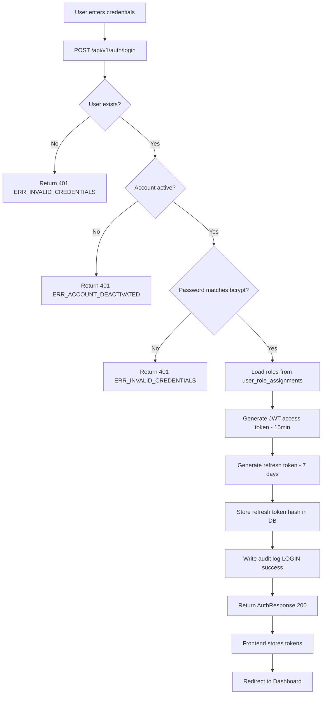
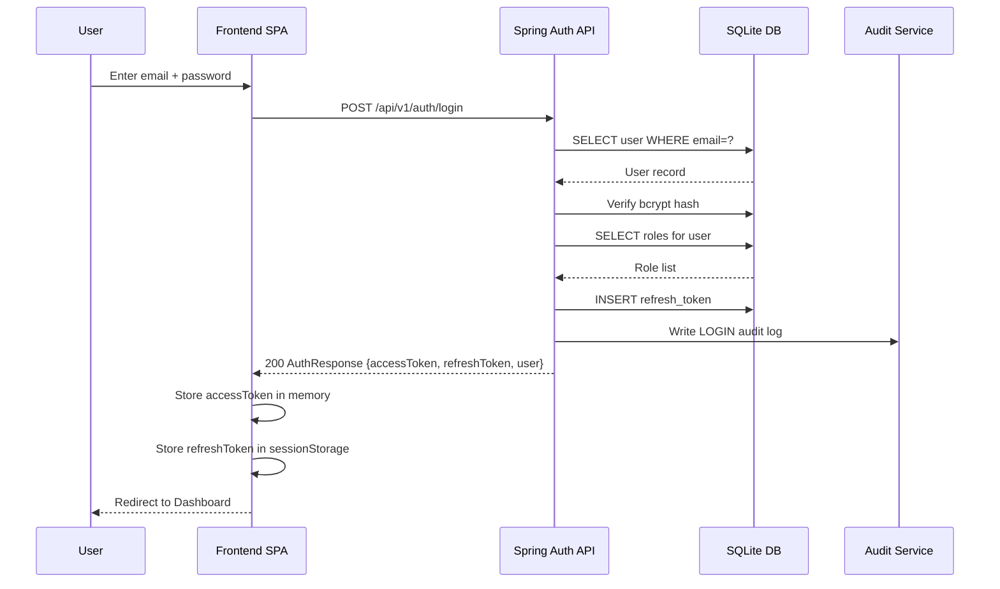
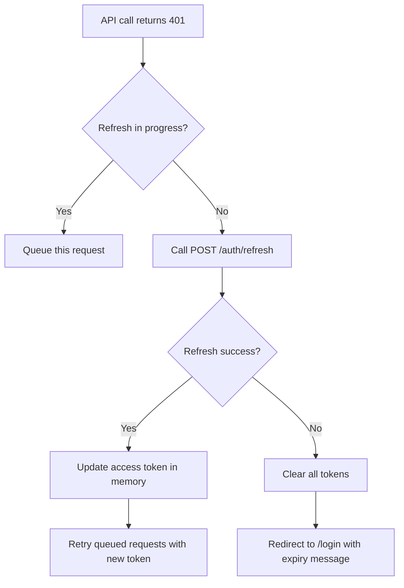

# EPIC-01 — Authentication & Session Management

> **Epic Code:** AUTH | **Story Range:** AUTH-US-001–005
> **Owner:** Platform Engineering | **Priority:** P0 (All stories)
> **Implementation Status:** ✅ Fully Implemented

---

## 1. Executive Summary

### Purpose
Provide a secure, role-aware authentication and session management layer for all HCB Admin Portal users. Every portal interaction depends on a valid, scoped JWT access token. The authentication system enforces role-based access control (RBAC) that gates every Spring endpoint via `@PreAuthorize`.

### Business Value
- Prevents unauthorized access to sensitive credit bureau data
- Enables role-scoped UX — viewers see read-only controls, admins see mutation controls
- Provides token refresh without forcing re-login, improving user productivity
- Produces an audit trail of every login/logout event for compliance

### Key Capabilities
1. Email + password login with JWT access token + refresh token issuance
2. Silent background token refresh before expiry
3. Secure logout with refresh token revocation
4. Current user profile retrieval (`/me`) for personalization
5. Role-based page and API access gating (SUPER_ADMIN, BUREAU_ADMIN, ANALYST, VIEWER, API_USER)

---

## 2. Scope

### In Scope
- Login form with credential validation
- JWT issuance (access token in memory, refresh token in sessionStorage)
- Token refresh flow (shared 401 queue to prevent race conditions)
- Logout with server-side refresh token revocation
- `/me` endpoint for profile + roles
- Spring `@PreAuthorize` role checking on all API routes
- Rate limiting on `/login` (5 req/min per IP)

### Out of Scope
- Social OAuth (Google, Microsoft) — not implemented
- Multi-Factor Authentication (MFA) — DB column exists (`mfa_enabled`), UI not built
- Password reset / forgot password flow — not implemented
- SSO / SAML — not in current scope

---

## 3. Personas

| Persona | Role | Needs |
|---------|------|-------|
| Bureau Administrator | SUPER_ADMIN / BUREAU_ADMIN | Full portal access, manage institutions and products |
| Data Analyst | ANALYST | Read + limited write access, data governance tools |
| Viewer | VIEWER | Read-only dashboard and monitoring access |
| API User | API_USER | Programmatic API access via API keys (not portal login) |
| System (Spring Boot) | Backend | Validate JWT on every request, enforce RBAC |

---

## 4. Features Overview

| Feature | Description | Status |
|---------|-------------|--------|
| Email/Password Login | Validate credentials, issue JWT pair | ✅ Implemented |
| Token Refresh | Silently obtain new access token using refresh token | ✅ Implemented |
| Logout | Revoke refresh token on server | ✅ Implemented |
| Current User Profile | Return user info + roles from token | ✅ Implemented |
| RBAC Gate | Block unauthorized access by role | ✅ Implemented |
| Rate Limiting on Login | 5 attempts/min per IP | ✅ Implemented |
| MFA | Second factor authentication | ❌ Not Implemented |
| Password Reset | Email-based reset flow | ❌ Not Implemented |

---

## 5. Epic-Level UI Requirements

### Screens in This Epic

| Screen | Path | Description |
|--------|------|-------------|
| Login Page | `/login` | Credential entry form |
| Redirect on Auth Failure | Any protected route | Redirect to `/login` on 401 |

### Navigation Structure
- Unauthenticated users hitting any protected route are redirected to `/login`
- Successful login redirects to `/` (Dashboard)
- Logout clears token state and redirects to `/login`

### Layout Expectations
- Login page is full-viewport centered card layout (no sidebar/header)
- Card contains: HCB logo, email field, password field, "Sign In" button, error state
- Loading state shows spinner inside the button while the API call is in-flight

### Component Behavior
- Email field: type=email, autofocus on mount
- Password field: type=password with show/hide toggle
- Submit button: disabled while loading; shows spinner
- Error message: appears below the form on invalid credentials (generic: "Invalid email or password")

### State Handling
| State | UI Behavior |
|-------|-------------|
| Loading | Button disabled, spinner visible |
| Error (401) | Error toast + inline message below form |
| Error (network) | "Unable to connect to server" message |
| Success | Redirect to `/` |
| Session expired | Redirect to `/login` with "Your session has expired" toast |

### Accessibility
- Form has `role="form"` and `aria-label="Sign in to HCB Portal"`
- Error messages have `role="alert"`
- Password toggle button has descriptive `aria-label`
- All fields have associated `<label>` elements

---

## 6. Epic-Level UI Test Cases

| Test ID | Screen | Scenario | Steps | Expected Result |
|---------|--------|----------|-------|----------------|
| AUTH-UI-TC-01 | Login | Successful login | Enter valid email/password, click Sign In | Redirected to Dashboard |
| AUTH-UI-TC-02 | Login | Invalid credentials | Enter wrong password, click Sign In | Error message shown, no redirect |
| AUTH-UI-TC-03 | Login | Empty form submit | Click Sign In with empty fields | Validation errors on both fields |
| AUTH-UI-TC-04 | Login | Loading state | Click Sign In | Button disabled, spinner visible during API call |
| AUTH-UI-TC-05 | Any page | Session expired | Let access token expire, attempt an action | Redirected to login with expiry toast |
| AUTH-UI-TC-06 | Login | Keyboard navigation | Tab through fields and submit with Enter | Form submits correctly |
| AUTH-UI-TC-07 | Any page | Unauthorized role | Viewer tries to access admin-only page | Redirect to 403/dashboard page |

---

## 7. Story-Centric Requirements

---

### AUTH-US-001 — Log In with Email and Password

#### 1. Business Context
The portal has no public access. Every user must authenticate. Authentication issues access tokens that gate all subsequent API calls. Invalid credentials must never hint at which field is wrong (prevents enumeration attacks).

#### 2. Description
> As a bureau administrator,
> I want to log in with my email and password,
> So that I can securely access the HCB Admin Portal.

#### 3. Acceptance Criteria

```gherkin
Feature: Login

  Scenario: Successful login
    Given I am on the /login page
    When I enter "admin@hcb.com" and "Admin@1234"
    And I click Sign In
    Then I receive a JWT access token and refresh token
    And I am redirected to the Dashboard
    And my name and roles appear in the header

  Scenario: Invalid credentials
    Given I am on the /login page
    When I enter "admin@hcb.com" and "WrongPassword"
    And I click Sign In
    Then I see "Invalid email or password" error
    And no token is stored

  Scenario: Empty fields
    Given I am on the /login page
    When I click Sign In without filling fields
    Then I see validation errors on email and password fields

  Scenario: Deactivated user
    Given a user account with status "deactivated"
    When that user attempts to login
    Then they receive a 401 with generic error message

  Scenario: Rate limiting
    Given I fail to login 5 times within 1 minute
    When I attempt the 6th login
    Then I receive a 429 Too Many Requests response
    And I see "Too many login attempts. Please wait." message
```

#### 4. UI/UX Requirements

**Screen:** `/login`

| Field | Type | Validation | Behavior |
|-------|------|-----------|----------|
| Email | text (email) | Required, valid email format | Autofocus on mount |
| Password | password | Required, min 1 char | Show/hide toggle |
| Sign In button | submit | — | Disabled + spinner during loading |
| Error message | inline | — | Shown below form on 401 |

**State handling:**
- `idle`: Normal form, button enabled
- `loading`: Button disabled + spinner, fields read-only
- `error`: Error message below form, form re-enabled
- `success`: Invisible transition to redirect

#### 5. UI Test Cases

| Test ID | Scenario | Steps | Expected Result |
|---------|----------|-------|----------------|
| AUTH-US-001-TC-01 | Valid login | Enter valid creds, submit | Dashboard loads, header shows user name |
| AUTH-US-001-TC-02 | Invalid password | Enter wrong password, submit | Error shown, on /login |
| AUTH-US-001-TC-03 | Empty email | Submit with empty email | Email field shows validation error |
| AUTH-US-001-TC-04 | Empty password | Submit with empty password | Password field shows validation error |
| AUTH-US-001-TC-05 | Network error | Submit while API is down | "Unable to connect" message shown |
| AUTH-US-001-TC-06 | Rate limit hit | 6th failed attempt in 1 min | 429 message shown |

#### 6. Status / State Management

| Status | Description | Trigger | Next States | Example |
|--------|-------------|---------|-------------|---------|
| `unauthenticated` | No valid session | App load / logout / token expiry | `authenticating` | User opens portal |
| `authenticating` | Login API in flight | User submits form | `authenticated`, `error` | Spinner visible |
| `authenticated` | Valid JWT in memory | Login success | `refreshing`, `unauthenticated` | User on Dashboard |
| `refreshing` | Refresh token exchange in flight | Access token near expiry | `authenticated`, `unauthenticated` | Background call |
| `error` | Login failed | 401 / 429 / network error | `authenticating` | Error shown on form |

**Terminal states:** `unauthenticated` (after logout/expiry)
**Invalid transitions:** `authenticated` → `authenticating` (login form not accessible when already authenticated)

#### 7. API Requirements

**Endpoint:** `POST /api/v1/auth/login`

| Field | Value |
|-------|-------|
| Method | POST |
| Auth | None (public) |
| Content-Type | application/json |
| Rate Limit | 5 requests/min per IP |

**Request Schema:**
```json
{
  "email": "admin@hcb.com",
  "password": "Admin@1234"
}
```

**Response Schema (200 OK):**
```json
{
  "accessToken": "eyJhbGci...",
  "refreshToken": "eyJhbGci...",
  "expiresIn": 900,
  "user": {
    "id": 1,
    "email": "admin@hcb.com",
    "displayName": "HCB Admin",
    "roles": ["ROLE_SUPER_ADMIN"],
    "institutionId": null,
    "institutionName": null
  }
}
```

**Error Codes:**
| HTTP Status | Error Code | Description |
|-------------|------------|-------------|
| 401 | `ERR_INVALID_CREDENTIALS` | Wrong email or password |
| 401 | `ERR_ACCOUNT_DEACTIVATED` | Account is deactivated |
| 429 | `ERR_RATE_LIMITED` | Too many login attempts |
| 400 | `ERR_VALIDATION` | Missing/invalid fields |

#### 8. Database Requirements

**Tables:** `users`, `refresh_tokens`

```sql
-- users: key fields for login
-- email (unique), password_hash (bcrypt), user_account_status, institution_id

-- refresh_tokens: created on successful login
INSERT INTO refresh_tokens (user_id, token_hash, issued_at, expires_at, ip_address)
VALUES (1, '<sha256_hash>', CURRENT_TIMESTAMP, datetime('now', '+7 days'), '<ip_hash>');
```

**Sample Record:**
```sql
SELECT u.email, u.user_account_status, r.role_name
FROM users u
JOIN user_role_assignments ura ON ura.user_id = u.id
JOIN roles r ON r.id = ura.role_id
WHERE u.email = 'admin@hcb.com';
-- Result: admin@hcb.com | active | Super Admin
```

#### 9. Business Logic

- Password is validated via **bcrypt** compare against `password_hash`
- `user_account_status` must be `active` to allow login (not `invited`, `suspended`, `deactivated`)
- Access token TTL: **15 minutes** (`JWT_EXPIRATION` env var)
- Refresh token TTL: **7 days**
- Refresh token is stored as SHA-256 hash (never raw)
- Login event is written to `audit_logs` with `action_type='LOGIN'`, `audit_outcome='success'|'failure'`

#### 10. Data Mapping

| Source Field | DB Field | JWT Claim | Notes |
|-------------|----------|-----------|-------|
| `email` | `users.email` | `sub` | Lookup key |
| `display_name` | `users.display_name` | `name` | |
| `role_name` | `roles.role_name` | `roles[]` | Aggregated from `user_role_assignments` |
| `institution_id` | `users.institution_id` | `institutionId` | Null for bureau staff |

#### 11. Data Flow

```
1. User enters email + password on /login
2. Frontend calls POST /api/v1/auth/login
3. AuthController receives LoginRequest (validated by @Valid)
4. AuthService looks up user by email in users table
5. AuthService checks user_account_status = 'active'
6. AuthService verifies password against password_hash (bcrypt)
7. AuthService loads user roles from user_role_assignments JOIN roles
8. JwtService generates accessToken (15min) and refreshToken (7 days)
9. refreshToken hash stored in refresh_tokens table
10. AuditService writes LOGIN audit log entry
11. AuthResponse returned to frontend
12. Frontend stores accessToken in memory, refreshToken in sessionStorage
13. User redirected to Dashboard
```

#### 12. Flowchart



#### 13. Swimlane Diagram



#### 14. Edge Cases & Failure Handling

| Scenario | Handling |
|----------|----------|
| User not found | Same 401 as wrong password (no enumeration) |
| DB down during login | 500 with generic error |
| bcrypt compare timeout | Return 500, log error |
| Concurrent logins from same user | Allowed; multiple refresh tokens issued |
| Login from new device | New refresh_token row; old ones remain valid until expiry |

#### 15. Functional Test Cases

| Test ID | Scenario | Steps | Expected Result |
|---------|----------|-------|----------------|
| AUTH-US-001-FTC-01 | Valid admin login | POST with admin@hcb.com / Admin@1234 | 200, accessToken + refreshToken in response |
| AUTH-US-001-FTC-02 | Valid viewer login | POST with viewer@hcb.com / Admin@1234 | 200, roles contains ROLE_VIEWER |
| AUTH-US-001-FTC-03 | Wrong password | POST with wrong password | 401 ERR_INVALID_CREDENTIALS |
| AUTH-US-001-FTC-04 | Non-existent email | POST with unknown@test.com | 401 ERR_INVALID_CREDENTIALS |
| AUTH-US-001-FTC-05 | Suspended user | POST with suspended user credentials | 401 or 403 |
| AUTH-US-001-FTC-06 | Missing email field | POST without email | 400 ERR_VALIDATION |
| AUTH-US-001-FTC-07 | Empty password | POST with empty password | 400 ERR_VALIDATION |

#### 16. Test Data

```json
// Valid admin credentials
{ "email": "admin@hcb.com", "password": "Admin@1234" }

// Valid viewer credentials
{ "email": "viewer@hcb.com", "password": "Admin@1234" }

// Invalid credentials
{ "email": "admin@hcb.com", "password": "WrongPassword123" }

// Missing field
{ "email": "admin@hcb.com" }
```

#### 17. Compliance & Audit

- Login success/failure events are written to `audit_logs` with `action_type='LOGIN'`, `entity_type='user'`, `entity_id=<user_id>`, `audit_outcome='success'|'failure'`
- IP address is **hashed** before storage (`ip_address_hash`) — never stored raw
- Raw password is **never** logged, stored in responses, or written to audit logs
- Refresh token raw value is never stored — only SHA-256 hash

#### 18. Non-Functional Requirements

| Requirement | Target |
|-------------|--------|
| Login API response time | < 500ms p95 |
| bcrypt cost factor | 12 (configurable) |
| Rate limit | 5 req/min per IP on `/login` |
| JWT algorithm | HS256 with `JWT_SECRET` env var |
| Token storage | Access: in-memory JS var; Refresh: sessionStorage |
| Session isolation | sessionStorage ensures tabs don't share sessions |

#### 19. Definition of Done
- [ ] Login API returns 200 with accessToken + refreshToken for valid credentials
- [ ] Login API returns 401 for invalid credentials with no credential hints
- [ ] JWT contains correct roles and user metadata
- [ ] Refresh token stored as hash in `refresh_tokens` table
- [ ] Login audit log written on success and failure
- [ ] Rate limiting enforced at 5 req/min per IP
- [ ] Frontend stores access token in memory (not localStorage)
- [ ] Frontend stores refresh token in sessionStorage
- [ ] Loading state shown during API call
- [ ] Redirect to Dashboard on success

---

### AUTH-US-002 — Silent Token Refresh

#### 1. Business Context
Access tokens have a 15-minute TTL to limit the blast radius of a compromised token. Silent refresh ensures users are not interrupted while actively working.

#### 2. Description
> As a logged-in user,
> I want my access token to be refreshed silently before it expires,
> So that my session continues uninterrupted without a forced re-login.

#### 3. Acceptance Criteria

```gherkin
  Scenario: Successful silent refresh
    Given I am authenticated with an access token expiring in < 60 seconds
    When I make any API call
    Then the frontend automatically calls POST /api/v1/auth/refresh
    And a new access token is stored in memory
    And the original API call is retried with the new token

  Scenario: Refresh token expired
    Given my refresh token has expired
    When the frontend attempts to refresh
    Then the refresh call returns 401
    And the frontend clears all tokens
    And I am redirected to /login with "Session expired" message

  Scenario: Concurrent requests during refresh
    Given multiple API calls are in-flight when the access token expires
    When the first call triggers a refresh
    Then all subsequent calls queue behind the refresh
    And all queued calls proceed with the new token after refresh completes
```

#### 4. API Requirements

**Endpoint:** `POST /api/v1/auth/refresh`

**Request:**
```json
{ "refresh_token": "eyJhbGci..." }
```
**Response (200):**
```json
{
  "accessToken": "eyJhbGci...<new>",
  "refreshToken": "eyJhbGci...<rotated>",
  "expiresIn": 900
}
```
**Error:** `401` if refresh token is expired, revoked, or not found.

#### 5. Business Logic
- Refresh token rotation: each refresh call **issues a new refresh token** and revokes the old one
- Old refresh token is marked `is_revoked=1` in `refresh_tokens`
- A shared promise queue in `api-client.ts` serializes concurrent refresh calls (prevents multiple simultaneous refreshes)

#### 6. Data Flow
```
1. API call returns 401
2. api-client.ts intercepts the 401
3. If a refresh is already in-flight, queue the failed request
4. Otherwise, call POST /api/v1/auth/refresh with stored refresh token
5. On success: update in-memory access token, retry all queued requests
6. On failure: clear tokens, redirect to /login
```

#### 7. Flowchart


#### 8. Compliance & Audit
- Refresh events do not generate audit logs (too high frequency, not a material action)
- Logout-forced refresh revocations ARE logged

#### 9. Definition of Done
- [ ] Silent refresh called automatically when access token is near/past expiry
- [ ] Refresh token rotated on each successful refresh
- [ ] Concurrent requests properly queued during refresh
- [ ] Redirect to login on expired/revoked refresh token

---

### AUTH-US-003 — Logout and Session Termination

#### 1. Business Context
Logout must revoke the refresh token server-side to prevent it from being used after the user intends to end their session (e.g. on a shared computer).

#### 2. Description
> As a logged-in user,
> I want to log out,
> So that my session is securely terminated and my refresh token cannot be reused.

#### 3. Acceptance Criteria

```gherkin
  Scenario: Successful logout
    Given I am authenticated
    When I click the logout button
    Then POST /api/v1/auth/logout is called with my refresh token
    And the refresh token is revoked in the database
    And all tokens are cleared from the frontend
    And I am redirected to /login

  Scenario: Logout with already-expired token
    Given my refresh token has already expired
    When I click logout
    Then the logout call proceeds without error
    And I am still redirected to /login
```

#### 4. API Requirements

**Endpoint:** `POST /api/v1/auth/logout`
**Auth:** Bearer access token in Authorization header

**Request:**
```json
{ "refresh_token": "eyJhbGci..." }
```
**Response:** `204 No Content`

#### 5. Business Logic
- Sets `is_revoked=1` and `revoked_at=NOW()` on the matching `refresh_tokens` row
- If refresh token not found, silently succeeds (idempotent)
- Writes `LOGOUT` audit log entry

#### 6. Definition of Done
- [ ] Refresh token revoked in DB on logout
- [ ] Frontend clears access token from memory and refresh token from sessionStorage
- [ ] User redirected to /login
- [ ] LOGOUT audit log written

---

### AUTH-US-004 — Get Current User Profile

#### 1. Business Context
The `/me` endpoint is called immediately after login and on app load (if a refresh token exists) to hydrate the UI with the current user's name, roles, and institution context.

#### 2. Description
> As a logged-in user,
> I want to retrieve my profile and assigned roles,
> So that the UI displays my name, and role-specific controls are shown correctly.

#### 3. API Requirements

**Endpoint:** `GET /api/v1/auth/me`
**Auth:** Bearer access token

**Response (200):**
```json
{
  "id": 1,
  "email": "admin@hcb.com",
  "displayName": "HCB Admin",
  "roles": ["ROLE_SUPER_ADMIN"],
  "institutionId": null,
  "institutionName": null
}
```

#### 4. Business Logic
- Roles are returned as Spring authority strings (`ROLE_SUPER_ADMIN`, `ROLE_BUREAU_ADMIN`, `ROLE_ANALYST`, `ROLE_VIEWER`, `ROLE_API_USER`)
- `institutionId` is non-null only for institution-scoped users
- Used by `AuthContext.tsx` to populate React context throughout the SPA

#### 5. Definition of Done
- [ ] `/me` returns correct user info and roles for authenticated user
- [ ] 401 returned for missing/invalid token
- [ ] `AuthContext` populated on app load

---

### AUTH-US-005 — Role-Based Access Control Gate

#### 1. Business Context
Different user roles have different levels of access. The portal must enforce both server-side (Spring `@PreAuthorize`) and client-side (React route guards) role checks. VIEWER cannot mutate; API_USER cannot access the portal.

#### 2. Description
> As a bureau admin,
> I want unauthorized users to be blocked from restricted pages and APIs,
> So that sensitive credit bureau operations are protected.

#### 3. Acceptance Criteria

```gherkin
  Scenario: VIEWER tries to access admin-only feature
    Given I am logged in with VIEWER role
    When I attempt to call a mutation endpoint (e.g. POST /institutions)
    Then the API returns 403 Forbidden
    And the UI hides mutation controls from me

  Scenario: VIEWER denied audit logs
    Given I am logged in with VIEWER role
    When I call GET /api/v1/audit-logs
    Then I receive 403 Forbidden
    And the Audit Log menu item is hidden in the sidebar

  Scenario: ANALYST accessing governance features
    Given I am logged in with ANALYST role
    When I access Data Governance and Schema Mapper pages
    Then I can view and submit items for approval
    But I cannot approve items (BUREAU_ADMIN / SUPER_ADMIN only)
```

#### 4. Role Permission Matrix

| Operation | SUPER_ADMIN | BUREAU_ADMIN | ANALYST | VIEWER | API_USER |
|-----------|:-----------:|:------------:|:-------:|:------:|:--------:|
| Login to portal | ✅ | ✅ | ✅ | ✅ | ❌ |
| View institutions | ✅ | ✅ | ✅ | ✅ | ❌ |
| Create/edit institutions | ✅ | ✅ | ❌ | ❌ | ❌ |
| Approve queue items | ✅ | ✅ | ❌ | ❌ | ❌ |
| View audit logs | ✅ | ✅ | ✅ | ❌ | ❌ |
| Manage users/roles | ✅ | ✅ | ❌ | ❌ | ❌ |
| Submit schema mappings | ✅ | ✅ | ✅ | ❌ | ❌ |
| View dashboard/monitoring | ✅ | ✅ | ✅ | ✅ | ❌ |
| Use Data Submission API | ❌ | ❌ | ❌ | ❌ | ✅ |

#### 5. Implementation Details
- Spring `@PreAuthorize("hasAnyRole('SUPER_ADMIN','BUREAU_ADMIN','ANALYST','VIEWER')")` on all read endpoints
- Mutation endpoints: `hasAnyRole('SUPER_ADMIN','BUREAU_ADMIN')`
- `AuthContext.tsx` in React provides `hasRole()` and `isReadOnly` helpers
- Sidebar menu items are conditionally rendered based on role
- Mutation buttons (Create, Edit, Approve) rendered only for admin roles

#### 6. Definition of Done
- [ ] All Spring mutation endpoints reject ANALYST and VIEWER with 403
- [ ] `GET /api/v1/audit-logs` returns 403 for VIEWER
- [ ] Frontend hides mutation controls from VIEWER/ANALYST where appropriate
- [ ] Role checks happen server-side (frontend checks are UX-only, not security)

---

## 8. Epic API Summary

| Endpoint | Method | Auth | Description | Status |
|----------|--------|------|-------------|--------|
| `/api/v1/auth/login` | POST | None | Authenticate and issue JWT pair | ✅ |
| `/api/v1/auth/refresh` | POST | None | Exchange refresh token for new access token | ✅ |
| `/api/v1/auth/logout` | POST | Bearer | Revoke refresh token | ✅ |
| `/api/v1/auth/me` | GET | Bearer | Get current user profile and roles | ✅ |

---

## 9. Database Summary

| Table | Key Fields | Purpose |
|-------|------------|---------|
| `users` | `email`, `password_hash`, `user_account_status`, `institution_id` | User accounts |
| `refresh_tokens` | `user_id`, `token_hash`, `expires_at`, `is_revoked` | Refresh token store |
| `roles` | `role_name` | Role definitions (Super Admin, Bureau Admin, etc.) |
| `permissions` | `permission_key` | Fine-grained permissions |
| `role_permissions` | `role_id`, `permission_id` | Role → permission mapping |
| `user_role_assignments` | `user_id`, `role_id`, `institution_id` | User → role assignments (institution-scoped) |

**Seeded roles:** Super Admin, Bureau Admin, Analyst, Viewer, API User
**Seeded users:** admin@hcb.com, super-admin@hcb.com, viewer@hcb.com (all with password `Admin@1234`)

---

## 10. Epic Workflows

### Workflow 1: Full Login → Session → Logout
```
Open portal → Redirect to /login
→ Enter credentials → POST /login
→ Receive JWT pair → Store tokens
→ GET /auth/me → Populate AuthContext
→ Access protected pages (token refreshed silently as needed)
→ Click Logout → POST /logout → Tokens cleared → Back to /login
```

### Workflow 2: Expired Session Recovery
```
Access token expires → Next API call returns 401
→ api-client.ts intercepts → POST /refresh with refresh token
→ New access token received → Original request retried
→ If refresh fails → Redirect to /login with "Session expired"
```

---

## 11. KPIs

| KPI | Target | How Measured |
|-----|--------|-------------|
| Login success rate | > 99% for valid credentials | `audit_logs` success vs failure count |
| Token refresh success rate | > 99.9% | Monitoring on `/auth/refresh` status codes |
| Login API latency (p95) | < 500ms | `api_requests` table / monitoring |
| Session duration (avg) | Aligns with business hours | Calculated from `refresh_tokens` |

---

## 12. Risks

| Risk | Likelihood | Impact | Mitigation |
|------|-----------|--------|-----------|
| JWT secret rotation in production | Medium | High | Implement graceful key rotation with overlapping validity windows |
| Refresh token theft from sessionStorage | Low | High | sessionStorage cleared on tab close; short TTL limits exposure |
| Brute force on login | Medium | High | Rate limiting (5/min) + account lockout (future) |
| MFA bypass (MFA not yet built) | Medium | High | Implement MFA before production go-live |

---

## 13. Gap Analysis

| Gap | Story | Severity | Description |
|-----|-------|----------|-------------|
| MFA not implemented | AUTH-US-001 | High | `mfa_enabled` column exists in DB but MFA flow not built |
| Password reset missing | AUTH-US-001 | Medium | No forgot-password or email-based reset flow |
| Account lockout missing | AUTH-US-001 | Medium | Rate limiting exists but no progressive account lockout |
| Token rotation not confirmed | AUTH-US-002 | Low | Refresh token rotation implemented in service but needs verification |

---

## 14. Execution Roadmap

| Phase | Stories | Description |
|-------|---------|-------------|
| Phase 1 — Core | AUTH-US-001, 002, 003, 004, 005 | All implemented — production-ready with JWT_SECRET set |
| Phase 2 — Security Hardening | AUTH-US-001 | Add MFA, password reset, account lockout after N failures |
| Phase 3 — Enterprise | AUTH-US-001 | SSO/SAML integration for enterprise bureau operators |
| Phase 4 — Compliance | AUTH-US-001 | Full access certification reports, session audit trails |
