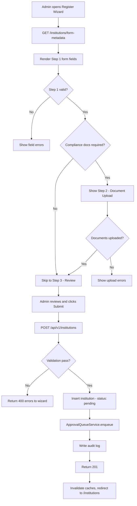
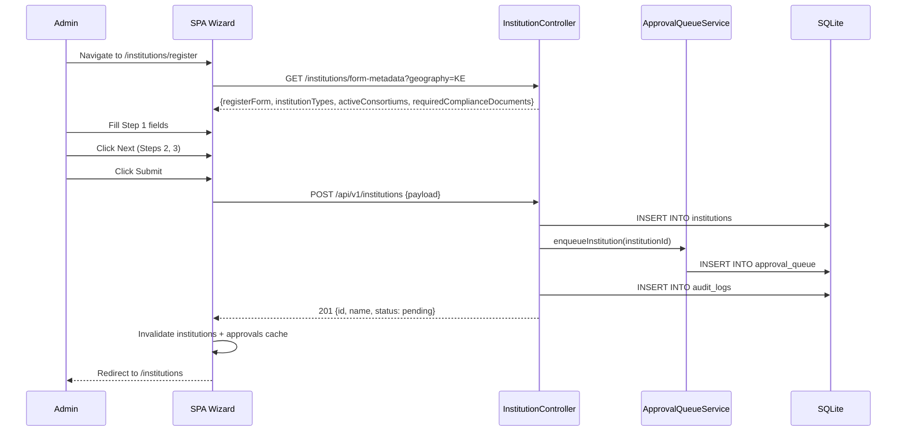

# EPIC-02 — Institution / Member Management

> **Epic Code:** INST | **Story Range:** INST-US-001–012
> **Owner:** Platform Engineering | **Priority:** P0–P2
> **Implementation Status:** ✅ Mostly Implemented (INST-US-012 Partial)
>
> **Cross-cutting UI:** Member list/detail status chips and sortable column headers follow [EPIC-00](./EPIC-00-Design-System-Cross-Cutting.md) / [Design Guidelines](../design-guidelines.md) (April 2026).

---

## 1. Executive Summary

### Purpose
Institution Management is the foundational module of the HCB platform. It governs how financial institutions (banks, fintechs, NBFIs, credit unions) are registered, onboarded, and lifecycle-managed as members of the credit bureau network. Every data submission, enquiry, and consortium membership traces back to an institution record.

### Business Value
- Controlled onboarding with compliance document validation before activation
- Geography-driven registration forms ensure jurisdiction-correct data collection
- Lifecycle states (draft → pending → active → suspended → deactivated) enforce data submission gating
- Institution-scoped API access and consent configuration supports AA-compliant data sharing
- Sub-tab detail views give bureau admins a 360-degree view of each member

### Key Capabilities
1. Multi-step registration wizard driven by `GET /institutions/form-metadata?geography=`
2. Compliance document upload (per `requiredComplianceDocuments` config)
3. Institution list with search, sort, filter, and pagination
4. Detail page with 9 sub-tabs: Overview, Monitoring, API Access, Consent, Products, Consortiums, Users, Audit Trail, Billing
5. Lifecycle management: activate, suspend, deactivate with approval queue integration
6. API key management and rate overrides per institution

---

## 2. Scope

### In Scope
- Institution CRUD (create via wizard, read, update lifecycle status)
- Geography-driven form metadata from `GET /institutions/form-metadata`
- Compliance document upload and verification
- Institution list page with filters (status, type, role, jurisdiction, search)
- Institution detail page and all sub-tabs
- Overview charts (API submissions + enquiries, last 30 days)
- Suspend / reactivate / soft-delete actions
- API access configuration (enable/disable endpoints, rate overrides)
- Consent configuration (AA consent settings)
- Product subscriptions sub-tab
- Consortium memberships sub-tab
- Monitoring summary sub-tab
- Audit trail sub-tab
- Billing sub-tab (partial stub)
- Approval queue enqueue on `POST /institutions` (type: `institution`)

### Out of Scope
- Third-party KYC/KYB verification (regulatory check is manual)
- Automated credit scoring for institutions (not in scope)
- Institution-to-institution direct communication
- Multi-geography/multi-jurisdiction in a single registration (one geography per registration)

---

## 3. Personas

| Persona | Role | Needs |
|---------|------|-------|
| Bureau Administrator | SUPER_ADMIN / BUREAU_ADMIN | Register, approve, and manage all member institutions |
| Data Analyst | ANALYST | View institution details, monitoring tabs, data quality |
| Viewer | VIEWER | Read-only access to institution list and detail pages |
| Institution Operator | API_USER | Submit data via API (not portal login) |
| Compliance Officer | BUREAU_ADMIN | Review compliance documents, audit trail |

---

## 4. Features Overview

| Feature | Description | Status |
|---------|-------------|--------|
| Institution Registration Wizard | Multi-step form with geography-driven fields | ✅ Implemented |
| Compliance Document Upload | Upload regulatory docs during/after registration | ✅ Implemented |
| Institution List | Paginated, searchable, filterable list | ✅ Implemented |
| Institution Detail Page | Tabbed view with 9 sub-tabs | ✅ Implemented |
| Overview Charts | API + enquiry activity last 30 days | ✅ Implemented |
| Lifecycle Management | Activate, suspend, deactivate | ✅ Implemented |
| API Access Config | Enable/disable APIs, set rate overrides | ✅ Implemented |
| Consent Config | AA-compliant consent configuration | ✅ Implemented |
| Product Subscriptions Tab | View/manage product subscriptions | ✅ Implemented |
| Consortium Memberships Tab | View consortium memberships | ✅ Implemented |
| Monitoring Summary Tab | API and batch activity for this institution | ✅ Implemented |
| Audit Trail Tab | All actions on this institution | ✅ Implemented |
| Billing Tab | Credit balance and billing model | ⚠️ Partial |

---

## 5. Epic-Level UI Requirements

### Screens in This Epic

| Screen | Path | Key Components |
|--------|------|---------------|
| Institution List | `/institutions` | Search bar, filter selects, table, pagination, suspend/delete dialog |
| Register Institution Wizard | `/institutions/register` | Multi-step form (Step 1: Entity, Step 2: Compliance Docs, Step 3: Review) |
| Institution Detail | `/institutions/:id` | Tabbed layout, overview charts |
| Monitoring Tab | `/institutions/:id?tab=monitoring` | API + batch summary stats |
| API Access Tab | `/institutions/:id?tab=api-access` | Toggle controls per endpoint |
| Consent Tab | `/institutions/:id?tab=consent` | Consent configuration fields |
| Products Tab | `/institutions/:id?tab=products` | Subscription table |
| Consortiums Tab | `/institutions/:id?tab=consortiums` | Membership table |
| Audit Trail Tab | `/institutions/:id?tab=audit` | Chronological log table |
| Billing Tab | `/institutions/:id?tab=billing` | Credit balance, billing model (stub) |

### Navigation Structure
- **Sidebar:** **Member Management** with sub-items: **Member Institutions** (`/institutions`), **Register member** (`/institutions/register`), **Consortiums** (`/consortiums`). The Member Institutions list header does not include a **Register member** button (use sidebar or Command Palette → **Register Institution**).
- **List → Detail:** Click institution row to navigate to `/institutions/:id`
- **Detail tabs:** Horizontal tab bar below institution header

### Layout Expectations
- List page: full-width table with sticky header row; action buttons in each row
- Wizard: centered card with step indicator at top (Step 1 / 2 / 3), Back/Next/Submit CTAs
- Detail page: institution header card (name, status badge, type, jurisdiction), tab bar below, content area per tab

### Component Behavior
- **Status badge:** Color-coded by lifecycle status: `draft`=gray, `pending`=yellow, `active`=green, `suspended`=orange, `deactivated`=red
- **Role badge:** `data_submitter`, `subscriber`, or `dual` — derived from `is_data_submitter` + `is_subscriber` flags
- **Suspend dialog:** Confirmation alert dialog before suspend/delete actions
- **Overview charts:** Line charts using Recharts, 30-day rolling window, no data state shown if outside seed time window

### State Handling
| State | UI Behavior |
|-------|-------------|
| Loading list | `SkeletonTable` component |
| Empty list | `EmptyState` component with "Register your first member" CTA |
| API error | `ApiErrorCard` component |
| Loading detail | Tab content skeleton |
| Wizard submitting | Submit button disabled + spinner |
| Wizard step validation error | Inline field-level error messages |

### Accessibility
- All table columns have `scope="col"` headers
- Status badges include `aria-label` with full status description
- Wizard steps communicated via `aria-current="step"` on active step
- Form fields in wizard have `aria-required` and `aria-describedby` for error messages

---

## 6. Epic-Level UI Test Cases

| Test ID | Screen | Scenario | Steps | Expected Result |
|---------|--------|----------|-------|----------------|
| INST-UI-TC-01 | List | Page loads | Navigate to /institutions | Table with institution rows, search and filters visible |
| INST-UI-TC-02 | List | Search by name | Type "First National" in search | Only matching rows shown |
| INST-UI-TC-03 | List | Filter by status | Select "active" in status filter | Only active institutions shown |
| INST-UI-TC-04 | List | Suspend institution | Click Suspend, confirm dialog | Status changes to "suspended" |
| INST-UI-TC-05 | Wizard | Navigate steps | Complete Step 1, click Next | Step 2 shown, step indicator updated |
| INST-UI-TC-06 | Wizard | Geography drives fields | Select a geography | Form fields update based on form-metadata response |
| INST-UI-TC-07 | Wizard | Required field missing | Click Next without required field | Validation error on field |
| INST-UI-TC-08 | Wizard | Submit wizard | Complete all steps, click Submit | Success, redirect to /institutions, approval queue item created |
| INST-UI-TC-09 | Detail | Tab navigation | Click each tab in sequence | Correct content loads for each tab |
| INST-UI-TC-10 | Detail | Overview charts | Load institution with API activity | Charts display with data |
| INST-UI-TC-11 | Detail | No chart data | Load institution outside seed window | "No data available" state shown |

---

## 7. Story-Centric Requirements

---

### INST-US-001 — Register New Member Institution (Wizard Steps 1–3)

#### 1. Business Context
Registering a new institution is the entry point for all member activity. The registration wizard collects entity details, regulatory information, contact details, participation role (data submitter / subscriber), and consortium selection in Step 1. Step 2 collects compliance documents. Step 3 is a read-only review before submission.

#### 2. Description
> As a bureau administrator,
> I want to complete a multi-step registration form,
> So that a new institution is onboarded and queued for approval.

#### 3. Acceptance Criteria

```gherkin
  Scenario: Complete institution registration
    Given I am logged in as BUREAU_ADMIN
    When I complete all 3 wizard steps with valid data
    And I submit the form
    Then POST /api/v1/institutions is called with the collected payload
    And the institution is created with status "pending"
    And an approval_queue item with type "institution" is created
    And I am redirected to /institutions
    And the institution list is invalidated

  Scenario: Missing required field
    Given I am on Step 1 of the wizard
    When I click Next without filling a required field
    Then I see a validation error on the missing field
    And I cannot proceed to Step 2

  Scenario: Subscriber checkbox drives consortium step
    Given I check "Subscriber" as a participation role
    When Step 1 is completed
    Then the Consortium selection field is visible
    And POST /api/v1/institutions includes consortiumIds in the payload

  Scenario: No compliance documents required
    Given the institution-register-form.json has empty requiredComplianceDocuments
    When I complete Step 1
    Then Step 2 (Compliance Documents) is skipped
    And I go directly to Step 3 (Review)
```

#### 4. UI/UX Requirements

**Step 1 — Entity, Regulatory, Contact, Participation, Consortium**

| Field | Type | Source | Required |
|-------|------|--------|----------|
| Legal Name | text | `registerForm.sections[].fields[name=name]` | Yes |
| Trading Name | text | Form config | No |
| Institution Type | select | `institutionTypes` from form-metadata | Yes |
| Registration Number | text (read-only in UI) | Form config: `readOnly`, `required: false`; **Spring** assigns on `POST` when omitted | No (Step 1 input); persisted after create |
| Jurisdiction | select | Form config | Yes |
| License Type | text | Form config | No |
| Contact Email | email | Form config | Yes |
| Contact Phone | tel | Form config | No |
| Is Data Submitter | checkbox | Form config | — |
| Is Subscriber | checkbox | Form config | — |
| Consortium | multi-select | `activeConsortiums` from form-metadata | Conditional (when subscriber) |

**Step 2 — Compliance Documents**
- One upload row per `requiredComplianceDocuments` entry
- Fields: `documentName`, `label`, `hint`, file picker (`accept`, `maxSizeBytes`)
- Required when `requiredWhen` matches selected participation role (`data_submitter` / `subscriber`)

**Step 3 — Review**
- Read-only display of all fields entered in Steps 1 and 2; **Registration Number** shows **“Assigned when you submit”** until the API returns the final value after create
- Field values rendered with `text-body text-foreground` typography (template literal, not `cn()`)
- "Go Back" and "Submit" CTAs

#### 5. UI Test Cases

| Test ID | Scenario | Steps | Expected Result |
|---------|----------|-------|----------------|
| INST-US-001-TC-01 | Complete wizard | Fill all steps, submit | Institution created, redirected to list |
| INST-US-001-TC-02 | Required field missing | Skip required field, click Next | Validation error shown |
| INST-US-001-TC-03 | Subscriber drives consortium | Check Subscriber, complete Step 1 | Consortium field visible |
| INST-US-001-TC-04 | No compliance docs | Config has empty docs | Step 2 skipped |
| INST-US-001-TC-05 | Review step accuracy | Fill Step 1, reach Step 3 | All Step 1 values visible in review |
| INST-US-001-TC-06 | Back navigation | Click Back on Step 2 | Returns to Step 1 with data preserved |
| INST-US-001-TC-07 | Auto registration number | Complete wizard without typing Registration Number | Step 1 field is read-only; **POST** omits `registrationNumber`; **201** body includes assigned `registrationNumber` |

#### 6. Status / State Management

| Status | Description | Trigger | Next States |
|--------|-------------|---------|-------------|
| `draft` | Created but not submitted | Default on creation | `pending` |
| `pending` | Submitted, awaiting approval | POST /institutions submit | `active`, `rejected` (via approval queue) |
| `active` | Approved and operational | Approval queue approve action | `suspended`, `deactivated` |
| `suspended` | Temporarily blocked | Admin suspend action | `active`, `deactivated` |
| `deactivated` | Permanently disabled | Admin deactivate action | Terminal |

**Important:** Data Submission API, batch ingestion, and Enquiry API all require `active` status. Non-active institutions receive `403 ERR_INSTITUTION_*`.

#### 7. API Requirements

**Endpoint:** `POST /api/v1/institutions`

**Query param:** `?geography=<geographyId>` (optional, links to form-metadata)

**Request Schema:**
```json
{
  "name": "First National Bank",
  "tradingName": "FNB",
  "institutionType": "Commercial Bank",
  "jurisdiction": "Kenya",
  "licenseType": "Commercial Banking License",
  "contactEmail": "contact@fnb.com",
  "contactPhone": "+254700000001",
  "isDataSubmitter": true,
  "isSubscriber": true,
  "consortiumIds": [1, 2]
}
```

`registrationNumber` may be **omitted** (wizard default); the API assigns **`{TypePrefix}-{Slug3}-{YYYY}-{id}`**. You may still send a non-blank value to override.

**Response (201 Created):**
```json
{
  "id": 6,
  "name": "First National Bank",
  "institutionLifecycleStatus": "pending",
  "createdAt": "2026-03-31T10:00:00Z"
}
```

**Side Effects:**
- `approval_queue` row inserted with `approval_item_type='institution'`, `entity_ref_id='6'`

**Error Codes:**
| HTTP | Code | Description |
|------|------|-------------|
| 400 | `ERR_VALIDATION` | Required field missing or invalid |
| 409 | `ERR_DUPLICATE_REGISTRATION` | Registration number already exists |
| 403 | `ERR_FORBIDDEN` | Role does not have permission |

#### 8. Database Requirements

**Tables:** `institutions`, `approval_queue`

```sql
-- New institution row
INSERT INTO institutions (name, trading_name, institution_type,
  institution_lifecycle_status, registration_number, jurisdiction,
  contact_email, is_data_submitter, is_subscriber)
VALUES ('First National Bank', 'FNB', 'Commercial Bank',
  'pending', 'REG-001-2024', 'Kenya', 'contact@fnb.com', 1, 1);

-- Approval queue entry (inserted by ApprovalQueueService)
INSERT INTO approval_queue (approval_item_type, entity_ref_id,
  entity_name_snapshot, submitted_by_user_id, approval_workflow_status)
VALUES ('institution', '6', 'First National Bank', 1, 'pending');
```

#### 9. Business Logic
- `institution_lifecycle_status` defaults to `pending` when created via wizard (not `draft`)
- `is_data_submitter=1` if "Data Submitter" role checked, `is_subscriber=1` if "Subscriber" checked
- At least one of `is_data_submitter` or `is_subscriber` must be true
- `consortiumIds` are only sent when `is_subscriber=true`
- `ApprovalQueueService.enqueueInstitution()` is called after institution insert

#### 10. Data Mapping

| Form Field | API Key | DB Column | Notes |
|-----------|---------|-----------|-------|
| Legal Name | `name` | `institutions.name` | |
| Trading Name | `tradingName` | `institutions.trading_name` | Optional |
| Institution Type | `institutionType` | `institutions.institution_type` | CHECK constraint |
| Registration Number | `registrationNumber` | `institutions.registration_number` | UNIQUE |
| Is Data Submitter | `isDataSubmitter` | `institutions.is_data_submitter` | Boolean |
| Is Subscriber | `isSubscriber` | `institutions.is_subscriber` | Boolean |

#### 11. Data Flow

```
1. Admin navigates to /institutions/register (sidebar Member Management → Register member, or Command Palette)
2. GET /api/v1/institutions/form-metadata?geography=<id> called
3. Form renders fields based on registerForm.sections response
4. Admin completes Step 1 (entity/regulatory/contact/participation)
5. If requiredComplianceDocuments non-empty: Step 2 shown (file uploads)
6. Step 3: Read-only review rendered
7. Admin clicks Submit
8. POST /api/v1/institutions?geography=<id> called
9. Spring validates payload, inserts into institutions table
10. ApprovalQueueService.enqueue() inserts approval_queue row
11. AuditService writes INSTITUTION_CREATED audit log
12. 201 response returned
13. Frontend invalidates institutions + approvals query caches
14. Redirect to /institutions
```

#### 12. Flowchart



#### 13. Swimlane Diagram



#### 14. Edge Cases & Failure Handling

| Scenario | Handling |
|----------|----------|
| Duplicate registration number | 409 with `ERR_DUPLICATE_REGISTRATION` |
| Form-metadata API down | Wizard shows error, cannot proceed |
| Submit fails mid-transaction | Institution not created, approval queue not affected (transactional) |
| File too large for compliance doc | Client-side check against `maxSizeBytes`, rejected before upload |
| Geography not provided | Default geography used from `VITE_INSTITUTION_REGISTER_GEOGRAPHY` env var |

#### 15. Functional Test Cases

| Test ID | Scenario | Steps | Expected Result |
|---------|----------|-------|----------------|
| INST-US-001-FTC-01 | Full registration | POST valid payload | 201, institution created with status pending |
| INST-US-001-FTC-02 | Duplicate reg number | POST with existing registration_number | 409 |
| INST-US-001-FTC-03 | Missing required field | POST without name | 400 ERR_VALIDATION |
| INST-US-001-FTC-04 | Approval queue created | POST valid payload, check approvals | GET /approvals returns new item |
| INST-US-001-FTC-05 | Audit log written | POST valid payload, check audit logs | LOG entry with INSTITUTION_CREATED |

#### 16. Compliance & Audit
- Every institution creation writes `action_type='INSTITUTION_CREATED'` to `audit_logs`
- `submitted_by_user_id` recorded in `approval_queue`
- All compliance documents retained in `compliance_documents` table (BLOB storage)
- `onboarded_at` timestamp set when status transitions to `active`

#### 17. Non-Functional Requirements
| Requirement | Target |
|-------------|--------|
| Form-metadata API latency | < 300ms p95 |
| Institution creation API latency | < 500ms p95 |
| File upload size limit | Configurable per document (`maxSizeBytes` in config) |

#### 18. Definition of Done
- [ ] Wizard renders correct fields for selected geography
- [ ] POST /institutions creates institution with `pending` status
- [ ] Approval queue item created on registration
- [ ] Redirect to /institutions on success
- [ ] Duplicate registration number returns 409
- [ ] Audit log written on creation

---

### INST-US-002 — Geography-Driven Form Configuration

#### 1. Business Context
Different jurisdictions have different regulatory fields. The form configuration is served dynamically from `GET /institutions/form-metadata?geography=<id>` rather than being hard-coded in the SPA. This allows the bureau to support multiple geographies without SPA changes.

#### 2. Description
> As a bureau administrator,
> I want the registration form fields to adapt to the selected geography,
> So that only jurisdiction-relevant data is collected.

#### 3. API Requirements

**Endpoint:** `GET /api/v1/institutions/form-metadata?geography=<geographyId>`
**Auth:** Bearer token

**Response Schema:**
```json
{
  "geographyId": "KE",
  "geographyLabel": "Kenya",
  "geographyDescription": "Regulated by Central Bank of Kenya",
  "registerForm": {
    "sections": [
      {
        "title": "Entity Information",
        "fields": [
          {
            "name": "name",
            "apiKey": "name",
            "label": "Legal Name",
            "inputType": "text",
            "required": true,
            "maxLength": 255,
            "placeholder": "Enter legal name"
          },
          {
            "name": "institutionType",
            "apiKey": "institutionType",
            "label": "Institution Type",
            "inputType": "select",
            "selectionMode": "single",
            "required": true,
            "optionSource": "institutionTypes"
          }
        ]
      }
    ]
  },
  "institutionTypes": ["Commercial Bank", "Credit Union", "NBFI", "Fintech", "Savings Bank", "MFI"],
  "activeConsortiums": [{"id": 1, "name": "Retail Credit Consortium"}],
  "requiredComplianceDocuments": [
    {
      "documentName": "certificate_of_incorporation",
      "label": "Certificate of Incorporation",
      "hint": "Upload your company registration certificate",
      "maxSizeBytes": 5242880,
      "accept": ".pdf,.jpg",
      "requiredWhen": "data_submitter"
    }
  ]
}
```

#### 4. Business Logic
- Canonical config file: `backend/src/main/resources/config/institution-register-form.json`
- SPA mirrors: `src/data/institution-register-form.json` (keep in sync)
- `optionSource: "institutionTypes"` → resolved from `institutionTypes` array in response
- `optionSource: "activeConsortiums"` → resolved from `activeConsortiums` array in response
- When `requiredComplianceDocuments` is null/empty, Step 2 is skipped entirely
- `VITE_INSTITUTION_REGISTER_GEOGRAPHY` env var sets the default geography for the wizard

#### 5. Definition of Done
- [ ] Form-metadata endpoint returns correct sections and field definitions
- [ ] SPA renders fields from response (not hard-coded)
- [ ] `optionSource` fields resolve to correct select options
- [ ] Empty `requiredComplianceDocuments` skips Step 2

---

### INST-US-003 — Upload Compliance Documents

#### 1. Business Context
Regulatory bodies require financial institutions to submit proof of incorporation, banking licenses, and other documents before being activated. Documents are stored in the bureau's database for auditor access.

#### 2. Description
> As a bureau administrator,
> I want to upload required compliance documents for an institution,
> So that the institution meets the bureau's regulatory onboarding requirements.

#### 3. API Requirements

**Upload:** `POST /api/v1/institutions/:id/documents` (multipart/form-data)

Fields: `documentName` (string), `file` (binary)

**List:** `GET /api/v1/institutions/:id/documents`

**Response (201):**
```json
{
  "id": 1,
  "documentName": "certificate_of_incorporation",
  "documentStatus": "pending",
  "uploadedAt": "2026-03-31T10:00:00Z",
  "originalFileName": "fnb-coi.pdf"
}
```

#### 4. Database Requirements

```sql
INSERT INTO compliance_documents (institution_id, document_name, document_status,
  original_file_name, mime_type, content_blob)
VALUES (6, 'certificate_of_incorporation', 'pending', 'fnb-coi.pdf', 'application/pdf', ?);
```

**`document_status` lifecycle:** `pending` → `verified` | `rejected` (manual review by compliance team)

#### 5. Definition of Done
- [ ] Multipart file upload accepted for each required document
- [ ] File stored in `compliance_documents.content_blob`
- [ ] Document appears in institution detail Compliance tab

---

### INST-US-004 — View and Search Institution List

#### 1. Description
> As a bureau administrator,
> I want to browse and filter the member list,
> So that I can quickly find and manage institutions.

#### 2. API Requirements

**Endpoint:** `GET /api/v1/institutions`

**Query Parameters:**
| Parameter | Type | Description |
|-----------|------|-------------|
| `status` | string | Filter by `institution_lifecycle_status` |
| `type` | string | Filter by `institution_type` |
| `jurisdiction` | string | Filter by `jurisdiction` |
| `role` | string | `dataSubmitter`, `subscriber`, `all` |
| `page` | integer | Page number (0-indexed) |
| `size` | integer | Page size (default 20, max 200) |

**Response:** Spring `Page<Institution>` (mapped by `normalizeSpringPage` in SPA: `number` → `page`)

#### 3. Business Logic
- Frontend `PAGE_SIZE` = 5 rows displayed; `INSTITUTIONS_FETCH_PAGE_SIZE` = 200 (fetches all for client-side pagination)
- Institution display label: legal `name` first; if empty, use `tradingName`
- `roleFilter` prop on `InstitutionList` component pre-scopes the `role` query param (used in wizard pickers)

#### 4. Definition of Done
- [ ] List paginates correctly
- [ ] All filter combinations return correct results
- [ ] Search by name works (client-side filter on fetched batch)
- [ ] Empty state shown when no institutions match

---

### INST-US-005 — View Institution Detail and Overview Charts

#### 1. Description
> As a bureau administrator,
> I want to see an institution's detail and its API/enquiry activity charts,
> So that I understand its performance and engagement.

#### 2. API Requirements

**Detail:** `GET /api/v1/institutions/:id`

**Overview Charts:** `GET /api/v1/institutions/:id/overview-charts`

**Response (charts):**
```json
{
  "apiSubmissions": [
    {"date": "2026-03-01", "count": 45},
    {"date": "2026-03-02", "count": 62}
  ],
  "enquiries": [
    {"date": "2026-03-01", "count": 12},
    {"date": "2026-03-02", "count": 18}
  ]
}
```

#### 3. Business Logic
- Charts query last 30 days: `WHERE occurred_at >= datetime('now', '-30 days')`
- No data returned if machine clock is outside seed data time band
- `data_quality_score`, `match_accuracy_score`, `sla_health_percent` shown as progress indicators in the detail header

#### 4. Definition of Done
- [ ] Detail page loads institution with all header fields
- [ ] Overview charts show 30-day rolling data
- [ ] "No data" state shown gracefully when outside time window

---

### INST-US-006 — Manage Institution Lifecycle

#### 1. Description
> As a bureau administrator,
> I want to activate, suspend, or deactivate an institution,
> So that data submission and enquiry access is controlled.

#### 2. API Requirements

**Endpoint:** `PATCH /api/v1/institutions/:id/status`

**Request:**
```json
{ "status": "suspended", "reason": "Non-payment of fees" }
```

**Response:** `200` with updated institution

#### 3. Status Transition Rules

| From | To | Allowed | Notes |
|------|----|---------|-------|
| `pending` | `active` | ✅ | Via approval queue only |
| `active` | `suspended` | ✅ | Admin action |
| `active` | `deactivated` | ✅ | Admin action |
| `suspended` | `active` | ✅ | Admin reactivation |
| `suspended` | `deactivated` | ✅ | Admin action |
| `deactivated` | any | ❌ | Terminal state |
| `draft` | `pending` | ✅ | On wizard submit |

#### 4. Business Logic
- When status → `active`: `onboarded_at = NOW()` if first activation
- When status → `suspended`: active API keys not revoked but API requests rejected with `403 ERR_INSTITUTION_SUSPENDED`
- When status → `deactivated`: soft delete (`is_deleted=1`)
- Audit log written on every lifecycle change

#### 5. Definition of Done
- [ ] PATCH /institutions/:id/status updates status correctly
- [ ] Invalid transitions return 400
- [ ] Audit log written on every lifecycle change
- [ ] Active → Suspended blocks Data Submission API and Enquiry API with 403

---

### INST-US-007 — Manage API Access Configuration

#### 1. Description
> As a bureau administrator,
> I want to configure which API endpoints are enabled for an institution,
> So that only authorized data flows are permitted.

#### 2. API Requirements

**Get:** `GET /api/v1/institutions/:id/api-access`

**Update:** `PATCH /api/v1/institutions/:id/api-access`

**Request:**
```json
{
  "dataSubmissionEnabled": true,
  "enquiryEnabled": true,
  "batchEnabled": false,
  "rateLimitOverride": 2000
}
```

#### 3. Database
- Stored as JSON in `institutions.api_access_json` column
- Parsed and enforced by API gateway layer on each request

#### 4. Definition of Done
- [ ] API access config stored and retrieved correctly
- [ ] Changes reflected immediately on subsequent API calls from institution

---

### INST-US-008 — Manage Consent Configuration

#### 1. Description
> As a bureau administrator,
> I want to configure consent settings for an institution,
> So that AA-compliant data sharing is enforced for that institution's customers.

#### 2. API Requirements

**Get:** `GET /api/v1/institutions/:id/consent`
**Update:** `PATCH /api/v1/institutions/:id/consent`

**Data:** Stored as JSON in `institutions.consent_config_json`

#### 3. Business Logic
- Consent configuration governs whether the institution requires AA consent references with each enquiry
- `consent_failure_metrics_json` tracks consent validation failures for monitoring

#### 4. Definition of Done
- [ ] Consent config stored and retrieved correctly
- [ ] Consent config displayed in Consent tab

---

### INST-US-009 — View Product Subscriptions Tab

#### 1. Description
> As a bureau administrator,
> I want to see which data products an institution subscribes to,
> So that I can manage its data access entitlements.

#### 2. API Requirements

`GET /api/v1/institutions/:id/product-subscriptions`

**Response:**
```json
[
  {
    "productId": 1,
    "productName": "Standard Credit Report",
    "subscriptionStatus": "active",
    "subscribedAt": "2026-01-15T00:00:00Z"
  }
]
```

#### 3. Definition of Done
- [ ] Product subscriptions displayed in tab with status badges
- [ ] Empty state when no subscriptions

---

### INST-US-010 — View Consortium Memberships Tab

#### 1. Description
> As a bureau administrator,
> I want to see all consortium memberships for an institution,
> So that I understand its data-sharing relationships.

#### 2. API Requirements

`GET /api/v1/institutions/:id/consortium-memberships`

**Response:** List of consortium memberships with role and status.

#### 3. Definition of Done
- [ ] Consortium memberships displayed with role (Contributor/Consumer/Observer) and status
- [ ] Empty state when no memberships

---

### INST-US-011 — View Monitoring Tab for Institution

#### 1. Description
> As a bureau administrator,
> I want to see a summary of API and batch activity for a specific institution,
> So that I can identify performance or data quality issues at the member level.

#### 2. API Requirements

`GET /api/v1/institutions/:id/monitoring-summary`

Returns: recent API request counts, batch job summary, success rates, last activity timestamp.

#### 3. Definition of Done
- [ ] Monitoring summary renders in institution detail tab
- [ ] Shows meaningful data when institution has activity

---

### INST-US-012 — View Billing Tab

#### 1. Description
> As a bureau administrator,
> I want to see an institution's credit balance and billing model,
> So that I can manage financial relationships with the member.

#### 2. Status: ⚠️ Partial

`BillingTab.tsx` is a placeholder stub. The billing data fields (`credit_balance`, `billing_model`, `low_credit_alert_threshold`) exist in the `institutions` table but the billing API and UI are not fully implemented.

#### 3. Planned API

`GET /api/v1/institutions/:id/billing`

**Response (planned):**
```json
{
  "billingModel": "prepaid",
  "creditBalance": 15000.00,
  "lowCreditAlertThreshold": 5000.00,
  "memberRateOverrides": {}
}
```

#### 4. Gap: Missing billing API — fields exist in DB but no dedicated billing endpoint.

---

## 8. Epic API Summary

| Endpoint | Method | Auth | Description | Status |
|----------|--------|------|-------------|--------|
| `GET /api/v1/institutions/form-metadata` | GET | Bearer | Get geography-driven registration form config | ✅ |
| `GET /api/v1/institutions` | GET | Bearer | List institutions with filters | ✅ |
| `POST /api/v1/institutions` | POST | Bearer (Admin) | Register new institution | ✅ |
| `GET /api/v1/institutions/:id` | GET | Bearer | Get institution detail | ✅ |
| `PATCH /api/v1/institutions/:id/status` | PATCH | Bearer (Admin) | Change lifecycle status | ✅ |
| `GET /api/v1/institutions/:id/overview-charts` | GET | Bearer | 30-day activity charts | ✅ |
| `POST /api/v1/institutions/:id/documents` | POST | Bearer (Admin) | Upload compliance document | ✅ |
| `GET /api/v1/institutions/:id/documents` | GET | Bearer | List compliance documents | ✅ |
| `GET /api/v1/institutions/:id/api-access` | GET | Bearer | Get API access config | ✅ |
| `PATCH /api/v1/institutions/:id/api-access` | PATCH | Bearer (Admin) | Update API access config | ✅ |
| `GET /api/v1/institutions/:id/consent` | GET | Bearer | Get consent config | ✅ |
| `PATCH /api/v1/institutions/:id/consent` | PATCH | Bearer (Admin) | Update consent config | ✅ |
| `GET /api/v1/institutions/:id/product-subscriptions` | GET | Bearer | List product subscriptions | ✅ |
| `GET /api/v1/institutions/:id/consortium-memberships` | GET | Bearer | List consortium memberships | ✅ |
| `GET /api/v1/institutions/:id/monitoring-summary` | GET | Bearer | Monitoring summary stats | ✅ |
| `GET /api/v1/institutions/:id/billing` | GET | Bearer | Billing details | ⚠️ Partial |

---

## 9. Database Summary

| Table | Key Fields | Notes |
|-------|------------|-------|
| `institutions` | `id`, `name`, `institution_type`, `institution_lifecycle_status`, `is_data_submitter`, `is_subscriber`, `api_access_json`, `consent_config_json` | Core entity |
| `compliance_documents` | `institution_id`, `document_name`, `document_status`, `content_blob` | Regulatory docs |
| `api_keys` | `institution_id`, `api_key_status`, `key_hash` | API authentication |
| `product_subscriptions` | `institution_id`, `product_id`, `subscription_status` | Product entitlements |
| `consortium_members` | `institution_id`, `consortium_id`, `member_role` | Data sharing groups |
| `approval_queue` | `entity_ref_id`, `approval_item_type='institution'` | Onboarding approval |

---

## 10. Epic Workflows

### Workflow 1: Full Onboarding
```
Admin registers institution (wizard) →
  POST /institutions → status: pending →
  Approval queue item created →
  Bureau admin approves →
    status: active →
  Institution can now submit data and make enquiries
```

### Workflow 2: Suspension and Reactivation
```
Admin suspects policy violation →
  PATCH /institutions/:id/status {status: suspended} →
  All API calls from institution return 403 →
  Investigation completed →
  PATCH /institutions/:id/status {status: active} →
  Normal operations resume
```

---

## 11. KPIs

| KPI | Target |
|-----|--------|
| Average onboarding time (register to active) | < 3 business days |
| Registration form completion rate | > 85% |
| Compliance document verification time | < 24 hours |
| Institution list page load time | < 1 second |

---

## 12. Risks

| Risk | Impact | Mitigation |
|------|--------|-----------|
| Geography config out of sync (SPA vs Spring) | Wizard renders wrong fields | Keep `institution-register-form.json` in both locations in sync; CI check recommended |
| Billing tab undefined leads to broken institution detail | Medium | Implement billing API or show placeholder message |
| Large compliance document BLOB impacts DB performance | Medium | Move BLOBs to object storage (S3) in production |

---

## 13. Gap Analysis

| Gap | Story | Severity |
|-----|-------|----------|
| Billing API not implemented | INST-US-012 | Low |
| No dedicated billing endpoint | INST-US-012 | Low |
| `BillingTab.tsx` is a placeholder stub | INST-US-012 | Low |
| `AlternateDataTab.tsx` not documented | — | Low |

---

## 14. Execution Roadmap

| Phase | Stories | Description |
|-------|---------|-------------|
| Phase 1 | INST-US-001–011 | All implemented — production-ready |
| Phase 2 | INST-US-012 | Implement billing API and full billing tab |
| Phase 3 | INST-US-001 | Add automated KYB checks via third-party API |
| Phase 4 | INST-US-008 | Full AA consent flow with consent artefact tracking |
