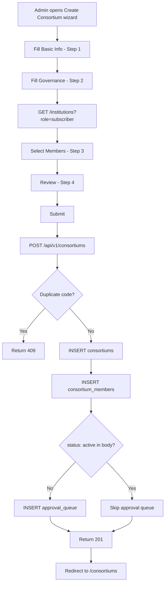
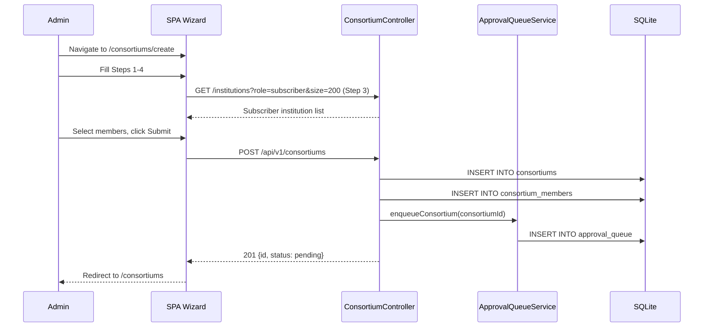

# EPIC-03 — Consortium Management

> **Epic Code:** CONS | **Story Range:** CONS-US-001–007
> **Owner:** Platform Engineering | **Priority:** P0–P2
> **Implementation Status:** ✅ Fully Implemented

---

## 1. Executive Summary

### Purpose
Consortiums are governed groups of financial institutions that agree to share credit data under defined policies (data visibility, governance model, sharing rules). The Consortium Management module enables bureau administrators to create, configure, and manage consortiums and their membership.

### Business Value
- Enables industry-vertical credit data pooling (e.g. retail lenders, microfinance institutions)
- Enforces data-sharing governance rules (full / masked_PII / derived visibility)
- Supports tiered membership roles (Contributor, Consumer, Observer) for controlled access
- Provides consortium-scoped credit enquiries for subscribers

### Key Capabilities
1. Multi-step wizard to create a consortium (type, governance, data policy)
2. Member addition from subscriber institution pool (no mock catalogue)
3. Membership role management (Contributor / Consumer / Observer)
4. Consortium lifecycle: pending → active → suspended → dissolved
5. Approval queue integration on creation

---

## 2. Scope

### In Scope
- Consortium creation wizard
- Consortium list and detail pages
- Member management (add, role assignment, suspend/exit)
- Data policy configuration (share_loan_data, share_repayment_history, allow_aggregation, data_visibility)
- Consortium lifecycle management (approve, suspend, dissolve)
- Approval queue integration (type: `consortium`)

### Out of Scope
- Inter-consortium data sharing
- Consortium-level billing (billed at institution level)
- Regulatory filing for consortium formation

---

## 3. Personas

| Persona | Role | Needs |
|---------|------|-------|
| Bureau Administrator | SUPER_ADMIN / BUREAU_ADMIN | Create and manage consortiums, approve membership |
| Data Analyst | ANALYST | View consortium details and membership |
| Institution Operator | — | Be added as a member (via bureau admin, not self-service) |

---

## 4. Features Overview

| Feature | Description | Status |
|---------|-------------|--------|
| Create Consortium Wizard | Type, governance, data policy, members | ✅ Implemented |
| Consortium List | Paginated list with status filter | ✅ Implemented |
| Consortium Detail | Header, data policy, members table | ✅ Implemented |
| Add Member | Add subscriber institution with role | ✅ Implemented |
| Manage Member Role | Change Contributor/Consumer/Observer | ✅ Implemented |
| Suspend/Exit Member | Remove member from consortium | ✅ Implemented |
| Dissolve Consortium | Status → dissolved | ✅ Implemented |

---

## 5. Epic-Level UI Requirements

### Screens

| Screen | Path | Description |
|--------|------|-------------|
| Consortium List | `/consortiums` | Paginated list with status filter |
| Create Consortium Wizard | `/consortiums/create` | Multi-step wizard |
| Consortium Detail | `/consortiums/:id` | Detail view with members |

### Component Behavior
- **Consortium type badge:** `Closed`=blue, `Open`=green, `Hybrid`=purple
- **Status badge:** `pending`=yellow, `active`=green, `suspended`=orange, `dissolved`=gray
- **Member role badge:** `Contributor`=blue, `Consumer`=green, `Observer`=gray
- **Members wizard step:** Loads institution list with `role=subscriber`, `allowMockFallback: false`, `size=200`

### State Handling
| State | UI Behavior |
|-------|-------------|
| Loading list | `SkeletonTable` |
| Empty list | EmptyState with "Create consortium" CTA |
| Wizard member step loading | Loading spinner in institution picker |

---

## 6. Epic-Level UI Test Cases

| Test ID | Screen | Scenario | Steps | Expected Result |
|---------|--------|----------|-------|----------------|
| CONS-UI-TC-01 | List | Load consortium list | Navigate to /consortiums | Table with consortium rows |
| CONS-UI-TC-02 | Wizard | Complete consortium creation | Fill all wizard steps, submit | Consortium created, redirected to list |
| CONS-UI-TC-03 | Wizard | Members step loads subscribers | Reach Members step | Only subscriber institutions shown |
| CONS-UI-TC-04 | Detail | View consortium detail | Click consortium in list | Detail page with members table |
| CONS-UI-TC-05 | Detail | Add member | Click Add Member, select institution | Member added with pending status |

---

## 7. Story-Centric Requirements

---

### CONS-US-001 — Create Consortium via Wizard

#### 1. Description
> As a bureau administrator,
> I want to create a consortium through a guided wizard,
> So that a data-sharing group is correctly configured with governance policies.

#### 2. Acceptance Criteria

```gherkin
  Scenario: Successful consortium creation
    Given I am logged in as BUREAU_ADMIN
    When I complete the consortium creation wizard
    And I submit without setting status: active
    Then POST /api/v1/consortiums is called
    And the consortium is created with status "pending"
    And an approval_queue item with type "consortium" is created

  Scenario: Create consortium with immediate activation
    When I submit with body containing status: active
    Then the consortium is created with status "active"
    And no approval_queue item is created

  Scenario: Duplicate consortium code
    When I submit with an existing consortium_code
    Then I receive a 409 Conflict error
```

#### 3. Wizard Steps

**Step 1 — Basic Info**
| Field | Type | Required |
|-------|------|----------|
| Consortium Name | text | Yes |
| Consortium Code | text | Yes (auto-suggested from name) |
| Consortium Type | select: Closed, Open, Hybrid | Yes |
| Purpose | text | No |
| Description | textarea | No |

**Step 2 — Governance**
| Field | Type | Required |
|-------|------|----------|
| Governance Model | select: Centralized, Federated, Hybrid Board | No |
| Share Loan Data | checkbox | — |
| Share Repayment History | checkbox | — |
| Allow Aggregation | checkbox | — |
| Data Visibility | select: full, masked_pii, derived | No |

**Step 3 — Members**
- Institution picker loaded from `GET /api/v1/institutions?role=subscriber&page=0&size=200`
- `allowMockFallback: false` — must come from real API
- Each selected member gets a role assignment (Contributor / Consumer / Observer)

**Step 4 — Review**
- Read-only summary of all configuration

#### 4. API Requirements

**Endpoint:** `POST /api/v1/consortiums`

**Request:**
```json
{
  "consortiumName": "East Africa Retail Credit Consortium",
  "consortiumCode": "EARCC-001",
  "consortiumType": "Closed",
  "governanceModel": "Centralized",
  "shareLoanData": true,
  "shareRepaymentHistory": true,
  "allowAggregation": false,
  "dataVisibility": "masked_pii",
  "members": [
    {"institutionId": 1, "memberRole": "Contributor"},
    {"institutionId": 2, "memberRole": "Consumer"}
  ]
}
```

**Response (201):**
```json
{
  "id": 3,
  "consortiumCode": "EARCC-001",
  "consortiumName": "East Africa Retail Credit Consortium",
  "consortiumStatus": "pending"
}
```

**Side Effects:**
- `approval_queue` row inserted with `approval_item_type='consortium'`, unless `status: active` explicitly sent

#### 5. Database

```sql
INSERT INTO consortiums (consortium_code, consortium_name, consortium_type,
  consortium_status, governance_model, share_loan_data, share_repayment_history,
  allow_aggregation, data_visibility)
VALUES ('EARCC-001', 'East Africa Retail Credit Consortium', 'Closed',
  'pending', 'Centralized', 1, 1, 0, 'masked_pii');

-- Members
INSERT INTO consortium_members (consortium_id, institution_id, member_role, consortium_member_status)
VALUES (3, 1, 'Contributor', 'pending'), (3, 2, 'Consumer', 'pending');

-- Approval queue
INSERT INTO approval_queue (approval_item_type, entity_ref_id, entity_name_snapshot, approval_workflow_status)
VALUES ('consortium', '3', 'East Africa Retail Credit Consortium', 'pending');
```

#### 6. Flowchart



#### 7. Swimlane Diagram



#### 8. Status / State Management

| Status | Description | Trigger | Next States |
|--------|-------------|---------|-------------|
| `pending` | Created, awaiting approval | POST /consortiums (default) | `active` |
| `active` | Operational, members can share data | Approval approve / POST with status:active | `suspended`, `dissolved` |
| `suspended` | Temporarily inactive | Admin action | `active`, `dissolved` |
| `dissolved` | Permanently closed | Admin action | Terminal |

#### 9. Edge Cases

| Scenario | Handling |
|----------|----------|
| No members selected | Warning shown, wizard allows empty members (members added later) |
| Institution not a subscriber | Not shown in member picker (filtered by role=subscriber) |
| Member already in consortium | 409 UNIQUE constraint on `(consortium_id, institution_id)` |

#### 10. UI Test Cases

| Test ID | Scenario | Steps | Expected Result |
|---------|----------|-------|----------------|
| CONS-US-001-TC-01 | Full creation | Complete all 4 steps, submit | 201, consortium in list |
| CONS-US-001-TC-02 | Duplicate code | Submit with existing code | 409 shown to user |
| CONS-US-001-TC-03 | Member picker | Reach Step 3 | Only subscriber institutions listed |
| CONS-US-001-TC-04 | No members | Submit without members | Consortium created, empty members |

#### 11. Functional Test Cases

| Test ID | Scenario | Expected |
|---------|----------|----------|
| CONS-US-001-FTC-01 | POST valid payload | 201, status pending |
| CONS-US-001-FTC-02 | POST with status:active | 201, status active, no approval queue item |
| CONS-US-001-FTC-03 | Duplicate consortium_code | 409 |
| CONS-US-001-FTC-04 | Missing required fields | 400 |
| CONS-US-001-FTC-05 | Approval queue created | GET /approvals → new item with type consortium |

#### 12. Definition of Done
- [ ] POST /consortiums creates consortium with pending status by default
- [ ] Members inserted into consortium_members
- [ ] Approval queue item created on creation (unless status:active)
- [ ] Duplicate code returns 409
- [ ] Members wizard step loads only subscriber institutions without mock fallback

---

### CONS-US-002 — View Consortium List

#### 1. Description
> As a bureau administrator,
> I want to browse all consortiums with their status,
> So that I can manage data-sharing groups.

#### 2. API Requirements

`GET /api/v1/consortiums?status=&page=0&size=20`

**Response:** Paged list of consortiums with `id`, `consortiumCode`, `consortiumName`, `consortiumType`, `consortiumStatus`, `memberCount`

#### 3. Definition of Done
- [ ] List loads with consortium rows
- [ ] Filter by status works
- [ ] Empty state shown when none exist

---

### CONS-US-003 — View Consortium Detail

#### 1. Description
> As a bureau administrator,
> I want to see consortium configuration details and member list,
> So that I understand its governance setup.

#### 2. API Requirements

`GET /api/v1/consortiums/:id`

**Response includes:** `consortiumName`, `consortiumType`, `consortiumStatus`, `governanceModel`, data policy flags, `members[]` with role and status

#### 3. Definition of Done
- [ ] Detail page shows all consortium fields
- [ ] Member table shows all members with roles and status

---

### CONS-US-004 — Add Member Institution to Consortium

#### 1. Description
> As a bureau administrator,
> I want to add a subscriber institution as a consortium member,
> So that it can participate in the data-sharing agreement.

#### 2. API Requirements

`POST /api/v1/consortiums/:id/members`

**Request:**
```json
{
  "institutionId": 5,
  "memberRole": "Contributor"
}
```

**Response (201):**
```json
{
  "id": 12,
  "consortiumId": 3,
  "institutionId": 5,
  "memberRole": "Contributor",
  "consortiumMemberStatus": "pending"
}
```

**Side Effects:** May create `approval_queue` item with `type: consortium_membership`

#### 3. Business Logic
- Only subscriber institutions can be added as members
- Duplicate member returns 409
- New member status defaults to `pending` (requires consortium activation)

#### 4. Definition of Done
- [ ] POST creates consortium_members row
- [ ] Duplicate institution returns 409
- [ ] Member appears in consortium detail member table

---

### CONS-US-005 — Manage Member Role in Consortium

#### 1. Description
> As a bureau administrator,
> I want to change a member's role between Contributor, Consumer, and Observer,
> So that data access levels can be adjusted.

#### 2. API Requirements

`PATCH /api/v1/consortiums/:id/members/:memberId`

**Request:** `{ "memberRole": "Consumer" }`

**Role Definitions:**
| Role | Can Submit Data | Can Query Data |
|------|:-:|:-:|
| Contributor | ✅ | ❌ |
| Consumer | ❌ | ✅ |
| Observer | ❌ | ❌ (analytics only) |

#### 3. Definition of Done
- [ ] PATCH updates member_role in consortium_members
- [ ] Audit log written on role change

---

### CONS-US-006 — Suspend or Exit a Consortium Member

#### 1. Description
> As a bureau administrator,
> I want to suspend or remove a member from a consortium,
> So that non-compliant or exited institutions are excluded from data sharing.

#### 2. API Requirements

**Suspend:** `PATCH /api/v1/consortiums/:id/members/:memberId` with `{ "status": "suspended" }`

**Exit:** `DELETE /api/v1/consortiums/:id/members/:memberId` (soft delete: `consortium_member_status='exited'`)

#### 3. Status Transitions
`pending` → `active` → `suspended` → `active` or `exited`
`exited` is terminal.

#### 4. Definition of Done
- [ ] Member status updated correctly
- [ ] Exited member excluded from all data-sharing queries

---

### CONS-US-007 — Dissolve a Consortium

#### 1. Description
> As a bureau administrator,
> I want to dissolve an inactive consortium,
> So that it is cleanly archived and no longer active for data sharing.

#### 2. API Requirements

`PATCH /api/v1/consortiums/:id/status`

**Request:** `{ "status": "dissolved" }`

#### 3. Business Logic
- `dissolved` is a terminal state — cannot be reactivated
- All active consortium_members are set to `exited`
- Soft delete: `is_deleted=1`, `deleted_at=NOW()`

#### 4. Definition of Done
- [ ] Consortium status updated to dissolved
- [ ] All members transitioned to exited
- [ ] Consortium no longer appears in active consortium lists

---

## 8. Epic API Summary

| Endpoint | Method | Auth | Description | Status |
|----------|--------|------|-------------|--------|
| `GET /api/v1/consortiums` | GET | Bearer | List consortiums | ✅ |
| `POST /api/v1/consortiums` | POST | Bearer (Admin) | Create consortium | ✅ |
| `GET /api/v1/consortiums/:id` | GET | Bearer | Consortium detail | ✅ |
| `PATCH /api/v1/consortiums/:id/status` | PATCH | Bearer (Admin) | Change status | ✅ |
| `POST /api/v1/consortiums/:id/members` | POST | Bearer (Admin) | Add member | ✅ |
| `PATCH /api/v1/consortiums/:id/members/:mId` | PATCH | Bearer (Admin) | Update member role/status | ✅ |
| `DELETE /api/v1/consortiums/:id/members/:mId` | DELETE | Bearer (Admin) | Exit member | ✅ |

---

## 9. Database Summary

| Table | Key Fields | Notes |
|-------|------------|-------|
| `consortiums` | `id`, `consortium_code`, `consortium_name`, `consortium_type`, `consortium_status`, data policy flags | Core entity |
| `consortium_members` | `consortium_id`, `institution_id`, `member_role`, `consortium_member_status` | Membership mapping |
| `approval_queue` | `approval_item_type='consortium'` or `'consortium_membership'` | Governance workflow |

---

## 10. Epic Workflows

### Workflow: Consortium Formation
```
Create wizard (Steps 1-4) →
  POST /consortiums → status: pending →
  Approval queue item (type: consortium) →
  Bureau admin approves →
    status: active →
  Members can now share data under consortium policy
```

---

## 11. KPIs

| KPI | Target |
|-----|--------|
| Average consortium formation time | < 2 business days |
| Active consortium count | Tracked quarterly |
| Member addition rate | Tracked per consortium |

---

## 12. Risks

| Risk | Impact | Mitigation |
|------|--------|-----------|
| Member added to wrong consortium | Data leak risk | Require approval for membership addition |
| Dissolved consortium data access | Medium | Ensure dissolved status blocks all data queries immediately |

---

## 13. Gap Analysis

No significant gaps. All consortium CRUD and membership management is implemented in Spring.

---

## 14. Execution Roadmap

| Phase | Stories | Description |
|-------|---------|-------------|
| Phase 1 | CONS-US-001–007 | All implemented — production-ready |
| Phase 2 | — | Add consortium-level reporting and analytics |
| Phase 3 | — | Inter-consortium data federation |
| Phase 4 | CONS-US-001 | Regulatory filing integration for consortium formation |
