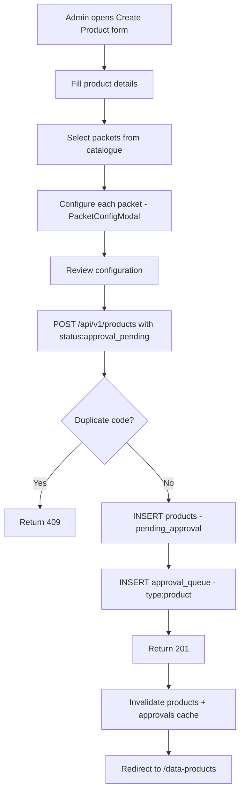
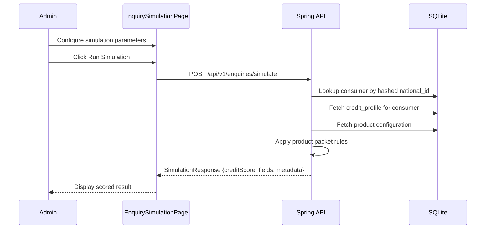

# EPIC-04 — Data Products, Packet Configurator & Enquiry Simulation

> **Epic Code:** PROD | **Story Range:** PROD-US-001–010
> **Owner:** Platform Engineering | **Priority:** P0–P1
> **Implementation Status:** ✅ Mostly Implemented (PROD-US-009 Partial, PROD-US-010 Missing)

---

## 1. Executive Summary

### Purpose
Data Products are the monetizable units of the HCB credit bureau — defining what credit data can be queried, from which data sources, and by whom. This epic covers the full product lifecycle: catalogue browsing, product creation, packet-level field configuration through `PacketConfigModal`, approval workflow, subscription management, and enquiry simulation for pre-go-live validation.

### Business Value
- Standardised product definitions ensure consistent credit data delivery to subscribers
- Packet-level configuration allows granular control over raw, derived, and source fields
- Enquiry simulation enables product testing without impacting live consumer records
- Approval gating prevents untested or misconfigured products from going live
- Subscription management provides clean entitlement tracking per institution

### Key Capabilities
1. Browse and manage the data product catalogue
2. Create products with `coverage_scope`, `enquiry_impact`, `pricing_model`, `data_mode`
3. Select and configure packets from `GET /products/packet-catalog` (source-type grouped)
4. `PacketConfigModal` for Raw/Derived/Sources field configuration per packet
5. Submit product for approval → enqueue `type: product` in approval_queue
6. Subscribe institutions to products
7. Simulate an enquiry against a product configuration
8. View scored simulation output

---

## 2. Scope

### In Scope
- Product list page with status filter
- Create product form (multi-step with packet selection and configuration)
- Packet catalogue fetch and display (source-type grouped, catalogue order)
- `PacketConfigModal` — Raw/Derived/Sources tabs, per-packet configuration
- Product detail page
- Product approval submission
- Institution product subscription management
- Product deprecation
- Enquiry simulation configuration (`EnquirySimulationPage.tsx`)
- Enquiry simulation execution and result viewing (PROD-US-010 — partially missing)

### Out of Scope
- Product pricing engine (rate calculation, invoice generation)
- Product versioning / migration of subscribers between versions
- Custom product types not in the packet catalogue

---

## 3. Personas

| Persona | Role | Needs |
|---------|------|-------|
| Bureau Administrator | SUPER_ADMIN / BUREAU_ADMIN | Create, configure, approve, and manage data products |
| Data Analyst | ANALYST | View products and simulation results |
| Product Manager | BUREAU_ADMIN | Define packet configurations and test via simulation |
| Subscriber Institution | API_USER | Query products via Enquiry API (managed separately) |

---

## 4. Features Overview

| Feature | Description | Status |
|---------|-------------|--------|
| Product List | Paginated list with status filter | ✅ Implemented |
| Create Product | Form with coverage scope, pricing, enquiry impact | ✅ Implemented |
| Packet Catalogue | Source-type grouped catalogue from API | ✅ Implemented |
| Packet Configuration (PacketConfigModal) | Raw/Derived/Sources tabs per packet | ✅ Implemented |
| Product Approval Submission | Submit with status: approval_pending | ✅ Implemented |
| Product Detail | Full configuration view | ✅ Implemented |
| Institution Subscription | Subscribe member to product | ✅ Implemented |
| Product Deprecation | Mark product as deprecated | ✅ Implemented |
| Enquiry Simulation Config | Configure simulation parameters | ⚠️ Partial |
| Enquiry Simulation Execution | Run simulation and view scored result | ❌ Missing |

---

## 5. Epic-Level UI Requirements

### Screens

| Screen | Path | Description |
|--------|------|-------------|
| Product List | `/data-products` | Paginated product list |
| Create Product | `/data-products/create` | Product creation form |
| Product Detail | `/data-products/:id` | Full product configuration view |
| Enquiry Simulation | `/agents/enquiry-simulation` | Simulation configuration and execution |

### Component Behavior

**Product List:**
- One row per product; status badge colour-coded: `draft`=gray, `pending_approval`=yellow, `active`=green, `deprecated`=red
- Filter by status, search by name

**Create Product Form — Packet Selection:**
- Packets grouped by **source type** (one row per distinct source type within a category)
- Excludes `custom` and `Synthetic / Test` categories
- Selected `packetIds` sorted in catalogue order
- Primary row label = human-readable source type only (e.g. "Bank") — no packet descriptions or subtitles
- One "Configure" button per source-type row → opens `PacketConfigModal`

**PacketConfigModal:**
- Modal has `sr-only` dialog title (accessible but not visually prominent)
- Visible chrome: Source type badge, optional Packet switcher (when multiple packets share same source type), Sources tab, Raw/Derived tabs
- Sources tab: registry entries from `GET /api/v1/schema-mapper/schemas?sourceType=`
- Raw tab: field paths from `GET /api/v1/schema-mapper/schemas/source-type-fields?sourceType=` merged with packet-only catalogue fields
- Raw tab: each **selected** raw field has an **Enabled** toggle; disabling keeps the field selected but omits it from the product output/mapping
- Derived tab: field names from each catalogue row's `derivedFields`
- Packet switcher (catalogue labels) visible when multiple packets in group; "Save configuration" persists `packetConfigs` for each packet

### State Handling
| State | UI Behavior |
|-------|-------------|
| Loading products | SkeletonTable |
| Empty products | EmptyState with "Create your first product" CTA |
| PacketConfigModal loading | Skeleton within modal content area |
| Packet catalogue loading | Loading state in packet selection area |

---

## 6. Epic-Level UI Test Cases

| Test ID | Screen | Scenario | Steps | Expected Result |
|---------|--------|----------|-------|----------------|
| PROD-UI-TC-01 | List | Load product list | Navigate to /data-products | Product rows with status badges |
| PROD-UI-TC-02 | Create | Packet catalogue loads | Reach packet selection step | Packets grouped by source type |
| PROD-UI-TC-03 | Create | Open PacketConfigModal | Click Configure on a packet row | Modal opens with Raw/Derived/Sources tabs |
| PROD-UI-TC-04 | Create | Submit for approval | Complete form, click Submit | Product created with pending_approval status |
| PROD-UI-TC-05 | Detail | View product detail | Click product in list | All configuration details visible |
| PROD-UI-TC-06 | Simulation | Configure simulation | Navigate to /agents/enquiry-simulation | Simulation configuration form shown |

---

## 7. Story-Centric Requirements

---

### PROD-US-001 — Browse the Data Product Catalogue

#### 1. Description
> As a bureau administrator,
> I want to see all available and pending products,
> So that I can manage the product catalogue.

#### 2. API Requirements

`GET /api/v1/products?status=&page=0&size=20`

**Response:**
```json
{
  "content": [
    {
      "id": 1,
      "productCode": "CREDIT-STD-001",
      "productName": "Standard Credit Report",
      "productStatus": "active",
      "enquiryImpact": "HARD",
      "coverageScope": "NETWORK",
      "pricingModel": "PER_HIT"
    }
  ],
  "totalElements": 4,
  "page": 0,
  "size": 20
}
```

#### 3. Definition of Done
- [ ] List loads with product rows
- [ ] Filter by status works
- [ ] Empty state shown when no products

---

### PROD-US-002 — Create a New Data Product

#### 1. Description
> As a bureau administrator,
> I want to define a new data product with coverage scope and pricing model,
> So that it can be offered to subscribing member institutions.

#### 2. Acceptance Criteria

```gherkin
  Scenario: Create product with approval
    Given I am logged in as BUREAU_ADMIN
    When I submit the create product form
    Then POST /api/v1/products is called with status: approval_pending
    And the product is created with status "pending_approval"
    And an approval_queue item with type "product" and metadata.productId is created

  Scenario: Duplicate product code
    When I submit with an existing product_code
    Then I receive a 409 error
```

#### 3. UI/UX Requirements

| Field | Type | Options | Required |
|-------|------|---------|----------|
| Product Name | text | — | Yes |
| Product Code | text | — | Yes (unique) |
| Description | textarea | — | No |
| Enquiry Impact | select | HARD, SOFT | Yes |
| Coverage Scope | select | SELF, CONSORTIUM, NETWORK, VERTICAL | Yes |
| Data Mode | select | LIVE, SANDBOX, TEST | Yes |
| Pricing Model | select | PER_HIT, SUBSCRIPTION, HYBRID | Yes |

#### 4. API Requirements

`POST /api/v1/products`

**Request:**
```json
{
  "productCode": "CREDIT-STD-002",
  "productName": "Enhanced Credit Profile",
  "enquiryImpact": "HARD",
  "coverageScope": "NETWORK",
  "dataMode": "LIVE",
  "pricingModel": "PER_HIT",
  "status": "approval_pending",
  "packetIds": [1, 3, 5],
  "packetConfigs": {
    "1": { "rawFields": ["loan_amount", "dpd_days"], "derivedFields": ["credit_score"] }
  }
}
```

**Response (201):**
```json
{
  "id": 5,
  "productCode": "CREDIT-STD-002",
  "productStatus": "pending_approval"
}
```

**Side Effects:** `approval_queue` row with `approval_item_type='product'`, `metadata.productId=5`

#### 5. Database

```sql
INSERT INTO products (product_code, product_name, enquiry_impact,
  coverage_scope, data_mode, pricing_model, product_status)
VALUES ('CREDIT-STD-002', 'Enhanced Credit Profile', 'HARD',
  'NETWORK', 'LIVE', 'PER_HIT', 'pending_approval');

INSERT INTO approval_queue (approval_item_type, entity_ref_id,
  entity_name_snapshot, approval_workflow_status)
VALUES ('product', '5', 'Enhanced Credit Profile', 'pending');
```

#### 6. Status / State Management

| Status | Description | Trigger | Next States |
|--------|-------------|---------|-------------|
| `draft` | Started but not submitted | Default | `pending_approval` |
| `pending_approval` | Submitted for review | POST with approval_pending | `active` |
| `active` | Live and queryable | Approval approve | `deprecated` |
| `deprecated` | Retired | Admin action | Terminal |

#### 7. Flowchart



#### 8. Definition of Done
- [ ] POST creates product with pending_approval status
- [ ] Approval queue item created with metadata.productId
- [ ] Duplicate product code returns 409

---

### PROD-US-003 — Browse the Packet Catalogue

#### 1. Description
> As a bureau administrator,
> I want to see available source-type packets,
> So that I can select the right data inputs for a product.

#### 2. API Requirements

`GET /api/v1/products/packet-catalog`

**Response:**
```json
[
  {
    "packetId": 1,
    "packetLabel": "Core Credit Data",
    "category": "Credit Bureau",
    "sourceType": "CBS",
    "description": "Core loan and repayment data from core banking system",
    "derivedFields": ["credit_score", "dpd_band", "total_exposure"]
  },
  {
    "packetId": 2,
    "packetLabel": "Bank Statement Analysis",
    "category": "Alternate Data",
    "sourceType": "Bank",
    "description": "Income, obligations, and cash flow from bank statements",
    "derivedFields": ["monthly_income_estimate", "obligation_ratio"]
  }
]
```

#### 3. Business Logic
- SPA source: `src/data/data-products.json` → `productCatalogPacketOptions`
- Spring source: `classpath:catalog/product-packet-catalog.json`
- Both files must be kept in sync when catalogue changes
- Displayed grouped by **source type** in product form
- Excludes categories: `custom`, `Synthetic / Test`

#### 4. Definition of Done
- [ ] GET /products/packet-catalog returns full catalogue
- [ ] Response includes `sourceType`, `category`, and `derivedFields` per packet
- [ ] SPA and Spring JSON files are in sync

---

### PROD-US-004 — Configure Packet for a Data Product (PacketConfigModal)

#### 1. Description
> As a bureau administrator,
> I want to configure raw, derived, and source fields for each selected packet,
> So that the product delivers exactly the right data to subscribers.

#### 2. UI/UX Requirements

**PacketConfigModal structure:**
- **Triggered by:** "Configure" button on each source-type row in product form
- **Dialog title:** `sr-only` (not visually rendered — accessibility only)
- **Source type badge:** Visible header showing the source type (e.g. "Bank")
- **Packet switcher:** Tab bar with packet labels, visible only when multiple packets share same source type
- **Tabs:**
  - **Sources:** Institution registry entries from `GET /api/v1/schema-mapper/schemas?sourceType=<type>`
  - **Raw:** Field paths from `GET /api/v1/schema-mapper/schemas/source-type-fields?sourceType=<type>` ∪ packet-only catalogue fields
  - **Derived:** Field names from `derivedFields` array in catalogue packet entry
- **"Save configuration" button:** Persists `packetConfigs[packetId]` for each packet in the source-type group

**PacketConfig data shape:**
```typescript
{
  rawFields: string[],       // selected raw field paths
  disabledRawFields?: string[], // subset of rawFields that are selected but disabled
  derivedFields: string[],   // selected derived field names
  sourceIds: string[]        // selected source registry entry IDs
}
```

#### 3. API Requirements (within modal)

`GET /api/v1/schema-mapper/schemas?sourceType=<type>` — Sources tab data
`GET /api/v1/schema-mapper/schemas/source-type-fields?sourceType=<type>` — Raw fields data

#### 4. Business Logic
- `sourceType` filter is **mandatory** — returns 400 if missing or `all`
- `catalogOptions` prop passed from form so modal lookups match `GET /products/packet-catalog` response
- One `packetConfig` entry per packet ID; modal manages all packets in the source-type group

#### 5. Definition of Done
- [ ] Modal opens with correct source type and packet switcher
- [ ] Raw, Derived, Sources tabs load correct data
- [ ] Save configuration persists packetConfigs for all packets in group
- [ ] sr-only dialog title passes accessibility check

---

### PROD-US-005 — Submit Product for Approval

#### 1. Description
> As a bureau administrator,
> I want to submit a product for governance review,
> So that it goes through the approval workflow before going live.

#### 2. Business Logic
- Status on submit: `approval_pending` (stored as `pending_approval` in DB)
- `ApprovalQueueService.enqueueProduct()` called after product insert
- Approving the product in the approval queue changes `product_status → active`
- Rejecting leaves it in `pending_approval` with rejection reason

#### 3. Approval Queue Integration

`approval_item_type = 'product'`
`entity_ref_id = '<product_id>'`
`metadata.productId = '<product_id>'` (in API response)

#### 4. Definition of Done
- [ ] POST /products with approval_pending creates product at pending_approval
- [ ] Approval queue item created with type product and productId metadata
- [ ] Approving in approval queue changes product to active

---

### PROD-US-006 — View Product Detail

#### 1. Description
> As a bureau administrator,
> I want to see full product configuration including packet selections,
> So that I can audit or update it.

#### 2. API Requirements

`GET /api/v1/products/:id`

**Response includes:** All product fields, `packetIds[]`, `packetConfigs{}`, subscription count

#### 3. Definition of Done
- [ ] Detail page shows all product fields
- [ ] Packet configuration visible
- [ ] Subscription count shown

---

### PROD-US-007 — Subscribe an Institution to a Product

#### 1. Description
> As a bureau administrator,
> I want to subscribe a member institution to a product,
> So that it can use the product for credit enquiries.

#### 2. API Requirements

`POST /api/v1/institutions/:id/product-subscriptions`

**Request:**
```json
{
  "productId": 1,
  "subscriptionStatus": "active",
  "expiresAt": "2027-01-01T00:00:00Z"
}
```

**Constraints:**
- Product must be `active` to subscribe
- Institution must be `active` to subscribe
- Duplicate subscription returns 409

#### 3. Database

```sql
INSERT INTO product_subscriptions (institution_id, product_id, subscription_status, subscribed_at)
VALUES (2, 1, 'active', CURRENT_TIMESTAMP);
```

#### 4. Definition of Done
- [ ] Subscription created in product_subscriptions table
- [ ] Duplicate subscription returns 409
- [ ] Inactive product returns 400

---

### PROD-US-008 — Deprecate or Edit a Product

#### 1. Description
> As a bureau administrator,
> I want to deprecate an outdated product,
> So that members are migrated to newer versions and the old product is retired.

#### 2. API Requirements

`PATCH /api/v1/products/:id`

**Request (deprecate):** `{ "productStatus": "deprecated" }`

**Business Logic:**
- `deprecated` is a terminal state
- Existing active subscriptions not automatically terminated (graceful wind-down)
- Deprecated products not shown to new subscribers

#### 3. Definition of Done
- [ ] Product status updated to deprecated
- [ ] Deprecated product filtered from new subscription picker

---

### PROD-US-009 — Configure Enquiry Simulation Parameters

#### 1. Description
> As a bureau administrator,
> I want to configure simulation parameters (consumer profile, product, institution),
> So that I can test product behaviour before go-live.

#### 2. Status: ⚠️ Partial

`EnquirySimulationPage.tsx` is partially implemented as a UI page under `src/pages/agents/`. The configuration form exists in the SPA but the simulation execution API is not yet implemented in Spring.

#### 3. Configuration Parameters

| Parameter | Type | Description |
|-----------|------|-------------|
| Institution | select | Requesting institution (subscriber) |
| Product | select | Target data product |
| Consumer National ID Type | select | PAN, NIN, PASSPORT, etc. |
| Consumer National ID | text | Hashed consumer identifier |
| Enquiry Type | select | HARD, SOFT |
| Enquiry Purpose | text | Loan origination, etc. |
| Consent Reference | text | AA consent artefact ID |

#### 4. Definition of Done
- [ ] Configuration form renders with institution and product pickers
- [ ] Form fields map to simulation API payload schema
- [ ] Validation applied before execution

---

### PROD-US-010 — Run Enquiry Simulation and View Scored Output

#### 1. Description
> As a bureau administrator,
> I want to execute a simulated enquiry and see the scored response,
> So that I can validate product configuration before making it live.

#### 2. Status: ❌ Missing

The simulation execution endpoint `POST /api/v1/enquiries/simulate` does not exist in Spring. This story documents the full intended behaviour.

#### 3. API Requirements (Planned)

`POST /api/v1/enquiries/simulate`

**Request:**
```json
{
  "institutionId": 2,
  "productId": 1,
  "consumerNationalIdType": "PAN",
  "consumerNationalId": "ABCDE1234F",
  "enquiryType": "HARD",
  "enquiryPurpose": "Loan Origination",
  "consentReference": "AA-CONSENT-12345"
}
```

**Response (planned):**
```json
{
  "simulationId": "SIM-2026-001",
  "enquiryStatus": "COMPLETED",
  "consumerFound": true,
  "creditScore": 720,
  "totalExposure": 450000.00,
  "activeAccounts": 3,
  "delinquentAccounts": 0,
  "worstDpdDays": 0,
  "productResponse": {
    "rawFields": { "loan_amount": 150000, "dpd_days": 0 },
    "derivedFields": { "credit_score": 720, "dpd_band": "0-30" }
  },
  "simulationMetadata": {
    "isSimulation": true,
    "executedAt": "2026-03-31T10:00:00Z",
    "productId": 1,
    "productName": "Standard Credit Report"
  }
}
```

#### 4. Gap: Missing simulation API — implement `POST /api/v1/enquiries/simulate` in Spring.

#### 5. Swimlane Diagram



#### 6. Definition of Done
- [ ] `POST /api/v1/enquiries/simulate` endpoint implemented in Spring
- [ ] Simulation uses real consumer/product data but flags `isSimulation: true`
- [ ] Result displayed in EnquirySimulationPage
- [ ] Simulation does not create a real `enquiries` record (no credit footprint)

---

## 8. Epic API Summary

| Endpoint | Method | Auth | Description | Status |
|----------|--------|------|-------------|--------|
| `GET /api/v1/products` | GET | Bearer | List products | ✅ |
| `POST /api/v1/products` | POST | Bearer (Admin) | Create product | ✅ |
| `GET /api/v1/products/:id` | GET | Bearer | Product detail | ✅ |
| `PATCH /api/v1/products/:id` | PATCH | Bearer (Admin) | Update / deprecate | ✅ |
| `GET /api/v1/products/packet-catalog` | GET | Bearer | Get packet catalogue | ✅ |
| `GET /api/v1/schema-mapper/schemas?sourceType=` | GET | Bearer | Sources for modal | ✅ |
| `GET /api/v1/schema-mapper/schemas/source-type-fields?sourceType=` | GET | Bearer | Raw fields for modal | ✅ |
| `POST /api/v1/institutions/:id/product-subscriptions` | POST | Bearer (Admin) | Subscribe institution | ✅ |
| `POST /api/v1/enquiries/simulate` | POST | Bearer | Run enquiry simulation | ❌ Missing |

---

## 9. Database Summary

| Table | Key Fields | Notes |
|-------|------------|-------|
| `products` | `id`, `product_code`, `product_name`, `product_status`, `enquiry_impact`, `coverage_scope` | Core catalogue |
| `product_subscriptions` | `institution_id`, `product_id`, `subscription_status` | Entitlement mapping |
| `approval_queue` | `approval_item_type='product'`, `entity_ref_id` | Governance workflow |

---

## 10. Epic Workflows

### Workflow: Product Go-Live
```
Create product form →
  Select packets → Configure via PacketConfigModal →
  POST /products (approval_pending) →
  Approval queue item (type: product) →
  Bureau admin approves →
    product_status: active →
  Subscribe institutions →
  Product available for enquiries
```

### Workflow: Pre-Launch Testing via Simulation
```
Product created (draft/active) →
  Configure simulation (institution, consumer, product) →
  POST /enquiries/simulate →
  Receive scored response →
  Validate field output against product spec →
  Approve for production if correct
```

---

## 11. KPIs

| KPI | Target |
|-----|--------|
| Time from product creation to active | < 2 business days |
| Active product count | Tracked per bureau |
| Average packets per product | Tracked for catalogue optimisation |
| Simulation usage rate before go-live | Target: 100% of new products simulated |

---

## 12. Risks

| Risk | Impact | Mitigation |
|------|--------|-----------|
| Packet catalogue out of sync (SPA vs Spring) | Wrong packets shown in form | CI check to validate JSON parity |
| Simulation creates real credit footprints | Regulatory risk | Enforce `isSimulation: true` flag; no real enquiry record created |
| Product activated without simulation | Data quality risk | Mandate simulation in approval workflow |

---

## 13. Gap Analysis

| Gap | Story | Severity |
|-----|-------|----------|
| `POST /api/v1/enquiries/simulate` missing | PROD-US-010 | High |
| `EnquirySimulationPage.tsx` partially implemented | PROD-US-009 | Medium |
| Product catalogue sync between SPA and Spring JSON not enforced | PROD-US-003 | Medium |

---

## 14. Execution Roadmap

| Phase | Stories | Description |
|-------|---------|-------------|
| Phase 1 | PROD-US-001–008 | All implemented — production-ready |
| Phase 2 | PROD-US-009 | Complete EnquirySimulationPage UI wiring |
| Phase 3 | PROD-US-010 | Implement POST /enquiries/simulate in Spring |
| Phase 4 | — | Product versioning, subscriber migration tools |
