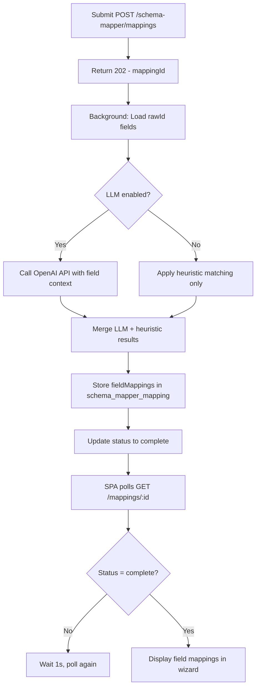
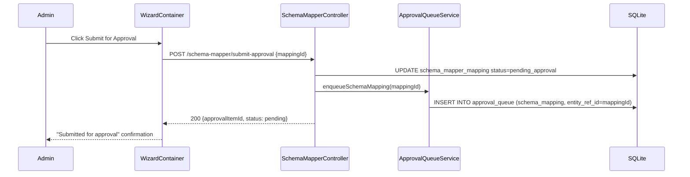

# EPIC-05 — Schema Mapper Agent

> **Epic Code:** SMAP | **Story Range:** SMAP-US-001–010
> **Owner:** Platform Engineering / Data Engineering | **Priority:** P0–P1
> **Implementation Status:** ✅ Fully Implemented

---

## 1. Executive Summary

### Purpose
The Schema Mapper Agent is the data normalization backbone of the HCB platform. Every member institution submits credit data in their own proprietary schema; the Schema Mapper Agent translates these heterogeneous schemas into the HCB canonical model using a combination of heuristic matching and optional LLM (OpenAI) intelligence. Mappings go through versioning, validation rule attachment, and governance approval before they are used in production ingestion.

### Business Value
- Eliminates the need for custom ETL per institution — one wizard handles all schemas
- AI-powered suggestions dramatically reduce manual mapping effort (typically 70-90% auto-mapped)
- PII field detection ensures sensitive data is handled appropriately from day one
- Version control on mappings provides an audit trail for all schema changes
- Integration with approval workflow ensures no untested mapping goes to production

### Key Capabilities
1. Ingest source schema files (CSV, JSON, XML headers)
2. Multi-step wizard: Source Definition → AI Mapping → Review → Validation Rules → Storage Visibility → Confirmation
3. LLM field intelligence with PII detection via OpenAI (optional; falls back to heuristics)
4. Enum reconciliation for categorical fields
5. Validation rule attachment per mapped field
6. Schema registry with version history
7. Drift monitoring for schema changes
8. Submit mapping for approval → `type: schema_mapping` in approval queue

---

## 2. Scope

### In Scope
- Schema ingestion endpoint (`POST /schema-mapper/ingest`)
- Multi-step wizard UI (all 8+ wizard steps in `src/components/schema-mapper/wizard/`)
- AI/LLM mapping with OpenAI integration (optional)
- Schema registry CRUD and search
- Validation rule attachment to mappings
- Storage visibility and data category configuration
- Enum reconciliation
- Schema version management
- Semantic insights step
- Multi-schema matching
- Submit mapping for approval
- Drift log monitoring
- Metrics dashboard

### Out of Scope
- Schema migration tooling (moving institutions between mapping versions)
- Automated schema change detection via connector (push-based)
- Schema marketplace / sharing between bureaus

---

## 3. Personas

| Persona | Role | Needs |
|---------|------|-------|
| Bureau Admin / Data Engineer | SUPER_ADMIN / BUREAU_ADMIN | Run wizard, configure mappings, approve submissions |
| Data Analyst | ANALYST | View registry, monitor drift, submit mappings |
| LLM Service | External (OpenAI) | Receive field context, return mapping suggestions and PII flags |

---

## 4. Features Overview

| Feature | Description | Status |
|---------|-------------|--------|
| Schema Ingestion | Upload source file, parse fields | ✅ Implemented |
| Wizard Step 1: Source Definition | Source name, type, member institution | ✅ Implemented |
| Wizard Step 2: AI/LLM Mapping | Async mapping job with heuristics + optional LLM | ✅ Implemented |
| Wizard Step 3: Review & Edit | Manual review and correction of suggestions | ✅ Implemented |
| Wizard Step 4: LLM Intelligence | PII detection per field | ✅ Implemented |
| Wizard Step 5: Validation Rules | Attach rules to mapped fields | ✅ Implemented |
| Wizard Step 6: Storage Visibility | Set visibility and data categories | ✅ Implemented |
| Wizard Step 7: Enum Reconciliation | Map source enum values to canonical | ✅ Implemented |
| Wizard Step 8: Confirmation | Summary and submit for approval | ✅ Implemented |
| Schema Registry | Browse, search, filter registered schemas | ✅ Implemented |
| Drift Monitoring | View schema drift log | ✅ Implemented |
| Submit for Approval | Insert approval_queue row | ✅ Implemented |

---

## 5. Epic-Level UI Requirements

### Screens

| Screen | Path | Key Components |
|--------|------|---------------|
| Schema Registry | `/data-governance` (embedded) | `SchemaRegistryView`, `SchemaRegistryTable`, `RegistryFilters` |
| Mapping Wizard | `/schema-mapper/wizard/:id` | `WizardContainer`, `StepIndicator`, all step components |
| Schema Detail | Modal/Drawer | `SchemaDetailDialog` |

### Wizard Step Components

| Step | Component | Purpose |
|------|-----------|---------|
| 1 | `SourceDefinitionStep` | Source name, type, institution picker |
| 2 | `SourceIngestionStep` | File upload and field parsing |
| 3 | `AIMappingStep` | Async mapping progress, field results |
| 4 | `LLMFieldIntelligenceStep` | PII detection per field |
| 5 | `MultiSchemaMatchingStep` | Match against multiple source schemas |
| 6 | `ValidationRuleStep` | Attach validation rules |
| 7 | `StorageVisibilityStep` | Set field visibility and category |
| 8 | `SemanticInsightsStep` | Semantic analysis of mapping quality |
| 9 | `TargetSchemaStep` | Final canonical field assignments |
| 10 | `GovernanceActionsStep` | Submit for approval or save draft |
| 11 | `ConfirmationStep` | Completion summary |

### State Handling
| State | UI Behavior |
|-------|-------------|
| Mapping in progress (async) | Progress bar, polling for completion |
| LLM unavailable | Graceful fallback to heuristics-only |
| Low coverage mapping | Warning banner (< threshold%) |
| Schema drift detected | Alert banner in registry view |

---

## 6. Epic-Level UI Test Cases

| Test ID | Screen | Scenario | Steps | Expected Result |
|---------|--------|----------|-------|----------------|
| SMAP-UI-TC-01 | Wizard | Complete wizard flow | Navigate all steps, submit | Mapping created, approval queue item inserted |
| SMAP-UI-TC-02 | Wizard Step 2 | AI mapping completes | Upload schema, wait for mapping | Field suggestions shown with confidence scores |
| SMAP-UI-TC-03 | Wizard Step 4 | PII fields flagged | LLM intelligence step | PII fields highlighted with warning |
| SMAP-UI-TC-04 | Registry | Browse schemas | Navigate to schema registry | All registered schemas visible with filters |
| SMAP-UI-TC-05 | Registry | Filter by source type | Select source type in filter | Only matching schemas shown |
| SMAP-UI-TC-06 | Wizard | Submit for approval | Complete wizard, click Submit | Approval queue item created |

---

## 7. Story-Centric Requirements

---

### SMAP-US-001 — Ingest Source Schema File

#### 1. Description
> As a bureau administrator,
> I want to upload a source schema file,
> So that the mapping wizard can parse its fields.

#### 2. Acceptance Criteria

```gherkin
  Scenario: Ingest schema file
    Given I have a CSV/JSON schema file from a member institution
    When I POST it to /schema-mapper/ingest
    Then the file is parsed and fields extracted
    And a schema_mapper_raw_data entry is created
    And I receive a rawId for use in subsequent wizard steps

  Scenario: Unsupported file format
    When I upload an unsupported format
    Then I receive a 400 error with clear error message
```

#### 3. API Requirements

`POST /api/v1/schema-mapper/ingest` (multipart/form-data)

**Fields:** `file`, `sourceName`, `sourceType`, `institutionId`

**Response (200):**
```json
{
  "rawId": "raw-uuid-001",
  "sourceName": "FNB Core Banking",
  "sourceType": "CBS",
  "parsedFields": [
    {"path": "account_number", "dataType": "string", "sampleValues": ["ACC-001"]},
    {"path": "loan_amount", "dataType": "decimal", "sampleValues": [150000]},
    {"path": "dpd_days", "dataType": "integer", "sampleValues": [0]}
  ],
  "fieldCount": 47
}
```

#### 4. Database

```sql
INSERT INTO schema_mapper_raw_data (raw_id, payload)
VALUES ('raw-uuid-001', '<JSON with parsedFields, sourceName, sourceType>');
```

#### 5. Business Logic
- Parser supports: CSV (header row), JSON (flat or nested up to 2 levels), XML (element names)
- `parsedFields.path` uses dot notation for nested fields (e.g. `address.city`)
- Sample values extracted from first 10 rows
- Field count returned for UI progress indicator

#### 6. Definition of Done
- [ ] POST /schema-mapper/ingest accepts multipart file
- [ ] Returns parsedFields with paths, data types, and sample values
- [ ] raw_data entry created in schema_mapper_raw_data table
- [ ] Unsupported format returns 400

---

### SMAP-US-002 — Define Source in Wizard (Step 1)

#### 1. Description
> As a bureau administrator,
> I want to specify source name, type, and member institution,
> So that the schema is correctly attributed.

#### 2. API Requirements

`GET /api/v1/schema-mapper/wizard-metadata`

**Response:**
```json
{
  "sourceTypes": ["CBS", "ALT_DATA", "BUREAU", "CUSTOM"],
  "dataCategories": ["credit", "identity", "alternate"],
  "canonicalFields": [
    {"fieldCode": "LOAN_AMOUNT", "fieldName": "Loan Amount", "canonicalDataType": "decimal"}
  ]
}
```

#### 3. UI — Institution Picker
- Uses `InstitutionFilterSelect` with `GET /api/v1/institutions?role=dataSubmitter`
- `allowMockFallback: false` — must come from real API
- Option labels use `institutionDisplayLabel`: legal `name` first, then `tradingName`

#### 4. Definition of Done
- [ ] Wizard-metadata endpoint returns source types and canonical field list
- [ ] Institution picker shows only data-submitter institutions
- [ ] No mock fallback in institution picker

---

### SMAP-US-003 — Run AI/LLM Field Mapping (Step 2)

#### 1. Description
> As a bureau administrator,
> I want the system to automatically suggest field mappings using AI,
> So that manual mapping effort is minimised.

#### 2. Acceptance Criteria

```gherkin
  Scenario: Async mapping with LLM
    Given I have ingested a schema (rawId exists)
    When I submit POST /schema-mapper/mappings
    Then the API returns 202 Accepted
    And I receive a mappingId
    And the SPA polls GET /schema-mapper/mappings/:id until status is complete
    And field mappings are shown with confidence scores

  Scenario: LLM disabled / unavailable
    Given OPENAI_API_KEY is not set or hcb.schema-mapper.llm-enabled=false
    When I submit the mapping request
    Then heuristic-only mapping is used
    And confidence scores reflect heuristic quality
```

#### 3. API Requirements

**Create mapping:** `POST /api/v1/schema-mapper/mappings` (async — 202)

**Request:**
```json
{
  "rawId": "raw-uuid-001",
  "sourceType": "CBS",
  "institutionId": 1,
  "sourceName": "FNB Core Banking"
}
```

**Response (202):**
```json
{
  "mappingId": "map-uuid-001",
  "status": "processing"
}
```

**Poll for result:** `GET /api/v1/schema-mapper/mappings/map-uuid-001`

**Completed response:**
```json
{
  "mappingId": "map-uuid-001",
  "status": "complete",
  "coveragePercent": 87.5,
  "fieldMappings": [
    {
      "sourceFieldPath": "account_number",
      "canonicalFieldCode": "ACCOUNT_NUMBER",
      "confidenceScore": 0.95,
      "matchType": "EXACT",
      "containsPii": false
    },
    {
      "sourceFieldPath": "customer_name",
      "canonicalFieldCode": "FULL_NAME",
      "confidenceScore": 0.72,
      "matchType": "FUZZY",
      "containsPii": true
    }
  ]
}
```

#### 4. Database

```sql
INSERT INTO schema_mapper_mapping (mapping_id, payload)
VALUES ('map-uuid-001', '<JSON with fieldMappings, status, coveragePercent>');
```

#### 5. Business Logic
- Mapping worker takes ~400ms for heuristic-only, longer with LLM
- Heuristics: exact name match, fuzzy name match (Levenshtein), data type match
- LLM adds: semantic understanding, PII inference, enum value suggestions
- `coveragePercent = (mapped_fields / total_source_fields) * 100`
- `SchemaMapperMappingJobService` orchestrates the async job

#### 6. Flowchart



#### 7. Definition of Done
- [ ] POST /mappings returns 202 with mappingId
- [ ] Polling returns field mappings when complete
- [ ] Heuristic fallback works when LLM disabled
- [ ] Coverage percent calculated correctly

---

### SMAP-US-004 — Review and Edit Field Mappings (Step 3)

#### 1. Description
> As a bureau administrator,
> I want to review AI-suggested mappings and correct any errors,
> So that data quality is maintained.

#### 2. API Requirements

**Get mapping:** `GET /api/v1/schema-mapper/mappings/:id`
**Update mapping:** `PATCH /api/v1/schema-mapper/mappings/:id`

**Patch request (example):**
```json
{
  "fieldMappings": [
    {
      "sourceFieldPath": "cust_id",
      "canonicalFieldCode": "NATIONAL_ID",
      "matchType": "MANUAL",
      "confidenceScore": 1.0
    }
  ]
}
```

#### 3. UI Components
- `MappingCoverageBar` — visual coverage percentage
- `MappingSummaryBanner` — shows total/mapped/unmapped counts
- `SchemaTreeView` — source field hierarchy
- `VersionDiffViewer` — shows changes vs previous version
- `MasterFieldDrawer` — drawer for selecting canonical field

#### 4. Definition of Done
- [ ] All field mappings displayed in review table
- [ ] Admin can change canonical field assignment
- [ ] Manual changes saved via PATCH /mappings/:id
- [ ] Coverage bar updates on changes

---

### SMAP-US-005 — LLM Field Intelligence and PII Detection (Step 4)

#### 1. Description
> As a bureau administrator,
> I want the system to flag PII fields automatically,
> So that sensitive data is handled with appropriate governance.

#### 2. API Requirements

**Update PII flag:** `PATCH /api/v1/schema-mapper/mappings/:id`

```json
{
  "fieldMappings": [
    {
      "sourceFieldPath": "customer_name",
      "containsPii": true
    }
  ]
}
```

#### 3. Business Logic
- LLM analyzes field name, data type, and sample values to infer PII
- PII categories: `name`, `national_id`, `phone`, `email`, `address`, `date_of_birth`
- Non-PII fields can still be manually flagged as PII by admin
- PII-flagged fields get `pii_classification='pii'` in canonical field registry

#### 4. Definition of Done
- [ ] PII fields highlighted in LLM Intelligence step
- [ ] Admin can toggle PII flag per field
- [ ] PATCH /mappings/:id persists `containsPii` changes

---

### SMAP-US-006 — Configure Validation Rules in Wizard (Step 5)

#### 1. Description
> As a bureau administrator,
> I want to attach validation rules to mapped fields,
> So that incoming data is validated on ingestion.

#### 2. API Requirements

`POST /api/v1/schema-mapper/rules`

```json
{
  "mappingId": "map-uuid-001",
  "ruleType": "FORMAT",
  "fieldPath": "account_number",
  "expression": "^[A-Z0-9-]{5,20}$",
  "severity": "CRITICAL"
}
```

**List rules:** `GET /api/v1/schema-mapper/rules?mappingId=map-uuid-001`

#### 3. Database

```sql
INSERT INTO schema_mapper_validation_rule (rule_id, mapping_id, payload)
VALUES ('rule-uuid-001', 'map-uuid-001', '<JSON rule definition>');
```

#### 4. Definition of Done
- [ ] Validation rules can be added per mapped field
- [ ] Rules listed in wizard step
- [ ] Rules persisted to schema_mapper_validation_rule table

---

### SMAP-US-007 — Set Storage Visibility and Categories (Step 6)

#### 1. Description
> As a bureau administrator,
> I want to configure which mapped fields are stored and at what visibility level,
> So that data governance is enforced.

#### 2. API Requirements

`PATCH /api/v1/schema-mapper/mappings/:id/storage`

```json
{
  "fieldVisibilityConfig": {
    "account_number": "masked_pii",
    "loan_amount": "full",
    "customer_name": "masked_pii"
  },
  "dataCategories": ["credit", "identity"]
}
```

#### 3. Business Logic
- Visibility options: `full`, `masked_pii`, `derived` (same as consortium data_visibility)
- `masked_pii` fields returned with partial masking in API responses
- `dataCategories` used for product-level filtering in PacketConfigModal

#### 4. Definition of Done
- [ ] Storage visibility config persisted per mapping
- [ ] Data categories tagged on mapping

---

### SMAP-US-008 — Reconcile Enum Values

#### 1. Description
> As a bureau administrator,
> I want to map source enum values to canonical equivalents,
> So that categorical data is normalised on ingestion.

#### 2. UI Component
`EnumReconciliationDrawer` — side panel showing source enum values with canonical value picker for each

**Example:**
| Source Value | Canonical Value |
|-------------|-----------------|
| `TERM` | `TERM_LOAN` |
| `OD` | `OD` |
| `CC` | `CC` |
| `MORTGAGE` | `TERM_LOAN` |

#### 3. API Requirements

`PATCH /api/v1/schema-mapper/mappings/:id`

```json
{
  "enumReconciliations": {
    "facility_type": {
      "TERM": "TERM_LOAN",
      "MORTGAGE": "TERM_LOAN",
      "OD": "OD"
    }
  }
}
```

#### 4. Definition of Done
- [ ] Enum reconciliation drawer opens for enum-type fields
- [ ] Source-to-canonical mapping saved
- [ ] Reconciled enums applied during batch ingestion

---

### SMAP-US-009 — Submit Schema Mapping for Approval

#### 1. Description
> As a bureau administrator,
> I want to submit a completed mapping for governance review,
> So that it goes through the approval workflow before production use.

#### 2. API Requirements

`POST /api/v1/schema-mapper/submit-approval`

**Request:**
```json
{
  "mappingId": "map-uuid-001"
}
```

**Response (200):**
```json
{
  "approvalItemId": "15",
  "approvalItemType": "schema_mapping",
  "approvalWorkflowStatus": "pending"
}
```

**Side Effects:**
- `approval_queue` row inserted with `approval_item_type='schema_mapping'`, `entity_ref_id=<mappingId>`
- Approving updates mapping status + registry JSON
- Rejecting/requesting-changes keeps mapping in draft

#### 3. Swimlane Diagram



#### 4. Definition of Done
- [ ] POST /submit-approval creates approval_queue item with type schema_mapping
- [ ] entity_ref_id = mapping ID
- [ ] Approving in approval queue activates the mapping
- [ ] Activated mapping used in subsequent batch ingestion

---

### SMAP-US-010 — View Schema Registry and Monitor Drift

#### 1. Description
> As a bureau administrator,
> I want to browse the schema registry and see drift alerts,
> So that I know when source schemas have changed.

#### 2. API Requirements

**Registry:** `GET /api/v1/schema-mapper/schemas?sourceType=&page=0&size=20`

Server caps `size` at **500**.

**Response:**
```json
{
  "content": [
    {
      "registryId": "reg-uuid-001",
      "sourceName": "FNB Core Banking",
      "sourceType": "CBS",
      "schemaStatus": "active",
      "institution": {"id": 1, "name": "First National Bank"},
      "fieldCount": 47,
      "coveragePercent": 87.5,
      "updatedAt": "2026-03-15T00:00:00Z"
    }
  ]
}
```

**Source types:** `GET /api/v1/schema-mapper/schemas/source-types`

**Drift log:** `GET /api/v1/schema-mapper/drift?registryId=`

#### 3. UI Components
- `SchemaRegistryTable` — sortable table of registered schemas
- `RegistryFilters` — source type, status, institution filters
- `SchemaDetailDialog` — expandable detail panel
- `FieldStatisticsPanel` — field-level statistics
- `MappingCoverageBar` — coverage visualization
- `VersionDiffViewer` — diff between two mapping versions

#### 4. Business Logic
- Drift detected when ingested data contains fields not in the registered schema
- Drift alerts written to `schema_mapper_drift_log` and surface in Data Governance (EPIC-06)
- Schema version created on each approved mapping update

#### 5. Definition of Done
- [ ] Registry browse returns paginated, filtered schemas
- [ ] Schema detail shows field mappings and coverage
- [ ] Drift log visible per schema

---

## 8. Epic API Summary

| Endpoint | Method | Auth | Description | Status |
|----------|--------|------|-------------|--------|
| `POST /api/v1/schema-mapper/ingest` | POST | Bearer (Admin/Analyst) | Ingest source schema file | ✅ |
| `GET /api/v1/schema-mapper/wizard-metadata` | GET | Bearer | Wizard configuration data | ✅ |
| `POST /api/v1/schema-mapper/mappings` | POST | Bearer (Admin/Analyst) | Create mapping job (async 202) | ✅ |
| `GET /api/v1/schema-mapper/mappings/:id` | GET | Bearer | Get mapping and field results | ✅ |
| `PATCH /api/v1/schema-mapper/mappings/:id` | PATCH | Bearer (Admin/Analyst) | Update field mappings, PII, enums | ✅ |
| `POST /api/v1/schema-mapper/rules` | POST | Bearer (Admin/Analyst) | Add validation rule to mapping | ✅ |
| `GET /api/v1/schema-mapper/rules` | GET | Bearer | List rules for a mapping | ✅ |
| `POST /api/v1/schema-mapper/submit-approval` | POST | Bearer (Admin/Analyst) | Submit mapping for approval | ✅ |
| `GET /api/v1/schema-mapper/schemas` | GET | Bearer | Browse schema registry | ✅ |
| `GET /api/v1/schema-mapper/schemas/source-types` | GET | Bearer | List available source types | ✅ |
| `GET /api/v1/schema-mapper/schemas/source-type-fields` | GET | Bearer | Raw fields for source type | ✅ |
| `GET /api/v1/schema-mapper/canonical` | GET | Bearer | Canonical field registry | ✅ |
| `GET /api/v1/schema-mapper/drift` | GET | Bearer | Schema drift log | ✅ |
| `GET /api/v1/schema-mapper/metrics` | GET | Bearer | Mapping metrics | ✅ |

---

## 9. Database Summary

| Table | Key Fields | Notes |
|-------|------------|-------|
| `schema_mapper_raw_data` | `raw_id`, `payload` | JSON document: parsedFields |
| `schema_mapper_registry` | `registry_id`, `payload` | JSON document: registered schema |
| `schema_mapper_mapping` | `mapping_id`, `payload` | JSON document: fieldMappings, status, coverage |
| `schema_mapper_validation_rule` | `rule_id`, `mapping_id`, `payload` | Validation rules per mapping |
| `schema_mapper_schema_version` | `version_id`, `registry_id`, `payload` | Version history |
| `schema_mapper_drift_log` | `drift_id`, `payload` | Detected schema drift events |
| `schema_mapper_metrics` | `id=1`, `payload` | Singleton metrics row |
| `canonical_fields` | `field_code`, `field_name`, `pii_classification` | HCB master schema |

---

## 10. Epic Workflows

### Workflow: New Institution Schema Onboarding
```
Upload source file → POST /ingest (rawId) →
Create wizard → Step 1: Source definition (institution picker, no mock) →
POST /mappings (202, async) → Poll until complete →
Step 3: Review field mappings → Edit incorrect suggestions →
Step 4: Confirm PII flags → Toggle as needed →
Step 5: Attach validation rules →
Step 6: Set storage visibility →
Step 7: Reconcile enum values →
Step 8: GovernanceActionsStep → Submit for approval →
POST /submit-approval → approval_queue item (schema_mapping) →
Bureau admin approves → Mapping activated → Used in batch ingestion
```

---

## 11. KPIs

| KPI | Target |
|-----|--------|
| Average auto-mapping coverage (heuristics only) | > 70% |
| Average auto-mapping coverage (with LLM) | > 90% |
| Mapping wizard completion rate | > 80% |
| Time from ingest to approved mapping | < 1 business day |

---

## 12. Risks

| Risk | Impact | Mitigation |
|------|--------|-----------|
| OpenAI API outage | Mapping quality reduced | Heuristic fallback always available |
| OpenAI API cost overrun | Financial | Per-bureau usage cap on LLM calls |
| PII field missed by LLM | Data compliance risk | Manual PII review step in wizard |
| Schema drift not detected | Wrong mapping used | Drift monitoring and alerts |

---

## 13. Gap Analysis

No critical gaps. Schema Mapper Agent is fully implemented in Spring and SPA.
Minor: LLM model selection (`hcb.schema-mapper.openai-model` env var) not exposed in UI.

---

## 14. Execution Roadmap

| Phase | Stories | Description |
|-------|---------|-------------|
| Phase 1 | SMAP-US-001–010 | All implemented — production-ready |
| Phase 2 | — | Expose LLM model selection in UI |
| Phase 3 | — | Multi-schema cross-institution matching improvement |
| Phase 4 | — | Schema marketplace / sharing between bureau implementations |
