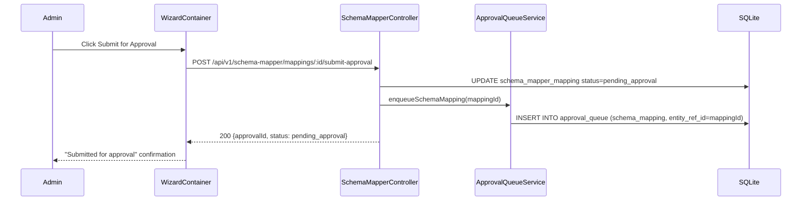

# EPIC-05 — Schema Mapper Agent

> **Epic Code:** SMAP | **Story Range:** SMAP-US-001–010
> **Owner:** Platform Engineering / Data Engineering | **Priority:** P0–P1
> **Implementation Status:** ✅ Fully Implemented

---

## 1. Executive Summary

### Purpose
The Schema Mapper Agent is the data normalization backbone of the HCB platform. Every member institution submits credit data in their own proprietary schema; the Schema Mapper Agent translates these heterogeneous schemas into the HCB canonical model using AI Hybrid Core intelligence. Mappings go through versioning, validation rule attachment, and governance approval before they are used in production ingestion.

### Business Value
- Eliminates the need for custom ETL per institution — one wizard handles all schemas
- AI-powered suggestions dramatically reduce manual mapping effort (typically 70-90% auto-mapped)
- PII field detection ensures sensitive data is handled appropriately from day one
- Version control on mappings provides an audit trail for all schema changes
- Integration with approval workflow ensures no untested mapping goes to production

### Key Capabilities
1. Ingest source schema and metadata in a unified step
2. 4-step wizard: Source Ingestion -> LLM Field Intelligence -> Validation Rules -> Governance Actions
3. LLM field intelligence with PII detection via OpenAI (optional; falls back to heuristics)
4. Enum reconciliation for categorical fields (integrated in mapping review)
5. Validation rule attachment per mapped field
6. Schema registry with version history
7. Drift monitoring for schema changes
8. Submit mapping for approval (creates `type: schema_mapping` in approval queue)

---

## 2. Scope

### In Scope
- Schema ingestion endpoint (`POST /api/v1/schema-mapper/ingest`)
- 4-step wizard UI (`src/components/schema-mapper/wizard/`)
- AI/LLM mapping with OpenAI integration (optional)
- Schema registry CRUD and search
- Validation rule attachment to mappings
- Enum reconciliation (integrated in mapping review)
- Schema version management
- Submit mapping for approval
- Drift log monitoring
- Metrics dashboard

### Out of Scope
- Schema migration tooling (moving institutions between mapping versions)
- Automated schema change detection via connector (push-based)
- Schema marketplace / sharing between bureaus

---

## 3. Personas

| Persona | Role | Needs |
|---------|------|-------|
| Bureau Admin / Data Engineer | SUPER_ADMIN / BUREAU_ADMIN | Run wizard, configure mappings, approve submissions |
| Data Analyst | ANALYST | View registry, monitor drift, submit mappings |
| LLM Service | External (OpenAI) | Receive field context, return mapping suggestions and PII flags |

---

## 4. Features Overview

| Feature | Description | Status |
|---------|-------------|--------|
| Schema Ingestion | Upload source file and metadata (Step 1) | ✅ Implemented |
| LLM Field Intelligence | AI mapping, review, PII, and enum reconciliation (Step 2) | ✅ Implemented |
| Validation Rules | Attach rules to mapped fields (Step 3) | ✅ Implemented |
| Governance Actions | Submit for approval or save draft (Step 4) | ✅ Implemented |
| Schema Registry | Browse, search, filter registered schemas | ✅ Implemented |
| Drift Monitoring | View schema drift log | ✅ Implemented |
| Submit for Approval | Insert approval_queue row | ✅ Implemented |

---

## 5. Epic-Level UI Requirements

### Screens

| Screen | Path | Key Components |
|--------|------|---------------|
| Schema Registry | `/data-governance` (embedded) | `SchemaRegistryView`, `SchemaRegistryTable`, `RegistryFilters` |
| Mapping Wizard | `/schema-mapper/wizard/:id` | `WizardContainer`, `StepIndicator`, all step components |
| Schema Detail | Modal/Drawer | `SchemaDetailDialog` |

### Wizard Step Components

| Step | Component | Purpose | Key Actions |
|------|-----------|---------|-------------|
| 1 | `SourceIngestionStep` | Ingest file + Define metadata | Select Institution, Source Type, Category; Upload file |
| 2 | `LLMFieldIntelligenceStep` | Mapping Review & Edit | AI Mapping job, Review Table, PII Tagging, Enum Reconciliation |
| 3 | `ValidationRuleStep` | Configure Rules | Attach validation rules per field |
| 4 | `GovernanceActionsStep` | Finalize & Submit | Submit for approval or save draft |

### State Handling
| State | UI Behavior |
|-------|-------------|
| Mapping in progress (async) | Progress bar, polling for completion |
| LLM unavailable | Graceful fallback to heuristics-only |
| Low coverage mapping | Warning banner (< threshold%) |
| Schema drift detected | Alert banner in registry view |

---

## 6. Epic-Level UI Test Cases

| Test ID | Screen | Scenario | Steps | Expected Result |
|---------|--------|----------|-------|----------------|
| SMAP-UI-TC-01 | Wizard | Complete 4-step wizard flow | Upload -> Map -> Rules -> Submit | Mapping created, approval queue item inserted |
| SMAP-UI-TC-02 | Wizard Step 2 | AI mapping completes | Upload schema, wait for Step 2 | Field suggestions shown with confidence scores |
| SMAP-UI-TC-03 | Wizard Step 2 | PII fields tagged | Review results in Step 2 | PII fields highlighted with Yes/No toggle |
| SMAP-UI-TC-04 | Registry | Browse schemas | Navigate to schema registry | All registered schemas visible with filters |
| SMAP-UI-TC-06 | Wizard | Submit for approval | Complete Step 4, click Submit | Approval queue item created |

---

## 7. Story-Centric Requirements

---

### SMAP-US-001 — Ingest Source Schema and Define Metadata (Step 1)

#### 1. Description
> As a bureau administrator,
> I want to define the source metadata and upload a schema file in one step,
> So that the system can begin the mapping process.

#### 2. Acceptance Criteria
- User selects **Institution** (Data Submitters only), **Source Type**, **Category**, and **Version**.
- User uploads CC/JSON/XML file.
- API `POST /api/v1/schema-mapper/ingest` validates inputs and file.
- System creates `rawDataId` and `schemaVersionId`.

#### 3. API Requirements
`POST /api/v1/schema-mapper/ingest`

**Fields:** `sourceName`, `sourceType`, `dataCategory`, `versionNumber`, `effectiveDate`, `parsedFields`, `fieldStats`, `institutionId` (optional in body if inferred from name).

#### 4. Definition of Done
- [ ] Combined metadata entry and file upload UI completed
- [ ] Backend creates registry and version entries
- [ ] Mapping job triggered immediately after successful ingest

---

### SMAP-US-003-US-008 — LLM Field Intelligence and Mapping Review (Step 2)

#### 1. Description
> As a bureau administrator,
> I want the AI to suggest mappings, detect PII, and suggest enum reconciliations in a unified view,
> So that I can review and finalize the schema mapping efficiently.

#### 2. Features Integrated
- **AI Mapping:** Async heuristic + LLM mapping results (`POST /api/v1/schema-mapper/mappings`)
- **Review & Edit:** Manual override of canonical field assignments (`PATCH /api/v1/schema-mapper/mappings/:id`)
- **PII Detection:** Automated flagging and manual Yes/No toggle for PII status
- **Enum Reconciliation:** Mapping source enum values (e.g., `MORTGAGE`) to canonical (`TERM_LOAN`) via side drawer

#### 3. Definition of Done
- [ ] Unified review table with source field, canonical mapping, and PII toggle
- [ ] Enum reconciliation drawer functional for categorical fields
- [ ] Manual adjustments persisted via PATCH /mappings/:id
- [ ] Confidence scores and coverage bar update in real-time

---

### SMAP-US-009 — Governance Actions (Step 4)

#### 1. Description
> As a bureau administrator,
> I want to review the mapping summary and submit it for approval or save it as a draft,
> So that the mapping workflow is completed.

#### 2. API Requirements
`POST /api/v1/schema-mapper/mappings/:id/submit-approval`

**Response (200):**
```json
{
  "approvalId": "15",
  "status": "pending_approval"
}
```

#### 3. Swimlane Diagram


```mermaid
sequenceDiagram
    participant A as Admin
    participant FE as WizardContainer
    participant API as SchemaMapperController
    participant AQSVC as ApprovalQueueService
    participant DB as SQLite

    A->>FE: Click Submit for Approval
    FE->>API: POST /api/v1/schema-mapper/mappings/:id/submit-approval
    API->>DB: UPDATE schema_mapper_mapping status=pending_approval
    API->>AQSVC: enqueueSchemaMapping(mappingId)
    AQSVC->>DB: INSERT INTO approval_queue (schema_mapping, entity_ref_id=mappingId)
    API-->>FE: 200 {approvalId, status: pending_approval}
    FE-->>A: "Submitted for approval" confirmation
```

#### 4. Definition of Done
- [ ] POST /submit-approval creates approval_queue item with type schema_mapping
- [ ] entity_ref_id = mapping ID
- [ ] Approving in approval queue activates the mapping
- [ ] Activated mapping used in subsequent batch ingestion

---

### SMAP-US-010 — View Schema Registry and Monitor Drift

#### 1. Description
> As a bureau administrator,
> I want to browse the schema registry and see drift alerts,
> So that I know when source schemas have changed.

#### 2. API Requirements

**Registry:** `GET /api/v1/schema-mapper/schemas?sourceType=&page=0&size=20`

Server caps `size` at **500**.

**Response:**
```json
{
  "content": [
    {
      "registryId": "reg-uuid-001",
      "sourceName": "FNB Core Banking",
      "sourceType": "CBS",
      "schemaStatus": "active",
      "institution": {"id": 1, "name": "First National Bank"},
      "fieldCount": 47,
      "coveragePercent": 87.5,
      "updatedAt": "2026-03-15T00:00:00Z"
    }
  ]
}
```

**Source types:** `GET /api/v1/schema-mapper/schemas/source-types`

**Drift log:** `GET /api/v1/schema-mapper/drift?registryId=`

#### 3. UI Components
- `SchemaRegistryTable` — sortable table of registered schemas
- `RegistryFilters` — source type, status, institution filters
- `SchemaDetailDialog` — expandable detail panel
- `FieldStatisticsPanel` — field-level statistics
- `MappingCoverageBar` — coverage visualization
- `VersionDiffViewer` — diff between two mapping versions

#### 4. Business Logic
- Drift detected when ingested data contains fields not in the registered schema
- Drift alerts written to `schema_mapper_drift_log` and surface in Data Governance (EPIC-06)
- Schema version created on each approved mapping update

#### 5. Definition of Done
- [ ] Registry browse returns paginated, filtered schemas
- [ ] Schema detail shows field mappings and coverage
- [ ] Drift log visible per schema

---

## 8. Epic API Summary

| Endpoint | Method | Auth | Description | Status |
|----------|--------|------|-------------|--------|
| `POST /api/v1/schema-mapper/ingest` | POST | Bearer (Admin/Analyst) | Ingest source schema file + metadata | ✅ |
| `GET /api/v1/schema-mapper/wizard-metadata` | GET | Bearer | Wizard configuration data | ✅ |
| `POST /api/v1/schema-mapper/mappings` | POST | Bearer (Admin/Analyst) | Create mapping job (async 202) | ✅ |
| `GET /api/v1/schema-mapper/mappings/:id` | GET | Bearer | Get mapping and field results | ✅ |
| `PATCH /api/v1/schema-mapper/mappings/:id` | PATCH | Bearer (Admin/Analyst) | Update field mappings, PII, enums | ✅ |
| `POST /api/v1/schema-mapper/rules` | POST | Bearer (Admin/Analyst) | Add validation rule to mapping | ✅ |
| `GET /api/v1/schema-mapper/rules` | GET | Bearer | List rules for a mapping | ✅ |
| `POST /api/v1/schema-mapper/mappings/:id/submit-approval` | POST | Bearer (Admin/Analyst) | Submit mapping for approval | ✅ |
| `GET /api/v1/schema-mapper/schemas` | GET | Bearer | Browse schema registry | ✅ |
| `GET /api/v1/schema-mapper/schemas/source-types` | GET | Bearer | List available source types | ✅ |
| `GET /api/v1/schema-mapper/schemas/source-type-fields` | GET | Bearer | Raw fields for source type | ✅ |
| `GET /api/v1/schema-mapper/canonical` | GET | Bearer | Canonical field registry | ✅ |
| `GET /api/v1/schema-mapper/drift` | GET | Bearer | Schema drift log | ✅ |
| `GET /api/v1/schema-mapper/metrics` | GET | Bearer | Mapping metrics | ✅ |

---

## 9. Database Summary

| Table | Key Fields | Notes |
|-------|------------|-------|
| `schema_mapper_raw_data` | `raw_id`, `payload` | JSON document: parsedFields |
| `schema_mapper_registry` | `registry_id`, `payload` | JSON document: registered schema |
| `schema_mapper_mapping` | `mapping_id`, `payload` | JSON document: fieldMappings, status, coverage |
| `schema_mapper_validation_rule` | `rule_id`, `mapping_id`, `payload` | Validation rules per mapping |
| `schema_mapper_schema_version` | `version_id`, `registry_id`, `payload` | Version history |
| `schema_mapper_drift_log` | `drift_id`, `payload` | Detected schema drift events |
| `schema_mapper_metrics` | `id=1`, `payload` | Singleton metrics row |
| `canonical_fields` | `field_code`, `field_name`, `pii_classification` | HCB master schema |

---

## 10. Epic Workflows

### Workflow: New Institution Schema Onboarding
```
Step 1: Upload Source Schema (metadata + file) → POST /ingest (rawDataId, schemaVersionId) →
System triggers mapping job job → POST /mappings (202, async) → 
Step 2: LLM Field Intelligence → Poll until complete →
Review results: edit incorrect suggestions, tag PII (Yes/No), reconcile enums →
Step 3: Validation Rules → Attach rules per field →
Step 4: Governance Actions → Submit for approval (POST /mappings/:id/submit-approval) →
approval_queue item (schema_mapping) → Bureau admin approves → Activated
```

---

## 11. KPIs

| KPI | Target |
|-----|--------|
| Average auto-mapping coverage (heuristics only) | > 70% |
| Average auto-mapping coverage (with LLM) | > 90% |
| Mapping wizard completion rate | > 80% |
| Time from ingest to approved mapping | < 1 business day |

---

## 12. Risks

| Risk | Impact | Mitigation |
|------|--------|-----------|
| OpenAI API outage | Mapping quality reduced | Heuristic fallback always available |
| OpenAI API cost overrun | Financial | Per-bureau usage cap on LLM calls |
| PII field missed by LLM | Data compliance risk | Manual PII review step in wizard |
| Schema drift not detected | Wrong mapping used | Drift monitoring and alerts |

---

## 13. Gap Analysis

No critical gaps. Schema Mapper Agent is fully implemented in Spring and SPA.
Minor: LLM model selection (`hcb.schema-mapper.openai-model` env var) not exposed in UI.

---

## 14. Execution Roadmap

| Phase | Stories | Description |
|-------|---------|-------------|
| Phase 1 | SMAP-US-001–010 | All implemented — production-ready |
| Phase 2 | — | Expose LLM model selection in UI |
| Phase 3 | — | Multi-schema cross-institution matching improvement |
| Phase 4 | — | Schema marketplace / sharing between bureau implementations |
