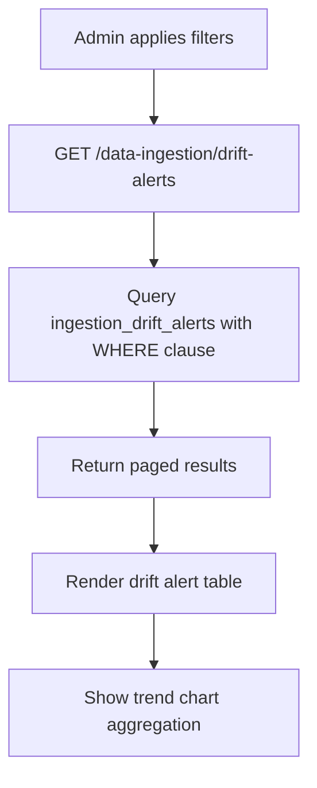

# EPIC-06 — Data Governance

> **Epic Code:** GOV | **Story Range:** GOV-US-001–006
> **Owner:** Data Engineering / Compliance | **Priority:** P0–P1
> **Implementation Status:** ✅ Mostly Implemented (GOV-US-004 Partial)

---

## 1. Executive Summary

### Purpose
Data Governance is the operational quality layer of the HCB platform. It provides bureau administrators and data analysts with tools to monitor data drift, review auto-mapping suggestions, resolve consumer identity matches, maintain the canonical field registry, and view governance audit logs — ensuring the bureau's credit data meets regulatory and quality standards.

### Business Value
- Detects schema and mapping drift early, preventing silent data quality degradation
- Human-in-the-loop review of auto-mapping reduces erroneous canonical field assignments
- Consumer match review ensures the bureau's consumer database remains deduplicated
- Canonical field registry is the single source of truth for the HCB data model
- Governance audit log provides complete traceability for compliance teams

### Key Capabilities
1. Governance dashboard with quality health overview
2. Drift alert monitoring with source type and date filters
3. Auto-mapping suggestion review (approve/reject AI suggestions)
4. Consumer identity match review (partial — full implementation in EPIC-18)
5. Master schema registry browsing and maintenance (Master Schema Management)
6. Canonical field registry browsing and maintenance (schema-mapper canonical fields)
7. Governance audit log with action-type and entity filters

---

## 2. Scope

### In Scope
- Data Governance Dashboard (`DataGovernanceDashboard.tsx`)
- Data Quality Monitoring with drift alerts (`DataQualityMonitoring.tsx`)
- Auto-Mapping Review page (`AutoMappingReview.tsx`)
- Master Schema Management pages (`MasterSchemaRegistryPage.tsx`, `MasterSchemaDetailPage.tsx`, `MasterSchemaEditorPage.tsx`)
- Match Review page (`MatchReview.tsx`) — partial
- Governance Audit Logs (`GovernanceAuditLogs.tsx`)
- Canonical field registry view (via schema mapper canonical API)

### Out of Scope
- Validation rule management (EPIC-07)
- Identity resolution engine (EPIC-18)
- Automated drift remediation
- Regulatory reporting from governance data

---

## 3. Personas

| Persona | Role | Needs |
|---------|------|-------|
| Data Analyst | ANALYST | Monitor drift, review mappings, view quality trends |
| Bureau Administrator | BUREAU_ADMIN | Approve/reject mapping suggestions, manage canonical fields |
| Compliance Officer | BUREAU_ADMIN | View governance audit logs, produce audit evidence |

---

## 4. Features Overview

| Feature | Description | Status |
|---------|-------------|--------|
| Governance Dashboard | Quality health overview | ✅ Implemented |
| Drift Alert Monitoring | Filtered drift alert list with trend chart | ✅ Implemented |
| Auto-Mapping Review | Approve/reject AI mapping suggestions | ✅ Implemented |
| Consumer Match Review | Review potential duplicate consumers | ⚠️ Partial |
| Canonical Field Registry | View and update canonical fields | ✅ Implemented |
| Governance Audit Logs | Chronological action log | ✅ Implemented |

---

## 5. Epic-Level UI Requirements

### Screens

| Screen | Path | Description |
|--------|------|-------------|
| Governance Dashboard | `/data-governance/dashboard` | Overview with quality KPIs |
| Master Schema Management | `/data-governance/master-schema` | Central registry + detail/editor for master schemas |
| Data Quality Monitoring | `/data-governance/data-quality-monitoring` | Drift alert list + trend chart |
| Schema Mapper Agent | `/data-governance/auto-mapping-review` | AI suggestion review (schema mapper workflows) |
| Match Review | `/data-governance/match-review` | Consumer match review |
| Governance Audit Logs | `/data-governance/governance-audit-logs` | Governance actions log |
| Validation Rules | `/data-governance/validation-rules` | (EPIC-07) Route exists; entry may be hidden from sidebar navigation temporarily |

### State Handling
| State | UI Behavior |
|-------|-------------|
| Loading drift alerts | Skeleton table |
| No alerts in date range | Empty state with date range suggestion |
| Alert threshold breach | Red badge on quality score card |
| Auto-mapping: no pending | "No pending suggestions" message |

---

## 6. Epic-Level UI Test Cases

| Test ID | Screen | Scenario | Steps | Expected Result |
|---------|--------|----------|-------|----------------|
| GOV-UI-TC-01 | Dashboard | Load governance dashboard | Navigate to /data-governance | Quality KPI cards and summary charts visible |
| GOV-UI-TC-02 | Drift Monitoring | Filter by source type | Select "CBS" in source type filter | Only CBS alerts shown |
| GOV-UI-TC-03 | Drift Monitoring | Filter by severity | Select "high" severity | Only high severity alerts shown |
| GOV-UI-TC-04 | Auto-Mapping Review | Approve suggestion | Click Approve on a mapping row | Status updates to approved |
| GOV-UI-TC-05 | Audit Logs | Load audit log | Navigate to audit logs | Chronological log entries visible |

---

## 7. Story-Centric Requirements

---

### GOV-US-001 — View Data Governance Dashboard

#### 1. Description
> As a data analyst,
> I want an overview of data quality health across member institutions,
> So that I can prioritise governance actions.

#### 2. API Requirements

`GET /api/v1/data-ingestion/drift-alerts` (aggregated count)
`GET /api/v1/schema-mapper/metrics`

**Dashboard shows:**
- Total active drift alerts (by severity: high/medium/low)
- Overall data quality score (average across all institutions)
- Pending auto-mapping reviews count
- Schema coverage percentage (mapped fields / total source fields)
- Recent governance actions feed

#### 3. Definition of Done
- [ ] Dashboard KPI cards load with real data
- [ ] Alert severity breakdown shown
- [ ] Pending reviews count visible

---

### GOV-US-002 — View and Filter Drift Alerts

#### 1. Description
> As a data analyst,
> I want to filter drift alerts by source type, date range, and severity,
> So that I can investigate specific data quality issues.

#### 2. Acceptance Criteria

```gherkin
  Scenario: View all drift alerts
    Given I navigate to Data Quality Monitoring
    Then I see all drift alerts sorted by detected_at descending

  Scenario: Filter by source type
    When I select "CBS" in the source type filter
    Then only CBS-sourced alerts are shown

  Scenario: Filter by date range
    When I select a date range
    Then only alerts detected within that range are shown

  Scenario: Pagination
    Given there are more than DRIFT_PAGE_SIZE (10) alerts
    When I scroll or navigate to next page
    Then the next page of alerts is loaded
```

#### 3. API Requirements

`GET /api/v1/data-ingestion/drift-alerts?dateFrom=&dateTo=&sourceType=&page=0&size=10`

**Response:**
```json
{
  "content": [
    {
      "id": "drift-uuid-001",
      "alertType": "schema",
      "source": "FNB Core Banking",
      "message": "New field 'emi_amount' detected not in registered schema",
      "severity": "high",
      "detectedAt": "2026-03-28T14:30:00Z",
      "sourceType": "CBS"
    }
  ],
  "totalElements": 25,
  "page": 0,
  "size": 10
}
```

#### 4. UI Components
- `InstitutionFilterSelect` — institution filter (optional)
- `DatePicker` — date range selection
- Source type select — from `GET /api/v1/schema-mapper/schemas/source-types`
- Severity badge: `high`=red, `medium`=orange, `low`=yellow
- Alert type badge: `schema`=purple, `mapping`=blue

#### 5. Database

```sql
SELECT * FROM ingestion_drift_alerts
WHERE detected_at BETWEEN ? AND ?
  AND source_type = ?
ORDER BY detected_at DESC
LIMIT 10 OFFSET 0;
```

#### 6. Data Flow

```
1. Admin selects filters (date range, source type, severity)
2. GET /data-ingestion/drift-alerts with filter params
3. DataIngestionController queries ingestion_drift_alerts table
4. Spring returns paged results
5. SPA renders in drift alert table with severity badges
6. Trend chart shows alert count over time (grouping by week/day)
```

#### 7. Flowchart



#### 8. Functional Test Cases

| Test ID | Scenario | Expected |
|---------|----------|----------|
| GOV-US-002-FTC-01 | No filters | All drift alerts returned, newest first |
| GOV-US-002-FTC-02 | sourceType=CBS | Only CBS alerts returned |
| GOV-US-002-FTC-03 | dateFrom=2026-01-01 | Only alerts after Jan 1 |
| GOV-US-002-FTC-04 | Pagination | page=1 returns second batch |

#### 9. Definition of Done
- [ ] Drift alerts loaded and displayed
- [ ] All filter combinations work correctly
- [ ] Trend chart shows data over selected date range
- [ ] Pagination works for large alert sets

---

### GOV-US-003 — Review Auto-Mapping Suggestions

#### 1. Description
> As a data analyst,
> I want to approve or reject auto-generated field mapping suggestions,
> So that the canonical model stays accurate.

#### 2. API Requirements

**List pending mappings:** `GET /api/v1/schema-mapper/mappings?status=pending_review`

**Approve mapping field:**
`PATCH /api/v1/schema-mapper/mappings/:id`
```json
{
  "fieldMappings": [
    {"sourceFieldPath": "cust_id", "approved": true}
  ]
}
```

#### 3. UI Components
- `AutoMappingReview.tsx` — paginated list of pending suggestions
- `ApprovalHistoryTimeline.tsx` — history of review actions
- `WorkflowStatusBanner.tsx` — banner showing approval workflow state

#### 4. Business Logic
- Auto-mapping suggestions with confidence < 0.7 are flagged for human review
- Approved suggestions update `is_approved=1` on `mapping_pairs`
- Rejected suggestions can be manually reassigned

#### 5. Definition of Done
- [ ] Pending mapping suggestions listed
- [ ] Approve/reject actions persist correctly
- [ ] History timeline shows review audit trail

---

### GOV-US-004 — Review Consumer Identity Match Results

#### 1. Description
> As a data analyst,
> I want to review potential duplicate consumer records,
> So that the bureau database remains deduplicated.

#### 2. Status: ⚠️ Partial

`MatchReview.tsx` is a partial stub. The full consumer match review functionality requires the Identity Resolution Agent (EPIC-18). Current implementation shows a placeholder UI.

#### 3. Planned API

`GET /api/v1/identity-resolution/matches?status=pending` (missing)

**Planned response:**
```json
[
  {
    "matchId": "match-uuid-001",
    "consumerId1": 101,
    "consumerId2": 205,
    "matchScore": 0.94,
    "matchReasons": ["national_id_hash_match", "phone_hash_match"],
    "matchStatus": "pending_review"
  }
]
```

#### 4. Gap: Identity resolution API missing — deferred to EPIC-18.

#### 5. Definition of Done (future)
- [ ] Pending consumer matches listed with confidence scores
- [ ] Analyst can mark as "same consumer" (merge) or "different consumer" (dismiss)
- [ ] Actions logged in audit_logs

---

### GOV-US-005 — Manage Canonical Field Registry

#### 1. Description
> As a bureau administrator,
> I want to view and update the canonical field registry,
> So that the master HCB data model reflects current business requirements.

#### 2. API Requirements

**List:** `GET /api/v1/schema-mapper/canonical`

**Response:**
```json
[
  {
    "id": 1,
    "fieldCode": "LOAN_AMOUNT",
    "fieldName": "Loan Sanctioned Amount",
    "canonicalDataType": "decimal",
    "piiClassification": "non_pii",
    "isMandatory": true,
    "description": "Total loan amount sanctioned at origination"
  }
]
```

#### 3. Database

`canonical_fields` table — `field_code`, `field_name`, `canonical_data_type`, `pii_classification`, `is_mandatory`

#### 4. Definition of Done
- [ ] Canonical field list displayed with PII classification and data type
- [ ] Fields browseable and searchable

---

### GOV-US-006 — View Governance Audit Logs

#### 1. Description
> As a compliance officer,
> I want to see all data governance actions with timestamps,
> So that I can produce audit evidence for regulators.

#### 2. API Requirements

`GET /api/v1/audit-logs?actionType=&entityType=&userId=&dateFrom=&dateTo=&page=0&size=20`

**Response:**
```json
{
  "content": [
    {
      "id": 1,
      "userId": 1,
      "actionType": "MAPPING_APPROVED",
      "entityType": "schema_mapping",
      "entityId": "map-uuid-001",
      "description": "Schema mapping approved for FNB Core Banking",
      "auditOutcome": "success",
      "occurredAt": "2026-03-28T10:30:00Z"
    }
  ]
}
```

**Role restriction:** `VIEWER` role receives **403 Forbidden**.

#### 3. Compliance Requirements
- IP address stored as SHA-256 hash (never raw)
- Immutable append-only table — no updates or deletes
- All governance actions (approve, reject, map, flag) must write an audit row
- `audit_outcome`: `success`, `failure`, `partial`

#### 4. Definition of Done
- [ ] Audit log displays with timestamp, user, action, and outcome
- [ ] Filters by action type, entity type, date range work
- [ ] VIEWER role receives 403
- [ ] Audit rows are immutable (no edit/delete in UI)

---

## 8. Epic API Summary

| Endpoint | Method | Auth | Description | Status |
|----------|--------|------|-------------|--------|
| `GET /api/v1/data-ingestion/drift-alerts` | GET | Bearer | Drift alert list with filters | ✅ |
| `GET /api/v1/schema-mapper/metrics` | GET | Bearer | Schema mapper metrics | ✅ |
| `GET /api/v1/schema-mapper/mappings` | GET | Bearer | List mappings (with status filter) | ✅ |
| `PATCH /api/v1/schema-mapper/mappings/:id` | PATCH | Bearer (Admin/Analyst) | Approve/reject mapping fields | ✅ |
| `GET /api/v1/schema-mapper/canonical` | GET | Bearer | Canonical field registry | ✅ |
| `GET /api/v1/audit-logs` | GET | Bearer (not Viewer) | Governance audit log | ✅ |
| `GET /api/v1/identity-resolution/matches` | GET | Bearer | Consumer match results | ❌ Missing |

---

## 9. Database Summary

| Table | Key Fields | Notes |
|-------|------------|-------|
| `ingestion_drift_alerts` | `id`, `alert_type`, `source`, `severity`, `detected_at`, `source_type` | Drift events |
| `canonical_fields` | `field_code`, `field_name`, `pii_classification`, `is_mandatory` | Master schema |
| `audit_logs` | `action_type`, `entity_type`, `entity_id`, `audit_outcome` | Immutable audit trail |
| `schema_mapper_mapping` | `mapping_id`, `payload` (fieldMappings with is_approved) | Mapping review state |

---

## 10. Epic Workflows

### Workflow: Drift Alert Investigation
```
Batch ingestion detects unknown field →
  Write to ingestion_drift_alerts →
  Alert appears in Data Quality Monitoring →
  Data analyst investigates source →
  Schema Mapper wizard triggered to re-ingest and re-map →
  Updated mapping submitted for approval
```

---

## 11. KPIs

| KPI | Target |
|-----|--------|
| Open drift alert resolution time | < 48 hours |
| Auto-mapping review cycle time | < 24 hours |
| Canonical field registry completeness | 100% of ingested field types covered |

---

## 12. Risks

| Risk | Impact | Mitigation |
|------|--------|-----------|
| Match review stub creates false confidence | Data quality risk | Clear "not implemented" marker in UI stub |
| Audit log grows unbounded | DB size | Archive strategy: partition or archive logs older than 2 years |

---

## 13. Gap Analysis

| Gap | Story | Severity |
|-----|-------|----------|
| Consumer match review API missing | GOV-US-004 | Medium (EPIC-18 dependency) |
| `MatchReview.tsx` is a partial stub | GOV-US-004 | Medium |

---

## 14. Execution Roadmap

| Phase | Stories | Description |
|-------|---------|-------------|
| Phase 1 | GOV-US-001–003, 005–006 | Implemented — production-ready |
| Phase 2 | GOV-US-004 | Implement basic match review (EPIC-18 dependency) |
| Phase 3 | — | Add canonical field update API |
| Phase 4 | — | Regulatory audit report generation from governance data |
