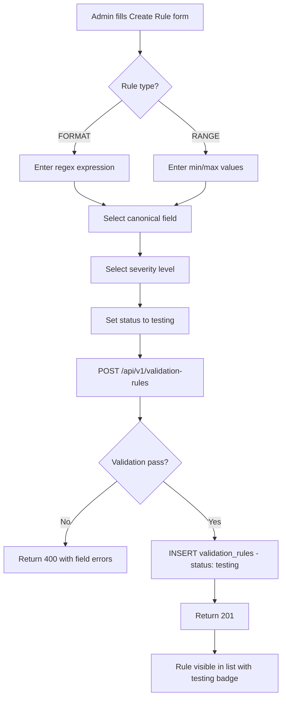
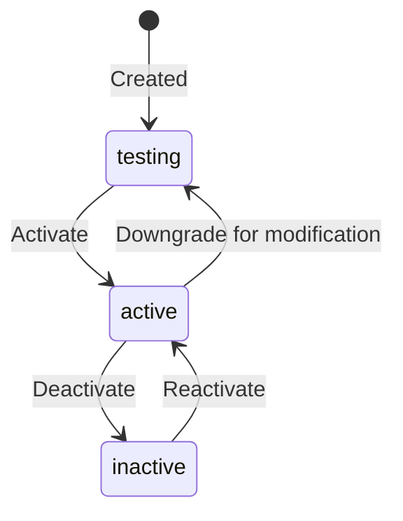

# EPIC-07 — Data Validation

> **Epic Code:** DVAL | **Story Range:** DVAL-US-001–006
> **Owner:** Data Engineering | **Priority:** P0
> **Implementation Status:** ⚠️ Partial (UI partial, API missing)

---

## 1. Executive Summary

### Purpose
Data Validation is the rule engine that gates incoming data before it enters the HCB credit bureau's permanent storage. Rules are defined against canonical fields, assigned a severity level, and executed against every record during batch ingestion and real-time API submission. This epic is deliberately separated from Data Governance to allow independent development and deployment of the rule engine.

### Business Value
- Prevents malformed, out-of-range, or structurally invalid data from polluting the credit bureau
- Severity levels (INFO / WARNING / CRITICAL) allow graduated responses: log-only vs reject-record vs reject-batch
- Rule testing against sample data eliminates regression risk when adding new rules
- ENUM-type rules ensure referential integrity for categorical fields (e.g. `facility_type`)
- Rule deactivation allows safe testing without affecting production ingestion

### Key Capabilities
1. View and manage all validation rules in a single UI
2. Create rules for 6 types: FORMAT, RANGE, MANDATORY, CROSS_FIELD, DUPLICATE, ENUM
3. Assign severity: INFO, WARNING, CRITICAL
4. Activate / deactivate rules without deletion
5. Test rules against sample data payloads before production activation
6. View per-record validation failure results from batch jobs

---

## 2. Scope

### In Scope
- Validation rule CRUD (`ValidationRules.tsx` page)
- Rule type definitions: FORMAT, RANGE, MANDATORY, CROSS_FIELD, DUPLICATE, ENUM
- Rule severity levels and execution behaviour
- Rule activation / deactivation
- Sample data testing
- Validation result viewing per batch job

### Out of Scope
- Real-time API validation result viewer (covered in EPIC-15 / EPIC-16)
- Rule versioning / history
- Rule inheritance across institution schemas

---

## 3. Personas

| Persona | Role | Needs |
|---------|------|-------|
| Data Analyst | ANALYST | Define and test validation rules |
| Bureau Administrator | BUREAU_ADMIN | Activate/deactivate rules, view failure results |
| Compliance Officer | BUREAU_ADMIN | Ensure mandatory fields are validated |

---

## 4. Features Overview

| Feature | Description | Status |
|---------|-------------|--------|
| View All Rules | List with type, severity, status | ⚠️ Partial (UI exists, API missing) |
| Create FORMAT Rule | Regex-based format validation | ❌ Missing API |
| Create RANGE Rule | Min/max boundary validation | ❌ Missing API |
| Create MANDATORY Rule | Required field presence check | ❌ Missing API |
| Create CROSS_FIELD Rule | Cross-field conditional validation | ❌ Missing API |
| Create DUPLICATE Rule | Duplicate record detection | ❌ Missing API |
| Create ENUM Rule | Allowed values list check | ❌ Missing API |
| Activate / Deactivate | Toggle rule without deletion | ❌ Missing API |
| Test Rule | Dry-run against sample data | ❌ Missing API |
| View Failure Results | Per-batch validation failures | ❌ Missing API |

---

## 5. Epic-Level UI Requirements

### Screens

| Screen | Path | Description |
|--------|------|-------------|
| Validation Rules | `/data-governance/validation` | Rule list and management |

### Component Behavior
- Rule type badge: `FORMAT`=blue, `RANGE`=purple, `MANDATORY`=red, `CROSS_FIELD`=orange, `DUPLICATE`=yellow, `ENUM`=green
- Severity badge: `INFO`=gray, `WARNING`=yellow, `CRITICAL`=red
- Status badge: `active`=green, `inactive`=gray, `testing`=yellow
- "Add Rule" button opens a creation modal/drawer
- Each rule row has: Edit, Activate/Deactivate, Test, Delete actions

### State Handling
| State | UI Behavior |
|-------|-------------|
| Loading rules | SkeletonTable |
| Empty rules list | EmptyState with "Add your first rule" CTA |
| Rule test running | Loading spinner in test panel |
| Test pass | Green checkmark with matched/unmatched counts |
| Test fail | Red indicator with failure details |

---

## 6. Epic-Level UI Test Cases

| Test ID | Screen | Scenario | Steps | Expected Result |
|---------|--------|----------|-------|----------------|
| DVAL-UI-TC-01 | Rules List | Load validation rules | Navigate to /data-governance/validation | Rule table visible |
| DVAL-UI-TC-02 | Rules List | Create FORMAT rule | Click Add Rule, fill form, submit | New rule in list |
| DVAL-UI-TC-03 | Rules List | Deactivate rule | Click Deactivate on active rule | Status changes to inactive |
| DVAL-UI-TC-04 | Rules List | Test rule | Click Test, input sample data, run | Test result (pass/fail) displayed |

---

## 7. Story-Centric Requirements

---

### DVAL-US-001 — View All Validation Rules

#### 1. Description
> As a data analyst,
> I want to see all active and inactive validation rules,
> So that I can manage the validation configuration.

#### 2. Status: ⚠️ Partial

`ValidationRules.tsx` exists in the SPA but the API `GET /api/v1/validation-rules` is not implemented in Spring. The current page may use mock data or the schema-mapper validation rules endpoint.

#### 3. Planned API Requirements

`GET /api/v1/validation-rules?status=&type=&canonicalFieldId=&page=0&size=20`

**Response:**
```json
{
  "content": [
    {
      "id": 1,
      "ruleName": "Account Number Format",
      "validationType": "FORMAT",
      "canonicalFieldId": 5,
      "canonicalFieldName": "Account Number",
      "ruleExpression": "^[A-Z0-9-]{5,20}$",
      "severityLevel": "CRITICAL",
      "validationRuleStatus": "active",
      "createdAt": "2026-01-15T00:00:00Z"
    }
  ],
  "totalElements": 15
}
```

#### 4. Database

```sql
SELECT vr.*, cf.field_name as canonical_field_name
FROM validation_rules vr
LEFT JOIN canonical_fields cf ON cf.id = vr.canonical_field_id
WHERE vr.is_deleted = 0
ORDER BY vr.created_at DESC;
```

#### 5. Definition of Done
- [ ] `GET /api/v1/validation-rules` implemented in Spring
- [ ] Filters by status, type, canonical field work
- [ ] Rules list displayed in `ValidationRules.tsx`

---

### DVAL-US-002 — Create a FORMAT or RANGE Validation Rule

#### 1. Description
> As a data analyst,
> I want to define format and range constraints on canonical fields,
> So that data quality is enforced at the point of ingestion.

#### 2. Rule Type Definitions

**FORMAT:**
```json
{
  "validationType": "FORMAT",
  "ruleExpression": "^[A-Z]{2}[0-9]{10}$",
  "description": "Account number must be 2 letters followed by 10 digits"
}
```

**RANGE:**
```json
{
  "validationType": "RANGE",
  "ruleExpression": "{ \"min\": 0, \"max\": 999999999 }",
  "description": "Loan amount must be between 0 and 999,999,999"
}
```

#### 3. Planned API Requirements

`POST /api/v1/validation-rules`

**Request:**
```json
{
  "ruleName": "Account Number Format",
  "canonicalFieldId": 5,
  "validationType": "FORMAT",
  "ruleExpression": "^[A-Z0-9-]{5,20}$",
  "severityLevel": "CRITICAL",
  "validationRuleStatus": "testing"
}
```

**Response (201):**
```json
{
  "id": 16,
  "ruleName": "Account Number Format",
  "validationRuleStatus": "testing"
}
```

#### 4. Severity Behavior

| Severity | On Match (Failure) | Record Outcome |
|----------|--------------------|----------------|
| `INFO` | Log only | Record proceeds |
| `WARNING` | Log + flag | Record proceeds with flag |
| `CRITICAL` | Log + reject record | Record rejected, counted in `failed_count` |

#### 5. Flowchart



#### 6. Definition of Done
- [ ] `POST /api/v1/validation-rules` implemented in Spring
- [ ] FORMAT and RANGE types supported
- [ ] New rules default to `testing` status (not `active`)
- [ ] Severity levels properly stored

---

### DVAL-US-003 — Create MANDATORY, CROSS_FIELD, DUPLICATE, or ENUM Rule

#### 1. Description
> As a data analyst,
> I want to define complex validation rules,
> So that structural and referential data quality is enforced.

#### 2. Rule Type Definitions

**MANDATORY:**
```json
{
  "validationType": "MANDATORY",
  "ruleExpression": "true",
  "description": "This field must be present and non-null in every record"
}
```

**CROSS_FIELD:**
```json
{
  "validationType": "CROSS_FIELD",
  "ruleExpression": "IF facility_type == 'TERM_LOAN' THEN loan_tenure_months IS NOT NULL",
  "description": "Loan tenure required for term loans"
}
```

**DUPLICATE:**
```json
{
  "validationType": "DUPLICATE",
  "ruleExpression": "{ \"keyFields\": [\"account_number\", \"reporting_period\"] }",
  "description": "Same account cannot be submitted twice in a reporting period"
}
```

**ENUM:**
```json
{
  "validationType": "ENUM",
  "ruleExpression": "TERM_LOAN|OD|CC|LEASE|GUARANTEE|OTHER",
  "description": "Facility type must be one of the allowed values"
}
```

#### 3. Definition of Done
- [ ] All 4 rule types creatable via POST
- [ ] CROSS_FIELD expressions validated at creation
- [ ] DUPLICATE key-fields array validated

---

### DVAL-US-004 — Activate or Deactivate a Validation Rule

#### 1. Description
> As a data analyst,
> I want to toggle rule status,
> So that I can safely test new rules without impacting production ingestion.

#### 2. Planned API Requirements

`PATCH /api/v1/validation-rules/:id`

**Request:**
```json
{ "validationRuleStatus": "active" }
```

#### 3. Status State Machine



**Valid transitions:**
- `testing` → `active` (activate for production)
- `active` → `inactive` (deactivate)
- `inactive` → `active` (reactivate)
- `active` → `testing` (pull back for modification)

**Terminal states:** None (rules can always be reactivated or deleted)

#### 4. Definition of Done
- [ ] PATCH /validation-rules/:id toggles status
- [ ] Only `active` rules are executed during ingestion
- [ ] Inactive rules preserved for reactivation

---

### DVAL-US-005 — Test a Validation Rule Against Sample Data

#### 1. Description
> As a data analyst,
> I want to dry-run a rule against a sample payload,
> So that I can validate its expression before activating.

#### 2. Planned API Requirements

`POST /api/v1/validation-rules/:id/test`

**Request:**
```json
{
  "sampleRecords": [
    {"account_number": "ACC-001-2024", "loan_amount": 150000, "dpd_days": 0},
    {"account_number": "INVALID", "loan_amount": -1, "dpd_days": 0}
  ]
}
```

**Response:**
```json
{
  "ruleId": 16,
  "testedRecords": 2,
  "passedRecords": 1,
  "failedRecords": 1,
  "failures": [
    {
      "recordIndex": 1,
      "fieldValue": "INVALID",
      "failureReason": "Does not match pattern ^[A-Z0-9-]{5,20}$"
    }
  ]
}
```

#### 3. Business Logic
- Test execution is synchronous (no batch queue)
- Max sample records: 100 per test call
- Test does not affect any persistent data
- Useful before promoting rule from `testing` → `active`

#### 4. Definition of Done
- [ ] POST /validation-rules/:id/test executes rule against sample data
- [ ] Returns per-record pass/fail results
- [ ] Test UI shows result summary with failure details

---

### DVAL-US-006 — View Validation Rule Execution Results

#### 1. Description
> As a data analyst,
> I want to see which records failed which validation rules during a batch job,
> So that I can investigate data quality failures at record level.

#### 2. Planned API Requirements

`GET /api/v1/batch-jobs/:id/validation-results?ruleId=&page=0&size=50`

**Response:**
```json
{
  "content": [
    {
      "rowNumber": 147,
      "fieldName": "account_number",
      "errorCode": "VALIDATION_FORMAT_FAILED",
      "errorMessage": "Value 'INVALID-001' does not match pattern ^[A-Z0-9-]{5,20}$",
      "severity": "CRITICAL",
      "recordStatus": "failed"
    }
  ],
  "totalElements": 23
}
```

#### 3. Database

```sql
SELECT br.row_number, br.error_code, br.error_message, br.record_status,
       bes.field_name, bes.error_type, bes.severity
FROM batch_records br
JOIN batch_error_samples bes ON bes.batch_job_id = br.batch_job_id
WHERE br.batch_job_id = ?
  AND br.record_status = 'failed'
ORDER BY br.row_number;
```

#### 4. Definition of Done
- [ ] Validation results endpoint implemented
- [ ] Results filterable by rule and severity
- [ ] Accessible from batch job execution console (EPIC-14 cross-reference)

---

## 8. Epic API Summary

| Endpoint | Method | Auth | Description | Status |
|----------|--------|------|-------------|--------|
| `GET /api/v1/validation-rules` | GET | Bearer | List validation rules | ❌ Missing |
| `POST /api/v1/validation-rules` | POST | Bearer (Admin/Analyst) | Create rule | ❌ Missing |
| `PATCH /api/v1/validation-rules/:id` | PATCH | Bearer (Admin/Analyst) | Update/toggle status | ❌ Missing |
| `DELETE /api/v1/validation-rules/:id` | DELETE | Bearer (Admin) | Soft delete rule | ❌ Missing |
| `POST /api/v1/validation-rules/:id/test` | POST | Bearer (Analyst) | Test rule against samples | ❌ Missing |
| `GET /api/v1/batch-jobs/:id/validation-results` | GET | Bearer | View batch validation failures | ❌ Missing |

---

## 9. Database Summary

| Table | Key Fields | Notes |
|-------|------------|-------|
| `validation_rules` | `id`, `rule_name`, `canonical_field_id`, `validation_type`, `rule_expression`, `severity_level`, `validation_rule_status` | Rule definitions |
| `canonical_fields` | `id`, `field_code`, `field_name` | Referenced by rules |
| `batch_records` | `batch_job_id`, `record_status`, `error_code`, `error_message` | Per-record results |
| `batch_error_samples` | `batch_job_id`, `field_name`, `error_type`, `severity` | Sampled error details |

---

## 10. Epic Workflows

### Workflow: New Rule Creation and Activation
```
Data analyst defines rule (FORMAT/RANGE/etc.) →
  POST /validation-rules (status: testing) →
  Test rule against sample data →
  POST /validation-rules/:id/test →
  Review results, adjust expression if needed →
  Activate rule →
  PATCH /validation-rules/:id {status: active} →
  Rule executed on all subsequent batch ingestion
```

---

## 11. KPIs

| KPI | Target |
|-----|--------|
| Active validation rules per bureau | Minimum 20 (covering all mandatory canonical fields) |
| Average validation failure rate | < 5% of submitted records |
| CRITICAL rule failure rate | < 1% (triggers investigation) |
| Mean time to activate a new rule | < 1 day (from draft to active) |

---

## 12. Risks

| Risk | Impact | Mitigation |
|------|--------|-----------|
| All API endpoints missing | High | Must be built before production use |
| Overly strict rules reject valid data | Medium | Start with `testing` status, promote via data analysis |
| Cross-field expression complexity | Medium | Provide expression builder UI (future enhancement) |

---

## 13. Gap Analysis

| Gap | Story | Severity |
|-----|-------|----------|
| All `/api/v1/validation-rules` endpoints missing from Spring | DVAL-US-001–005 | Critical |
| Batch validation results endpoint missing | DVAL-US-006 | High |
| `ValidationRules.tsx` partially wired, may show mock data | DVAL-US-001 | Medium |

---

## 14. Execution Roadmap

| Phase | Stories | Description |
|-------|---------|-------------|
| Phase 1 | DVAL-US-001–004 | Implement validation rules CRUD in Spring (ValidationRulesController) |
| Phase 2 | DVAL-US-005 | Implement rule test endpoint |
| Phase 3 | DVAL-US-006 | Implement batch validation results endpoint; integrate with BatchExecutionConsole |
| Phase 4 | — | Expression builder UI, rule versioning, cross-institution rule sharing |
