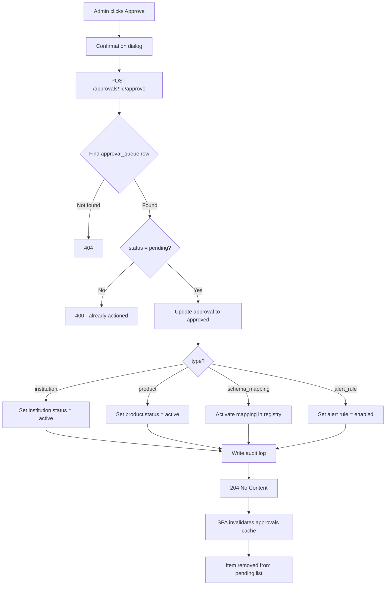
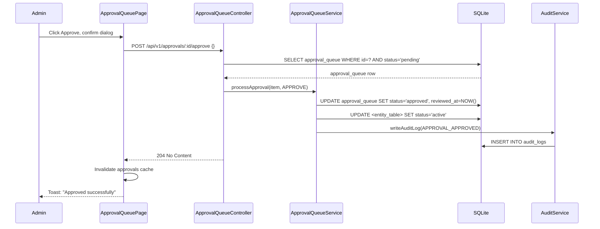

# EPIC-08 — Approval Queue Workflow

> **Epic Code:** APPQ | **Story Range:** APPQ-US-001–006
> **Owner:** Platform Engineering | **Priority:** P0–P1
> **Implementation Status:** ✅ Mostly Implemented (APPQ-US-006 Partial)

---

## 1. Executive Summary

### Purpose
The Approval Queue is the central human-in-the-loop governance workflow for the HCB platform. Every significant action that could affect data quality, security, or regulatory compliance — registering a new institution, creating a product, forming a consortium, submitting a schema mapping, or creating an alert rule — is routed through the approval queue before taking effect.

### Business Value
- Prevents unauthorized or misconfigured entities from becoming active
- Provides a single queue for all approval types, reducing context-switching for reviewers
- Deep-link routing to entity detail gives reviewers full context before deciding
- Audit trail of every approval decision for compliance evidence
- `request-changes` action allows iterative refinement without full rejection

### Key Capabilities
1. Unified queue for 6 approval types: `institution`, `product`, `consortium`, `consortium_membership`, `schema_mapping`, `alert_rule`
2. Approve / Reject / Request-Changes actions (all return 204 No Content)
3. Metadata routing: each approval item carries `metadata.institutionId`, `metadata.productId`, etc. for deep-link navigation
4. Approval history timeline per entity
5. Approval status filters and search

---

## 2. Scope

### In Scope
- Approval queue page with type/status filters
- Approve, Reject (with reason), Request Changes actions
- Deep-link navigation from approval item to entity detail
- Approval history timeline
- All 6 approval item types

### Out of Scope
- Multi-reviewer approval (current: single approver)
- Approval delegation / assignment to specific reviewers
- SLA enforcement on approval time
- Automated approval rules (all require human review)

---

## 3. Personas

| Persona | Role | Needs |
|---------|------|-------|
| Bureau Administrator | SUPER_ADMIN / BUREAU_ADMIN | Review and action all approval types |
| Submitter | ANALYST / BUREAU_ADMIN | Submit items for approval, track status |
| Compliance Officer | BUREAU_ADMIN | Audit approval history |

---

## 4. Features Overview

| Feature | Description | Status |
|---------|-------------|--------|
| Approval Queue List | Filtered list of pending items | ✅ Implemented |
| Approve Action | Approve item → activate entity | ✅ Implemented |
| Reject Action | Reject with written reason | ✅ Implemented |
| Request Changes Action | Request changes without full rejection | ✅ Implemented |
| Deep-Link Navigation | Navigate to entity from approval item | ✅ Implemented |
| Approval History Timeline | Per-entity history of decisions | ⚠️ Partial |

---

## 5. Epic-Level UI Requirements

### Screens

| Screen | Path | Description |
|--------|------|-------------|
| Approval Queue | `/approval-queue` | Paginated queue with action buttons |

### Component Behavior
- **Item type badge:** `institution`=blue, `product`=purple, `consortium`=green, `schema_mapping`=orange, `alert_rule`=red, `consortium_membership`=teal
- **Status badge:** `pending`=yellow, `approved`=green, `rejected`=red, `changes_requested`=orange
- **Approve button:** Confirmation dialog before action
- **Reject button:** Opens `ReasonInputDialog` for written reason (required)
- **Request Changes button:** Opens `ReasonInputDialog` for written reason (required)
- **View Details link:** Opens entity detail page in new tab / navigates to entity

### State Handling
| State | UI Behavior |
|-------|-------------|
| Loading | SkeletonTable |
| Empty queue | EmptyState: "No pending approvals" |
| Action in progress | Button disabled + spinner |
| Action success | Toast notification, item removed from pending list |
| Action failure | Error toast |

---

## 6. Epic-Level UI Test Cases

| Test ID | Screen | Scenario | Steps | Expected Result |
|---------|--------|----------|-------|----------------|
| APPQ-UI-TC-01 | Queue | Load approval queue | Navigate to /approval-queue | Pending items listed |
| APPQ-UI-TC-02 | Queue | Filter by type | Select "institution" filter | Only institution items shown |
| APPQ-UI-TC-03 | Queue | Approve item | Click Approve, confirm | Item removed from pending, entity activated |
| APPQ-UI-TC-04 | Queue | Reject with reason | Click Reject, enter reason, confirm | Item moves to rejected, reason stored |
| APPQ-UI-TC-05 | Queue | Request changes | Click Request Changes, enter reason | Item moves to changes_requested |
| APPQ-UI-TC-06 | Queue | Deep-link navigation | Click View Details on institution item | Institution detail page opens |

---

## 7. Story-Centric Requirements

---

### APPQ-US-001 — View the Approval Queue with Filters

#### 1. Description
> As a bureau administrator,
> I want to see all pending approval items filtered by type and date,
> So that I can prioritise and manage my review workload.

#### 2. Acceptance Criteria

```gherkin
  Scenario: View all pending items
    Given I navigate to /approval-queue
    Then I see all items with status "pending"
    Sorted by submitted_at descending

  Scenario: Filter by type
    When I select "institution" in the type filter
    Then only institution approval items are shown

  Scenario: Empty queue
    Given no pending items exist
    Then I see "No pending approvals" empty state
```

#### 3. API Requirements

`GET /api/v1/approvals?status=&type=&page=0&size=20`

**Response:**
```json
{
  "content": [
    {
      "id": "15",
      "approvalItemType": "institution",
      "entityNameSnapshot": "First National Bank",
      "description": "New institution registration",
      "approvalWorkflowStatus": "pending",
      "submittedAt": "2026-03-31T10:00:00Z",
      "submittedByUser": {"id": 2, "displayName": "Analyst User"},
      "metadata": {"institutionId": "6"}
    },
    {
      "id": "16",
      "approvalItemType": "product",
      "entityNameSnapshot": "Enhanced Credit Profile",
      "approvalWorkflowStatus": "pending",
      "metadata": {"productId": "5"}
    }
  ],
  "totalElements": 8
}
```

**Note:** `id` is a **string** (not integer) in the Spring response. The SPA handles this.

#### 4. Definition of Done
- [ ] Approval queue loads with pending items
- [ ] Filter by type and status works
- [ ] Empty state shown when queue is empty

---

### APPQ-US-002 — Approve an Item

#### 1. Description
> As a bureau administrator,
> I want to approve a pending item,
> So that the underlying entity becomes active and operational.

#### 2. Acceptance Criteria

```gherkin
  Scenario: Approve institution
    Given I see a pending institution approval item
    When I click Approve and confirm
    Then POST /api/v1/approvals/:id/approve is called
    And the response is 204 No Content
    And the institution status changes to "active"
    And the approval item status changes to "approved"
    And the approval queue is refreshed

  Scenario: Approve product
    When I approve a product approval item
    Then the product status changes to "active"

  Scenario: Approve schema mapping
    When I approve a schema_mapping item
    Then the mapping is activated and added to the registry
```

#### 3. API Requirements

`POST /api/v1/approvals/:id/approve`

**Request:** Empty body `{}`
**Response:** `204 No Content` (empty body)

**Side Effects per type:**
| Type | Effect on Entity |
|------|-----------------|
| `institution` | `institution_lifecycle_status → active` |
| `product` | `product_status → active` |
| `consortium` | `consortium_status → active` |
| `consortium_membership` | `consortium_member_status → active` |
| `schema_mapping` | Mapping activated, added to schema_mapper_registry |
| `alert_rule` | `alert_rule_status → enabled` |

#### 4. Business Logic
- `approval_workflow_status → approved`
- `reviewed_by_user_id = currentUser.id`
- `reviewed_at = NOW()`
- Audit log written: `action_type='APPROVAL_APPROVED'`, `entity_type=<type>`, `entity_id=<entityRefId>`
- The SPA `api-client` treats 204 as `undefined` — no JSON parsing attempted

#### 5. Flowchart



#### 6. Swimlane Diagram



#### 7. Definition of Done
- [ ] POST /approvals/:id/approve returns 204
- [ ] Entity status updated correctly per type
- [ ] Approval queue item status updated to approved
- [ ] Audit log written
- [ ] UI refreshes queue after action

---

### APPQ-US-003 — Reject an Item with a Reason

#### 1. Description
> As a bureau administrator,
> I want to reject a pending item with a written reason,
> So that the submitter understands what needs to change.

#### 2. API Requirements

`POST /api/v1/approvals/:id/reject`

**Request:**
```json
{
  "reason": "Missing certificate of incorporation. Please upload the required document before resubmitting."
}
```
**Response:** `204 No Content`

#### 3. Business Logic
- `approval_workflow_status → rejected`
- `rejection_reason` stored in `approval_queue`
- Entity remains in previous state (pending / draft)
- Submitter should be notified (notification system future scope)
- Audit log: `action_type='APPROVAL_REJECTED'`

#### 4. UI Requirements
- `ReasonInputDialog` opens on Reject click
- `reason` field is **required** (cannot submit empty reason)
- Minimum reason length: 20 characters

#### 5. Definition of Done
- [ ] POST /approvals/:id/reject requires non-empty reason
- [ ] Rejection reason stored in DB
- [ ] Entity status unchanged
- [ ] Audit log written

---

### APPQ-US-004 — Request Changes on an Item

#### 1. Description
> As a bureau administrator,
> I want to request changes on a pending item,
> So that the submitter can correct it without a full rejection cycle.

#### 2. API Requirements

`POST /api/v1/approvals/:id/request-changes`

**Request:**
```json
{
  "reason": "The product packet configuration is missing the derived field 'credit_score'. Please add it and resubmit."
}
```
**Response:** `204 No Content`

#### 3. Business Logic
- `approval_workflow_status → changes_requested`
- Entity can be resubmitted (which creates a new approval_queue item or resets the existing)
- Distinct from `rejected` — softer signal that the item is fixable

#### 4. Definition of Done
- [ ] POST /approvals/:id/request-changes returns 204 with reason stored
- [ ] Item status = changes_requested
- [ ] Reason displayed on the approval item

---

### APPQ-US-005 — Navigate to Entity Detail from Approval Item

#### 1. Description
> As a bureau administrator,
> I want to click through from an approval item to the underlying entity,
> So that I can review full context before making a decision.

#### 2. Business Logic — Metadata Routing

Each approval item has a `metadata` object with the entity-specific ID:

| Type | Metadata Key | Deep-Link Path |
|------|-------------|---------------|
| `institution` | `metadata.institutionId` | `/institutions/:institutionId` |
| `product` | `metadata.productId` | `/data-products/:productId` |
| `consortium` | `metadata.consortiumId` | `/consortiums/:consortiumId` |
| `consortium_membership` | `metadata.consortiumId` | `/consortiums/:consortiumId` |
| `schema_mapping` | `metadata.mappingId` | `/schema-mapper/wizard/:mappingId` |
| `alert_rule` | `metadata.alertRuleId` | `/monitoring/alert-engine/rules` |

#### 3. API Note
The `metadata` field is returned as `Record<string, string>` in the approval item — each value is a string representation of the ID.

#### 4. Definition of Done
- [ ] "View Details" link on each approval item routes to correct entity page
- [ ] Metadata routing covers all 6 approval types
- [ ] Entity page loads correctly from deep-link

---

### APPQ-US-006 — View Approval History Timeline

#### 1. Description
> As a compliance officer,
> I want to see the full approval history for any entity,
> So that I can produce a complete audit trail.

#### 2. Status: ⚠️ Partial

`ApprovalHistoryTimeline.tsx` component exists in `src/components/data-governance/`. The component is implemented but the approval history query (filtering by `entity_ref_id`) may not be fully exposed.

#### 3. Planned API

`GET /api/v1/approvals?entityRefId=<id>&type=<type>`

Returns all approval_queue rows for a given entity — both approved and rejected — in chronological order.

#### 4. Definition of Done
- [ ] Timeline shows all approval decisions for an entity in order
- [ ] Each entry shows: who acted, what action, when, and any reason
- [ ] Accessible from entity detail pages

---

## 8. Epic API Summary

| Endpoint | Method | Auth | Description | Status |
|----------|--------|------|-------------|--------|
| `GET /api/v1/approvals` | GET | Bearer (Admin) | List approval queue | ✅ |
| `POST /api/v1/approvals/:id/approve` | POST | Bearer (Admin) | Approve item → 204 | ✅ |
| `POST /api/v1/approvals/:id/reject` | POST | Bearer (Admin) | Reject item with reason → 204 | ✅ |
| `POST /api/v1/approvals/:id/request-changes` | POST | Bearer (Admin) | Request changes → 204 | ✅ |

---

## 9. Database Summary

| Table | Key Fields | Notes |
|-------|------------|-------|
| `approval_queue` | `id`, `approval_item_type`, `entity_ref_id`, `entity_name_snapshot`, `approval_workflow_status`, `rejection_reason`, `submitted_by_user_id`, `reviewed_by_user_id` | Central queue |

**Approval item types (CHECK constraint):**
`institution`, `schema_mapping`, `consortium`, `consortium_membership`, `product`, `alert_rule`

**Status states:**
`pending` → `approved` | `rejected` | `changes_requested`

---

## 10. Epic Workflows

### Workflow: Institution Registration Approval
```
Admin registers institution →
  POST /institutions → approval_queue item (institution) →
  Bureau admin reviews in /approval-queue →
    Views /institutions/:id for context →
    Clicks Approve →
    POST /approvals/:id/approve →
    Institution status → active →
    Member can now submit data
```

### Workflow: Rejection and Resubmission
```
Analyst submits schema mapping for approval →
  approval_queue item (schema_mapping) →
  Bureau admin requests changes →
  POST /approvals/:id/request-changes {reason} →
  Analyst receives notification (future) →
  Analyst corrects mapping and resubmits →
  New approval_queue item created →
  Bureau admin approves →
  Mapping activated
```

---

## 11. KPIs

| KPI | Target |
|-----|--------|
| Average approval turnaround time | < 1 business day |
| Approval rate (first submission) | > 70% |
| Rejection with reason compliance | 100% (no empty rejections) |
| Queue backlog (pending > 3 days) | 0 |

---

## 12. Risks

| Risk | Impact | Mitigation |
|------|--------|-----------|
| Single approver bottleneck | Operations delay | Add multi-reviewer in Phase 2 |
| No notification to submitter on rejection | Process inefficiency | Add email/in-app notification in Phase 2 |
| `changes_requested` state not fully wired in all entity flows | Partial | Test each entity type end-to-end |

---

## 13. Gap Analysis

| Gap | Story | Severity |
|-----|-------|----------|
| Approval history filtered by entity_ref_id not confirmed | APPQ-US-006 | Low |
| No submitter notification on approval/rejection | All | Medium |
| Multi-reviewer not supported | All | Low |

---

## 14. Execution Roadmap

| Phase | Stories | Description |
|-------|---------|-------------|
| Phase 1 | APPQ-US-001–005 | All implemented — production-ready |
| Phase 2 | APPQ-US-006 | Complete approval history timeline |
| Phase 3 | — | Email/in-app notifications on approval decisions |
| Phase 4 | — | Multi-reviewer with quorum rules, SLA tracking |
