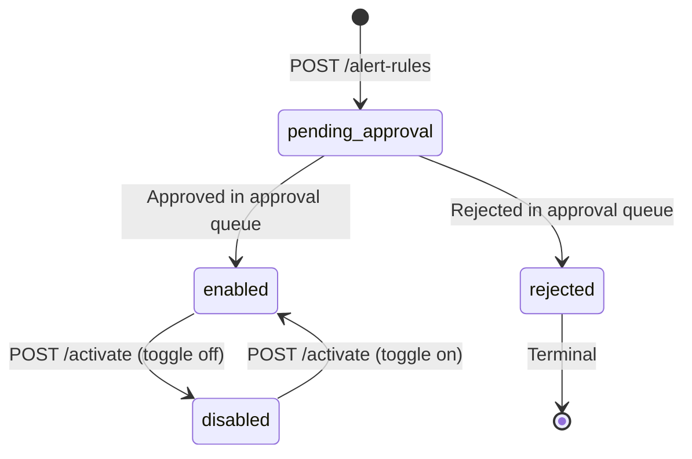
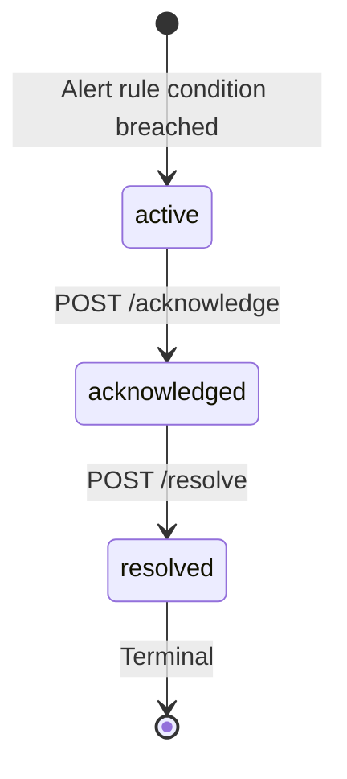

# EPIC-10 — Alert Engine & SLA

> **Epic Code:** ALRT | **Story Range:** ALRT-US-001–007
> **Owner:** Platform Engineering / Operations | **Priority:** P0–P2
> **Implementation Status:** ✅ Mostly Implemented (ALRT-US-007 Missing)

---

## 1. Executive Summary

### Purpose
The Alert Engine is the proactive health management layer of the HCB platform. It evaluates platform metrics against configurable rule conditions and fires incidents when thresholds are breached. SLA configurations define acceptable performance boundaries. Together, they enable bureau administrators to move from reactive (discover failures from monitoring logs) to proactive (receive alerts before users are impacted).

### Business Value
- Automatic incident creation when thresholds are breached, reducing Mean Time to Detect (MTTD)
- Configurable severity levels (LOW, MEDIUM, HIGH, CRITICAL) for graduated response workflows
- SLA thresholds for business-critical metrics (API latency, batch processing time, success rate)
- Incident lifecycle tracking (active → acknowledged → resolved) with full audit trail
- Auto-remediation stub enables future automated recovery workflows

### Key Capabilities
1. Create and manage alert rules with metric conditions, thresholds, and severities
2. Activate/disable alert rules (with approval gate when `pending_approval`)
3. Configure SLA thresholds per metric type and institution scope
4. View SLA breach history with timeline
5. View and manage active alert incidents
6. Acknowledge and resolve incidents (lifecycle management)
7. Auto-remediation configuration (stub — future implementation)

---

## 2. Scope

### In Scope
- `AlertRuleController` — CRUD and activate/disable
- `AlertIncidentController` — incident management, acknowledge, resolve
- `SlaConfigController` — SLA configuration, breach history
- Alert monitoring dashboard (`AlertMonitoringDashboard.tsx`)
- Alert rules dashboard (`AlertRulesDashboard.tsx`)
- SLA configuration panel (`SlaConfigurationPanel.tsx`)
- SLA breach history (`SlaBreachHistory.tsx`)
- Approval queue integration for new alert rules
- Auto-remediation settings stub (`AutoRemediationSettings.tsx`)

### Out of Scope
- Outbound notifications (email/SMS/webhook) — future phase
- Machine learning-based anomaly detection
- Cross-bureau alert correlation
- PagerDuty / OpsGenie integration

---

## 3. Personas

| Persona | Role | Needs |
|---------|------|-------|
| Bureau Administrator | BUREAU_ADMIN | Create/manage alert rules, configure SLA |
| Operations Team | BUREAU_ADMIN | Monitor active incidents, acknowledge, resolve |
| Data Analyst | ANALYST | View alert dashboard and SLA breach history |
| Viewer | VIEWER | Read-only alert and SLA views |

---

## 4. Features Overview

| Feature | Description | Status |
|---------|-------------|--------|
| Alert Monitoring Dashboard | Active incidents overview with charts | ⚠️ Partial (charts use mock data) |
| Create Alert Rule | Define metric condition, threshold, severity | ✅ Implemented |
| Activate/Disable Alert Rule | Toggle rule with approval gate | ✅ Implemented |
| Configure SLA Threshold | Per-metric SLA boundaries | ✅ Implemented |
| SLA Breach History | Timeline of past breaches | ✅ Implemented |
| Acknowledge Incident | Mark incident acknowledged | ✅ Implemented |
| Resolve Incident | Mark incident resolved | ✅ Implemented |
| Auto-Remediation Settings | Configure automated responses | ❌ Not Implemented |

---

## 5. Epic-Level UI Requirements

### Screens

| Screen | Path | Description |
|--------|------|-------------|
| Alert Monitoring Dashboard | `/monitoring/alert-engine` | Active incidents + charts |
| Alert Rules | `/monitoring/alert-engine/rules` | Rule list and management |
| SLA Configuration | `/monitoring/alert-engine/sla` | SLA thresholds |
| SLA Breach History | `/monitoring/alert-engine/sla/breaches` | Breach timeline |
| Auto-Remediation | `/monitoring/alert-engine/auto-remediation` | Settings stub |

### Component Behavior
- **Alert severity badges:** `CRITICAL`=red, `HIGH`=orange, `MEDIUM`=yellow, `LOW`=blue
- **Incident status badges:** `active`=red, `acknowledged`=yellow, `resolved`=green
- **Rule status badges:** `Pending approval`=yellow, `Enabled`=green, `Disabled`=gray
- **Acknowledge button:** Only visible on `active` incidents
- **Resolve button:** Only visible on `acknowledged` incidents
- **Activate button:** Returns 400 while rule is `pending_approval` — show appropriate error message

### State Handling
| State | UI Behavior |
|-------|-------------|
| No active incidents | "All clear" green state card |
| CRITICAL incident | Red banner at top of alert dashboard |
| Rule pending_approval | "Pending" badge, Activate disabled |

---

## 6. Epic-Level UI Test Cases

| Test ID | Screen | Scenario | Steps | Expected Result |
|---------|--------|----------|-------|----------------|
| ALRT-UI-TC-01 | Dashboard | Load alert dashboard | Navigate to /monitoring/alert-engine | Active incidents and charts visible |
| ALRT-UI-TC-02 | Rules | Create alert rule | Click Create, fill form, submit | New rule with pending_approval status |
| ALRT-UI-TC-03 | Rules | Activate pending rule | Click Activate on pending_approval rule | 400 error shown: "Rule pending approval" |
| ALRT-UI-TC-04 | Dashboard | Acknowledge incident | Click Acknowledge on active incident | Status changes to acknowledged |
| ALRT-UI-TC-05 | Dashboard | Resolve incident | Click Resolve on acknowledged incident | Status changes to resolved |
| ALRT-UI-TC-06 | SLA | Configure SLA | Fill SLA form, submit | SLA threshold saved |

---

## 7. Story-Centric Requirements

---

### ALRT-US-001 — View Alert Monitoring Dashboard

#### 1. Description
> As a bureau administrator,
> I want to see all active incidents, their severity, and recent alert trend charts,
> So that I can triage platform health issues quickly.

#### 2. Acceptance Criteria

```gherkin
  Scenario: Dashboard loads
    Given I navigate to /monitoring/alert-engine
    Then I see active incidents grouped by severity
    And I see alert trend charts for the last 7 days
    And I see SLA compliance percentage for each configured SLA

  Scenario: No active incidents
    Given no incidents are in "active" status
    Then I see "All systems operational" message
```

#### 3. API Requirements

`GET /api/v1/alert-incidents?status=active`
`GET /api/v1/alert-rules` (for rule state overview)

**Note:** Alert charts currently use `alert-engine-mock.ts` in the SPA for chart aggregation. The Spring API returns incidents but chart data aggregation is not implemented.

#### 4. Gap: Alert dashboard charts use mock data from `alert-engine-mock.ts`. Spring needs `GET /api/v1/alert-incidents/charts` endpoint.

#### 5. Definition of Done
- [ ] Active incidents load from real API
- [ ] Alert charts load from real API (not mock)
- [ ] SLA compliance summary visible

---

### ALRT-US-002 — Create an Alert Rule

#### 1. Description
> As a bureau administrator,
> I want to define a metric condition and severity for a new alert rule,
> So that automatic monitoring is configured.

#### 2. Acceptance Criteria

```gherkin
  Scenario: Create alert rule
    Given I fill the Create Alert Rule form
    When I submit
    Then POST /api/v1/alert-rules is called
    And the rule is created with alert_rule_status = "pending_approval"
    And an approval_queue item with type "alert_rule" is created

  Scenario: Activate rule while pending approval
    Given a rule has alert_rule_status = "pending_approval"
    When I click Activate
    Then POST /api/v1/alert-rules/:id/activate returns 400
    And I see "This rule must be approved before activation"
```

#### 3. UI Form Fields

| Field | Type | Options | Required |
|-------|------|---------|----------|
| Rule Name | text | — | Yes |
| Rule Description | textarea | — | No |
| Alert Type | select | api_latency, success_rate, rejection_rate, batch_duration, queue_depth | Yes |
| Condition Operator | select | `>`, `<`, `>=`, `<=`, `==` | Yes |
| Threshold Value | number | — | Yes |
| Threshold Unit | select | ms, percent, count | Yes |
| Severity | select | LOW, MEDIUM, HIGH, CRITICAL | Yes |
| Evaluation Window | select | 5min, 15min, 30min, 1h, 24h | Yes |
| Institution Scope | select | All, specific institution | No |

#### 4. API Requirements

`POST /api/v1/alert-rules`

**Request:**
```json
{
  "ruleName": "High Latency Alert",
  "alertType": "api_latency",
  "conditionOperator": ">",
  "thresholdValue": 2000,
  "thresholdUnit": "ms",
  "severityLevel": "HIGH",
  "evaluationWindow": "15min",
  "institutionId": null
}
```

**Response (201):**
```json
{
  "id": 8,
  "ruleName": "High Latency Alert",
  "alertRuleStatus": "pending_approval"
}
```

**Side Effects:**
- `approval_queue` row inserted with `approval_item_type='alert_rule'`, `metadata.alertRuleId=8`
- `GET /api/v1/alert-rules` maps `alert_rule_status` to UI strings: `Pending approval`, `Enabled`, `Disabled`

#### 5. Database

```sql
INSERT INTO alert_rules (rule_name, alert_type, condition_operator,
  threshold_value, threshold_unit, severity_level, evaluation_window,
  alert_rule_status)
VALUES ('High Latency Alert', 'api_latency', '>',
  2000, 'ms', 'HIGH', '15min', 'pending_approval');
```

#### 6. Status State Machine



#### 7. Business Logic — Activate API Guard
- `POST /api/v1/alert-rules/:id/activate` returns **400** while `alert_rule_status = 'pending_approval'`
- This prevents bypassing the approval workflow
- Error response: `{"errorCode": "ERR_RULE_PENDING_APPROVAL", "message": "This alert rule cannot be activated while it is pending approval"}`

#### 8. Flowchart

```mermaid
flowchart TD
    A[Admin fills Create Alert Rule form] --> B[POST /api/v1/alert-rules]
    B --> C[INSERT alert_rules - status: pending_approval]
    C --> D[INSERT approval_queue - type: alert_rule]
    D --> E[Return 201 {status: pending_approval}]
    E --> F[Bureau admin reviews in approval queue]
    F --> G{Approve?}
    G -->|Yes| H[alert_rule_status → enabled]
    G -->|No| I[alert_rule_status → rejected]
    H --> J[Alert engine starts evaluating rule]
```

#### 9. Definition of Done
- [ ] POST /alert-rules creates rule with pending_approval status
- [ ] Approval queue item created with type alert_rule
- [ ] Activate returns 400 while pending_approval
- [ ] Approved rule transitions to enabled

---

### ALRT-US-003 — Activate or Disable an Alert Rule

#### 1. Description
> As a bureau administrator,
> I want to enable or disable alert rules without deleting them,
> So that I can temporarily pause monitoring without losing configuration.

#### 2. API Requirements

`POST /api/v1/alert-rules/:id/activate`

**Request:** `{}` (empty body)

**Response (200):** Updated rule with new `alertRuleStatus`

**Behavior:**
- `enabled` → calls this endpoint → toggles to `disabled`
- `disabled` → calls this endpoint → toggles to `enabled`
- `pending_approval` → calls this endpoint → **400** `ERR_RULE_PENDING_APPROVAL`

#### 3. Definition of Done
- [ ] Toggle works for enabled ↔ disabled
- [ ] 400 returned when rule is pending_approval
- [ ] UI shows correct status after toggle

---

### ALRT-US-004 — Configure an SLA Threshold

#### 1. Description
> As a bureau administrator,
> I want to define SLA thresholds for critical metrics,
> So that breach detection is automated.

#### 2. API Requirements

`POST /api/v1/sla-configs`

**Request:**
```json
{
  "slaName": "API Response Time SLA",
  "metricType": "api_latency",
  "warningThresholdMs": 1000,
  "criticalThresholdMs": 2000,
  "evaluationPeriodMinutes": 15,
  "institutionId": null
}
```

**Response (201):**
```json
{
  "id": 3,
  "slaName": "API Response Time SLA",
  "metricType": "api_latency",
  "slaStatus": "active"
}
```

#### 3. SLA Metric Types

| Metric Type | Description | Typical SLA |
|-------------|-------------|-------------|
| `api_latency` | P95 API response time | < 500ms warning, < 2000ms critical |
| `batch_duration` | Total batch processing time | < 30min warning, < 2h critical |
| `success_rate` | API success rate (%) | < 98% warning, < 95% critical |
| `rejection_rate` | API rejection rate (%) | > 5% warning, > 15% critical |

#### 4. Database

```sql
INSERT INTO sla_configs (sla_name, metric_type, warning_threshold,
  critical_threshold, evaluation_period_minutes, sla_status)
VALUES ('API Response Time SLA', 'api_latency', 1000, 2000, 15, 'active');
```

#### 5. Definition of Done
- [ ] POST /sla-configs creates SLA with active status
- [ ] SLA listed in SLA Configuration panel
- [ ] Warning and critical thresholds stored separately

---

### ALRT-US-005 — View SLA Breach History

#### 1. Description
> As a bureau administrator,
> I want to see a timeline of past SLA breaches,
> So that I can identify recurring performance issues and negotiate corrective measures.

#### 2. API Requirements

`GET /api/v1/sla-configs/breaches?slaConfigId=&dateFrom=&dateTo=&page=0&size=20`

**Response:**
```json
{
  "content": [
    {
      "id": 12,
      "slaConfigId": 3,
      "slaName": "API Response Time SLA",
      "breachType": "critical",
      "actualValue": 3456,
      "thresholdValue": 2000,
      "breachedAt": "2026-03-28T14:30:00Z",
      "resolvedAt": "2026-03-28T15:00:00Z",
      "durationMinutes": 30
    }
  ]
}
```

#### 3. Database

```sql
SELECT sb.*, sc.sla_name, sc.metric_type
FROM sla_breaches sb
JOIN sla_configs sc ON sc.id = sb.sla_config_id
WHERE sb.breached_at >= ?
ORDER BY sb.breached_at DESC;
```

#### 4. Definition of Done
- [ ] Breach history loads with correct data
- [ ] Filter by SLA and date range works
- [ ] Duration calculated correctly (resolved_at - breached_at)

---

### ALRT-US-006 — Acknowledge and Resolve an Alert Incident

#### 1. Description
> As a bureau administrator,
> I want to acknowledge and then resolve an active incident,
> So that the incident lifecycle is properly tracked.

#### 2. Acceptance Criteria

```gherkin
  Scenario: Acknowledge active incident
    Given an incident with status "active"
    When I click Acknowledge
    Then POST /api/v1/alert-incidents/:id/acknowledge is called
    And incident status changes to "acknowledged"
    And acknowledged_at timestamp is set

  Scenario: Resolve acknowledged incident
    Given an incident with status "acknowledged"
    When I click Resolve
    Then POST /api/v1/alert-incidents/:id/resolve is called
    And incident status changes to "resolved"
    And resolved_at timestamp is set

  Scenario: Cannot acknowledge resolved incident
    Given an incident with status "resolved"
    Then Acknowledge button is not shown
```

#### 3. API Requirements

**Acknowledge:** `POST /api/v1/alert-incidents/:id/acknowledge`
**Resolve:** `POST /api/v1/alert-incidents/:id/resolve`

**Both return:** `200` with updated incident object

#### 4. Incident Lifecycle



#### 5. Database

```sql
-- Acknowledge
UPDATE alert_incidents
SET alert_incident_status = 'acknowledged', acknowledged_at = CURRENT_TIMESTAMP
WHERE id = ?;

-- Resolve
UPDATE alert_incidents
SET alert_incident_status = 'resolved', resolved_at = CURRENT_TIMESTAMP
WHERE id = ?;
```

#### 6. Definition of Done
- [ ] Acknowledge endpoint updates status and acknowledged_at
- [ ] Resolve endpoint updates status and resolved_at
- [ ] UI buttons only visible for correct state transitions
- [ ] Audit log written on each lifecycle transition

---

### ALRT-US-007 — Configure Auto-Remediation Settings

#### 1. Description
> As a bureau administrator,
> I want to define automated responses to recurring alert conditions,
> So that platform recovery is faster and reduces manual intervention.

#### 2. Status: ❌ Not Implemented

`AutoRemediationSettings.tsx` is a placeholder UI stub. No backend implementation exists.

#### 3. Planned Capability

Auto-remediation actions (planned):
| Trigger | Automated Action |
|---------|-----------------|
| `rejection_rate > 30%` | Suspend ingestion for institution |
| `api_latency > 5000ms` | Enable request queue throttling |
| `batch_duration > 4h` | Kill and retry batch job |
| `queue_depth > 1000` | Scale up processing workers |

#### 4. Planned API (future)

`POST /api/v1/alert-rules/:id/remediation-action`

```json
{
  "actionType": "SUSPEND_INSTITUTION_INGESTION",
  "parameters": {"institutionId": "auto"},
  "enabled": true
}
```

#### 5. Gap: Auto-remediation backend entirely missing. UI stub only.

---

## 8. Epic API Summary

| Endpoint | Method | Auth | Description | Status |
|----------|--------|------|-------------|--------|
| `GET /api/v1/alert-rules` | GET | Bearer | List alert rules | ✅ |
| `POST /api/v1/alert-rules` | POST | Bearer (Admin) | Create alert rule | ✅ |
| `POST /api/v1/alert-rules/:id/activate` | POST | Bearer (Admin) | Activate/disable rule (400 if pending) | ✅ |
| `GET /api/v1/alert-incidents` | GET | Bearer | List alert incidents | ✅ |
| `POST /api/v1/alert-incidents/:id/acknowledge` | POST | Bearer (Admin) | Acknowledge incident | ✅ |
| `POST /api/v1/alert-incidents/:id/resolve` | POST | Bearer (Admin) | Resolve incident | ✅ |
| `GET /api/v1/sla-configs` | GET | Bearer | List SLA configurations | ✅ |
| `POST /api/v1/sla-configs` | POST | Bearer (Admin) | Create SLA configuration | ✅ |
| `GET /api/v1/sla-configs/breaches` | GET | Bearer | SLA breach history | ✅ |
| `GET /api/v1/alert-incidents/charts` | GET | Bearer | Alert chart aggregation | ❌ Missing |

---

## 9. Database Summary

| Table | Key Fields | Notes |
|-------|------------|-------|
| `alert_rules` | `id`, `rule_name`, `alert_type`, `condition_operator`, `threshold_value`, `severity_level`, `alert_rule_status` | Rule definitions |
| `alert_incidents` | `id`, `alert_rule_id`, `alert_incident_status`, `acknowledged_at`, `resolved_at` | Incident lifecycle |
| `sla_configs` | `id`, `sla_name`, `metric_type`, `warning_threshold`, `critical_threshold` | SLA boundaries |
| `sla_breaches` | `id`, `sla_config_id`, `breach_type`, `actual_value`, `breached_at`, `resolved_at` | Breach log |

---

## 10. Epic Workflows

### Workflow: Alert Incident Lifecycle
```
Alert rule enabled + metric condition breached →
  alert_incidents row created (status: active) →
  Red banner on Alert Dashboard →
  Admin investigates via Monitoring (EPIC-09) →
  Acknowledges incident: status → acknowledged →
  Fix applied (e.g. institution reactivated) →
  Resolve incident: status → resolved →
  Incident archived
```

---

## 11. KPIs

| KPI | Target |
|-----|--------|
| Mean Time to Detect (MTTD) | < 5 minutes after breach |
| Mean Time to Acknowledge (MTTA) | < 30 minutes |
| Mean Time to Resolve (MTTR) | < 2 hours |
| SLA compliance rate | > 99.5% |

---

## 12. Risks

| Risk | Impact | Mitigation |
|------|--------|-----------|
| Alert rules not evaluated in real-time | Delays detection | Implement scheduled evaluation job |
| Alert storm (many rules breach simultaneously) | Noise | Add de-duplication and cooldown period |
| Auto-remediation not implemented | Manual effort required | Phase 3 priority |

---

## 13. Gap Analysis

| Gap | Story | Severity |
|-----|-------|----------|
| Alert charts use mock data | ALRT-US-001 | Medium |
| `GET /alert-incidents/charts` not implemented | ALRT-US-001 | Medium |
| Auto-remediation backend entirely missing | ALRT-US-007 | Low (Phase 3) |
| Alert engine evaluation scheduler not documented | All | Medium |

---

## 14. Execution Roadmap

| Phase | Stories | Description |
|-------|---------|-------------|
| Phase 1 | ALRT-US-001–006 | Mostly implemented — replace mock chart data |
| Phase 2 | ALRT-US-001 | Implement `GET /alert-incidents/charts` |
| Phase 3 | ALRT-US-007 | Implement auto-remediation action framework |
| Phase 4 | — | Outbound notifications (email, webhook), PagerDuty integration |
