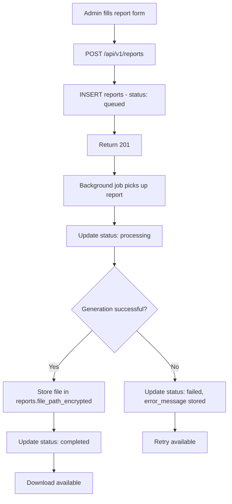

# EPIC-11 — Reporting

> **Epic Code:** RPT | **Story Range:** RPT-US-001–005
> **Owner:** Platform Engineering | **Priority:** P0–P1
> **Implementation Status:** ✅ Mostly Implemented (RPT-US-005 Partial)

---

## 1. Executive Summary

### Purpose
The Reporting module provides bureau administrators with on-demand report generation for operational analysis, regulatory compliance, and stakeholder communication. Reports are queued, processed asynchronously in the background, and made available for download in multiple formats (PDF, CSV, XLSX). The module tracks the full report lifecycle from request through processing to completion or failure.

### Business Value
- Regulatory submissions require formatted, dated credit bureau reports
- Operational reports give management visibility into platform performance
- Async processing prevents large report jobs from blocking API operations
- Cancel and retry mechanisms ensure users can recover from transient failures
- Status normalization (`reportStatusesEqual`) ensures filter reliability

### Key Capabilities
1. Request reports with type, date range, institution scope, and format
2. View report list with rich status filters
3. Cancel queued or processing reports
4. Retry failed reports
5. Download completed reports

---

## 2. Scope

### In Scope
- `ReportController` endpoints for CRUD, cancel, retry, download
- `ReportListPage.tsx` — report list with filters and actions
- `NewReportRequestPage.tsx` — report request form
- Status normalization with `reportStatusesEqual`
- All report lifecycle states

### Out of Scope
- Scheduled/recurring reports
- Report template customization
- Report sharing with external parties
- Real-time report streaming

---

## 3. Personas

| Persona | Role | Needs |
|---------|------|-------|
| Bureau Administrator | BUREAU_ADMIN | Request reports, download, share |
| Compliance Officer | BUREAU_ADMIN | Regulatory reports for submission |
| Data Analyst | ANALYST | Operational and performance reports |

---

## 4. Features Overview

| Feature | Description | Status |
|---------|-------------|--------|
| Request Report | Form with type, date range, format | ✅ Implemented |
| Report List | Paginated list with status filter | ✅ Implemented |
| Cancel Report | Cancel queued/processing report | ✅ Implemented |
| Retry Report | Retry failed report | ✅ Implemented |
| Download Report | Download completed report | ⚠️ Partial |

---

## 5. Epic-Level UI Requirements

### Screens

| Screen | Path | Description |
|--------|------|-------------|
| Report List | `/reporting` | Report history with actions |
| New Report Request | `/reporting/new` | Report configuration form |

### Component Behavior
- **Status badges:** `queued`=yellow, `processing`=blue, `completed`=green, `failed`=red, `cancelled`=gray
- **Status normalization:** `reportStatusesEqual` function handles case-insensitive comparison between API `queued` and filter `Queued`
- **Cancel button:** Only for `queued` or `processing` status
- **Retry button:** Only for `failed` status
- **Download button:** Only for `completed` status

### State Handling
| State | UI Behavior |
|-------|-------------|
| Loading reports | SkeletonTable |
| Empty list | EmptyState with "Request your first report" CTA |
| Report processing | Blue processing badge, no download button |
| Report failed | Red failed badge, Retry button |
| Report completed | Green badge, Download button |

---

## 6. Epic-Level UI Test Cases

| Test ID | Screen | Scenario | Steps | Expected Result |
|---------|--------|----------|-------|----------------|
| RPT-UI-TC-01 | List | Load report list | Navigate to /reporting | Report rows with status badges |
| RPT-UI-TC-02 | New Report | Request report | Fill form, submit | Report created with queued status |
| RPT-UI-TC-03 | List | Filter by status | Select "completed" | Only completed reports shown |
| RPT-UI-TC-04 | List | Cancel queued report | Click Cancel | Report status → cancelled |
| RPT-UI-TC-05 | List | Retry failed report | Click Retry | New processing job triggered |

---

## 7. Story-Centric Requirements

---

### RPT-US-001 — Request a New Report

#### 1. Description
> As a bureau administrator,
> I want to submit a report request with type, date range, and format,
> So that the report is queued for generation.

#### 2. Acceptance Criteria

```gherkin
  Scenario: Submit report request
    Given I am on the New Report Request page
    When I fill in all required fields and click Submit
    Then POST /api/v1/reports is called
    And the report is created with status "queued"
    And I am redirected to the report list

  Scenario: Invalid date range
    When I submit with dateFrom after dateTo
    Then I see a validation error: "Date from must be before date to"
```

#### 3. UI Form Fields

| Field | Type | Options | Required |
|-------|------|---------|----------|
| Report Type | select | Portfolio Summary, Member Activity, Data Quality, Compliance, SLA Performance, API Usage | Yes |
| Date From | date picker | — | Yes |
| Date To | date picker | — | Yes |
| Institution | select | All or specific institution | No |
| Format | select | PDF, CSV, XLSX | Yes |
| Description | textarea | — | No |

#### 4. API Requirements

`POST /api/v1/reports`

**Request:**
```json
{
  "reportType": "portfolio_summary",
  "dateFrom": "2026-01-01",
  "dateTo": "2026-03-31",
  "institutionId": null,
  "format": "PDF",
  "description": "Q1 2026 Portfolio Summary"
}
```

**Response (201):**
```json
{
  "id": 12,
  "reportName": "Portfolio Summary - Q1 2026",
  "reportType": "portfolio_summary",
  "reportStatus": "queued",
  "requestedAt": "2026-03-31T10:00:00Z"
}
```

#### 5. Database

```sql
INSERT INTO reports (report_name, report_type, date_range_from, date_range_to,
  institution_id, report_format, report_status, requested_by_user_id)
VALUES ('Portfolio Summary - Q1 2026', 'portfolio_summary',
  '2026-01-01', '2026-03-31', NULL, 'PDF', 'queued', 1);
```

#### 6. Status / State Management

| Status | Description | Trigger | Next States |
|--------|-------------|---------|-------------|
| `queued` | Submitted, awaiting processing | POST /reports | `processing`, `cancelled` |
| `processing` | Report generation in progress | Background job picks up | `completed`, `failed` |
| `completed` | Report file generated and available | Job finishes | `cancelled` (no, terminal) |
| `failed` | Generation failed | Job error | `queued` (via retry) |
| `cancelled` | Manually cancelled | POST /reports/:id/cancel | Terminal |

#### 7. Flowchart



#### 8. Definition of Done
- [ ] POST /reports creates report with queued status
- [ ] Report visible in list immediately after submission
- [ ] Validation prevents invalid date ranges

---

### RPT-US-002 — View Report List with Filters

#### 1. Description
> As a bureau administrator,
> I want to browse submitted reports with filters,
> So that I can track report progress and access completed ones.

#### 2. API Requirements

`GET /api/v1/reports?status=&type=&dateFrom=&dateTo=&institutionId=&page=0&size=20`

**Response:**
```json
{
  "content": [
    {
      "id": 12,
      "reportName": "Portfolio Summary - Q1 2026",
      "reportType": "portfolio_summary",
      "reportStatus": "completed",
      "format": "PDF",
      "requestedAt": "2026-03-31T10:00:00Z",
      "completedAt": "2026-03-31T10:05:00Z",
      "fileSizeBytes": 245760
    }
  ]
}
```

#### 3. Status Normalization

`reportStatusesEqual(apiStatus, filterValue)` — case-insensitive comparison:
- API returns: `queued`, `processing`, `completed`, `failed`, `cancelled`
- Filter options match case-insensitively so `Queued` matches `queued`

**STATUS_OPTIONS:**
```typescript
[
  { value: 'all', label: 'All Statuses' },
  { value: 'queued', label: 'Queued' },
  { value: 'processing', label: 'Processing' },
  { value: 'completed', label: 'Completed' },
  { value: 'failed', label: 'Failed' },
  { value: 'cancelled', label: 'Cancelled' }
]
```

#### 4. Definition of Done
- [ ] Report list loads with all reports
- [ ] Status filter uses `reportStatusesEqual` for case-insensitive matching
- [ ] Filter by type and date works
- [ ] Correct action buttons shown per status

---

### RPT-US-003 — Cancel a Queued Report

#### 1. Description
> As a bureau administrator,
> I want to cancel a queued or processing report,
> So that unnecessary computation is avoided for erroneous requests.

#### 2. API Requirements

`POST /api/v1/reports/:id/cancel`

**Request:** `{}` (empty body)
**Response:** `200` with updated report (status: cancelled)

#### 3. Business Logic
- Only `queued` and `processing` reports can be cancelled
- `completed` and `cancelled` reports return 400 on cancel attempt
- Background job checks for cancellation before writing output

#### 4. Definition of Done
- [ ] Cancel changes status to cancelled
- [ ] Cancel button only visible for queued/processing reports
- [ ] 400 returned if report already completed or cancelled

---

### RPT-US-004 — Retry a Failed Report

#### 1. Description
> As a bureau administrator,
> I want to retry a failed report,
> So that I can recover from transient processing errors.

#### 2. API Requirements

`POST /api/v1/reports/:id/retry`

**Request:** `{}` (empty body)
**Response:** `200` with updated report (status: queued)

#### 3. Business Logic
- Only `failed` reports can be retried
- Retry resets `report_status → queued` and clears `error_message`
- A new background job is queued for the same report parameters

#### 4. Definition of Done
- [ ] Retry resets failed report to queued
- [ ] Retry button only visible for failed reports
- [ ] 400 if report is not in failed status

---

### RPT-US-005 — Download a Completed Report

#### 1. Description
> As a bureau administrator,
> I want to download a completed report in my chosen format,
> So that I can use it for regulatory submission or analysis.

#### 2. Status: ⚠️ Partial

`file_path_encrypted` column exists in the `reports` table but the download endpoint is not confirmed as fully implemented in Spring.

#### 3. Planned API Requirements

`GET /api/v1/reports/:id/download`

**Response:**
- Content-Type: `application/pdf`, `text/csv`, or `application/vnd.openxmlformats-officedocument.spreadsheetml.sheet`
- Content-Disposition: `attachment; filename="<report_name>.<extension>"`
- Body: Binary file stream

#### 4. Business Logic
- Only `completed` reports have a downloadable file
- File stored at `file_path_encrypted` in DB (or S3/object storage in production)
- Download endpoint decrypts path and streams file to client
- Access controlled: only users with ANALYST+ role can download

#### 5. Gap: Download endpoint not fully verified in Spring. `file_path_encrypted` field exists but streaming endpoint unclear.

#### 6. Definition of Done
- [ ] Download button triggers file download in correct format
- [ ] Content-Disposition header set for browser save-as prompt
- [ ] Download only available for completed reports
- [ ] Role check: VIEWER cannot download

---

## 8. Epic API Summary

| Endpoint | Method | Auth | Description | Status |
|----------|--------|------|-------------|--------|
| `GET /api/v1/reports` | GET | Bearer | List reports with filters | ✅ |
| `POST /api/v1/reports` | POST | Bearer (Analyst+) | Request new report | ✅ |
| `GET /api/v1/reports/:id` | GET | Bearer | Report detail | ✅ |
| `POST /api/v1/reports/:id/cancel` | POST | Bearer (Analyst+) | Cancel report | ✅ |
| `POST /api/v1/reports/:id/retry` | POST | Bearer (Analyst+) | Retry failed report | ✅ |
| `GET /api/v1/reports/:id/download` | GET | Bearer (Analyst+) | Download completed report | ⚠️ Partial |

---

## 9. Database Summary

| Table | Key Fields | Notes |
|-------|------------|-------|
| `reports` | `id`, `report_name`, `report_type`, `report_status`, `date_range_from`, `date_range_to`, `report_format`, `file_path_encrypted`, `error_message` | Report lifecycle |

---

## 10. Epic Workflows

### Workflow: Report Request to Download
```
Admin fills New Report Request form →
  POST /reports → status: queued →
  Background job: generate report data →
  Status: processing →
  Export to PDF/CSV/XLSX →
  Status: completed, file stored →
  Admin downloads via GET /reports/:id/download
```

---

## 11. KPIs

| KPI | Target |
|-----|--------|
| Report generation time (P95) | < 5 minutes for standard reports |
| Report success rate | > 99% |
| Average download latency | < 2 seconds |

---

## 12. Risks

| Risk | Impact | Mitigation |
|------|--------|-----------|
| Large report files stored in SQLite BLOB | DB size | Move file storage to object storage (S3) in production |
| Download endpoint not secured | Data leak | Role-based access + audit log on download |

---

## 13. Gap Analysis

| Gap | Story | Severity |
|-----|-------|----------|
| Download endpoint not fully verified | RPT-US-005 | Medium |
| Report generation background job not documented | All | Medium |

---

## 14. Execution Roadmap

| Phase | Stories | Description |
|-------|---------|-------------|
| Phase 1 | RPT-US-001–004 | Implemented — production-ready |
| Phase 2 | RPT-US-005 | Verify and complete download endpoint |
| Phase 3 | — | Scheduled/recurring report generation |
| Phase 4 | — | Report templates, branding, e-signature for regulatory submissions |
