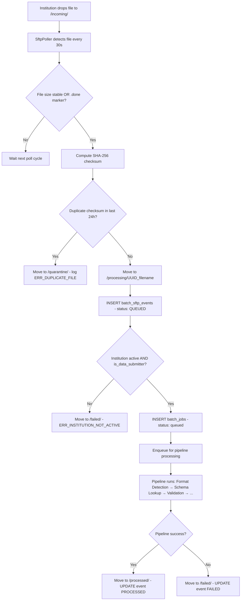

# EPIC-14 — Batch Pipeline (Schemaless SFTP + HTTP Ingestion)

> **Epic Code:** BATCH | **Story Range:** BATCH-US-001–013
> **Owner:** Data Engineering / Platform Engineering | **Priority:** P0
> **Implementation Status:** ⚠️ Partial (BATCH-US-001–009 mostly implemented; BATCH-US-010–013 new design)
> **Note:** This epic has **no UI screens**. It documents the backend batch processing pipeline as an engineering and compliance contract.
> **Revision:** Added schemaless SFTP intake (BATCH-US-010), multi-format file parsing (BATCH-US-011), schema auto-detection (BATCH-US-012), and full monitoring KPI tracking (BATCH-US-013).

---

## 1. Executive Summary

### Purpose

The Batch Pipeline is the bulk data ingestion pathway of the HCB credit bureau. Member institutions submit credit data files in **any format** (CSV, JSON, fixed-width, XML) by placing them in a **designated SFTP folder** assigned to their institution. The platform **automatically picks up the file**, detects its format, resolves the institution's active schema mapping from the Schema Mapper registry, and processes every record through the full pipeline — Field Validation, Field Mapping, Data Transformation, Data Load, and Post-processing — without the member needing to conform to any bureau-defined structure.

Files may also be submitted via multipart HTTP POST (existing path). Both intake channels converge at the same internal pipeline after intake.

### What "Schemaless Batch" Means Here

> **Schemaless** means the member institution places a file in their SFTP folder in whatever format their core banking or operational system produces — CSV export, JSON dump, fixed-width report, or XML. They do not reformat to match the bureau. The pipeline auto-detects the file format, looks up the institution's active approved schema mapping from `schema_mapper_registry`, and applies `mapping_pairs` to produce the canonical record set — invisible to the submitter.

### Business Value

- Members submit bulk data with zero ETL effort — drop a file, done
- Schema-agnostic design: any source format supported after schema registration
- Full pipeline observability: every phase, stage, and record tracked
- SFTP folder isolation: each institution gets its own namespaced folder
- Phase/stage logging feeds real-time monitoring dashboards (EPIC-09, EPIC-13)
- Retry and cancel semantics provide operational resilience
- Duplicate file detection prevents double-processing

### Key Capabilities

1. **SFTP file drop** — institution places file in `/sftp/institutions/{institution_id}/incoming/`
2. **HTTP multipart upload** — alternative intake via `POST /api/v1/batch-jobs`
3. **Format auto-detection** — CSV, JSON (array or JSONL), fixed-width, XML
4. **Schema detection** from `schema_mapper_registry` (institution + source type)
5. **Per-record field validation** against `validation_rules`
6. **Field mapping** via approved `mapping_pairs`
7. **PII encryption** and data normalisation
8. **Durable load** to `tradelines`, `consumers`, `credit_profiles`
9. **Full batch tracking** — `batch_jobs`, `batch_phase_logs`, `batch_stage_logs`, `batch_error_samples`, `batch_sftp_events`
10. **Monitoring KPI integration** — every tracking point feeds EPIC-09 KPI queries
11. **Retry** (restart from last failed stage) and **cancel** (halt immediately)
12. **SFTP lifecycle management** — files moved between `incoming/` → `processing/` → `processed/` or `failed/`

---

## 2. Scope

### In Scope

- `BatchJobController` — HTTP API for batch job management
- `SftpPollerService` — scheduled SFTP folder watcher (new)
- `FileFormatDetectorService` — auto-detect CSV / JSON / fixed-width / XML (new)
- `DailySimulationService` — demo batch simulation (for seed data)
- All pipeline stages and their logging contracts
- `batch_jobs`, `batch_phase_logs`, `batch_stage_logs`, `batch_error_samples`, `batch_records` tables
- `batch_sftp_events` table (new) — SFTP file arrival tracking
- `batch_tracking_snapshots` table (new) — periodic KPI snapshot per job
- Retry and cancel semantics
- Monitoring integration (EPIC-09)
- Dashboard integration (EPIC-13 command center)
- Duplicate file detection (checksum-based)
- SFTP folder isolation and lifecycle management

### Out of Scope

- Real-time streaming ingestion (EPIC-15)
- File long-term archival to object storage (S3 / GCS)
- Batch file scheduling / cron integration (institutions drop files; platform polls)
- Sub-second latency guarantees (batch is asynchronous by design)

---

## 3. Personas

| Persona | Role | System |
|---------|------|-------|
| Member Institution System | API_USER | Drops file to SFTP folder or POSTs file via HTTP |
| SFTP Poller | Internal Scheduler | Watches folders, creates batch_jobs, triggers pipeline |
| Batch Processing Engine | Internal Service | Executes pipeline stages |
| Bureau Administrator | BUREAU_ADMIN | Retries/cancels batch jobs, views execution console |
| Operations Engineer | BUREAU_ADMIN | Monitors pipeline health, investigates failures |

---

## 4. SFTP Folder Architecture

### Folder Structure per Institution

Each active institution with `is_data_submitter = true` gets an isolated SFTP folder tree. The root path is configurable via `hcb.sftp.root-path` (default `/sftp`).

```
/sftp/
  institutions/
    {institution_id}/              ← one folder per institution
      incoming/                    ← member drops files here
      processing/                  ← file moved here when picked up by poller
      processed/                   ← file moved here after successful pipeline
      failed/                      ← file moved here after pipeline failure
      quarantine/                  ← file moved here for format or schema rejections
      archive/                     ← files moved here after 30-day retention (configurable)
```

### File Naming Convention

Files are accepted with any name. The platform does **not** require a naming convention. The `batch_sftp_events` table records the `original_filename`, a `detected_at` timestamp, and the assigned `correlation_filename` (UUID-stamped copy used internally to avoid overwrite races).

Recommended (but not required) naming:

```
{institution_id}_{source_type}_{reporting_period}_{sequence}.{ext}
# e.g.
FNB_bank_2026-03-31_001.csv
SCOM_telecom_2026-03_batch.json
```

### SFTP Authentication

- Each institution is provisioned with an SSH key pair or SFTP username/password via `PATCH /api/v1/institutions/:id/api-access`
- SFTP credentials are stored in `institutions.sftp_config_json` (encrypted at rest)
- Bureau manages the SFTP server (Apache MINA SSHD or equivalent); Spring `SftpPollerService` connects to it via JSch or Apache VFS

### Supported File Formats

| Format | Detection Method | Extensions |
|--------|-----------------|------------|
| CSV | Header row + comma/pipe/tab delimiters | `.csv`, `.txt`, `.tsv` |
| JSON Array | `[{...}]` top-level structure | `.json` |
| JSON Lines (JSONL) | One JSON object per line | `.jsonl`, `.ndjson` |
| Fixed-Width | No delimiters, field widths from schema mapping metadata | `.txt`, `.dat`, `.fix` |
| XML | `<?xml` or `<root>` envelope | `.xml` |

> **Auto-detection fallback:** If file extension is ambiguous (e.g. `.txt`), the poller reads the first 4 KB and applies format probing: JSON bracket check → XML declaration check → delimiter count heuristic → fixed-width.

---

## 5. Pipeline Architecture

### Dual-Intake Stage Sequence

```
┌─────────────────────────────┐     ┌─────────────────────────────┐
│  SFTP INTAKE                │     │  HTTP INTAKE                │
│  SftpPollerService          │     │  POST /api/v1/batch-jobs    │
│  (scheduled, every 30s)     │     │  (multipart/form-data)      │
└──────────────┬──────────────┘     └──────────────┬──────────────┘
               │                                   │
               ▼                                   ▼
        ┌──────────────────────────────────────────────┐
        │            FILE INTAKE STAGE                 │
        │  • Record batch_sftp_events or HTTP source   │
        │  • Compute SHA-256 checksum                  │
        │  • Duplicate file check                      │
        │  • INSERT batch_jobs (status: queued)        │
        │  • Move file: incoming/ → processing/        │
        └──────────────────────┬───────────────────────┘
                               │
                               ▼
                    FORMAT DETECTION STAGE
                  (CSV / JSON / JSONL / Fixed / XML)
                               │
                               ▼
                   SCHEMA DETECTION STAGE
              (schema_mapper_registry lookup)
                               │
                               ▼
                  FIELD VALIDATION PHASE
               (FORMAT_CHECK, MANDATORY_CHECK,
                CROSS_FIELD_CHECK, DUPLICATE_CHECK)
                               │
                               ▼
                    FIELD MAPPING PHASE
              (CANONICAL_FIELD_ASSIGNMENT,
               ENUM_RECONCILIATION)
                               │
                               ▼
                 DATA TRANSFORMATION PHASE
               (PII_ENCRYPTION, TYPE_CASTING,
                VALUE_NORMALISATION)
                               │
                               ▼
                     DATA LOAD PHASE
               (CONSUMER_UPSERT, TRADELINE_INSERT,
                CREDIT_PROFILE_UPDATE)
                               │
                               ▼
                   POST-PROCESSING STAGE
             (metrics update, drift check,
              notifications, SFTP file archive)
```

### Phase / Stage Hierarchy

```
Phase: FILE_INTAKE
  └── Stage: FORMAT_DETECTION
  └── Stage: SCHEMA_LOOKUP
  └── Stage: DUPLICATE_CHECK
  └── Stage: JOB_CREATION

Phase: VALIDATION
  └── Stage: FORMAT_CHECK
  └── Stage: MANDATORY_CHECK
  └── Stage: CROSS_FIELD_CHECK
  └── Stage: DUPLICATE_CHECK

Phase: MAPPING
  └── Stage: CANONICAL_FIELD_ASSIGNMENT
  └── Stage: ENUM_RECONCILIATION

Phase: TRANSFORMATION
  └── Stage: PII_ENCRYPTION
  └── Stage: TYPE_CASTING
  └── Stage: VALUE_NORMALISATION

Phase: LOAD
  └── Stage: CONSUMER_UPSERT
  └── Stage: TRADELINE_INSERT
  └── Stage: CREDIT_PROFILE_UPDATE

Phase: POST_PROCESSING
  └── Stage: METRICS_UPDATE
  └── Stage: DRIFT_CHECK
  └── Stage: SFTP_FILE_MOVE
  └── Stage: NOTIFICATION_EMIT
```

---

## 6. Batch Console Data Model

When `batch_phase_logs` rows exist for a job, `GET /api/v1/batch-jobs/:id/detail` returns:

```json
{
  "batchJobId": "999901",
  "jobStatus": "completed",
  "intakeChannel": "SFTP",
  "originalFilename": "FNB_bank_2026-03-31_001.csv",
  "detectedFormat": "CSV",
  "schemaRegistryId": "REG-FNB-001",
  "mappingId": "MAP-FNB-BANK-v3",
  "phases": [
    {
      "phaseName": "FILE_INTAKE",
      "phaseStatus": "completed",
      "startedAt": "2026-03-31T10:00:00Z",
      "completedAt": "2026-03-31T10:00:02Z",
      "processedCount": 1,
      "failedCount": 0
    },
    {
      "phaseName": "VALIDATION",
      "phaseStatus": "completed",
      "startedAt": "2026-03-31T10:00:05Z",
      "completedAt": "2026-03-31T10:00:45Z",
      "processedCount": 5000,
      "failedCount": 23
    }
  ],
  "stages": [
    {
      "stageName": "FORMAT_DETECTION",
      "phaseName": "FILE_INTAKE",
      "stageStatus": "completed",
      "recordsProcessed": 1,
      "recordsFailed": 0,
      "metadata": { "detectedFormat": "CSV", "delimiter": ",", "headerRow": true, "columnCount": 11 }
    },
    {
      "stageName": "FORMAT_CHECK",
      "phaseName": "VALIDATION",
      "stageStatus": "completed",
      "recordsProcessed": 5000,
      "recordsFailed": 3
    }
  ],
  "flowSegments": [],
  "logs": [],
  "errorSamples": [
    {
      "rowNumber": 147,
      "errorCode": "VALIDATION_FORMAT_FAILED",
      "errorMessage": "account_number does not match format",
      "fieldName": "account_number",
      "fieldValue": "INVALID"
    }
  ],
  "sftpEvent": {
    "sftpPath": "/sftp/institutions/1/incoming/FNB_bank_2026-03-31_001.csv",
    "fileSize": 2048576,
    "checksumSha256": "a3f2c...",
    "detectedAt": "2026-03-31T09:59:58Z"
  }
}
```

When no `batch_phase_logs` exist (legacy job), the API returns legacy flat `stages` array.

---

## 7. Stories

---

### BATCH-US-001 — Batch File Arrival and Intake (HTTP)

#### 1. Description
> As a member institution system,
> I want to submit a batch credit data file via HTTP POST,
> So that the bureau can process my data submission without using SFTP.

#### 2. API Requirements

`POST /api/v1/batch-jobs` (multipart/form-data)

**Auth:** `X-API-Key` header (institution API key)

**Form fields:**
- `file` — data file (CSV, JSON, JSONL, fixed-width, XML)
- `reportingPeriod` — ISO date (YYYY-MM-DD) — the period this data covers
- `sourceType` — the source type for schema mapping lookup (e.g. `bank`, `telecom`)
- `checksum` — SHA-256 of the file (optional, for integrity verification)

**Response (202 Accepted):**
```json
{
  "batchJobId": "999902",
  "batchJobStatus": "queued",
  "institutionId": 1,
  "intakeChannel": "HTTP",
  "totalRecords": 5000,
  "detectedFormat": "CSV",
  "correlationId": "BATCH-COR-2026-001",
  "submittedAt": "2026-03-31T10:00:00Z"
}
```

#### 3. Database

```sql
INSERT INTO batch_jobs (
  batch_job_id, institution_id, job_status, intake_channel,
  detected_format, source_type, reporting_period,
  total_records, correlation_id, submitted_at
)
VALUES (
  '999902', 1, 'queued', 'HTTP',
  'CSV', 'bank', '2026-03-31',
  5000, 'BATCH-COR-2026-001', CURRENT_TIMESTAMP
);
```

#### 4. Business Logic
- Institution must be `active` to submit — `403 ERR_INSTITUTION_NOT_ACTIVE` if not
- `is_data_submitter` must be `true` — `403 ERR_INSTITUTION_SUBMISSION_DISABLED` if not
- File format auto-detected if not obvious from Content-Type
- File parsed for row count to populate `total_records`
- `queued` status means file received; pipeline not yet started
- File stored in temp dir during pipeline execution; not persisted after completion
- Checksum verified if provided; `400 ERR_CHECKSUM_MISMATCH` on failure

#### 5. Tracking Points Written

| Tracking Point | Table | Column(s) |
|---------------|-------|-----------|
| Job created | `batch_jobs` | `batch_job_id`, `intake_channel='HTTP'`, `job_status='queued'` |
| Format detected | `batch_jobs` | `detected_format` |
| Source type | `batch_jobs` | `source_type` |
| File metadata | `batch_jobs` | `original_filename`, `file_size_bytes`, `checksum_sha256` |
| Correlation | `batch_jobs` | `correlation_id` |

#### 6. Status / State Management

| Status | Description | Trigger | Next States |
|--------|-------------|---------|-------------|
| `queued` | File received, pipeline not started | POST /batch-jobs or SFTP poller | `processing` |
| `processing` | Pipeline executing stages | Job scheduler picks up | `completed`, `failed`, `cancelled` |
| `completed` | All records processed | Final stage done | Terminal |
| `failed` | Pipeline error, processing stopped | Stage error | `queued` (via retry) |
| `partially_completed` | Some records processed, some failed | Load stage with failures | Terminal or retry |
| `cancelled` | Manually cancelled | POST /batch-jobs/:id/cancel | Terminal |

#### 7. Definition of Done
- [ ] POST /batch-jobs accepts multipart file with `sourceType` field
- [ ] Institution active + `is_data_submitter` status checked (403 if not)
- [ ] Format auto-detected and stored on batch_jobs
- [ ] Batch job created with queued status
- [ ] 202 returned with batchJobId, detectedFormat, intakeChannel

---

### BATCH-US-002 — Schema Detection Stage

#### 1. Description
> As the batch pipeline,
> I want to detect the source schema of the submitted file,
> So that the correct field mapping is applied.

#### 2. Status: ⚠️ Partial

Schema detection relies on the institution having a registered schema in `schema_mapper_registry` for the submitted source type. Full header-based auto-detection from file content is now designed in BATCH-US-012.

#### 3. Pipeline Logic

```
1. Use sourceType from batch_jobs row (from SFTP event metadata or HTTP form field)
2. Look up schema_mapper_registry WHERE institution_id = ? AND schema_status = 'active'
   AND source_type = ?
3. If found: use registered mapping_pairs for this institution + source type
4. If not found by sourceType:
   a. Attempt header-based detection (CSV column names → fuzzy match against canonical fields)
   b. If detection confidence > 0.70: use detected sourceType + mapping
   c. If detection fails: fail job with ERR_SCHEMA_NOT_REGISTERED
```

#### 4. Database

```sql
SELECT sr.registry_id, sr.source_type, sm.mapping_id, sm.payload as mapping_payload, sm.version
FROM schema_mapper_registry sr
JOIN schema_mapper_mapping sm ON sm.mapping_id = sr.mapping_id
WHERE sr.institution_id = ?
  AND sr.source_type = ?
  AND sr.schema_status = 'active'
  AND JSON_EXTRACT(sm.payload, '$.status') = 'approved'
ORDER BY sm.version DESC
LIMIT 1;
```

#### 5. Tracking Points Written

| Tracking Point | Table | Column(s) |
|---------------|-------|-----------|
| Schema resolved | `batch_jobs` | `schema_registry_id`, `mapping_id`, `mapping_version` |
| Schema detection outcome | `batch_phase_logs` | `phase_name='FILE_INTAKE'`, `stage_name='SCHEMA_LOOKUP'` |
| Detection method used | `batch_jobs` | `schema_detection_method` (`EXPLICIT` / `HEADER_MATCH` / `FALLBACK`) |

#### 6. Definition of Done
- [ ] Schema looked up from schema_mapper_registry by institution + sourceType
- [ ] Fallback header detection for when sourceType not provided
- [ ] Job fails with ERR_SCHEMA_NOT_REGISTERED if no approved mapping available
- [ ] `schema_registry_id` and `mapping_id` stored on batch_jobs row

---

### BATCH-US-003 — Field Validation Stage

#### 1. Description
> As the batch pipeline,
> I want to validate every record against active validation rules,
> So that only quality data proceeds to mapping and load.

#### 2. Pipeline Execution

```
For each record in batch:
  For each active validation_rule where canonical_field_id in record's mapped fields:
    Apply rule expression to field value
    If CRITICAL failure: mark record as failed, add to batch_error_samples
    If WARNING failure: mark record as flagged, proceed
    If INFO failure: log only, proceed

Write phase log: VALIDATION phase completed/failed
Write stage logs: one per validation rule type
```

#### 3. Logging Contract

```sql
-- Phase log
INSERT INTO batch_phase_logs (batch_job_id, phase_name, phase_status,
  started_at, completed_at, processed_count, failed_count)
VALUES ('999902', 'VALIDATION', 'completed',
  '2026-03-31T10:00:05Z', '2026-03-31T10:00:45Z', 5000, 23);

-- Error sample (up to 100 per job)
INSERT INTO batch_error_samples (batch_job_id, row_number,
  error_code, error_message, field_name, field_value, error_type, severity)
VALUES ('999902', 147, 'VALIDATION_FORMAT_FAILED',
  'account_number does not match ^[A-Z0-9-]{5,20}$',
  'account_number', 'INVALID', 'FORMAT', 'CRITICAL');
```

#### 4. Tracking Points Written

| Tracking Point | Table | Column(s) |
|---------------|-------|-----------|
| Validation phase start/end | `batch_phase_logs` | `phase_name='VALIDATION'`, `started_at`, `completed_at` |
| Records processed | `batch_phase_logs` | `processed_count`, `failed_count` |
| Per-stage results | `batch_stage_logs` | one row per stage type |
| Error samples | `batch_error_samples` | max 100 per job |
| Failure threshold check | `batch_jobs` | `validation_failure_rate` |

#### 5. Partial Success Handling
- If `failed_count / total_records < FAILURE_THRESHOLD` (default 30%): job continues with valid records only, status = `partially_completed`
- If `failed_count / total_records >= 30%`: job fails entirely, status = `failed`
- FAILURE_THRESHOLD configurable per institution in `api_access_json`

#### 6. Definition of Done
- [ ] All active validation rules evaluated per record
- [ ] CRITICAL failures mark records as failed
- [ ] Phase log and error samples written
- [ ] Partial success logic applied based on failure threshold

---

### BATCH-US-004 — Field Mapping Stage

#### 1. Description
> As the batch pipeline,
> I want to map source fields to canonical HCB fields,
> So that all data is normalised to the canonical model before storage.

#### 2. Pipeline Logic

```
For each record:
  For each sourceFieldPath in detected schema:
    Look up canonical_field_code from mapping_pairs
    Assign canonical_field_code → canonical_value
    Apply enum_reconciliation if applicable

  Unmapped fields: handled per UnmappedAction config:
    DROP: silently drop field
    FLAG: include field with 'unmapped_' prefix, log warning
    FAIL: reject record
```

#### 3. Database

```sql
SELECT mp.source_field_path, mp.canonical_field_code, mp.enum_reconciliation_json
FROM mapping_pairs mp
WHERE mp.schema_mapper_mapping_id = ?
  AND mp.is_approved = 1;
```

#### 4. Tracking Points Written

| Tracking Point | Table | Column(s) |
|---------------|-------|-----------|
| Mapping phase results | `batch_phase_logs` | `phase_name='MAPPING'`, `processed_count`, `mapped_count`, `unmapped_count` |
| Unmapped field paths | `batch_jobs` | `unmapped_field_paths_json` (JSON array) |
| Mapping coverage | `batch_jobs` | `mapping_coverage_percent` |
| Drift trigger | `ingestion_drift_alerts` | inserted when unmapped ratio > threshold |

#### 5. Definition of Done
- [ ] All approved mapping_pairs applied per record
- [ ] Enum reconciliation applied for enum-type fields
- [ ] Unmapped field action applied per `UnmappedAction` configuration
- [ ] MAPPING phase log written
- [ ] `mapping_coverage_percent` stored on batch_jobs

---

### BATCH-US-005 — Data Transformation Stage

#### 1. Description
> As the batch pipeline,
> I want to apply transformations (PII encryption, type casting, normalisation),
> So that data meets storage and security standards.

#### 2. Status: ⚠️ Partial

PII encryption is in-progress.

#### 3. Transformations Applied

| Transformation | Field Types | Description |
|---------------|-------------|-------------|
| PII Hashing | `national_id`, `phone`, `email` | SHA-256 hash before storage |
| Type Casting | `decimal`, `integer`, `date` | String → native DB type |
| Date Normalisation | All `date` fields | Various formats → ISO 8601 |
| String Trimming | All `string` fields | Remove leading/trailing whitespace |
| Null Standardisation | All fields | Empty string → NULL |

#### 4. PII Hashing Contract

```java
// Hash before insert to consumers table
String nationalIdHash = DigestUtils.sha256Hex(nationalId.trim().toUpperCase());
String phoneHash = DigestUtils.sha256Hex(normalizedPhone);
String emailHash = DigestUtils.sha256Hex(email.trim().toLowerCase());
```

#### 5. Tracking Points Written

| Tracking Point | Table | Column(s) |
|---------------|-------|-----------|
| Transformation phase | `batch_phase_logs` | `phase_name='TRANSFORMATION'` |
| PII fields hashed | `batch_jobs` | `pii_fields_hashed_count` |
| Transformation errors | `batch_error_samples` | `error_type='TRANSFORMATION'` |

#### 6. Definition of Done
- [ ] PII fields hashed before storage in consumers table
- [ ] Type casting applied based on canonical field data types
- [ ] TRANSFORMATION phase log written
- [ ] `pii_fields_hashed_count` stored on batch_jobs

---

### BATCH-US-006 — Data Load Stage

#### 1. Description
> As the batch pipeline,
> I want to insert validated and mapped records into tradelines and consumers,
> So that data is durably stored in the credit bureau.

#### 2. Load Sequence

```
For each valid record:
  1. UPSERT consumers (match on national_id_hash + reporting_institution_id)
  2. INSERT credit_profiles (if new consumer)
  3. INSERT tradelines (all loan/account records)
  4. UPDATE credit_profiles summary fields (total_exposure, active_accounts, etc.)

On conflict (duplicate tradeline):
  UPDATE if newer reporting_period
  Otherwise skip (idempotent)
```

#### 3. Database Inserts

```sql
-- Upsert consumer
INSERT INTO consumers (national_id_hash, phone_hash, email_hash, reporting_institution_id)
VALUES (?, ?, ?, ?)
ON CONFLICT(national_id_hash) DO UPDATE SET updated_at = CURRENT_TIMESTAMP;

-- Insert tradeline
INSERT INTO tradelines (consumer_id, account_number, facility_type,
  loan_amount, outstanding_balance, dpd_days, reporting_period,
  reporting_institution_id, batch_job_id, source_type, correlation_id)
VALUES (?, ?, ?, ?, ?, ?, ?, ?, ?, ?, ?);
```

#### 4. Tracking Points Written

| Tracking Point | Table | Column(s) |
|---------------|-------|-----------|
| Load phase results | `batch_phase_logs` | `phase_name='LOAD'`, `processed_count`, `failed_count` |
| Records inserted | `batch_jobs` | `processed_records`, `failed_records`, `new_consumers_created`, `existing_consumers_updated` |
| Tradelines stored | `batch_jobs` | `tradelines_inserted` |
| KPI counters | `api_requests` | `records_processed`, `api_request_status` |

#### 5. Performance Requirements

| Metric | Target |
|--------|--------|
| Throughput | > 5,000 records/minute |
| Consumer upsert latency | < 10ms per record (SQLite; higher in prod PostgreSQL) |
| Tradeline insert latency | < 5ms per record |
| Batch of 10,000 records | < 5 minutes end-to-end |

#### 6. Definition of Done
- [ ] Consumers upserted with hash matching
- [ ] Tradelines inserted with correct attribution + `source_type` + `correlation_id`
- [ ] LOAD phase log written with success/fail counts
- [ ] Duplicate tradelines handled idempotently
- [ ] `new_consumers_created` and `tradelines_inserted` stored on batch_jobs

---

### BATCH-US-007 — Phase and Stage Logging

#### 1. Description
> As an operations engineer,
> I want every pipeline phase and stage logged with timing and record counts,
> So that the batch execution console has full visibility.

#### 2. Logging Contract (Full)

**`batch_phase_logs` columns:**
`batch_job_id`, `phase_name`, `phase_status`, `started_at`, `completed_at`, `processed_count`, `failed_count`, `skipped_count`, `mapped_count`, `unmapped_count`, `error_message`

**`batch_stage_logs` columns:**
`batch_job_id`, `phase_name`, `stage_name`, `stage_status`, `records_input`, `records_output`, `records_failed`, `started_at`, `completed_at`, `stage_metadata_json`

**`batch_error_samples` columns:**
`batch_job_id`, `row_number`, `source_record_json`, `error_code`, `error_message`, `field_name`, `field_value`, `error_type`, `severity`

**Sampling limit:** Maximum 100 error samples stored per batch job

#### 3. Execution Console API

`GET /api/v1/batch-jobs/:id/detail`

Returns `phases`, `stages`, `flowSegments`, `logs`, `errorSamples` (camelCase) when `batch_phase_logs` rows exist.
Returns legacy flat `stages` when no phase logs exist.

SPA: `resolveBatchConsoleData()` in `src/lib/batch-console-from-api.ts`

#### 4. Definition of Done
- [ ] Phase log written at start and end of each phase (including FILE_INTAKE)
- [ ] Stage log written for each stage within a phase
- [ ] Error samples written (max 100 per job)
- [ ] Execution console displays phases/stages with progress
- [ ] Legacy mode (flat stages) supported for older jobs

---

### BATCH-US-008 — Retry a Failed Batch Job

#### 1. Description
> As a member institution operator,
> I want to retry a failed batch job,
> So that transient failures are recoverable without resubmitting the file.

#### 2. API Requirements

`POST /api/v1/batch-jobs/:id/retry`

**Auth:** Bearer token (BUREAU_ADMIN role) or API key with `institution_id` matching job's institution

**Response (200):**
```json
{
  "batchJobId": "999902",
  "batchJobStatus": "queued",
  "retryCount": 1
}
```

#### 3. Business Logic
- Only `failed` jobs can be retried
- `partially_completed` jobs may be retried (reprocesses failed records only — future)
- Institution must be `active` at retry time
- `retry_count` incremented on each retry
- Phase logs from previous run preserved; new run appends new phase logs
- For SFTP jobs: file must still be in `processing/` or `failed/` folder; if missing, return `400 ERR_BATCH_FILE_NOT_FOUND`

#### 4. Definition of Done
- [ ] POST /batch-jobs/:id/retry resets job to queued
- [ ] Institution active check at retry time
- [ ] Retry count incremented
- [ ] 400 if job is not in failed status
- [ ] SFTP file availability checked for SFTP-sourced jobs

---

### BATCH-US-009 — Cancel an In-Progress Batch Job

#### 1. Description
> As a bureau administrator,
> I want to cancel an in-progress batch job,
> So that erroneous submissions are stopped before they load corrupt data.

#### 2. API Requirements

`POST /api/v1/batch-jobs/:id/cancel`

**Response (200):**
```json
{
  "batchJobId": "999902",
  "batchJobStatus": "cancelled"
}
```

#### 3. Business Logic
- `queued` and `processing` jobs can be cancelled
- `completed` jobs cannot be cancelled (data already loaded)
- Cancel does NOT apply the institution active status gate
- Pipeline checks for cancellation flag between stages
- For SFTP jobs: file moved from `processing/` to `failed/` with `_CANCELLED` suffix

#### 4. Definition of Done
- [ ] POST /batch-jobs/:id/cancel transitions job to cancelled
- [ ] 400 if job is already completed or cancelled
- [ ] Phase log written with stage where cancellation occurred
- [ ] SFTP file lifecycle updated on cancellation

---

### BATCH-US-010 — SFTP File Drop and Auto-Detection

#### 1. Description
> As a member institution,
> I want to place a data file in my designated SFTP folder,
> So that the bureau automatically picks it up and begins processing without any API call from my side.

#### 2. Status: ❌ Missing

#### 3. SFTP Poller Service Design

```
SftpPollerService (Spring @Scheduled, fixedDelay = 30s, configurable via hcb.sftp.poll-interval-ms)

For each institution WHERE is_data_submitter = true AND institution_lifecycle_status = 'active':
  Connect to SFTP server (or local mount)
  List files in /sftp/institutions/{institution_id}/incoming/
  For each file:
    1. Check file is fully written (size stable across 2 polls OR .done marker file present)
    2. Compute SHA-256 checksum
    3. Check batch_sftp_events for duplicate checksum (same institution, last 24h)
    4. If duplicate: move to quarantine/, log ERR_DUPLICATE_FILE, skip
    5. If new:
       a. INSERT batch_sftp_events (status: DETECTED)
       b. Move file: incoming/ → processing/{UUID}_{original_filename}
       c. INSERT batch_jobs (status: queued, intake_channel: SFTP, sftp_event_id: ?)
       d. UPDATE batch_sftp_events (batch_job_id: ?, status: QUEUED)
       e. Enqueue job for async processing
```

#### 4. SFTP Stable-File Detection

To avoid reading a partially-uploaded file, the poller waits until the file size is stable for two consecutive poll cycles (30s apart). Alternatively, the member may place a `.done` marker file with the same base name (`FNB_2026-03-31.csv.done`) to signal upload completion — the poller processes on marker detection and ignores the marker file itself.

Configuration: `hcb.sftp.stable-file-strategy` = `SIZE_STABLE` (default) | `DONE_MARKER`

#### 5. New Table: `batch_sftp_events`

```sql
CREATE TABLE IF NOT EXISTS batch_sftp_events (
    id                      INTEGER PRIMARY KEY AUTOINCREMENT,
    institution_id          TEXT NOT NULL,
    original_filename       TEXT NOT NULL,
    sftp_path               TEXT NOT NULL,           -- full path at detection
    processing_path         TEXT,                    -- path after move to processing/
    outcome_path            TEXT,                    -- final path (processed/ or failed/)

    -- File metadata
    file_size_bytes         INTEGER,
    checksum_sha256         TEXT,
    detected_format         TEXT,                    -- CSV | JSON | JSONL | FIXED_WIDTH | XML | UNKNOWN
    format_detection_method TEXT,                    -- EXTENSION | CONTENT_PROBE | EXPLICIT

    -- Timing
    detected_at             DATETIME NOT NULL DEFAULT (datetime('now')),
    stable_confirmed_at     DATETIME,
    queued_at               DATETIME,
    processed_at            DATETIME,
    failed_at               DATETIME,

    -- Job linkage
    batch_job_id            TEXT,                    -- FK to batch_jobs.batch_job_id

    -- Event lifecycle
    event_status            TEXT NOT NULL DEFAULT 'DETECTED',
    -- DETECTED | STABLE | QUEUED | PROCESSING | PROCESSED | FAILED | REJECTED | DUPLICATE | QUARANTINED

    -- Error info
    error_code              TEXT,
    error_message           TEXT,

    -- Schema detection
    source_type_hint        TEXT,                    -- from filename or metadata
    schema_registry_id      TEXT,
    mapping_id              TEXT,
    schema_detection_method TEXT,                    -- FILENAME_HINT | HEADER_MATCH | EXPLICIT | FALLBACK

    -- Duplicate tracking
    is_duplicate            INTEGER DEFAULT 0,
    original_sftp_event_id  INTEGER,                 -- if duplicate, ref to first event

    created_at              DATETIME NOT NULL DEFAULT (datetime('now')),
    updated_at              DATETIME NOT NULL DEFAULT (datetime('now'))
);

CREATE INDEX idx_sftp_events_institution ON batch_sftp_events(institution_id, detected_at);
CREATE INDEX idx_sftp_events_status ON batch_sftp_events(event_status);
CREATE INDEX idx_sftp_events_batch_job ON batch_sftp_events(batch_job_id);
CREATE INDEX idx_sftp_events_checksum ON batch_sftp_events(checksum_sha256, institution_id);
```

#### 6. Extended `batch_jobs` Table Columns (New)

```sql
ALTER TABLE batch_jobs ADD COLUMN intake_channel TEXT DEFAULT 'HTTP';
-- HTTP | SFTP

ALTER TABLE batch_jobs ADD COLUMN sftp_event_id INTEGER;
-- FK to batch_sftp_events.id

ALTER TABLE batch_jobs ADD COLUMN original_filename TEXT;
ALTER TABLE batch_jobs ADD COLUMN file_size_bytes INTEGER;
ALTER TABLE batch_jobs ADD COLUMN checksum_sha256 TEXT;
ALTER TABLE batch_jobs ADD COLUMN detected_format TEXT;
ALTER TABLE batch_jobs ADD COLUMN format_detection_method TEXT;
ALTER TABLE batch_jobs ADD COLUMN source_type TEXT;
ALTER TABLE batch_jobs ADD COLUMN schema_registry_id TEXT;
ALTER TABLE batch_jobs ADD COLUMN mapping_id TEXT;
ALTER TABLE batch_jobs ADD COLUMN mapping_version INTEGER;
ALTER TABLE batch_jobs ADD COLUMN schema_detection_method TEXT;

-- Field mapping metrics
ALTER TABLE batch_jobs ADD COLUMN mapping_coverage_percent REAL;
ALTER TABLE batch_jobs ADD COLUMN unmapped_field_paths_json TEXT;
ALTER TABLE batch_jobs ADD COLUMN pii_fields_hashed_count INTEGER DEFAULT 0;

-- Load outcome metrics
ALTER TABLE batch_jobs ADD COLUMN new_consumers_created INTEGER DEFAULT 0;
ALTER TABLE batch_jobs ADD COLUMN existing_consumers_updated INTEGER DEFAULT 0;
ALTER TABLE batch_jobs ADD COLUMN tradelines_inserted INTEGER DEFAULT 0;
ALTER TABLE batch_jobs ADD COLUMN validation_failure_rate REAL;
ALTER TABLE batch_jobs ADD COLUMN drift_alert_triggered INTEGER DEFAULT 0;
```

#### 7. Tracking Points Written

| Tracking Point | Table | Column(s) |
|---------------|-------|-----------|
| File detected in SFTP folder | `batch_sftp_events` | `detected_at`, `event_status='DETECTED'` |
| File size stable | `batch_sftp_events` | `stable_confirmed_at`, `event_status='STABLE'` |
| Checksum computed | `batch_sftp_events` | `checksum_sha256` |
| Duplicate file check | `batch_sftp_events` | `is_duplicate`, `original_sftp_event_id` |
| File moved to processing | `batch_sftp_events` | `processing_path`, `event_status='QUEUED'` |
| Batch job created | `batch_jobs` | `intake_channel='SFTP'`, `sftp_event_id` |
| SFTP to queue latency | `batch_jobs` | computed: `queued_at - detected_at` |

#### 8. Flowchart



#### 9. Configuration Properties

```yaml
hcb:
  sftp:
    enabled: true
    root-path: /sftp
    poll-interval-ms: 30000       # how often to scan incoming/ folders
    stable-file-strategy: SIZE_STABLE  # SIZE_STABLE | DONE_MARKER
    stable-size-check-count: 2    # number of consecutive size-equal polls before processing
    duplicate-window-hours: 24    # window for checksum-based duplicate detection
    archive-retention-days: 30    # days before processed files moved to archive/
    max-file-size-bytes: 104857600  # 100 MB per file
```

#### 10. Definition of Done
- [ ] `SftpPollerService` runs on configurable schedule
- [ ] Files detected in `/incoming/` for each active data-submitter institution
- [ ] Stable-file check applied before processing
- [ ] SHA-256 checksum computed and stored
- [ ] Duplicate file detection via checksum match
- [ ] `batch_sftp_events` row inserted per detected file
- [ ] File moved: `incoming/` → `processing/` on pickup
- [ ] File moved: `processing/` → `processed/` or `failed/` on outcome
- [ ] `batch_jobs` row created with `intake_channel='SFTP'` and `sftp_event_id` FK

---

### BATCH-US-011 — Multi-Format File Parsing

#### 1. Description
> As the batch pipeline,
> I want to parse files in CSV, JSON, JSONL, fixed-width, and XML formats,
> So that member institutions can submit in their native format without transformation.

#### 2. Status: ❌ Missing

#### 3. Format Detection Logic

```
FileFormatDetectorService.detect(File file, String declaredFormat):
  If declaredFormat is provided and recognised: use it directly
  Else:
    Read first 4 KB of file
    If starts with '[' or '{': probe as JSON
    If starts with '<?xml' or '<': probe as XML
    If delimiter frequency analysis yields consistent comma/pipe/tab pattern: CSV
    If no delimiters and field-width metadata present in mapping: FIXED_WIDTH
    Else: UNKNOWN → fail with ERR_UNSUPPORTED_FORMAT
```

#### 4. Parser Contracts

**CSV Parser:**
- Auto-detect delimiter (comma, pipe, tab, semicolon) via frequency count in first 10 rows
- First row treated as header by default; configurable via `schema_mapper_registry.metadata_json`
- Handles quoted fields, escaped quotes, embedded newlines
- Charset: UTF-8 by default; BOM stripped
- Null handling: empty fields → `null`

**JSON Array Parser:**
- Reads `[{...}, {...}]` top-level array
- Each element = one record
- Nested objects supported up to 5 levels deep (dot-notation path in mapping_pairs)
- Arrays within records: indexed paths (`items[0].amount`)

**JSONL Parser:**
- One valid JSON object per line
- Blank lines skipped
- Malformed lines → error sample, line skipped (does not fail entire batch)

**Fixed-Width Parser:**
- Field positions defined in `schema_mapper_registry.metadata_json`:
  ```json
  {
    "fixedWidthLayout": [
      { "fieldName": "account_no", "startPos": 0, "length": 20 },
      { "fieldName": "pan",        "startPos": 20, "length": 10 }
    ]
  }
  ```
- Leading/trailing whitespace stripped per field

**XML Parser:**
- SAX-based streaming (memory-efficient for large files)
- Record element name configurable via `schema_mapper_registry.metadata_json`:
  ```json
  { "xmlRecordElement": "LoanRecord" }
  ```
- Attributes and nested elements both mapped via XPath-like dot-notation

#### 5. Tracking Points Written

| Tracking Point | Table | Column(s) |
|---------------|-------|-----------|
| Format detection outcome | `batch_sftp_events` | `detected_format`, `format_detection_method` |
| Parser metadata | `batch_stage_logs` | `stage_name='FORMAT_DETECTION'`, `stage_metadata_json` |
| Parse errors | `batch_error_samples` | `error_type='PARSE'`, `severity='CRITICAL'` |
| Column/field count | `batch_jobs` | total_records updated after parse |

#### 6. Definition of Done
- [ ] CSV parsed with auto-delimiter detection
- [ ] JSON array and JSONL parsed
- [ ] Fixed-width parsed using layout from schema registry metadata
- [ ] XML parsed with SAX streaming; record element from registry metadata
- [ ] Unsupported format returns `400 ERR_UNSUPPORTED_FORMAT`
- [ ] Parse errors sampled (max 100) and stored in `batch_error_samples`
- [ ] `detected_format` stored on `batch_sftp_events` and `batch_jobs`

---

### BATCH-US-012 — Schema Auto-Detection and Mapping Resolution

#### 1. Description
> As the batch pipeline,
> I want to automatically resolve the correct schema mapping for the submitted file,
> Even when the source type is not explicitly provided in the filename or metadata,
> So that member institutions do not need to tag their files.

#### 2. Status: ❌ Missing

#### 3. Detection Strategy

```
SchemaAutoDetectorService.resolve(institutionId, file, parsedHeaders):

Strategy 1 — Explicit sourceType (highest priority):
  If sourceType present in batch_jobs (from HTTP form field or filename pattern):
    → Use institution + sourceType to query schema_mapper_registry
    → Return EXPLICIT detection method

Strategy 2 — Filename hint:
  Match filename against patterns in institution's sftp_config_json:
    e.g. { "filenamePatterns": [{ "pattern": "FNB_bank_*", "sourceType": "bank" }] }
  If match found: use matched sourceType
  → Return FILENAME_HINT detection method

Strategy 3 — Header matching (CSV / JSON keys):
  Extract field names from file headers/keys
  For each approved mapping in schema_mapper_registry (this institution):
    Compute Jaccard similarity between file headers and mapping sourcePaths
  Select mapping with similarity > 0.60 (configurable threshold)
  → Return HEADER_MATCH detection method

Strategy 4 — Fallback:
  If institution has exactly ONE approved mapping:
    Use it regardless of source type
  → Return FALLBACK detection method

If no strategy succeeds:
  Fail job with ERR_SCHEMA_NOT_REGISTERED
  Move file to /quarantine/
```

#### 4. Confidence Scoring

```sql
-- Record detection confidence alongside method
UPDATE batch_jobs SET
  schema_detection_method = ?,     -- EXPLICIT | FILENAME_HINT | HEADER_MATCH | FALLBACK
  schema_detection_confidence = ?, -- 1.0 for EXPLICIT; Jaccard score for HEADER_MATCH
  schema_registry_id = ?,
  mapping_id = ?
WHERE batch_job_id = ?;
```

#### 5. Tracking Points Written

| Tracking Point | Table | Column(s) |
|---------------|-------|-----------|
| Detection method | `batch_jobs` | `schema_detection_method` |
| Detection confidence | `batch_jobs` | `schema_detection_confidence` |
| Schema lookup stage | `batch_phase_logs` | `stage_name='SCHEMA_LOOKUP'` |
| Low-confidence detection | `batch_error_samples` | `error_type='SCHEMA_DETECTION'`, `severity='WARNING'` when confidence 0.60–0.75 |
| Schema detection failure | `batch_sftp_events` | `event_status='QUARANTINED'`, `error_code='ERR_SCHEMA_NOT_REGISTERED'` |

#### 6. Definition of Done
- [ ] All four detection strategies implemented in priority order
- [ ] Institution filename pattern configuration supported
- [ ] Header matching with configurable Jaccard threshold
- [ ] Confidence score stored on batch_jobs
- [ ] Jobs with confidence 0.60–0.75 proceed but log warning
- [ ] Jobs with no schema fail with ERR_SCHEMA_NOT_REGISTERED; file quarantined

---

### BATCH-US-013 — Batch Job Tracking and Monitoring KPI Integration

#### 1. Description
> As an operations engineer,
> I want every batch job's full lifecycle tracked with granular metrics,
> So that the monitoring dashboard (EPIC-09) and command center (EPIC-13) have real-time KPI data from batch processing.

#### 2. Status: ❌ Missing (partial tracking exists; SFTP-specific tracking and KPI alignment are new)

#### 3. Tracking Point Registry — Complete Batch Lifecycle

The following table defines every tracking point written during a batch job's lifecycle, the table it is written to, and the monitoring KPI it feeds.

| # | Lifecycle Event | Table | Column(s) | Monitoring KPI (EPIC-09/13) |
|---|----------------|-------|-----------|----------------------------|
| 1 | File detected in SFTP | `batch_sftp_events` | `detected_at`, `event_status` | Files received per institution per day |
| 2 | File size stable / upload complete | `batch_sftp_events` | `stable_confirmed_at` | SFTP upload completion latency |
| 3 | Checksum computed | `batch_sftp_events` | `checksum_sha256` | — (integrity) |
| 4 | Duplicate file rejected | `batch_sftp_events` | `is_duplicate=1` | Duplicate file rate per institution |
| 5 | File format detected | `batch_sftp_events` | `detected_format` | Format breakdown chart (CSV/JSON/XML %) |
| 6 | Schema resolved / detection method | `batch_jobs` | `schema_detection_method`, `schema_detection_confidence` | Schema detection success rate; auto-detection vs explicit % |
| 7 | Schema detection failure | `batch_sftp_events` | `event_status='QUARANTINED'` | Schema-not-registered alert count |
| 8 | Job created (queued) | `batch_jobs` | `job_status='queued'`, `submitted_at` | Jobs queued per hour |
| 9 | SFTP-to-queue latency | computed | `queued_at - detected_at` | P95 SFTP intake latency |
| 10 | Pipeline started (processing) | `batch_jobs` | `job_status='processing'`, `started_at` | Active pipelines count |
| 11 | FILE_INTAKE phase start/end | `batch_phase_logs` | `phase_name='FILE_INTAKE'`, timings | Intake phase duration |
| 12 | Format detection stage | `batch_stage_logs` | `stage_name='FORMAT_DETECTION'` | — |
| 13 | Schema lookup stage | `batch_stage_logs` | `stage_name='SCHEMA_LOOKUP'`, `started_at`, `completed_at` | Schema lookup P95 latency |
| 14 | VALIDATION phase start/end | `batch_phase_logs` | `phase_name='VALIDATION'`, timings | Validation duration per job |
| 15 | Validation failures | `batch_phase_logs` | `failed_count` | Validation failure rate % |
| 16 | Error samples | `batch_error_samples` | per row | Top error codes, field-level failure heatmap |
| 17 | Validation failure rate vs threshold | `batch_jobs` | `validation_failure_rate` | Jobs above failure threshold (partial/failed) |
| 18 | MAPPING phase start/end | `batch_phase_logs` | `phase_name='MAPPING'`, timings | Mapping duration |
| 19 | Mapping coverage | `batch_jobs` | `mapping_coverage_percent` | Avg mapping coverage by institution/source type |
| 20 | Unmapped field paths | `batch_jobs` | `unmapped_field_paths_json` | Unmapped field rate; new field drift detection |
| 21 | Drift alert triggered | `batch_jobs` | `drift_alert_triggered=1`; `ingestion_drift_alerts` | Drift alerts per day |
| 22 | TRANSFORMATION phase start/end | `batch_phase_logs` | `phase_name='TRANSFORMATION'`, timings | Transformation duration |
| 23 | PII fields hashed | `batch_jobs` | `pii_fields_hashed_count` | PII compliance metric |
| 24 | LOAD phase start/end | `batch_phase_logs` | `phase_name='LOAD'`, timings | Load duration, throughput (records/min) |
| 25 | Records processed | `batch_jobs` | `processed_records` | Records ingested per hour/day |
| 26 | Records failed | `batch_jobs` | `failed_records` | Failed record rate % |
| 27 | New consumers created | `batch_jobs` | `new_consumers_created` | Consumer growth rate |
| 28 | Existing consumers updated | `batch_jobs` | `existing_consumers_updated` | Update rate |
| 29 | Tradelines inserted | `batch_jobs` | `tradelines_inserted` | Tradeline volume per day |
| 30 | Job completed | `batch_jobs` | `job_status='completed'`, `completed_at` | Batch success rate |
| 31 | Job failed | `batch_jobs` | `job_status='failed'`, `failed_at` | Batch failure rate, MTTR |
| 32 | Job partially completed | `batch_jobs` | `job_status='partially_completed'` | Partial completion rate |
| 33 | Job cancelled | `batch_jobs` | `job_status='cancelled'`, `cancelled_at` | Cancellation rate |
| 34 | End-to-end latency | `batch_jobs` | `completed_at - submitted_at` | P95 batch processing time |
| 35 | Stage-level latency | `batch_stage_logs` | `completed_at - started_at` per stage | Per-stage latency breakdown |
| 36 | POST_PROCESSING: drift check | `batch_phase_logs` | `stage_name='DRIFT_CHECK'` | — |
| 37 | POST_PROCESSING: SFTP file archive | `batch_sftp_events` | `outcome_path`, `event_status` | SFTP folder health |
| 38 | Retry triggered | `batch_jobs` | `retry_count` incremented | Retry rate, retry success rate |
| 39 | Audit log entry | `audit_logs` | `action='BATCH_JOB_COMPLETED'` | Compliance audit trail |
| 40 | KPI row (backward-compat) | `api_requests` | `records_processed`, `api_request_status` | EPIC-09 MonitoringController KPIs |

#### 4. New Table: `batch_tracking_snapshots`

This table captures a periodic KPI snapshot (written at job completion and optionally on progress) to support EPIC-09 monitoring queries without full aggregate scans on large tables.

```sql
CREATE TABLE IF NOT EXISTS batch_tracking_snapshots (
    id                          INTEGER PRIMARY KEY AUTOINCREMENT,
    batch_job_id                TEXT NOT NULL,
    snapshot_type               TEXT NOT NULL,
    -- JOB_START | JOB_COMPLETE | JOB_FAILED | PHASE_COMPLETE | PERIODIC

    institution_id              TEXT NOT NULL,
    source_type                 TEXT,
    intake_channel              TEXT,
    detected_format             TEXT,
    schema_detection_method     TEXT,
    mapping_id                  TEXT,

    -- Counts at snapshot time
    total_records               INTEGER DEFAULT 0,
    processed_records           INTEGER DEFAULT 0,
    failed_records              INTEGER DEFAULT 0,
    tradelines_inserted         INTEGER DEFAULT 0,
    new_consumers_created       INTEGER DEFAULT 0,
    existing_consumers_updated  INTEGER DEFAULT 0,
    pii_fields_hashed_count     INTEGER DEFAULT 0,

    -- Quality metrics
    validation_failure_rate     REAL,
    mapping_coverage_percent    REAL,
    drift_alert_triggered       INTEGER DEFAULT 0,

    -- Timing (ms)
    intake_duration_ms          INTEGER,
    validation_duration_ms      INTEGER,
    mapping_duration_ms         INTEGER,
    transformation_duration_ms  INTEGER,
    load_duration_ms            INTEGER,
    total_duration_ms           INTEGER,

    -- Job state at snapshot
    job_status                  TEXT,
    current_phase               TEXT,
    error_code                  TEXT,

    snapshotted_at              DATETIME NOT NULL DEFAULT (datetime('now'))
);

CREATE INDEX idx_bts_institution ON batch_tracking_snapshots(institution_id, snapshotted_at);
CREATE INDEX idx_bts_source_type ON batch_tracking_snapshots(source_type, snapshotted_at);
CREATE INDEX idx_bts_status ON batch_tracking_snapshots(job_status, snapshotted_at);
CREATE INDEX idx_bts_batch_job ON batch_tracking_snapshots(batch_job_id);
```

#### 5. Monitoring KPI Groups Driven by Batch Tracking

**KPI Group 1 — Volume & Throughput**

| KPI | Query Basis | Table |
|-----|-------------|-------|
| Batch jobs submitted today | `COUNT(*) WHERE submitted_at >= today` | `batch_jobs` |
| Batch jobs by institution | `COUNT(*) GROUP BY institution_id` | `batch_jobs` |
| Records processed today | `SUM(processed_records)` | `batch_jobs` |
| Records processed per hour | `SUM(processed_records) GROUP BY hour(submitted_at)` | `batch_tracking_snapshots` |
| Tradelines inserted today | `SUM(tradelines_inserted)` | `batch_jobs` |
| New consumers created today | `SUM(new_consumers_created)` | `batch_jobs` |
| SFTP files detected today | `COUNT(*) WHERE detected_at >= today` | `batch_sftp_events` |
| Files by format breakdown | `COUNT(*) GROUP BY detected_format` | `batch_sftp_events` |

**KPI Group 2 — Success & Failure Rates**

| KPI | Query Basis | Table |
|-----|-------------|-------|
| Batch success rate % | `completed / total * 100` | `batch_jobs` |
| Batch failure rate % | `failed / total * 100` | `batch_jobs` |
| Partial completion rate % | `partially_completed / total * 100` | `batch_jobs` |
| Validation failure rate | `AVG(validation_failure_rate)` | `batch_jobs` |
| Top error codes | `COUNT(*) GROUP BY error_code` | `batch_error_samples` |
| Duplicate file rejection rate | `COUNT(*) WHERE is_duplicate=1` / total files | `batch_sftp_events` |
| Schema detection failure rate | `COUNT(*) WHERE event_status='QUARANTINED'` | `batch_sftp_events` |

**KPI Group 3 — Performance / Latency**

| KPI | Query Basis | Table |
|-----|-------------|-------|
| P95 end-to-end batch duration | 95th percentile of `total_duration_ms` | `batch_tracking_snapshots` |
| P95 SFTP-to-queue latency | 95th percentile of `queued_at - detected_at` | `batch_sftp_events` |
| Avg validation phase duration | `AVG(validation_duration_ms)` | `batch_tracking_snapshots` |
| Avg mapping phase duration | `AVG(mapping_duration_ms)` | `batch_tracking_snapshots` |
| Avg load phase duration | `AVG(load_duration_ms)` | `batch_tracking_snapshots` |
| Processing throughput (records/min) | `SUM(processed_records) / SUM(total_duration_ms) * 60000` | `batch_tracking_snapshots` |
| Slowest institutions (avg batch time) | `AVG(total_duration_ms) GROUP BY institution_id` | `batch_tracking_snapshots` |

**KPI Group 4 — Schema Mapping Quality**

| KPI | Query Basis | Table |
|-----|-------------|-------|
| Avg mapping coverage % | `AVG(mapping_coverage_percent)` | `batch_jobs` |
| Mapping coverage by institution | `AVG(mapping_coverage_percent) GROUP BY institution_id` | `batch_jobs` |
| Mapping coverage by source type | `AVG(mapping_coverage_percent) GROUP BY source_type` | `batch_jobs` |
| Schema detection method breakdown | `COUNT(*) GROUP BY schema_detection_method` | `batch_jobs` |
| Explicit vs auto-detected ratio | explicit_count / total * 100 | `batch_jobs` |
| PII fields hashed per day | `SUM(pii_fields_hashed_count) GROUP BY date(submitted_at)` | `batch_jobs` |

**KPI Group 5 — Drift & Governance**

| KPI | Query Basis | Table |
|-----|-------------|-------|
| Drift alerts triggered today | `COUNT(*) WHERE drift_alert_triggered=1` | `batch_jobs` |
| Drift alerts by source type | `COUNT(*) GROUP BY source_type` | `ingestion_drift_alerts` |
| Jobs with unmapped fields > 20% | `COUNT(*) WHERE mapping_coverage_percent < 80` | `batch_jobs` |
| New unmapped field paths (7 days) | aggregate `unmapped_field_paths_json` vs prior period | `batch_jobs` |

**KPI Group 6 — SFTP Operational Health**

| KPI | Query Basis | Table |
|-----|-------------|-------|
| Files currently in processing/ | `COUNT(*) WHERE event_status='PROCESSING'` | `batch_sftp_events` |
| Files stuck in processing > 30 min | `COUNT(*) WHERE event_status='PROCESSING' AND stable_confirmed_at < NOW()-30min` | `batch_sftp_events` |
| Files in failed/ folder today | `COUNT(*) WHERE event_status='FAILED' AND failed_at >= today` | `batch_sftp_events` |
| Files in quarantine/ | `COUNT(*) WHERE event_status='QUARANTINED'` | `batch_sftp_events` |
| SFTP polling success rate | poll_successes / poll_attempts * 100 | `batch_sftp_events` (aggregate) |

#### 6. Alert Thresholds (EPIC-10 Integration)

| Alert | Threshold | Severity | Trigger |
|-------|-----------|----------|---------|
| Batch failure rate spike | `failure rate > 20%` in 1 hour | HIGH | `COUNT(failed) / COUNT(*) > 0.20` on `batch_jobs` |
| SFTP files stuck in processing | file in `processing/` > 30 min | MEDIUM | `event_status='PROCESSING' AND stable_confirmed_at < NOW()-30min` |
| Schema detection failures | `ERR_SCHEMA_NOT_REGISTERED > 5` in 1 hour | HIGH | Suggests institution mapping not approved |
| Mapping coverage degradation | `avg_mapping_coverage < 70%` over 1-hour window | MEDIUM | Per-institution rolling check |
| Drift alert surge | `drift_alert_triggered > 10` in 15 min | HIGH | Source schema may have changed |
| P95 batch duration spike | `p95_total_duration > 15 minutes` | MEDIUM | Signals DB or CPU pressure |
| High validation failure rate | `validation_failure_rate > 30%` on any job | HIGH | Immediate notification to institution |
| Duplicate file flood | `is_duplicate > 20` in 1 hour per institution | LOW | Suggests member integration loop |
| Files in quarantine | `event_status='QUARANTINED' > 0` | MEDIUM | Per institution |

#### 7. New API Endpoints for SFTP Monitoring

| Endpoint | Method | Auth | Description |
|----------|--------|------|-------------|
| `GET /api/v1/batch-jobs/sftp-events` | GET | Bearer | List SFTP file events with filters (institution, status, date) |
| `GET /api/v1/batch-jobs/sftp-events/:id` | GET | Bearer | SFTP event detail |
| `GET /api/v1/batch-jobs/kpis` | GET | Bearer | Extended KPIs including SFTP-sourced metrics |
| `GET /api/v1/batch-jobs/sftp-health` | GET | Bearer | SFTP folder health (processing/failed/quarantine counts) |

#### 8. Definition of Done
- [ ] `batch_tracking_snapshots` written at job completion (and on each phase completion)
- [ ] `batch_jobs` extended columns populated throughout pipeline
- [ ] `batch_sftp_events` lifecycle updated at each folder move
- [ ] `GET /api/v1/batch-jobs/sftp-events` endpoint implemented
- [ ] `GET /api/v1/batch-jobs/sftp-health` returns real-time folder counts
- [ ] All KPI Group 1–6 queries return correct data from new tracking tables
- [ ] Alert thresholds registered in EPIC-10 alert engine

---

## 8. Epic API Summary

| Endpoint | Method | Auth | Description | Status |
|----------|--------|------|-------------|--------|
| `POST /api/v1/batch-jobs` | POST | API Key | Submit batch file via HTTP (202) | ✅ |
| `GET /api/v1/batch-jobs` | GET | Bearer | List batch jobs with filters | ✅ |
| `GET /api/v1/batch-jobs/kpis` | GET | Bearer | Batch KPI metrics (extended with SFTP) | ⚠️ Partial |
| `GET /api/v1/batch-jobs/charts` | GET | Bearer | Batch charts (volume, success rate) | ✅ |
| `GET /api/v1/batch-jobs/:id/detail` | GET | Bearer | Phases/stages/error samples + SFTP metadata | ✅ |
| `POST /api/v1/batch-jobs/:id/retry` | POST | Bearer (Admin) or API Key | Retry failed job | ✅ |
| `POST /api/v1/batch-jobs/:id/cancel` | POST | Bearer (Admin) | Cancel queued/processing job | ✅ |
| `GET /api/v1/batch-jobs/sftp-events` | GET | Bearer | List SFTP file events | ❌ Missing |
| `GET /api/v1/batch-jobs/sftp-events/:id` | GET | Bearer | SFTP event detail | ❌ Missing |
| `GET /api/v1/batch-jobs/sftp-health` | GET | Bearer | Real-time SFTP folder health | ❌ Missing |

---

## 9. Database Summary

| Table | Key Fields | Notes |
|-------|------------|-------|
| `batch_jobs` | `batch_job_id`, `institution_id`, `job_status`, `intake_channel`, `detected_format`, `source_type`, `mapping_id`, `mapping_coverage_percent`, `total_records`, `processed_records`, `failed_records`, `tradelines_inserted` | Core job tracking — extended for SFTP and mapping quality metrics |
| `batch_sftp_events` | `institution_id`, `original_filename`, `sftp_path`, `checksum_sha256`, `detected_format`, `event_status`, `batch_job_id` | New — SFTP file arrival and lifecycle tracking |
| `batch_phase_logs` | `batch_job_id`, `phase_name`, `phase_status`, `processed_count`, `failed_count` | Phase-level logging (FILE_INTAKE phase added) |
| `batch_stage_logs` | `batch_job_id`, `phase_name`, `stage_name`, `stage_status`, `records_failed`, `stage_metadata_json` | Stage-level logging |
| `batch_error_samples` | `batch_job_id`, `row_number`, `error_code`, `field_name`, `severity` | Error sampling (max 100/job) |
| `batch_records` | `batch_job_id`, `row_number`, `record_status` | Per-record status |
| `batch_tracking_snapshots` | `batch_job_id`, `institution_id`, `snapshot_type`, `processed_records`, `validation_failure_rate`, `mapping_coverage_percent`, `total_duration_ms` | New — periodic KPI snapshots for monitoring queries |
| `tradelines` | `consumer_id`, `account_number`, `facility_type`, `batch_job_id`, `source_type`, `correlation_id` | Loaded credit data |
| `consumers` | `national_id_hash`, `phone_hash`, `email_hash` | Deduplicated consumer registry |
| `ingestion_drift_alerts` | `institution_id`, `source_type`, `severity`, `detected_at` | Drift events triggered by unmapped field ratio |

---

## 10. Epic Workflows

### Workflow A — SFTP Schemaless Batch (Happy Path)
```
Institution drops FNB_bank_2026-03-31.csv to /sftp/institutions/1/incoming/
  → SftpPoller detects file (30s interval)
  → File size stable: yes
  → SHA-256 computed; no duplicate
  → File moved: incoming/ → processing/
  → batch_sftp_events INSERT (QUEUED)
  → FORMAT_DETECTION: CSV, delimiter=comma, 11 columns
  → SCHEMA_LOOKUP: EXPLICIT (sourceType=bank), MAP-FNB-BANK-v3
  → batch_jobs INSERT (queued, intake_channel=SFTP)
  → Pipeline: processing
  → VALIDATION phase: 5000 records, 23 failed (0.46% < 30% threshold)
  → status: partially_completed for failed records, valid records continue
  → MAPPING phase: 4977 records, coverage 91.7%
  → TRANSFORMATION phase: PII hashed (3 fields × 4977 = 14,931 hashes)
  → LOAD phase: 4977 tradelines inserted, 312 new consumers
  → POST_PROCESSING: drift check (unmapped ratio 8.3% < 20%, no alert)
  → File moved: processing/ → processed/
  → batch_sftp_events UPDATE (PROCESSED)
  → batch_tracking_snapshots INSERT (JOB_COMPLETE)
  → Monitoring KPIs updated
```

### Workflow B — Schema Auto-Detection (No sourceType Provided)
```
Institution drops report_2026-03.csv (no source type in name)
  → SftpPoller detects, no explicit sourceType
  → HEADER_MATCH: headers ["acct_no","pan_number","mobile","outstanding","dpd"]
  → Jaccard similarity against MAP-FNB-BANK-v3 source paths = 0.82 (> 0.60 threshold)
  → schema_detection_method = HEADER_MATCH, confidence = 0.82
  → Pipeline proceeds; warning logged for sub-0.90 confidence
  → Job completes normally
```

### Workflow C — Failed Batch Recovery (SFTP)
```
VALIDATION phase: 35% records fail (above 30% threshold)
  → Job status: failed
  → Error samples stored (max 100)
  → File remains in processing/ (NOT moved to failed/ until confirmed terminal)
  → Admin views execution console → investigates error samples
  → Institution fixes source data (re-generates CSV)
  → Institution drops corrected file to /sftp/institutions/1/incoming/
  → New batch_sftp_events + new batch_jobs created
  → Pipeline re-runs with corrected file
  → Original failed job: file moved to failed/ with timestamp suffix
```

### Workflow D — Duplicate File Rejection
```
Institution accidentally drops same CSV twice
  → Second drop: SftpPoller detects file
  → SHA-256 matches existing batch_sftp_events (last 24h)
  → batch_sftp_events INSERT (is_duplicate=1, original_sftp_event_id=?, event_status=QUARANTINED)
  → File moved: incoming/ → quarantine/
  → No batch_jobs created
  → Alert logged (not HIGH severity, but available in sftp-health endpoint)
```

---

## 11. KPIs

| KPI | Target |
|-----|--------|
| SFTP-to-queue latency P95 | < 90 seconds (max 2 poll cycles + file stable check) |
| Batch processing throughput | > 5,000 records/min |
| Average batch completion time (10k records) | < 5 minutes |
| Schema auto-detection success rate | > 95% of files with registered mappings |
| Validation failure rate | < 5% across all active institutions |
| Mapping coverage | > 85% average across all batches |
| Retry success rate | > 95% of retried jobs succeed |
| Duplicate file rejection rate | < 1% of submissions |
| SFTP folder health | Zero files in processing/ > 30 min |

---

## 12. Risks

| Risk | Impact | Mitigation |
|------|--------|-----------|
| File partially uploaded when poller fires | Corrupt parse | Stable-size check across 2 polls + `.done` marker option |
| SFTP server unavailable | Poller silently fails | Poller emits alert after N consecutive failures; health endpoint exposes status |
| Schema detection mismatches on similar schemas | Wrong mapping applied | Confidence threshold + WARNING log; require EXPLICIT for production institutions |
| PII partially encrypted (transformation partial) | Compliance risk | Complete PII hashing before production; block deployment gate |
| Large batches lock SQLite | Performance | Use PostgreSQL with connection pooling in production |
| Duplicate file checksum window too short | Double-processing | Default 24h; extend to 7 days for high-risk institutions |
| Fixed-width layout not in registry | Parse failure | Validation at schema registration time; reject registration without layout metadata |

---

## 13. Gap Analysis

| Gap | Story | Severity |
|-----|-------|----------|
| SFTP intake not implemented | BATCH-US-010 | High |
| Multi-format parser (fixed-width, XML) not implemented | BATCH-US-011 | High |
| Schema auto-detection from file headers not fully implemented | BATCH-US-012 | High |
| `batch_sftp_events` table does not exist | BATCH-US-010 | High |
| `batch_tracking_snapshots` table does not exist | BATCH-US-013 | High |
| `batch_jobs` missing SFTP/schema/mapping tracking columns | BATCH-US-010, 013 | High |
| PII transformation partially implemented | BATCH-US-005 | Critical |
| Retry from last failed stage (not full restart) | BATCH-US-008 | Medium |
| SFTP monitoring endpoints missing | BATCH-US-013 | Medium |
| `source_type` not on batch_jobs; schema not linked to batch | BATCH-US-002 | High |

---

## 14. Execution Roadmap

| Phase | Stories | Description |
|-------|---------|-------------|
| Phase 1 | BATCH-US-001, 003, 004, 006, 007, 008, 009 | Implemented — HTTP intake, validation, mapping, load, logging, retry/cancel |
| Phase 2 | BATCH-US-010 | SFTP intake: poller service, folder structure, `batch_sftp_events` table, file lifecycle |
| Phase 3 | BATCH-US-011 | Multi-format parsers: JSON/JSONL (easy), XML (SAX), fixed-width (layout from registry) |
| Phase 4 | BATCH-US-012 | Schema auto-detection: filename hints, header matching (Jaccard), fallback |
| Phase 5 | BATCH-US-013 | Full KPI tracking integration: `batch_tracking_snapshots`, extended `batch_jobs` columns, SFTP monitoring endpoints, alert thresholds in EPIC-10 |
| Phase 6 | BATCH-US-005 | Complete PII transformation (AES encryption at rest for stored raw data) |
| Phase 7 | — | Retry from last failed stage, streaming batch support, S3/GCS archival |
