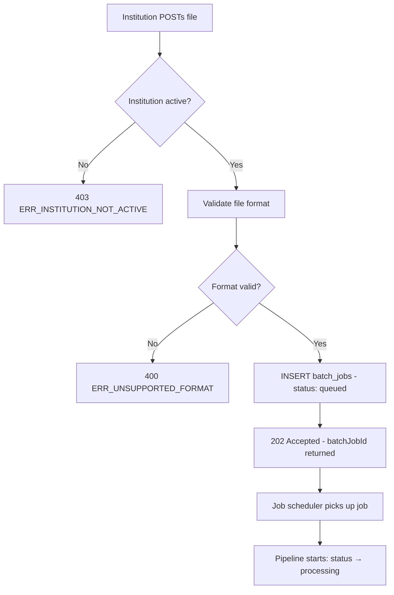

# EPIC-14 — Batch Pipeline (Non-UI Backend Contract)

> **Epic Code:** BATCH | **Story Range:** BATCH-US-001–009
> **Owner:** Data Engineering / Platform Engineering | **Priority:** P0
> **Implementation Status:** ✅ Mostly Implemented (BATCH-US-002, BATCH-US-005 Partial)
> **Note:** This epic has **no UI screens**. It documents the backend batch processing pipeline as an engineering and compliance contract.

---

## 1. Executive Summary

### Purpose
The Batch Pipeline is the bulk data ingestion pathway of the HCB credit bureau. Member institutions submit credit data files (CSV, JSON, fixed-width) via SFTP, multipart HTTP upload, or scheduled trigger. The pipeline processes every record through a sequence of stages — File Intake, Schema Detection, Field Validation, Field Mapping, Data Transformation, Data Load, and Post-processing — writing detailed logs at each phase and stage so that the execution console (EPIC-13) and monitoring (EPIC-09) have full visibility.

### Business Value
- Bulk data ingestion at scale (thousands of records per batch, millions per day)
- Schema-agnostic design — any source format processed after schema registration
- Per-stage logging enables precise failure diagnosis without re-processing entire batches
- Retry and cancel semantics provide operational resilience
- Phase/stage logging feeds real-time monitoring dashboards

### Key Capabilities
1. File arrival via multipart HTTP (institution-authenticated)
2. Schema detection from `schema_mapper_registry`
3. Per-record field validation against `validation_rules`
4. Field mapping via approved `mapping_pairs`
5. PII encryption and data normalisation
6. Durable load to `tradelines`, `consumers`, `credit_profiles`
7. Phase and stage logging to `batch_phase_logs`, `batch_stage_logs`, `batch_error_samples`
8. Retry (restart from last failed stage) and cancel (halt immediately)

---

## 2. Scope

### In Scope
- `BatchJobController` — HTTP API for batch job management
- `DailySimulationService` — demo batch simulation (for seed data)
- All pipeline stages and their logging contracts
- `batch_phase_logs`, `batch_stage_logs`, `batch_error_samples`, `batch_records` tables
- Retry and cancel semantics
- Monitoring integration (EPIC-09)
- Dashboard integration (EPIC-13 command center)

### Out of Scope
- SFTP file intake (HTTP multipart only in current implementation)
- Real-time streaming ingestion (EPIC-15)
- File storage / archiving (files not persisted after processing in current implementation)
- Batch file scheduling / cron integration

---

## 3. Personas

| Persona | Role | System |
|---------|------|-------|
| Member Institution System | API_USER | Submits batch files via POST |
| Batch Processing Engine | Internal Service | Executes pipeline stages |
| Bureau Administrator | BUREAU_ADMIN | Retries/cancels batch jobs, views execution console |
| Operations Engineer | BUREAU_ADMIN | Monitors pipeline health, investigates failures |

---

## 4. Pipeline Architecture

### Stage Sequence

```
FILE INTAKE
    ↓
SCHEMA DETECTION
    ↓
FIELD VALIDATION (per record, all validation_rules)
    ↓
FIELD MAPPING (source → canonical via mapping_pairs)
    ↓
DATA TRANSFORMATION (PII encryption, type casting, normalisation)
    ↓
DATA LOAD (INSERT to tradelines, consumers, credit_profiles)
    ↓
POST-PROCESSING (metrics update, drift check, notifications)
```

### Phase / Stage Hierarchy

```
Phase: VALIDATION
  └── Stage: FORMAT_CHECK
  └── Stage: MANDATORY_CHECK
  └── Stage: CROSS_FIELD_CHECK
  └── Stage: DUPLICATE_CHECK

Phase: MAPPING
  └── Stage: CANONICAL_FIELD_ASSIGNMENT
  └── Stage: ENUM_RECONCILIATION

Phase: TRANSFORMATION
  └── Stage: PII_ENCRYPTION
  └── Stage: TYPE_CASTING
  └── Stage: VALUE_NORMALISATION

Phase: LOAD
  └── Stage: CONSUMER_UPSERT
  └── Stage: TRADELINE_INSERT
  └── Stage: CREDIT_PROFILE_UPDATE
```

---

## 5. Batch Console Data Model

When `batch_phase_logs` rows exist for a job, `GET /api/v1/batch-jobs/:id/detail` returns:

```json
{
  "batchJobId": "999901",
  "jobStatus": "completed",
  "phases": [
    {
      "phaseName": "VALIDATION",
      "phaseStatus": "completed",
      "startedAt": "2026-03-31T10:00:05Z",
      "completedAt": "2026-03-31T10:00:45Z",
      "processedCount": 5000,
      "failedCount": 23
    }
  ],
  "stages": [
    {
      "stageName": "FORMAT_CHECK",
      "phaseName": "VALIDATION",
      "stageStatus": "completed",
      "recordsProcessed": 5000,
      "recordsFailed": 3
    }
  ],
  "flowSegments": [],
  "logs": [],
  "errorSamples": [
    {
      "rowNumber": 147,
      "errorCode": "VALIDATION_FORMAT_FAILED",
      "errorMessage": "account_number does not match format",
      "fieldName": "account_number",
      "fieldValue": "INVALID"
    }
  ]
}
```

When no `batch_phase_logs` exist (legacy job), the API returns legacy flat `stages` array.

---

## 6. Stories

---

### BATCH-US-001 — Batch File Arrival and Intake

#### 1. Description
> As a member institution system,
> I want to submit a batch credit data file via HTTP POST,
> So that the bureau can process my data submission.

#### 2. API Requirements

`POST /api/v1/batch-jobs` (multipart/form-data)

**Auth:** `X-API-Key` header (institution API key)

**Form fields:**
- `file` — data file (CSV, JSON, fixed-width)
- `reportingPeriod` — ISO date (YYYY-MM-DD) — the period this data covers
- `checksum` — MD5 or SHA-256 of the file (optional, for integrity verification)

**Response (202 Accepted):**
```json
{
  "batchJobId": "999902",
  "batchJobStatus": "queued",
  "institutionId": 1,
  "totalRecords": 5000,
  "correlationId": "BATCH-COR-2026-001",
  "submittedAt": "2026-03-31T10:00:00Z"
}
```

#### 3. Database

```sql
INSERT INTO batch_jobs (batch_job_id, institution_id, job_status,
  reporting_period, total_records, correlation_id, submitted_at)
VALUES ('999902', 1, 'queued', '2026-03-31', 5000, 'BATCH-COR-2026-001', CURRENT_TIMESTAMP);
```

#### 4. Business Logic
- Institution must be `active` to submit — `403 ERR_INSTITUTION_NOT_ACTIVE` if not
- File parsed for row count to populate `total_records`
- `queued` status means file received; pipeline not yet started
- File stored temporarily (in-memory or temp dir) during pipeline execution

#### 5. Status / State Management

| Status | Description | Trigger | Next States |
|--------|-------------|---------|-------------|
| `queued` | File received, pipeline not started | POST /batch-jobs | `processing` |
| `processing` | Pipeline executing stages | Job scheduler picks up | `completed`, `failed`, `cancelled` |
| `completed` | All records processed | Final stage done | Terminal |
| `failed` | Pipeline error, processing stopped | Stage error | `queued` (via retry) |
| `partially_completed` | Some records processed, some failed | Load stage with failures | Terminal or retry |
| `cancelled` | Manually cancelled | POST /batch-jobs/:id/cancel | Terminal |

#### 6. Flowchart



#### 7. Definition of Done
- [ ] POST /batch-jobs accepts multipart file
- [ ] Institution active status checked (403 if not active)
- [ ] Batch job created with queued status
- [ ] 202 returned with batchJobId

---

### BATCH-US-002 — Schema Detection Stage

#### 1. Description
> As the batch pipeline,
> I want to detect the source schema of the submitted file,
> So that the correct field mapping is applied.

#### 2. Status: ⚠️ Partial

Schema detection relies on the institution having a registered schema in `schema_mapper_registry` for the submitted source type. Automatic schema detection from file content alone is not yet fully implemented.

#### 3. Pipeline Logic

```
1. Look up schema_mapper_registry WHERE institution_id = ? AND schema_status = 'active'
2. If found: use registered mapping for this institution + source type
3. If not found: attempt header-based detection (CSV column names → fuzzy match against canonical fields)
4. If detection fails: fail job with ERR_SCHEMA_NOT_REGISTERED
```

#### 4. Database

```sql
SELECT sr.payload, sm.payload as mapping_payload
FROM schema_mapper_registry sr
JOIN schema_mapper_mapping sm ON sm.mapping_id = sr.mapping_id
WHERE sr.institution_id = ?
  AND sr.schema_status = 'active'
ORDER BY sr.created_at DESC
LIMIT 1;
```

#### 5. Definition of Done
- [ ] Schema looked up from schema_mapper_registry for institution
- [ ] Fallback header detection for unknown schemas
- [ ] Job fails with ERR_SCHEMA_NOT_REGISTERED if no mapping available

---

### BATCH-US-003 — Field Validation Stage

#### 1. Description
> As the batch pipeline,
> I want to validate every record against active validation rules,
> So that only quality data proceeds to mapping and load.

#### 2. Pipeline Execution

```
For each record in batch:
  For each active validation_rule where canonical_field_id in record's mapped fields:
    Apply rule expression to field value
    If CRITICAL failure: mark record as failed, add to batch_error_samples
    If WARNING failure: mark record as flagged, proceed
    If INFO failure: log only, proceed

Write phase log: VALIDATION phase completed/failed
Write stage logs: one per validation rule type
```

#### 3. Logging Contract

```sql
-- Phase log
INSERT INTO batch_phase_logs (batch_job_id, phase_name, phase_status,
  started_at, completed_at, processed_count, failed_count)
VALUES ('999902', 'VALIDATION', 'completed',
  '2026-03-31T10:00:05Z', '2026-03-31T10:00:45Z', 5000, 23);

-- Error sample (up to 100 per job)
INSERT INTO batch_error_samples (batch_job_id, row_number,
  error_code, error_message, field_name, field_value, error_type, severity)
VALUES ('999902', 147, 'VALIDATION_FORMAT_FAILED',
  'account_number does not match ^[A-Z0-9-]{5,20}$',
  'account_number', 'INVALID', 'FORMAT', 'CRITICAL');
```

#### 4. Partial Success Handling
- If `failed_count / total_records < FAILURE_THRESHOLD` (default 30%): job continues with valid records only, status = `partially_completed`
- If `failed_count / total_records >= 30%`: job fails entirely, status = `failed`
- FAILURE_THRESHOLD configurable per institution in `api_access_json`

#### 5. Definition of Done
- [ ] All active validation rules evaluated per record
- [ ] CRITICAL failures mark records as failed
- [ ] Phase log and error samples written
- [ ] Partial success logic applied based on failure threshold

---

### BATCH-US-004 — Field Mapping Stage

#### 1. Description
> As the batch pipeline,
> I want to map source fields to canonical HCB fields,
> So that all data is normalised to the canonical model before storage.

#### 2. Pipeline Logic

```
For each record:
  For each sourceFieldPath in detected schema:
    Look up canonical_field_code from mapping_pairs
    Assign canonical_field_code → canonical_value
    Apply enum_reconciliation if applicable

  Unmapped fields: handled per UnmappedAction config:
    DROP: silently drop field
    FLAG: include field with 'unmapped_' prefix, log warning
    FAIL: reject record
```

#### 3. Database

```sql
SELECT mp.source_field_path, mp.canonical_field_code, mp.enum_reconciliation_json
FROM mapping_pairs mp
WHERE mp.schema_mapper_mapping_id = ?
  AND mp.is_approved = 1;
```

#### 4. Logging Contract

```sql
INSERT INTO batch_phase_logs (batch_job_id, phase_name, phase_status,
  processed_count, mapped_count, unmapped_count)
VALUES ('999902', 'MAPPING', 'completed', 4977, 4850, 127);
```

#### 5. Definition of Done
- [ ] All approved mapping_pairs applied per record
- [ ] Enum reconciliation applied for enum-type fields
- [ ] Unmapped field action applied per `UnmappedAction` configuration
- [ ] MAPPING phase log written

---

### BATCH-US-005 — Data Transformation Stage

#### 1. Description
> As the batch pipeline,
> I want to apply transformations (PII encryption, type casting, normalisation),
> So that data meets storage and security standards.

#### 2. Status: ⚠️ Partial

Transformation logic is partially implemented. PII encryption is in-progress.

#### 3. Transformations Applied

| Transformation | Field Types | Description |
|---------------|-------------|-------------|
| PII Hashing | `national_id`, `phone`, `email` | SHA-256 hash before storage |
| Type Casting | `decimal`, `integer`, `date` | String → native DB type |
| Date Normalisation | All `date` fields | Various formats → ISO 8601 |
| String Trimming | All `string` fields | Remove leading/trailing whitespace |
| Null Standardisation | All fields | Empty string → NULL |

#### 4. PII Hashing Contract

```java
// Hash before insert to consumers table
String nationalIdHash = DigestUtils.sha256Hex(nationalId.trim().toUpperCase());
String phoneHash = DigestUtils.sha256Hex(normalizedPhone);
String emailHash = DigestUtils.sha256Hex(email.trim().toLowerCase());
```

#### 5. Definition of Done
- [ ] PII fields hashed before storage in consumers table
- [ ] Type casting applied based on canonical field data types
- [ ] TRANSFORMATION phase log written

---

### BATCH-US-006 — Data Load Stage

#### 1. Description
> As the batch pipeline,
> I want to insert validated and mapped records into tradelines and consumers,
> So that data is durably stored in the credit bureau.

#### 2. Load Sequence

```
For each valid record:
  1. UPSERT consumers (match on national_id_hash + reporting_institution_id)
  2. INSERT credit_profiles (if new consumer)
  3. INSERT tradelines (all loan/account records)
  4. UPDATE credit_profiles summary fields (total_exposure, active_accounts, etc.)

On conflict (duplicate tradeline):
  UPDATE if newer reporting_period
  Otherwise skip (idempotent)
```

#### 3. Database Inserts

```sql
-- Upsert consumer
INSERT INTO consumers (national_id_hash, phone_hash, email_hash, reporting_institution_id)
VALUES (?, ?, ?, ?)
ON CONFLICT(national_id_hash) DO UPDATE SET updated_at = CURRENT_TIMESTAMP;

-- Insert tradeline
INSERT INTO tradelines (consumer_id, account_number, facility_type,
  loan_amount, outstanding_balance, dpd_days, reporting_period,
  reporting_institution_id, batch_job_id)
VALUES (?, ?, ?, ?, ?, ?, ?, ?, ?);
```

#### 4. Performance Requirements

| Metric | Target |
|--------|--------|
| Throughput | > 5,000 records/minute |
| Consumer upsert latency | < 10ms per record (SQLite; higher in prod PostgreSQL) |
| Tradeline insert latency | < 5ms per record |
| Batch of 10,000 records | < 5 minutes end-to-end |

#### 5. Definition of Done
- [ ] Consumers upserted with hash matching
- [ ] Tradelines inserted with correct attribution
- [ ] LOAD phase log written with success/fail counts
- [ ] Duplicate tradelines handled idempotently

---

### BATCH-US-007 — Phase and Stage Logging

#### 1. Description
> As an operations engineer,
> I want every pipeline phase and stage logged with timing and record counts,
> So that the batch execution console has full visibility.

#### 2. Logging Contract (Full)

**`batch_phase_logs` columns:**
`batch_job_id`, `phase_name`, `phase_status`, `started_at`, `completed_at`, `processed_count`, `failed_count`, `skipped_count`, `error_message`

**`batch_stage_logs` columns:**
`batch_job_id`, `phase_name`, `stage_name`, `stage_status`, `records_input`, `records_output`, `records_failed`, `started_at`, `completed_at`

**`batch_error_samples` columns:**
`batch_job_id`, `row_number`, `source_record_json`, `error_code`, `error_message`, `field_name`, `field_value`, `error_type`, `severity`

**Sampling limit:** Maximum 100 error samples stored per batch job (prevents log explosion for high-failure batches)

#### 3. Execution Console API

`GET /api/v1/batch-jobs/:id/detail`

Returns `phases`, `stages`, `flowSegments`, `logs`, `errorSamples` (camelCase) when `batch_phase_logs` rows exist.
Returns legacy flat `stages` when no phase logs exist.

SPA: `resolveBatchConsoleData()` in `src/lib/batch-console-from-api.ts`

#### 4. Definition of Done
- [ ] Phase log written at start and end of each phase
- [ ] Stage log written for each stage within a phase
- [ ] Error samples written (max 100 per job)
- [ ] Execution console displays phases/stages with progress
- [ ] Legacy mode (flat stages) supported for older jobs

---

### BATCH-US-008 — Retry a Failed Batch Job

#### 1. Description
> As a member institution operator,
> I want to retry a failed batch job,
> So that transient failures are recoverable without resubmitting the file.

#### 2. API Requirements

`POST /api/v1/batch-jobs/:id/retry`

**Auth:** Bearer token (BUREAU_ADMIN role) or API key with `institution_id` matching job's institution

**Response (200):**
```json
{
  "batchJobId": "999902",
  "batchJobStatus": "queued",
  "retryCount": 1
}
```

#### 3. Business Logic
- Only `failed` jobs can be retried
- `partially_completed` jobs may be retried (reprocesses failed records only — future)
- Institution must be `active` at retry time
- `retry_count` incremented on each retry (stored in `batch_jobs`)
- Phase logs from previous run preserved; new run appends new phase logs

#### 4. Definition of Done
- [ ] POST /batch-jobs/:id/retry resets job to queued
- [ ] Institution active check at retry time
- [ ] Retry count incremented
- [ ] 400 if job is not in failed status

---

### BATCH-US-009 — Cancel an In-Progress Batch Job

#### 1. Description
> As a bureau administrator,
> I want to cancel an in-progress batch job,
> So that erroneous submissions are stopped before they load corrupt data.

#### 2. API Requirements

`POST /api/v1/batch-jobs/:id/cancel`

**Response (200):**
```json
{
  "batchJobId": "999902",
  "batchJobStatus": "cancelled"
}
```

#### 3. Business Logic
- `queued` and `processing` jobs can be cancelled
- `completed` jobs cannot be cancelled (data already loaded)
- Cancel does NOT apply the institution active status gate (unlike retry)
- Pipeline checks for cancellation flag between stages
- If cancellation occurs mid-LOAD: partial records may be committed (database atomicity per batch)

#### 4. Definition of Done
- [ ] POST /batch-jobs/:id/cancel transitions job to cancelled
- [ ] Institution active check NOT applied (cancel always allowed)
- [ ] 400 if job is already completed or cancelled
- [ ] Phase log written with stage where cancellation occurred

---

## 8. Epic API Summary

| Endpoint | Method | Auth | Description | Status |
|----------|--------|------|-------------|--------|
| `POST /api/v1/batch-jobs` | POST | API Key | Submit batch file (202) | ✅ |
| `GET /api/v1/batch-jobs` | GET | Bearer | List batch jobs with filters | ✅ |
| `GET /api/v1/batch-jobs/kpis` | GET | Bearer | Batch KPI metrics | ✅ |
| `GET /api/v1/batch-jobs/charts` | GET | Bearer | Batch charts (volume, success rate) | ✅ |
| `GET /api/v1/batch-jobs/:id/detail` | GET | Bearer | Phases/stages/error samples | ✅ |
| `POST /api/v1/batch-jobs/:id/retry` | POST | Bearer (Admin) or API Key | Retry failed job | ✅ |
| `POST /api/v1/batch-jobs/:id/cancel` | POST | Bearer (Admin) | Cancel queued/processing job | ✅ |

---

## 9. Database Summary

| Table | Key Fields | Notes |
|-------|------------|-------|
| `batch_jobs` | `batch_job_id`, `institution_id`, `job_status`, `total_records`, `processed_records`, `failed_records` | Core job tracking |
| `batch_phase_logs` | `batch_job_id`, `phase_name`, `phase_status`, `processed_count`, `failed_count` | Phase-level logging |
| `batch_stage_logs` | `batch_job_id`, `phase_name`, `stage_name`, `stage_status`, `records_failed` | Stage-level logging |
| `batch_error_samples` | `batch_job_id`, `row_number`, `error_code`, `field_name`, `severity` | Error sampling (max 100/job) |
| `batch_records` | `batch_job_id`, `row_number`, `record_status` | Per-record status |
| `tradelines` | `consumer_id`, `account_number`, `facility_type`, `batch_job_id` | Loaded credit data |
| `consumers` | `national_id_hash`, `phone_hash`, `email_hash` | Deduplicated consumer registry |

---

## 10. Epic Workflows

### Workflow: Complete Batch Processing
```
Institution POSTs file → POST /batch-jobs (202) →
  Job: queued →
  Pipeline starts: processing →
  Phase: VALIDATION (all rules) →
  Phase: MAPPING (canonical field assignment) →
  Phase: TRANSFORMATION (PII hash, type cast) →
  Phase: LOAD (consumers upsert, tradelines insert) →
  Job: completed →
  Monitoring (EPIC-09): api_requests updated →
  Dashboard (EPIC-13): active pipeline removed from table
```

### Workflow: Failed Batch Recovery
```
Phase: VALIDATION → 35% records fail (above 30% threshold) →
  Job status: failed →
  Error samples stored (max 100) →
  Admin views execution console →
  Investigates error samples: format validation failure →
  Institution fixes source data →
  Institution resubmits file →
  POST /batch-jobs/:id/retry → Job: queued →
  Pipeline re-runs from start
```

---

## 11. KPIs

| KPI | Target |
|-----|--------|
| Batch processing throughput | > 5,000 records/min |
| Average batch completion time (10k records) | < 5 minutes |
| Validation failure rate | < 5% across all active institutions |
| Retry success rate | > 95% of retried jobs succeed |

---

## 12. Risks

| Risk | Impact | Mitigation |
|------|--------|-----------|
| Schema detection fails on unknown formats | Batch rejected | Enforce schema registration before first submission |
| PII partially encrypted (transformation partial) | Compliance risk | Complete PII hashing before production |
| Large batches lock SQLite | Performance | Use PostgreSQL with connection pooling in production |
| Error sample capped at 100 | Limited diagnosis for high-failure batches | Increase cap or provide full error log endpoint |

---

## 13. Gap Analysis

| Gap | Story | Severity |
|-----|-------|----------|
| Schema auto-detection from file headers not fully implemented | BATCH-US-002 | High |
| PII transformation partially implemented | BATCH-US-005 | Critical |
| Retry from last failed stage (not full restart) | BATCH-US-008 | Medium |
| SFTP file intake not implemented | BATCH-US-001 | Medium |

---

## 14. Execution Roadmap

| Phase | Stories | Description |
|-------|---------|-------------|
| Phase 1 | BATCH-US-001, 003, 004, 006, 007, 008, 009 | Implemented — production-ready |
| Phase 2 | BATCH-US-002 | Complete schema auto-detection |
| Phase 3 | BATCH-US-005 | Complete PII transformation (AES encryption at rest) |
| Phase 4 | — | SFTP integration, retry from last failed stage, streaming batch support |
