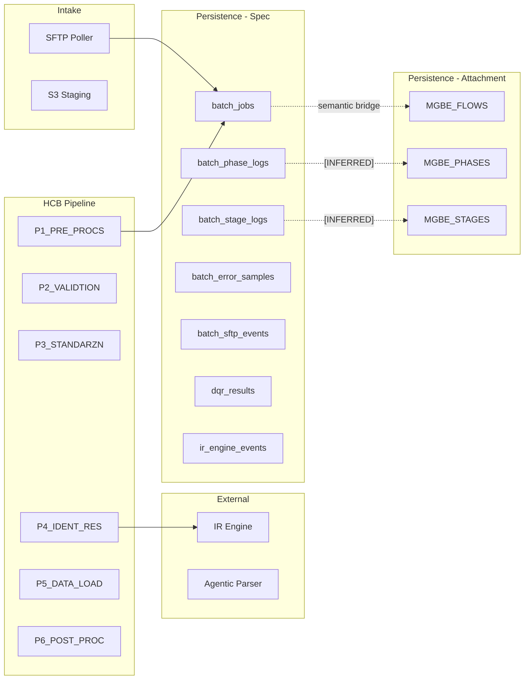
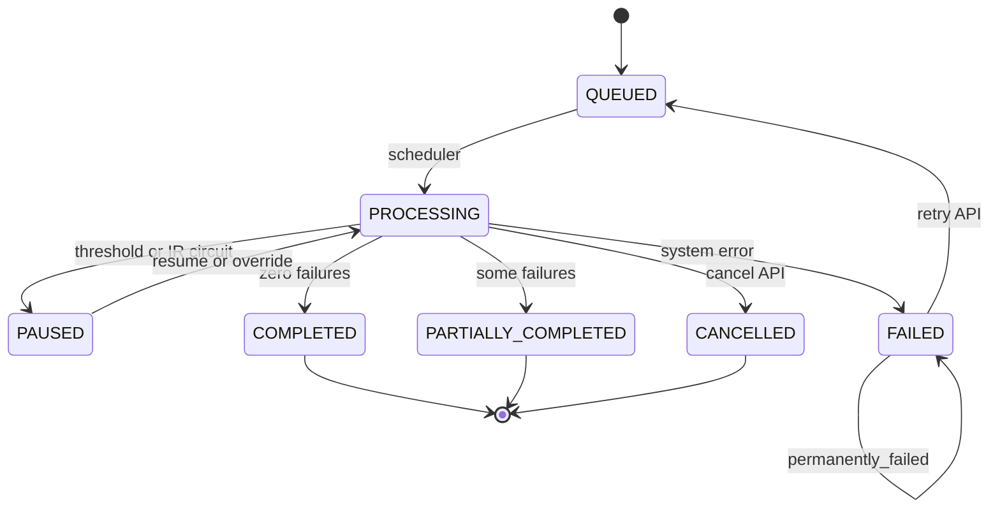

# EPIC-14 Batch Monitoring — Technical Reference

> **Version:** 1.0 — 2026-06-04  
> **Scope:** All artifacts under `docs/User stories/EPIC-14` plus cross-check against project implementation (`backend/`, `server/`, `src/`).  
> **Database attachment:** `Table_data_columns_26052026.csv` (Oracle `CTP_MGBATCH` schema).  
> **Important:** EPIC-14 API specifications (HCB Batch Pipeline v2) and the Oracle schema belong to **different systems**. Mappings below are **semantic / integration hypotheses**, not confirmed DDL. Every inferred mapping is tagged **[INFERRED]** or **[ASSUMPTION]**.

---

## 1. Executive Summary

EPIC-14 defines **13 HTTP APIs** (12 inbound to HCB + 1 outbound to IR Engine) for monitoring and operating bulk credit-data ingestion: list/detail jobs, DQR, retry/cancel/resume/override, KPIs, charts, and SFTP health. The canonical specification lives in `api.md`, `openapi.yaml`, and `spec.md` (v2, 2026-05-22).

The attached Oracle export describes a **batch orchestration engine** (`CTP_MGBATCH`) with a **Flow → Phase → Stage** hierarchy (`MGBE_FLOWS`, `MGBE_PHASES`, `MGBE_STAGES`), parameters, diagnostics, errors, and record staging. It does **not** contain institution master data, SFTP paths, DQI/DQR tables, or IR Engine call logs.

The **credit-harmony** repository implements a **subset** of the EPIC-14 API surface against a **SQLite** `batch_jobs` / `batch_phase_logs` / `batch_stage_logs` model that partially mirrors Oracle UID fields (`flow_uid`, `phase_uid`) but omits PAUSED state, DQR, SFTP APIs, resume/override, and most v2 columns.

| Layer | Role | Maturity |
|-------|------|----------|
| EPIC-14 docs | Target HCB Batch Pipeline v2 | Implementation-ready spec |
| Oracle `CTP_MGBATCH` | Legacy/alternate batch engine persistence | Column dictionary only (no API doc in folder) |
| credit-harmony `BatchJobController` | Demo/monitoring UI backend | Partial; diverges from EPIC-14 v2 |

**Primary integration risk:** Teams must not assume `batchJobId` (API) = `FLOWUID` (Oracle RAW(16)) or that `JobStatus` enums align with `FLOWSTATUS` / `PHASESTATUS` without an explicit translation layer.

---

## 2. Batch Monitoring Overview

### 2.1 Business purpose

Batch monitoring lets bureau operators and member institutions observe **file intake → pipeline execution → data quality → notifications**, and intervene when jobs fail thresholds, IR Engine is unavailable, or files are quarantined.

### 2.2 Actors (from `spec.md`)

| Actor | Monitoring interaction |
|-------|------------------------|
| Operations Engineer | KPIs, charts, SFTP health, stuck files |
| Data Operator | PAUSED jobs: resume / override-pause |
| Bureau Administrator | Retry, cancel, full detail |
| Member Institution | DQR for own jobs only (`INSTITUTION` role) |

### 2.3 Systems in scope

---

## 3. API Catalog

**Base URL (spec):** `/api/v1`  
**Auth:** Bearer JWT (OAuth2); optional `X-API-Key` per OpenAPI.

### 3.1 API Inventory Matrix

| # | API Name | Method | Endpoint | Purpose | Lifecycle stage |
|---|----------|--------|----------|---------|-----------------|
| 1 | List Batch Jobs | GET | `/batch-jobs` | Paginated job list with filters | All statuses |
| 2 | Get Batch Job Detail | GET | `/batch-jobs/:id/detail` | Phases, stages, errors, SFTP | All |
| 3 | Get Data Quality Report | GET | `/batch-jobs/:id/dqr` | DQI + DQR components | Terminal / PAUSED (post-P6) |
| 4 | Retry Batch Job | POST | `/batch-jobs/:id/retry` | Re-queue FAILED job | FAILED → QUEUED |
| 5 | Cancel Batch Job | POST | `/batch-jobs/:id/cancel` | Stop in-flight job | QUEUED/PROCESSING/PAUSED → CANCELLED |
| 6 | Resume Paused Job | POST | `/batch-jobs/:id/resume` | Continue PAUSED job | PAUSED → PROCESSING |
| 7 | Override Pause | POST | `/batch-jobs/:id/override-pause` | Advance with valid records only | PAUSED → PROCESSING |
| 8 | Get Batch KPIs | GET | `/batch-jobs/kpis` | Dashboard aggregates | Windowed analytics |
| 9 | Get Batch Charts | GET | `/batch-jobs/charts` | Time-series metrics | Windowed analytics |
| 10 | List SFTP Events | GET | `/batch-jobs/sftp-events` | File lifecycle events | Phase 0 / intake |
| 11 | Get SFTP Event Detail | GET | `/batch-jobs/sftp-events/:id` | Single SFTP event | Phase 0 |
| 12 | Get SFTP Health | GET | `/batch-jobs/sftp-health` | Folder health + stuck files | Operational |
| 13 | IR Cluster Assign | POST | `{ir-engine}/ir/v1/cluster-assign` | Outbound identity resolution | P4 / S41_CLST_ASN |

### 3.2 Per-API detail (spec source: `api.md`, `openapi.yaml`)

#### API 1 — List Batch Jobs

| Attribute | Value |
|-----------|-------|
| **Endpoint** | `GET /api/v1/batch-jobs` |
| **Roles** | `BUREAU_ADMIN`, `DATA_OPERATOR`, `OPS_ENGINEER` |
| **Rate limit** | 60/min per token |

**Query parameters:** `institutionId`, `jobStatus` (JobStatus enum), `intakeChannel` (SFTP\|API\|SIMULATION), `detectedFormat`, `submittedFrom`, `submittedTo`, `isPermanentlyFailed`, `page`, `size`, `sortBy` (submittedAt\|completedAt\|dqiScore), `sortDir`.

**Response fields (summary item):** `batchJobId`, `institutionId`, `institutionName`, `jobStatus`, `statusDisplay`, `intakeChannel`, `intakeMode`, `originalFilename`, `detectedFormat`, `sourceType`, `totalRecords`, `processedRecords`, `failedRecords`, `tradelinesInserted`, `newConsumersCreated`, `validationFailureRate`, `mappingCoveragePercent`, `dqiScore`, `submittedAt`, `startedAt`, `completedAt`, `retryCount`, `isPermanentlyFailed`.

**Errors:** 400 `ERR_INVALID_PARAM`, 401, 403.

**Dependencies:** `batch_jobs` (+ join `institutions` for name). **[INFERRED]** Oracle: `MGBE_FLOWS` only if integration layer projects job summary.

---

#### API 2 — Get Batch Job Detail

| Attribute | Value |
|-----------|-------|
| **Endpoint** | `GET /api/v1/batch-jobs/:id/detail` |
| **Path** | `id` = `batch_job_id` |

**Response (extends list):** `correlationId`, `schemaRegistryId`, `profileId`, `mappingId`, `mappingVersion`, `schemaDetectionMethod`, `schemaDetectionConfidence`, `s3StagingPath`, `dqrUrl`, `errorReportUrl`, `driftAlertTriggered`, `failureReason`, `lastSuccessfulPhase`, `notificationStatus`, `notificationChannelsJson`, `existingConsumersUpdated`, `phases[]`, `stages[]`, `errorSamples[]`, `sftpEvent`.

**Phase object:** `phaseName`, `phaseStatus`, `startedAt`, `completedAt`, `processedCount`, `failedCount`, `retryAttempt`.

**Stage object:** `stageName`, `phaseName`, `stageStatus`, `recordsProcessed`, `recordsFailed`, `metadata` (JSON), `retryAttempt`.

**Error sample:** `rowNumber`, `errorCode`, `errorMessage`, `fieldName`, `fieldValue` (PII masked), `errorType`, `severity`, `correlationId`.

**Errors:** 404 `ERR_JOB_NOT_FOUND`.

**Dependencies:** `batch_jobs`, `batch_phase_logs`, `batch_stage_logs`, `batch_error_samples`, `batch_sftp_events`; optional `institutions`, schema tables.

---

#### API 3 — Get Data Quality Report

| Attribute | Value |
|-----------|-------|
| **Endpoint** | `GET /api/v1/batch-jobs/:id/dqr` |
| **Roles** | + `INSTITUTION` (own institution only) |
| **Rate limit** | 30/min |

**Business rules:** Job must be terminal (`COMPLETED`, `PARTIALLY_COMPLETED`, `FAILED`, `CANCELLED`) or `PAUSED` with DQR generated; else **422** `ERR_DQR_NOT_GENERATED` (not 404).

**Response:** `dqiScore`, `rawDqs`, `components` (4 ratios), `weights`, `summary` counts, `l1BreakdownByField`, `l2Breakdown`, paths/URLs, `generatedAt`, `uploadedAt`.

**Dependencies:** `dqr_results`, `batch_jobs.dqi_score`, `batch_jobs.dqr_url`. **No Oracle `CTP_MGBATCH` table** for DQI.

---

#### API 4 — Retry Batch Job

| Attribute | Value |
|-----------|-------|
| **Endpoint** | `POST /api/v1/batch-jobs/:id/retry` |
| **Role** | `BUREAU_ADMIN` only |
| **Idempotency** | `X-Request-ID` within 60s |

**Validations:** `job_status = FAILED`; `is_permanently_failed = false`; institution active; SFTP file in `processing/` or `failed/` for SFTP jobs; `retry_count < max` (default 3).

**Business rules:** Increment `retry_count`; restart from `last_successful_phase + 1`; backoff 30s / 90s / 270s; set `is_permanently_failed` after max failures.

**Response:** `batchJobStatus=QUEUED`, `backoffSchedule`, `restartingFromPhase`.

**Errors:** 400 `ERR_JOB_NOT_RETRYABLE`, 409 `ERR_RETRY_LIMIT_EXCEEDED`, 404 `ERR_BATCH_FILE_NOT_FOUND`, 403 `ERR_INSTITUTION_NOT_ACTIVE`.

**Dependencies:** `batch_jobs`, `batch_sftp_events`, scheduler/worker queue, SFTP mover.

---

#### API 5 — Cancel Batch Job

| Attribute | Value |
|-----------|-------|
| **Endpoint** | `POST /api/v1/batch-jobs/:id/cancel` |
| **Role** | `BUREAU_ADMIN` |

**Validations:** Status in `QUEUED`, `PROCESSING`, `PAUSED` (spec also blocks terminal including FAILED permanently).

**Business rules:** Current atomic unit completes; P5 chunks not rolled back; SFTP → `/cancelled/`; `batch_sftp_events.event_status = CANCELLED`; P6 still runs; `cancelled_at`, `cancelled_by`.

**Dependencies:** Pipeline orchestrator, SFTP service, `audit_logs`.

---

#### API 6 — Resume Paused Job

| Attribute | Value |
|-----------|-------|
| **Endpoint** | `POST /api/v1/batch-jobs/:id/resume` |
| **Roles** | `DATA_OPERATOR`, `BUREAU_ADMIN` |
| **Body** | `reason` (10–500 chars, required) |

**Validations:** `job_status = PAUSED`; `is_permanently_failed = false`.

**Business rules:** `PAUSED → PROCESSING`; append to `paused_reason`; set `resumed_at`, `resumed_by`.

---

#### API 7 — Override Pause

| Attribute | Value |
|-----------|-------|
| **Endpoint** | `POST /api/v1/batch-jobs/:id/override-pause` |
| **Body** | `action=ADVANCE_WITH_VALID`, `reason` |

**Business rules:** Exclude failed records permanently; audit `BATCH_JOB_PAUSE_OVERRIDDEN`; completes as `PARTIALLY_COMPLETED`.

---

#### API 8 — Get Batch KPIs

| Attribute | Value |
|-----------|-------|
| **Endpoint** | `GET /api/v1/batch-jobs/kpis` |
| **Query** | `from`, `to`, `institutionId`, `sourceType` |

**Response groups:** `volume`, `rates`, `performance`, `irEngine`, `dqi`, `sftp`.

**Dependencies:** Aggregations over `batch_jobs`, `batch_tracking_snapshots`, `dqr_results`, `ir_engine_events`, `batch_sftp_events`. **[INFERRED]** Partial KPIs derivable from `MGBE_FLOWS` timestamps + `STAGECOUNTERS` if counters encode volumes.

---

#### API 9 — Get Batch Charts

| Attribute | Value |
|-----------|-------|
| **Endpoint** | `GET /api/v1/batch-jobs/charts` |
| **Query** | `metric` (required): VOLUME \| SUCCESS_RATE \| DQI_TREND \| VALIDATION_FAILURE_RATE; `granularity`, `from`, `to`, `institutionId` |

**Response:** `series[]` of `{ timestamp, value }`.

---

#### APIs 10–12 — SFTP monitoring

| API | Endpoint | Key fields |
|-----|----------|------------|
| List SFTP Events | `GET /batch-jobs/sftp-events` | `id`, paths, `checksumSha256`, `eventStatus`, `batchJobId`, duplicate flags, timestamps |
| SFTP Detail | `GET /batch-jobs/sftp-events/:id` | + `schemaRegistryId`, `mappingId`, `intakeMode` |
| SFTP Health | `GET /batch-jobs/sftp-health` | `overall`, `summary`, `stuckFiles[]`, `quarantinedFiles[]` |

**No direct Oracle `CTP_MGBATCH` mapping** — SFTP is outside attachment schema.

---

#### API 13 — IR Engine (outbound)

| Attribute | Value |
|-----------|-------|
| **Endpoint** | `POST {hcb.ir-engine.base-url}/ir/v1/cluster-assign` |
| **Caller** | HCB `S41_CLST_ASN` |
| **Headers** | `X-Request-ID`, `X-HCB-Job-ID`, `X-HCB-Batch-Index` |

**Persistence (spec):** `ir_engine_events` per call. Not in Oracle attachment.

---

## 4. End-to-End Process Flow

### 4.1 High-level journey

1. **Phase 0 — Intake:** File on SFTP → poller → stability → checksum → duplicate check → `batch_sftp_events` → S3 upload → `batch_jobs` QUEUED.
2. **P1 — Pre-processing:** Integrity, parse (agentic), schema lookup → PROCESSING.
3. **P2 — Validation:** Mandatory, L1, duplicate → threshold gate → optional PAUSED.
4. **P3 — Standardization:** Map, transform, L2 → combined threshold → optional PAUSED.
5. **P4 — Identity:** IR Engine batches → optional PAUSED on circuit open.
6. **P5 — Load:** UPSERT consumers/tradelines/trend/analytics.
7. **P6 — Post:** Error report, DQR/DQI, notifications, SFTP file final state, snapshots.

### 4.2 Operator intervention paths

### 4.3 Data flow (read path for monitoring APIs)

| Consumer | Primary read APIs | Primary tables (spec) |
|----------|-------------------|------------------------|
| Command Center (EPIC-13) | detail, dqr | `batch_jobs`, phase/stage logs |
| Monitoring dashboard (EPIC-09) | kpis, charts | `batch_tracking_snapshots`, `dqr_results` |
| Ops / SFTP widget | sftp-events, sftp-health | `batch_sftp_events` |
| Institution portal | dqr (scoped) | `dqr_results` |

---

## 5. Batch Lifecycle & Status Definitions

### 5.1 JobStatus (API / `batch_jobs.job_status`)

| Status | Meaning | Retry | Cancel | Resume |
|--------|---------|-------|--------|--------|
| QUEUED | Awaiting execution | No | Yes | No |
| PROCESSING | Pipeline running | No | Yes | No |
| PAUSED | Threshold / IR circuit | No | Yes | Yes |
| COMPLETED | Zero record failures | No | No | No |
| PARTIALLY_COMPLETED | Completed with failures; display `PARTIAL_SUCCESS` | No* | No | No |
| FAILED | Terminal error | Yes* | No | No |
| CANCELLED | Operator cancelled | No | No | No |

\*Retry only if not `is_permanently_failed`; *future: selective reprocess (OQ-08).

### 5.2 Batch Status Lifecycle Matrix

| Current | Trigger | Condition | Next | API involved |
|---------|---------|-----------|------|--------------|
| — | File detected | Institution active | QUEUED | — |
| QUEUED | Scheduler | No serial lock | PROCESSING | — |
| PROCESSING | P2/P3 threshold | failure_rate ≥ 30% | PAUSED | — |
| PROCESSING | IR circuit | 3+ failures | PAUSED | — |
| PROCESSING | Success | 0 failures | COMPLETED | — |
| PROCESSING | Partial success | failures < threshold | PARTIALLY_COMPLETED | — |
| PROCESSING | System error | Unrecoverable | FAILED | — |
| PROCESSING | Cancel | Operator | CANCELLED | API 5 |
| PAUSED | Resume | Operator | PROCESSING | API 6 |
| PAUSED | Override | ADVANCE_WITH_VALID | PROCESSING | API 7 |
| FAILED | Retry | retry_count < 3 | QUEUED | API 4 |
| FAILED | Max retries | — | FAILED + permanent | API 4 → 409 |

### 5.3 SftpEventStatus (parallel track)

`DETECTED → STABLE → QUEUED → PROCESSING → PROCESSED | FAILED | QUARANTINED | CANCELLED | PAUSED | REJECTED`

### 5.4 PhaseStatus / StageStatus (detail API)

Phase: `pending | running | completed | paused | failed | skipped`  
Stage: `pending | running | completed | failed | skipped`

**[INFERRED] Oracle alignment:** `MGBE_PHASES.PHASESTATUS`, `MGBE_STAGES.STAGESTATUS` (VARCHAR2) — values are engine-specific; require lookup table or mapping config (not in CSV).

### 5.5 Oracle FLOWSTATUS **[INFERRED]**

`MGBE_FLOWS.FLOWSTATUS` + `MGBD_FLOWSTATUS.FLOWSTATUS` — dimension table with single column in export; likely enumerates flow-level states. **No values provided in attachment.**

---

## 6. Database Structure Overview

### 6.1 EPIC-14 spec tables (HCB — documented in `spec.md` §12)

| Table | Role |
|-------|------|
| `batch_jobs` | Job header, metrics, pause/retry, S3 paths, DQI |
| `batch_phase_logs` | Per-phase execution |
| `batch_stage_logs` | Per-stage execution + metadata JSON |
| `batch_error_samples` | Sampled record errors (max 100/job) |
| `batch_sftp_events` | SFTP file lifecycle |
| `batch_tracking_snapshots` | KPI snapshots (JOB_COMPLETE, etc.) |
| `dqr_results` | DQR component scores and delivery |
| `ir_engine_events` | Outbound IR calls |
| `ingestion_drift_alerts` | Schema drift warnings |
| `audit_logs` | Operator actions |

### 6.2 Oracle `CTP_MGBATCH` (attachment)

| Table | Columns | Role |
|-------|---------|------|
| `MGBE_FLOWS` | FLOWID, FLOWUID, FLOWVERSION, FLOWSTATUS, TIMESTAMPSTARTFLOW, TIMESTAMPENDFLOW | Top-level batch/run |
| `MGBE_PHASES` | FLOWUID, PHASEUID, PHASEID, PHASEVERSION, PHASESTATUS, timestamps, RESULTSYSTEM/BUSINESS, HEARTBEAT* | Phase execution |
| `MGBE_STAGES` | PHASEUID, STAGEUID, STAGEID, STAGESTATUS, STAGETYPE, DEGREE*, STAGECOUNTERS, RESULT*, timestamps | Stage execution |
| `MGBE_PARAMETERS` | PHASEUID, STAGEUID, PARAMETERNAME, PARAMETERVALUE | Key-value stage/phase params |
| `MGBE_STAGEDIAGNOSTICS` | DIAGNOSTIC* + LOB | Diagnostic messages |
| `MGBE_PHASESYSOUT` | SYSOUTLOB, SYSOUTCOUNTERS | Phase-level sysout/counters |
| `ERRORSTEMPLATE` | PHASEUID, STAGEUID, ERRORUID, ERRORCODE, ERRORDESCRIPTION, ERRORCATEGORY | Errors |
| `STAGINGTEMPLATE` | RECORDUID, FLOWUID, RECORDSTATUS, RECORDVALUE, … | Per-record staging |
| `MGBD_FLOWSTATUS` | FLOWSTATUS | Status lookup |

**Relationships (FKs not in CSV; inferred from column names):**

- `MGBE_PHASES.FLOWUID` → `MGBE_FLOWS.FLOWUID`
- `MGBE_STAGES.PHASEUID` → `MGBE_PHASES.PHASEUID`
- `MGBE_PARAMETERS`, `ERRORSTEMPLATE`, `MGBE_STAGEDIAGNOSTICS` → stage and/or phase UIDs
- `STAGINGTEMPLATE.FLOWUID` → `MGBE_FLOWS.FLOWUID`

### 6.3 credit-harmony implementation schema (`create_tables.sql`)

| Table | Notes vs EPIC-14 |
|-------|------------------|
| `batch_jobs` | Integer `id`; statuses: queued/processing/completed/failed/partial/cancelled — **no PAUSED** |
| `batch_phase_logs` | Includes `flow_uid`, `phase_uid` — aligns with Oracle concept |
| `batch_stage_logs` | Linked via `phase_log_id` |
| `batch_error_samples` | No `row_number`, `error_code` column names differ |
| `batch_records` | Record-level outcomes — not in EPIC-14 v2 detail API |

---

## 7. API-to-Database Mapping Matrix

Legend: **D** = direct column; **J** = join; **A** = aggregated; **C** = calculated; **L** = lookup; **—** = no mapping in that schema; **I** = inferred.

### 7.1 Spec schema (`batch_jobs` and related) — target for EPIC-14 APIs

| API | Primary tables | Notes |
|-----|----------------|-------|
| 1 List | `batch_jobs` J `institutions` | Filters on job columns |
| 2 Detail | `batch_jobs`, `batch_phase_logs`, `batch_stage_logs`, `batch_error_samples`, `batch_sftp_events` | |
| 3 DQR | `dqr_results`, `batch_jobs` | Latest row by `retry_attempt` |
| 4 Retry | `batch_jobs`, `batch_sftp_events` | Updates + queue |
| 5 Cancel | `batch_jobs`, `batch_sftp_events`, `audit_logs` | |
| 6 Resume | `batch_jobs`, `audit_logs` | |
| 7 Override | `batch_jobs`, `audit_logs` | |
| 8 KPIs | `batch_jobs`, `batch_tracking_snapshots`, `dqr_results`, `ir_engine_events`, `batch_sftp_events` | Heavy A/C |
| 9 Charts | Same as KPIs | Time-bucket A |
| 10–11 SFTP | `batch_sftp_events` | |
| 12 SFTP Health | `batch_sftp_events`, `batch_jobs` | Stuck = time in PROCESSING |
| 13 IR | `ir_engine_events` | Outbound only |

### 7.2 Oracle `CTP_MGBATCH` — semantic mapping to APIs **[INFERRED]**

| API | Oracle tables | Confidence |
|-----|---------------|------------|
| 1 List | `MGBE_FLOWS` (header), optional join counters from latest `MGBE_STAGES.STAGECOUNTERS` | Medium — missing institution/file columns |
| 2 Detail | `MGBE_FLOWS` + `MGBE_PHASES` + `MGBE_STAGES` + `ERRORSTEMPLATE` + `MGBE_PARAMETERS` + `MGBE_STAGEDIAGNOSTICS` | Medium–High for execution trace |
| 3 DQR | — | **None** — requires HCB `dqr_results` or external report store |
| 4–7 Mutations | `MGBE_FLOWS` / engine API | **Unknown** — attachment has no SP/API; likely not SQL-updated by HCB REST |
| 8–9 KPIs | `MGBE_FLOWS`, `MGBE_STAGES` (A on timestamps/counters) | Low–Medium |
| 10–12 SFTP | — | **None** |
| 13 IR | — | **None** |

### 7.3 credit-harmony implementation mapping

| API (EPIC-14) | Implemented | Backend table |
|---------------|-------------|-----------------|
| 1 List | Partial | `batch_jobs` |
| 2 Detail | Partial | `batch_phase_logs`, `batch_stage_logs`, `batch_error_samples` |
| 3 DQR | No | — |
| 4 Retry | Partial | `batch_jobs` (simple status flip) |
| 5 Cancel | Partial | `batch_jobs` |
| 6–7 Resume/Override | No | — |
| 8 KPIs | Partial (different shape) | `batch_jobs` |
| 9 Charts | Partial (different shape) | `batch_jobs`, `batch_error_samples` |
| 10–12 SFTP | No | — |
| 13 IR | No | — |

---

## 8. Field-Level Mapping Reference

### 8.1 Job header: API ↔ EPIC-14 spec ↔ Oracle **[I]** ↔ HCB app

| API field (camelCase) | Spec column (`batch_jobs`) | Oracle (inferred) | HCB `batch_jobs` |
|----------------------|----------------------------|-------------------|------------------|
| batchJobId | `batch_job_id` (TEXT UUID) | `MGBE_FLOWS.FLOWUID` or `FLOWID` **[I]** | `id` (integer) |
| institutionId | `institution_id` | — (not in attachment) | `institution_id` |
| institutionName | join `institutions` | — | — (not in list API) |
| jobStatus | `job_status` | `MGBE_FLOWS.FLOWSTATUS` **[I]** | `batch_job_status` |
| statusDisplay | derived from job_status | — | UI mapping in controller |
| intakeChannel | `intake_channel` | — | — |
| intakeMode | `intake_mode` | — | — |
| originalFilename | `original_filename` | — | `file_name` |
| detectedFormat | `detected_format` | — | — |
| sourceType | `source_type` | — | — |
| totalRecords | `total_records` | parse `STAGECOUNTERS` / `SYSOUTCOUNTERS` **[I]** | `total_records` |
| processedRecords | `processed_records` | **[I]** counters | `success_count` |
| failedRecords | `failed_records` | **[I]** counters | `failed_count` |
| validationFailureRate | `validation_failure_rate` | **C** | **C** from success_rate |
| mappingCoveragePercent | `mapping_coverage_percent` | — | — |
| dqiScore | `dqi_score` / `dqr_results` | — | — |
| submittedAt | `submitted_at` | `TIMESTAMPSTARTFLOW` **[I]** | `uploaded_at` |
| startedAt | `started_at` | `TIMESTAMPSTARTFLOW` **[I]** | — |
| completedAt | `completed_at` | `TIMESTAMPENDFLOW` **[I]** | `completed_at` |
| retryCount | `retry_count` | — | — |
| isPermanentlyFailed | `is_permanently_failed` | — | — |
| correlationId | `correlation_id` | — | — |
| s3StagingPath | `s3_staging_path` | — | — |
| phases[].phaseName | `batch_phase_logs.phase_name` | `MGBE_PHASES.PHASEID` **[I]** | `phase_key` |
| phases[].phaseStatus | `batch_phase_logs.phase_status` | `MGBE_PHASES.PHASESTATUS` **[I]** | `phase_status` |
| phases[].processedCount | `processed_count` | `MGBE_PHASESYSOUT.SYSOUTCOUNTERS` **[I]** | counter columns |
| stages[].stageName | `batch_stage_logs.stage_name` | `MGBE_STAGES.STAGEID` **[I]** | `stage_key` / `stage_name` |
| stages[].metadata | `stage_metadata_json` | `MGBE_PARAMETERS`, `DIAGNOSTICLOB` **[I]** | partial (`message`) |
| errorSamples[].errorCode | `error_code` | `ERRORSTEMPLATE.ERRORCODE` | `error_type` (diff name) |
| errorSamples[].rowNumber | `row_number` | `STAGINGTEMPLATE.LOGICALUNITORDER` **[I]** | — |
| sftpEvent.* | `batch_sftp_events.*` | — | — |

### 8.2 DQR API ↔ `dqr_results` (spec only)

| API field | `dqr_results` column | Type |
|-----------|---------------------|------|
| dqiScore | `dqi_score` | D |
| rawDqs | `raw_dqs` | D |
| components.* | `missing_fields_ratio`, etc. | D |
| summary.* | `total_records`, `processed_records`, … | D |
| l1BreakdownByField | `l1_breakdown_by_field_json` | D (JSON) |
| l2Breakdown | `l2_breakdown_json` | D |
| dqrS3Path | `dqr_s3_path` | D |
| dqrSftpPath | `dqr_sftp_path` | D |
| dqrPresignedUrl | `dqr_presigned_url` | D |
| generatedAt | `generated_at` | D |

### 8.3 SFTP event API ↔ `batch_sftp_events` (spec only)

| API field | Spec column |
|-----------|-------------|
| id | `id` |
| institutionId | `institution_id` |
| originalFilename | `original_filename` |
| sftpPath | `sftp_path` |
| processingPath | `processing_path` |
| outcomePath | `outcome_path` |
| fileSizeBytes | `file_size_bytes` |
| checksumSha256 | `checksum_sha256` |
| detectedFormat | `detected_format` |
| formatDetectionMethod | `format_detection_method` |
| eventStatus | `event_status` |
| batchJobId | `batch_job_id` |
| isDuplicate | `is_duplicate` |
| originalSftpEventId | `original_sftp_event_id` |
| errorCode | `error_code` |
| detectedAt | `detected_at` |
| stableConfirmedAt | `stable_confirmed_at` |
| queuedAt | `queued_at` |

---

## 9. Database Table-to-API Usage Matrix

### 9.1 EPIC-14 spec tables

| Table | APIs reading | APIs writing | Notes |
|-------|--------------|--------------|-------|
| `batch_jobs` | 1,2,3,8,9,12 | 4,5,6,7, pipeline | Central fact table |
| `batch_phase_logs` | 2 | pipeline | |
| `batch_stage_logs` | 2,8 (perf) | pipeline | |
| `batch_error_samples` | 2 | pipeline | Max 100 samples |
| `batch_sftp_events` | 2,10,11,12 | pipeline, 5 | |
| `dqr_results` | 3,8,9 | pipeline P6 | |
| `ir_engine_events` | 2 (metadata), 8 | pipeline P4 | |
| `batch_tracking_snapshots` | 8,9 | pipeline | |
| `institutions` | 1,2 (name), 4 (active check) | — | |
| `audit_logs` | — | 4,5,6,7 | |

### 9.2 Oracle `CTP_MGBATCH`

| Table | Potential API coverage **[I]** | Unused by EPIC-14 APIs |
|-------|-------------------------------|-------------------------|
| `MGBE_FLOWS` | 1,2,8 (timing) | — |
| `MGBE_PHASES` | 2 | — |
| `MGBE_STAGES` | 2,8 | — |
| `MGBE_PARAMETERS` | 2 (metadata) | — |
| `MGBE_STAGEDIAGNOSTICS` | 2 (logs) | — |
| `MGBE_PHASESYSOUT` | 2 (counters) | — |
| `ERRORSTEMPLATE` | 2 (errorSamples) | — |
| `STAGINGTEMPLATE` | 2 (record-level) **[I]** | — |
| `MGBD_FLOWSTATUS` | L for status display | — |

### 9.3 CB schema `FLGBATCHSOURCE` (attachment)

Credit bureau tables (`CBASUBJECTCONTRACTS`, `CBECONTRACTS`, etc.) expose `FLGBATCHSOURCE` — likely indicates data lineage from batch ingestion. **No EPIC-14 API reads these directly**; linkage would be post-P5 load, not monitoring API.

---

## 10. Business Rules & Validation Matrix

| ID | Rule | Stage | API impact | Spec ref |
|----|------|-------|------------|----------|
| BR-01 | failure_rate ≥ 30% → PAUSED | P2/P3 | Blocks complete; enables 6/7 | spec §6 |
| BR-02 | Resume only if PAUSED | — | API 6 → 400 | api.md |
| BR-03 | Override excludes failed records | P3+ | API 7 → PARTIALLY_COMPLETED | api.md |
| BR-04 | Retry backoff 30/90/270s | — | API 4 response | api.md |
| BR-05 | Retry from last_successful_phase+1 | — | API 4 | spec §6 |
| BR-06 | Cancel: no P5 rollback | P5 | API 5; OQ-01 | open-questions.md |
| BR-07 | Structural file fail → immediate FAILED | P1 | No partial | spec §3 |
| BR-08 | Duplicate checksum → QUARANTINE | P0 | SFTP APIs | spec §3 |
| BR-09 | Read files from S3 not SFTP processing | P1+ | — | spec §6 |
| BR-10 | mapping_version locked at S14 | P3 | detail fields | spec §3 |
| BR-11 | PII masked in errors/logs/API | All | fieldValue [REDACTED] | spec §8 |
| BR-12 | One PROCESSING job per institution | QUEUED wait | — | spec §6 |
| BR-13 | DQI = (1 - raw_dqs) * 100 | P6 | API 3 | spec §3 |
| BR-14 | Notification failure ≠ job status | P6 | notificationStatus | spec §6 |
| BR-15 | IR batched max 1000 records | P4 | API 13 | spec §6 |

### 10.1 Validation / error matrix (API layer)

| Error code | HTTP | APIs |
|------------|------|------|
| ERR_INVALID_PARAM | 400 | 1, 9 |
| ERR_JOB_NOT_FOUND | 404 | 2, 3, 4, 5, 6, 7 |
| ERR_DQR_NOT_GENERATED | 422 | 3 |
| ERR_JOB_NOT_RETRYABLE | 400 | 4 |
| ERR_RETRY_LIMIT_EXCEEDED | 409 | 4, 6 |
| ERR_BATCH_FILE_NOT_FOUND | 404 | 4 |
| ERR_JOB_NOT_CANCELLABLE | 400 | 5 |
| ERR_JOB_NOT_RESUMABLE | 400 | 6 |
| ERR_JOB_NOT_PAUSED | 400 | 7 |
| ERR_SFTP_EVENT_NOT_FOUND | 404 | 11 |
| ERR_RATE_LIMITED | 429 | POST mutations |

---

## 11. Integration Dependency Matrix

| Dependency | Type | Integration point | EPIC | APIs affected |
|------------|------|-------------------|------|---------------|
| Schema Mapper Registry | DB / service | S14_SCHM_LKP | EPIC-05 | 2 (mapping fields) |
| IR Engine | REST outbound | S41_CLST_ASN | — | 13, 2, 8 |
| Agentic Parser | REST | S13_REC_PARS | — | 2 (metadata) |
| S3 staging | Object store | S12+ | Infra | 2, 3 |
| SFTP Poller | Scheduler | Phase 0 | — | 10–12 |
| Notification Service | Email/webhook | S63 | Internal | 2 |
| Alert Engine | Events | PAUSE/FAIL | EPIC-10 | 12 |
| Monitoring Dashboard | Read KPIs | snapshots | EPIC-09 | 8, 9 |
| Command Center UI | Read detail | — | EPIC-13 | 2 |
| OAuth2 Auth Server | JWT | All | — | All |
| Oracle MGBatch Engine | DB (attachment) | **[I]** flow persistence | — | 1,2 if bridged |
| credit-harmony SQLite | DB (impl) | BatchJobController | — | 1,2,4,5,8,9 partial |

---

## 12. Gap Analysis

### 12.1 API fields without attachment DB columns

| API area | Examples | Gap severity |
|----------|----------|--------------|
| Institution / file identity | institutionId, originalFilename, intakeChannel | **High** — Oracle pack has no tenant/file model |
| DQR / DQI | All API 3 fields | **High** — no quality tables |
| SFTP | All APIs 10–12 | **High** |
| IR Engine | API 13 + detail ir fields | **High** |
| Retry / pause / cancel metadata | retryCount, pausedReason, cancelledBy | **High** |
| Schema/mapping | schemaRegistryId, mappingId | **High** |

### 12.2 Attachment DB columns not exposed by EPIC-14 APIs

| Oracle column / table | Notes |
|----------------------|-------|
| `HEARTBEAT`, `HEARTBEATCLIENT` | Ops concern; could feed SFTP-health-like widget **[I]** |
| `ACTUALDEGREE`, `REQUIREDDEGREE`, `STAGETYPE` | Parallelism/workflow — no API field |
| `DIAGNOSTICLOB`, `SYSOUTLOB` | Binary blobs — would need separate download API |
| `STAGINGTEMPLATE.*` | Record-level staging — EPIC-14 uses S3 + error samples, not per-row DB |
| `MGBD_FLOWSTATUS` | Lookup only; API uses string enums |

### 12.3 EPIC-14 spec vs credit-harmony implementation

| Gap | Detail |
|-----|--------|
| Missing endpoints | dqr, sftp-events, sftp-health, resume, override-pause |
| Status model | No PAUSED, PARTIALLY_COMPLETED, is_permanently_failed |
| Response contract | EPIC-14 wrapper (`requestId`, `data`, `pagination`); impl uses Spring page / plain maps |
| Retry semantics | Impl sets `queued` only; no backoff, last_successful_phase, SFTP check |
| KPI/Charts shape | Impl: `totalBatchesToday`, `volumeTrend`; spec: `volume.jobsSubmitted`, metric enum |
| Roles | Impl: SUPER_ADMIN, ANALYST, VIEWER; spec: BUREAU_ADMIN, DATA_OPERATOR, OPS_ENGINEER |
| ID type | Impl integer `id`; spec string UUID `batchJobId` |

### 12.4 Documentation / artifact gaps

| Item | Location | Note |
|------|----------|------|
| Sequence diagrams | Not in EPIC-14 folder | Only narrative in spec.md |
| User story files BATCH-US-* | Referenced in spec; not in folder listing | Only spec/api/openapi/gap/open-questions |
| IR Engine OpenAPI | External | Contract in api.md only |
| Oracle FK/PK constraints | Not in CSV | Joins inferred from column names |
| `MGBD_FLOWSTATUS` values | Unknown | Need reference data export |

### 12.5 Optimization opportunities

1. **Unified read model:** Materialized view / `batch_tracking_snapshots` for APIs 1, 8, 9 to avoid heavy joins at query time (spec already recommends snapshots).
2. **Bridge table:** If HCB must read Oracle, maintain `batch_job_oracle_map(batch_job_id, flow_uid)` rather than encoding UUIDs into `FLOWID` strings.
3. **Counter parsing:** Standardize `STAGECOUNTERS` / `SYSOUTCOUNTERS` JSON schema if Oracle engine remains source of truth for counts.
4. **Align credit-harmony DDL** with EPIC-14 v2 columns incrementally (paused, dqr_results, sftp) behind feature flags.

### 12.6 Technical risks & assumptions

| Risk | Assumption | Mitigation |
|------|------------|------------|
| Dual persistence (HCB + Oracle) | **[ASSUMPTION]** Only one is authoritative per deployment | Architecture decision record |
| Status enum mismatch | **[I]** Mapping table maintained in integration layer | Document FLOWSTATUS ↔ JobStatus |
| RAW(16) UUID vs string ID | **[I]** `FLOWUID` hex-encoded in API | Contract test |
| PII in `ERRORSTEMPLATE` | May contain raw values | Apply BR-11 masking on bridge |
| No rollback on cancel (OQ-01) | Idempotent UPSERT | Institution communication |

---

## 13. Recommendations

### 13.1 For integration teams

1. **Publish an explicit integration contract** between HCB `batch_job_id` and Oracle `FLOWUID` / `FLOWID` before building adapters.
2. **Treat `CTP_MGBATCH` as execution telemetry**, not as the system of record for business fields (institution, DQI, SFTP).
3. **Implement APIs 3 and 10–12** against spec tables (`dqr_results`, `batch_sftp_events`) in HCB DB; do not force-fit into Oracle attachment.

### 13.2 For credit-harmony codebase

1. Align `BatchJobController` with `openapi.yaml` response envelopes and status enums.
2. Add migration path for `PAUSED`, `dqr_results`, and SFTP tables per spec §12.
3. Map `batch_phase_logs.flow_uid` / `phase_uid` to Oracle only if product confirms dual-write.

### 13.3 For onboarding / support

Use this document’s **API Inventory (§3.1)** and **Lifecycle Matrix (§5.2)** as the first-page reference; use **Field-Level Mapping (§8)** when debugging missing columns in API responses.

### 13.4 For future enhancements

Resolve open questions in `open-questions.md` (especially OQ-01 P5 rollback, OQ-02 IR SLA, OQ-07 PAUSED expiry) before production hardening of APIs 4–7.

---

## Appendix A — EPIC-14 folder artifact index

| File | Role |
|------|------|
| `spec.md` | End-to-end pipeline, DDL, business rules, journeys |
| `api.md` | Human-readable API catalog + IR contract |
| `openapi.yaml` | Machine-readable OpenAPI 3.1 |
| `gap-analysis.md` | PPT vs v1 markdown gaps (historical) |
| `open-questions.md` | Unresolved design decisions |
| `Table_data_columns_26052026.csv` | Oracle (+ CB) column dictionary |
| `Batch-Monitoring-Technical-Reference.md` | This document |

## Appendix B — Implementation references (repository)

| Component | Path |
|-----------|------|
| Java BatchJobController | `backend/src/main/java/com/hcb/platform/controller/BatchJobController.java` |
| DDL | `backend/src/main/resources/db/create_tables.sql` |
| Mock server routes | `server/src/index.ts` (batch-jobs section) |
| Frontend hooks | `src/hooks/api/useBatchJobs.ts`, `src/services/batchJobs.service.ts` |

---

*End of document.*
