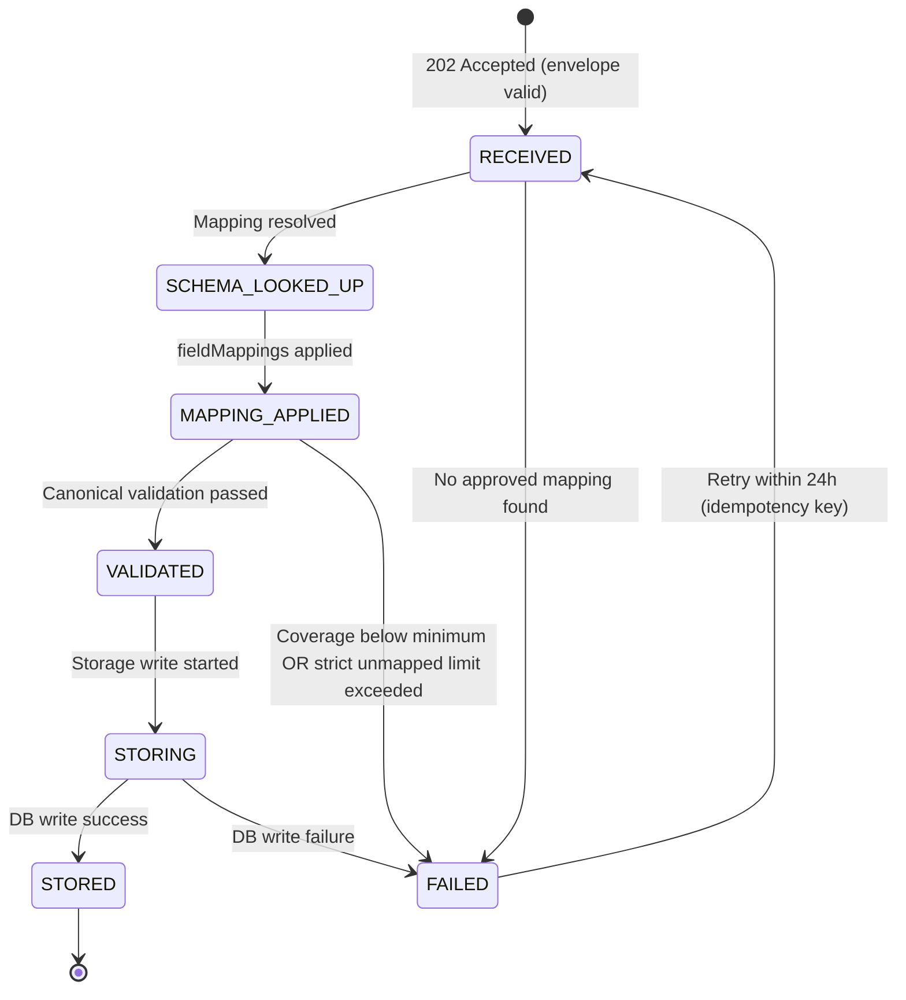

# EPIC-15 — Data Submission API (Schemaless, Auto-Mapped, API-First)

> **Epic Code:** DSAPI | **Story Range:** DSAPI-US-001–010
> **Owner:** Platform Engineering / API Team | **Priority:** P0
> **Implementation Status:** ❌ Mostly Missing (DSAPI-US-001 Implemented)
> **Note:** This is an **API-first external-facing platform API**. No UI screens. Full extended template applied.
> **Revision:** Schemaless ingestion with automatic schema-mapper-driven field resolution + full KPI tracking.

---

## 1. Executive Summary

### Purpose

The Data Submission API is the real-time data ingestion gateway for the HCB credit bureau. Member institutions (`is_data_submitter=true`, `institution_lifecycle_status=active`) submit credit data in **their own native field structure** — the platform automatically resolves canonical fields using the institution's active schema mapping stored in the Schema Mapper Agent. Institutions never need to reformat payloads to match a bureau-defined schema.

### What "Schemaless" Means Here

> **Schemaless ingestion** does not mean the data has no schema — it means the *submitter* is not required to conform to the bureau's canonical schema. The institution sends its own field names and structure. The API resolves the canonical mapping at runtime using the `schema_mapper_mapping` record linked to that institution's source type. The bureau's canonical schema is enforced *after* auto-mapping, invisibly to the submitter.

### Business Value

- Member institutions submit data as-is from their core banking or operational systems — zero ETL effort on their side
- Schema Mapper Agent mappings drive automatic field resolution with confidence scoring
- Unmapped fields and low-confidence mappings trigger drift alerts, not hard rejections (configurable)
- Full processing lifecycle tracked per submission for end-to-end observability
- Idempotency prevents duplicate tradelines; rate limiting protects infrastructure
- Every field-level decision (mapped, unmapped, hashed, rejected) is captured for audit and KPI monitoring

### Key Capabilities

1. API key authentication with institution attribution
2. **Schemaless payload acceptance** — institution submits native JSON structure
3. **Runtime schema mapping lookup** — resolve institution's active mapping from `schema_mapper_mapping`
4. **Automatic field mapping** — apply `fieldMappings` from mapping record to produce canonical payload
5. **Unmapped field tracking** — fields without a mapping are flagged, stored as `unmapped_field_paths`, and may trigger drift alerts
6. **Confidence-threshold gating** — mappings below the bureau's minimum confidence threshold are flagged for review
7. Field-level validation on the canonical (post-mapping) payload using `validation_rules`
8. PII hashing before storage (SHA-256 for `nationalId`, `phone`, `email`)
9. Async processing pipeline: RECEIVED → SCHEMA_LOOKED_UP → MAPPING_APPLIED → VALIDATED → STORING → STORED | FAILED
10. Correlation ID issuance; full processing timeline per submission
11. Idempotency window (24-hour deduplication by `external_ref_id` + institution)
12. Rate limiting: configurable per institution via `api_keys.rate_limit_override`

---

## 2. Scope

### In Scope

- Real-time single-record submission in institution-native JSON
- API key authentication and institution resolution
- Runtime schema mapping resolution from `schema_mapper_mapping`
- Automatic field mapping, confidence scoring, and unmapped field detection
- Canonical payload validation via `validation_rules` table
- Async processing pipeline with per-stage timing
- Full submission tracking in `api_submission_tracking` table (new)
- Aggregated KPI tracking in `api_requests` (backward-compatible)
- Drift alert insertion when unmapped fields exceed threshold
- PII hashing (SHA-256)
- Idempotency enforcement
- Rate limiting per API key
- Correlation ID in every response (success and error)
- Structured error format with field-level detail

### Out of Scope

- Batch file submission (EPIC-14)
- Consumer identity resolution on submission (EPIC-18)
- Webhook callbacks on processing completion (future)
- Multi-record batch JSON submission in a single call
- Schema Mapper UI flows (EPIC-12)

---

## 3. Personas

| Persona | Role | Needs |
|---------|------|-------|
| Member Institution System | API_USER (API key) | Submit credit data in own format without reformatting |
| Bureau Platform | Internal | Auto-map, validate, hash, store; track every decision |
| Bureau Administrator | BUREAU_ADMIN | Monitor mapping coverage, unmapped rates, error rates |
| Schema Governance | ANALYST / BUREAU_ADMIN | Track unmapped fields, confidence degradation, drift |
| Compliance Officer | BUREAU_ADMIN | Immutable audit trail: which mapping version processed each record |

---

## 4. API Contract Design

### Endpoint Structure

| Endpoint | Method | Auth | Purpose |
|----------|--------|------|---------|
| `POST /api/v1/data/submit` | POST | X-API-Key | Submit a record in institution-native format |
| `GET /api/v1/data/submit/:correlationId/status` | GET | X-API-Key | Poll submission processing status |
| `GET /api/v1/data/submit/schema` | GET | X-API-Key | Return the canonical schema the platform maps *to* |
| `GET /api/v1/data/submit/mapping-preview` | GET | X-API-Key | Dry-run: show how a payload would be mapped (non-persisting) |

### Versioning Strategy

- Current version: `/v1/`
- Breaking changes increment to `/v2/`
- `/v1/` supported for minimum 12 months after `/v2/` release
- `Accept-Version` header for future version negotiation

### Authentication

- **Method:** `X-API-Key` header
- **Institution resolution:** API key → `api_keys` table → `institution_id`
- **Active check:** Institution must be `active` or 403 returned
- **No Bearer JWT** — machine-to-machine only

### Idempotency Rules

- `Idempotency-Key` header (optional): duplicate calls within 24h return the original 202 with same `correlationId`
- `externalRefId` in payload also checked for deduplication scoped to `institution_id`
- Duplicate detection window: 24 hours (configurable)

### Rate Limits

- Default: 1,000 requests/minute per API key
- Override: `api_keys.rate_limit_override`
- Burst: 2× rate limit for 10-second windows
- Rate limit headers on every 2xx response:
  ```
  X-RateLimit-Limit: 1000
  X-RateLimit-Remaining: 847
  X-RateLimit-Reset: 1743426000
  ```

---

## 5. Schemaless Payload Design

### Submission Envelope (Required Wrapper)

The submission envelope is minimal and fixed. The `data` object is completely free-form — the institution supplies its own field names.

```json
{
  "externalRefId": "FNB-2026-0001",
  "sourceType": "bank",
  "reportingPeriod": "2026-03-31",
  "data": {
    "/* any field names the institution uses */": "..."
  }
}
```

| Envelope Field | Type | Required | Description |
|---------------|------|----------|-------------|
| `externalRefId` | string (max 100) | Yes | Institution's own record ID; used for idempotency |
| `sourceType` | string | Yes | Identifies the mapping to use: `bank`, `telecom`, `utility`, `gst`, `custom`, etc. |
| `reportingPeriod` | string (YYYY-MM-DD) | No | Data period; defaults to current date |
| `data` | object | Yes | Free-form institution payload — any structure, any field names |

### Example: Bank Institution Submitting Native Format

```http
POST /api/v1/data/submit HTTP/1.1
Host: api.hcb.example.com
X-API-Key: hcb_key_xxxxxxxx
Content-Type: application/json
Idempotency-Key: FNB-2026-031-001

{
  "externalRefId": "FNB-2026-0001",
  "sourceType": "bank",
  "reportingPeriod": "2026-03-31",
  "data": {
    "cust_id": "C-78923",
    "pan_number": "ABCDE1234F",
    "mobile": "+254700000001",
    "email_id": "john.doe@fnb.com",
    "acct_no": "ACC-FNB-001",
    "product_type": "TERM",
    "sanctioned_amt": 500000,
    "outstanding": 350000,
    "dpd": 0,
    "tenure": 60,
    "disbursal_date": "2021-04-01"
  }
}
```

The platform resolves the institution's active `bank` mapping from `schema_mapper_mapping`, finds that `pan_number` → `consumer.nationalId`, `acct_no` → `tradeline.accountNumber`, `outstanding` → `tradeline.outstandingBalance`, etc., and produces the canonical record — without the institution changing a single field name.

### Payload Size Limits

- Maximum request body: **1 MB** per record
- `Content-Type: application/json` required
- Maximum `data` object depth: 5 levels

---

## 6. Auto-Mapping Pipeline

### Step 1 — Schema Mapping Lookup

```
institution_id + sourceType
  → query schema_mapper_mapping WHERE institution_id = ? AND sourceType = ? AND status = 'approved'
  → select latest approved version
  → load fieldMappings[] from JSON payload column
```

If no approved mapping exists for the institution+sourceType combination:
- Return `422 ERR_MAPPING_NOT_FOUND` (not a 400; payload is structurally valid)
- Log event as `MAPPING_MISSING` in `api_submission_tracking`

### Step 2 — Field Resolution

For each entry in `fieldMappings[]`:

```
fieldMapping = { sourcePath, canonicalPath, matchType, confidence, containsPii }

resolvedValue = extract(data, sourcePath)   // supports dot-notation, array index
if resolvedValue is present:
    if confidence >= institution.mappingConfidenceThreshold (default 0.70):
        add (canonicalPath → resolvedValue) to canonicalPayload
    else:
        add sourcePath to lowConfidenceFields[]
        if STRICT_MODE: reject field, add to validationErrors[]
        else:           pass through with warning flag
```

### Step 3 — Unmapped Field Detection

```
payloadPaths = flattenPaths(data)
mappedSourcePaths = fieldMappings[].sourcePath
unmappedPaths = payloadPaths - mappedSourcePaths

store unmappedPaths in api_submission_tracking.unmapped_field_paths (JSON array)

if unmappedPaths.size > 0:
    update mapping_coverage_percent = mapped_fields_count / total_fields_in_payload * 100
    if unmappedPaths.size / total_fields_in_payload > bureau.driftAlertThreshold (default 0.20):
        insert ingestion_drift_alerts row (type: 'mapping', severity based on %)
```

### Step 4 — Derived Field Computation

Derived fields defined in the mapping's `derivedFields` array are computed after raw field mapping:

```
for each derivedField:
    evaluate expression(canonicalPayload) → derivedValue
    assign canonicalPayload[derivedField.targetPath] = derivedValue
```

### Step 5 — PII Hashing

Before canonical payload is stored:

```
if canonicalPayload.consumer.nationalId present:
    canonicalPayload.consumer.nationalIdHash = SHA-256(nationalId)
    delete canonicalPayload.consumer.nationalId

if canonicalPayload.consumer.phone present:
    canonicalPayload.consumer.phoneHash = SHA-256(phone)
    delete canonicalPayload.consumer.phone

if canonicalPayload.consumer.email present:
    canonicalPayload.consumer.emailHash = SHA-256(email)
    delete canonicalPayload.consumer.email
```

All `fieldMappings` entries with `containsPii: true` are hashed regardless of canonical path name.

### Step 6 — Canonical Validation

After mapping and hashing, validate the canonical payload against active `validation_rules` for the `sourceType`:

```
for each validationRule WHERE source_type = ? AND status = 'active':
    evaluate rule.expression on canonicalPayload
    if fails: add to canonicalValidationErrors[]

if canonicalValidationErrors.size > 0:
    update submission to FAILED
    return error response with fieldErrors[] referencing canonical paths
```

### Mapping Coverage Thresholds (Configurable)

| Threshold | Name | Default | Effect |
|-----------|------|---------|--------|
| `mappingConfidenceThreshold` | Per-institution confidence floor | 0.70 | Fields below this are flagged or rejected |
| `driftAlertThreshold` | Unmapped field ratio to trigger drift alert | 0.20 (20%) | Drift alert inserted when exceeded |
| `maxUnmappedFieldsAbsolute` | Hard ceiling on unmapped fields | 10 | Submission rejected if exceeded in STRICT mode |
| `mappingCoverageMinPercent` | Minimum required mapping coverage | 60% | Submission rejected below this coverage |

---

## 7. Processing Pipeline and Lifecycle

### Full Pipeline

```
POST /api/v1/data/submit
    ↓ [INTAKE]
    Validate X-API-Key → resolve institution → check active status
    Check is_data_submitter flag
    Check rate limit (api_keys.rate_limit_override)
    ↓ [IDEMPOTENCY]
    Check external_ref_id + institution_id in api_submission_tracking (last 24h)
    If duplicate: return original 202 with cached correlationId
    ↓ [ENVELOPE VALIDATION]
    Validate envelope fields: externalRefId, sourceType, data (presence + types)
    ↓ [202 ACCEPTED] ← return here; async continues below
    Insert api_submission_tracking row (status: RECEIVED, received_at = now)
    ↓ [SCHEMA LOOKUP — async]
    Query schema_mapper_mapping for institution + sourceType (approved, latest)
    Record: mapping_id, mapping_version, schema_lookup_time_ms
    Update status → SCHEMA_LOOKED_UP
    ↓ [FIELD MAPPING — async]
    Apply fieldMappings[] to data object
    Compute: mapped_fields_count, unmapped_fields_count, unmapped_field_paths
    Compute: avg_mapping_confidence, min_mapping_confidence, mapping_coverage_percent
    Record: field_mapping_time_ms
    Update status → MAPPING_APPLIED
    ↓ [PII HASHING — async]
    Hash all containsPii=true fields; record pii_fields_hashed count
    ↓ [CANONICAL VALIDATION — async]
    Apply active validation_rules for sourceType
    Collect canonicalValidationErrors[]
    Record: validation_time_ms, validation_errors_count
    If errors and STRICT: update status → FAILED; exit
    Update status → VALIDATED
    ↓ [DERIVED FIELDS — async]
    Compute derivedFields[] from mapping
    ↓ [STORAGE — async]
    UPSERT consumers (national_id_hash + nationalIdType)
    INSERT tradelines (with consumer_id FK)
    UPDATE credit_profiles (recalculate totals)
    Record: storage_time_ms
    Update status → STORED; set stored_at = now
    ↓ [AUDIT]
    UPDATE api_requests row (backward-compat KPIs)
    Check drift alert threshold; INSERT ingestion_drift_alerts if triggered
    ↓ [DRIFT DETECTION]
    If unmapped_field_paths has new paths not seen in last 30 days:
        INSERT ingestion_drift_alerts (alert_type='mapping', severity per ratio)
```

### Submission Lifecycle States



| State | Description | Terminal |
|-------|-------------|----------|
| `RECEIVED` | Envelope accepted, queued for async processing | No |
| `SCHEMA_LOOKED_UP` | Mapping record resolved; mapping_id and version recorded | No |
| `MAPPING_APPLIED` | fieldMappings applied; coverage and confidence computed | No |
| `VALIDATED` | Canonical validation rules passed | No |
| `STORING` | DB writes in progress | No |
| `STORED` | Record written to tradelines/consumers | Yes |
| `FAILED` | Processing stopped; error_code set | Retriable within 24h |
| `PARTIAL_SUCCESS` | Record stored with unmapped fields or low-confidence warnings | Yes |

---

## 8. Response Design

### Success Response (202 Accepted)

```json
{
  "correlationId": "DSAPI-2026-031-001",
  "submissionStatus": "RECEIVED",
  "externalRefId": "FNB-2026-0001",
  "sourceType": "bank",
  "receivedAt": "2026-03-31T14:00:00Z",
  "estimatedProcessingTime": "PT30S"
}
```

### Status Poll Response (`GET /status`)

```json
{
  "correlationId": "DSAPI-2026-031-001",
  "submissionStatus": "STORED",
  "externalRefId": "FNB-2026-0001",
  "sourceType": "bank",
  "receivedAt": "2026-03-31T14:00:00Z",
  "storedAt": "2026-03-31T14:00:01Z",
  "processingTimeMs": 847,
  "mappingId": "MAP-FNB-BANK-v3",
  "mappingVersion": 3,
  "mappingCoveragePercent": 91.7,
  "unmappedFieldCount": 1,
  "unmappedFieldPaths": ["data.internal_crm_tag"],
  "avgMappingConfidence": 0.94,
  "piiFieldsHashed": 3,
  "validationErrorsCount": 0,
  "pipeline": {
    "schemaLookupMs": 12,
    "fieldMappingMs": 28,
    "validationMs": 45,
    "storageMs": 762
  }
}
```

### Mapping Not Found Error (422)

```json
{
  "correlationId": "DSAPI-2026-031-002",
  "errorCode": "ERR_MAPPING_NOT_FOUND",
  "errorMessage": "No approved schema mapping found for institution 'FNB-001' and sourceType 'insurance'",
  "suggestion": "Submit a schema mapping for sourceType 'insurance' via the Schema Mapper Agent and obtain approval before submitting data.",
  "timestamp": "2026-03-31T14:00:01Z"
}
```

### Validation Error Response (400)

```json
{
  "correlationId": "DSAPI-2026-031-003",
  "errorCode": "ERR_VALIDATION_FORMAT",
  "errorMessage": "2 canonical fields failed validation after mapping",
  "fieldErrors": [
    {
      "field": "tradeline.facilityType",
      "sourcePath": "data.product_type",
      "errorCode": "ERR_FIELD_ENUM",
      "errorMessage": "Mapped value 'MORTGAGE' is not in allowed values: TERM_LOAN, OD, CC, LEASE, GUARANTEE, OTHER",
      "rejectedValue": "MORTGAGE",
      "mappingConfidence": 0.96
    },
    {
      "field": "tradeline.loanAmount",
      "sourcePath": "data.sanctioned_amt",
      "errorCode": "ERR_FIELD_RANGE",
      "errorMessage": "Loan amount must be >= 0",
      "rejectedValue": -5000,
      "mappingConfidence": 0.99
    }
  ],
  "mappingSummary": {
    "mappedFields": 9,
    "unmappedFields": 1,
    "coveragePercent": 90.0
  },
  "timestamp": "2026-03-31T14:00:01Z"
}
```

### Standard Error Codes

| HTTP Status | Error Code | Description |
|-------------|------------|-------------|
| 400 | `ERR_ENVELOPE_INVALID` | Envelope wrapper fields missing or malformed |
| 400 | `ERR_VALIDATION_FORMAT` | Canonical field format validation failed (post-mapping) |
| 400 | `ERR_VALIDATION_MISSING` | Required canonical field missing after mapping |
| 400 | `ERR_VALIDATION_CROSS_FIELD` | Cross-field canonical rule failed |
| 400 | `ERR_COVERAGE_TOO_LOW` | Mapping coverage below `mappingCoverageMinPercent` |
| 401 | `ERR_API_KEY_INVALID` | API key missing or invalid |
| 401 | `ERR_API_KEY_REVOKED` | API key has been revoked |
| 403 | `ERR_INSTITUTION_NOT_ACTIVE` | Institution not in active lifecycle status |
| 403 | `ERR_INSTITUTION_SUBMISSION_DISABLED` | `is_data_submitter` not enabled |
| 409 | `ERR_DUPLICATE_SUBMISSION` | `externalRefId` already processed within 24h |
| 422 | `ERR_MAPPING_NOT_FOUND` | No approved schema mapping for institution + sourceType |
| 422 | `ERR_MAPPING_DRAFT` | Mapping exists but not yet approved |
| 429 | `ERR_RATE_LIMITED` | Rate limit exceeded |
| 500 | `ERR_INTERNAL` | Unexpected server error |
| 503 | `ERR_SERVICE_UNAVAILABLE` | DB or mapper unavailable |

---

## 9. Tracking Points — Database Design

### New Table: `api_submission_tracking`

This is the primary tracking table for per-submission observability. It is richer than `api_requests` (which remains for backward-compat KPI queries). Every row corresponds to one submitted record through the full async lifecycle.

```sql
CREATE TABLE IF NOT EXISTS api_submission_tracking (
    -- Identity
    id                          INTEGER PRIMARY KEY AUTOINCREMENT,
    correlation_id              TEXT NOT NULL UNIQUE,
    external_ref_id             TEXT,
    idempotency_key             TEXT,

    -- Institution + auth
    institution_id              TEXT NOT NULL,
    api_key_id                  INTEGER,
    source_type                 TEXT NOT NULL,
    reporting_period            DATE,
    client_ip_hash              TEXT,

    -- Schema mapping provenance
    mapping_id                  TEXT,          -- schema_mapper_mapping.mapping_id used
    mapping_version             INTEGER,       -- version of the mapping applied
    mapping_snapshot            TEXT,          -- JSON snapshot of fieldMappings[] at time of use

    -- Field-level mapping metrics
    total_fields_in_payload     INTEGER DEFAULT 0,
    mapped_fields_count         INTEGER DEFAULT 0,
    unmapped_fields_count       INTEGER DEFAULT 0,
    mapping_coverage_percent    REAL DEFAULT 0,
    avg_mapping_confidence      REAL,
    min_mapping_confidence      REAL,
    low_confidence_fields_count INTEGER DEFAULT 0,
    pii_fields_hashed           INTEGER DEFAULT 0,
    unmapped_field_paths        TEXT,          -- JSON array of dot-notation paths
    low_confidence_field_paths  TEXT,          -- JSON array of {path, confidence} objects

    -- Validation
    validation_errors_count     INTEGER DEFAULT 0,
    validation_error_details    TEXT,          -- JSON array of {field, errorCode, rejectedValue}
    canonical_fields_produced   INTEGER DEFAULT 0,
    derived_fields_computed     INTEGER DEFAULT 0,

    -- Lifecycle status
    submission_status           TEXT NOT NULL DEFAULT 'RECEIVED',
    -- RECEIVED | SCHEMA_LOOKED_UP | MAPPING_APPLIED | VALIDATED | STORING | STORED | FAILED | PARTIAL_SUCCESS
    error_code                  TEXT,
    error_message               TEXT,
    failure_stage               TEXT,          -- which pipeline stage failed: LOOKUP | MAPPING | VALIDATION | STORAGE

    -- Timestamps (ISO-8601 UTC)
    received_at                 DATETIME NOT NULL DEFAULT (datetime('now')),
    schema_looked_up_at         DATETIME,
    mapping_applied_at          DATETIME,
    validated_at                DATETIME,
    storing_started_at          DATETIME,
    stored_at                   DATETIME,
    failed_at                   DATETIME,

    -- Per-stage timing (milliseconds)
    response_time_ms            INTEGER,       -- time to 202 return (intake only)
    schema_lookup_time_ms       INTEGER,
    field_mapping_time_ms       INTEGER,
    validation_time_ms          INTEGER,
    storage_time_ms             INTEGER,
    total_processing_time_ms    INTEGER,       -- received_at → stored_at or failed_at

    -- Drift detection support
    new_field_paths_detected    TEXT,          -- JSON array of paths not seen in mapping history
    drift_alert_triggered       INTEGER DEFAULT 0,  -- 1 if ingestion_drift_alerts row inserted

    -- Storage outcome references
    consumer_id                 INTEGER,       -- FK to consumers.id if STORED
    tradeline_id                INTEGER,       -- FK to tradelines.id if STORED
    is_consumer_created         INTEGER DEFAULT 0,   -- 1 if new consumer row inserted
    is_consumer_updated         INTEGER DEFAULT 0,   -- 1 if existing consumer upserted

    -- Idempotency: duplicate detection
    is_duplicate                INTEGER DEFAULT 0,
    original_correlation_id     TEXT,          -- if duplicate, ref to original

    -- Rate limit context
    rate_limit_at_submission    INTEGER,
    rate_limit_remaining        INTEGER,
    rate_limited                INTEGER DEFAULT 0
);

CREATE INDEX idx_ast_institution_received ON api_submission_tracking(institution_id, received_at);
CREATE INDEX idx_ast_source_type_received ON api_submission_tracking(source_type, received_at);
CREATE INDEX idx_ast_status ON api_submission_tracking(submission_status);
CREATE INDEX idx_ast_mapping_id ON api_submission_tracking(mapping_id);
CREATE INDEX idx_ast_correlation ON api_submission_tracking(correlation_id);
CREATE INDEX idx_ast_external_ref ON api_submission_tracking(external_ref_id, institution_id);
CREATE INDEX idx_ast_drift ON api_submission_tracking(drift_alert_triggered, received_at);
```

### Extended `api_requests` Table (Backward-Compatible)

The existing `api_requests` table continues to be written for all KPI dashboard queries. Add these columns if not present:

```sql
ALTER TABLE api_requests ADD COLUMN source_type TEXT;
ALTER TABLE api_requests ADD COLUMN correlation_id TEXT;
ALTER TABLE api_requests ADD COLUMN mapping_coverage_percent REAL;
ALTER TABLE api_requests ADD COLUMN unmapped_fields_count INTEGER DEFAULT 0;
ALTER TABLE api_requests ADD COLUMN drift_alert_triggered INTEGER DEFAULT 0;
```

> **Write strategy:** On each `POST /data/submit`, write one row to `api_submission_tracking` (full detail) AND one row to `api_requests` (KPI-compatible, slim). The `MonitoringController` KPI queries continue to run on `api_requests` unchanged.

### Tracking Point Summary — What Is Stored Where

| Tracking Point | Table | Column(s) |
|---------------|-------|-----------|
| Submission received | `api_submission_tracking` | `received_at`, `submission_status='RECEIVED'` |
| Institution + API key | `api_submission_tracking` | `institution_id`, `api_key_id` |
| Source type submitted | `api_submission_tracking` | `source_type` |
| Mapping resolved (which version) | `api_submission_tracking` | `mapping_id`, `mapping_version` |
| Mapping snapshot at use time | `api_submission_tracking` | `mapping_snapshot` |
| Field count in payload | `api_submission_tracking` | `total_fields_in_payload` |
| Fields successfully mapped | `api_submission_tracking` | `mapped_fields_count` |
| Fields NOT in mapping | `api_submission_tracking` | `unmapped_fields_count`, `unmapped_field_paths` |
| Mapping coverage % | `api_submission_tracking` | `mapping_coverage_percent` |
| Average mapping confidence | `api_submission_tracking` | `avg_mapping_confidence` |
| Minimum confidence across fields | `api_submission_tracking` | `min_mapping_confidence` |
| Low-confidence fields | `api_submission_tracking` | `low_confidence_fields_count`, `low_confidence_field_paths` |
| PII fields hashed count | `api_submission_tracking` | `pii_fields_hashed` |
| Canonical validation errors | `api_submission_tracking` | `validation_errors_count`, `validation_error_details` |
| Derived fields computed | `api_submission_tracking` | `derived_fields_computed` |
| Processing stage transitions | `api_submission_tracking` | `schema_looked_up_at`, `mapping_applied_at`, `validated_at`, `stored_at` |
| Per-stage latency | `api_submission_tracking` | `schema_lookup_time_ms`, `field_mapping_time_ms`, `validation_time_ms`, `storage_time_ms` |
| Total end-to-end latency | `api_submission_tracking` | `total_processing_time_ms` |
| Response time (intake only) | `api_submission_tracking` | `response_time_ms` |
| Final lifecycle state | `api_submission_tracking` | `submission_status`, `error_code`, `failure_stage` |
| Consumer created or updated | `api_submission_tracking` | `is_consumer_created`, `is_consumer_updated`, `consumer_id` |
| Tradeline stored | `api_submission_tracking` | `tradeline_id` |
| Drift alert fired | `api_submission_tracking` | `drift_alert_triggered`, `new_field_paths_detected` |
| Duplicate submission | `api_submission_tracking` | `is_duplicate`, `original_correlation_id` |
| Rate limit state | `api_submission_tracking` | `rate_limited`, `rate_limit_at_submission`, `rate_limit_remaining` |
| KPI counters (volume, success rate) | `api_requests` | `api_request_status`, `response_time_ms`, `records_processed` |
| Audit trail | `audit_logs` | every mutation event |
| Drift events | `ingestion_drift_alerts` | triggered when unmapped ratio > threshold |
| Schema mapping version history | `schema_mapper_mapping` | `version`, `status`, updated on each approval |

---

## 10. Monitoring KPIs Driven by Tracking Points

### KPI Group 1 — Volume & Throughput

| KPI | Query Basis | Table |
|-----|-------------|-------|
| Total submissions today | `COUNT(*)` on `received_at >= today` | `api_submission_tracking` |
| Submissions per institution (today) | `COUNT(*) GROUP BY institution_id` | `api_submission_tracking` |
| Submissions per source type | `COUNT(*) GROUP BY source_type` | `api_submission_tracking` |
| Records stored today | `COUNT(*) WHERE submission_status='STORED'` | `api_submission_tracking` |
| Duplicate submissions rejected | `COUNT(*) WHERE is_duplicate=1` | `api_submission_tracking` |
| Rate-limited requests | `COUNT(*) WHERE rate_limited=1` | `api_submission_tracking` |

### KPI Group 2 — Success & Error Rates

| KPI | Query Basis | Table |
|-----|-------------|-------|
| End-to-end success rate % | `stored / total * 100` | `api_submission_tracking` |
| Failure rate % | `failed / total * 100` | `api_submission_tracking` |
| Failure breakdown by stage | `COUNT(*) GROUP BY failure_stage` | `api_submission_tracking` |
| Top error codes | `COUNT(*) GROUP BY error_code ORDER BY count DESC` | `api_submission_tracking` |
| Validation error rate | `COUNT(*) WHERE validation_errors_count > 0` / total | `api_submission_tracking` |
| Mapping-not-found rate | `COUNT(*) WHERE error_code='ERR_MAPPING_NOT_FOUND'` | `api_submission_tracking` |

### KPI Group 3 — Performance / Latency

| KPI | Query Basis | Table |
|-----|-------------|-------|
| P95 response time (intake → 202) | 95th percentile of `response_time_ms` | `api_submission_tracking` |
| P95 end-to-end processing time | 95th percentile of `total_processing_time_ms` | `api_submission_tracking` |
| Avg schema lookup time | `AVG(schema_lookup_time_ms)` | `api_submission_tracking` |
| Avg field mapping time | `AVG(field_mapping_time_ms)` | `api_submission_tracking` |
| Avg canonical validation time | `AVG(validation_time_ms)` | `api_submission_tracking` |
| Avg storage write time | `AVG(storage_time_ms)` | `api_submission_tracking` |
| Slowest institutions (avg processing) | `AVG(total_processing_time_ms) GROUP BY institution_id` | `api_submission_tracking` |

### KPI Group 4 — Schema Mapping Quality

| KPI | Query Basis | Table |
|-----|-------------|-------|
| Avg mapping coverage % | `AVG(mapping_coverage_percent)` | `api_submission_tracking` |
| Avg mapping confidence | `AVG(avg_mapping_confidence)` | `api_submission_tracking` |
| Min mapping confidence (worst) | `MIN(min_mapping_confidence)` | `api_submission_tracking` |
| Unmapped field rate | `SUM(unmapped_fields_count) / SUM(total_fields_in_payload) * 100` | `api_submission_tracking` |
| Low-confidence field rate | `SUM(low_confidence_fields_count) / SUM(total_fields_in_payload) * 100` | `api_submission_tracking` |
| Coverage by institution | `AVG(mapping_coverage_percent) GROUP BY institution_id` | `api_submission_tracking` |
| Coverage by source type | `AVG(mapping_coverage_percent) GROUP BY source_type` | `api_submission_tracking` |
| Mapping version in use | `COUNT(*) GROUP BY mapping_id, mapping_version` | `api_submission_tracking` |
| PII fields hashed per day | `SUM(pii_fields_hashed) GROUP BY date(received_at)` | `api_submission_tracking` |

### KPI Group 5 — Drift & Governance

| KPI | Query Basis | Table |
|-----|-------------|-------|
| Drift alerts triggered today | `COUNT(*) WHERE drift_alert_triggered=1` | `api_submission_tracking` |
| New unmapped paths (last 7 days) | `unmapped_field_paths` aggregated + diffed vs prior period | `api_submission_tracking` |
| Drift severity breakdown | `severity GROUP BY source_type` | `ingestion_drift_alerts` |
| Submissions triggering drift (%) | drift-triggered / total * 100 | `api_submission_tracking` |

### KPI Group 6 — Consumer & Tradeline Impact

| KPI | Query Basis | Table |
|-----|-------------|-------|
| New consumers registered today | `COUNT(*) WHERE is_consumer_created=1` | `api_submission_tracking` |
| Existing consumers updated today | `COUNT(*) WHERE is_consumer_updated=1` | `api_submission_tracking` |
| Tradelines stored today | `COUNT(*) WHERE tradeline_id IS NOT NULL` | `api_submission_tracking` |

### Alert Thresholds (EPIC-10 Integration)

| Alert | Threshold | Severity | Trigger |
|-------|-----------|----------|---------|
| High rejection rate | `failure rate > 10%` over 15 min | HIGH | `COUNT(failed) / COUNT(*) > 0.10` |
| Mapping coverage degradation | `avg_mapping_coverage < 70%` | MEDIUM | 5-minute rolling window |
| Mapping not found spike | `ERR_MAPPING_NOT_FOUND > 20 in 5 min` | HIGH | Suggests institution missing mapping approval |
| Drift threshold breach | `unmapped_fields_count / total > 20%` per submission | MEDIUM | Per-record check |
| P95 latency spike | `p95_processing > 10s` | MEDIUM | 15-minute window |
| Rate limit saturation | `rate_limited count > 50 per institution per hour` | LOW | Suggests integration issues |

---

## 11. Stories

---

### DSAPI-US-001 — Authenticate with API Key

#### 1. Description
> As a member institution system,
> I want to authenticate each request using my API key,
> So that my submissions are authorised and attributed to my institution.

#### 2. Status: ✅ Implemented

API key authentication is implemented via `JwtAuthenticationFilter` which checks `X-API-Key` header and resolves the institution.

#### 3. Resolution Logic

```java
SELECT i.*, ak.api_key_status, ak.rate_limit_override
FROM api_keys ak
JOIN institutions i ON i.id = ak.institution_id
WHERE ak.key_hash = SHA256(?) AND ak.api_key_status = 'active'
  AND i.institution_lifecycle_status = 'active'
  AND i.is_data_submitter = true;
```

**Error responses:**
- Missing key: `401 ERR_API_KEY_MISSING`
- Invalid key: `401 ERR_API_KEY_INVALID`
- Revoked key: `401 ERR_API_KEY_REVOKED`
- Inactive institution: `403 ERR_INSTITUTION_NOT_ACTIVE`
- Submission not enabled: `403 ERR_INSTITUTION_SUBMISSION_DISABLED`

#### 4. Tracking Points Written
- `api_submission_tracking.institution_id`
- `api_submission_tracking.api_key_id`
- `api_submission_tracking.client_ip_hash`
- `api_submission_tracking.rate_limit_at_submission`

#### 5. Definition of Done
- [x] X-API-Key header resolved to institution
- [x] Institution active status checked on every request
- [x] `is_data_submitter` flag checked
- [ ] `rate_limit_override` loaded and stored in tracking

---

### DSAPI-US-002 — Accept Schemaless Payload

#### 1. Description
> As a member institution system,
> I want to POST my credit data in my own native field structure (no bureau schema required),
> So that I can submit without transforming my data.

#### 2. Status: ❌ Missing

`POST /api/v1/data/submit` does not exist. Must be implemented with schemaless envelope.

#### 3. Envelope Validation

Before schema mapping, validate only the envelope wrapper:

```
required: externalRefId (string, maxLength 100)
required: sourceType (string, one of known types)
required: data (object, non-empty)
optional: reportingPeriod (date string YYYY-MM-DD)
```

Any other top-level fields → `400 ERR_ENVELOPE_INVALID`.

#### 4. Tracking Points Written
- `correlation_id` (generated on receipt, UUID)
- `external_ref_id`
- `source_type`
- `reporting_period`
- `received_at`
- `response_time_ms` (intake path only)
- `submission_status = 'RECEIVED'`
- `total_fields_in_payload` (after envelope stripped)

#### 5. Definition of Done
- [ ] Endpoint accepts arbitrary `data` object
- [ ] Returns 202 with `correlationId` and `submissionStatus: RECEIVED`
- [ ] `api_submission_tracking` row inserted on receipt
- [ ] `api_requests` row inserted for KPI compatibility
- [ ] `Idempotency-Key` header checked

---

### DSAPI-US-003 — Resolve Schema Mapping at Runtime

#### 1. Description
> As the API platform,
> I want to look up the institution's approved schema mapping for the submitted sourceType,
> So that I know exactly how to translate the institution's fields to canonical fields.

#### 2. Status: ❌ Missing

#### 3. Mapping Lookup Logic

```java
// SchemaMapperJdbcRepository or new DataSubmissionMappingResolver
SELECT sm.mapping_id, sm.payload, sm.version
FROM schema_mapper_mapping sm
JOIN schema_mapper_registry r ON r.registry_id = sm.registry_id
WHERE sm.institution_id = :institutionId
  AND r.source_type = :sourceType
  AND JSON_EXTRACT(sm.payload, '$.status') = 'approved'
ORDER BY sm.version DESC
LIMIT 1;
```

If no approved mapping: return `422 ERR_MAPPING_NOT_FOUND` (synchronous, before 202).

If mapping exists but is in `draft` or `pending_approval`: return `422 ERR_MAPPING_DRAFT`.

#### 4. Tracking Points Written
- `mapping_id`
- `mapping_version`
- `mapping_snapshot` (JSON copy of `fieldMappings[]` array at resolution time)
- `schema_looked_up_at`
- `schema_lookup_time_ms`
- `submission_status = 'SCHEMA_LOOKED_UP'`

#### 5. Definition of Done
- [ ] Mapping resolved per institution + sourceType
- [ ] Only `approved` mappings used
- [ ] `mapping_snapshot` stored at submission time (immutable audit record)
- [ ] Graceful 422 when no approved mapping exists
- [ ] `schema_lookup_time_ms` tracked

---

### DSAPI-US-004 — Apply Field Mapping and Compute Coverage Metrics

#### 1. Description
> As the API platform,
> I want to map institution payload fields to canonical fields using the resolved mapping,
> And track which fields were mapped, unmapped, and the confidence of each mapping,
> So that the bureau knows the quality of every ingested record.

#### 2. Status: ❌ Missing

#### 3. Mapping Application Logic

```java
// DataSubmissionMappingService.applyMapping(Map<String,Object> data, List<FieldMapping> mappings)
Map<String,Object> canonical = new LinkedHashMap<>();
List<String> unmappedPaths = new ArrayList<>();
List<FieldMappingResult> mappingResults = new ArrayList<>();

for (FieldMapping fm : mappings) {
    Object val = JsonPathUtils.extract(data, fm.sourcePath);
    if (val == null) continue;  // source field not in payload; not an error

    if (fm.confidence >= institution.mappingConfidenceThreshold) {
        canonical.put(fm.canonicalPath, val);
        mappingResults.add(FieldMappingResult.mapped(fm, val));
    } else {
        mappingResults.add(FieldMappingResult.lowConfidence(fm, val));
    }
}

// Detect unmapped payload paths
Set<String> payloadPaths = JsonPathUtils.flattenPaths(data);
Set<String> coveredPaths = mappings.stream().map(FieldMapping::getSourcePath).collect(toSet());
unmappedPaths = payloadPaths.stream().filter(p -> !coveredPaths.contains(p)).collect(toList());
```

#### 4. Tracking Points Written
- `mapped_fields_count`
- `unmapped_fields_count`
- `unmapped_field_paths` (JSON array)
- `mapping_coverage_percent`
- `avg_mapping_confidence`
- `min_mapping_confidence`
- `low_confidence_fields_count`
- `low_confidence_field_paths`
- `mapping_applied_at`
- `field_mapping_time_ms`
- `submission_status = 'MAPPING_APPLIED'`

#### 5. Definition of Done
- [ ] All `fieldMappings[].sourcePath` resolved against `data` using dot-notation
- [ ] Unmapped paths stored in `unmapped_field_paths`
- [ ] `mapping_coverage_percent` = mapped / total_in_payload × 100
- [ ] Low-confidence fields flagged but not auto-rejected (configurable)
- [ ] Coverage below `mappingCoverageMinPercent` → fail with `ERR_COVERAGE_TOO_LOW`

---

### DSAPI-US-005 — Hash PII Before Storage

#### 1. Description
> As the API platform,
> I want to SHA-256 hash all PII fields identified by the mapping before any storage or logging,
> So that raw identity data is never persisted in plain text.

#### 2. Status: ❌ Missing

#### 3. PII Hashing Logic

```java
// Applied before storage and before writing mapping_snapshot to tracking
for (FieldMapping fm : mappings) {
    if (fm.containsPii) {
        String rawValue = (String) canonical.get(fm.canonicalPath);
        canonical.put(fm.canonicalPath + "Hash", DigestUtils.sha256Hex(rawValue));
        canonical.remove(fm.canonicalPath);
        piiFieldsHashed++;
    }
}
```

The `mapping_snapshot` stored in `api_submission_tracking` has PII field values replaced with `"[HASHED]"` before writing.

#### 4. Tracking Points Written
- `pii_fields_hashed` (count of fields hashed)

#### 5. Definition of Done
- [ ] All `fieldMappings` entries with `containsPii=true` are hashed
- [ ] `mapping_snapshot` written with PII values replaced by `"[HASHED]"`
- [ ] No plain-text PII in any DB column
- [ ] `pii_fields_hashed` count stored

---

### DSAPI-US-006 — Validate Canonical Payload

#### 1. Description
> As the API platform,
> I want to validate the canonical (post-mapping) payload against active validation rules,
> And report validation errors referencing both the canonical path and the original source path,
> So that the institution can fix their data with the full mapping context.

#### 2. Status: ❌ Missing

#### 3. Validation Response

See Section 8 for the error format. Validation errors reference:
- `field`: canonical path (e.g. `tradeline.facilityType`)
- `sourcePath`: original institution path (e.g. `data.product_type`)
- `mappingConfidence`: the confidence score of the mapping used

#### 4. Tracking Points Written
- `validation_errors_count`
- `validation_error_details` (JSON array)
- `validated_at`
- `validation_time_ms`
- `submission_status = 'VALIDATED'` or `'FAILED'`
- `failure_stage = 'VALIDATION'` on failure
- `error_code`, `error_message` on failure

#### 5. Definition of Done
- [ ] Active `validation_rules` for `sourceType` applied on canonical payload
- [ ] Error response includes `sourcePath` (original field) alongside `field` (canonical)
- [ ] `validation_errors_count` and `validation_error_details` stored
- [ ] Submission status set to `FAILED` on validation errors with `failure_stage='VALIDATION'`

---

### DSAPI-US-007 — Store Tradeline and Update Consumer Profile

#### 1. Description
> As the API platform,
> I want to persist the validated canonical record to the credit data store,
> And update the consumer's credit profile totals,
> So that the tradeline is immediately available for enquiries.

#### 2. Status: ❌ Missing

#### 3. Storage Logic

```sql
-- Upsert consumer
INSERT INTO consumers (national_id_hash, national_id_type, phone_hash, email_hash, reporting_institution_id, created_at, updated_at)
VALUES (?, ?, ?, ?, ?, now(), now())
ON CONFLICT (national_id_hash, national_id_type) DO UPDATE SET
    phone_hash = excluded.phone_hash,
    email_hash = excluded.email_hash,
    updated_at = now();

-- Insert tradeline
INSERT INTO tradelines (consumer_id, institution_id, account_number, facility_type,
    loan_amount, outstanding_balance, dpd_days, loan_tenure_months,
    disbursed_at, closed_at, source_type, correlation_id, created_at)
VALUES (...);

-- Recalculate credit profile
UPDATE credit_profiles SET
    total_exposure = (SELECT SUM(outstanding_balance) FROM tradelines WHERE consumer_id = ?),
    active_accounts = (SELECT COUNT(*) FROM tradelines WHERE consumer_id = ? AND closed_at IS NULL),
    updated_at = now()
WHERE consumer_id = ?;
```

#### 4. Tracking Points Written
- `consumer_id`
- `tradeline_id`
- `is_consumer_created` (1 if INSERT, 0 if UPDATE)
- `is_consumer_updated` (1 if existing consumer updated)
- `stored_at`
- `storage_time_ms`
- `total_processing_time_ms`
- `submission_status = 'STORED'`
- `api_requests` row updated: `api_request_status='success'`, `records_processed=1`

#### 5. Definition of Done
- [ ] Consumer upserted on `national_id_hash + national_id_type`
- [ ] Tradeline `correlation_id` column set for traceability
- [ ] Credit profile recalculated after tradeline insert
- [ ] `is_consumer_created` vs `is_consumer_updated` correctly distinguished
- [ ] `total_processing_time_ms` = `stored_at - received_at`

---

### DSAPI-US-008 — Poll Submission Status

#### 1. Description
> As a member institution,
> I want to poll for my submission's processing status using the correlation ID,
> So that I can confirm when my data has been stored and inspect any mapping decisions made.

#### 2. Status: ❌ Missing

#### 3. Endpoint

`GET /api/v1/data/submit/:correlationId/status`

Returns full pipeline detail including mapping summary — see Section 8 for response shape.

Auth: `X-API-Key` — only the submitting institution can poll their own submission.

#### 4. Definition of Done
- [ ] Returns correct lifecycle state from `api_submission_tracking`
- [ ] Returns full pipeline timing breakdown
- [ ] Returns `mappingCoveragePercent`, `unmappedFieldPaths`, `avgMappingConfidence`
- [ ] Returns `piiFieldsHashed`, `derivedFieldsComputed`
- [ ] 404 if `correlationId` not found or belongs to different institution
- [ ] 404 if `correlationId` older than 30 days (configurable retention)

---

### DSAPI-US-009 — Handle Errors with Correlation ID

#### 1. Description
> As a member institution system,
> I want all error responses to include a correlation ID and structured error code,
> And for validation errors to reference both my original field path and the canonical field,
> So that I can diagnose failures without knowing the bureau's canonical schema.

#### 2. Status: ❌ Missing

#### 3. Error Contract

All errors (400, 401, 403, 409, 422, 429, 500) include:
- `correlationId`: unique per request
- `errorCode`: machine-readable enum
- `errorMessage`: human-readable description
- `fieldErrors[]` (validation errors): includes both `field` (canonical) and `sourcePath` (institution's original)
- `mappingSummary` (validation errors): coverage and unmapped counts
- `timestamp`: ISO 8601

See Section 8 for full format.

#### 4. Tracking Points Written
- `error_code`
- `error_message`
- `failure_stage`
- `failed_at`
- `submission_status = 'FAILED'`

#### 5. Definition of Done
- [ ] All error responses follow the standard error format
- [ ] `correlationId` present in every response (success and error)
- [ ] `fieldErrors[].sourcePath` populated for post-mapping validation errors
- [ ] Submission tracking row updated with `error_code` and `failure_stage` on every failure path

---

### DSAPI-US-010 — Idempotency, Rate Limiting, and Drift Detection

#### 1. Description
> As the API platform,
> I want to enforce idempotency and rate limits to protect infrastructure,
> And detect when submitted payloads contain fields not covered by the current mapping (drift),
> So that data quality issues surface proactively without breaking submissions.

#### 2. Status: ❌ Missing

#### 3. Idempotency

```
On POST /data/submit:
  1. Extract Idempotency-Key header (optional) OR externalRefId from envelope
  2. Query api_submission_tracking:
     WHERE (idempotency_key = ? OR external_ref_id = ?)
       AND institution_id = ? AND received_at > NOW() - INTERVAL 24 HOURS
  3. If found: return original 202 with same correlationId; set is_duplicate=1 on new row
  4. If not found: proceed with new submission
```

#### 4. Rate Limiting

```
Per API key, per minute:
  Increment counter in in-memory ConcurrentHashMap (dev) or Redis (prod)
  If counter > rate_limit_override ?? 1000: return 429 with Retry-After header
  Store rate_limit_remaining in api_submission_tracking
```

Rate limit headers on every 2xx:
```
X-RateLimit-Limit: 1000
X-RateLimit-Remaining: 847
X-RateLimit-Reset: 1743426000
Retry-After: 45  (on 429 only)
```

#### 5. Drift Detection

After mapping, check if `unmapped_field_paths` contains paths not seen in the last 30 days of submissions for this `institution_id + source_type`:

```java
Set<String> historicalPaths = getDistinctMappedPaths(institutionId, sourceType, 30);
List<String> newPaths = unmappedPaths.stream()
    .filter(p -> !historicalPaths.contains(p))
    .collect(toList());

if (!newPaths.isEmpty()) {
    tracking.setNewFieldPathsDetected(toJson(newPaths));
}

double unmappedRatio = unmappedCount / (double) totalFields;
if (unmappedRatio > bureau.driftAlertThreshold) {
    tracking.setDriftAlertTriggered(1);
    insertDriftAlert(institutionId, sourceType, unmappedPaths, unmappedRatio);
}
```

#### 6. Tracking Points Written
- `is_duplicate`
- `original_correlation_id` (if duplicate)
- `rate_limited`
- `rate_limit_remaining`
- `drift_alert_triggered`
- `new_field_paths_detected`
- `ingestion_drift_alerts` row inserted when triggered

#### 7. Definition of Done
- [ ] Duplicate submissions within 24h return original 202 (idempotent)
- [ ] Rate limit enforced per API key per minute
- [ ] 429 includes `Retry-After` header
- [ ] Rate limit headers in all 2xx responses
- [ ] Unmapped field ratio checked per submission
- [ ] `ingestion_drift_alerts` row inserted when `unmapped_ratio > driftAlertThreshold`
- [ ] `new_field_paths_detected` stored for governance queries

---

## 12. Mapping Preview Endpoint

`GET /api/v1/data/submit/mapping-preview`

A non-persisting dry-run endpoint for institutions to test how their payload will be mapped before committing a live submission. Accepts the same envelope body, returns the full mapping result without writing to any table.

```json
{
  "sourceType": "bank",
  "mappingId": "MAP-FNB-BANK-v3",
  "mappingVersion": 3,
  "coveragePercent": 91.7,
  "mappedFields": [
    { "sourcePath": "data.pan_number", "canonicalPath": "consumer.nationalId", "confidence": 0.98, "willBeHashed": true },
    { "sourcePath": "data.acct_no", "canonicalPath": "tradeline.accountNumber", "confidence": 0.99, "willBeHashed": false }
  ],
  "unmappedFields": [
    { "sourcePath": "data.internal_crm_tag", "reason": "No mapping defined" }
  ],
  "lowConfidenceFields": [],
  "canonicalPayloadPreview": {
    "consumer": { "nationalId": "[WILL BE HASHED]", "nationalIdType": "PAN" },
    "tradeline": { "accountNumber": "ACC-FNB-001", "facilityType": "TERM_LOAN" }
  }
}
```

This endpoint calls the same `DataSubmissionMappingService.applyMapping()` but wraps it in a read-only transaction that is always rolled back.

---

## 13. Scalability & Performance

| Metric | Target | Notes |
|--------|--------|-------|
| Submission throughput | 10,000 records/min per bureau | Async processing post-202 |
| Intake response time (P95) | < 100ms (202 return) | Envelope validation + idempotency check only |
| End-to-end processing (P95) | < 5 seconds (RECEIVED → STORED) | Async; tracked via `total_processing_time_ms` |
| Schema mapping lookup | < 50ms P95 | Cached per institution+sourceType; cache TTL 5 min |
| Field mapping application | < 30ms for up to 100 fields | In-memory JSON path resolution |
| Payload size | < 1 MB | Single record envelope |
| Concurrent connections | 1,000 | Per bureau deployment |
| `api_submission_tracking` retention | 90 days (configurable) | Archive after `stored_at > 90d` |

### Caching Strategy

- Active mapping for `(institution_id, sourceType)` cached in `ConcurrentHashMap` (Spring-managed `@Cacheable`)
- Cache invalidated on: mapping approval, mapping rejection, new mapping version
- Cache TTL: 5 minutes (configurable via `hcb.data-submission.mapping-cache-ttl-sec`)

---

## 14. Observability

| Signal | Implementation |
|--------|----------------|
| Structured logs | Every submission: `correlationId`, `institutionId`, `sourceType`, `status`, `mappingCoveragePercent`, `totalProcessingMs` |
| Per-stage timing | `schema_lookup_time_ms`, `field_mapping_time_ms`, `validation_time_ms`, `storage_time_ms` in `api_submission_tracking` |
| Mapping quality metrics | `avg_mapping_confidence`, `mapping_coverage_percent` per submission |
| Drift signals | `drift_alert_triggered`, `new_field_paths_detected` → feeds `ingestion_drift_alerts` |
| KPI dashboard | `MonitoringController` reads `api_requests` (volume/success/latency); new `DataSubmissionController` reads `api_submission_tracking` for mapping quality KPIs |
| Alert integration | EPIC-10 alert engine polls KPI thresholds; uses `api_submission_tracking` aggregates |
| Audit | Every submission writes to `audit_logs` (action: `DATA_SUBMITTED`, entity: `tradeline`, ref: `correlation_id`) |

---

## 15. Security & Compliance

| Requirement | Implementation |
|-------------|----------------|
| PII in transit | TLS 1.3 mandatory |
| PII at rest | SHA-256 hash for all `containsPii=true` fields from mapping before any write |
| Mapping snapshot audit | `mapping_snapshot` stored (with PII replaced by `[HASHED]`) for immutable record of what mapping version processed each record |
| API key rotation | `PATCH /api/v1/institutions/:id/api-access` to regenerate keys |
| Consent validation | If institution has `consent_config` enabled, `consentReference` required in envelope |
| Rate limit transparency | Rate limit headers on every 2xx response |
| Data residency | SQLite/PostgreSQL hosted in-region |
| Unmapped field isolation | Unmapped paths stored as paths only (not values) in `unmapped_field_paths` — no raw payload stored by default |
| Raw payload retention | `raw_payload` column is `NULL` by default; opt-in per institution via `api_access_json.storeRawPayload`; PII fields redacted before storing |

---

## 16. Epic API Summary

| Endpoint | Method | Auth | Description | Status |
|----------|--------|------|-------------|--------|
| `POST /api/v1/data/submit` | POST | X-API-Key | Submit record in institution-native format (schemaless) | ❌ Missing |
| `GET /api/v1/data/submit/:correlationId/status` | GET | X-API-Key | Poll full pipeline status with mapping metrics | ❌ Missing |
| `GET /api/v1/data/submit/schema` | GET | X-API-Key | Return canonical schema the platform maps *to* | ❌ Missing |
| `GET /api/v1/data/submit/mapping-preview` | GET | X-API-Key | Dry-run: show mapping result for a payload | ❌ Missing |

---

## 17. Database Summary

| Table | Key Fields | Purpose |
|-------|------------|---------|
| `api_submission_tracking` | `correlation_id`, `institution_id`, `source_type`, `mapping_id`, `mapping_coverage_percent`, `unmapped_field_paths`, `submission_status`, all stage timestamps | Primary per-submission tracking (new) |
| `api_requests` | `correlation_id`, `institution_id`, `api_request_status`, `response_time_ms`, `source_type` | Backward-compat KPI queries in `MonitoringController` |
| `schema_mapper_mapping` | `mapping_id`, `registry_id`, `institution_id`, `payload` (fieldMappings JSON), `version`, `status` | Mapping source of truth |
| `schema_mapper_registry` | `registry_id`, `source_type`, `institution_id` | Links institution to source type |
| `consumers` | `national_id_hash`, `national_id_type`, `phone_hash`, `email_hash` | Consumer registry (PII-hashed) |
| `tradelines` | `consumer_id`, `institution_id`, `correlation_id`, `facility_type`, `loan_amount`, `dpd_days` | Credit data |
| `credit_profiles` | `consumer_id`, `total_exposure`, `active_accounts` | Aggregated profile (updated after each tradeline insert) |
| `api_keys` | `key_hash`, `institution_id`, `rate_limit_override` | Auth + rate limit config |
| `ingestion_drift_alerts` | `alert_type`, `source_type`, `institution_id`, `severity`, `detected_at` | Drift events (triggers from tracking) |
| `audit_logs` | `action`, `entity_type`, `entity_ref_id`, `actor_id` | Compliance audit trail |

---

## 18. Gap Analysis

| Gap | Story | Severity |
|-----|-------|----------|
| `POST /api/v1/data/submit` missing | DSAPI-US-002 | Critical |
| Schemaless envelope + `data` free-form object | DSAPI-US-002 | Critical |
| Runtime schema mapping lookup from `schema_mapper_mapping` | DSAPI-US-003 | Critical |
| Field mapping application (dot-notation path resolver) | DSAPI-US-004 | Critical |
| `api_submission_tracking` table not yet created | DSAPI-US-002–010 | Critical |
| Coverage and confidence metric computation | DSAPI-US-004 | High |
| PII hashing via `containsPii` flag from mapping | DSAPI-US-005 | High |
| Processing pipeline async stages | DSAPI-US-007 | High |
| Status poll endpoint | DSAPI-US-008 | High |
| Idempotency enforcement | DSAPI-US-010 | High |
| Rate limiting | DSAPI-US-010 | High |
| Drift detection on unmapped fields | DSAPI-US-010 | Medium |
| Mapping preview endpoint | — | Medium |
| `api_requests` extended with `source_type`, `correlation_id`, `mapping_coverage_percent` | — | Medium |

---

## 19. Execution Roadmap

| Phase | Stories | Description |
|-------|---------|-------------|
| Phase 1 | DSAPI-US-001, 002, 003, 009 | Submit endpoint (schemaless envelope), mapping lookup, correlation ID, error format |
| Phase 2 | DSAPI-US-004, 005, 006, 007 | Field mapping engine, PII hashing, canonical validation, tradeline storage |
| Phase 3 | DSAPI-US-008 | Status poll with full pipeline timeline and mapping summary |
| Phase 4 | DSAPI-US-010 | Idempotency, rate limiting, drift detection |
| Phase 5 | — | Mapping preview endpoint, webhook callbacks, multi-record JSON batch |
