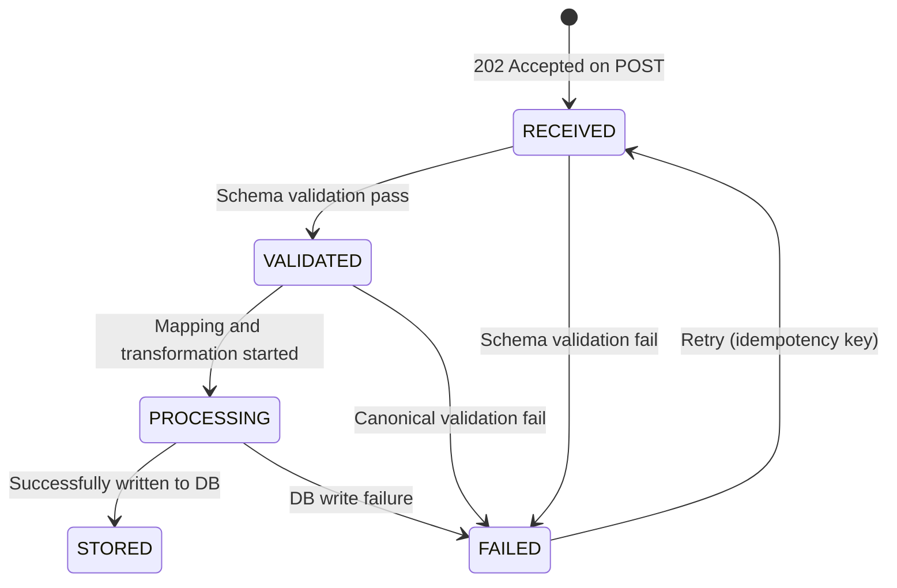

# EPIC-15 — Data Submission API (API-First)

> **Epic Code:** DSAPI | **Story Range:** DSAPI-US-001–007
> **Owner:** Platform Engineering / API Team | **Priority:** P0
> **Implementation Status:** ❌ Mostly Missing (DSAPI-US-001 Implemented)
> **Note:** This is an **API-first external-facing platform API**. No UI screens. Full extended template applied.

---

## 1. Executive Summary

### Purpose
The Data Submission API is the real-time data ingestion gateway for the HCB credit bureau. Member institutions that have data submission rights (`is_data_submitter=true`, `institution_lifecycle_status=active`) use this API to submit individual credit tradeline records in real time, as opposed to the batch pipeline (EPIC-14) which handles bulk file submissions. This API enables immediate credit data availability for enquiries after submission.

### Business Value
- Real-time credit data availability reduces enquiry latency compared to batch (no waiting for next batch window)
- API key authentication provides institution-level attribution of every submitted record
- Idempotency prevents duplicate tradelines from double submissions
- Rate limiting protects the bureau's infrastructure from accidental or malicious overload
- Correlation IDs enable end-to-end tracing from submission to storage

### Key Capabilities
1. API key authentication with institution attribution
2. Single tradeline submission with schema-validated payload
3. Field-level validation error responses with correlation ID
4. Async processing pipeline: validate → map → transform → store
5. Submission lifecycle: RECEIVED → VALIDATED → PROCESSING → STORED | FAILED
6. Idempotency window (24-hour deduplication by `external_ref_id`)
7. Rate limiting: configurable per institution

---

## 2. Scope

### In Scope
- Real-time single-record tradeline submission
- API key authentication and institution resolution
- Payload schema validation
- Async processing pipeline stages
- Submission lifecycle state model
- Correlation ID issuance
- Rate limiting enforcement
- Idempotency enforcement
- Error response format standardization
- PII handling (hash before storage)
- Audit logging of every submission

### Out of Scope
- Batch file submission (EPIC-14)
- Consumer identity resolution on submission (EPIC-18)
- Webhook callbacks on processing completion (future)
- Multi-record batch JSON submission in a single call

---

## 3. Personas

| Persona | Role | Needs |
|---------|------|-------|
| Member Institution System | API_USER (API key) | Submit tradeline records in real time |
| Bureau Platform | Internal | Validate, map, store, audit submissions |
| Bureau Administrator | BUREAU_ADMIN | Monitor submission volume and failures |
| Compliance Officer | BUREAU_ADMIN | Audit trail of all submissions |

---

## 4. API Contract Design

### Endpoint Structure

| Endpoint | Method | Purpose |
|----------|--------|---------|
| `POST /api/v1/data/submit` | POST | Submit a single tradeline record |
| `GET /api/v1/data/submit/:correlationId/status` | GET | Poll submission processing status |
| `GET /api/v1/data/submit/schema` | GET | Retrieve current submission schema |

### Versioning Strategy
- Current version: `/v1/`
- Breaking changes increment to `/v2/`
- `/v1/` supported for minimum 12 months after `/v2/` release
- `Accept-Version` header for future version negotiation

### Authentication
- **Method:** `X-API-Key` header
- **Institution resolution:** API key → `api_keys` table → `institution_id`
- **Active check:** Institution must be `active` or 403 returned
- **No Bearer JWT** for this API — machine-to-machine only

### Idempotency Rules
- `Idempotency-Key` header (optional): if supplied, duplicate calls within 24h return the original 202 response
- `external_ref_id` in payload: checked for duplicates in `api_requests` table
- Duplicate detection window: 24 hours (configurable)

### Rate Limits
- Default: 1,000 requests/minute per API key
- Override: `institutions.api_access_json.rateLimitOverride`
- Burst: 2× rate limit for 10-second windows
- Rate limit headers: `X-RateLimit-Limit`, `X-RateLimit-Remaining`, `X-RateLimit-Reset`

---

## 5. Request Handling

### Submission Payload Schema

```json
{
  "$schema": "http://json-schema.org/draft-07/schema",
  "type": "object",
  "required": ["externalRefId", "consumerIdentity", "tradeline"],
  "properties": {
    "externalRefId": {
      "type": "string",
      "description": "Institution's own reference ID for idempotency",
      "maxLength": 100
    },
    "reportingPeriod": {
      "type": "string",
      "format": "date",
      "description": "YYYY-MM-DD of the reporting period"
    },
    "consumerIdentity": {
      "type": "object",
      "required": ["nationalIdType", "nationalId"],
      "properties": {
        "nationalIdType": {"type": "string", "enum": ["PAN", "AADHAAR", "NIN", "PASSPORT", "NRIC", "OTHER"]},
        "nationalId": {"type": "string", "description": "Plain text — will be hashed before storage"},
        "phone": {"type": "string"},
        "email": {"type": "string", "format": "email"}
      }
    },
    "tradeline": {
      "type": "object",
      "required": ["accountNumber", "facilityType", "loanAmount", "outstandingBalance"],
      "properties": {
        "accountNumber": {"type": "string"},
        "facilityType": {"type": "string", "enum": ["TERM_LOAN", "OD", "CC", "LEASE", "GUARANTEE", "OTHER"]},
        "loanAmount": {"type": "number", "minimum": 0},
        "outstandingBalance": {"type": "number", "minimum": 0},
        "dpdDays": {"type": "integer", "minimum": 0, "default": 0},
        "loanTenureMonths": {"type": "integer", "minimum": 1},
        "disbursedAt": {"type": "string", "format": "date"},
        "closedAt": {"type": "string", "format": "date", "nullable": true}
      }
    }
  }
}
```

### Validation Levels
1. **Structural validation:** JSON schema validation (strict)
2. **Type validation:** data type checks (number, date format)
3. **Business validation:** cross-field rules (e.g. `closedAt` must be after `disbursedAt`)
4. **Canonical field validation:** active validation rules from `validation_rules` table

### Payload Size Limits
- Maximum request body: **1 MB** per record
- `Content-Type: application/json` required

---

## 6. Response Design

### Success Response (202 Accepted)

```json
{
  "correlationId": "DSAPI-2026-031-001",
  "submissionStatus": "RECEIVED",
  "externalRefId": "FNB-2026-0001",
  "receivedAt": "2026-03-31T14:00:00Z",
  "estimatedProcessingTime": "PT30S"
}
```

### Error Response Format

```json
{
  "correlationId": "DSAPI-2026-031-001",
  "errorCode": "ERR_VALIDATION_FORMAT",
  "errorMessage": "One or more fields failed validation",
  "fieldErrors": [
    {
      "field": "tradeline.accountNumber",
      "errorCode": "ERR_FIELD_FORMAT",
      "errorMessage": "Account number does not match expected format",
      "rejectedValue": "INVALID"
    }
  ],
  "timestamp": "2026-03-31T14:00:00Z"
}
```

### Standard Error Codes

| HTTP Status | Error Code | Description |
|-------------|------------|-------------|
| 400 | `ERR_VALIDATION_FORMAT` | Field format validation failed |
| 400 | `ERR_VALIDATION_MISSING` | Required field missing |
| 400 | `ERR_VALIDATION_CROSS_FIELD` | Cross-field validation failed |
| 401 | `ERR_API_KEY_INVALID` | API key missing or invalid |
| 403 | `ERR_INSTITUTION_NOT_ACTIVE` | Institution not in active status |
| 403 | `ERR_INSTITUTION_SUBMISSION_DISABLED` | Submission not enabled for institution |
| 409 | `ERR_DUPLICATE_SUBMISSION` | `external_ref_id` already processed within 24h |
| 429 | `ERR_RATE_LIMITED` | Rate limit exceeded |
| 500 | `ERR_INTERNAL` | Unexpected server error |
| 503 | `ERR_SERVICE_UNAVAILABLE` | Downstream service (DB, mapper) unavailable |

---

## 7. Status / Lifecycle State Model

### Submission Lifecycle



### State Definitions

| State | Description | Retry Eligible |
|-------|-------------|---------------|
| `RECEIVED` | Payload accepted, queued for validation | N/A |
| `VALIDATED` | Schema and business rules passed | N/A |
| `PROCESSING` | Mapping and transformation in progress | N/A |
| `STORED` | Record written to tradelines table | No (terminal) |
| `FAILED` | Processing stopped due to error | Yes (24h window) |
| `PARTIAL_SUCCESS` | Record stored but with warnings | No (terminal) |

### Retry Behavior
- `FAILED` submissions can be retried within 24h by resubmitting with same `Idempotency-Key`
- After 24h: original failure record archived, new submission treated as fresh

---

## 8. Data Processing Pipeline

```
POST /api/v1/data/submit
    ↓
[INTAKE] Validate API key → Resolve institution → Check active status
    ↓
[IDEMPOTENCY] Check external_ref_id in api_requests (last 24h)
    ↓
[SCHEMA VALIDATION] JSON schema validation → Field-level error collection
    ↓
[202 ACCEPTED] Return correlationId immediately
    ↓
[ASYNC PROCESSING]
    ↓
[CANONICAL VALIDATION] Apply active validation_rules
    ↓
[FIELD MAPPING] Map to canonical fields via mapping_pairs
    ↓
[TRANSFORMATION] PII hashing → Type casting → Normalisation
    ↓
[STORAGE]
  UPSERT consumers (national_id_hash)
  INSERT tradelines
  UPDATE credit_profiles
    ↓
[AUDIT] Write api_requests record (status: success/failed)
    ↓
[STATUS UPDATE] Update submission status to STORED or FAILED
```

---

## 9. Stories

---

### DSAPI-US-001 — Authenticate with API Key

#### 1. Description
> As a member institution system,
> I want to authenticate each request using my API key,
> So that my submissions are authorised and attributed to my institution.

#### 2. Status: ✅ Implemented

API key authentication is implemented via `JwtAuthenticationFilter` which checks `X-API-Key` header and resolves the institution.

#### 3. API Requirements

**Header:** `X-API-Key: hcb_key_xxxxxxxxxxxxxxxxxxxxxxxx`

**Resolution logic:**
```java
// JwtAuthenticationFilter / ApiKeyController
SELECT i.*, ak.api_key_status
FROM api_keys ak
JOIN institutions i ON i.id = ak.institution_id
WHERE ak.key_hash = SHA256(?) AND ak.api_key_status = 'active'
  AND i.institution_lifecycle_status = 'active';
```

**Error responses:**
- Missing key: `401 ERR_API_KEY_MISSING`
- Invalid key: `401 ERR_API_KEY_INVALID`
- Revoked key: `401 ERR_API_KEY_REVOKED`
- Inactive institution: `403 ERR_INSTITUTION_NOT_ACTIVE`

#### 4. Definition of Done
- [ ] X-API-Key header resolved to institution
- [ ] Institution active status checked on every request
- [ ] Revoked keys rejected with 401

---

### DSAPI-US-002 — Submit a Single Tradeline Record

#### 1. Description
> As a member institution system,
> I want to POST a single tradeline payload,
> So that it is ingested in real time into the credit bureau.

#### 2. Status: ❌ Missing

`POST /api/v1/data/submit` does not exist in Spring. Must be implemented.

#### 3. Example Request

```http
POST /api/v1/data/submit HTTP/1.1
Host: api.hcb.example.com
X-API-Key: hcb_key_xxxxxxxx
Content-Type: application/json
Idempotency-Key: FNB-2026-031-001

{
  "externalRefId": "FNB-2026-0001",
  "reportingPeriod": "2026-03-31",
  "consumerIdentity": {
    "nationalIdType": "PAN",
    "nationalId": "ABCDE1234F",
    "phone": "+254700000001",
    "email": "john.doe@email.com"
  },
  "tradeline": {
    "accountNumber": "ACC-FNB-001",
    "facilityType": "TERM_LOAN",
    "loanAmount": 500000,
    "outstandingBalance": 350000,
    "dpdDays": 0,
    "loanTenureMonths": 60,
    "disbursedAt": "2021-04-01"
  }
}
```

#### 4. Response (202)

```json
{
  "correlationId": "DSAPI-2026-031-001",
  "submissionStatus": "RECEIVED",
  "externalRefId": "FNB-2026-0001",
  "receivedAt": "2026-03-31T14:00:00Z"
}
```

#### 5. Definition of Done
- [ ] Endpoint accepts valid JSON payload
- [ ] Returns 202 with correlationId
- [ ] Writes api_requests record with RECEIVED status
- [ ] Idempotency-Key checked against last 24h submissions

---

### DSAPI-US-003 — Validate Submitted Payload

#### 1. Description
> As the API platform,
> I want to reject malformed or incomplete payloads with field-level errors,
> So that institutions can immediately identify and fix their data.

#### 2. Status: ❌ Missing

#### 3. Validation Response Example

```json
{
  "correlationId": "DSAPI-2026-031-002",
  "errorCode": "ERR_VALIDATION_FORMAT",
  "errorMessage": "2 fields failed validation",
  "fieldErrors": [
    {
      "field": "tradeline.facilityType",
      "errorCode": "ERR_FIELD_ENUM",
      "errorMessage": "Value 'MORTGAGE' is not in allowed values: TERM_LOAN, OD, CC, LEASE, GUARANTEE, OTHER",
      "rejectedValue": "MORTGAGE"
    },
    {
      "field": "tradeline.loanAmount",
      "errorCode": "ERR_FIELD_RANGE",
      "errorMessage": "Loan amount must be between 0 and 999,999,999",
      "rejectedValue": -5000
    }
  ],
  "timestamp": "2026-03-31T14:00:01Z"
}
```

#### 4. Definition of Done
- [ ] All required fields validated before 202 returned
- [ ] Field-level errors include field path, error code, and rejected value
- [ ] ENUM validation matches `validation_rules` table entries

---

### DSAPI-US-004 — Process and Store Tradeline

#### 1. Description
> As the API platform,
> I want to asynchronously map and store a validated tradeline,
> So that it is available for future credit enquiries.

#### 2. Status: ❌ Missing

#### 3. Processing Steps

```
ASYNC after 202 returned:
1. Apply canonical validation rules
2. Map fields via institution's active schema mapping
3. Hash PII: SHA-256(nationalId), SHA-256(phone), SHA-256(email)
4. UPSERT consumers table (match on national_id_hash + nationalIdType)
5. INSERT tradelines
6. UPDATE credit_profiles (recalculate totals)
7. UPDATE api_requests record: status = STORED
```

#### 4. Definition of Done
- [ ] Processing pipeline runs asynchronously after 202
- [ ] PII hashed before storage
- [ ] Tradeline associated with correct consumer via hash matching
- [ ] Submission status updated to STORED on success

---

### DSAPI-US-005 — Submission Lifecycle States

#### 1. Description
> As a member institution,
> I want to poll for my submission's processing status using the correlation ID,
> So that I know when my data has been successfully stored.

#### 2. Status: ❌ Missing

#### 3. Planned API

`GET /api/v1/data/submit/:correlationId/status`

**Response:**
```json
{
  "correlationId": "DSAPI-2026-031-001",
  "submissionStatus": "STORED",
  "externalRefId": "FNB-2026-0001",
  "receivedAt": "2026-03-31T14:00:00Z",
  "storedAt": "2026-03-31T14:00:30Z",
  "processingTimeMs": 302
}
```

#### 4. Definition of Done
- [ ] Status poll returns correct lifecycle state
- [ ] 404 if correlationId not found (or expired > 30 days)

---

### DSAPI-US-006 — Handle Errors with Correlation ID

#### 1. Description
> As a member institution system,
> I want all error responses to include a correlation ID and structured error code,
> So that I can diagnose failures programmatically.

#### 2. Status: ❌ Missing

#### 3. Error Response Contract

All errors (400, 401, 403, 409, 429, 500) include:
- `correlationId`: unique per request (generated on receipt)
- `errorCode`: machine-readable enum string
- `errorMessage`: human-readable description
- `fieldErrors[]` (for validation errors only)
- `timestamp`: ISO 8601

#### 4. Definition of Done
- [ ] All error responses follow the standard error format
- [ ] correlationId present in all responses (success and error)
- [ ] fieldErrors populated for 400 validation errors

---

### DSAPI-US-007 — Enforce Idempotency and Rate Limits

#### 1. Description
> As the API platform,
> I want to reject duplicate submissions and enforce per-key rate limits,
> So that the platform is protected from overload and data duplication.

#### 2. Status: ❌ Missing

#### 3. Idempotency Implementation

```
On POST /data/submit:
  1. Extract Idempotency-Key header (optional) OR external_ref_id from payload
  2. Query api_requests: WHERE (idempotency_key = ? OR external_ref_id = ?)
     AND institution_id = ? AND received_at > NOW() - 24h
  3. If found: return original 202 response with same correlationId
  4. If not found: proceed with new submission
```

#### 4. Rate Limiting Implementation

```
Per API key, per minute:
  Increment counter in distributed cache (Redis / in-memory for dev)
  If counter > rate_limit: return 429 with Retry-After header
  Rate limit = api_keys.rate_limit_override ?? 1000
```

**Rate limit headers:**
```
X-RateLimit-Limit: 1000
X-RateLimit-Remaining: 847
X-RateLimit-Reset: 1743426000
Retry-After: 45  (on 429 only)
```

#### 5. Definition of Done
- [ ] Duplicate submissions within 24h return original 202 (idempotent)
- [ ] Rate limit enforced per API key per minute
- [ ] 429 includes Retry-After header
- [ ] Rate limit headers included in all 2xx responses

---

## 10. Scalability & Performance

| Metric | Target | Notes |
|--------|--------|-------|
| Submission throughput | 10,000 records/min per bureau | Async processing pipeline |
| API response time (P95) | < 100ms (202 return) | Pre-async; processing is separate |
| Processing time (P95) | < 5 seconds end-to-end | RECEIVED → STORED |
| Payload size | < 1 MB | Single record |
| Concurrent connections | 1,000 | Per bureau deployment |

---

## 11. Observability

| Signal | Implementation |
|--------|---------------|
| Logs | Every submission logged: correlationId, institution, status, duration |
| Metrics | Submission rate, error rate, processing latency, rate limit hits |
| Alerts | `rejection_rate > 10%` fires ALRT (EPIC-10), `error_rate > 5%` fires CRITICAL |
| Trace ID | correlationId propagated through all async processing steps |
| Dashboard | EPIC-13 command center shows real-time submission throughput |

---

## 12. Security & Compliance

| Requirement | Implementation |
|-------------|---------------|
| PII in transit | TLS 1.3 mandatory |
| PII at rest | SHA-256 hash for `nationalId`, `phone`, `email` before DB write |
| API key rotation | `PATCH /api/v1/institutions/:id/api-access` to regenerate keys |
| Consent validation | If institution has consent_config enabled, `consentReference` required in payload |
| Audit log | Every submission written to `audit_logs` and `api_requests` |
| Data residency | SQLite/PostgreSQL hosted in-region; no cross-border transmission |

---

## 13. Epic API Summary

| Endpoint | Method | Auth | Description | Status |
|----------|--------|------|-------------|--------|
| `POST /api/v1/data/submit` | POST | X-API-Key | Submit tradeline record (202) | ❌ Missing |
| `GET /api/v1/data/submit/:correlationId/status` | GET | X-API-Key | Poll submission status | ❌ Missing |
| `GET /api/v1/data/submit/schema` | GET | X-API-Key | Get submission JSON schema | ❌ Missing |

---

## 14. Database Summary

| Table | Key Fields | Notes |
|-------|------------|-------|
| `api_requests` | `correlation_id`, `institution_id`, `request_status`, `external_ref_id`, `idempotency_key` | Submission tracking |
| `consumers` | `national_id_hash`, `phone_hash`, `email_hash`, `reporting_institution_id` | Consumer registry |
| `tradelines` | `consumer_id`, `account_number`, `facility_type`, `loan_amount`, `dpd_days` | Credit data |
| `credit_profiles` | `consumer_id`, `total_exposure`, `active_accounts` | Aggregated profile |
| `api_keys` | `key_hash`, `institution_id`, `rate_limit_override` | Auth |

---

## 15. Gap Analysis

| Gap | Story | Severity |
|-----|-------|----------|
| `POST /api/v1/data/submit` missing from Spring | DSAPI-US-002 | Critical |
| Processing pipeline not implemented | DSAPI-US-004 | Critical |
| Status poll endpoint missing | DSAPI-US-005 | High |
| Idempotency enforcement missing | DSAPI-US-007 | High |
| Rate limiting missing | DSAPI-US-007 | High |

---

## 16. Execution Roadmap

| Phase | Stories | Description |
|-------|---------|-------------|
| Phase 1 | DSAPI-US-001, 002, 003, 006 | Implement submit endpoint with validation and error format |
| Phase 2 | DSAPI-US-004, 005 | Implement async processing pipeline and status poll |
| Phase 3 | DSAPI-US-007 | Implement idempotency and rate limiting |
| Phase 4 | — | Webhook callbacks, multi-record batch JSON, streaming ingestion |
