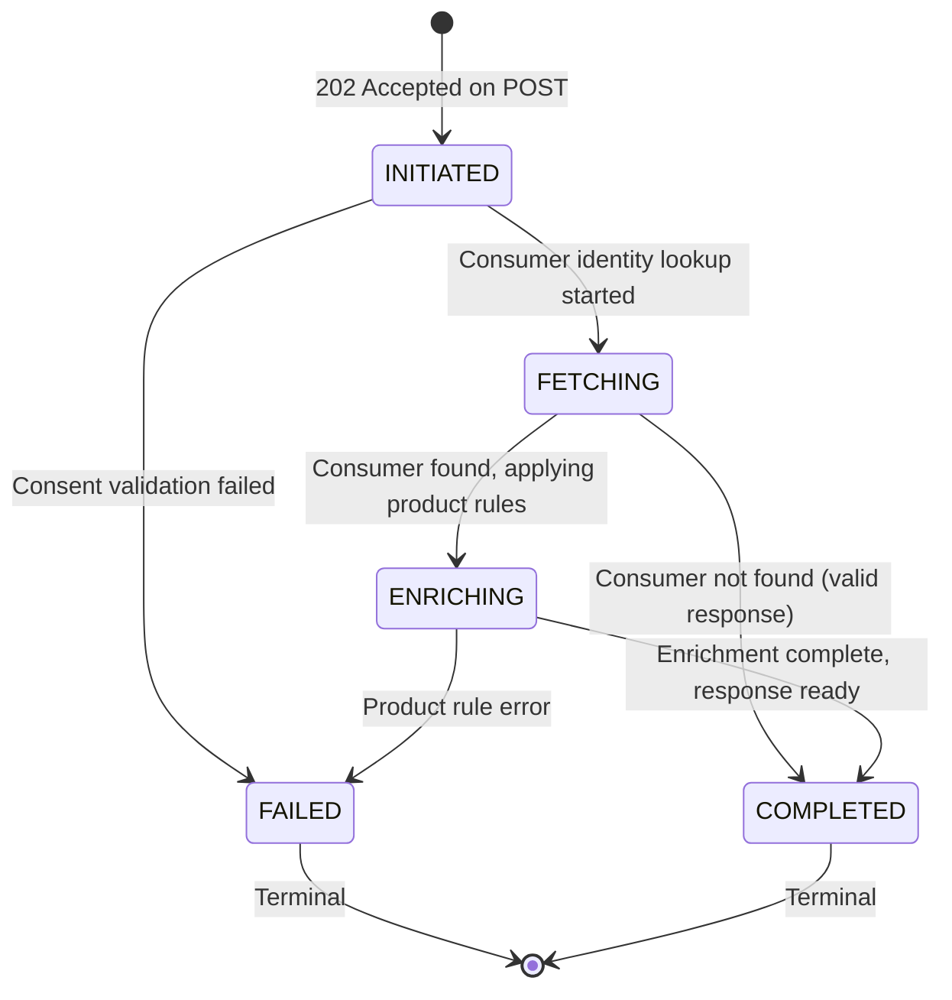

# EPIC-16 — Enquiry API (API-First)

> **Epic Code:** ENQ | **Story Range:** ENQ-US-001–007
> **Owner:** Platform Engineering / API Team | **Priority:** P0
> **Implementation Status:** ❌ Mostly Missing (ENQ-US-001 Implemented)
> **Note:** This is an **API-first external-facing platform API**. No UI screens. Full extended template applied.

---

## 1. Executive Summary

### Purpose
The Enquiry API is the credit data retrieval gateway of the HCB platform. Subscriber institutions use this API to request credit bureau data for a specific consumer, referencing a data product and providing a consent artefact. The API validates the consent, retrieves and enriches the consumer's credit profile, applies product-level scoring rules, and returns a structured credit response. This is the commercial value delivery mechanism of the bureau.

### Business Value
- Instant credit decisions enable real-time loan origination by subscriber institutions
- Product-scoped responses ensure subscribers only receive data they have entitlement to
- Consent validation enforces AA (Account Aggregator) compliance
- Every enquiry creates an auditable footprint for regulatory purposes
- Rate limiting prevents unfair usage and protects infrastructure

### Key Capabilities
1. API key authentication with subscriber institution resolution
2. Credit enquiry submission with consumer identity and product reference
3. AA consent reference validation before data retrieval
4. Consumer credit profile fetch via hash-based identity matching
5. Product-level scoring and field enrichment
6. Enquiry lifecycle: INITIATED → FETCHING → ENRICHING → COMPLETED | FAILED
7. Rate limiting per API key
8. Full audit logging of every enquiry

---

## 2. Scope

### In Scope
- Real-time credit enquiry for a single consumer
- API key authentication (subscriber institution)
- Consent reference validation
- Consumer lookup by hashed identity
- Product entitlement check
- Credit profile aggregation from tradelines
- Product-rule based scoring and field selection
- Enquiry lifecycle management
- Rate limiting
- Audit logging

### Out of Scope
- Bulk/batch enquiries
- Consumer-initiated self-enquiry portal
- Negative data sharing (blacklist-only responses)
- Cross-bureau enquiry federation

---

## 3. Personas

| Persona | Role | Needs |
|---------|------|-------|
| Subscriber Institution System | API_USER (API key, subscriber) | Request consumer credit data |
| HCB Platform | Internal | Validate, fetch, enrich, respond |
| Bureau Administrator | BUREAU_ADMIN | Monitor enquiry volume and failures |
| Compliance Officer | BUREAU_ADMIN | Audit trail of all credit enquiries |

---

## 4. API Contract Design

### Endpoint Structure

| Endpoint | Method | Purpose |
|----------|--------|---------|
| `POST /api/v1/enquiries` | POST | Submit a credit enquiry request |
| `GET /api/v1/enquiries/:enquiryId/status` | GET | Poll enquiry processing status |
| `GET /api/v1/enquiries/:enquiryId/response` | GET | Retrieve completed enquiry response |

### Authentication
- **Method:** `X-API-Key` header (subscriber institution API key)
- **Active + Subscriber check:** Institution must be `active` and `is_subscriber=true`
- **Product subscription check:** Institution must have active subscription to requested product
- **No Bearer JWT** — machine-to-machine only

### Idempotency
- `Idempotency-Key` header: duplicate enquiries within 1 hour return original response
- Hard enquiries (`enquiry_type=HARD`) create a **credit footprint** — idempotency prevents duplicate footprints
- Soft enquiries (`enquiry_type=SOFT`): no footprint, idempotency less critical

### Rate Limits
- Default: 500 enquiries/minute per API key
- Override: `institutions.api_access_json.enquiryRateLimitOverride`
- Hard enquiry daily limit: 10,000 per institution (configurable)

---

## 5. Request Schema

```json
{
  "productId": 1,
  "enquiryType": "HARD",
  "enquiryPurpose": "loan_origination",
  "consentReference": "AA-CONSENT-REF-12345",
  "consumerIdentity": {
    "nationalIdType": "PAN",
    "nationalId": "ABCDE1234F",
    "phone": "+254700000001",
    "email": "consumer@example.com"
  },
  "requestedFields": ["credit_score", "total_exposure", "dpd_band", "active_accounts"],
  "idempotencyKey": "FIN-ENQ-2026-001"
}
```

### Field Definitions

| Field | Type | Required | Description |
|-------|------|----------|-------------|
| `productId` | integer | Yes | Target data product |
| `enquiryType` | enum: HARD, SOFT | Yes | HARD creates footprint |
| `enquiryPurpose` | string | Yes | Regulatory traceability |
| `consentReference` | string | Conditional | Required if institution has consent_config |
| `consumerIdentity` | object | Yes | Consumer identification |
| `requestedFields` | string[] | No | Field subset; defaults to all product fields |
| `idempotencyKey` | string | No | Duplicate prevention |

---

## 6. Response Design

### Success Response (202 Accepted — Async)

```json
{
  "enquiryId": "ENQ-2026-031-001",
  "enquiryStatus": "INITIATED",
  "receivedAt": "2026-03-31T14:00:00Z",
  "estimatedResponseTime": "PT5S"
}
```

### Completed Response (`GET /enquiries/:id/response`)

```json
{
  "enquiryId": "ENQ-2026-031-001",
  "enquiryStatus": "COMPLETED",
  "enquiryType": "HARD",
  "consumerFound": true,
  "creditScore": 720,
  "creditBand": "GOOD",
  "totalExposure": 850000.00,
  "activeAccounts": 3,
  "closedAccounts": 1,
  "delinquentAccounts": 0,
  "worstDpdDays": 0,
  "dpdBand": "0",
  "enquiryFootprint": {
    "totalEnquiries12Months": 4,
    "hardEnquiries6Months": 2
  },
  "productResponse": {
    "productId": 1,
    "productName": "Standard Credit Report",
    "fields": {
      "credit_score": 720,
      "total_exposure": 850000.00,
      "dpd_band": "0",
      "active_accounts": 3
    }
  },
  "consumerMetadata": {
    "reportingInstitutionCount": 3,
    "oldestTradeline": "2019-04-01",
    "newestTradeline": "2026-03-01"
  },
  "completedAt": "2026-03-31T14:00:03Z",
  "footprintCreated": true
}
```

### Consumer Not Found Response

```json
{
  "enquiryId": "ENQ-2026-031-002",
  "enquiryStatus": "COMPLETED",
  "consumerFound": false,
  "creditScore": null,
  "message": "No credit history found for the provided consumer identity"
}
```

### Error Codes

| HTTP | Error Code | Description |
|------|------------|-------------|
| 400 | `ERR_VALIDATION` | Required field missing |
| 401 | `ERR_API_KEY_INVALID` | Invalid API key |
| 403 | `ERR_INSTITUTION_NOT_SUBSCRIBER` | Institution not a subscriber |
| 403 | `ERR_INSTITUTION_NOT_ACTIVE` | Institution not active |
| 403 | `ERR_PRODUCT_NOT_SUBSCRIBED` | No active subscription to product |
| 403 | `ERR_CONSENT_INVALID` | Consent reference invalid or expired |
| 403 | `ERR_CONSENT_REQUIRED` | Consent required but not provided |
| 429 | `ERR_RATE_LIMITED` | Rate limit exceeded |
| 409 | `ERR_DUPLICATE_ENQUIRY` | Same enquiry within idempotency window |

---

## 7. Status / Lifecycle State Model

### Enquiry Lifecycle



### State Definitions

| State | Description | Next States |
|-------|-------------|-------------|
| `INITIATED` | Request accepted, consent being validated | `FETCHING`, `FAILED` |
| `FETCHING` | Consumer identity being looked up | `ENRICHING`, `COMPLETED` |
| `ENRICHING` | Product rules and scoring being applied | `COMPLETED`, `FAILED` |
| `COMPLETED` | Enquiry complete, response ready | Terminal |
| `FAILED` | Enquiry failed (consent, identity, product) | Terminal |

---

## 8. Data Processing Pipeline

```
POST /api/v1/enquiries
    ↓
[INTAKE] Validate API key → Resolve subscriber institution → Active + subscriber check
    ↓
[PRODUCT CHECK] Verify institution has active subscription to productId
    ↓
[IDEMPOTENCY] Check idempotency key / duplicate in last 1h
    ↓
[202 ACCEPTED] Return enquiryId immediately; status = INITIATED
    ↓
[ASYNC PROCESSING]
    ↓
[CONSENT VALIDATION]
  If consent_config enabled: validate consentReference against AA platform
  If invalid: status = FAILED (ERR_CONSENT_INVALID)
    ↓
[CONSUMER LOOKUP]
  Hash nationalId → SHA-256
  SELECT consumers WHERE national_id_hash = ? AND national_id_type = ?
  If not found: status = COMPLETED with consumerFound = false
    ↓
[CREDIT PROFILE FETCH]
  SELECT tradelines WHERE consumer_id = ? (filtered by product's coverage_scope)
  Apply consortium/network data sharing rules based on product config
    ↓
[PRODUCT ENRICHMENT]
  Apply product packet rules (raw fields → selected; derived fields → calculated)
  Calculate credit_score, dpd_band, total_exposure
    ↓
[FOOTPRINT CREATION] (HARD enquiries only)
  INSERT enquiries record (creates credit footprint visible in future enquiries)
    ↓
[RESPONSE ASSEMBLY]
  Build structured response per product field configuration
  Filter to requestedFields if provided
    ↓
[AUDIT LOG]
  INSERT audit_logs (ENQUIRY_COMPLETED or ENQUIRY_FAILED)
  UPDATE enquiries record (status, completedAt, responseTimeMs)
    ↓
[STATUS UPDATE] status = COMPLETED
```

---

## 9. Stories

---

### ENQ-US-001 — Authenticate Enquiry with API Key

#### 1. Description
> As a subscriber institution system,
> I want to authenticate each enquiry request using my API key,
> So that my enquiry is authorised and attributed to my institution.

#### 2. Status: ✅ Implemented

API key authentication infrastructure exists in Spring. Same `X-API-Key` mechanism as DSAPI.

#### 3. Additional Checks for Enquiry

Beyond API key validation:
1. Institution must be `is_subscriber=true`
2. Institution must have active subscription to requested `productId`

```sql
SELECT ps.subscription_status
FROM product_subscriptions ps
WHERE ps.institution_id = ? AND ps.product_id = ?
  AND ps.subscription_status = 'active';
```

#### 4. Definition of Done
- [ ] X-API-Key resolved to subscriber institution
- [ ] `is_subscriber=true` check applied
- [ ] Product subscription validated before processing
- [ ] 403 ERR_PRODUCT_NOT_SUBSCRIBED if no active subscription

---

### ENQ-US-002 — Submit a Credit Enquiry Request

#### 1. Description
> As a subscriber institution,
> I want to submit a consumer identity and product reference,
> So that I receive a credit decision for real-time loan origination.

#### 2. Status: ❌ Missing

#### 3. Example Request

```http
POST /api/v1/enquiries HTTP/1.1
Host: api.hcb.example.com
X-API-Key: hcb_sub_key_xxxxxxxx
Content-Type: application/json
Idempotency-Key: FIN-ENQ-2026-001

{
  "productId": 1,
  "enquiryType": "HARD",
  "enquiryPurpose": "loan_origination",
  "consentReference": "AA-CONSENT-REF-12345",
  "consumerIdentity": {
    "nationalIdType": "PAN",
    "nationalId": "ABCDE1234F"
  }
}
```

#### 4. Response (202)

```json
{
  "enquiryId": "ENQ-2026-031-001",
  "enquiryStatus": "INITIATED",
  "receivedAt": "2026-03-31T14:00:00Z"
}
```

#### 5. Definition of Done
- [ ] POST /api/v1/enquiries accepts valid payload
- [ ] Returns 202 with enquiryId
- [ ] Inserts initial enquiries record with INITIATED status

---

### ENQ-US-003 — Validate Consent Reference

#### 1. Description
> As the API platform,
> I want to verify the consent reference before fetching consumer data,
> So that Account Aggregator compliance is enforced.

#### 2. Status: ❌ Missing

#### 3. Consent Validation Logic

```
If institution.consent_config.require_consent = true:
  If consentReference is null/empty → 403 ERR_CONSENT_REQUIRED
  Validate consentReference: check against AA platform (external) or local consent artefact store
  If invalid / expired → 403 ERR_CONSENT_INVALID
  If valid → proceed to consumer lookup

If institution.consent_config.require_consent = false:
  Skip consent validation (institutional consent agreements in place)
```

#### 4. Definition of Done
- [ ] Consent check applied based on institution's consent_config
- [ ] Invalid consent returns 403 with clear error message
- [ ] Consent validation logged in audit_logs

---

### ENQ-US-004 — Fetch Consumer Credit Profile

#### 1. Description
> As the API platform,
> I want to look up the consumer by hashed identity and return their credit profile,
> So that the enquiry is fulfilled with accurate bureau data.

#### 2. Status: ❌ Missing

#### 3. Consumer Lookup Query

```sql
-- Hash consumer identity
DECLARE nationalIdHash = SHA-256(UPPER(TRIM(nationalId)));

-- Look up consumer
SELECT c.id, c.national_id_hash, c.national_id_type
FROM consumers c
WHERE c.national_id_hash = ? AND c.national_id_type = ?
LIMIT 1;

-- If found, fetch tradelines within coverage scope
SELECT t.* FROM tradelines t
WHERE t.consumer_id = ?
  AND (
    -- SELF: only requesting institution's tradelines
    -- CONSORTIUM: requesting institution's consortium members' tradelines
    -- NETWORK: all active institutions' tradelines
    <coverage_scope_filter>
  )
ORDER BY t.reporting_period DESC;
```

#### 4. Definition of Done
- [ ] Consumer looked up by hashed national_id
- [ ] Consumer not found returns COMPLETED with consumerFound=false
- [ ] Tradelines fetched according to product's coverage_scope

---

### ENQ-US-005 — Enrich Enquiry Response with Product Rules

#### 1. Description
> As the API platform,
> I want to apply product-level rules and scoring to the credit profile,
> So that the response contains exactly the data the subscriber has entitlement to.

#### 2. Status: ❌ Missing

#### 3. Enrichment Logic

```
Given: consumer tradelines + product configuration (packetIds, packetConfigs)

1. Calculate derived fields:
   credit_score = scoring_model(tradelines)
   total_exposure = SUM(outstanding_balance WHERE account_status != 'CLOSED')
   active_accounts = COUNT(*) WHERE account_status = 'ACTIVE'
   dpd_band = bucket(MAX(dpd_days))

2. Filter raw fields to product's configured rawFields per packet

3. Apply data visibility rules (full/masked_pii/derived) based on product config

4. Restrict to requestedFields if provided in enquiry request
```

#### 4. Definition of Done
- [ ] Derived fields calculated correctly from tradelines
- [ ] Product field selection filters response correctly
- [ ] Data visibility rules applied

---

### ENQ-US-006 — Enquiry Lifecycle States

#### 1. Description
> As a subscriber institution,
> I want to poll for my enquiry's status and retrieve the completed response,
> So that I can handle async processing gracefully.

#### 2. Status: ❌ Missing

#### 3. Planned API

**Status poll:** `GET /api/v1/enquiries/:enquiryId/status`

**Response:**
```json
{
  "enquiryId": "ENQ-2026-031-001",
  "enquiryStatus": "COMPLETED",
  "completedAt": "2026-03-31T14:00:03Z",
  "responseTimeMs": 2847
}
```

**Full response:** `GET /api/v1/enquiries/:enquiryId/response`

Returns full credit response (see §6 Response Design).

#### 4. Definition of Done
- [ ] Status poll returns current lifecycle state
- [ ] Response retrieval available only when status = COMPLETED
- [ ] 404 if enquiryId not found

---

### ENQ-US-007 — Rate Limiting and Audit Logging

#### 1. Description
> As the API platform,
> I want to enforce per-key rate limits and log every enquiry with full context,
> So that the platform is protected and regulatory traceability is maintained.

#### 2. Status: ❌ Missing

#### 3. Audit Log Requirements

Every enquiry must write to `audit_logs`:
- `action_type = 'ENQUIRY_COMPLETED'` or `'ENQUIRY_FAILED'`
- `entity_type = 'enquiry'`
- `entity_id = enquiryId`
- `description = "Enquiry for consumer [nationalIdHash] via product [productName] by institution [institutionName]"`
- `audit_outcome = 'success' | 'failure'`

Additionally, every enquiry is recorded in the `enquiries` table (the credit footprint for HARD enquiries).

#### 4. Rate Limiting

Default: 500 enquiries/minute per API key
Override per institution in `api_access_json.enquiryRateLimitOverride`
Daily hard enquiry limit: 10,000 per institution

#### 5. Definition of Done
- [ ] Every enquiry (success or failure) written to audit_logs
- [ ] HARD enquiries write to enquiries table (credit footprint)
- [ ] Rate limit headers included in all responses
- [ ] 429 includes Retry-After header

---

## 10. Scalability & Performance

| Metric | Target |
|--------|--------|
| Enquiry API response time (P95) | < 500ms (SOFT) / < 2s (HARD) |
| Enquiry throughput | 5,000 enquiries/min per bureau |
| Concurrent connections | 500 |
| Consumer lookup latency | < 10ms (indexed national_id_hash) |

---

## 11. Observability

| Signal | Implementation |
|--------|---------------|
| Logs | Every enquiry: enquiryId, institution, product, consumer hash, status, duration |
| Metrics | Enquiry rate, hit rate (consumerFound%), latency, failure rate by reason |
| Alerts | `failure_rate > 5%` fires alert; `consent_failure_rate > 10%` fires HIGH alert |
| Dashboard | Enquiry log in EPIC-09 monitoring; volume chart in EPIC-13 |

---

## 12. Security & Compliance

| Requirement | Implementation |
|-------------|---------------|
| Consumer identity in transit | TLS 1.3, never logged in plain text |
| Consumer identity at rest | Only SHA-256 hash stored — original not retained |
| Credit footprint | HARD enquiries visible to consumer in future self-enquiries |
| Consent audit | Consent reference stored in enquiries record for regulatory evidence |
| Data minimisation | Only fields in product's packetConfigs.rawFields returned |

---

## 13. Epic API Summary

| Endpoint | Method | Auth | Description | Status |
|----------|--------|------|-------------|--------|
| `POST /api/v1/enquiries` | POST | X-API-Key (subscriber) | Submit enquiry (202) | ❌ Missing |
| `GET /api/v1/enquiries/:id/status` | GET | X-API-Key | Poll enquiry status | ❌ Missing |
| `GET /api/v1/enquiries/:id/response` | GET | X-API-Key | Retrieve completed response | ❌ Missing |

---

## 14. Database Summary

| Table | Key Fields | Notes |
|-------|------------|-------|
| `enquiries` | `id`, `institution_id`, `product_id`, `enquiry_type`, `enquiry_status`, `consent_reference`, `consumer_national_id_hash` | Credit enquiry log + footprint |
| `consumers` | `national_id_hash`, `national_id_type` | Consumer registry |
| `tradelines` | `consumer_id`, `facility_type`, `outstanding_balance`, `dpd_days` | Credit history |
| `credit_profiles` | `consumer_id`, `credit_score`, `total_exposure` | Aggregated profile |
| `products` | `id`, `coverage_scope`, `packet_ids_json`, `packet_configs_json` | Product config |
| `product_subscriptions` | `institution_id`, `product_id` | Entitlement |

---

## 15. Gap Analysis

| Gap | Story | Severity |
|-----|-------|----------|
| `POST /api/v1/enquiries` not implemented in Spring | ENQ-US-002 | Critical |
| Consent validation not implemented | ENQ-US-003 | Critical |
| Consumer credit profile fetch not implemented | ENQ-US-004 | Critical |
| Product enrichment engine not implemented | ENQ-US-005 | Critical |
| Status poll and response retrieval missing | ENQ-US-006 | High |
| Rate limiting and audit logging missing | ENQ-US-007 | High |

---

## 16. Execution Roadmap

| Phase | Stories | Description |
|-------|---------|-------------|
| Phase 1 | ENQ-US-001, 002 | Implement submit endpoint with auth and 202 |
| Phase 2 | ENQ-US-003, 004 | Implement consent validation + consumer lookup |
| Phase 3 | ENQ-US-005, 006 | Implement product enrichment + status/response retrieval |
| Phase 4 | ENQ-US-007 | Rate limiting, audit, regulatory reports |
