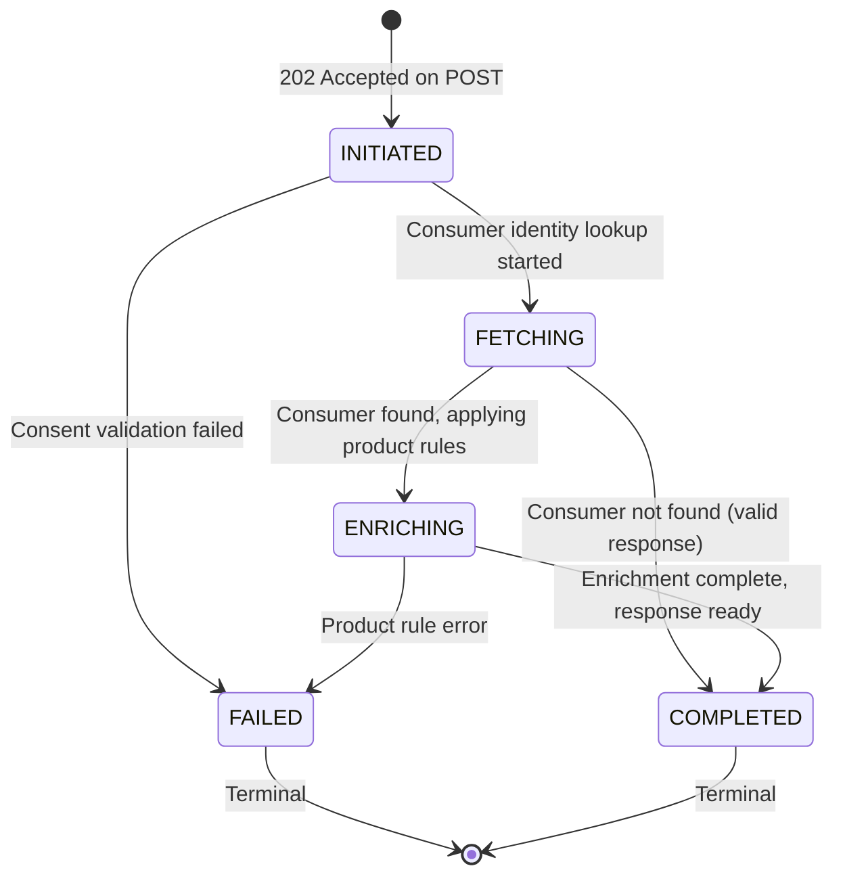

# EPIC-16 — Enquiry API (API-First)

> **Epic Code:** ENQ | **Story Range:** ENQ-US-001–007
> **Owner:** Platform Engineering / API Team | **Priority:** P0
> **Implementation Status:** ❌ Mostly Missing (ENQ-US-001 Implemented)
> **Note:** This is an **API-first external-facing platform API**. No UI screens. Full extended template applied.

---

## 1. Executive Summary

### Purpose
The Enquiry API is the alternate data retrieval gateway of the HCB platform. Subscriber institutions use this API to request alternate data for a specific consumer, referencing a data product and providing a consent artefact. The API validates the consent, retrieves and enriches the consumer's customer profile, applies product-level scoring rules, and returns a structured data response. This is the commercial value delivery mechanism of the HCB platform.

### Business Value
- Instant data-driven decisions enable real-time loan origination by subscriber institutions
- Product-scoped responses ensure subscribers only receive data they have entitlement to
- Consent validation enforces AA (Account Aggregator) compliance
- Every enquiry creates an auditable footprint for regulatory purposes
- Rate limiting prevents unfair usage and protects infrastructure

### Key Capabilities
1. API key authentication with subscriber institution resolution
2. Data enquiry submission with consumer identity and product reference
3. AA consent reference validation before data retrieval
4. Consumer customer profile fetch via hash-based identity matching
5. Product-level scoring and field enrichment
6. Enquiry lifecycle: INITIATED → FETCHING → ENRICHING → COMPLETED | FAILED
7. Rate limiting per API key
8. Full audit logging of every enquiry

---

## 2. Scope

### In Scope
- Real-time data enquiry for a single consumer
- API key authentication (subscriber institution)
- Consent reference validation
- Consumer lookup by hashed identity
- Product entitlement check
- Customer profile aggregation from data records
- Product-rule based scoring and field selection
- Enquiry lifecycle management
- Rate limiting
- Audit logging

### Out of Scope
- Bulk/batch enquiries
- Consumer-initiated self-enquiry portal
- Negative data sharing (blacklist-only responses)
- Cross-platform enquiry federation

---

## 3. Personas

| Persona | Role | Needs |
|---------|------|-------|
| Subscriber Institution System | API_USER (API key, subscriber) | Request consumer alternate data |
| HCB Platform | Internal | Validate, fetch, enrich, respond |
| HCB Administrator | HCB_ADMIN | Monitor enquiry volume and failures |
| Compliance Officer | HCB_ADMIN | Audit trail of all credit enquiries |

---

## 4. API Contract Design

### Endpoint Structure

| Endpoint | Method | Purpose |
|----------|--------|---------|
| `POST /api/v1/enquiries` | POST | Submit a data enquiry request |
| `GET /api/v1/enquiries/:enquiryId/status` | GET | Poll enquiry processing status |
| `GET /api/v1/enquiries/:enquiryId/response` | GET | Retrieve completed enquiry response |

### Authentication
- **Method:** `X-API-Key` header (subscriber institution API key)
- **Active + Subscriber check:** Institution must be `active` and `is_subscriber=true`
- **Product subscription check:** Institution must have active subscription to requested product
- **No Bearer JWT** — machine-to-machine only

### Idempotency
- `Idempotency-Key` header: duplicate enquiries within 1 hour return original response
- Hard enquiries (`enquiry_type=HARD`) create a **enquiry footprint** — idempotency prevents duplicate footprints
- Soft enquiries (`enquiry_type=SOFT`): no footprint, idempotency less critical

### Rate Limits
- Default: 500 enquiries/minute per API key
- Override: `institutions.api_access_json.enquiryRateLimitOverride`
- Hard enquiry daily limit: 10,000 per institution (configurable)

---

## 5. Request Schema

```json
{
  "productId": 1,
  "enquiryType": "HARD",
  "enquiryPurpose": "loan_origination",
  "consentReference": "AA-CONSENT-REF-12345",
  "consumerIdentity": {
    "nationalIdType": "PAN",
    "nationalId": "ABCDE1234F",
    "phone": "+254700000001",
    "email": "consumer@example.com"
  },
  "requestedFields": ["alternate_data_score", "total_exposure", "dpd_band", "active_accounts"],
  "idempotencyKey": "FIN-ENQ-2026-001",
  "memberId": "CBS-MEM-1001"
}
```

### Field Definitions

| Field | Type | Required | Description |
|-------|------|----------|-------------|
| `productId` | integer | Yes | Target data product |
| `enquiryType` | enum: HARD, SOFT | Yes | HARD creates footprint |
| `enquiryPurpose` | string | Yes | Regulatory traceability |
| `consentReference` | string | Conditional | Required if institution has consent_config |
| `consumerIdentity` | object | Yes | Consumer identification |
| `requestedFields` | string[] | No | Field subset; defaults to all product fields |
| `idempotencyKey` | string | No | Duplicate prevention |
| `memberId` | string | No | Optional external **CBS member id** (as configured on the consortium in Admin) for attribution and audit when the subscriber’s enquiry is tied to a Core Banking member record. Omitted when not applicable. Persisted on the enquiry record when the Enquiry API implementation lands. |

---

## 6. Response Design

### Success Response (202 Accepted — Async)

```json
{
  "enquiryId": "ENQ-2026-031-001",
  "enquiryStatus": "INITIATED",
  "receivedAt": "2026-03-31T14:00:00Z",
  "estimatedResponseTime": "PT5S"
}
```

### Completed Response (`GET /enquiries/:id/response`)

```json
{
  "enquiryId": "ENQ-2026-031-001",
  "enquiryStatus": "COMPLETED",
  "enquiryType": "HARD",
  "consumerFound": true,
  "alternateDataScore": 720,
  "creditBand": "GOOD",
  "totalExposure": 850000.00,
  "activeAccounts": 3,
  "closedAccounts": 1,
  "delinquentAccounts": 0,
  "worstDpdDays": 0,
  "dpdBand": "0",
  "enquiryFootprint": {
    "totalEnquiries12Months": 4,
    "hardEnquiries6Months": 2
  },
  "productResponse": {
    "productId": 1,
    "productName": "Standard Alternate Data Report",
    "fields": {
      "alternate_data_score": 720,
      "total_exposure": 850000.00,
      "dpd_band": "0",
      "active_accounts": 3
    }
  },
  "consumerMetadata": {
    "reportingInstitutionCount": 3,
    "oldestData record": "2019-04-01",
    "newestData record": "2026-03-01"
  },
  "completedAt": "2026-03-31T14:00:03Z",
  "footprintCreated": true
}
```

### Consumer Not Found Response

```json
{
  "enquiryId": "ENQ-2026-031-002",
  "enquiryStatus": "COMPLETED",
  "consumerFound": false,
  "alternateDataScore": null,
  "message": "No customer history found for the provided consumer identity"
}
```

### Error Codes

| HTTP | Error Code | Description |
|------|------------|-------------|
| 400 | `ERR_VALIDATION` | Required field missing |
| 401 | `ERR_API_KEY_INVALID` | Invalid API key |
| 403 | `ERR_INSTITUTION_NOT_SUBSCRIBER` | Institution not a subscriber |
| 403 | `ERR_INSTITUTION_NOT_ACTIVE` | Institution not active |
| 403 | `ERR_PRODUCT_NOT_SUBSCRIBED` | No active subscription to product |
| 403 | `ERR_CONSENT_INVALID` | Consent reference invalid or expired |
| 403 | `ERR_CONSENT_REQUIRED` | Consent required but not provided |
| 429 | `ERR_RATE_LIMITED` | Rate limit exceeded |
| 409 | `ERR_DUPLICATE_ENQUIRY` | Same enquiry within idempotency window |

---

## 7. Status / Lifecycle State Model

### Enquiry Lifecycle


```mermaid
stateDiagram-v2
    [*] --> INITIATED : 202 Accepted on POST
    INITIATED --> FETCHING : Consumer identity lookup started
    INITIATED --> FAILED : Consent validation failed
    FETCHING --> ENRICHING : Consumer found, applying product rules
    FETCHING --> COMPLETED : Consumer not found (valid response)
    ENRICHING --> COMPLETED : Enrichment complete, response ready
    ENRICHING --> FAILED : Product rule error
    FAILED --> [*] : Terminal
    COMPLETED --> [*] : Terminal
```

### State Definitions

| State | Description | Next States |
|-------|-------------|-------------|
| `INITIATED` | Request accepted, consent being validated | `FETCHING`, `FAILED` |
| `FETCHING` | Consumer identity being looked up | `ENRICHING`, `COMPLETED` |
| `ENRICHING` | Product rules and scoring being applied | `COMPLETED`, `FAILED` |
| `COMPLETED` | Enquiry complete, response ready | Terminal |
| `FAILED` | Enquiry failed (consent, identity, product) | Terminal |

---

## 8. Data Processing Pipeline (Enterprise 7-Stage Architecture)

This architectural flow standardizes Enquiry Processing into 7 distinct stages for the HCB alternate data API. It ensures enterprise-grade observability by adopting system logging standards (`Sys OK/KO`, `Biz OK/KO`, `Log UID`). The API operates synchronously to return real-time alternate data responses.

```text
Request → Auth → Validation → Identity Resolution → Data Fetch → Processing → Response
```

### Stage 1: Request Intake

**a. Objective**
Safely receive the incoming data enquiry payload, allocate tracking identifiers, and protect the platform from volumetric attacks.

**b. Input**
- Raw HTTP `POST /api/v1/enquiries` payload.
- HTTP Headers (including `X-API-Key`).

**c. Processing Logic**
1. Intercept the incoming request at the API Gateway.
2. Generate a unique `Log UID` (Transaction Reference Number) for end-to-end traceability.
3. Apply preliminary rate-limiting checks.
4. Route the request to the Inquiry Processing engine.

**d. Key Validations / Rules**
- API Key presence.
- Gateway rate limit adherence (e.g., max requests per minute).

**e. Output**
- Request payload with attached `Log UID`.

**f. Failure Scenarios**
- **System failure**: Gateway timeout (`Sys KO`).
- **Business validation failure**: Rate limit exceeded (`Biz KO` - 429 Too Many Requests).

**g. Logging / Observability Mapping**
- `Action`: Gateway.ReceiveRequest
- `Log UID`: `[Allocated_UID]`
- `Status`: `Sys OK` (Payload accepted)

---

### Stage 2: Authentication & Access Control

**a. Objective**
Verify caller identity, resolve the subscriber institution, and confirm entitlement to the requested data product.

**b. Input**
- Request payload with `Log UID`.
- `X-API-Key`.
- Caller IP address.

**c. Processing Logic**
1. Validate credentials against the identity store.
2. Verify IP against the institution's whitelist.
3. Check `is_subscriber=true` and confirm the institution is active.
4. Validate the institution's subscription to the specified `productId`.

**d. Key Validations / Rules**
- API Key must be active and mapped to a valid institution.
- IP address must be whitelisted.
- Institution must have an active subscription for the requested product.

**e. Output**
- Authenticated Context object (Institution ID, Entitlements).

**f. Failure Scenarios**
- **System failure**: Auth service unreachable (`Sys KO`).
- **Business validation failure**: Invalid Key, IP not whitelisted, Product not subscribed (`Biz KO` - 401/403).

**g. Logging / Observability Mapping**
- `Action`: Auth.ValidateAccess
- `Log UID`: `[Allocated_UID]`
- `Status`: `Biz OK` (Access granted) or `Biz KO` (ERR_PRODUCT_NOT_SUBSCRIBED).

---

### Stage 3: Validation Layer (Structural + L1)

**a. Objective**
Ensure the payload is well-formed, contains all mandatory fields, and adheres to semantic business rules.

**b. Input**
- Raw Request Payload.
- Authenticated Context.

**c. Processing Logic**
1. Execute Structural Validation (JSON schema, data types).
2. Execute L1 Validation (Mandatory fields, length, specific formats).
3. Validate member institution mapping.
4. Validate idempotency constraints (duplicate check within time window).

**d. Key Validations / Rules**
- `consumerIdentity` fields must meet exact length and character sets.
- `productId` must exist.
- Consent reference must be provided if required.

**e. Output**
- Validated Enquiry Object.

**f. Failure Scenarios**
- **System failure**: Schema registry unavailable (`Sys KO`).
- **Business validation failure**: Missing mandatory fields, Malformed JSON, Idempotency conflict (`Biz KO` - 400 Bad Request / 409 Conflict).

**g. Logging / Observability Mapping**
- `Action`: Validation.PerformL1Checks
- `Log UID`: `[Allocated_UID]`
- `Status`: `Biz OK` (Validation passed) or `Biz KO` (ERR_VALIDATION).

---

### Stage 4: Identity Resolution

**a. Objective**
Unambiguously identify the consumer within the HCB platform and retrieve their unified cluster identifier.

**b. Input**
- Validated `consumerIdentity` object (e.g., National ID, Phone, Email).

**c. Processing Logic**
1. Pass identity attributes to the Identity Resolution module.
2. Hash primary identifiers (e.g., SHA-256 for National ID) to preserve PII during lookup.
3. Execute deterministic or probabilistic matching against the consumer registry.
4. Return the corresponding `Cluster ID`.

**d. Key Validations / Rules**
- Identifier format must be correct prior to hashing.
- Match confidence must meet the platform's minimum threshold.

**e. Output**
- `Cluster ID` mapping to the consumer's alternate data profile.

**f. Failure Scenarios**
- **System failure**: Identity resolution service timeout (`Sys KO`).
- **Business validation failure**: No Match Found (Transitions to Stage 7 with `consumerFound=false`) (`Biz OK`).

**g. Logging / Observability Mapping**
- `Action`: Identity.ResolveConsumer
- `Log UID`: `[Allocated_UID]`
- `Status`: `Biz OK` (Match found: Cluster ID retrieved) or `Biz OK` (No match).

---

### Stage 5: Data Retrieval

**a. Objective**
Fetch all relevant alternate data records linked to the consumer's Cluster ID.

**b. Input**
- `Cluster ID`.
- Product configuration (`coverage_scope`).

**c. Processing Logic**
1. Query the alternate data repositories using the `Cluster ID`.
2. Apply the product's `coverage_scope` (Self, Consortium, or Network-wide retrieval).
3. Aggregate the raw data records.

**d. Key Validations / Rules**
- Data fetched must strictly adhere to the institution's coverage entitlement.
- Apply reciprocity rules (e.g., exclude data from non-reciprocal contributors).

**e. Output**
- Unfiltered, aggregated raw data records.

**f. Failure Scenarios**
- **System failure**: Database timeout or connection failure (`Sys KO`).
- **Business validation failure**: Data retrieval blocked by reciprocity rules (`Biz OK` with empty subset).

**g. Logging / Observability Mapping**
- `Action`: DataStore.FetchRecords
- `Log UID`: `[Allocated_UID]`
- `Status`: `Sys OK` (Records fetched) or `Sys KO` (DB Error).

---

### Stage 6: Data Processing (Filtering, Masking, Unmasking)

**a. Objective**
Enrich the raw data, compute scores, and apply strict data visibility and masking rules to assemble the authorized product payload.

**b. Input**
- Unfiltered raw data records.
- Product `packetConfigs` and global masking rules.

**c. Processing Logic**
1. **Filtering**: Select only the fields authorized by the requested product.
2. **Enrichment**: Calculate derived fields (e.g., `alternate_data_score`, `total_exposure`).
3. **Data Masking**: Apply global platform masking rules (e.g., obscure PII, redact specific source origins).
4. **Data Unmasking**: Apply consortium-specific unmasking rules if the subscriber and data contributor are in the same trusted consortium.

**d. Key Validations / Rules**
- Scoring models must execute successfully.
- Final payload must never contain fields outside the product's defined packet.

**e. Output**
- Processed, scored, and masked alternate data profile.

**f. Failure Scenarios**
- **System failure**: Scoring engine failure (`Sys KO`).
- **Business validation failure**: Rule execution error due to missing dependent fields (`Biz KO`).

**g. Logging / Observability Mapping**
- `Action`: Enrichment.ApplyProductRules
- `Log UID`: `[Allocated_UID]`
- `Status`: `Sys OK` (Processing complete) or `Biz KO` (Scoring failed).

---

### Stage 7: Response Assembly (Synchronous API)

**a. Objective**
Construct the final API response, record the enquiry footprint, and return the data synchronously to the caller.

**b. Input**
- Processed alternate data profile.
- Enquiry metadata.

**c. Processing Logic**
1. Map the processed data into the final output JSON schema.
2. Write the enquiry footprint to the `enquiries` table (for HARD enquiries).
3. Commit the final state to `audit_logs` (`action_type = 'ENQUIRY_COMPLETED'`).
4. Return the HTTP 200 response with the payload.

**d. Key Validations / Rules**
- Response schema must perfectly match the API contract.
- Audit log commit must be durable.

**e. Output**
- Synchronous HTTP 200 / 201 Response to the subscriber.

**f. Failure Scenarios**
- **System failure**: Audit log commit failure (triggers alert, but response may still be sent) (`Sys KO`).
- **Business validation failure**: None at this stage.

**g. Logging / Observability Mapping**
- `Action`: Gateway.ReturnResponse
- `Log UID`: `[Allocated_UID]`
- `Status`: `Sys OK` (Response sent - Pipeline Completed).

---

## 9. Stories

---

### ENQ-US-001 — Authenticate Enquiry with API Key

#### 1. Description
> As a subscriber institution system,
> I want to authenticate each enquiry request using my API key,
> So that my enquiry is authorised and attributed to my institution.

#### 2. Status: ✅ Implemented

API key authentication infrastructure exists in Spring. Same `X-API-Key` mechanism as DSAPI.

#### 3. Additional Checks for Enquiry

Beyond API key validation:
1. Institution must be `is_subscriber=true`
2. Institution must have active subscription to requested `productId`

```sql
SELECT ps.subscription_status
FROM product_subscriptions ps
WHERE ps.institution_id = ? AND ps.product_id = ?
  AND ps.subscription_status = 'active';
```

#### 4. Definition of Done
- [ ] X-API-Key resolved to subscriber institution
- [ ] `is_subscriber=true` check applied
- [ ] Product subscription validated before processing
- [ ] 403 ERR_PRODUCT_NOT_SUBSCRIBED if no active subscription

---

### ENQ-US-002 — Submit a Data Enquiry Request

#### 1. Description
> As a subscriber institution,
> I want to submit a consumer identity and product reference,
> So that I receive a credit decision for real-time loan origination.

#### 2. Status: ❌ Missing

#### 3. Example Request

```http
POST /api/v1/enquiries HTTP/1.1
Host: api.hcb.example.com
X-API-Key: hcb_sub_key_xxxxxxxx
Content-Type: application/json
Idempotency-Key: FIN-ENQ-2026-001

{
  "productId": 1,
  "enquiryType": "HARD",
  "enquiryPurpose": "loan_origination",
  "consentReference": "AA-CONSENT-REF-12345",
  "consumerIdentity": {
    "nationalIdType": "PAN",
    "nationalId": "ABCDE1234F"
  },
  "memberId": "CBS-MEM-1001"
}
```

#### 4. Response (202)

```json
{
  "enquiryId": "ENQ-2026-031-001",
  "enquiryStatus": "INITIATED",
  "receivedAt": "2026-03-31T14:00:00Z"
}
```

#### 5. Definition of Done
- [ ] POST /api/v1/enquiries accepts valid payload
- [ ] Returns 202 with enquiryId
- [ ] Inserts initial enquiries record with INITIATED status
- [ ] Optional `memberId` accepted when present; omitted when absent; stored for audit when implementation persists enquiry rows

#### 6. Test Cases (memberId)

| Test ID | Scenario | Steps | Expected |
|---------|----------|-------|----------|
| ENQ-TC-MID-01 | Omit memberId | POST valid payload without `memberId` | 202; enquiry processed; no memberId stored |
| ENQ-TC-MID-02 | Provide memberId | POST with `memberId` matching consortium CBS list | 202; value recorded on enquiry / audit for traceability (when API persists) |

---

### ENQ-US-003 — Validate Consent Reference

#### 1. Description
> As the API platform,
> I want to verify the consent reference before fetching consumer data,
> So that Account Aggregator compliance is enforced.

#### 2. Status: ❌ Missing

#### 3. Consent Validation Logic

```
If institution.consent_config.require_consent = true:
  If consentReference is null/empty → 403 ERR_CONSENT_REQUIRED
  Validate consentReference: check against AA platform (external) or local consent artefact store
  If invalid / expired → 403 ERR_CONSENT_INVALID
  If valid → proceed to consumer lookup

If institution.consent_config.require_consent = false:
  Skip consent validation (institutional consent agreements in place)
```

#### 4. Definition of Done
- [ ] Consent check applied based on institution's consent_config
- [ ] Invalid consent returns 403 with clear error message
- [ ] Consent validation logged in audit_logs

---

### ENQ-US-004 — Fetch Consumer Customer Profile

#### 1. Description
> As the API platform,
> I want to look up the consumer by hashed identity and return their customer profile,
> So that the enquiry is fulfilled with accurate alternate data.

#### 2. Status: ❌ Missing

#### 3. Consumer Lookup Query

```sql
-- Hash consumer identity
DECLARE nationalIdHash = SHA-256(UPPER(TRIM(nationalId)));

-- Look up consumer
SELECT c.id, c.national_id_hash, c.national_id_type
FROM consumers c
WHERE c.national_id_hash = ? AND c.national_id_type = ?
LIMIT 1;

-- If found, fetch data records within coverage scope
SELECT t.* FROM data records t
WHERE t.consumer_id = ?
  AND (
    -- SELF: only requesting institution's data records
    -- CONSORTIUM: requesting institution's consortium members' data records
    -- NETWORK: all active institutions' data records
    <coverage_scope_filter>
  )
ORDER BY t.reporting_period DESC;
```

#### 4. Definition of Done
- [ ] Consumer looked up by hashed national_id
- [ ] Consumer not found returns COMPLETED with consumerFound=false
- [ ] Data records fetched according to product's coverage_scope

---

### ENQ-US-005 — Enrich Enquiry Response with Product Rules

#### 1. Description
> As the API platform,
> I want to apply product-level rules and scoring to the customer profile,
> So that the response contains exactly the data the subscriber has entitlement to.

#### 2. Status: ❌ Missing

#### 3. Enrichment Logic

```
Given: consumer data records + product configuration (packetIds, packetConfigs)

1. Calculate derived fields:
   alternate_data_score = scoring_model(data records)
   total_exposure = SUM(outstanding_balance WHERE account_status != 'CLOSED')
   active_accounts = COUNT(*) WHERE account_status = 'ACTIVE'
   dpd_band = bucket(MAX(dpd_days))

2. Filter raw fields to product's configured rawFields per packet

3. Apply data visibility rules (full/masked_pii/derived) based on product config

4. Restrict to requestedFields if provided in enquiry request
```

#### 4. Definition of Done
- [ ] Derived fields calculated correctly from data records
- [ ] Product field selection filters response correctly
- [ ] Data visibility rules applied

---

### ENQ-US-006 — Enquiry Lifecycle States

#### 1. Description
> As a subscriber institution,
> I want to poll for my enquiry's status and retrieve the completed response,
> So that I can handle async processing gracefully.

#### 2. Status: ❌ Missing

#### 3. Planned API

**Status poll:** `GET /api/v1/enquiries/:enquiryId/status`

**Response:**
```json
{
  "enquiryId": "ENQ-2026-031-001",
  "enquiryStatus": "COMPLETED",
  "completedAt": "2026-03-31T14:00:03Z",
  "responseTimeMs": 2847
}
```

**Full response:** `GET /api/v1/enquiries/:enquiryId/response`

Returns full data response (see §6 Response Design).

#### 4. Definition of Done
- [ ] Status poll returns current lifecycle state
- [ ] Response retrieval available only when status = COMPLETED
- [ ] 404 if enquiryId not found

---

### ENQ-US-007 — Rate Limiting and Audit Logging

#### 1. Description
> As the API platform,
> I want to enforce per-key rate limits and log every enquiry with full context,
> So that the platform is protected and regulatory traceability is maintained.

#### 2. Status: ❌ Missing

#### 3. Audit Log Requirements

Every enquiry must write to `audit_logs`:
- `action_type = 'ENQUIRY_COMPLETED'` or `'ENQUIRY_FAILED'`
- `entity_type = 'enquiry'`
- `entity_id = enquiryId`
- `description = "Enquiry for consumer [nationalIdHash] via product [productName] by institution [institutionName]"`
- `audit_outcome = 'success' | 'failure'`

Additionally, every enquiry is recorded in the `enquiries` table (the enquiry footprint for HARD enquiries).

#### 4. Rate Limiting

Default: 500 enquiries/minute per API key
Override per institution in `api_access_json.enquiryRateLimitOverride`
Daily hard enquiry limit: 10,000 per institution

#### 5. Definition of Done
- [ ] Every enquiry (success or failure) written to audit_logs
- [ ] HARD enquiries write to enquiries table (enquiry footprint)
- [ ] Rate limit headers included in all responses
- [ ] 429 includes Retry-After header

---

## 10. Scalability & Performance

| Metric | Target |
|--------|--------|
| Enquiry API response time (P95) | < 500ms (SOFT) / < 2s (HARD) |
| Enquiry throughput | 5,000 enquiries/min per platform |
| Concurrent connections | 500 |
| Consumer lookup latency | < 10ms (indexed national_id_hash) |

---

## 11. Observability

| Signal | Implementation |
|--------|---------------|
| Logs | Every enquiry: enquiryId, institution, product, consumer hash, status, duration |
| Metrics | Enquiry rate, hit rate (consumerFound%), latency, failure rate by reason |
| Alerts | `failure_rate > 5%` fires alert; `consent_failure_rate > 10%` fires HIGH alert |
| Dashboard | Enquiry log in EPIC-09 monitoring; volume chart in EPIC-13 |

---

## 12. Security & Compliance

| Requirement | Implementation |
|-------------|---------------|
| Consumer identity in transit | TLS 1.3, never logged in plain text |
| Consumer identity at rest | Only SHA-256 hash stored — original not retained |
| Credit footprint | HARD enquiries visible to consumer in future self-enquiries |
| Consent audit | Consent reference stored in enquiries record for regulatory evidence |
| Data minimisation | Only fields in product's packetConfigs.rawFields returned |

---

## 13. Epic API Summary

| Endpoint | Method | Auth | Description | Status |
|----------|--------|------|-------------|--------|
| `POST /api/v1/enquiries` | POST | X-API-Key (subscriber) | Submit enquiry (202) | ❌ Missing |
| `GET /api/v1/enquiries/:id/status` | GET | X-API-Key | Poll enquiry status | ❌ Missing |
| `GET /api/v1/enquiries/:id/response` | GET | X-API-Key | Retrieve completed response | ❌ Missing |

---

## 14. Database Summary

| Table | Key Fields | Notes |
|-------|------------|-------|
| `enquiries` | `id`, `institution_id`, `product_id`, `enquiry_type`, `enquiry_status`, `consent_reference`, `consumer_national_id_hash` | Data enquiry log + footprint |
| `consumers` | `national_id_hash`, `national_id_type` | Consumer registry |
| `data records` | `consumer_id`, `facility_type`, `outstanding_balance`, `dpd_days` | Credit history |
| `customer_profiles` | `consumer_id`, `alternate_data_score`, `total_exposure` | Aggregated profile |
| `products` | `id`, `coverage_scope`, `packet_ids_json`, `packet_configs_json` | Product config |
| `product_subscriptions` | `institution_id`, `product_id` | Entitlement |

---

## 15. Gap Analysis

| Gap | Story | Severity |
|-----|-------|----------|
| `POST /api/v1/enquiries` not implemented in Spring | ENQ-US-002 | Critical |
| Consent validation not implemented | ENQ-US-003 | Critical |
| Consumer customer profile fetch not implemented | ENQ-US-004 | Critical |
| Product enrichment engine not implemented | ENQ-US-005 | Critical |
| Status poll and response retrieval missing | ENQ-US-006 | High |
| Rate limiting and audit logging missing | ENQ-US-007 | High |

---

## 16. Execution Roadmap

| Phase | Stories | Description |
|-------|---------|-------------|
| Phase 1 | ENQ-US-001, 002 | Implement submit endpoint with auth and 202 |
| Phase 2 | ENQ-US-003, 004 | Implement consent validation + consumer lookup |
| Phase 3 | ENQ-US-005, 006 | Implement product enrichment + status/response retrieval |
| Phase 4 | ENQ-US-007 | Rate limiting, audit, regulatory reports |
