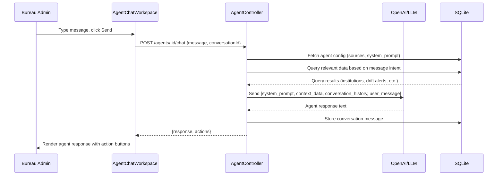

# EPIC-17 — Agents

> **Epic Code:** AGNT | **Story Range:** AGNT-US-001–008
> **Owner:** AI Platform Team | **Priority:** P1–P2
> **Implementation Status:** ⚠️ Partial (UI stubs exist; backend APIs entirely missing)
> **Gap Note:** All backend APIs for this epic are missing from Spring. This document captures both implemented UI stubs and the full intended design.

---

## 1. Executive Summary

### Purpose
The Agents module introduces an AI-powered operations layer to the HCB platform. Bureau operators and administrators interact with specialized AI agents through a natural language chat interface to perform complex bureau operations — analysing schemas, running simulations, processing bank statements, and configuring agent behaviour. The Agents tab is the "co-pilot" for bureau operations.

### Business Value
- Reduces manual effort for complex bureau operations through AI assistance
- Natural language interface lowers the barrier for non-technical bureau operators
- Bank statement analysis agent automates alternate data extraction
- Agent fleet monitoring gives operations teams visibility into AI workload
- Enquiry simulation agent allows pre-production product testing without technical expertise

### Key Capabilities
1. Agent catalogue landing page (list of available agents)
2. Agent detail page with description and capabilities
3. Chat workspace for natural language interaction with agents
4. Bureau operator workspace with specialised bureau tools
5. Bank statement upload and AI-powered extraction
6. Agent configuration (model, temperature, parameters)
7. Enquiry simulation integration via agent
8. Agent fleet monitoring

---

## 2. Scope

### In Scope
- Agent catalogue UI (`AgentsLandingPage.tsx`)
- Agent detail page (`AgentDetailPage.tsx`)
- Agent chat workspace (`AgentChatWorkspace.tsx`)
- Bureau operator workspace (`BureauOperatorWorkspace.tsx`)
- Sources configuration tab (`SourcesConfigTab.tsx`)
- Bank statement upload modal (`BankStatementUploadModal.tsx`)
- Agent configuration page (`AgentConfigurationPage.tsx`)
- Agent fleet monitoring card (`AgentFleetCard.tsx`)
- Enquiry simulation from agent context

### Out of Scope
- Agent model training or fine-tuning
- Third-party LLM provider selection (OpenAI assumed)
- Multi-agent orchestration (complex agent pipelines)
- Agent version control and rollback
- Customer-facing (consumer) agent interfaces

---

## 3. Personas

| Persona | Role | Needs |
|---------|------|-------|
| Bureau Administrator | BUREAU_ADMIN | Configure agents, monitor fleet |
| Bureau Operator | BUREAU_ADMIN | Use agents for daily operations |
| Data Analyst | ANALYST | Use schema mapper agent, run simulations |

---

## 4. Features Overview

| Feature | Description | Status |
|---------|-------------|--------|
| Agent Catalogue | List of available agents with descriptions | ❌ Missing API |
| Agent Detail | Agent description, capabilities, configuration | ❌ Missing API |
| Chat Workspace | Natural language interaction | ❌ Missing API |
| Bureau Operator Workspace | Specialised bureau tools | ⚠️ Stub UI |
| Bank Statement Upload | File upload for AI extraction | ⚠️ Stub UI |
| Agent Configuration | Model, temperature, system prompt | ⚠️ Stub UI |
| Enquiry Simulation from Agent | Run simulation in agent context | ⚠️ Partial |
| Agent Fleet Monitoring | Status and utilisation of all agents | ⚠️ Mock data |

---

## 5. Intended Agent Catalogue

| Agent ID | Agent Name | Purpose | Status |
|----------|-----------|---------|--------|
| `schema-mapper-agent` | Schema Mapper Agent | AI-assisted field mapping | ✅ (via EPIC-05) |
| `enquiry-simulation-agent` | Enquiry Simulation Agent | Test product configurations | ⚠️ Partial |
| `bank-statement-agent` | Bank Statement Analyser | Extract financial data from bank statements | ❌ Missing |
| `bureau-operator-agent` | Bureau Operator Assistant | General bureau operations assistant | ❌ Missing |
| `identity-resolution-agent` | Identity Resolution Agent | Consumer deduplication | ❌ (EPIC-18) |
| `data-quality-agent` | Data Quality Monitor | Governance and drift analysis | ❌ Missing |

---

## 6. Epic-Level UI Requirements

### Screens

| Screen | Path | Description |
|--------|------|-------------|
| Agents Landing | `/agents` | Agent catalogue grid |
| Agent Detail | `/agents/:agentId` | Agent info and launch button |
| Agent Chat | `/agents/:agentId/workspace` | Chat interface |
| Bureau Operator | `/agents/bureau-operator` | Operator tools panel |
| Sources Config | `/agents/:agentId/sources` | Data source configuration |
| Agent Config | `/agents/:agentId/configuration` | Model and parameter settings |
| Enquiry Simulation | `/agents/enquiry-simulation` | Simulation form (PROD-US-009) |

### Component Behavior
- **Agent cards:** Logo, name, description, status badge (`available`/`busy`/`unavailable`), "Launch" button
- **Chat workspace:** Message bubbles (user right, agent left), typing indicator, message history, context panel
- **Sources config:** Checkbox list of available data sources with descriptions
- **Agent config:** Slider for temperature, input for max_tokens, textarea for system_prompt
- **Fleet card:** Summary of agent utilisation (active/idle/busy), mock data in current implementation

---

## 7. Story-Centric Requirements

---

### AGNT-US-001 — View Agent Catalogue

#### 1. Description
> As a bureau administrator,
> I want to see all available agents with descriptions,
> So that I can select the right agent for my task.

#### 2. Status: ❌ Missing API

`AgentsLandingPage.tsx` exists but `GET /api/v1/agents` is not implemented in Spring.

#### 3. Planned API

`GET /api/v1/agents`

**Response:**
```json
[
  {
    "agentId": "bureau-operator-agent",
    "agentName": "Bureau Operator Assistant",
    "description": "AI assistant for general bureau operations: data quality queries, institution management, monitoring analysis",
    "capabilities": ["institution_management", "data_quality", "monitoring_analysis"],
    "agentStatus": "available",
    "iconUrl": "/assets/agents/bureau-operator.svg"
  },
  {
    "agentId": "bank-statement-agent",
    "agentName": "Bank Statement Analyser",
    "description": "Extracts income, obligations, and cash flow data from bank statement PDFs",
    "capabilities": ["bank_statement_extraction", "income_analysis"],
    "agentStatus": "available"
  }
]
```

#### 4. UI Requirements
- Grid layout (2-3 columns) of agent cards
- Each card: agent icon, name, description (truncated at 2 lines), capability tags, status badge, "Launch" CTA
- Filter by capability

#### 5. Definition of Done
- [ ] GET /api/v1/agents returns agent catalogue
- [ ] Agent cards rendered in grid layout
- [ ] Status badges reflect real agent availability

---

### AGNT-US-002 — Configure Agent Sources

#### 1. Description
> As a bureau administrator,
> I want to configure which data sources an agent has access to,
> So that it only operates on authorised data.

#### 2. Status: ❌ Missing API

`SourcesConfigTab.tsx` exists as a stub. Backend not implemented.

#### 3. Planned API

`GET /api/v1/agents/:agentId/sources`
`PATCH /api/v1/agents/:agentId/sources`

**Source options:**
- `schema_mapper_registry` — schema registry data
- `institutions` — institution records
- `monitoring_data` — API request and enquiry logs
- `batch_jobs` — batch pipeline data
- `canonical_fields` — canonical field registry

**Request (update):**
```json
{
  "enabledSources": ["schema_mapper_registry", "canonical_fields"]
}
```

#### 4. Definition of Done
- [ ] Sources configuration persisted per agent
- [ ] Agent only queries enabled data sources
- [ ] Sources config displayed in SourcesConfigTab

---

### AGNT-US-003 — Interact with Agent in Chat Workspace

#### 1. Description
> As a bureau administrator,
> I want to converse with an AI agent through a chat interface,
> So that I can perform complex bureau operations through natural language.

#### 2. Status: ❌ Missing API

`AgentChatWorkspace.tsx` exists as a stub/placeholder. Backend chat API not implemented.

#### 3. Planned API

`POST /api/v1/agents/:agentId/chat`

**Request:**
```json
{
  "message": "Show me all institutions with a data quality score below 80% in the last 30 days",
  "conversationId": "conv-uuid-001",
  "context": {
    "institutionId": null,
    "dateRange": {"from": "2026-03-01", "to": "2026-03-31"}
  }
}
```

**Response (streaming SSE or single response):**
```json
{
  "messageId": "msg-uuid-001",
  "conversationId": "conv-uuid-001",
  "response": "I found 3 institutions with data quality scores below 80% in the last 30 days:\n\n1. **Finance Corp** (Score: 74.2%) - 23 drift alerts\n2. **Quick Credit** (Score: 71.8%) - 31 drift alerts\n3. **Micro Loans Ltd** (Score: 68.5%) - 47 drift alerts\n\nWould you like me to show the specific drift alerts for any of these institutions?",
  "actions": [
    {
      "type": "navigate",
      "label": "View Finance Corp Drift Alerts",
      "path": "/data-governance/quality?institutionId=2"
    }
  ],
  "completedAt": "2026-03-31T14:00:01Z",
  "tokensUsed": 347
}
```

#### 4. UI Component Design
- Left panel: conversation history (scrollable)
- Right panel: context/suggestions panel
- Bottom: message input with send button
- Agent response supports markdown rendering
- Embedded action buttons in agent responses (navigate to entity)
- Typing indicator while agent processes

#### 5. Swimlane Diagram



#### 6. Definition of Done
- [ ] Chat API accepts message and returns structured response
- [ ] Agent queries bureau data based on intent
- [ ] Conversation history maintained per session
- [ ] Action buttons in responses navigate to correct pages

---

### AGNT-US-004 — Bureau Operator Workspace

#### 1. Description
> As a bureau operator,
> I want a dedicated workspace with bureau-specific tools and panels,
> So that I can perform specialised operations efficiently.

#### 2. Status: ⚠️ Stub UI

`BureauOperatorWorkspace.tsx` is a stub/placeholder. Backend not implemented.

#### 3. Planned Workspace Panels

| Panel | Description |
|-------|-------------|
| Quick Actions | Common operations: Register Institution, Create Product, Run Batch |
| Recent Activity | Last 10 audit log entries relevant to operator |
| Active Alerts | Alert incidents requiring attention |
| Batch Pipeline Status | Current batch jobs with stage progress |
| Data Quality Summary | Overall quality scores |

#### 4. Planned API

`GET /api/v1/agents/bureau-operator/workspace-data`

Returns aggregated workspace data in a single call.

#### 5. Definition of Done
- [ ] Workspace panels load with real data
- [ ] Quick actions route to correct workflows
- [ ] Accessible in under 2 seconds

---

### AGNT-US-005 — Upload Bank Statement via Agent

#### 1. Description
> As a bureau administrator,
> I want to upload a bank statement file,
> So that the AI agent can extract income, obligations, and cash flow data.

#### 2. Status: ⚠️ Stub UI

`BankStatementUploadModal.tsx` exists as a stub. Extraction API not implemented.

#### 3. Planned API

`POST /api/v1/agents/bank-statement-agent/upload`

Multipart: `file` (PDF/CSV bank statement), `institutionId`, `consumerId` (optional)

**Response (202):**
```json
{
  "extractionId": "EXT-2026-001",
  "status": "processing",
  "fileName": "fnb-statement-march.pdf"
}
```

**Extraction result:** `GET /api/v1/agents/bank-statement-agent/extractions/:id`

**Result:**
```json
{
  "extractionId": "EXT-2026-001",
  "status": "completed",
  "extractedFields": {
    "monthlyIncome": 85000,
    "monthlyObligations": 32000,
    "averageBalance": 45000,
    "monthlyDebits": 47000,
    "incomeStability": 0.92,
    "obligationRatio": 0.376
  },
  "statementPeriod": {"from": "2026-02-01", "to": "2026-02-28"},
  "confidence": 0.88
}
```

#### 4. Definition of Done
- [ ] Upload API accepts PDF and CSV bank statements
- [ ] Extraction runs asynchronously
- [ ] Extracted fields returned with confidence scores

---

### AGNT-US-006 — Configure Agent Parameters

#### 1. Description
> As a bureau administrator,
> I want to set agent-specific parameters,
> So that agent behaviour is tuned for accuracy and cost efficiency.

#### 2. Status: ⚠️ Stub UI

`AgentConfigurationPage.tsx` exists as a stub.

#### 3. Configurable Parameters

| Parameter | Default | Range | Description |
|-----------|---------|-------|-------------|
| `model` | gpt-4o | gpt-4o, gpt-4-turbo | LLM model selection |
| `temperature` | 0.3 | 0.0–1.0 | Response randomness |
| `maxTokens` | 2000 | 100–8000 | Max response length |
| `systemPrompt` | Default bureau prompt | Freeform | Agent behaviour instructions |
| `enabledSources` | all | multi-select | Data sources agent can access |

#### 4. Planned API

`GET /api/v1/agents/:agentId/configuration`
`PATCH /api/v1/agents/:agentId/configuration`

#### 5. Definition of Done
- [ ] Configuration stored per agent
- [ ] Changes take effect on next agent invocation
- [ ] System prompt editable with template variables

---

### AGNT-US-007 — Run Enquiry Simulation from Agent

#### 1. Description
> As a bureau administrator,
> I want to trigger an enquiry simulation from within the agent workspace,
> So that I can validate product scoring in context of an ongoing operations task.

#### 2. Status: ⚠️ Partial

`EnquirySimulationPage.tsx` is partially implemented (PROD-US-009). Integration with agent workspace requires agent context passing.

#### 3. Implementation

- Agent workspace has a "Run Simulation" action button
- Opens `EnquirySimulationPage` in a modal or drawer within the workspace
- Pre-populates institution, product from agent's current context
- Result returned to agent conversation as a structured message

#### 4. Definition of Done
- [ ] Simulation accessible from agent workspace
- [ ] Simulation result injected into agent conversation
- [ ] Pre-populated fields from agent context

---

### AGNT-US-008 — View Agent Fleet Monitoring

#### 1. Description
> As a bureau administrator,
> I want to see the status and utilisation of all running agents,
> So that I can ensure the agent platform is healthy and not overloaded.

#### 2. Status: ⚠️ Partial (uses mock data)

`AgentFleetCard.tsx` exists and is shown on the dashboard but uses mock data.

#### 3. Planned API

`GET /api/v1/agents/fleet/status`

**Response:**
```json
{
  "totalAgents": 6,
  "availableAgents": 4,
  "busyAgents": 1,
  "unavailableAgents": 1,
  "activeConversations": 3,
  "totalRequestsToday": 47,
  "avgResponseTimeMs": 1240,
  "agents": [
    {
      "agentId": "bureau-operator-agent",
      "agentName": "Bureau Operator Assistant",
      "agentStatus": "available",
      "activeConversations": 2,
      "requestsToday": 12
    }
  ]
}
```

#### 4. Definition of Done
- [ ] Fleet status endpoint returns real agent data
- [ ] AgentFleetCard replaced with real API call
- [ ] Status refreshes every 30 seconds

---

## 8. Epic API Summary

| Endpoint | Method | Auth | Description | Status |
|----------|--------|------|-------------|--------|
| `GET /api/v1/agents` | GET | Bearer | List agent catalogue | ❌ Missing |
| `GET /api/v1/agents/:id` | GET | Bearer | Agent detail | ❌ Missing |
| `GET/PATCH /api/v1/agents/:id/sources` | GET/PATCH | Bearer (Admin) | Source configuration | ❌ Missing |
| `GET/PATCH /api/v1/agents/:id/configuration` | GET/PATCH | Bearer (Admin) | Agent parameters | ❌ Missing |
| `POST /api/v1/agents/:id/chat` | POST | Bearer | Chat message | ❌ Missing |
| `POST /api/v1/agents/bank-statement-agent/upload` | POST | Bearer | Bank statement upload | ❌ Missing |
| `GET /api/v1/agents/fleet/status` | GET | Bearer | Fleet monitoring | ❌ Missing |
| `GET /api/v1/agents/bureau-operator/workspace-data` | GET | Bearer | Workspace aggregation | ❌ Missing |

---

## 9. Database Summary

| Table | Key Fields | Notes |
|-------|------------|-------|
| No dedicated tables exist yet | — | All agent tables need to be designed and created |

**Proposed tables:**
- `agents` — agent registry (id, name, type, config_json, status)
- `agent_conversations` — conversation sessions (id, agent_id, user_id, started_at)
- `agent_messages` — chat messages (id, conversation_id, role, content, tokens_used)
- `agent_extractions` — bank statement extractions (id, agent_id, file_name, result_json)

---

## 10. Epic Workflows

### Workflow: Bureau Operator Daily Operations
```
Bureau operator logs in →
  Navigate to /agents →
  Launch "Bureau Operator Assistant" →
  Chat: "Show me institutions with pending approvals" →
  Agent queries approval_queue →
  Returns structured list with deep-links →
  Operator clicks through to approve institutions →
  Chat: "Run an enquiry simulation for Standard Credit Report" →
  Agent opens simulation form →
  Operator configures and runs →
  Simulation result returned to chat
```

---

## 11. KPIs

| KPI | Target |
|-----|--------|
| Agent response time (P95) | < 3 seconds (LLM-powered) |
| Chat conversation completion rate | > 80% (user gets useful response) |
| Bank statement extraction accuracy | > 90% field confidence |
| Agent fleet availability | > 99% |

---

## 12. Risks

| Risk | Impact | Mitigation |
|------|--------|-----------|
| All backend APIs missing | Cannot use agents in production | Phase 1 priority: agent catalogue + basic chat |
| LLM hallucination in responses | Incorrect bureau operations | Add explicit fact-checking layer; never allow agents to mutate data without confirmation |
| OpenAI API cost overrun | Financial | Per-user token budget, usage monitoring |
| Bank statement PDF parsing failures | Extraction quality | Multi-model approach; fallback to manual entry |

---

## 13. Gap Analysis

| Gap | Story | Severity |
|-----|-------|----------|
| All backend agent APIs missing from Spring | AGNT-US-001–008 | Critical |
| No database tables for agent platform | All | Critical |
| `AgentFleetCard` uses mock data | AGNT-US-008 | Medium |
| Agent chat workspace is a stub | AGNT-US-003 | High |
| Bureau operator workspace is a stub | AGNT-US-004 | Medium |

---

## 14. Execution Roadmap

| Phase | Stories | Description |
|-------|---------|-------------|
| Phase 1 | AGNT-US-001, 002 | Build agent catalogue API and DB tables |
| Phase 2 | AGNT-US-003, 006 | Implement chat API + agent configuration |
| Phase 3 | AGNT-US-004, 005, 008 | Bureau operator workspace, bank statement extraction, fleet monitoring |
| Phase 4 | AGNT-US-007 | Full enquiry simulation agent integration |
