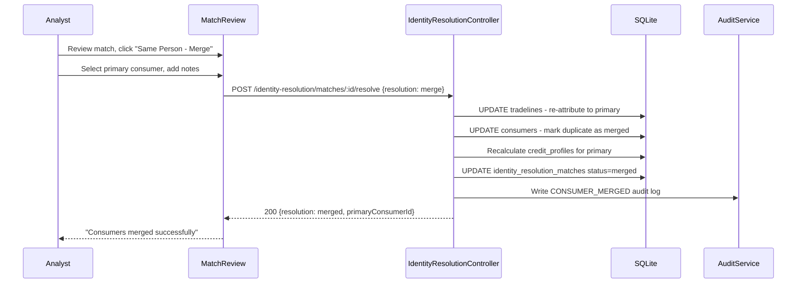
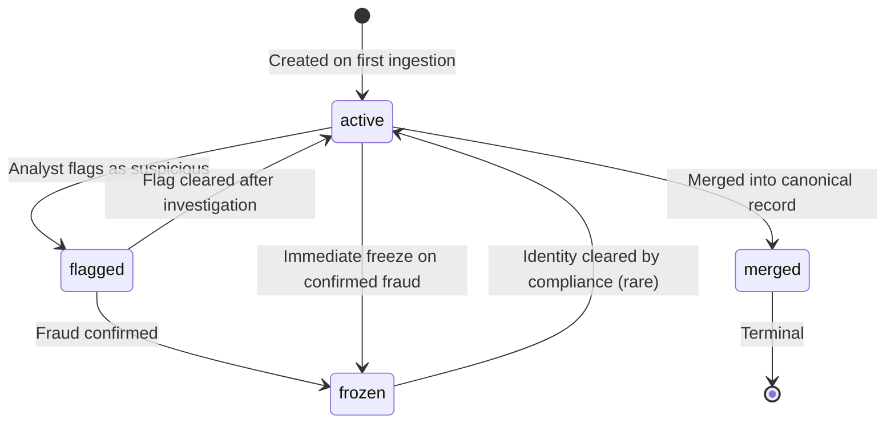

# EPIC-18 — Identity Resolution Agent

> **Epic Code:** IDRES | **Story Range:** IDRES-US-001–007
> **Owner:** Data Engineering / AI Platform Team | **Priority:** P0
> **Implementation Status:** ⚠️ Partial (DB schema partial; backend API and resolution engine entirely missing)
> **Gap Note:** The `consumers` table has hash columns (`national_id_hash`, `phone_hash`, `email_hash`) enabling cross-institution matching. The full identity resolution engine, APIs, and UI are not yet implemented.

---

## 1. Executive Summary

### Purpose
The Identity Resolution Agent is the deduplication and identity governance engine for the HCB credit bureau. In a multi-institution bureau, the same consumer may be submitted by multiple member institutions with slightly different records (different name spellings, same national ID, different phone numbers). The Identity Resolution Agent detects, scores, and resolves these duplicates to maintain a single, authoritative consumer record per individual — the bureau's "golden record."

### Business Value
- A deduplicated consumer registry ensures credit scores reflect a single consumer's complete history, not a fragmented view
- Hash-based matching (SHA-256) enables cross-institution matching without exposing raw PII to the bureau
- Confidence scoring allows automated resolution of high-confidence matches and human review of uncertain ones
- Frozen/flagged consumer records prevent fraudulent identity manipulation from affecting credit decisions
- Full audit trail of every resolution decision meets regulatory requirements for consumer rights under data protection laws

### Key Capabilities
1. Consumer identity lookup by national ID, phone, or email hash
2. Cross-institution duplicate detection using fuzzy and exact hash matching
3. Match confidence scoring (0.0–1.0) with match reason attribution
4. Human-in-the-loop review workflow for medium-confidence matches
5. Merge (resolve) or dismiss duplicate consumer records
6. Flag and freeze suspicious consumer identities
7. Resolution workflow history and audit trail
8. Integration with Data Governance (EPIC-06) match review UI stubs

---

## 2. Scope

### In Scope
- Identity resolution API (lookup, dedup, match review, resolve, flag/freeze)
- Confidence scoring engine (hash match, fuzzy name match, multi-field match)
- Human review workflow for medium-confidence matches
- Consumer merge / dismiss logic
- Consumer flag and freeze operations
- Resolution workflow history
- Full audit logging per resolution action
- Integration with `MatchReview.tsx` and `AutoMappingReview.tsx` UI stubs (EPIC-06)

### Out of Scope
- Biometric identity verification
- Real-time stream-based deduplication (bulk/scheduled only)
- Cross-bureau (external bureau) identity resolution
- Consumer self-service identity dispute portal

---

## 3. Personas

| Persona | Role | Needs |
|---------|------|-------|
| Bureau Analyst | ANALYST | Review match results, make resolution decisions |
| Bureau Administrator | BUREAU_ADMIN | Manage flagged/frozen consumers, audit resolutions |
| Compliance Officer | BUREAU_ADMIN | Full audit trail of all identity decisions |
| Identity Resolution Engine | Internal Service | Automated hash matching and scoring |

---

## 4. Identity Resolution Algorithm

### Hash-Based Matching

All consumer PII is **hashed at ingestion** using SHA-256:

```java
// Ingestion time (batch + real-time API)
String nationalIdHash = DigestUtils.sha256Hex(nationalIdType + ":" + nationalId.trim().toUpperCase());
String phoneHash = DigestUtils.sha256Hex(normalizePhone(phone));
String emailHash = DigestUtils.sha256Hex(email.trim().toLowerCase());
```

### Match Scoring Matrix

| Match Combination | Confidence Score |
|------------------|-----------------|
| `national_id_hash` exact match | 1.0 (definitive) |
| `national_id_hash` + `phone_hash` | 0.98 |
| `phone_hash` + `email_hash` | 0.85 |
| `national_id_hash` only | 0.95 |
| `phone_hash` only | 0.70 |
| `email_hash` only | 0.60 |
| Fuzzy name + `phone_hash` | 0.75 |

### Resolution Thresholds

| Confidence Range | Action |
|-----------------|--------|
| ≥ 0.95 | Auto-resolve (merge without human review) |
| 0.70–0.94 | Human review required |
| < 0.70 | No match (different consumers) |

---

## 5. Epic-Level UI Requirements

### Screens

| Screen | Path | Description |
|--------|------|-------------|
| Match Review | `/data-governance/match-review` | Consumer match review workflow (stub in EPIC-06) |
| Identity Resolution History | `/data-governance/identity-resolution` | Resolution decisions history |

### Component Behavior
- **Match card:** Shows both consumer records side-by-side with matching fields highlighted
- **Confidence indicator:** Color-coded meter: ≥0.95=green, 0.70-0.94=orange, <0.70=gray
- **Match reasons:** Pill badges: "National ID Match", "Phone Match", "Email Match"
- **Action buttons:** "Merge (Same Person)" | "Dismiss (Different People)" | "Flag for Review"
- **Frozen consumer badge:** Red "FROZEN" badge on consumer records

---

## 6. Story-Centric Requirements

---

### IDRES-US-001 — Look Up Consumer by National ID

#### 1. Description
> As a bureau analyst,
> I want to query a consumer record by national ID,
> So that I can verify their existence and view their credit history summary.

#### 2. Status: ❌ Missing API

#### 3. Planned API

`GET /api/v1/identity-resolution/consumers?nationalIdType=PAN&nationalId=ABCDE1234F`

**Processing:** Hash the provided `nationalId` and look up `consumers.national_id_hash`.

**Response (found):**
```json
{
  "consumerId": 101,
  "nationalIdType": "PAN",
  "institutionCount": 3,
  "firstSeenAt": "2021-04-01T00:00:00Z",
  "lastUpdatedAt": "2026-03-31T00:00:00Z",
  "consumerStatus": "active",
  "tradelineCount": 7,
  "creditProfileSummary": {
    "totalExposure": 850000,
    "activeAccounts": 3,
    "dpdBand": "0"
  }
}
```

**Response (not found):**
```json
{
  "consumerId": null,
  "found": false,
  "message": "No consumer record found for the provided national ID"
}
```

#### 4. Database Query

```sql
DECLARE nationalIdHash = SHA-256(:nationalIdType + ':' + UPPER(TRIM(:nationalId)));

SELECT c.id, c.national_id_type, c.reporting_institution_id,
       COUNT(DISTINCT t.reporting_institution_id) as institution_count,
       COUNT(t.id) as tradeline_count,
       c.consumer_status
FROM consumers c
LEFT JOIN tradelines t ON t.consumer_id = c.id
WHERE c.national_id_hash = :hash
GROUP BY c.id;
```

#### 5. Security Requirements
- The `nationalId` query parameter is **never logged** (only the hash is logged)
- Hash computed server-side — raw value never persisted beyond the request
- Audit log: `CONSUMER_LOOKUP` with hashed identifier only

#### 6. Definition of Done
- [ ] GET /identity-resolution/consumers returns consumer record by hashed ID
- [ ] Raw national ID never logged or stored
- [ ] Audit log written with hashed identifier

---

### IDRES-US-002 — Multi-Source Identity Deduplication

#### 1. Description
> As the identity resolution engine,
> I want to detect potential duplicate consumers across all member institutions,
> So that the bureau database remains canonical and deduplicated.

#### 2. Status: ❌ Missing

#### 3. Deduplication Trigger

Deduplication runs:
1. **On batch ingestion completion** — check newly ingested consumers against existing
2. **On real-time submission** — check against existing consumers in `consumers` table
3. **Scheduled job** — nightly full-scan deduplication across all consumers

#### 4. Planned API

`POST /api/v1/identity-resolution/dedup`

**Request:**
```json
{
  "scope": "full",
  "institutionId": null,
  "reportingPeriod": "2026-03-31"
}
```

**Response (202 Accepted):**
```json
{
  "dedupJobId": "DEDUP-2026-031-001",
  "status": "initiated",
  "estimatedCompletionTime": "PT10M"
}
```

#### 5. Deduplication Algorithm

```
For each newly ingested consumer C:
  Query candidates: consumers WHERE (
    national_id_hash = C.national_id_hash OR
    phone_hash = C.phone_hash OR
    email_hash = C.email_hash
  ) AND id != C.id

  For each candidate:
    score = calculateMatchScore(C, candidate)
    matchReasons = identifyMatchReasons(C, candidate)

    IF score >= 0.95: auto-merge → mark duplicate, assign to primary
    IF score >= 0.70: insert into identity_resolution_matches (pending_review)
    ELSE: no action
```

#### 6. Database

**Proposed table:** `identity_resolution_matches`
```sql
CREATE TABLE IF NOT EXISTS identity_resolution_matches (
  id TEXT PRIMARY KEY,
  consumer_id_1 INTEGER NOT NULL REFERENCES consumers(id),
  consumer_id_2 INTEGER NOT NULL REFERENCES consumers(id),
  confidence_score REAL NOT NULL,
  match_reasons TEXT, -- JSON array of match reasons
  match_status TEXT DEFAULT 'pending_review', -- pending_review, merged, dismissed, flagged
  reviewed_by_user_id INTEGER REFERENCES users(id),
  reviewed_at DATETIME,
  resolution_notes TEXT,
  created_at DATETIME DEFAULT CURRENT_TIMESTAMP
);
```

#### 7. Definition of Done
- [ ] Deduplication triggered on batch completion
- [ ] Match score calculated using hash matrix
- [ ] Auto-merge applied for ≥0.95 score
- [ ] Medium-confidence matches queued for human review
- [ ] `identity_resolution_matches` table created

---

### IDRES-US-003 — Review Match Confidence Scores

#### 1. Description
> As a bureau analyst,
> I want to see confidence scores for potential consumer matches,
> So that I can make informed resolution decisions.

#### 2. Status: ⚠️ Partial

`MatchReview.tsx` is a stub UI in `src/pages/data-governance/`. The backend API is missing.

#### 3. Planned API

`GET /api/v1/identity-resolution/matches?status=pending_review&page=0&size=20`

**Response:**
```json
{
  "content": [
    {
      "matchId": "match-uuid-001",
      "consumer1": {
        "consumerId": 101,
        "institutionName": "First National Bank",
        "nationalIdType": "PAN",
        "nationalIdHashPreview": "ab12...ef56",
        "firstSeenAt": "2021-04-01"
      },
      "consumer2": {
        "consumerId": 205,
        "institutionName": "Finance Corp",
        "nationalIdType": "PAN",
        "nationalIdHashPreview": "ab12...ef56",
        "firstSeenAt": "2022-08-15"
      },
      "confidenceScore": 0.94,
      "matchReasons": ["national_id_hash_match", "phone_hash_match"],
      "matchStatus": "pending_review",
      "createdAt": "2026-03-31T10:00:00Z"
    }
  ]
}
```

#### 4. UI Component Design (`MatchReview.tsx`)
- Card-based layout showing consumer 1 and consumer 2 side by side
- Matching fields highlighted in the same colour
- Confidence score gauge (0.0–1.0 with colour coding)
- Match reason pills
- Action buttons: "Same Person → Merge" | "Different People → Dismiss"

#### 5. Definition of Done
- [ ] GET /identity-resolution/matches returns pending matches with scores
- [ ] MatchReview.tsx updated to use real API
- [ ] Confidence gauge renders correctly

---

### IDRES-US-004 — Resolve Duplicate Consumer Records

#### 1. Description
> As a bureau analyst,
> I want to merge or dismiss matched duplicate records,
> So that the canonical consumer is established in the bureau database.

#### 2. Status: ❌ Missing

#### 3. Planned API

`POST /api/v1/identity-resolution/matches/:matchId/resolve`

**Request:**
```json
{
  "resolution": "merge",
  "primaryConsumerId": 101,
  "notes": "Same customer confirmed by national ID hash match. Consumer 101 is the canonical record (older, more tradelines)."
}
```
**Or:**
```json
{
  "resolution": "dismiss",
  "notes": "Different customers — same phone number (shared family phone), different national IDs."
}
```

#### 4. Merge Logic

```
On resolution = "merge":
  1. Set consumer_id_2 as duplicate of consumer_id_1
     UPDATE consumers SET canonical_consumer_id = primaryConsumerId, consumer_status = 'merged'
     WHERE id = duplicateConsumerId

  2. Re-attribute tradelines from duplicate to primary:
     UPDATE tradelines SET consumer_id = primaryConsumerId WHERE consumer_id = duplicateConsumerId

  3. Recalculate credit_profiles for primaryConsumerId

  4. Update identity_resolution_matches: status = 'merged'

  5. Write audit log: CONSUMER_MERGED

On resolution = "dismiss":
  UPDATE identity_resolution_matches SET status = 'dismissed', reviewed_at = NOW()
  Write audit log: CONSUMER_MATCH_DISMISSED
```

#### 5. Database Impact

```sql
-- Merge: re-attribute tradelines
UPDATE tradelines
SET consumer_id = :primaryConsumerId
WHERE consumer_id = :duplicateConsumerId;

-- Mark duplicate
UPDATE consumers
SET consumer_status = 'merged',
    canonical_consumer_id = :primaryConsumerId
WHERE id = :duplicateConsumerId;
```

#### 6. Swimlane Diagram



#### 7. Definition of Done
- [ ] Merge re-attributes all tradelines to primary consumer
- [ ] Duplicate consumer marked as merged with canonical reference
- [ ] Dismiss removes match from pending queue
- [ ] Audit log written with full resolution details

---

### IDRES-US-005 — Flag or Freeze a Suspicious Consumer Identity

#### 1. Description
> As a bureau analyst,
> I want to flag or freeze a consumer record,
> So that suspicious identities are quarantined pending investigation.

#### 2. Planned API

`PATCH /api/v1/consumers/:id/status`

**Request:**
```json
{
  "consumerStatus": "flagged",
  "reason": "Potential synthetic identity — national ID format inconsistency detected"
}
```
**Or:**
```json
{
  "consumerStatus": "frozen",
  "reason": "Confirmed fraudulent identity — reported by institution FNB"
}
```

#### 3. Consumer Status State Machine



#### 4. Impact on Bureau Operations

| Consumer Status | Enquiry API | Batch Submission | Alert |
|----------------|:-----------:|:----------------:|:-----:|
| `active` | ✅ Returns profile | ✅ Accepted | — |
| `flagged` | ✅ Returns with flag warning | ✅ Accepted with flag | Warning |
| `frozen` | ❌ Returns ERR_CONSUMER_FROZEN | ❌ Rejected | Critical |
| `merged` | ✅ Redirected to canonical | N/A | — |

#### 5. Definition of Done
- [ ] Consumer status updated via PATCH
- [ ] Frozen consumers rejected from enquiry and submission
- [ ] Flag returned as warning in enquiry response
- [ ] Audit log written with reason

---

### IDRES-US-006 — View Identity Resolution Workflow History

#### 1. Description
> As a compliance officer,
> I want to see all past resolution decisions with analyst attribution,
> So that I have a complete audit trail for regulatory purposes.

#### 2. Planned API

`GET /api/v1/identity-resolution/history?consumerId=&status=&dateFrom=&dateTo=&page=0&size=20`

**Response:**
```json
{
  "content": [
    {
      "matchId": "match-uuid-001",
      "resolution": "merge",
      "primaryConsumerId": 101,
      "duplicateConsumerId": 205,
      "confidenceScore": 0.94,
      "notes": "Same customer confirmed by national ID hash match",
      "resolvedByUser": {"id": 3, "displayName": "Data Analyst"},
      "resolvedAt": "2026-03-31T11:00:00Z"
    }
  ]
}
```

#### 3. Definition of Done
- [ ] History view shows all resolved and dismissed matches
- [ ] Filter by consumer ID, resolution type, date range
- [ ] Each entry shows analyst, timestamp, and resolution notes

---

### IDRES-US-007 — Audit Trail for Resolution Decisions

#### 1. Description
> As a compliance officer,
> I want every identity resolution action logged with user, timestamp, and rationale,
> So that I meet regulatory traceability requirements for consumer data handling.

#### 2. Required Audit Events

| Action | `action_type` | `entity_type` |
|--------|--------------|---------------|
| Consumer merged | `CONSUMER_MERGED` | `consumer` |
| Match dismissed | `CONSUMER_MATCH_DISMISSED` | `consumer` |
| Consumer flagged | `CONSUMER_FLAGGED` | `consumer` |
| Consumer frozen | `CONSUMER_FROZEN` | `consumer` |
| Consumer unfrozen | `CONSUMER_UNFROZEN` | `consumer` |
| Deduplication run | `DEDUP_JOB_STARTED` | `system` |
| Consumer looked up | `CONSUMER_LOOKUP` | `consumer` |

#### 3. Audit Log Structure

```sql
INSERT INTO audit_logs (
  user_id, action_type, entity_type, entity_id,
  description, audit_outcome, occurred_at
)
VALUES (
  :analystId, 'CONSUMER_MERGED', 'consumer', :primaryConsumerId,
  'Consumer merged: canonical ID ' || :primaryId || ', duplicate ID ' || :duplicateId ||
  ' from institution ' || :institutionName || '. Confidence: ' || :score,
  'success', CURRENT_TIMESTAMP
);
```

#### 4. Compliance Requirements
- Audit records **immutable** — no updates or deletes
- Consumer national IDs stored **only as hashes** in audit descriptions
- Resolution notes must be present (minimum 20 characters)
- All 7 audit event types must fire for every applicable action

#### 5. Definition of Done
- [ ] All 7 audit event types implemented
- [ ] Consumer identifiers appear only as hashes in audit logs
- [ ] Resolution notes mandatory and stored in audit description
- [ ] Audit log accessible from Identity Resolution history page

---

## 8. Epic API Summary

| Endpoint | Method | Auth | Description | Status |
|----------|--------|------|-------------|--------|
| `GET /api/v1/identity-resolution/consumers` | GET | Bearer (Analyst) | Look up consumer by ID | ❌ Missing |
| `POST /api/v1/identity-resolution/dedup` | POST | Bearer (Admin) | Trigger deduplication job (202) | ❌ Missing |
| `GET /api/v1/identity-resolution/matches` | GET | Bearer (Analyst) | List matches pending review | ❌ Missing |
| `POST /api/v1/identity-resolution/matches/:id/resolve` | POST | Bearer (Analyst) | Merge or dismiss match | ❌ Missing |
| `PATCH /api/v1/consumers/:id/status` | PATCH | Bearer (Admin) | Flag or freeze consumer | ❌ Missing |
| `GET /api/v1/identity-resolution/history` | GET | Bearer (Analyst) | Resolution history | ❌ Missing |

---

## 9. Database Summary

| Table | Key Fields | Notes |
|-------|------------|-------|
| `consumers` | `national_id_hash`, `phone_hash`, `email_hash`, `consumer_status`, `canonical_consumer_id` | Core identity table |
| `identity_resolution_matches` | `consumer_id_1`, `consumer_id_2`, `confidence_score`, `match_reasons`, `match_status` | **Needs to be created** |
| `audit_logs` | `action_type=CONSUMER_*`, `entity_type=consumer` | Resolution audit trail |
| `tradelines` | `consumer_id` (re-attributed on merge) | Credit data |

---

## 10. Epic Workflows

### Workflow: Automated Deduplication on Batch Completion
```
Batch job completes → POST /identity-resolution/dedup →
  Engine scans new consumers vs existing →
  Exact hash match (score ≥ 0.95): auto-merge → tradelines re-attributed →
  Medium confidence (0.70–0.94): insert identity_resolution_matches →
  Analyst reviews in MatchReview.tsx →
  Analyst merges or dismisses →
  Audit log written
```

### Workflow: Suspicious Identity Handling
```
Enquiry returns unusual patterns for consumer →
  Analyst investigates in identity resolution lookup →
  Consumer shows multiple conflicting records →
  Analyst flags consumer: PATCH /consumers/:id/status {flagged} →
  Future enquiries return profile with flag warning →
  Investigation concludes: fraud confirmed →
  Analyst freezes consumer: PATCH {frozen} →
  All future enquiries for this consumer return ERR_CONSUMER_FROZEN
```

---

## 11. KPIs

| KPI | Target |
|-----|--------|
| Deduplication accuracy (true positive rate) | > 99% |
| Auto-resolution rate (≥0.95 confidence) | > 60% of detected duplicates |
| Mean time to resolve pending match | < 1 business day |
| False positive rate (wrong merges) | < 0.01% |
| Consumer frozen reversal rate | < 1% (indicates false freezes) |

---

## 12. Risks

| Risk | Impact | Mitigation |
|------|--------|-----------|
| Wrong auto-merge (false positive) | Data integrity — tradelines from two different people merged | Conservative threshold (0.95); merge reversal capability |
| Hash collision | Infinitesimally rare but catastrophic if occurs | SHA-256 collision probability: 2^-128 — acceptable |
| Resolution engine not implemented | Deduplication does not occur | Phase 1 critical priority |
| `identity_resolution_matches` table missing | Cannot store pending matches | Create in next DB migration |

---

## 13. Gap Analysis

| Gap | Story | Severity |
|-----|-------|----------|
| All identity resolution APIs missing from Spring | IDRES-US-001–007 | Critical |
| `identity_resolution_matches` table not in `create_tables.sql` | IDRES-US-002 | Critical |
| `consumers` table missing `canonical_consumer_id` column | IDRES-US-004 | Critical |
| `MatchReview.tsx` is a stub | IDRES-US-003 | High |
| `consumers.consumer_status` column may not have flag/freeze values | IDRES-US-005 | High |

---

## 14. Execution Roadmap

| Phase | Stories | Description |
|-------|---------|-------------|
| Phase 1 | IDRES-US-001, 007 | Consumer lookup API + audit logging infrastructure |
| Phase 2 | IDRES-US-002, 003 | Deduplication engine + match review API + MatchReview.tsx wired |
| Phase 3 | IDRES-US-004, 005 | Merge/dismiss resolution + flag/freeze consumer status |
| Phase 4 | IDRES-US-006 | Resolution history, compliance reports, consumer rights portal |
