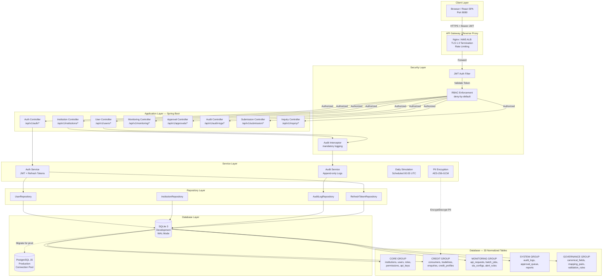
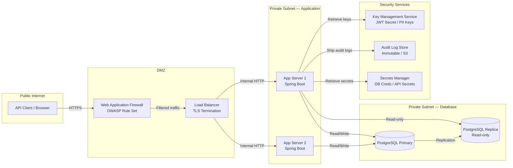
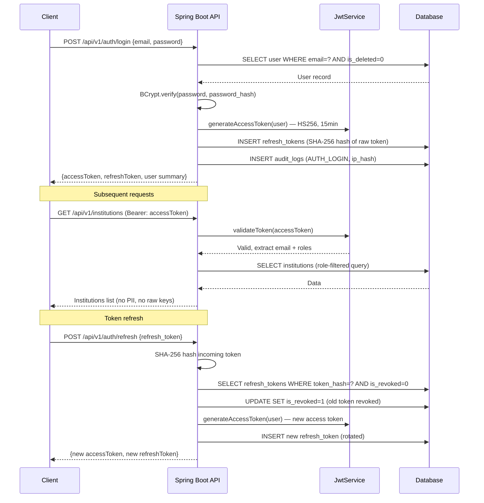
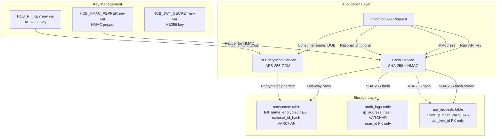
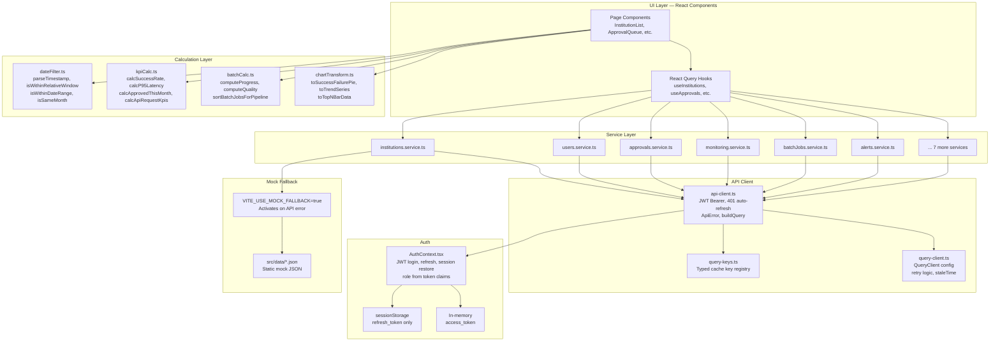

# HCB Platform — System Architecture & Network Diagram

**Version:** 3.0.0 | **Date:** 2026-03-28

---

## System Architecture (Mermaid)



---

## Network Architecture (Production)



---

## JWT Authentication Flow



---

## Data Protection Architecture



---

## Frontend API Integration Architecture (v2.0)

This section documents the layered frontend architecture introduced during the API Integration Phase.



### Frontend Layer Responsibilities

| Layer | Responsibility | Key Files |
|-------|---------------|-----------|
| UI Layer | Render, event handling, layout | `src/pages/**/*.tsx`, `src/components/**/*.tsx` |
| Calculation Layer | Pure functions, no side effects | `src/lib/calc/*.ts` |
| Service Layer | API calls + mock fallback switching | `src/services/*.service.ts` |
| React Query Hooks | Cache management, mutations, toast on success/error | `src/hooks/api/*.ts` |
| API Client | JWT token lifecycle, error normalisation | `src/lib/api-client.ts` |
| Auth Context | Session init, login/logout, role propagation | `src/contexts/AuthContext.tsx` |

### Token Lifecycle (Frontend)

```
Login POST /api/v1/auth/login
  → access_token stored IN MEMORY (never localStorage)
  → refresh_token stored in sessionStorage

API call with Authorization: Bearer <access_token>
  → If 401: auto-enqueue refresh via shared promise
  → Refresh POST /api/v1/auth/refresh
  → On success: rotate both tokens, retry original request
  → On refresh fail: dispatch auth:session-expired event → redirect to /login

Logout POST /api/v1/auth/logout
  → clearTokens() called
  → redirect to /login
```
