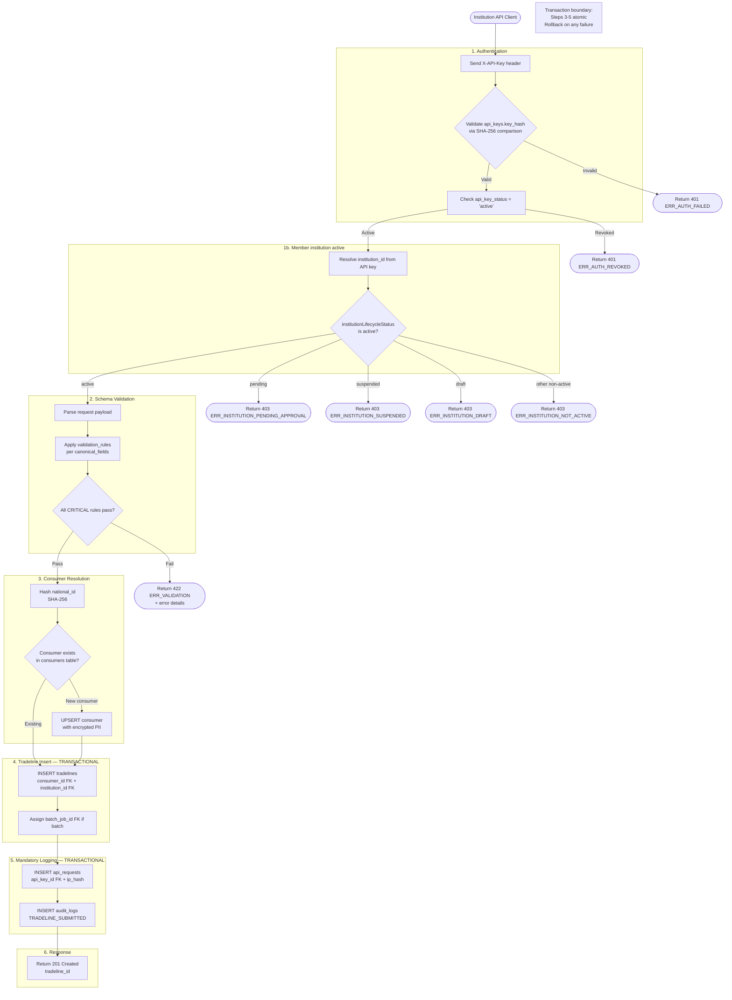
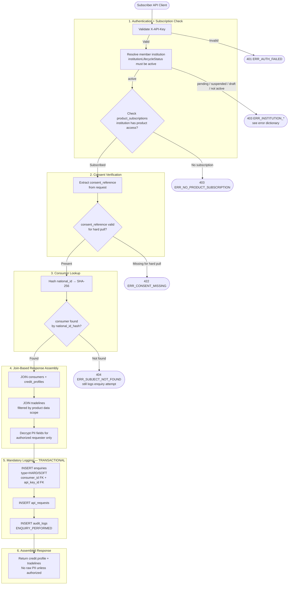
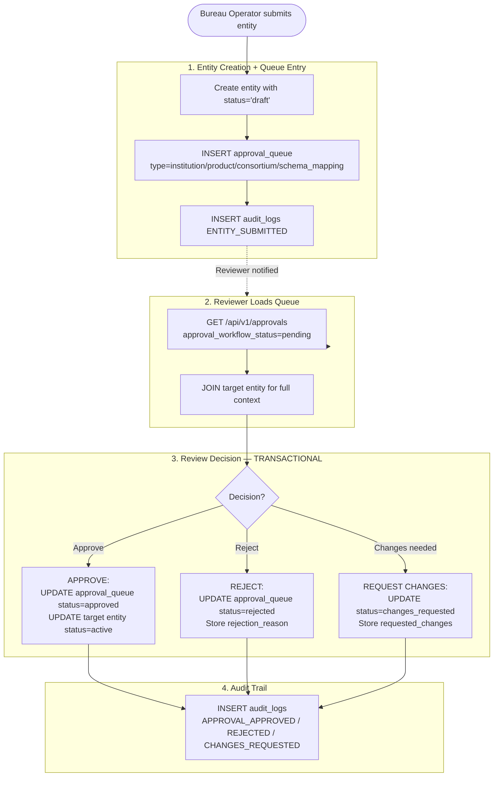
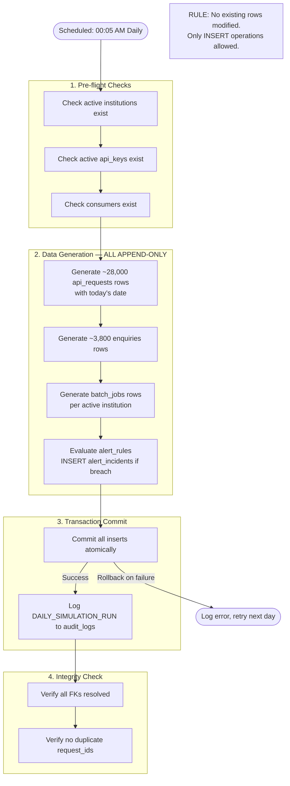
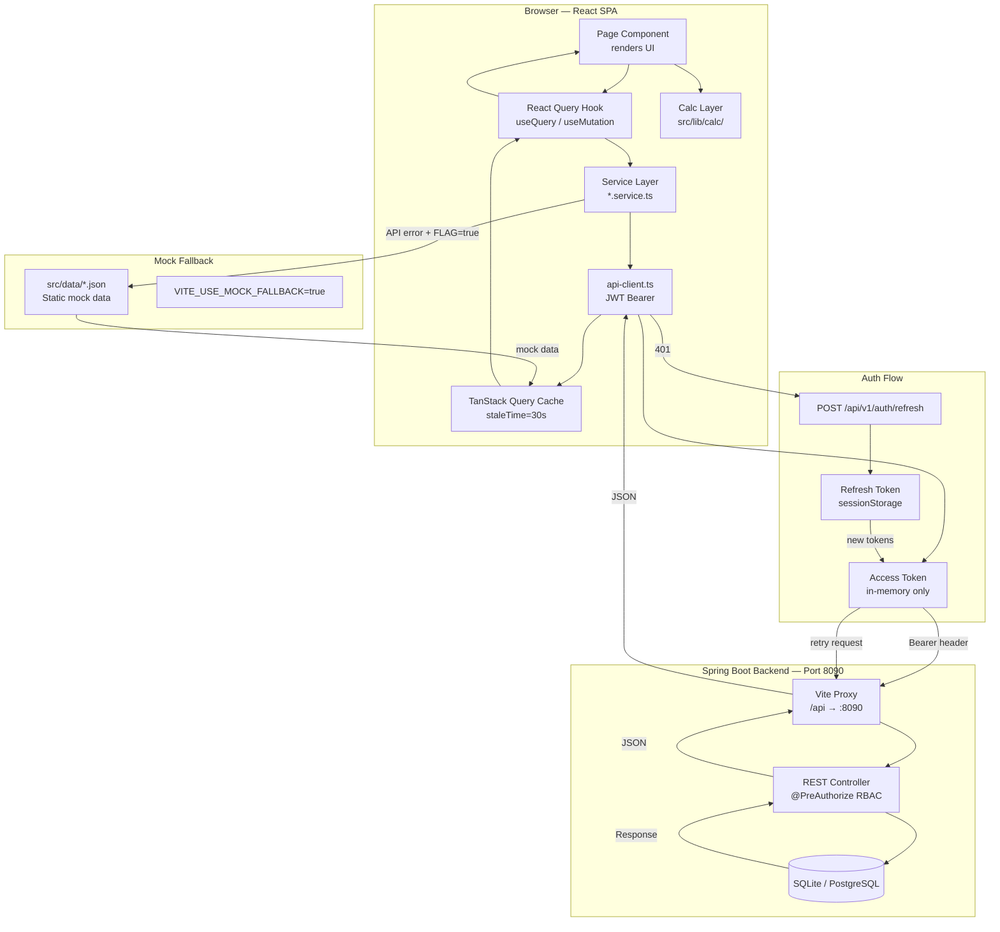
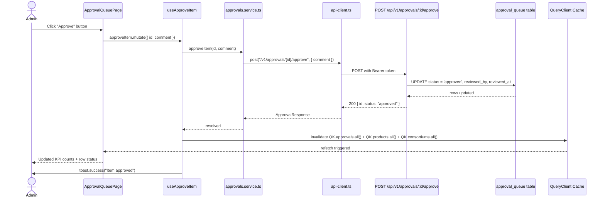

# HCB Platform — Data Flow Diagrams

**Version:** 3.0.1 | **Date:** 2026-03-30

---

## Member institution lifecycle gate (Data Submission, batch, Enquiry)

**Rule:** For **Data Submission API** (real-time tradeline / event ingress), **batch file ingestion** (processing member-submitted batches), and **Enquiry API** (subscriber credit pulls), the **member institution** resolved from the API key (or batch ownership) must have **`institutionLifecycleStatus === active`**. If the member is **pending approval**, **suspended**, **draft**, or any other non-active state, the gateway must **reject the request** with **HTTP 403** and a **stable `error` code** plus a safe **`message`** (see [Global-API-Error-Dictionary.md](./Global-API-Error-Dictionary.md) §2.3). This check runs **after** API-key authentication and **before** schema validation or business processing. Operator-only portal actions that do not submit bureau traffic (for example **cancelling** a batch job from the admin UI) may remain allowed when the member is not active, unless product policy says otherwise.

**Fastify dev API:** `POST /api/v1/batch-jobs/:id/retry` enforces the same rule when the job carries an **`institution_id`** (retry re-queues processing). **`POST …/cancel`** does not apply this gate so operators can stop jobs for suspended members.

---

## Data Flow 1: Tradeline Submission (API)

---

## Data Flow 2: Credit Bureau Inquiry

---

## Data Flow 3: Approval Workflow

**Fastify dev API (in-memory):** **Register member** (`POST /api/v1/institutions`) prepends `type: institution` with `metadata.institutionId` and keeps the row in `GET /api/v1/institutions` (typically **pending** until **approve** → **active**). New **data products** use `POST /api/v1/products` with `approval_pending` → `type: product` / `metadata.productId`. New **consortia** use `POST /api/v1/consortiums` with `approval_pending` → `type: consortium` / `metadata.consortiumId`. **Schema Mapper:** `POST /api/v1/schema-mapper/ingest` stores a versioned schema; `POST /api/v1/schema-mapper/mappings` runs an async mapping job; `POST …/mappings/:id/submit-approval` prepends `type: schema_mapping` with `metadata.mappingId` — **approve** sets the mapping to **active** (see `server/src/schemaMapper.ts`). **Validation Rules (portal):** operators read **data submitter** members via `GET /api/v1/institutions?role=dataSubmitter` and **field paths per source type** via `GET /api/v1/schema-mapper/schemas/source-type-fields?sourceType=` (read-only for rule authoring in dev). **Schema Mapper wizard Step 1** reads **Source Type** / **Data Category** lists via `GET /api/v1/schema-mapper/wizard-metadata` (seeded from `schema-mapper.json`).

---

## Data Flow 4: Daily Simulation (Append-Only)

---

## Data Flow 5: Frontend API Integration (v2.0)

### Frontend API Integration Rules

- All API calls go through `api-client.ts` — direct `fetch()` calls are forbidden in page components.
- Access tokens are stored **in memory only** — never in `localStorage`.
- Refresh tokens are stored in `sessionStorage` — wiped when tab closes.
- All KPI calculations use `src/lib/calc/` pure functions — never inline math in components.
- On API error: if `VITE_USE_MOCK_FALLBACK=true`, service returns mock data silently.
- On 401 Unauthorized: `api-client.ts` auto-retries once after refreshing the token.

---

## Data Flow 6: Approval Queue Action Flow (v2.0)

